# 网关监控

<cite>
**本文引用的文件**
- [channels.ts](file://src/gateway/server-methods/channels.ts)
- [health.ts](file://src/gateway/server-methods/health.ts)
- [health-state.ts](file://src/gateway/server/health-state.ts)
- [ws-log.ts](file://src/gateway/ws-log.ts)
- [provider.lifecycle.ts](file://src/discord/monitor/provider.lifecycle.ts)
- [usage-aggregates.ts](file://src/shared/usage-aggregates.ts)
- [failover-error.ts](file://src/agents/failover-error.ts)
- [provider-usage.fetch.shared.ts](file://src/infra/provider-usage.fetch.shared.ts)
- [health.ts](file://src/commands/health.ts)
- [HealthStore.swift](file://apps/macos/Sources/OpenClaw/HealthStore.swift)
- [test-perf-budget.mjs](file://scripts/test-perf-budget.mjs)
- [usage-metrics.ts](file://ui/src/ui/views/usage-metrics.ts)
- [run.ts](file://src/agents/pi-embedded-runner/run.ts)
</cite>

## 目录

1. [简介](#简介)
2. [项目结构](#项目结构)
3. [核心组件](#核心组件)
4. [架构总览](#架构总览)
5. [详细组件分析](#详细组件分析)
6. [依赖关系分析](#依赖关系分析)
7. [性能考量](#性能考量)
8. [故障排查指南](#故障排查指南)
9. [结论](#结论)
10. [附录](#附录)

## 简介

本文件面向OpenClaw网关的运维与平台工程团队，提供一套完整的监控解决方案，覆盖以下关键领域：

- WebSocket连接状态监控：连接建立、断开、重连、HELLO超时与恢复等事件的可观测性与告警。
- 消息传输统计：请求/响应计数、延迟聚合、慢请求阈值与日志精简策略。
- 会话生命周期跟踪：会话键解析、运行期状态与活动时间线。
- HTTP API调用监控：健康检查与状态查询的缓存与刷新策略、错误返回与格式化。
- 请求响应时间分析与错误率统计：基于聚合工具与日志采样的指标采集。
- 通道适配器状态监控：各通道插件的配置、探测、审计与账户级健康快照。
- 消息路由性能与并发处理：通道账户绑定、默认账户解析与路由选择。
- 网关健康检查端点与服务可用性检测：健康快照构建、广播更新与自动刷新。
- 自动故障转移机制：基于HTTP状态码与错误模式的失败分类与降级策略。
- 性能指标收集、瓶颈识别与容量规划：日志慢请求标记、使用量聚合与UI可视化。
- 安全监控、访问审计与异常行为检测：凭据权限检查、攻击面评估与威胁模型。

## 项目结构

OpenClaw网关监控涉及多个层次：

- 网关RPC层：定义“channels.status”、“health”等方法，负责对外暴露状态与健康信息。
- 插件监控层：以Discord为例，实现生命周期管理、重连看门狗、HELLO超时与恢复逻辑。
- 日志与指标层：WebSocket日志系统、使用量聚合、UI指标视图。
- 健康与状态层：健康快照构建、缓存与广播、状态版本号管理。
- 错误与故障转移：HTTP状态分类、错误模式匹配与失败原因归类。

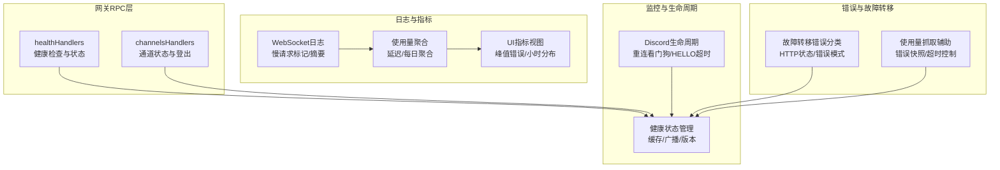

**图表来源**

- [health.ts:10-37](file://src/gateway/server-methods/health.ts#L10-L37)
- [channels.ts:69-236](file://src/gateway/server-methods/channels.ts#L69-L236)
- [provider.lifecycle.ts:18-344](file://src/discord/monitor/provider.lifecycle.ts#L18-L344)
- [health-state.ts:49-85](file://src/gateway/server/health-state.ts#L49-L85)
- [ws-log.ts:256-439](file://src/gateway/ws-log.ts#L256-L439)
- [usage-aggregates.ts:32-66](file://src/shared/usage-aggregates.ts#L32-L66)
- [usage-metrics.ts:1-48](file://ui/src/ui/views/usage-metrics.ts#L1-L48)
- [failover-error.ts:151-240](file://src/agents/failover-error.ts#L151-L240)
- [provider-usage.fetch.shared.ts:5-52](file://src/infra/provider-usage.fetch.shared.ts#L5-L52)

**章节来源**

- [health.ts:10-37](file://src/gateway/server-methods/health.ts#L10-L37)
- [channels.ts:69-236](file://src/gateway/server-methods/channels.ts#L69-L236)
- [provider.lifecycle.ts:18-344](file://src/discord/monitor/provider.lifecycle.ts#L18-L344)
- [health-state.ts:49-85](file://src/gateway/server/health-state.ts#L49-L85)
- [ws-log.ts:256-439](file://src/gateway/ws-log.ts#L256-L439)
- [usage-aggregates.ts:32-66](file://src/shared/usage-aggregates.ts#L32-L66)
- [usage-metrics.ts:1-48](file://ui/src/ui/views/usage-metrics.ts#L1-L48)
- [failover-error.ts:151-240](file://src/agents/failover-error.ts#L151-L240)
- [provider-usage.fetch.shared.ts:5-52](file://src/infra/provider-usage.fetch.shared.ts#L5-L52)

## 核心组件

- 健康检查与状态接口：提供“health”和“status”两个RPC方法，支持探针式刷新与缓存命中快速返回。
- 通道状态接口：提供“channels.status”和“channels.logout”，支持按账户维度探测、审计与登出。
- Discord生命周期监控：实现重连看门狗、HELLO超时与恢复、断开记录与错误分类。
- WebSocket日志系统：请求/响应计数、慢请求标记、摘要化输出与敏感信息脱敏。
- 使用量聚合与UI指标：延迟聚合、每日聚合、峰值错误小时分布与令牌估算。
- 故障转移与错误分类：基于HTTP状态码与错误模式的失败原因归类，支持自动降级。
- 健康状态缓存与广播：健康快照缓存、版本号递增、后台刷新与广播更新。

**章节来源**

- [health.ts:10-37](file://src/gateway/server-methods/health.ts#L10-L37)
- [channels.ts:69-236](file://src/gateway/server-methods/channels.ts#L69-L236)
- [provider.lifecycle.ts:18-344](file://src/discord/monitor/provider.lifecycle.ts#L18-L344)
- [ws-log.ts:256-439](file://src/gateway/ws-log.ts#L256-L439)
- [usage-aggregates.ts:32-66](file://src/shared/usage-aggregates.ts#L32-L66)
- [usage-metrics.ts:1-48](file://ui/src/ui/views/usage-metrics.ts#L1-L48)
- [failover-error.ts:151-240](file://src/agents/failover-error.ts#L151-L240)
- [health-state.ts:49-85](file://src/gateway/server/health-state.ts#L49-L85)

## 架构总览

下图展示从客户端到网关RPC、再到插件监控与健康状态管理的整体流程，以及关键监控点（慢请求、错误分类、健康快照）。

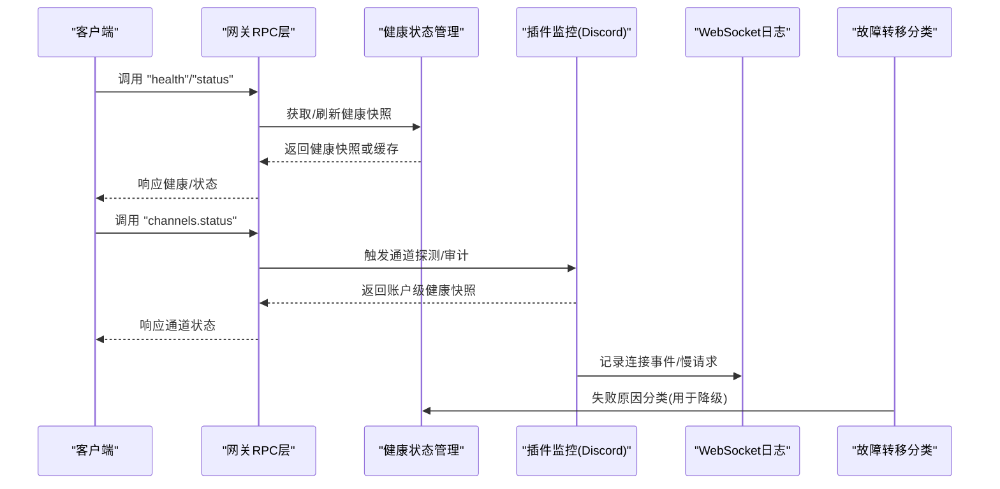

**图表来源**

- [health.ts:10-37](file://src/gateway/server-methods/health.ts#L10-L37)
- [health-state.ts:70-85](file://src/gateway/server/health-state.ts#L70-L85)
- [channels.ts:69-236](file://src/gateway/server-methods/channels.ts#L69-L236)
- [provider.lifecycle.ts:154-242](file://src/discord/monitor/provider.lifecycle.ts#L154-L242)
- [ws-log.ts:256-439](file://src/gateway/ws-log.ts#L256-L439)
- [failover-error.ts:151-240](file://src/agents/failover-error.ts#L151-L240)

## 详细组件分析

### WebSocket连接状态监控

- 关键事件：连接打开/关闭、HELLO超时、重连看门狗触发、恢复成功。
- 实现要点：
  - 监听调试事件，记录最后事件时间与断开详情（含关闭码）。
  - HELLO超时计数与最大连续次数，必要时强制全新识别而非恢复。
  - 重连看门狗在长时间无重连时触发强制停止并记录错误。
  - 连接恢复后清理恢复状态并清除HELLO轮询与超时。
- 指标建议：
  - 连接断开次数、断开原因分布（关闭码）、HELLO超时次数、重连看门狗触发次数。
  - 连接持续时间、平均/中位/95分位恢复时间。

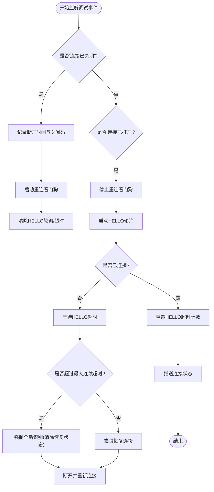

**图表来源**

- [provider.lifecycle.ts:154-242](file://src/discord/monitor/provider.lifecycle.ts#L154-L242)

**章节来源**

- [provider.lifecycle.ts:18-344](file://src/discord/monitor/provider.lifecycle.ts#L18-L344)
- [ws-log.ts:256-439](file://src/gateway/ws-log.ts#L256-L439)

### 消息传输统计与慢请求标记

- 统计维度：请求/响应计数、按会话与连接标识的往返时长、慢请求阈值。
- 实现要点：
  - 在收到请求时记录入站时间，在发出响应时计算耗时并输出日志。
  - 优化模式下仅对失败或超过阈值的响应进行日志输出。
  - 提供摘要化输出，包含方法名、会话键、流类型、序列号等关键元数据。
- 指标建议：
  - 请求/响应吞吐、平均/中位/95分位延迟、慢请求比例。
  - parse-error计数、错误响应比例。

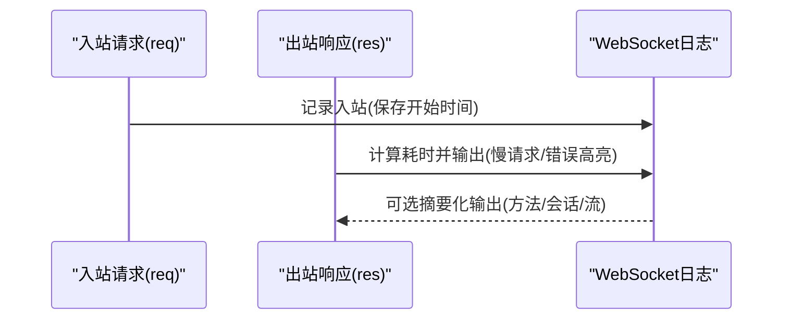

**图表来源**

- [ws-log.ts:256-439](file://src/gateway/ws-log.ts#L256-L439)

**章节来源**

- [ws-log.ts:256-439](file://src/gateway/ws-log.ts#L256-L439)

### 会话生命周期跟踪

- 会话键解析：从事件载荷中提取agent、session与流信息，生成短ID摘要。
- 活动时间线：记录最近入站/出站时间，结合通道活动模块获取最新活动时间。
- 指标建议：
  - 会话活跃度、最近活动时间、事件类型分布（assistant/tool/lifecycle）。

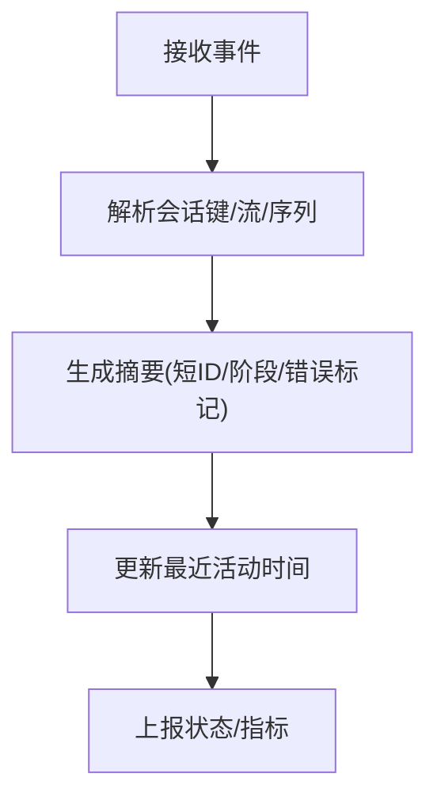

**图表来源**

- [ws-log.ts:166-254](file://src/gateway/ws-log.ts#L166-L254)
- [channels.ts:179-189](file://src/gateway/server-methods/channels.ts#L179-L189)

**章节来源**

- [ws-log.ts:166-254](file://src/gateway/ws-log.ts#L166-L254)
- [channels.ts:179-189](file://src/gateway/server-methods/channels.ts#L179-L189)

### HTTP API调用监控与健康检查

- 健康检查：
  - 支持缓存命中快速返回与后台刷新；探针模式可强制探测。
  - 健康快照包含通道汇总、代理心跳、会话存储信息与时间戳。
- 状态查询：
  - 根据客户端作用域决定是否包含敏感信息。
- 健康状态管理：
  - 缓存当前快照、版本号递增、广播更新、防并发刷新。

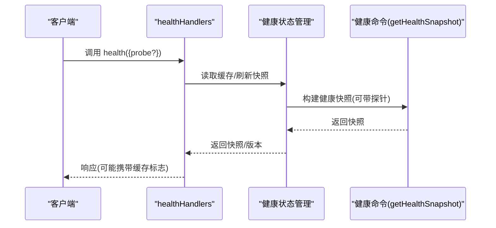

**图表来源**

- [health.ts:10-37](file://src/gateway/server-methods/health.ts#L10-L37)
- [health-state.ts:70-85](file://src/gateway/server/health-state.ts#L70-L85)
- [health.ts:348-523](file://src/commands/health.ts#L348-L523)

**章节来源**

- [health.ts:10-37](file://src/gateway/server-methods/health.ts#L10-L37)
- [health-state.ts:49-85](file://src/gateway/server/health-state.ts#L49-L85)
- [health.ts:348-523](file://src/commands/health.ts#L348-L523)

### 通道适配器状态监控与消息路由性能

- 通道状态：
  - 列举通道插件，解析默认账户与账户列表，按启用/配置状态过滤。
  - 可选执行账户探测与审计，并合并运行时快照与活动时间。
- 路由性能：
  - 通过通道账户绑定与首选账户解析，减少无效探测范围。
  - 默认账户与首选账户优先，降低路由不确定性。

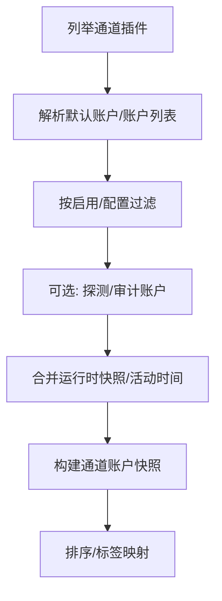

**图表来源**

- [channels.ts:114-236](file://src/gateway/server-methods/channels.ts#L114-L236)

**章节来源**

- [channels.ts:69-236](file://src/gateway/server-methods/channels.ts#L69-L236)

### 自动故障转移机制与错误率统计

- 错误分类：
  - 基于HTTP状态码与错误消息模式，区分格式错误、速率限制、超时、周期用量限制、账单错误等。
  - 对402状态进行细粒度判断（瞬时/账单上限）。
- 失败原因归类：
  - 从错误对象提取状态码/错误码/消息，结合预设规则进行分类。
- 指标建议：
  - 各类别错误占比、错误趋势、失败率与SLA偏离。

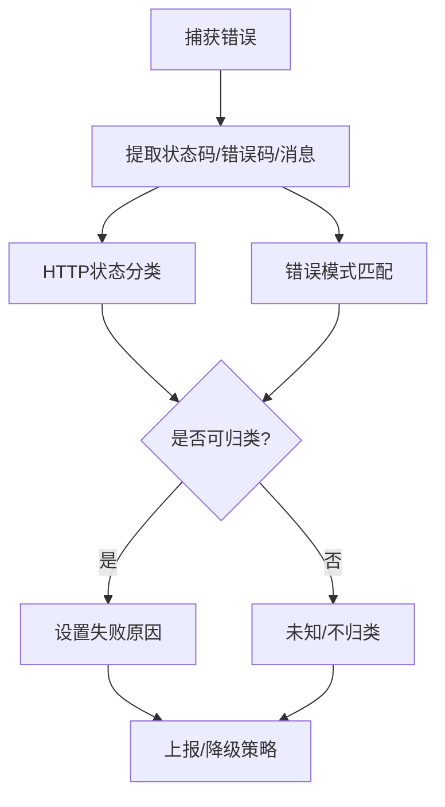

**图表来源**

- [failover-error.ts:151-240](file://src/agents/failover-error.ts#L151-L240)
- [failover-error.ts:96-132](file://src/agents/failover-error.ts#L96-L132)

**章节来源**

- [failover-error.ts:96-132](file://src/agents/failover-error.ts#L96-L132)
- [failover-error.ts:151-240](file://src/agents/failover-error.ts#L151-L240)

### 网关性能指标收集与瓶颈识别

- 慢请求标记：优化模式下仅输出慢请求与错误响应，降低日志噪声。
- 使用量聚合：支持延迟聚合与每日聚合，便于趋势分析。
- UI指标：峰值错误小时分布、令牌估算与小时标签。
- 性能预算脚本：墙钟时间限制与回归阈值，用于回归测试与性能基线。

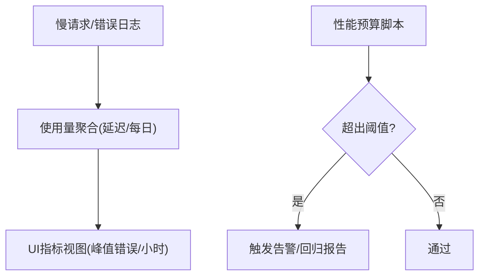

**图表来源**

- [ws-log.ts:316-378](file://src/gateway/ws-log.ts#L316-L378)
- [usage-aggregates.ts:32-66](file://src/shared/usage-aggregates.ts#L32-L66)
- [usage-metrics.ts:1-48](file://ui/src/ui/views/usage-metrics.ts#L1-L48)
- [test-perf-budget.mjs:98-127](file://scripts/test-perf-budget.mjs#L98-L127)

**章节来源**

- [ws-log.ts:316-378](file://src/gateway/ws-log.ts#L316-L378)
- [usage-aggregates.ts:32-66](file://src/shared/usage-aggregates.ts#L32-L66)
- [usage-metrics.ts:1-48](file://ui/src/ui/views/usage-metrics.ts#L1-L48)
- [test-perf-budget.mjs:98-127](file://scripts/test-perf-budget.mjs#L98-L127)

### 网关安全监控、访问审计与异常行为检测

- 凭据权限检查：扫描凭据目录与认证文件权限，发现世界可写/组可读等风险。
- 攻击面评估：汇总组策略、工具提升权限、Webhook与浏览器控制开关，形成攻击面概要。
- 威胁模型：针对初始访问与身份伪造等场景给出残余风险与缓解建议。

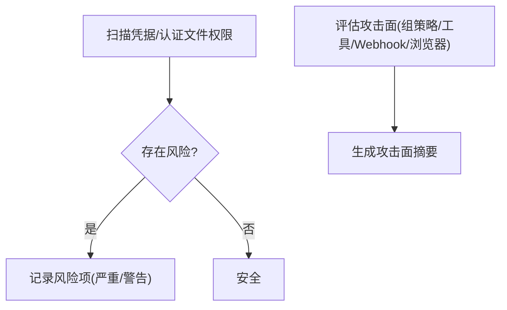

**图表来源**

- [audit-extra.async.ts:983-1093](file://src/security/audit-extra.async.ts#L983-L1093)
- [audit-extra.sync.ts:528-556](file://src/security/audit-extra.sync.ts#L528-L556)

**章节来源**

- [audit-extra.async.ts:983-1093](file://src/security/audit-extra.async.ts#L983-L1093)
- [audit-extra.sync.ts:528-556](file://src/security/audit-extra.sync.ts#L528-L556)

## 依赖关系分析

- 网关RPC层依赖健康状态管理与通道插件注册表，以提供统一的状态与健康视图。
- 插件监控层依赖WebSocket日志系统进行事件记录与慢请求标记。
- 健康状态管理依赖命令层的健康快照构建，后者又依赖通道插件的探测与审计能力。
- 故障转移分类为健康与路由决策提供依据，避免将瞬时错误升级为全局故障。

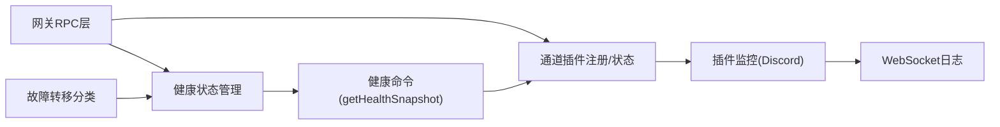

**图表来源**

- [health.ts:10-37](file://src/gateway/server-methods/health.ts#L10-L37)
- [health-state.ts:70-85](file://src/gateway/server/health-state.ts#L70-L85)
- [channels.ts:69-236](file://src/gateway/server-methods/channels.ts#L69-L236)
- [provider.lifecycle.ts:18-344](file://src/discord/monitor/provider.lifecycle.ts#L18-L344)
- [ws-log.ts:256-439](file://src/gateway/ws-log.ts#L256-L439)
- [health.ts:348-523](file://src/commands/health.ts#L348-L523)
- [failover-error.ts:151-240](file://src/agents/failover-error.ts#L151-L240)

**章节来源**

- [health.ts:10-37](file://src/gateway/server-methods/health.ts#L10-L37)
- [health-state.ts:70-85](file://src/gateway/server/health-state.ts#L70-L85)
- [channels.ts:69-236](file://src/gateway/server-methods/channels.ts#L69-L236)
- [provider.lifecycle.ts:18-344](file://src/discord/monitor/provider.lifecycle.ts#L18-L344)
- [ws-log.ts:256-439](file://src/gateway/ws-log.ts#L256-L439)
- [health.ts:348-523](file://src/commands/health.ts#L348-L523)
- [failover-error.ts:151-240](file://src/agents/failover-error.ts#L151-L240)

## 性能考量

- 日志开销控制：优化模式仅输出慢请求与错误响应，显著降低高频日志带来的I/O压力。
- 健康快照缓存：在刷新间隔内直接返回缓存，后台异步刷新，避免重复探测成本。
- 探测范围收敛：通过通道账户绑定与默认账户解析，减少不必要的探测与审计。
- 性能预算：回归测试脚本设定最大墙钟时间与回归阈值，保障性能基线稳定。

**章节来源**

- [ws-log.ts:316-378](file://src/gateway/ws-log.ts#L316-L378)
- [health-state.ts:70-85](file://src/gateway/server/health-state.ts#L70-L85)
- [channels.ts:114-194](file://src/gateway/server-methods/channels.ts#L114-L194)
- [test-perf-budget.mjs:98-127](file://scripts/test-perf-budget.mjs#L98-L127)

## 故障排查指南

- 连接问题定位：
  - 查看“连接已关闭”调试事件与最后断开时间、关闭码。
  - 检查HELLO超时次数与重连看门狗触发次数，确认是否存在网络抖动或服务端异常。
- 健康检查失败：
  - 使用“health”接口的探针模式强制刷新，查看通道探测结果与错误详情。
  - 检查通道账户的配置状态、启用状态与最近探测时间。
- 错误分类与降级：
  - 通过错误分类接口获取失败原因，结合HTTP状态与错误消息模式进行定位。
  - 对速率限制与账单错误进行隔离，避免影响其他通道。
- macOS健康检查：
  - 依据通道健康快照中的探测结果与超时信息，判断具体失败原因与耗时。

**章节来源**

- [provider.lifecycle.ts:154-242](file://src/discord/monitor/provider.lifecycle.ts#L154-L242)
- [health.ts:10-37](file://src/gateway/server-methods/health.ts#L10-L37)
- [health.ts:427-441](file://src/commands/health.ts#L427-L441)
- [failover-error.ts:151-240](file://src/agents/failover-error.ts#L151-L240)
- [HealthStore.swift:147-163](file://apps/macos/Sources/OpenClaw/HealthStore.swift#L147-L163)

## 结论

本监控方案围绕“连接可观测性、消息统计、健康快照、错误分类与安全审计”五大支柱，结合WebSocket日志、使用量聚合与UI指标，形成从底层事件到上层可视化的完整闭环。通过缓存与后台刷新、探测范围收敛与性能预算，既保证了可观测性的实时性，也兼顾了系统性能与稳定性。建议在生产环境中启用慢请求标记、错误分类与健康快照广播，并定期审查凭据权限与攻击面，以实现持续改进与风险控制。

## 附录

- 通道健康快照字段与含义可参考健康命令的摘要结构，包括通道顺序、标签、账户级探测与审计结果、最近活动时间等。
- 使用量聚合工具支持延迟与每日聚合，便于生成趋势报表与容量规划输入。
- 性能预算脚本可用于回归测试，确保关键路径的性能不退化。

**章节来源**

- [health.ts:47-72](file://src/commands/health.ts#L47-L72)
- [usage-aggregates.ts:32-66](file://src/shared/usage-aggregates.ts#L32-L66)
- [test-perf-budget.mjs:98-127](file://scripts/test-perf-budget.mjs#L98-L127)
