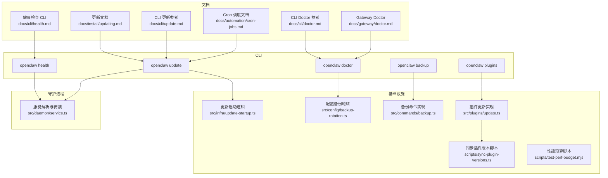
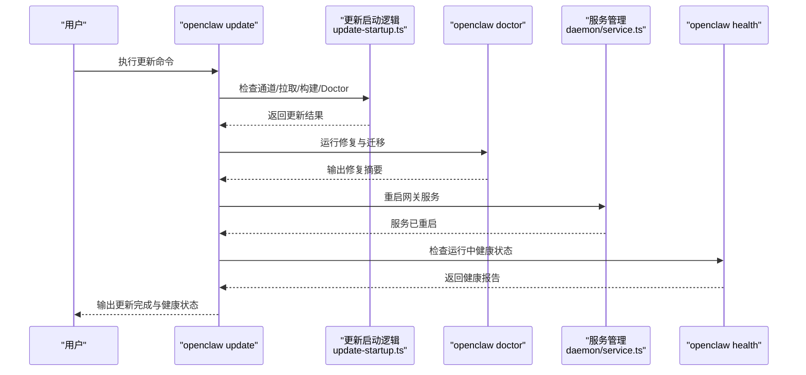
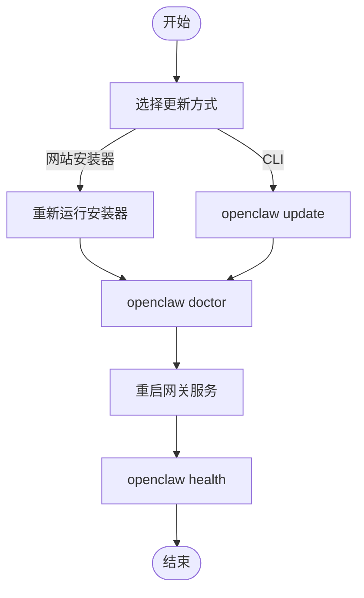
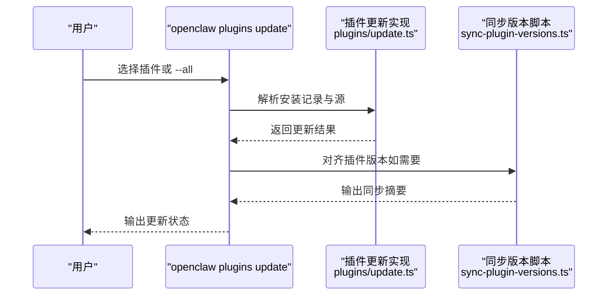
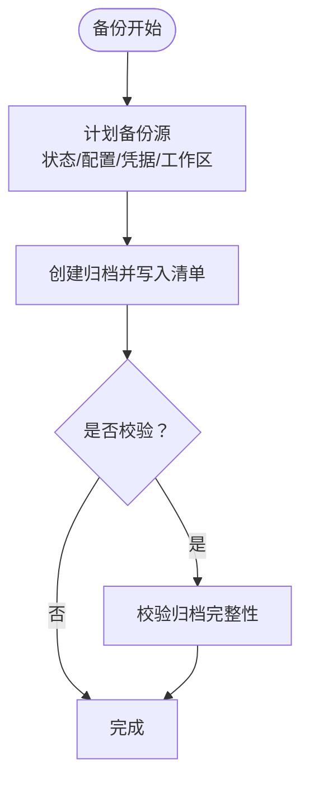
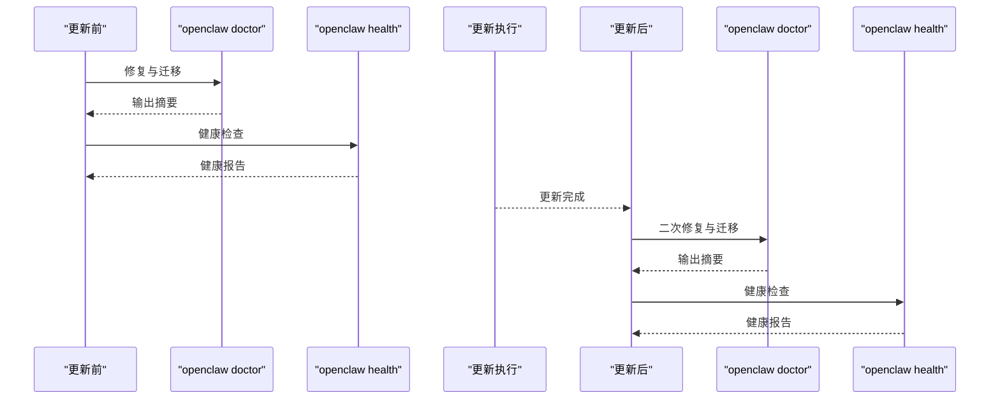
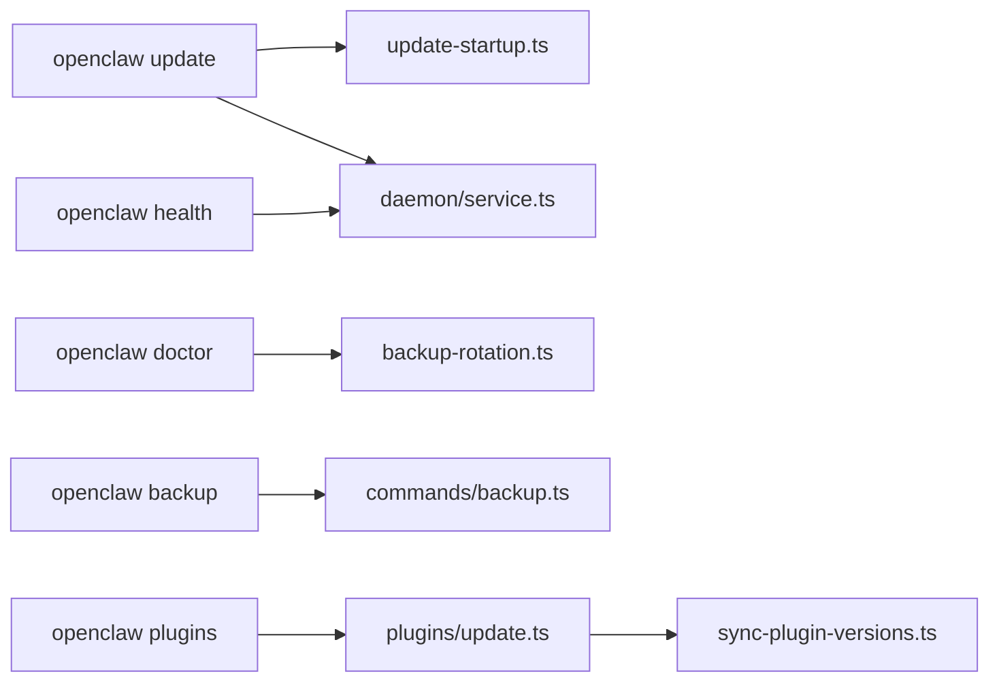

# 维护与更新

<cite>
**本文引用的文件**
- [updating.md](file://docs/install/updating.md)
- [update.md](file://docs/cli/update.md)
- [backup.md](file://docs/cli/backup.md)
- [doctor.md](file://docs/cli/doctor.md)
- [doctor.md](file://docs/gateway/doctor.md)
- [health.md](file://docs/cli/health.md)
- [cron-jobs.md](file://docs/automation/cron-jobs.md)
- [update-startup.ts](file://src/infra/update-startup.ts)
- [backup-rotation.ts](file://src/config/backup-rotation.ts)
- [backup.ts](file://src/commands/backup.ts)
- [plugins-cli.ts](file://src/cli/plugins-cli.ts)
- [plugins.md](file://docs/cli/plugins.md)
- [update.ts](file://src/plugins/update.ts)
- [sync-plugin-versions.ts](file://scripts/sync-plugin-versions.ts)
- [status.command.ts](file://src/commands/status.command.ts)
- [service.ts](file://src/daemon/service.ts)
- [test-perf-budget.mjs](file://scripts/test-perf-budget.mjs)
</cite>

## 目录

1. [简介](#简介)
2. [项目结构](#项目结构)
3. [核心组件](#核心组件)
4. [架构总览](#架构总览)
5. [详细组件分析](#详细组件分析)
6. [依赖关系分析](#依赖关系分析)
7. [性能考量](#性能考量)
8. [故障排查指南](#故障排查指南)
9. [结论](#结论)
10. [附录](#附录)

## 简介

本指南面向 OpenClaw 的维护与更新全生命周期管理，覆盖从日常维护到重大更新的完整流程。内容包括版本升级（小版本与大版本）、回滚策略、插件与依赖更新、配置迁移、维护窗口规划与执行、系统健康检查（更新前后）、批量更新与灰度发布建议、数据备份与风险控制、以及更新后的验证测试与性能回归检查。

## 项目结构

OpenClaw 将维护与更新能力以文档、CLI 命令、守护进程服务与基础设施脚本协同实现：

- 文档层：安装与更新、CLI 参考、健康检查、自动化调度等文档
- CLI 层：update、backup、doctor、health、plugins 等命令
- 基础设施层：更新启动逻辑、配置备份轮转、插件更新、性能预算脚本
- 守护进程层：跨平台服务安装与重启（launchd/systemd/计划任务）

**图表来源**

- [updating.md](file://docs/install/updating.md)
- [update.md](file://docs/cli/update.md)
- [doctor.md](file://docs/cli/doctor.md)
- [doctor.md](file://docs/gateway/doctor.md)
- [health.md](file://docs/cli/health.md)
- [cron-jobs.md](file://docs/automation/cron-jobs.md)
- [update-startup.ts](file://src/infra/update-startup.ts)
- [backup-rotation.ts](file://src/config/backup-rotation.ts)
- [backup.ts](file://src/commands/backup.ts)
- [update.ts](file://src/plugins/update.ts)
- [sync-plugin-versions.ts](file://scripts/sync-plugin-versions.ts)
- [service.ts](file://src/daemon/service.ts)
- [test-perf-budget.mjs](file://scripts/test-perf-budget.mjs)

**章节来源**

- [updating.md](file://docs/install/updating.md)
- [update.md](file://docs/cli/update.md)
- [backup.md](file://docs/cli/backup.md)
- [doctor.md](file://docs/cli/doctor.md)
- [doctor.md](file://docs/gateway/doctor.md)
- [health.md](file://docs/cli/health.md)
- [cron-jobs.md](file://docs/automation/cron-jobs.md)
- [update-startup.ts](file://src/infra/update-startup.ts)
- [backup-rotation.ts](file://src/config/backup-rotation.ts)
- [backup.ts](file://src/commands/backup.ts)
- [update.ts](file://src/plugins/update.ts)
- [sync-plugin-versions.ts](file://scripts/sync-plugin-versions.ts)
- [service.ts](file://src/daemon/service.ts)
- [test-perf-budget.mjs](file://scripts/test-perf-budget.mjs)

## 核心组件

- 更新与回滚
  - 官方推荐通过网站安装器进行就地升级，或使用 openclaw update 进行安全更新与重启
  - 支持切换稳定/测试/开发通道，支持 dry-run 预演
  - 提供 pin 固定版本与按日期回退源码分支的回滚路径
- Doctor 修复与迁移
  - 配置规范化、历史状态迁移、服务与权限检查、健康检查与重启提示
- 备份与恢复
  - 本地归档备份，支持校验与仅备份配置
  - 配置备份轮转与孤儿文件清理
- 插件与依赖更新
  - npm 插件更新与完整性漂移确认
  - 同步插件版本脚本，保持与核心版本对齐
- 健康检查与服务管理
  - openclaw health 获取运行中网关健康状态
  - 跨平台服务安装/重启（launchd/systemd/计划任务）
- 性能回归与维护窗口
  - 性能预算脚本用于回归阈值控制
  - Cron 调度用于维护窗口内的定时任务与灰度发布

**章节来源**

- [updating.md](file://docs/install/updating.md)
- [update.md](file://docs/cli/update.md)
- [doctor.md](file://docs/cli/doctor.md)
- [doctor.md](file://docs/gateway/doctor.md)
- [backup.md](file://docs/cli/backup.md)
- [backup-rotation.ts](file://src/config/backup-rotation.ts)
- [backup.ts](file://src/commands/backup.ts)
- [plugins.md](file://docs/cli/plugins.md)
- [update.ts](file://src/plugins/update.ts)
- [sync-plugin-versions.ts](file://scripts/sync-plugin-versions.ts)
- [health.md](file://docs/cli/health.md)
- [service.ts](file://src/daemon/service.ts)
- [test-perf-budget.mjs](file://scripts/test-perf-budget.mjs)

## 架构总览

下图展示一次典型更新流程：用户通过 CLI 触发更新，系统执行更新检查与应用、Doctor 修复与迁移、重启网关服务，并在完成后进行健康检查与可选的性能回归验证。

**图表来源**

- [update.md](file://docs/cli/update.md)
- [updating.md](file://docs/install/updating.md)
- [doctor.md](file://docs/cli/doctor.md)
- [doctor.md](file://docs/gateway/doctor.md)
- [update-startup.ts](file://src/infra/update-startup.ts)
- [service.ts](file://src/daemon/service.ts)
- [health.md](file://docs/cli/health.md)

## 详细组件分析

### 版本升级流程（小版本与大版本）

- 就地升级（推荐）
  - 重新运行网站安装器，检测现有安装并就地升级，必要时运行 doctor
- CLI 更新
  - openclaw update：安全更新与重启；支持切换通道、dry-run、json 输出
  - openclaw update --channel/--tag：选择通道或指定版本标签
  - openclaw update --dry-run：预演更新步骤（不写配置、不安装、不同步插件、不重启）
- 更新后必须运行 doctor 与 health，确保配置迁移与服务健康
- 控制界面/远程 RPC
  - 控制 UI 提供“更新与重启”，失败时回滚并重启，保留报告

**图表来源**

- [updating.md](file://docs/install/updating.md)
- [update.md](file://docs/cli/update.md)
- [doctor.md](file://docs/cli/doctor.md)
- [doctor.md](file://docs/gateway/doctor.md)
- [health.md](file://docs/cli/health.md)

**章节来源**

- [updating.md](file://docs/install/updating.md)
- [update.md](file://docs/cli/update.md)

### 回滚与降级

- 全局安装（npm/pnpm）：固定版本安装（pin），然后 doctor + 重启
- 源码安装（git）：按日期检出历史提交，重装依赖并重启
- 回滚后仍需运行 doctor 与 health，确保配置与服务一致

**章节来源**

- [updating.md](file://docs/install/updating.md)

### 插件更新与依赖同步

- 插件更新
  - openclaw plugins update：更新 npm 安装的插件，支持 --all、--dry-run
  - 对于完整性漂移会提示确认，CI 可用 --yes 跳过交互
- 依赖同步
  - 同步插件版本脚本：将插件包版本与核心版本对齐，生成变更记录，去除工作区开发依赖
- 插件安装与安全
  - npm 安装仅支持注册表规范包名与精确版本/标签；裸规格与 @latest 默认走稳定轨道
  - 支持 --link 链接本地目录；支持 --pin 保存精确规格

**图表来源**

- [plugins.md](file://docs/cli/plugins.md)
- [update.ts](file://src/plugins/update.ts)
- [sync-plugin-versions.ts](file://scripts/sync-plugin-versions.ts)

**章节来源**

- [plugins.md](file://docs/cli/plugins.md)
- [update.ts](file://src/plugins/update.ts)
- [sync-plugin-versions.ts](file://scripts/sync-plugin-versions.ts)

### 配置迁移与备份

- Doctor 迁移
  - 未知键拒绝、配置规范化、历史状态迁移（会话/代理目录/WhatsApp 认证）
  - 服务迁移与清理提示、权限与安全警告、健康检查与重启建议
- 配置备份轮转
  - 维护配置备份轮转（.bak.1..N）、权限加固、孤儿文件清理
- 备份命令
  - 本地归档备份，支持仅备份配置、校验归档、输出布局清单
  - 失效配置场景下可选择跳过工作区发现或仅备份配置

**图表来源**

- [backup.md](file://docs/cli/backup.md)
- [backup-rotation.ts](file://src/config/backup-rotation.ts)
- [backup.ts](file://src/commands/backup.ts)
- [doctor.md](file://docs/cli/doctor.md)
- [doctor.md](file://docs/gateway/doctor.md)

**章节来源**

- [backup.md](file://docs/cli/backup.md)
- [backup-rotation.ts](file://src/config/backup-rotation.ts)
- [backup.ts](file://src/commands/backup.ts)
- [doctor.md](file://docs/cli/doctor.md)
- [doctor.md](file://docs/gateway/doctor.md)

### 维护窗口规划与执行

- 维护窗口策略
  - 使用 Cron 在维护窗口内执行批处理任务、清理与健康巡检
  - 通过 staggerMs 降低尖峰负载；为高频任务设置合理 sessionRetention 与 runLog 限制
- 执行策略
  - 隔离会话作业避免打扰主会话；announce/webhook 模式按需投递
  - 通过 openclaw cron runs 查看运行历史与回溯

**章节来源**

- [cron-jobs.md](file://docs/automation/cron-jobs.md)

### 系统健康检查（更新前后）

- 更新前
  - openclaw doctor：修复与迁移、服务审计、权限与安全检查
  - openclaw health：获取运行中健康状态，必要时重启
- 更新后
  - openclaw doctor：二次修复与迁移
  - openclaw health：确认服务健康
  - openclaw status（深度模式）：查看心跳、会话存储、通道探针详情

**图表来源**

- [doctor.md](file://docs/cli/doctor.md)
- [doctor.md](file://docs/gateway/doctor.md)
- [health.md](file://docs/cli/health.md)
- [status.command.ts](file://src/commands/status.command.ts)

**章节来源**

- [doctor.md](file://docs/cli/doctor.md)
- [doctor.md](file://docs/gateway/doctor.md)
- [health.md](file://docs/cli/health.md)
- [status.command.ts](file://src/commands/status.command.ts)

### 批量更新与灰度发布

- 灰度发布
  - 利用更新启动逻辑的稳定延迟与抖动窗口，实现稳定通道的确定性扩散
  - 通过 openclaw update --channel beta/dev 控制节奏
- 批量更新
  - openclaw plugins update --all 批量更新 npm 插件
  - 使用 --dry-run 预演后再执行
- 回滚保障
  - 固定版本（pin）与源码按日期回退，确保快速恢复

**章节来源**

- [update-startup.ts](file://src/infra/update-startup.ts)
- [update.md](file://docs/cli/update.md)
- [plugins.md](file://docs/cli/plugins.md)
- [updating.md](file://docs/install/updating.md)

### 数据备份与风险控制

- 备份
  - openclaw backup create：默认输出时间戳归档，包含清单；支持 --verify、--only-config、--no-include-workspace
  - 配置备份轮转：环形轮换、权限加固、孤儿文件清理
- 风险控制
  - dry-run 预演更新与插件更新
  - Doctor 修复与迁移减少配置破坏
  - 固定版本与回退路径

**章节来源**

- [backup.md](file://docs/cli/backup.md)
- [backup-rotation.ts](file://src/config/backup-rotation.ts)
- [backup.ts](file://src/commands/backup.ts)
- [update.md](file://docs/cli/update.md)
- [plugins.md](file://docs/cli/plugins.md)

### 更新后的验证测试与性能回归

- 健康验证
  - openclaw health：获取运行中健康状态
  - openclaw status（深度）：查看心跳、会话存储、通道探针
- 性能回归
  - 使用性能预算脚本设定最大耗时与基线回归阈值，失败时退出非零
  - 结合 Cron 调度在维护窗口内定期执行回归测试

**章节来源**

- [health.md](file://docs/cli/health.md)
- [status.command.ts](file://src/commands/status.command.ts)
- [test-perf-budget.mjs](file://scripts/test-perf-budget.mjs)
- [cron-jobs.md](file://docs/automation/cron-jobs.md)

## 依赖关系分析

- CLI 命令依赖基础设施模块与守护进程服务
- 更新启动逻辑与 Doctor 修复共同保证配置与服务一致性
- 插件更新与版本同步脚本确保生态一致性
- 健康检查与服务管理贯穿更新前后

**图表来源**

- [update-startup.ts](file://src/infra/update-startup.ts)
- [backup-rotation.ts](file://src/config/backup-rotation.ts)
- [backup.ts](file://src/commands/backup.ts)
- [update.ts](file://src/plugins/update.ts)
- [sync-plugin-versions.ts](file://scripts/sync-plugin-versions.ts)
- [service.ts](file://src/daemon/service.ts)
- [health.md](file://docs/cli/health.md)

**章节来源**

- [update-startup.ts](file://src/infra/update-startup.ts)
- [backup-rotation.ts](file://src/config/backup-rotation.ts)
- [backup.ts](file://src/commands/backup.ts)
- [update.ts](file://src/plugins/update.ts)
- [sync-plugin-versions.ts](file://scripts/sync-plugin-versions.ts)
- [service.ts](file://src/daemon/service.ts)
- [health.md](file://docs/cli/health.md)

## 性能考量

- Cron 维护窗口内的高频率任务应设置合理的 sessionRetention 与 runLog 限制，避免 IO 压力
- 使用 staggerMs 降低尖峰负载
- 性能回归测试纳入维护窗口，使用脚本设定阈值并失败退出

**章节来源**

- [cron-jobs.md](file://docs/automation/cron-jobs.md)
- [test-perf-budget.mjs](file://scripts/test-perf-budget.mjs)

## 故障排查指南

- 更新卡住或失败
  - 运行 openclaw doctor 再次尝试更新
  - 使用 openclaw update --dry-run 预演，确认通道/标签/重启策略
- 服务未重启或异常
  - 使用 openclaw gateway restart 或对应平台服务命令
  - 检查服务安装与运行状态（launchctl/systemctl）
- 健康检查异常
  - openclaw health 获取实时状态
  - openclaw status（深度）查看心跳与通道探针详情
- 配置问题
  - openclaw doctor --repair 应用推荐修复
  - 若配置失效，使用 --only-config 或跳过工作区发现进行最小化备份

**章节来源**

- [updating.md](file://docs/install/updating.md)
- [doctor.md](file://docs/cli/doctor.md)
- [doctor.md](file://docs/gateway/doctor.md)
- [health.md](file://docs/cli/health.md)
- [status.command.ts](file://src/commands/status.command.ts)
- [backup.md](file://docs/cli/backup.md)

## 结论

通过文档化的更新流程、CLI 工具链与基础设施脚本的协同，OpenClaw 提供了从日常维护到重大更新的全生命周期管理能力。遵循“更新→修复迁移→重启→验证”的标准流程，并结合维护窗口内的 Cron 任务与性能回归测试，可在保证稳定性的同时高效推进迭代。

## 附录

- 关键命令速查
  - 更新：openclaw update、openclaw update --channel/--tag/--dry-run
  - 医生：openclaw doctor、openclaw doctor --repair/--deep
  - 备份：openclaw backup create、openclaw backup verify
  - 健康：openclaw health、openclaw status（深度）
  - 插件：openclaw plugins update --all、openclaw plugins update <id> --dry-run
- 平台服务
  - macOS：launchd（LaunchAgent）
  - Linux：systemd 用户服务
  - Windows：计划任务
