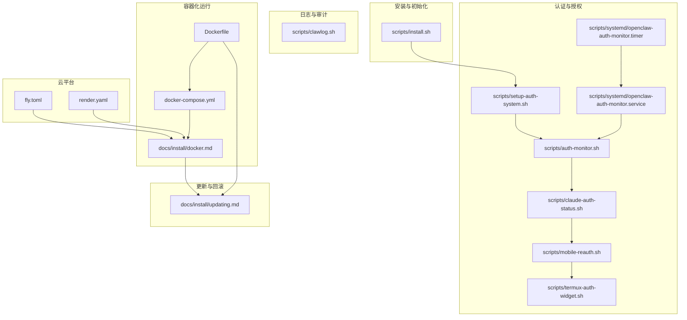
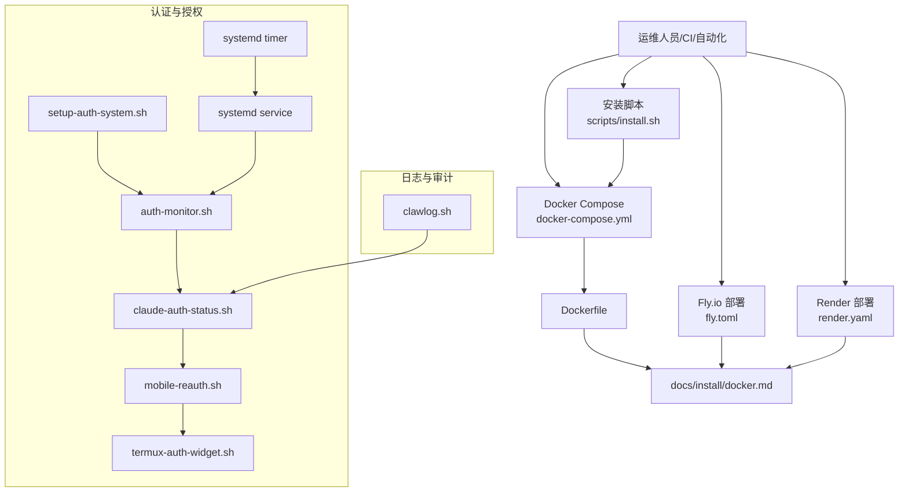
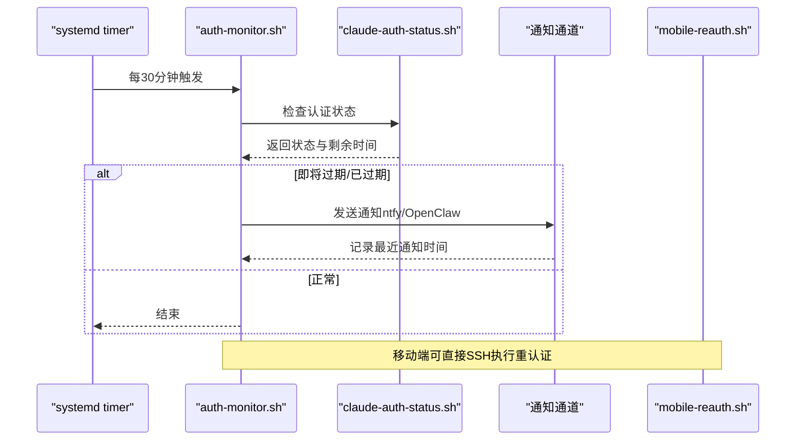
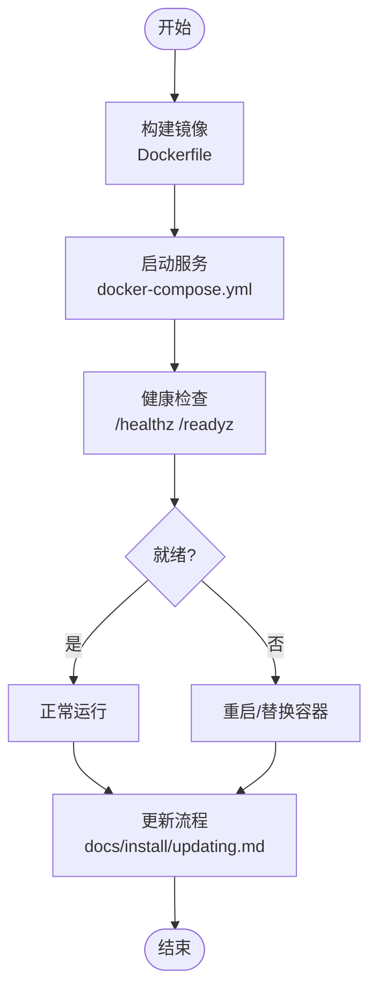
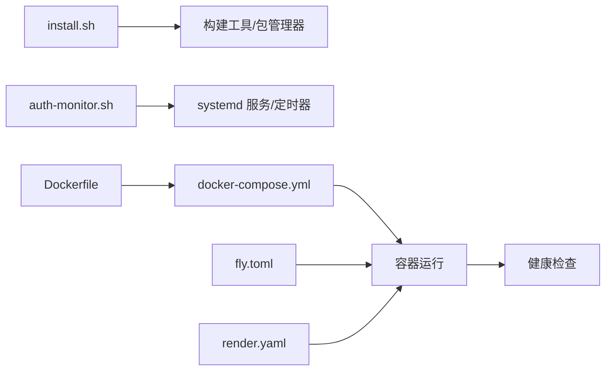

# 运维与维护

<cite>
**本文引用的文件**
- [README.md](file://README.md)
- [Dockerfile](file://Dockerfile)
- [docker-compose.yml](file://docker-compose.yml)
- [fly.toml](file://fly.toml)
- [render.yaml](file://render.yaml)
- [scripts/install.sh](file://scripts/install.sh)
- [scripts/setup-auth-system.sh](file://scripts/setup-auth-system.sh)
- [scripts/auth-monitor.sh](file://scripts/auth-monitor.sh)
- [scripts/termux-auth-widget.sh](file://scripts/termux-auth-widget.sh)
- [scripts/mobile-reauth.sh](file://scripts/mobile-reauth.sh)
- [scripts/claude-auth-status.sh](file://scripts/claude-auth-status.sh)
- [scripts/systemd/openclaw-auth-monitor.service](file://scripts/systemd/openclaw-auth-monitor.service)
- [scripts/systemd/openclaw-auth-monitor.timer](file://scripts/systemd/openclaw-auth-monitor.timer)
- [scripts/clawlog.sh](file://scripts/clawlog.sh)
- [docs/install/docker.md](file://docs/install/docker.md)
- [docs/install/updating.md](file://docs/install/updating.md)
</cite>

## 目录

1. [简介](#简介)
2. [项目结构](#项目结构)
3. [核心组件](#核心组件)
4. [架构总览](#架构总览)
5. [详细组件分析](#详细组件分析)
6. [依赖关系分析](#依赖关系分析)
7. [性能考虑](#性能考虑)
8. [故障排除指南](#故障排除指南)
9. [结论](#结论)
10. [附录](#附录)

## 简介

本指南面向OpenClaw在生产与日常运维中的全生命周期管理，覆盖部署配置、监控日志、备份恢复、故障排除、健康检查与告警、自动化更新与回滚、以及跨平台（本地、容器、云平台）的运维最佳实践。内容基于仓库内安装脚本、Docker编排、系统服务单元、日志工具与官方文档，帮助您从开发环境平滑过渡到生产环境，并建立可重复、可观测、可恢复的运维体系。

## 项目结构

OpenClaw的运维相关资产主要分布在以下位置：

- 安装与初始化：scripts/install.sh 提供一键安装、构建工具检测、错误诊断与自动修复路径
- 认证与授权：scripts/setup-auth-system.sh、scripts/auth-monitor.sh、scripts/claude-auth-status.sh、scripts/mobile-reauth.sh、scripts/termux-auth-widget.sh 构成认证状态检查、定时告警与移动端快速重认证链路
- 日志与审计：scripts/clawlog.sh 基于macOS统一日志系统，提供过滤、导出与实时流式查看能力
- 容器化运行：Dockerfile、docker-compose.yml、docs/install/docker.md 提供镜像构建、Compose编排、健康探针与沙箱配置
- 云平台部署：fly.toml（Fly.io）、render.yaml（Render）提供云原生部署参考
- 更新与回滚：docs/install/updating.md 提供更新流程、自动更新配置与回滚策略

**图表来源**

- [scripts/install.sh:1-800](file://scripts/install.sh#L1-L800)
- [scripts/setup-auth-system.sh:1-120](file://scripts/setup-auth-system.sh#L1-L120)
- [scripts/auth-monitor.sh:1-90](file://scripts/auth-monitor.sh#L1-L90)
- [scripts/claude-auth-status.sh:1-281](file://scripts/claude-auth-status.sh#L1-L281)
- [scripts/mobile-reauth.sh:1-85](file://scripts/mobile-reauth.sh#L1-L85)
- [scripts/termux-auth-widget.sh:1-82](file://scripts/termux-auth-widget.sh#L1-L82)
- [scripts/systemd/openclaw-auth-monitor.service:1-15](file://scripts/systemd/openclaw-auth-monitor.service#L1-L15)
- [scripts/systemd/openclaw-auth-monitor.timer:1-11](file://scripts/systemd/openclaw-auth-monitor.timer#L1-L11)
- [scripts/clawlog.sh:1-322](file://scripts/clawlog.sh#L1-L322)
- [Dockerfile:1-231](file://Dockerfile#L1-L231)
- [docker-compose.yml:1-77](file://docker-compose.yml#L1-L77)
- [docs/install/docker.md:1-844](file://docs/install/docker.md#L1-L844)
- [fly.toml:1-35](file://fly.toml#L1-L35)
- [render.yaml:1-22](file://render.yaml#L1-L22)
- [docs/install/updating.md:1-258](file://docs/install/updating.md#L1-L258)

**章节来源**

- [README.md:1-560](file://README.md#L1-L560)
- [Dockerfile:1-231](file://Dockerfile#L1-L231)
- [docker-compose.yml:1-77](file://docker-compose.yml#L1-L77)
- [docs/install/docker.md:1-844](file://docs/install/docker.md#L1-L844)
- [docs/install/updating.md:1-258](file://docs/install/updating.md#L1-L258)

## 核心组件

- 安装与初始化脚本：负责检测与安装构建工具、处理npm失败场景、引导用户交互、生成安装计划与错误诊断输出
- 认证与授权体系：提供长期令牌设置、定时过期监控、通知渠道配置、移动端快速重认证与状态查询
- 日志工具：基于macOS统一日志系统，支持按时间范围、类别、关键词过滤，支持导出与实时流式查看
- 容器化运行：多阶段构建、健康探针、沙箱配置、浏览器预装、Docker CLI可选安装
- 云平台部署：Fly.io与Render示例，含持久化卷、进程与健康检查配置
- 更新与回滚：自动更新策略、手动更新流程、回滚与版本固定

**章节来源**

- [scripts/install.sh:1-800](file://scripts/install.sh#L1-L800)
- [scripts/setup-auth-system.sh:1-120](file://scripts/setup-auth-system.sh#L1-L120)
- [scripts/auth-monitor.sh:1-90](file://scripts/auth-monitor.sh#L1-L90)
- [scripts/claude-auth-status.sh:1-281](file://scripts/claude-auth-status.sh#L1-L281)
- [scripts/mobile-reauth.sh:1-85](file://scripts/mobile-reauth.sh#L1-L85)
- [scripts/termux-auth-widget.sh:1-82](file://scripts/termux-auth-widget.sh#L1-L82)
- [scripts/clawlog.sh:1-322](file://scripts/clawlog.sh#L1-L322)
- [Dockerfile:1-231](file://Dockerfile#L1-L231)
- [docker-compose.yml:1-77](file://docker-compose.yml#L1-L77)
- [fly.toml:1-35](file://fly.toml#L1-L35)
- [render.yaml:1-22](file://render.yaml#L1-L22)
- [docs/install/docker.md:1-844](file://docs/install/docker.md#L1-L844)
- [docs/install/updating.md:1-258](file://docs/install/updating.md#L1-L258)

## 架构总览

下图展示OpenClaw在不同运行模式下的运维架构：本地安装、容器化（Docker Compose）、云平台（Fly.io/Render），以及认证与日志子系统的集成。

**图表来源**

- [scripts/install.sh:1-800](file://scripts/install.sh#L1-L800)
- [scripts/setup-auth-system.sh:1-120](file://scripts/setup-auth-system.sh#L1-L120)
- [scripts/auth-monitor.sh:1-90](file://scripts/auth-monitor.sh#L1-L90)
- [scripts/claude-auth-status.sh:1-281](file://scripts/claude-auth-status.sh#L1-L281)
- [scripts/mobile-reauth.sh:1-85](file://scripts/mobile-reauth.sh#L1-L85)
- [scripts/termux-auth-widget.sh:1-82](file://scripts/termux-auth-widget.sh#L1-L82)
- [scripts/systemd/openclaw-auth-monitor.service:1-15](file://scripts/systemd/openclaw-auth-monitor.service#L1-L15)
- [scripts/systemd/openclaw-auth-monitor.timer:1-11](file://scripts/systemd/openclaw-auth-monitor.timer#L1-L11)
- [scripts/clawlog.sh:1-322](file://scripts/clawlog.sh#L1-L322)
- [Dockerfile:1-231](file://Dockerfile#L1-L231)
- [docker-compose.yml:1-77](file://docker-compose.yml#L1-L77)
- [docs/install/docker.md:1-844](file://docs/install/docker.md#L1-L844)
- [fly.toml:1-35](file://fly.toml#L1-L35)
- [render.yaml:1-22](file://render.yaml#L1-L22)

## 详细组件分析

### 安装与初始化（scripts/install.sh）

- 功能要点
  - 检测终端与下载器，支持交互式/非交互式安装
  - 自动识别与安装缺失的构建工具（Linux包管理器、macOS Xcode命令行工具、CMake等）
  - 失败时提取npm错误码、syscall、errno与调试日志路径，辅助诊断
  - 支持自动重试构建工具安装后再次执行npm安装
  - 输出安装计划、UI提示与FAQ链接
- 运维建议
  - 在CI中使用非交互模式（禁用TTY）以避免阻塞
  - 对需要图形/3D兼容的容器工作负载，结合Dockerfile参数启用浏览器硬核标志或扩展
  - 对需要系统包的容器，通过构建参数预装apt包，减少运行时安装

**章节来源**

- [scripts/install.sh:1-800](file://scripts/install.sh#L1-L800)

### 认证与授权体系

- 组件链路
  - setup-auth-system.sh：一次性设置长期令牌、安装systemd定时任务、配置通知渠道（ntfy、OpenClaw消息）
  - auth-monitor.sh：定时检查Claude Code认证到期时间，发送通知并防刷
  - claude-auth-status.sh：提供简单/JSON/完整三种输出模式，用于脚本与UI
  - mobile-reauth.sh：移动端友好重认证流程，支持SSH远程执行
  - termux-auth-widget.sh：手机桌面小组件，一键检查与触发重认证
  - systemd单元：openclaw-auth-monitor.service与timer
- 告警与通知
  - 支持ntfy推送与OpenClaw消息通道
  - 通过环境变量配置通知阈值与目标
- 移动端体验
  - Termux Widget提供“立即重认证/稍后提醒/忽略”选项
  - 一键打开浏览器API密钥页面与SSH到服务器执行重认证脚本

**图表来源**

- [scripts/auth-monitor.sh:1-90](file://scripts/auth-monitor.sh#L1-L90)
- [scripts/claude-auth-status.sh:1-281](file://scripts/claude-auth-status.sh#L1-L281)
- [scripts/systemd/openclaw-auth-monitor.service:1-15](file://scripts/systemd/openclaw-auth-monitor.service#L1-L15)
- [scripts/systemd/openclaw-auth-monitor.timer:1-11](file://scripts/systemd/openclaw-auth-monitor.timer#L1-L11)
- [scripts/mobile-reauth.sh:1-85](file://scripts/mobile-reauth.sh#L1-L85)

**章节来源**

- [scripts/setup-auth-system.sh:1-120](file://scripts/setup-auth-system.sh#L1-L120)
- [scripts/auth-monitor.sh:1-90](file://scripts/auth-monitor.sh#L1-L90)
- [scripts/claude-auth-status.sh:1-281](file://scripts/claude-auth-status.sh#L1-L281)
- [scripts/mobile-reauth.sh:1-85](file://scripts/mobile-reauth.sh#L1-L85)
- [scripts/termux-auth-widget.sh:1-82](file://scripts/termux-auth-widget.sh#L1-L82)
- [scripts/systemd/openclaw-auth-monitor.service:1-15](file://scripts/systemd/openclaw-auth-monitor.service#L1-L15)
- [scripts/systemd/openclaw-auth-monitor.timer:1-11](file://scripts/systemd/openclaw-auth-monitor.timer#L1-L11)

### 日志与审计（scripts/clawlog.sh）

- 能力概述
  - 基于macOS统一日志系统，按子系统与类别过滤
  - 支持时间范围、错误过滤、关键词搜索、JSON输出、导出文件、实时流式查看
  - 提示sudo权限配置，避免隐私信息遮蔽
- 运维建议
  - 在需要查看私有日志时，按脚本提示配置免密sudo
  - 使用错误过滤与关键词搜索快速定位问题
  - 将近期日志导出到文件，配合问题反馈与审计

**章节来源**

- [scripts/clawlog.sh:1-322](file://scripts/clawlog.sh#L1-L322)

### 容器化运行（Dockerfile、docker-compose.yml、docs/install/docker.md）

- 多阶段构建与安全基线
  - 默认以非root用户运行，内置HEALTHCHECK探活
  - 可选安装Chromium与Docker CLI，便于沙箱与浏览器工具
  - 支持扩展apt包、预装扩展依赖、持久化/home/node
- Compose编排
  - 网络模式共享，CLI容器通过loopback访问网关
  - 健康检查与重启策略，持久化配置与工作区
- 云平台部署
  - Fly.io：VM尺寸、内存、挂载数据卷、HTTP服务与最小实例数
  - Render：Docker运行、健康检查路径、环境变量与磁盘挂载

**图表来源**

- [Dockerfile:1-231](file://Dockerfile#L1-L231)
- [docker-compose.yml:1-77](file://docker-compose.yml#L1-L77)
- [docs/install/docker.md:1-844](file://docs/install/docker.md#L1-L844)
- [docs/install/updating.md:1-258](file://docs/install/updating.md#L1-L258)

**章节来源**

- [Dockerfile:1-231](file://Dockerfile#L1-L231)
- [docker-compose.yml:1-77](file://docker-compose.yml#L1-L77)
- [docs/install/docker.md:1-844](file://docs/install/docker.md#L1-L844)
- [fly.toml:1-35](file://fly.toml#L1-L35)
- [render.yaml:1-22](file://render.yaml#L1-L22)

### 更新与回滚（docs/install/updating.md）

- 推荐更新路径
  - 重新运行官网安装脚本进行原地升级
  - 使用openclaw update进行源码安装的更新
- 自动更新
  - 可配置稳定版延迟与抖动、Beta版检查间隔
  - 支持dry-run预览
- 回滚策略
  - 全局安装：固定版本号
  - 源码安装：按日期回退到指定提交
- 启动/停止/重启
  - CLI与各平台服务管理方式（launchd/systemd）

**章节来源**

- [docs/install/updating.md:1-258](file://docs/install/updating.md#L1-L258)

## 依赖关系分析

- 安装脚本对系统工具链的依赖：构建工具、包管理器、Node版本要求
- 认证监控对systemd的依赖：定时器与服务单元
- 容器运行对Docker生态的依赖：镜像构建、Compose、可选Docker CLI与浏览器
- 云平台对资源与网络的依赖：实例规格、持久化卷、健康检查端点

**图表来源**

- [scripts/install.sh:1-800](file://scripts/install.sh#L1-L800)
- [scripts/auth-monitor.sh:1-90](file://scripts/auth-monitor.sh#L1-L90)
- [scripts/systemd/openclaw-auth-monitor.service:1-15](file://scripts/systemd/openclaw-auth-monitor.service#L1-L15)
- [scripts/systemd/openclaw-auth-monitor.timer:1-11](file://scripts/systemd/openclaw-auth-monitor.timer#L1-L11)
- [Dockerfile:1-231](file://Dockerfile#L1-L231)
- [docker-compose.yml:1-77](file://docker-compose.yml#L1-L77)
- [fly.toml:1-35](file://fly.toml#L1-L35)
- [render.yaml:1-22](file://render.yaml#L1-L22)

**章节来源**

- [scripts/install.sh:1-800](file://scripts/install.sh#L1-L800)
- [scripts/auth-monitor.sh:1-90](file://scripts/auth-monitor.sh#L1-L90)
- [Dockerfile:1-231](file://Dockerfile#L1-L231)
- [docker-compose.yml:1-77](file://docker-compose.yml#L1-L77)
- [fly.toml:1-35](file://fly.toml#L1-L35)
- [render.yaml:1-22](file://render.yaml#L1-L22)

## 性能考虑

- 容器构建缓存：将依赖层前置，避免频繁pnpm install
- 浏览器与Playwright：在容器内预装Chromium可显著降低首次启动开销
- 内存与CPU：Fly.io/Render示例中设置了内存与VM尺寸，需根据负载调整
- 沙箱隔离：默认无网络限制，如需联网需显式配置；内存与PID限制可按需收紧

[本节为通用指导，不涉及具体文件分析]

## 故障排除指南

- 安装失败
  - 通过安装脚本输出的npm错误码、syscall、errno与调试日志路径定位问题
  - 自动尝试安装缺失的构建工具后重试
- 认证过期
  - 使用auth-monitor.sh与claude-auth-status.sh检查状态
  - 通过setup-auth-system.sh配置通知渠道，使用mobile-reauth.sh或Termux Widget快速重认证
- 日志排查
  - 使用clawlog.sh按类别、时间范围与关键词过滤，必要时导出日志文件
- 容器健康
  - 通过/healthz与/readyz探针判断容器存活与就绪状态
  - 查看Compose健康检查与重启策略
- 更新回滚
  - 使用docs/install/updating.md提供的固定版本或按日期回退策略

**章节来源**

- [scripts/install.sh:743-800](file://scripts/install.sh#L743-L800)
- [scripts/auth-monitor.sh:1-90](file://scripts/auth-monitor.sh#L1-L90)
- [scripts/claude-auth-status.sh:1-281](file://scripts/claude-auth-status.sh#L1-L281)
- [scripts/clawlog.sh:1-322](file://scripts/clawlog.sh#L1-L322)
- [docs/install/docker.md:469-501](file://docs/install/docker.md#L469-L501)
- [docs/install/updating.md:206-258](file://docs/install/updating.md#L206-L258)

## 结论

通过将安装脚本、认证监控、日志工具、容器化与云平台部署有机结合，OpenClaw提供了从开发到生产的完整运维闭环。建议在生产环境中：

- 使用容器化与健康检查保障可用性
- 建立认证过期监控与移动端快速重认证流程
- 利用日志工具与导出机制进行问题定位与审计
- 制定更新与回滚策略，定期演练恢复流程

[本节为总结性内容，不涉及具体文件分析]

## 附录

- 快速命令索引
  - 安装：curl -fsSL https://openclaw.ai/install.sh | bash
  - 更新：openclaw update 或 npm/pnpm全局更新
  - 认证状态：scripts/claude-auth-status.sh
  - 认证监控：systemctl --user enable --now openclaw-auth-monitor.timer
  - 日志查看：scripts/clawlog.sh -f -n 200
  - 容器健康：curl http://127.0.0.1:18789/healthz

[本节为补充信息，不涉及具体文件分析]
