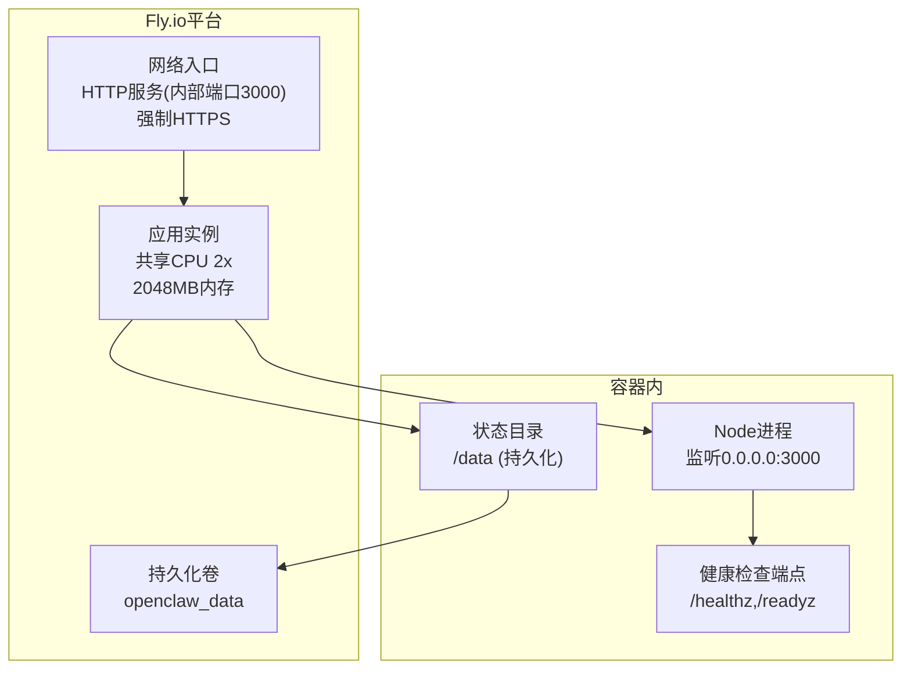
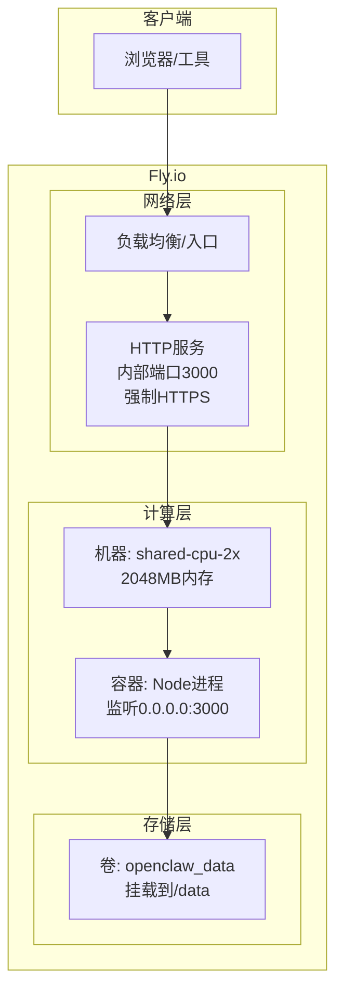
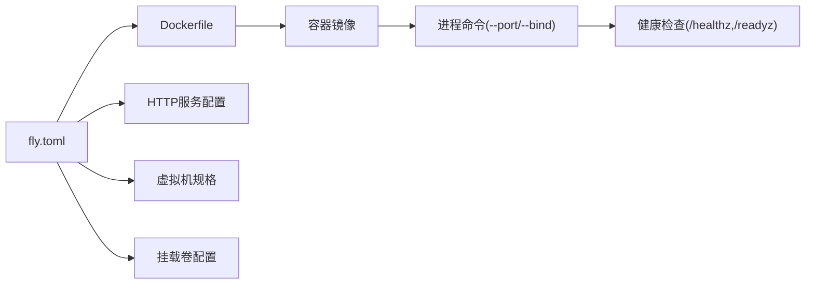

# Fly.io部署

<cite>
**本文引用的文件**
- [fly.toml](file://fly.toml)
- [fly.private.toml](file://fly.private.toml)
- [Dockerfile](file://Dockerfile)
- [openclaw.mjs](file://openclaw.mjs)
- [docs/install/fly.md](file://docs/install/fly.md)
- [src/gateway/server/http-listen.ts](file://src/gateway/server/http-listen.ts)
- [src/gateway/server-http.probe.test.ts](file://src/gateway/server-http.probe.test.ts)
- [src/gateway/server-http.ts](file://src/gateway/server-http.ts)
- [src/gateway/control-plane-rate-limit.ts](file://src/gateway/control-plane-rate-limit.ts)
- [src/gateway/auth-config-utils.ts](file://src/gateway/auth-config-utils.ts)
- [src/gateway/credential-planner.ts](file://src/gateway/credential-planner.ts)
- [src/commands/onboard-non-interactive/local/gateway-config.ts](file://src/commands/onboard-non-interactive/local/gateway-config.ts)
- [src/commands/doctor-state-integrity.ts](file://src/commands/doctor-state-integrity.ts)
- [src/docker-setup.e2e.test.ts](file://src/docker-setup.e2e.test.ts)
- [package.json](file://package.json)
</cite>

## 目录

1. [简介](#简介)
2. [项目结构](#项目结构)
3. [核心组件](#核心组件)
4. [架构总览](#架构总览)
5. [详细组件分析](#详细组件分析)
6. [依赖关系分析](#依赖关系分析)
7. [性能考虑](#性能考虑)
8. [故障排除指南](#故障排除指南)
9. [结论](#结论)
10. [附录](#附录)

## 简介

本指南面向在Fly.io平台上部署OpenClaw网关服务的用户。内容基于仓库中的fly.toml配置与官方部署文档，覆盖应用配置、环境变量、虚拟机规格、持久化存储、HTTP服务与强制HTTPS、进程管理、区域选择、资源分配、自动扩缩容、故障排除与性能优化等主题。读者可据此完成从零开始的完整部署流程，并在生产环境中获得稳定可靠的运行体验。

## 项目结构

OpenClaw在Fly.io上的部署由以下关键要素构成：

- 部署配置：fly.toml（公开部署）与fly.private.toml（私有部署）
- 容器镜像：Dockerfile（多阶段构建，运行时精简）
- 启动入口：openclaw.mjs（Node版本校验与入口加载）
- 网关服务：Node进程监听3000端口，支持健康检查与就绪检查
- 持久化：通过挂载卷将状态目录指向/data，确保重启后数据不丢失
- 安全：非回环绑定需启用网关令牌；私有部署通过WireGuard或本地代理访问

图表来源

- [fly.toml:20-34](file://fly.toml#L20-L34)
- [Dockerfile:224-230](file://Dockerfile#L224-L230)
- [src/gateway/server-http.ts:198-236](file://src/gateway/server-http.ts#L198-L236)

章节来源

- [fly.toml:1-35](file://fly.toml#L1-L35)
- [Dockerfile:1-231](file://Dockerfile#L1-L231)
- [openclaw.mjs:1-90](file://openclaw.mjs#L1-L90)

## 核心组件

- 部署配置（fly.toml）
  - 应用名、主区域、构建参数、环境变量、进程命令、HTTP服务、虚拟机规格、挂载卷
- 私有部署配置（fly.private.toml）
  - 无公网入口，仅通过本地代理、WireGuard或SSH访问
- 容器镜像（Dockerfile）
  - 多阶段构建，运行时采用精简基础镜像，内置健康检查
- 网关进程
  - 绑定0.0.0.0并监听3000端口，支持健康/就绪探针
- 持久化存储
  - 将状态目录映射至/data，确保重启后配置与会话不丢失

章节来源

- [fly.toml:10-34](file://fly.toml#L10-L34)
- [fly.private.toml:18-39](file://fly.private.toml#L18-L39)
- [Dockerfile:224-230](file://Dockerfile#L224-L230)
- [src/gateway/server-http.ts:198-236](file://src/gateway/server-http.ts#L198-L236)

## 架构总览

下图展示了OpenClaw在Fly.io上的运行架构：HTTP服务作为入口，容器内的Node进程提供网关能力，持久化卷承载状态数据。

图表来源

- [fly.toml:20-34](file://fly.toml#L20-L34)
- [Dockerfile:224-230](file://Dockerfile#L224-L230)

## 详细组件分析

### 部署配置（fly.toml）

- 应用与区域
  - 应用名与primary_region需根据实际需求调整
- 构建
  - 使用Dockerfile进行构建
- 环境变量
  - NODE_ENV=production
  - OPENCLAW_PREFER_PNPM=1
  - OPENCLAW_STATE_DIR=/data
  - NODE_OPTIONS="--max-old-space-size=1536"
- 进程命令
  - 绑定0.0.0.0并通过令牌鉴权
- HTTP服务
  - internal_port=3000
  - force_https=true
  - auto_stop_machines=false（保持运行以维持长连接）
  - auto_start_machines=true
  - min_machines_running=1
  - processes=["app"]
- 虚拟机规格
  - size="shared-cpu-2x"
  - memory="2048mb"
- 挂载卷
  - source="openclaw_data"
  - destination="/data"

章节来源

- [fly.toml:4-34](file://fly.toml#L4-L34)

### 私有部署配置（fly.private.toml）

- 无HTTP服务块，避免分配公网IP
- 通过fly proxy、WireGuard或SSH访问
- 适合仅出站调用、使用ngrok/Tailscale隧道或隐藏部署场景

章节来源

- [fly.private.toml:1-40](file://fly.private.toml#L1-L40)

### 容器镜像与启动入口（Dockerfile与openclaw.mjs）

- Dockerfile
  - 多阶段构建，运行时采用精简基础镜像
  - 健康检查端点：/healthz（存活）、/readyz（就绪）
  - CMD启动网关服务
- openclaw.mjs
  - Node版本校验（要求22.12+）
  - 加载编译缓存与入口模块

章节来源

- [Dockerfile:224-230](file://Dockerfile#L224-L230)
- [openclaw.mjs:5-36](file://openclaw.mjs#L5-L36)

### HTTP服务与进程管理

- 端口与绑定
  - 进程命令指定--port 3000并--bind lan，确保外部可达
  - HTTP服务internal_port需与之匹配
- 强制HTTPS
  - force_https=true，确保所有流量经加密传输
- 进程管理
  - auto_stop_machines=false，保持运行以维持长连接
  - auto_start_machines=true，min_machines_running=1，保证最小实例数

章节来源

- [fly.toml:17-26](file://fly.toml#L17-L26)
- [fly.toml:20-26](file://fly.toml#L20-L26)

### 持久化存储配置

- 状态目录
  - OPENCLAW_STATE_DIR=/data，确保配置与会话持久化
- 卷挂载
  - [mounts]将openclaw_data卷挂载到/data
- 数据完整性
  - 若状态未持久化，检查OPENCLAW_STATE_DIR是否正确设置并重新部署

章节来源

- [fly.toml:14](file://fly.toml#L14)
- [fly.toml:32-34](file://fly.toml#L32-L34)
- [docs/install/fly.md:322-327](file://docs/install/fly.md#L322-L327)

### 安全与认证

- 非回环绑定需令牌
  - --bind lan时必须设置OPENCLAW_GATEWAY_TOKEN
- 环境变量优先
  - API密钥与令牌优先使用环境变量而非配置文件
- 凭据解析
  - 支持从环境变量解析令牌与密码，避免明文写入配置

章节来源

- [docs/install/fly.md:93-115](file://docs/install/fly.md#L93-L115)
- [src/gateway/auth-config-utils.ts:35-69](file://src/gateway/auth-config-utils.ts#L35-L69)
- [src/gateway/credential-planner.ts:137-171](file://src/gateway/credential-planner.ts#L137-L171)
- [src/commands/onboard-non-interactive/local/gateway-config.ts:59-113](file://src/commands/onboard-non-interactive/local/gateway-config.ts#L59-L113)

### 健康检查与就绪检查

- 探针端点
  - /healthz：存活探针
  - /readyz：就绪探针
- 行为差异
  - /healthz返回简短状态
  - /readyz可返回详细就绪状态（含失败通道列表）

章节来源

- [Dockerfile:224-230](file://Dockerfile#L224-L230)
- [src/gateway/server-http.ts:198-236](file://src/gateway/server-http.ts#L198-L236)
- [src/gateway/server-http.probe.test.ts:1-155](file://src/gateway/server-http.probe.test.ts#L1-L155)

### 端口占用与绑定策略

- 端口冲突重试
  - 当端口处于TIME_WAIT时，自动重试绑定
- 锁定错误
  - 若端口被占用且重试耗尽，抛出GatewayLockError

章节来源

- [src/gateway/server/http-listen.ts:1-62](file://src/gateway/server/http-listen.ts#L1-L62)

### 控制平面限流

- 控制面板请求限流
  - 基于滑动窗口的限流策略，防止控制面过载
- 测试覆盖
  - 提供单元测试验证限流行为

章节来源

- [src/gateway/control-plane-rate-limit.ts:47-86](file://src/gateway/control-plane-rate-limit.ts#L47-L86)

### 完整部署流程（公开部署）

- 步骤概览
  - 创建应用与持久化卷
  - 配置fly.toml并设置环境变量
  - 部署并验证
  - SSH进入创建配置文件
  - 通过Control UI或日志确认运行状态

章节来源

- [docs/install/fly.md:28-433](file://docs/install/fly.md#L28-L433)

### 私有部署访问方式

- 本地代理（最简单）
  - fly proxy 3000:3000 -a <app-name>
- WireGuard VPN
  - fly wireguard create后导入客户端，通过内部IPv6访问
- SSH控制台
  - fly ssh console -a <app-name>

章节来源

- [docs/install/fly.md:406-433](file://docs/install/fly.md#L406-L433)

## 依赖关系分析

- 部署配置依赖
  - fly.toml依赖Dockerfile构建镜像
  - HTTP服务internal_port需与进程命令端口一致
  - OPENCLAW_STATE_DIR需与挂载卷目的地一致
- 运行时依赖
  - Node版本要求22.12+
  - 健康检查端点用于容器与平台健康探测

图表来源

- [fly.toml:7-34](file://fly.toml#L7-L34)
- [Dockerfile:224-230](file://Dockerfile#L224-L230)
- [openclaw.mjs:5-36](file://openclaw.mjs#L5-L36)

章节来源

- [fly.toml:7-34](file://fly.toml#L7-L34)
- [Dockerfile:224-230](file://Dockerfile#L224-L230)
- [openclaw.mjs:5-36](file://openclaw.mjs#L5-L36)

## 性能考虑

- 内存分配
  - 建议使用2048MB内存，避免OOM与频繁重启
- 健康检查
  - 使用/healthz与/readyz端点，确保平台正确识别容器状态
- 语言运行时
  - Node版本满足要求，启用编译缓存提升启动性能
- 扩展性
  - 通过min_machines_running与auto_start_machines维持最小实例数，结合业务流量弹性扩展

章节来源

- [fly.toml:29-30](file://fly.toml#L29-L30)
- [Dockerfile:224-230](file://Dockerfile#L224-L230)
- [openclaw.mjs:39-45](file://openclaw.mjs#L39-L45)

## 故障排除指南

- 端口绑定问题
  - 症状：App is not listening on expected address
  - 解决：在进程命令中添加--bind lan
- 健康检查失败
  - 症状：连接被拒绝或探针失败
  - 解决：确保internal_port与进程端口一致
- 内存不足
  - 症状：容器重启或OOM
  - 解决：提高内存至2048MB或更新现有机器
- 网关锁问题
  - 症状：启动时报“already running”
  - 解决：删除/data/gateway.\*.lock并重启
- 配置未读取
  - 症状：使用--allow-unconfigured后未读取自定义配置
  - 解决：确认/data/openclaw.json存在并重启
- 状态未持久化
  - 症状：重启后丢失凭证或会话
  - 解决：确保OPENCLAW_STATE_DIR=/data并重新部署
- 写入配置
  - 症状：ssh console -C不支持重定向
  - 解决：使用echo + tee或fly sftp；若文件已存在，先删除再上传

章节来源

- [docs/install/fly.md:245-327](file://docs/install/fly.md#L245-L327)
- [src/gateway/server/http-listen.ts:25-61](file://src/gateway/server/http-listen.ts#L25-L61)
- [src/commands/doctor-state-integrity.ts:206-257](file://src/commands/doctor-state-integrity.ts#L206-L257)

## 结论

通过fly.toml与Dockerfile的合理配置，OpenClaw可在Fly.io上实现高可用、可扩展且安全的网关服务。公开部署提供便捷的Web访问，私有部署则满足对暴露面敏感的场景。配合持久化存储、健康检查与严格的认证策略，可确保生产环境的稳定性与安全性。

## 附录

- 区域选择建议
  - 选择靠近用户的区域（如lhr、iad、sjc），降低延迟
- 成本估算
  - shared-cpu-2x + 2048MB内存约$10-15/月（按使用浮动）
- 更新与维护
  - git pull后fly deploy即可；必要时使用fly machine update调整命令或内存

章节来源

- [docs/install/fly.md:42-491](file://docs/install/fly.md#L42-L491)
- [fly.toml:28-30](file://fly.toml#L28-L30)
