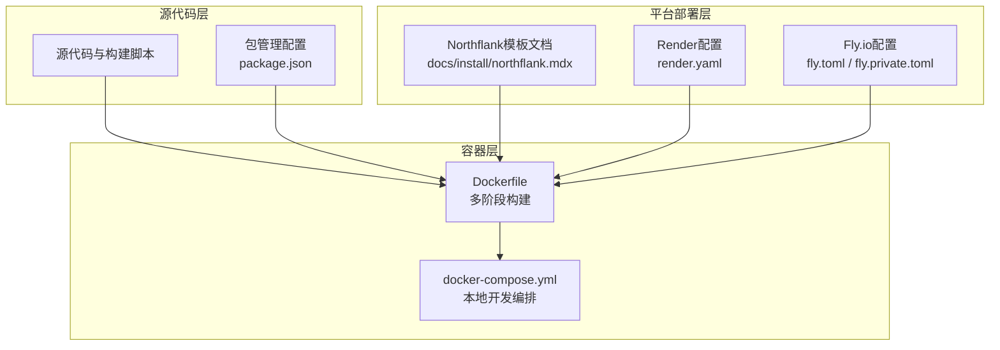
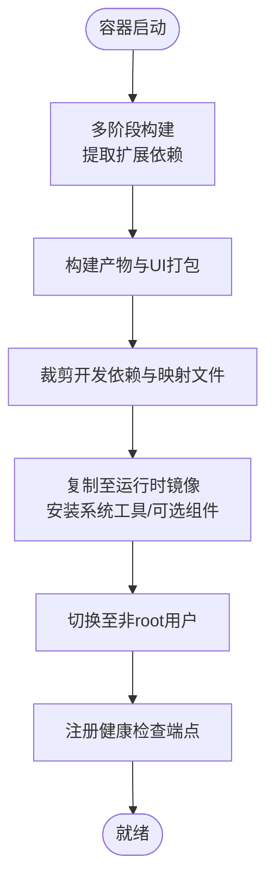
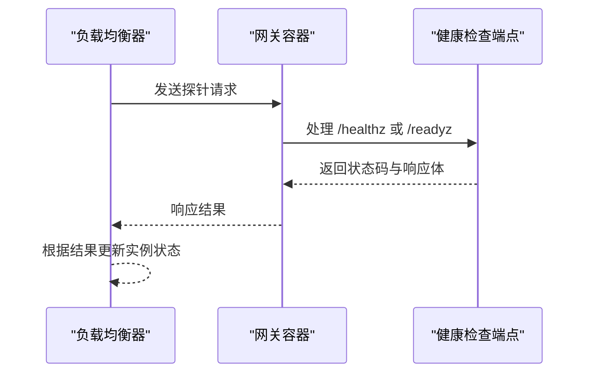
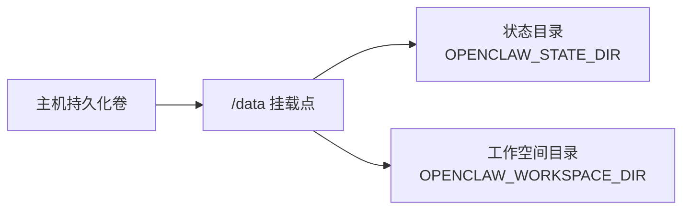
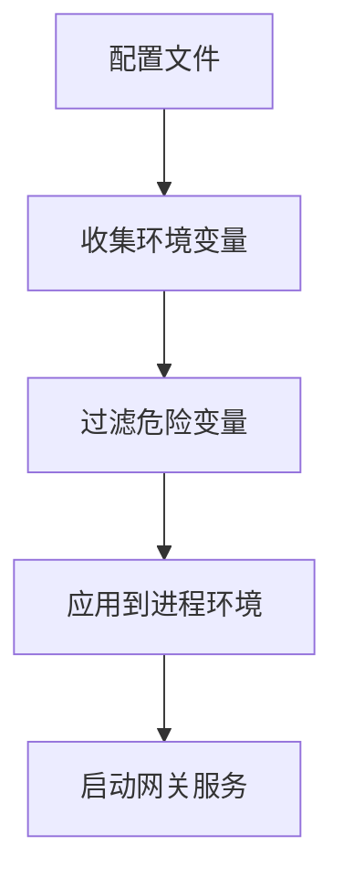
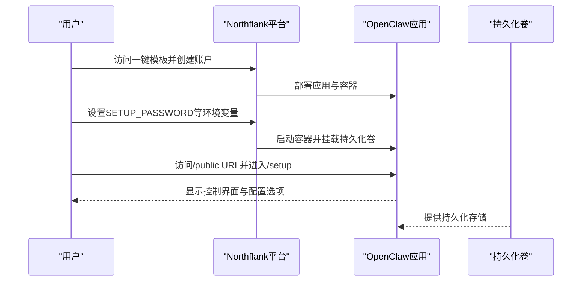
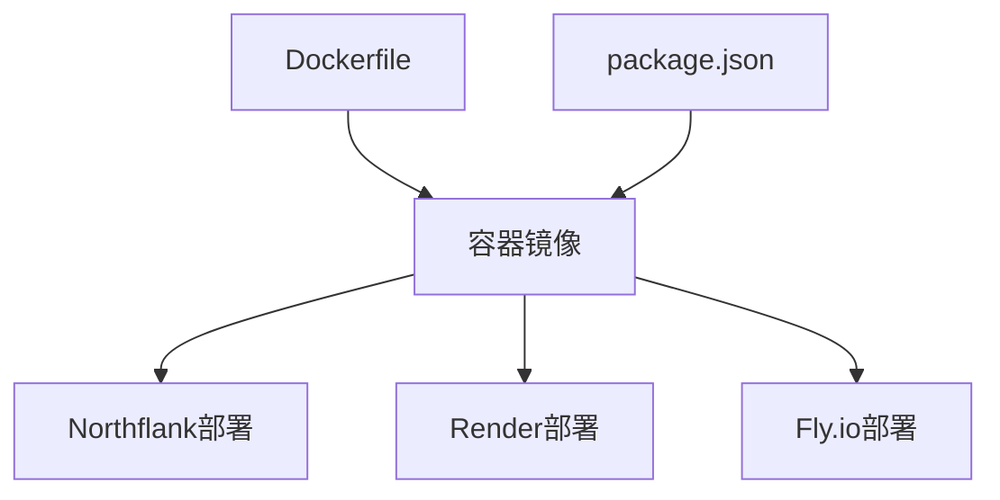

# Northflank部署

<cite>
**本文档引用的文件**
- [Dockerfile](file://Dockerfile)
- [docker-compose.yml](file://docker-compose.yml)
- [package.json](file://package.json)
- [docs/install/northflank.mdx](file://docs/install/northflank.mdx)
- [src/config/env-vars.ts](file://src/config/env-vars.ts)
- [src/gateway/server-http.probe.test.ts](file://src/gateway/server-http.probe.test.ts)
- [render.yaml](file://render.yaml)
- [fly.toml](file://fly.toml)
- [fly.private.toml](file://fly.private.toml)
</cite>

## 目录

1. [简介](#简介)
2. [项目结构](#项目结构)
3. [核心组件](#核心组件)
4. [架构概览](#架构概览)
5. [详细组件分析](#详细组件分析)
6. [依赖关系分析](#依赖关系分析)
7. [性能考虑](#性能考虑)
8. [故障排除指南](#故障排除指南)
9. [结论](#结论)
10. [附录](#附录)

## 简介

本指南面向希望在Northflank云平台上部署OpenClaw服务的用户。Northflank提供了一键式模板部署能力，结合容器化运行时与持久化存储，能够快速完成OpenClaw网关的安装与配置。本文将基于仓库中的现有部署配置与文档，系统性地说明如何在Northflank上完成从应用创建到生产环境发布的完整流程，并解释其容器编排、健康检查、持久化存储等关键特性。

## 项目结构

OpenClaw项目采用多语言混合架构，核心运行时为Node.js，通过Dockerfile进行容器化构建。项目中提供了针对不同平台的部署配置示例（如Render、Fly.io），以及Northflank的一键模板文档。这些配置展示了OpenClaw在容器环境中的端口绑定、健康检查、环境变量注入与持久化卷挂载等关键要素。



**图表来源**

- [Dockerfile:1-231](file://Dockerfile#L1-L231)
- [docker-compose.yml:1-77](file://docker-compose.yml#L1-L77)
- [package.json:1-465](file://package.json#L1-L465)
- [docs/install/northflank.mdx:1-54](file://docs/install/northflank.mdx#L1-L54)
- [render.yaml:1-22](file://render.yaml#L1-L22)
- [fly.toml:1-35](file://fly.toml#L1-L35)
- [fly.private.toml:1-40](file://fly.private.toml#L1-L40)

**章节来源**

- [Dockerfile:1-231](file://Dockerfile#L1-L231)
- [docker-compose.yml:1-77](file://docker-compose.yml#L1-L77)
- [package.json:1-465](file://package.json#L1-L465)
- [docs/install/northflank.mdx:1-54](file://docs/install/northflank.mdx#L1-L54)
- [render.yaml:1-22](file://render.yaml#L1-L22)
- [fly.toml:1-35](file://fly.toml#L1-L35)
- [fly.private.toml:1-40](file://fly.private.toml#L1-L40)

## 核心组件

- 容器镜像构建：Dockerfile采用多阶段构建策略，先提取扩展依赖，再进行构建与产物裁剪，最终生成精简的运行时镜像。镜像标签与基础镜像均使用固定SHA256摘要以确保可复现性。
- 运行时参数：容器启动命令默认运行网关服务，并提供健康检查端点（/healthz、/readyz）用于容器编排平台的探活。
- 环境变量注入：通过环境变量控制网关绑定地址、端口、认证令牌等关键参数；同时支持从配置文件注入额外的运行时环境变量。
- 持久化存储：通过卷挂载将状态目录与工作空间目录映射到容器外部，确保重启或重建后数据不丢失。
- 平台适配：Northflank模板文档提供了完整的部署步骤与Web设置向导入口，便于非技术用户完成初始配置。

**章节来源**

- [Dockerfile:103-231](file://Dockerfile#L103-L231)
- [src/config/env-vars.ts:13-97](file://src/config/env-vars.ts#L13-L97)
- [docs/install/northflank.mdx:9-36](file://docs/install/northflank.mdx#L9-L36)

## 架构概览

下图展示了OpenClaw在Northflank平台上的部署架构：容器运行时承载网关服务，通过健康检查端点与平台的负载均衡/自动扩缩容机制协同；持久化卷提供状态与工作空间的数据持久化；Web设置向导负责初始配置。

```mermaid
graph TB
subgraph "Northflank平台"
LB["负载均衡器"]
AC["自动扩缩容控制器"]
VOL["持久化卷(/data)"]
end
subgraph "容器实例"
GW["OpenClaw网关进程"]
HC["健康检查端点<br/>/healthz,/readyz"]
ENV["环境变量注入"]
end
LB --> GW
AC --> GW
VOL <- --> GW
ENV --> GW
GW --> HC
```

**图表来源**

- [Dockerfile:224-231](file://Dockerfile#L224-L231)
- [render.yaml:1-22](file://render.yaml#L1-L22)
- [docs/install/northflank.mdx:21-25](file://docs/install/northflank.mdx#L21-L25)

## 详细组件分析

### 容器镜像与运行时配置

- 多阶段构建：第一阶段提取扩展依赖，第二阶段执行构建与UI打包，第三阶段裁剪产物并复制至最终运行时镜像。运行时镜像包含必要的系统工具与可选组件（如浏览器、Docker CLI），并通过非root用户运行以提升安全性。
- 健康检查：容器内置健康检查端点，用于平台检测容器存活与就绪状态，支持liveness与readiness两类探针。
- 端口绑定：默认绑定到回环地址，若需从宿主或入口访问，需调整绑定地址并配置认证。



**图表来源**

- [Dockerfile:27-104](file://Dockerfile#L27-L104)
- [Dockerfile:104-231](file://Dockerfile#L104-L231)

**章节来源**

- [Dockerfile:1-231](file://Dockerfile#L1-L231)

### 网关服务与健康检查

- 探针端点：/healthz用于存活探测，/readyz用于就绪探测；平台可依据这些端点的状态决定流量分配与滚动更新时机。
- 就绪检查：就绪检查会返回详细的失败列表与运行时间，便于定位问题；而存活探针保持简洁以避免误判。



**图表来源**

- [Dockerfile:224-231](file://Dockerfile#L224-L231)
- [src/gateway/server-http.probe.test.ts:12-155](file://src/gateway/server-http.probe.test.ts#L12-L155)

**章节来源**

- [Dockerfile:224-231](file://Dockerfile#L224-L231)
- [src/gateway/server-http.probe.test.ts:1-155](file://src/gateway/server-http.probe.test.ts#L1-L155)

### 持久化存储与数据管理

- 卷挂载：通过持久化卷挂载状态目录与工作空间目录，确保配置、凭据与工作区在容器重建后仍然可用。
- 存储位置：在Northflank环境中，数据通常位于/ data路径下，映射到平台提供的持久化卷。



**图表来源**

- [render.yaml:18-22](file://render.yaml#L18-L22)
- [docs/install/northflank.mdx:25-25](file://docs/install/northflank.mdx#L25-L25)

**章节来源**

- [render.yaml:18-22](file://render.yaml#L18-L22)
- [docs/install/northflank.mdx:21-26](file://docs/install/northflank.mdx#L21-L26)

### 环境变量与安全配置

- 环境变量收集：系统会从配置中收集并应用环境变量，同时过滤危险变量以防止安全风险。
- 关键变量：包括网关令牌、绑定地址、端口、模型提供商密钥等，这些变量直接影响网关的访问方式与功能启用。



**图表来源**

- [src/config/env-vars.ts:13-97](file://src/config/env-vars.ts#L13-L97)

**章节来源**

- [src/config/env-vars.ts:1-98](file://src/config/env-vars.ts#L1-L98)

### 北弗兰克特有功能与部署流程

- 一键模板：Northflank提供OpenClaw一键模板，用户只需设置必要环境变量即可完成部署。
- Web设置向导：部署完成后，通过浏览器访问/public URL并在/setup页面完成初始配置。
- 多环境管理：通过平台的环境变量与卷管理实现不同环境（开发/测试/生产）的隔离与切换。



**图表来源**

- [docs/install/northflank.mdx:9-36](file://docs/install/northflank.mdx#L9-L36)

**章节来源**

- [docs/install/northflank.mdx:1-54](file://docs/install/northflank.mdx#L1-L54)

## 依赖关系分析

OpenClaw的部署配置与运行时依赖于以下关键要素：

- Dockerfile定义了容器构建与运行时行为，是所有平台部署的基础。
- package.json声明了运行时依赖与脚本，影响构建产物与运行时行为。
- 平台配置文件（render.yaml、fly.toml、fly.private.toml）展示了不同平台的部署差异，Northflank模板文档则提供了最简化的部署路径。



**图表来源**

- [Dockerfile:1-231](file://Dockerfile#L1-L231)
- [package.json:1-465](file://package.json#L1-L465)
- [render.yaml:1-22](file://render.yaml#L1-L22)
- [fly.toml:1-35](file://fly.toml#L1-L35)
- [fly.private.toml:1-40](file://fly.private.toml#L1-L40)

**章节来源**

- [Dockerfile:1-231](file://Dockerfile#L1-L231)
- [package.json:1-465](file://package.json#L1-L465)
- [render.yaml:1-22](file://render.yaml#L1-L22)
- [fly.toml:1-35](file://fly.toml#L1-L35)
- [fly.private.toml:1-40](file://fly.private.toml#L1-L40)

## 性能考虑

- 健康检查频率：合理设置健康检查间隔与超时，避免频繁探针对性能造成影响。
- 自动扩缩容：根据业务流量特征配置最小/最大实例数与扩缩容阈值，确保在高峰期有足够的实例处理请求。
- 存储I/O：持久化卷的I/O性能直接影响网关的启动与状态读写速度，建议选择高性能存储类型。
- 运行时优化：通过合理的内存限制与垃圾回收参数，平衡容器资源占用与运行效率。

## 故障排除指南

- 健康检查失败：检查网关日志与探针端点响应，确认端口绑定与认证配置是否正确。
- 环境变量冲突：核对配置文件与平台环境变量的优先级，避免危险变量被注入导致异常。
- 数据丢失：确认持久化卷已正确挂载且路径配置无误，检查卷的容量与权限设置。
- 初始配置问题：通过Web设置向导重新执行初始化流程，确保SETUP_PASSWORD与各渠道令牌正确配置。

**章节来源**

- [src/gateway/server-http.probe.test.ts:1-155](file://src/gateway/server-http.probe.test.ts#L1-L155)
- [src/config/env-vars.ts:79-97](file://src/config/env-vars.ts#L79-L97)
- [docs/install/northflank.mdx:27-36](file://docs/install/northflank.mdx#L27-L36)

## 结论

在Northflank平台上部署OpenClaw具有部署门槛低、配置直观、数据持久化可靠的优势。通过容器化运行时与平台的健康检查、自动扩缩容机制，可以实现高可用的服务交付。配合Web设置向导与持久化卷，用户可以在无需直接操作服务器的情况下完成从应用创建到生产环境发布的全流程。

## 附录

- 部署步骤速览
  1. 访问Northflank一键模板并创建账户
  2. 设置SETUP_PASSWORD等必要环境变量
  3. 点击“Deploy stack”开始构建与部署
  4. 部署完成后打开服务，访问/public URL进入/setup
  5. 在控制界面完成模型与渠道的配置

**章节来源**

- [docs/install/northflank.mdx:9-36](file://docs/install/northflank.mdx#L9-L36)
