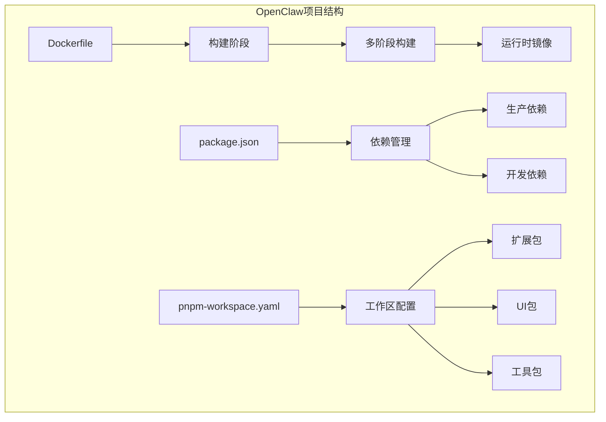
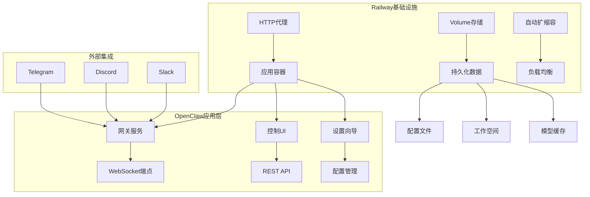
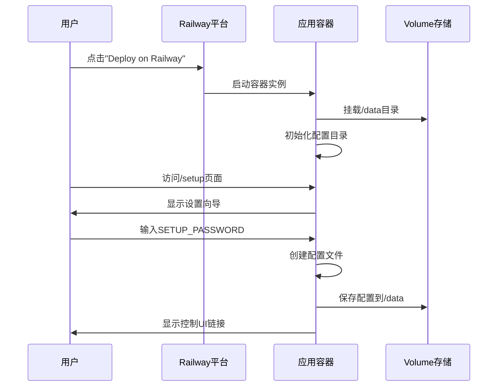
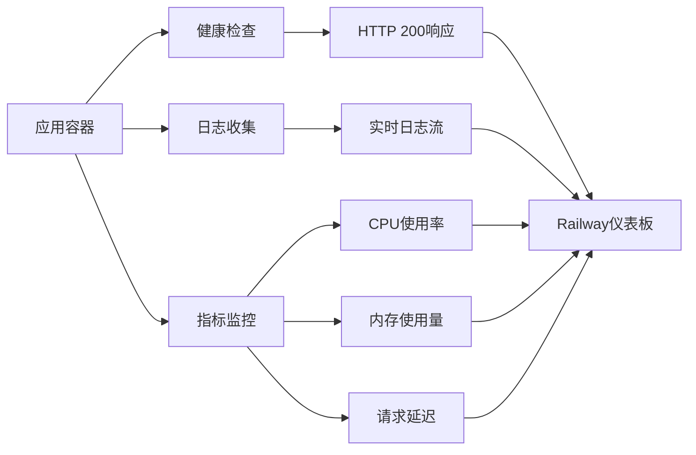
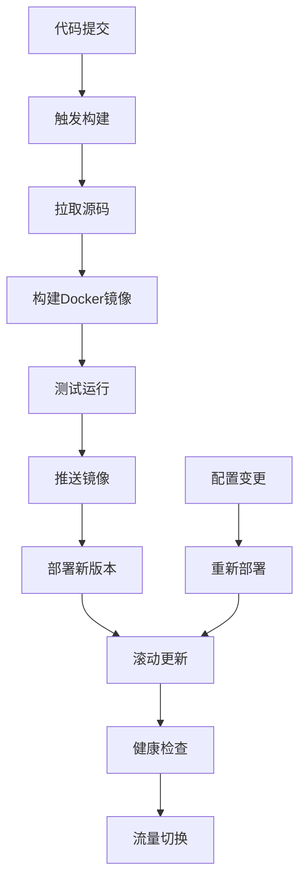
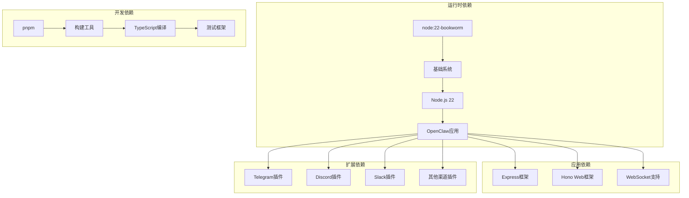
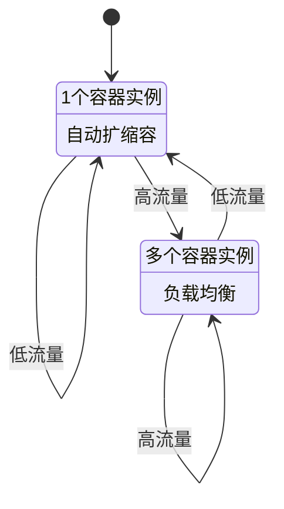
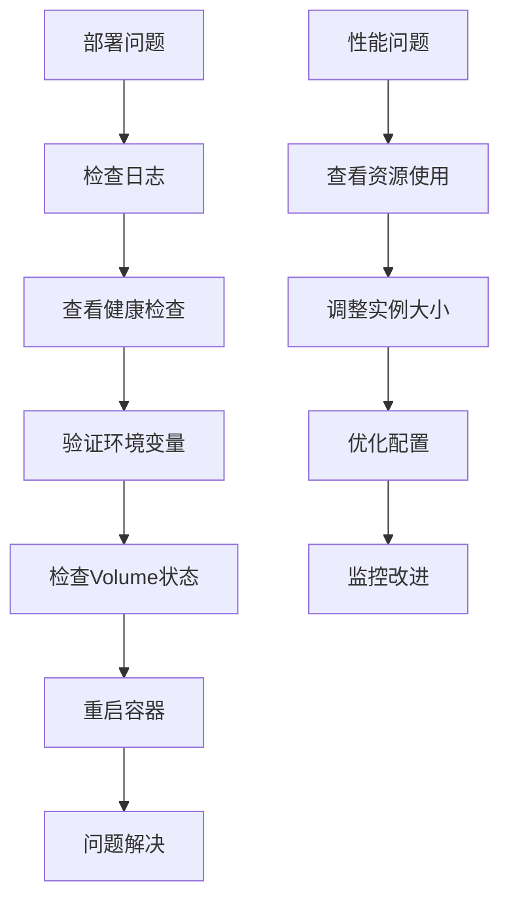
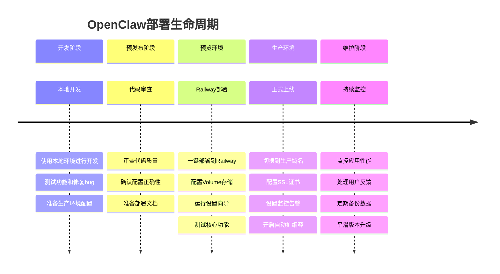

# Railway部署

<cite>
**本文档引用的文件**
- [README.md](file://README.md)
- [railway.mdx](file://docs/install/railway.mdx)
- [Dockerfile](file://Dockerfile)
- [openclaw.mjs](file://openclaw.mjs)
- [package.json](file://package.json)
- [fly.toml](file://fly.toml)
- [pnpm-workspace.yaml](file://pnpm-workspace.yaml)
</cite>

## 目录

1. [简介](#简介)
2. [项目结构](#项目结构)
3. [核心组件](#核心组件)
4. [架构概览](#架构概览)
5. [详细组件分析](#详细组件分析)
6. [依赖关系分析](#依赖关系分析)
7. [性能考虑](#性能考虑)
8. [故障排除指南](#故障排除指南)
9. [结论](#结论)
10. [附录](#附录)

## 简介

Railway是一个现代化的云平台，提供无服务器和容器化应用部署服务。对于OpenClaw项目而言，Railway提供了最简化的部署路径，通过一键模板部署和浏览器向导配置，无需在服务器上使用终端命令。

Railway平台的核心优势包括：

- 一键部署模板，支持快速启动
- 浏览器向导配置，无需命令行操作
- 自动扩缩容能力
- 持久化存储（Volume）
- 内置健康检查和监控
- 支持自定义域名和SSL证书

## 项目结构

OpenClaw项目采用多包工作区结构，支持多种部署方式：



**图表来源**

- [Dockerfile:1-231](file://Dockerfile#L1-L231)
- [package.json:1-465](file://package.json#L1-L465)
- [pnpm-workspace.yaml:1-18](file://pnpm-workspace.yaml#L1-L18)

**章节来源**

- [Dockerfile:1-231](file://Dockerfile#L1-L231)
- [package.json:1-465](file://package.json#L1-L465)
- [pnpm-workspace.yaml:1-18](file://pnpm-workspace.yaml#L1-L18)

## 核心组件

### Railway部署架构

Railway为OpenClaw提供了两种主要的部署模式：

#### 无服务器部署模式

- 基于Railway的容器化服务
- 自动扩缩容和负载均衡
- 通过HTTP代理暴露服务
- 使用Volume实现持久化存储

#### 容器部署方式

- 使用标准Docker镜像
- 支持自定义构建参数
- 可选的浏览器和Docker CLI安装
- 健康检查端点支持

**章节来源**

- [railway.mdx:1-100](file://docs/install/railway.mdx#L1-L100)
- [Dockerfile:103-231](file://Dockerfile#L103-L231)

### 环境变量配置

Railway部署需要的关键环境变量：

| 环境变量               | 必需性 | 默认值          | 描述                                 |
| ---------------------- | ------ | --------------- | ------------------------------------ |
| SETUP_PASSWORD         | 必需   | -               | 设置向导密码，保护配置界面           |
| PORT                   | 必需   | 8080            | 应用监听端口，必须与公共网络设置匹配 |
| OPENCLAW_STATE_DIR     | 推荐   | /data/.openclaw | 配置和状态文件存储目录               |
| OPENCLAW_WORKSPACE_DIR | 推荐   | /data/workspace | 工作空间存储目录                     |
| OPENCLAW_GATEWAY_TOKEN | 推荐   | 自动生成        | 网关访问令牌，作为管理员密钥         |

**章节来源**

- [railway.mdx:56-65](file://docs/install/railway.mdx#L56-L65)

### 数据库连接设置

OpenClaw支持多种数据库后端，Railway部署中主要使用SQLite：

```mermaid
flowchart TD
A[Railway部署] --> B[Volume挂载]
B --> C[/data目录]
C --> D[配置文件]
C --> E[工作空间]
C --> F[日志文件]
D --> G[openclaw.json]
E --> H[技能和插件]
F --> I[运行时日志]
```

**图表来源**

- [railway.mdx:50-55](file://docs/install/railway.mdx#L50-L55)

**章节来源**

- [railway.mdx:93-99](file://docs/install/railway.mdx#L93-L99)

## 架构概览

Railway部署的整体架构设计：



**图表来源**

- [railway.mdx:25-34](file://docs/install/railway.mdx#L25-L34)
- [Dockerfile:224-230](file://Dockerfile#L224-L230)

**章节来源**

- [railway.mdx:35-41](file://docs/install/railway.mdx#L35-L41)

## 详细组件分析

### 项目初始化流程



**图表来源**

- [railway.mdx:66-74](file://docs/install/railway.mdx#L66-L74)

**章节来源**

- [railway.mdx:9-16](file://docs/install/railway.mdx#L9-L16)

### 环境管理机制

Railway的环境管理特性：

#### 预览环境配置

- 独立的部署实例
- 独立的Volume存储
- 独立的域名和SSL证书
- 支持独立的环境变量

#### 生产环境配置

- 多实例部署
- 自动扩缩容
- 负载均衡
- 健康检查和故障转移

**章节来源**

- [railway.mdx:42-65](file://docs/install/railway.mdx#L42-L65)

### 监控功能

Railway提供的监控和可观测性功能：



**图表来源**

- [Dockerfile:224-230](file://Dockerfile#L224-L230)

**章节来源**

- [Dockerfile:224-230](file://Dockerfile#L224-L230)

### 自动部署流程



**图表来源**

- [Dockerfile:39-91](file://Dockerfile#L39-L91)

**章节来源**

- [Dockerfile:39-91](file://Dockerfile#L39-L91)

## 依赖关系分析

### 依赖层次结构



**图表来源**

- [package.json:340-395](file://package.json#L340-L395)
- [Dockerfile:40-84](file://Dockerfile#L40-L84)

**章节来源**

- [package.json:340-395](file://package.json#L340-L395)
- [Dockerfile:40-84](file://Dockerfile#L40-L84)

### 扩展包管理

OpenClaw支持丰富的扩展生态系统：

| 扩展类别 | 数量 | 功能描述                   |
| -------- | ---- | -------------------------- |
| 通信渠道 | 15+  | Telegram, Discord, Slack等 |
| AI模型   | 8+   | OpenAI, Claude, Bedrock等  |
| 工具集成 | 12+  | 浏览器控制, 文件处理等     |
| 平台适配 | 6+   | macOS, iOS, Android等      |

**章节来源**

- [pnpm-workspace.yaml:1-18](file://pnpm-workspace.yaml#L1-L18)

## 性能考虑

### 内存优化策略

Railway部署中的内存管理：

- **Node.js内存限制**: 默认最大堆内存1536MB
- **垃圾回收优化**: 启用编译缓存减少启动时间
- **依赖精简**: 生产环境移除开发依赖
- **缓存策略**: pnpm缓存和Docker层缓存

### 扩展性设计



**图表来源**

- [fly.toml:23-26](file://fly.toml#L23-L26)

**章节来源**

- [fly.toml:10-16](file://fly.toml#L10-L16)

## 故障排除指南

### 常见部署问题

#### 端口配置错误

- **症状**: 应用无法访问
- **解决方案**: 确保PORT环境变量与公共网络设置一致

#### Volume挂载问题

- **症状**: 配置丢失或权限错误
- **解决方案**: 检查Volume挂载路径和权限设置

#### 环境变量缺失

- **症状**: 设置向导无法访问或功能异常
- **解决方案**: 确保所有必需环境变量已正确设置

**章节来源**

- [railway.mdx:42-65](file://docs/install/railway.mdx#L42-L65)

### 监控和诊断



**图表来源**

- [Dockerfile:224-230](file://Dockerfile#L224-L230)

## 结论

Railway为OpenClaw提供了最简化的部署路径，特别适合以下场景：

### 适用场景

- **快速原型验证**: 一键部署，快速验证想法
- **小型团队**: 无需运维专业知识即可运行
- **演示和展示**: 简化的部署流程
- **开发和测试**: 快速的环境搭建和清理

### 优势总结

- **零运维**: 完全托管的基础设施
- **快速部署**: 从代码到运行仅需几分钟
- **自动扩缩容**: 根据需求自动调整资源
- **内置监控**: 完整的可观测性支持
- **成本效益**: 按使用付费的定价模式

### 最佳实践建议

1. **生产环境**: 考虑使用自定义域名和SSL证书
2. **备份策略**: 定期导出配置和工作空间
3. **监控告警**: 设置适当的监控和告警规则
4. **安全配置**: 合理设置环境变量和访问权限

## 附录

### 从开发到生产的完整部署路径



### 环境配置对比表

| 配置项   | 开发环境  | 预览环境       | 生产环境       |
| -------- | --------- | -------------- | -------------- |
| 部署方式 | 本地运行  | Railway容器    | Railway容器    |
| 存储方案 | 本地磁盘  | Railway Volume | Railway Volume |
| 网络配置 | localhost | HTTP代理       | 自定义域名     |
| 扩展性   | 手动管理  | 自动扩缩容     | 自动扩缩容     |
| 监控级别 | 基础监控  | 完整监控       | 全面监控       |

**章节来源**

- [railway.mdx:1-100](file://docs/install/railway.mdx#L1-L100)
- [README.md:1-560](file://README.md#L1-L560)
