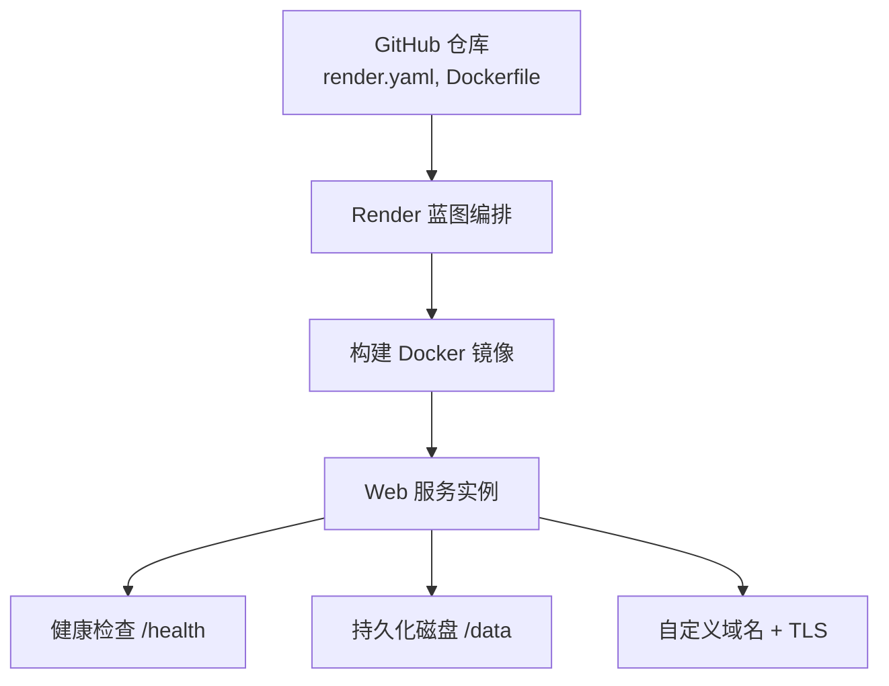
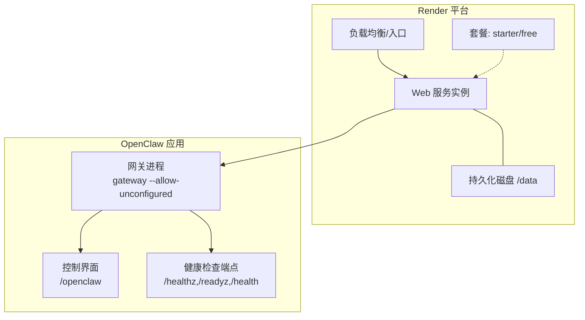
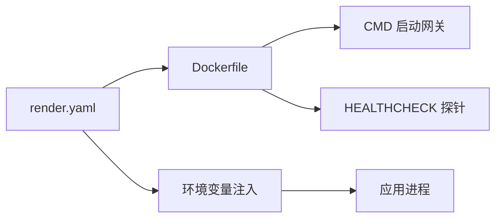

# Render部署

<cite>
**本文引用的文件**
- [render.yaml](file://render.yaml)
- [Dockerfile](file://Dockerfile)
- [openclaw.mjs](file://openclaw.mjs)
- [docs/install/render.mdx](file://docs/install/render.mdx)
- [docs/zh-CN/install/render.mdx](file://docs/zh-CN/install/render.mdx)
- [src/entry.ts](file://src/entry.ts)
- [src/gateway/control-ui.ts](file://src/gateway/control-ui.ts)
- [src/canvas-host/a2ui.ts](file://src/canvas-host/a2ui.ts)
- [apps/macos/Sources/OpenClaw/CanvasScheme.swift](file://apps/macos/Sources/OpenClaw/CanvasScheme.swift)
</cite>

## 目录

1. [简介](#简介)
2. [项目结构](#项目结构)
3. [核心组件](#核心组件)
4. [架构总览](#架构总览)
5. [详细组件分析](#详细组件分析)
6. [依赖关系分析](#依赖关系分析)
7. [性能考量](#性能考量)
8. [故障排查指南](#故障排查指南)
9. [结论](#结论)
10. [附录](#附录)

## 简介

本指南面向在 Render 平台上部署 OpenClaw 的用户，基于仓库中的 render.yaml 蓝图与 Dockerfile，系统讲解如何完成从 GitHub 仓库连接到生产环境上线的完整流程。文档覆盖 Web Service 与 Worker Service 的配置差异、环境变量与持久化磁盘、静态资源处理、域名绑定与 SSL 证书、以及 Render 特有的自动部署与健康检查等能力。

## 项目结构

OpenClaw 在 Render 上采用“蓝图 + Docker 镜像”的部署模式：

- render.yaml 定义服务类型、运行时、计划、健康检查路径、环境变量与持久化磁盘。
- Dockerfile 定义镜像构建与运行时入口，包含健康检查探针与非 root 用户运行策略。
- 文档提供中文与英文双语部署说明，涵盖部署步骤、计划选择、自定义域名、日志与 Shell 访问、自动部署与备份迁移等。

图表来源

- [render.yaml:1-22](file://render.yaml#L1-L22)
- [Dockerfile:224-230](file://Dockerfile#L224-L230)

章节来源

- [render.yaml:1-22](file://render.yaml#L1-L22)
- [Dockerfile:1-231](file://Dockerfile#L1-L231)
- [docs/install/render.mdx:1-160](file://docs/install/render.mdx#L1-L160)
- [docs/zh-CN/install/render.mdx:1-170](file://docs/zh-CN/install/render.mdx#L1-L170)

## 核心组件

- Web 服务（Web Service）
  - 类型：web
  - 运行时：docker
  - 计划：starter（默认），可选 free（无持久盘）
  - 健康检查：/health
  - 环境变量：PORT、SETUP_PASSWORD、OPENCLAW_STATE_DIR、OPENCLAW_WORKSPACE_DIR、OPENCLAW_GATEWAY_TOKEN
  - 持久化磁盘：/data（1GB）
- Worker 服务（Worker Service）
  - Render 蓝图未定义 worker 服务；若需后台任务或队列处理，可在同一蓝图中新增 type: worker 的服务条目，遵循与 web 相同的 runtime/docker 与健康检查约定。

章节来源

- [render.yaml:1-22](file://render.yaml#L1-L22)
- [docs/install/render.mdx:24-73](file://docs/install/render.mdx#L24-L73)

## 架构总览

下图展示 OpenClaw 在 Render 上的部署架构与交互：

图表来源

- [Dockerfile:224-230](file://Dockerfile#L224-L230)
- [render.yaml:1-22](file://render.yaml#L1-L22)

## 详细组件分析

### Web Service 配置与行为

- 服务类型与运行时
  - type: web，runtime: docker，由 render.yaml 指定，Render 将根据仓库 Dockerfile 构建镜像。
- 健康检查
  - healthCheckPath: /health，Dockerfile 中定义了 /healthz、/readyz 别名探针，Render 将在 30 秒内期望收到 200 响应。
- 环境变量
  - PORT: 8080（与 Dockerfile EXPOSE/HEALTHCHECK 保持一致）
  - SETUP_PASSWORD: 部署时同步生成（sync: false），用于首次设置向导
  - OPENCLAW_STATE_DIR、OPENCLAW_WORKSPACE_DIR：指向 /data 下的子目录，确保配置与工作空间持久化
  - OPENCLAW_GATEWAY_TOKEN：自动生成安全令牌（generateValue: true）
- 持久化磁盘
  - disk.name: openclaw-data，mountPath: /data，sizeGB: 1，重启/重建后数据不丢失
- 计划选择
  - starter：永不断电，带持久盘，适合个人与小团队
  - free：空闲 15 分钟断电，无持久盘，适合测试与演示

章节来源

- [render.yaml:1-22](file://render.yaml#L1-L22)
- [Dockerfile:224-230](file://Dockerfile#L224-L230)
- [docs/install/render.mdx:63-73](file://docs/install/render.mdx#L63-L73)

### Worker Service（可选）

- 若需后台任务或队列处理，可在 render.yaml 中新增：
  - type: worker
  - runtime: docker
  - envVars、disk 等与 web 对齐
- 注意：当前仓库未定义 worker 服务，新增时需确保镜像具备相应入口与健康检查策略。

章节来源

- [render.yaml:1-22](file://render.yaml#L1-L22)

### 环境变量与配置注入

- 渲染平台注入
  - render.yaml 中的 envVars 会在容器启动时注入到进程环境中
- 应用侧读取
  - 应用通过标准 Node.js 进程环境读取变量（例如 OPENCLAW_GATEWAY_TOKEN、PORT 等）
- 健康检查与端口一致性
  - Dockerfile 中 HEALTHCHECK 与 CMD 绑定到 127.0.0.1:18789，而 render.yaml 暴露 8080 端口；需确保容器内部监听与外部暴露一致，或通过反向代理/路由适配

章节来源

- [render.yaml:7-17](file://render.yaml#L7-L17)
- [Dockerfile:224-230](file://Dockerfile#L224-L230)
- [openclaw.mjs:1-90](file://openclaw.mjs#L1-L90)
- [src/entry.ts:1-195](file://src/entry.ts#L1-L195)

### 数据持久化与备份迁移

- 持久化磁盘
  - /data 挂载于 openclaw-data，包含 OPENCLAW_STATE_DIR 与 OPENCLAW_WORKSPACE_DIR
- 备份与迁移
  - 通过 /setup/export 导出配置与工作空间，便于在其他 OpenClaw 主机恢复

章节来源

- [render.yaml:18-21](file://render.yaml#L18-L21)
- [docs/install/render.mdx:126-135](file://docs/install/render.mdx#L126-L135)

### 静态资源处理与控制界面

- 控制界面
  - 应用内置控制界面，路径为 /openclaw；Dockerfile 中的 HEALTHCHECK 与 CMD 指向网关进程
- 静态资源 MIME 映射
  - 控制界面按扩展名返回对应 Content-Type，确保浏览器正确渲染 HTML/JS/CSS 等资源
- Canvas 相关
  - A2UI 与 Canvas Scheme 支持在移动端与桌面端通过特定协议加载资源，保证跨平台兼容

章节来源

- [src/gateway/control-ui.ts:37-79](file://src/gateway/control-ui.ts#L37-L79)
- [src/canvas-host/a2ui.ts:81-120](file://src/canvas-host/a2ui.ts#L81-L120)
- [apps/macos/Sources/OpenClaw/CanvasScheme.swift:22-42](file://apps/macos/Sources/OpenClaw/CanvasScheme.swift#L22-L42)

### 域名绑定与 SSL 证书

- 自定义域名
  - 在 Render 仪表盘中添加域名，按指示配置 CNAME 指向 \*.onrender.com
- TLS 证书
  - Render 自动为自定义域名颁发并配置 TLS 证书

章节来源

- [docs/install/render.mdx:110-116](file://docs/install/render.mdx#L110-L116)
- [docs/zh-CN/install/render.mdx:121-127](file://docs/zh-CN/install/render.mdx#L121-L127)

### 自动部署与蓝绿/滚动发布

- 自动部署
  - 若使用原始仓库，Render 不会自动部署；需在仪表盘手动执行 Blueprint 同步
- 蓝图变更
  - 修改 render.yaml 后，Render 将重新评估并部署

章节来源

- [docs/install/render.mdx:106-109](file://docs/install/render.mdx#L106-L109)
- [docs/zh-CN/install/render.mdx:117-120](file://docs/zh-CN/install/render.mdx#L117-L120)

### Web GPU 支持（概念性说明）

- Render 平台对 Web GPU 的支持取决于底层基础设施与运行时环境；OpenClaw 未在 render.yaml 或 Dockerfile 中显式声明 Web GPU 相关参数
- 如需启用 Web GPU，建议在应用层通过浏览器 API 探测与降级策略实现，并结合平台监控与日志观测效果

[本节为概念性说明，不直接分析具体源码文件]

## 依赖关系分析

- render.yaml 依赖 Dockerfile
  - render.yaml 的 runtime: docker 指示 Render 使用仓库 Dockerfile 构建镜像
- Dockerfile 依赖 Node.js 运行时与健康检查探针
  - CMD 与 HEALTHCHECK 指向网关进程与健康端点，确保 Render 能正确判定实例健康状态
- 环境变量与应用配置
  - render.yaml 注入的环境变量被应用通过进程环境读取，影响网关绑定、端口与令牌等行为

图表来源

- [render.yaml:1-22](file://render.yaml#L1-L22)
- [Dockerfile:224-230](file://Dockerfile#L224-L230)

章节来源

- [render.yaml:1-22](file://render.yaml#L1-L22)
- [Dockerfile:1-231](file://Dockerfile#L1-L231)

## 性能考量

- 垂直扩展优先
  - Render 支持通过提升套餐获得更高 CPU/内存，通常足以满足 OpenClaw 的运行需求
- 水平扩展注意事项
  - 若开启多实例，需考虑粘性会话或外部状态管理，避免会话与状态分散导致异常
- 冷启动优化
  - 免费套餐在空闲后会休眠，首次请求可能较慢；建议 Starter 套餐以获得常在线体验

章节来源

- [docs/install/render.mdx:117-125](file://docs/install/render.mdx#L117-L125)
- [docs/zh-CN/install/render.mdx:128-136](file://docs/zh-CN/install/render.mdx#L128-L136)

## 故障排查指南

- 服务无法启动
  - 检查部署日志；确认 SETUP_PASSWORD 已设置且 PORT=8080 与 Dockerfile 一致
- 健康检查失败
  - Render 期望在 30 秒内从 /health 获得 200 响应；检查构建日志与本地容器运行情况
- 重新部署后数据丢失
  - 免费套餐无持久盘；升级套餐或定期通过 /setup/export 导出配置
- 冷启动缓慢
  - 免费套餐空闲休眠；升级套餐或接受首次请求延迟

章节来源

- [docs/install/render.mdx:136-160](file://docs/install/render.mdx#L136-L160)
- [docs/zh-CN/install/render.mdx:147-170](file://docs/zh-CN/install/render.mdx#L147-L170)

## 结论

通过 render.yaml 与 Dockerfile 的配合，OpenClaw 可在 Render 上实现一键部署、健康监控、持久化存储与自定义域名。建议在生产环境中选择 Starter 套餐并配置自定义域名，同时利用 /setup/export 定期备份配置与工作空间，确保业务连续性与可迁移性。

## 附录

### 部署流程（从 GitHub 到生产）

- 在 Render 仪表盘点击“部署到 Render”，关联仓库并使用根目录 render.yaml
- 部署过程中将提示设置 SETUP_PASSWORD
- 部署完成后访问 https://<service-name>.onrender.com/setup 完成首次设置
- 可选：在仪表盘中添加自定义域名并配置 CNAME，Render 自动签发 TLS 证书
- 可选：在仪表盘中调整套餐以实现垂直扩展，或手动同步 Blueprint 以触发自动部署

章节来源

- [docs/install/render.mdx:12-22](file://docs/install/render.mdx#L12-L22)
- [docs/zh-CN/install/render.mdx:19-36](file://docs/zh-CN/install/render.mdx#L19-L36)
