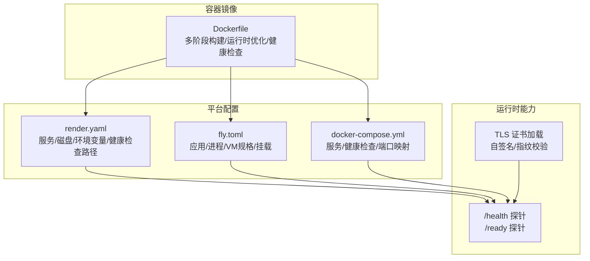
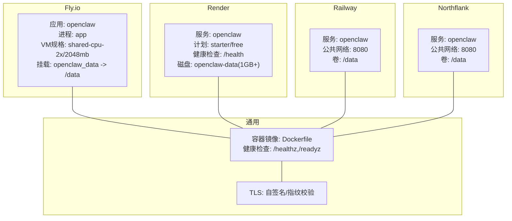
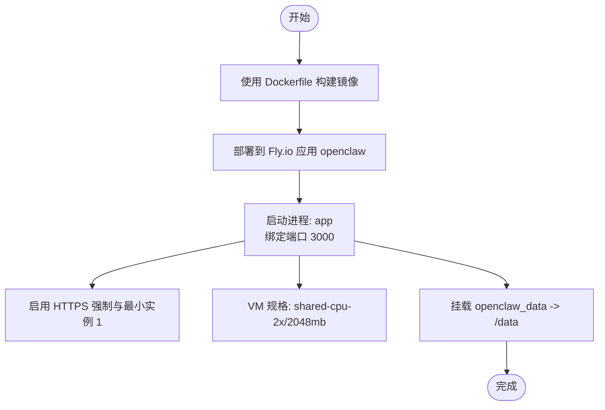
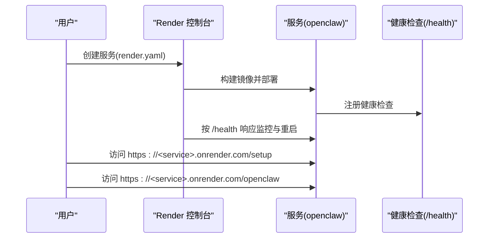
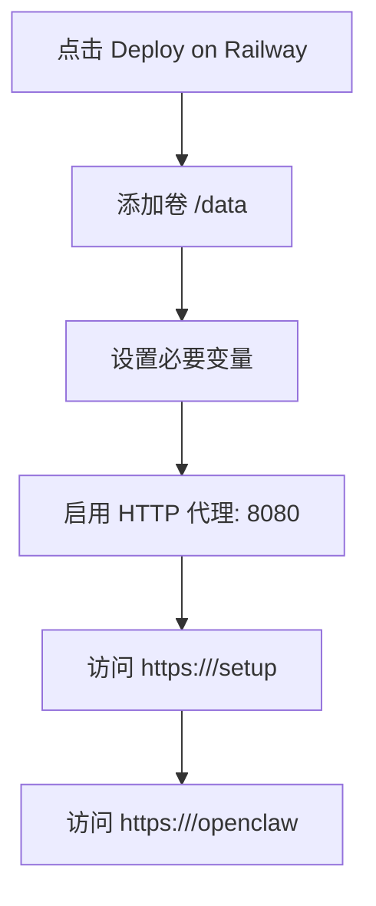
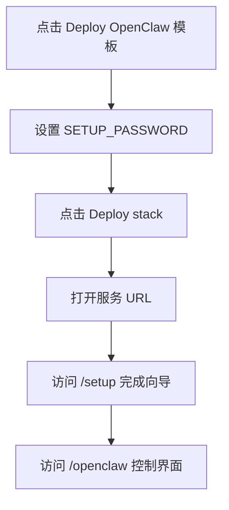
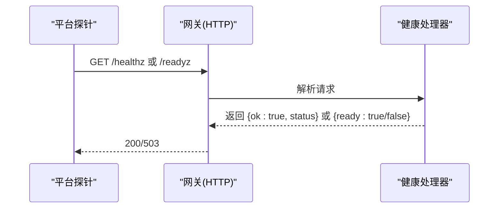
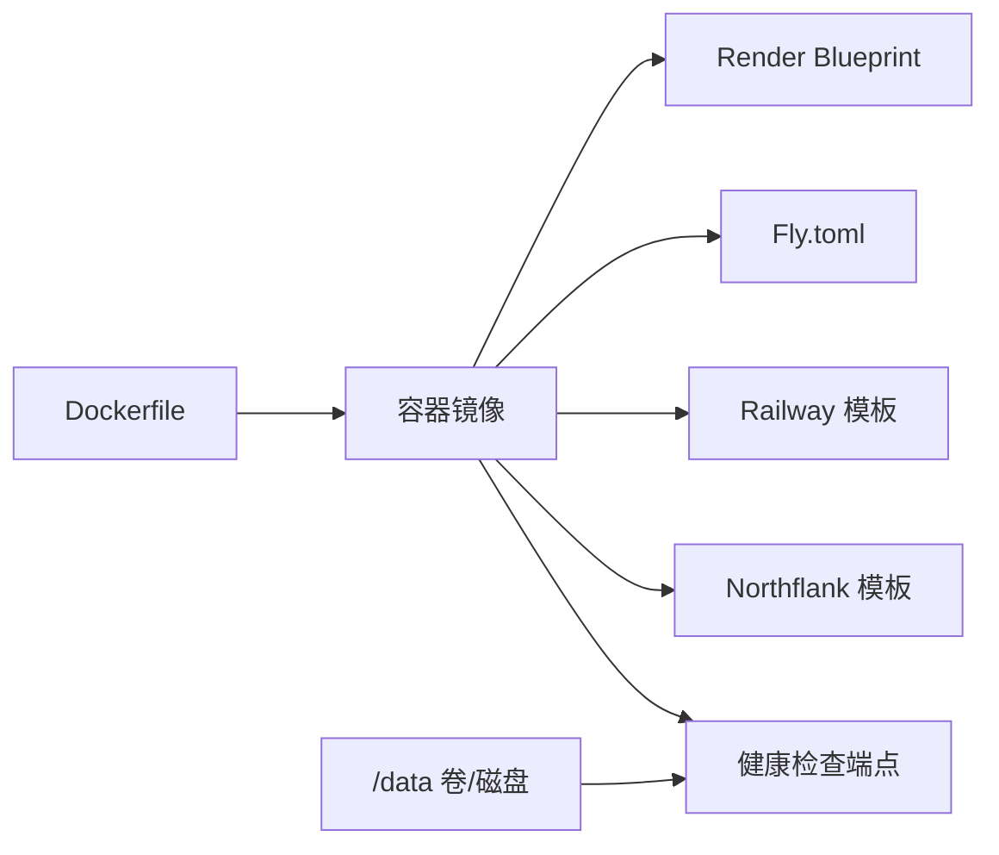

# 云平台部署

<cite>
**本文引用的文件**
- [fly.toml](file://fly.toml)
- [render.yaml](file://render.yaml)
- [Dockerfile](file://Dockerfile)
- [docker-compose.yml](file://docker-compose.yml)
- [docs/install/railway.mdx](file://docs/install/railway.mdx)
- [docs/install/northflank.mdx](file://docs/install/northflank.mdx)
- [docs/install/render.mdx](file://docs/install/render.mdx)
- [scripts/podman/openclaw.container.in](file://scripts/podman/openclaw.container.in)
- [src/gateway/server-methods/health.ts](file://src/gateway/server-methods/health.ts)
- [src/gateway/server-http.ts](file://src/gateway/server-http.ts)
- [src/infra/tls/gateway.ts](file://src/infra/tls/gateway.ts)
- [apps/android/app/src/main/java/ai/openclaw/app/gateway/GatewayTls.kt](file://apps/android/app/src/main/java/ai/openclaw/app/gateway/GatewayTls.kt)
- [apps/shared/OpenClawKit/Sources/OpenClawKit/GatewayTLSPinning.swift](file://apps/shared/OpenClawKit/Sources/OpenClawKit/GatewayTLSPinning.swift)
</cite>

## 目录

1. [简介](#简介)
2. [项目结构](#项目结构)
3. [核心组件](#核心组件)
4. [架构总览](#架构总览)
5. [详细组件分析](#详细组件分析)
6. [依赖关系分析](#依赖关系分析)
7. [性能考量](#性能考量)
8. [故障排查指南](#故障排查指南)
9. [结论](#结论)
10. [附录](#附录)

## 简介

本指南面向在 Fly.io、Render、Railway、Northflank 等云平台上部署 OpenClaw 的用户与运维工程师，覆盖从免费层级到生产级的完整部署方案。内容包括：

- 各平台的部署配置要点（环境变量、资源分配、自动扩缩容、健康检查）
- 容器镜像优化、CDN 配置与数据库连接池建议
- SSL 证书、域名绑定与 DNS 设置步骤
- 云原生最佳实践与常见问题排查

## 项目结构

OpenClaw 提供了多平台部署所需的基础设施定义与运行时配置：

- 容器化构建：根目录 Dockerfile 定义多阶段构建、运行时基础镜像与健康检查命令
- 平台蓝图：render.yaml 声明式定义服务、磁盘与环境变量；fly.toml 定义 Fly.io 应用与进程
- 本地编排：docker-compose.yml 定义网关与 CLI 服务、健康检查与端口映射
- 平台文档：docs/install 下包含 Railway、Northflank、Render 的部署说明

图表来源

- [Dockerfile:224-230](file://Dockerfile#L224-L230)
- [render.yaml:1-22](file://render.yaml#L1-L22)
- [fly.toml:17-35](file://fly.toml#L17-L35)
- [docker-compose.yml:38-49](file://docker-compose.yml#L38-L49)
- [src/gateway/server-methods/health.ts:10-37](file://src/gateway/server-methods/health.ts#L10-L37)
- [src/gateway/server-http.ts:198-236](file://src/gateway/server-http.ts#L198-L236)
- [src/infra/tls/gateway.ts:81-150](file://src/infra/tls/gateway.ts#L81-L150)

章节来源

- [Dockerfile:1-231](file://Dockerfile#L1-L231)
- [render.yaml:1-22](file://render.yaml#L1-L22)
- [fly.toml:1-35](file://fly.toml#L1-L35)
- [docker-compose.yml:1-77](file://docker-compose.yml#L1-L77)

## 核心组件

- 容器镜像与运行时
  - 多阶段构建，剥离开发依赖，仅保留运行所需资产
  - 运行时以非 root 用户执行，增强安全性
  - 内置健康检查端点，支持 liveness/readiness
- 平台部署配置
  - Render：Blueprint 声明式定义服务、磁盘、环境变量与健康检查路径
  - Fly.io：应用与进程定义、VM 规格、持久化挂载
  - Railway/Northflank：一键模板，通过环境变量与卷实现持久化
- 健康检查与就绪探针
  - /healthz（存活）、/readyz（就绪），以及别名 /health、/ready
  - 云平台按健康检查结果进行重启与扩缩容决策

章节来源

- [Dockerfile:224-230](file://Dockerfile#L224-L230)
- [render.yaml:6-7](file://render.yaml#L6-L7)
- [fly.toml:20-26](file://fly.toml#L20-L26)
- [docker-compose.yml:38-49](file://docker-compose.yml#L38-L49)

## 架构总览

下图展示 OpenClaw 在不同云平台上的部署架构与关键配置点：

图表来源

- [fly.toml:4-35](file://fly.toml#L4-L35)
- [render.yaml:1-22](file://render.yaml#L1-L22)
- [docs/install/railway.mdx:42-65](file://docs/install/railway.mdx#L42-L65)
- [docs/install/northflank.mdx:9-35](file://docs/install/northflank.mdx#L9-L35)
- [Dockerfile:224-230](file://Dockerfile#L224-L230)
- [src/infra/tls/gateway.ts:81-150](file://src/infra/tls/gateway.ts#L81-L150)

## 详细组件分析

### Fly.io 部署配置

- 应用与区域
  - 应用名与主区域需根据就近原则选择
- 构建与镜像
  - 使用根目录 Dockerfile
- 进程与启动参数
  - 进程类型为 app，启动命令包含网关入口与端口绑定
- 网络与 HTTPS
  - 内部端口 3000，强制 HTTPS，保持机器运行以维持长连接
- 资源与自动扩缩容
  - 最小运行实例数为 1，避免无人访问时完全停止
- VM 规格与持久化
  - VM 规格为 shared-cpu-2x，内存 2048MB
  - 挂载名为 openclaw_data 的卷到 /data，用于状态与工作区持久化

图表来源

- [fly.toml:1-35](file://fly.toml#L1-L35)

章节来源

- [fly.toml:1-35](file://fly.toml#L1-L35)

### Render 部署配置

- 一键部署
  - 通过 Render Blueprint 仓库链接一键创建服务
- 蓝图关键项
  - 类型 web、Docker 运行时、starter 计划
  - 健康检查路径 /health
  - 环境变量：PORT=8080、SETUP_PASSWORD、OPENCLAW_STATE_DIR、OPENCLAW_WORKSPACE_DIR、OPENCLAW_GATEWAY_TOKEN（自动生成）
  - 磁盘：openclaw-data，挂载 /data，大小 1GB+
- 计划与扩缩容
  - Free：空闲后休眠；Starter/Standard+：常驻与水平扩展
- 域名与证书
  - 支持自定义域名，按指引配置 CNAME，Render 自动签发 TLS 证书
- 后续操作
  - 访问 /setup 完成向导；/openclaw 打开控制界面

图表来源

- [render.yaml:1-22](file://render.yaml#L1-L22)
- [docs/install/render.mdx:110-116](file://docs/install/render.mdx#L110-L116)

章节来源

- [render.yaml:1-22](file://render.yaml#L1-L22)
- [docs/install/render.mdx:1-160](file://docs/install/render.mdx#L1-L160)

### Railway 部署配置

- 一键模板
  - 通过 Railway 模板一键部署
- 必要设置
  - 添加卷并挂载至 /data
  - 设置变量：SETUP_PASSWORD（必填）、PORT=8080、OPENCLAW_STATE_DIR、OPENCLAW_WORKSPACE_DIR、OPENCLAW_GATEWAY_TOKEN
  - 启用 HTTP 代理端口 8080
- 后续流程
  - 访问 /setup 完成向导；/openclaw 打开控制界面

图表来源

- [docs/install/railway.mdx:9-15](file://docs/install/railway.mdx#L9-L15)
- [docs/install/railway.mdx:42-65](file://docs/install/railway.mdx#L42-L65)

章节来源

- [docs/install/railway.mdx:1-100](file://docs/install/railway.mdx#L1-L100)

### Northflank 部署配置

- 一键模板
  - 通过 Northflank 模板一键部署
- 必要设置
  - 设置变量：SETUP_PASSWORD
  - 部署后打开服务，访问 /setup 完成向导；/openclaw 打开控制界面

图表来源

- [docs/install/northflank.mdx:9-35](file://docs/install/northflank.mdx#L9-L35)

章节来源

- [docs/install/northflank.mdx:1-54](file://docs/install/northflank.mdx#L1-L54)

### 健康检查与就绪探针

- 端点与语义
  - /healthz：存活探针（liveness）
  - /readyz：就绪探针（readiness）
  - 别名：/health、/ready
- 云平台集成
  - Render 使用 /health；Fly.io、docker-compose 通过内置健康检查命令实现
- 响应行为
  - /health 对就绪状态返回 200 或 503，支持可选详情返回

图表来源

- [Dockerfile:224-230](file://Dockerfile#L224-L230)
- [src/gateway/server-methods/health.ts:10-37](file://src/gateway/server-methods/health.ts#L10-L37)
- [src/gateway/server-http.ts:198-236](file://src/gateway/server-http.ts#L198-L236)

章节来源

- [src/gateway/server-methods/health.ts:1-37](file://src/gateway/server-methods/health.ts#L1-L37)
- [src/gateway/server-http.ts:198-236](file://src/gateway/server-http.ts#L198-L236)

### 容器镜像优化与运行时

- 多阶段构建与裁剪
  - 构建阶段安装依赖与打包，运行阶段仅复制 dist、node_modules、扩展与文档，剔除开发产物
- 运行时安全
  - 以非 root 用户运行，降低逃逸风险
- 可选功能
  - 可在构建时开启浏览器与 Docker CLI，减少冷启动与外部依赖
- 健康检查
  - 内置健康检查命令，探测本地 /healthz

章节来源

- [Dockerfile:1-231](file://Dockerfile#L1-L231)

### Podman/本地运行参考

- Quadlet（rootless）示例
  - 映射配置与工作区到宿主机目录
  - 环境变量与端口发布
  - 执行命令为网关入口

章节来源

- [scripts/podman/openclaw.container.in:1-29](file://scripts/podman/openclaw.container.in#L1-L29)

## 依赖关系分析

- 平台配置对容器镜像的依赖
  - Render/Fly/Railway/Northflank 均基于根目录 Dockerfile 构建镜像
- 健康检查对运行时的依赖
  - /healthz、/readyz 由网关内部实现，云平台据此进行扩缩容与重启
- 存储与持久化
  - 平台均提供卷或磁盘，挂载至 /data，保障状态与工作区持久化

图表来源

- [Dockerfile:1-231](file://Dockerfile#L1-L231)
- [render.yaml:1-22](file://render.yaml#L1-L22)
- [fly.toml:1-35](file://fly.toml#L1-L35)
- [docker-compose.yml:1-77](file://docker-compose.yml#L1-L77)

章节来源

- [Dockerfile:1-231](file://Dockerfile#L1-L231)
- [render.yaml:1-22](file://render.yaml#L1-L22)
- [fly.toml:1-35](file://fly.toml#L1-L35)
- [docker-compose.yml:1-77](file://docker-compose.yml#L1-L77)

## 性能考量

- 容器镜像层面
  - 使用 slim 基础镜像变体可减小体积；按需启用浏览器与 Docker CLI 缓解冷启动
  - 多阶段构建与裁剪减少运行时依赖
- 平台层面
  - Render Starter/Standard+ 提供常驻与水平扩展能力；Fly.io VM 规格可按需提升
  - 合理设置最小运行实例，避免无人访问时完全停止导致的冷启动延迟
- 健康检查与探针
  - 云平台通常有超时与重试策略，确保 /healthz 响应快速稳定

## 故障排查指南

- 服务无法启动
  - 检查必要环境变量是否设置（如 SETUP_PASSWORD、PORT）
  - 确认容器本地可运行（docker build && docker run）
- 健康检查失败
  - Render：确认 /health 在 30 秒内返回 200；检查构建日志与容器启动时间
  - Fly.io：确认进程命令与端口一致，且 /healthz 可访问
- 数据丢失
  - Render Free 层无持久磁盘；升级计划或定期导出 /setup/export
- 冷启动慢
  - Render Free 层空闲后休眠；升级到 Starter/Standard+ 获取常驻实例
- 域名与证书
  - Render：按提示配置 CNAME，自动签发 TLS 证书
  - 自签名证书与指纹校验：服务端可生成自签名证书并输出指纹，客户端可校验指纹或采用“首次信任”模式

章节来源

- [docs/install/render.mdx:136-160](file://docs/install/render.mdx#L136-L160)
- [src/infra/tls/gateway.ts:81-150](file://src/infra/tls/gateway.ts#L81-L150)
- [apps/android/app/src/main/java/ai/openclaw/app/gateway/GatewayTls.kt:35-66](file://apps/android/app/src/main/java/ai/openclaw/app/gateway/GatewayTls.kt#L35-L66)
- [apps/shared/OpenClawKit/Sources/OpenClawKit/GatewayTLSPinning.swift:66-87](file://apps/shared/OpenClawKit/Sources/OpenClawKit/GatewayTLSPinning.swift#L66-L87)

## 结论

通过统一的容器镜像与平台蓝图，OpenClaw 可在 Fly.io、Render、Railway、Northflank 上实现一致的部署体验。结合健康检查、持久化存储与合理的计费计划，可在免费层级快速验证，在生产环境中实现高可用与可观测性。

## 附录

- 平台一键部署与设置清单
  - Render：Blueprint 清单、健康检查路径、环境变量与磁盘
  - Fly.io：应用与进程、VM 规格、挂载卷
  - Railway/Northflank：模板、卷与环境变量
- 健康检查端点
  - /healthz（存活）、/readyz（就绪），别名 /health、/ready
- TLS 与证书
  - 服务端可自签名并输出指纹；客户端支持指纹校验或“首次信任”模式
