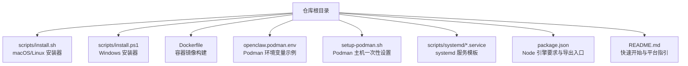
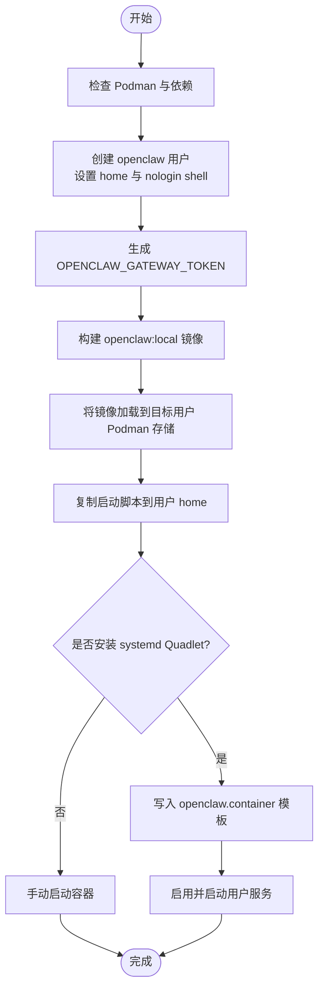
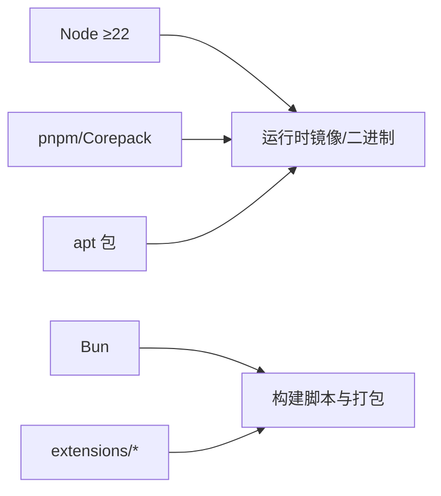

# 传统部署

<cite>
**本文引用的文件**
- [README.md](file://README.md)
- [package.json](file://package.json)
- [openclaw.podman.env](file://openclaw.podman.env)
- [scripts/install.sh](file://scripts/install.sh)
- [setup-podman.sh](file://setup-podman.sh)
- [Dockerfile](file://Dockerfile)
- [scripts/systemd/openclaw-auth-monitor.service](file://scripts/systemd/openclaw-auth-monitor.service)
- [scripts/systemd/openclaw-auth-monitor.timer](file://scripts/systemd/openclaw-auth-monitor.timer)
- [scripts/install.ps1](file://scripts/install.ps1)
</cite>

## 目录

1. [简介](#简介)
2. [项目结构](#项目结构)
3. [核心组件](#核心组件)
4. [架构总览](#架构总览)
5. [详细组件分析](#详细组件分析)
6. [依赖关系分析](#依赖关系分析)
7. [性能考量](#性能考量)
8. [故障排查指南](#故障排查指南)
9. [结论](#结论)
10. [附录](#附录)

## 简介

本指南面向希望采用“传统部署”方式（即直接在物理机或虚拟机上安装与运行）的用户，覆盖从 macOS 虚拟机、Windows 开发环境到 Linux 服务器的完整部署路径。内容包括：

- Node.js 运行时与包管理器准备
- 系统依赖安装与配置
- 配置文件设置与最小化启动
- Podman 容器运行时的配置与使用
- 系统服务配置（systemd、launchd、Windows 服务）
- 从开发环境到生产环境的端到端流程

## 项目结构

OpenClaw 提供了多平台安装脚本与容器镜像，支持通过 npm 全局安装或直接运行打包后的可执行入口。仓库根目录包含安装脚本、Dockerfile、Podman 设置脚本以及 systemd 服务模板等。



图表来源

- [scripts/install.sh:1-800](file://scripts/install.sh#L1-L800)
- [scripts/install.ps1](file://scripts/install.ps1)
- [Dockerfile:1-231](file://Dockerfile#L1-L231)
- [openclaw.podman.env:1-25](file://openclaw.podman.env#L1-L25)
- [setup-podman.sh:1-313](file://setup-podman.sh#L1-L313)
- [scripts/systemd/openclaw-auth-monitor.service](file://scripts/systemd/openclaw-auth-monitor.service)
- [scripts/systemd/openclaw-auth-monitor.timer](file://scripts/systemd/openclaw-auth-monitor.timer)
- [package.json:422-424](file://package.json#L422-L424)
- [README.md:50-81](file://README.md#L50-L81)

章节来源

- [README.md:50-81](file://README.md#L50-L81)
- [package.json:422-424](file://package.json#L422-L424)

## 核心组件

- Node.js 运行时：要求 Node ≥22；推荐使用 pnpm 或 Bun 进行开发与运行。
- CLI 可执行入口：通过 openclaw.mjs 提供命令行入口，支持 gateway、agent、wizard 等子命令。
- 安装器：scripts/install.sh 为 macOS/Linux 的自动化安装脚本；scripts/install.ps1 用于 Windows。
- 容器与 Podman：Dockerfile 定义容器镜像；openclaw.podman.env 提供 Podman 环境变量示例；setup-podman.sh 一键完成 Podman 主机设置与镜像加载。
- 系统服务：提供 systemd 服务模板与定时任务模板，便于开机自启与后台守护。

章节来源

- [README.md:50-81](file://README.md#L50-L81)
- [package.json:16-18](file://package.json#L16-L18)
- [scripts/install.sh:1-800](file://scripts/install.sh#L1-L800)
- [scripts/install.ps1](file://scripts/install.ps1)
- [Dockerfile:1-231](file://Dockerfile#L1-L231)
- [openclaw.podman.env:1-25](file://openclaw.podman.env#L1-L25)
- [setup-podman.sh:1-313](file://setup-podman.sh#L1-L313)
- [scripts/systemd/openclaw-auth-monitor.service](file://scripts/systemd/openclaw-auth-monitor.service)
- [scripts/systemd/openclaw-auth-monitor.timer](file://scripts/systemd/openclaw-auth-monitor.timer)

## 架构总览

下图展示了传统部署中的典型运行形态：本地主机直接运行 OpenClaw Gateway，通过 CLI 启动并在本地网络暴露 WebSocket 控制面；在需要时可结合浏览器自动化与设备节点能力。

```mermaid
graph TB
subgraph "宿主机"
U["用户终端/CLI"]
GW["OpenClaw Gateway<br/>WebSocket 控制面"]
CFG["配置文件<br/>~/.openclaw/openclaw.json"]
WS["WebChat/UI<br/>内嵌于 Gateway"]
end
subgraph "外部通道"
CH["各消息渠道插件<br/>Telegram/Slack/Discord/..."]
NODE["设备节点<br/>macOS/iOS/Android"]
end
U --> GW
GW --> CFG
GW --> WS
GW <- --> CH
GW <- --> NODE
```

图表来源

- [README.md:185-238](file://README.md#L185-L238)

章节来源

- [README.md:185-238](file://README.md#L185-L238)

## 详细组件分析

### macOS 虚拟机部署

- 系统要求：macOS 虚拟机需满足 Node ≥22 的运行条件。
- 安装方式：优先使用 scripts/install.sh 自动安装（会检测终端 UI 工具 gum 并引导交互式安装）。
- 基础依赖：Xcode Command Line Tools（make/clang）、cmake（若缺失会提示自动安装）。
- 最小化启动：安装后可通过 openclaw onboard 初始化配置，并使用 openclaw gateway --port 18789 启动控制面。
- 权限与安全：默认仅绑定 loopback 地址，如需外网访问需显式调整绑定与鉴权策略。

章节来源

- [scripts/install.sh:622-654](file://scripts/install.sh#L622-L654)
- [README.md:50-81](file://README.md#L50-L81)

### Windows 开发环境部署

- 安装方式：使用 scripts/install.ps1 在 PowerShell 中执行，自动检测 Node 与包管理器并进行安装。
- 注意事项：Windows 上建议通过 WSL2 运行以获得更佳兼容性；若直接在 Windows 本地运行，注意路径与权限差异。
- 启动与调试：安装完成后使用 openclaw 命令启动 Gateway，并通过 WebChat 进行调试。

章节来源

- [scripts/install.ps1](file://scripts/install.ps1)

### Linux 服务器部署

- 安装方式：scripts/install.sh 支持 Linux（含 WSL），会根据发行版选择合适的包管理器安装构建工具（make、cmake、gcc 等）。
- 服务化运行：可结合 systemd 服务模板实现开机自启与健康检查；也可直接以用户态进程运行。
- 安全建议：默认绑定 loopback，生产环境需开启鉴权并对外暴露时使用受控网络或隧道。

章节来源

- [scripts/install.sh:568-620](file://scripts/install.sh#L568-L620)
- [scripts/systemd/openclaw-auth-monitor.service](file://scripts/systemd/openclaw-auth-monitor.service)
- [scripts/systemd/openclaw-auth-monitor.timer](file://scripts/systemd/openclaw-auth-monitor.timer)

### Node.js 环境准备与系统依赖

- Node 版本：要求 Node ≥22；package.json 明确 engines 字段。
- 包管理器：推荐 pnpm；Bun 可用于开发与运行脚本。
- 构建工具：根据操作系统自动安装 make、cmake、gcc 等；部分二进制依赖可能需要额外系统库。
- 浏览器自动化：如需使用 Playwright，请在容器中预装 Chromium 与 Xvfb，或在宿主环境中按需安装。

章节来源

- [package.json:422-424](file://package.json#L422-L424)
- [scripts/install.sh:568-654](file://scripts/install.sh#L568-L654)
- [Dockerfile:157-171](file://Dockerfile#L157-L171)

### 配置文件设置与最小化启动

- 默认配置位置：~/.openclaw/openclaw.json
- 最小化示例：至少设置 agent.model 与 gateway.mode=local。
- 启动命令：openclaw gateway --port 18789 --verbose；或使用 openclaw onboard 完成向导式初始化。
- 外部访问：如需从宿主机访问，需将 gateway.bind 设为 lan 并配置鉴权令牌。

章节来源

- [README.md:318-338](file://README.md#L318-L338)
- [Dockerfile:216-227](file://Dockerfile#L216-L227)

### Podman 容器运行时配置与使用

- 环境变量：参考 openclaw.podman.env，设置 OPENCLAW_GATEWAY_TOKEN、端口映射与可选的 LLM 凭证。
- 主机设置：执行 setup-podman.sh 创建专用用户、生成令牌、构建镜像并加载到目标用户的 Podman 存储。
- 启动方式：使用 run-openclaw-podman.sh launch 启动容器；可选安装 systemd Quadlet 实现用户态服务。
- 生产建议：启用 lingering、配置 subuid/subgid、使用 systemd 管理生命周期。



图表来源

- [setup-podman.sh:126-313](file://setup-podman.sh#L126-L313)
- [openclaw.podman.env:1-25](file://openclaw.podman.env#L1-L25)

章节来源

- [openclaw.podman.env:1-25](file://openclaw.podman.env#L1-L25)
- [setup-podman.sh:1-313](file://setup-podman.sh#L1-L313)

### 系统服务配置（systemd、launchd、Windows 服务）

- systemd（Linux）：提供 openclaw-auth-monitor.service 与 timer 模板，可用于定时任务与认证监控；可配合 Quadlet 使用。
- launchd（macOS）：可将 openclaw 作为用户级服务运行，随登录自动启动。
- Windows：使用 scripts/install.ps1 安装后，可通过 Windows 服务或计划任务实现开机自启（具体注册方式请参考安装脚本输出与系统服务管理工具）。

章节来源

- [scripts/systemd/openclaw-auth-monitor.service](file://scripts/systemd/openclaw-auth-monitor.service)
- [scripts/systemd/openclaw-auth-monitor.timer](file://scripts/systemd/openclaw-auth-monitor.timer)
- [scripts/install.ps1](file://scripts/install.ps1)

## 依赖关系分析

- 运行时依赖：Node ≥22；容器镜像基于 node:22-bookworm；pnpm 与 Corepack 在运行时可用。
- 构建依赖：Bun（用于构建脚本）、Playwright（可选，预装可减少启动等待）。
- 系统库：不同发行版的构建工具链；容器中可按需安装额外 apt 包。
- 插件与扩展：通过 extensions 目录注入，构建阶段可选择性提取特定扩展的依赖以加速缓存。



图表来源

- [package.json:340-395](file://package.json#L340-L395)
- [Dockerfile:40-84](file://Dockerfile#L40-L84)
- [Dockerfile:147-203](file://Dockerfile#L147-L203)

章节来源

- [package.json:340-395](file://package.json#L340-L395)
- [Dockerfile:40-84](file://Dockerfile#L40-L84)
- [Dockerfile:147-203](file://Dockerfile#L147-L203)

## 性能考量

- 内存与并发：构建阶段限制最大堆内存以避免低配主机上的 OOM；生产运行建议为容器分配足够内存。
- 浏览器自动化：预装 Chromium 与 Playwright 可显著降低首次启动的下载时间。
- 二进制依赖：部分原生模块需要系统构建工具链，提前安装可避免安装失败与重试。
- 端口与网络：默认绑定 loopback，外网访问需显式配置绑定与鉴权，避免不必要的暴露。

## 故障排查指南

- Node 版本不匹配：确认 Node ≥22；安装器会检测版本并给出升级建议。
- 缺少构建工具：安装器会尝试自动安装 make、cmake、gcc 等；若失败，请手动安装对应包。
- npm 安装失败：安装器会收集 npm 日志并打印诊断信息；必要时先安装构建工具再重试。
- 容器无法启动：检查 OPENCLAW_GATEWAY_TOKEN 是否正确设置；确认端口未被占用；查看容器日志定位问题。
- systemd/launchd 服务异常：核对服务单元文件语法与权限；使用 journalctl/systemctl 查看状态与错误日志。

章节来源

- [scripts/install.sh:535-800](file://scripts/install.sh#L535-L800)
- [setup-podman.sh:139-158](file://setup-podman.sh#L139-L158)

## 结论

通过本指南，您可以在 macOS 虚拟机、Windows 开发环境与 Linux 服务器上完成 OpenClaw 的传统部署。建议在开发阶段使用本地安装与 CLI 启动，在生产阶段结合 systemd/launchd 或 Podman 用户服务实现稳定运行，并根据实际需求启用浏览器自动化与额外系统库，确保性能与安全性。

## 附录

- 快速开始命令（Node 安装后）：
  - npm 安装全局包并运行向导：npm install -g openclaw@latest && openclaw onboard --install-daemon
  - 直接启动 Gateway：openclaw gateway --port 18789 --verbose
- 容器与 Podman：
  - 构建镜像：docker build -t openclaw:local .
  - Podman 一键设置：sudo ./setup-podman.sh；随后 ./scripts/run-openclaw-podman.sh launch

章节来源

- [README.md:50-81](file://README.md#L50-L81)
- [Dockerfile:1-231](file://Dockerfile#L1-L231)
- [openclaw.podman.env:1-25](file://openclaw.podman.env#L1-L25)
- [setup-podman.sh:1-313](file://setup-podman.sh#L1-L313)
