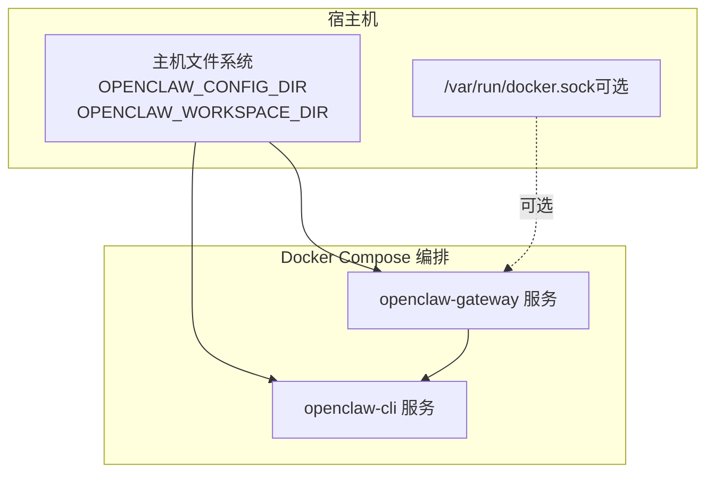
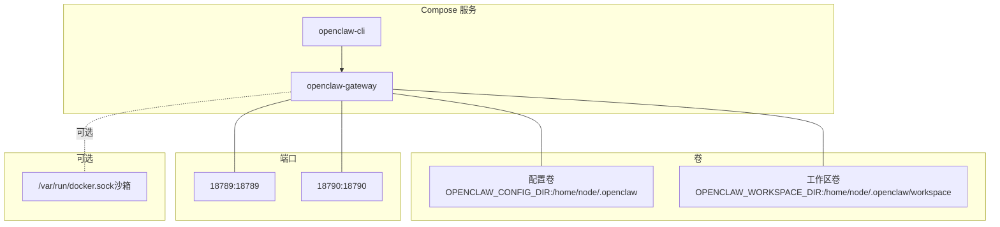
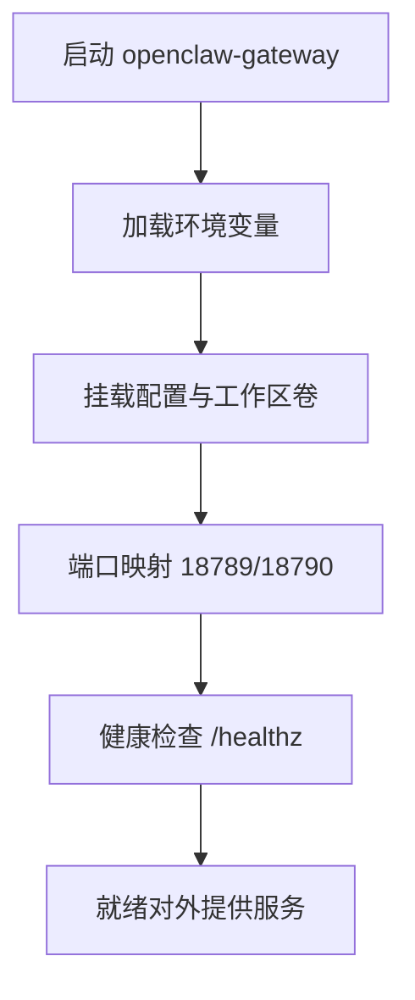
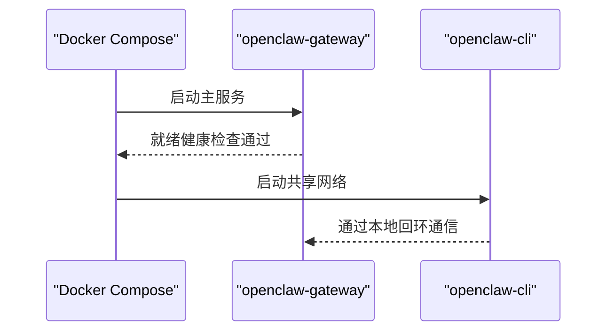
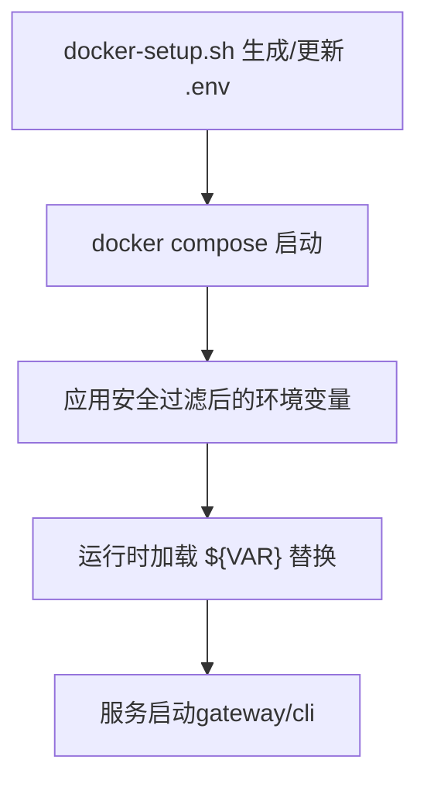
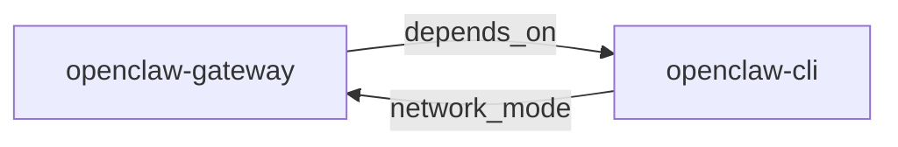

# Docker Compose编排

<cite>
**本文引用的文件**
- [docker-compose.yml](file://docker-compose.yml)
- [Dockerfile](file://Dockerfile)
- [docker-setup.sh](file://docker-setup.sh)
- [openclaw.podman.env](file://openclaw.podman.env)
- [src/config/env-vars.ts](file://src/config/env-vars.ts)
- [src/config/config.env-vars.test.ts](file://src/config/config.env-vars.test.ts)
- [src/docker-setup.e2e.test.ts](file://src/docker-setup.e2e.test.ts)
- [docs/security/THREAT-MODEL-ATLAS.md](file://docs/security/THREAT-MODEL-ATLAS.md)
- [docs/zh-CN/platforms/oracle.md](file://docs/zh-CN/platforms/oracle.md)
</cite>

## 目录

1. [简介](#简介)
2. [项目结构](#项目结构)
3. [核心组件](#核心组件)
4. [架构总览](#架构总览)
5. [详细组件分析](#详细组件分析)
6. [依赖关系分析](#依赖关系分析)
7. [性能与可扩展性](#性能与可扩展性)
8. [故障排查指南](#故障排查指南)
9. [结论](#结论)
10. [附录：多环境编排示例](#附录多环境编排示例)

## 简介

本指南围绕仓库中的 Docker Compose 编排进行系统讲解，覆盖服务定义、网络与存储卷配置、环境变量映射、端口暴露与健康检查。重点解析主服务 gateway 与辅助服务 CLI 的配置参数与行为差异，给出开发、测试、生产三类部署场景的 compose 示例与最佳实践，阐明服务间依赖关系与启动顺序，以及数据持久化、网络隔离与安全加固策略。

## 项目结构

- 核心编排文件：docker-compose.yml
- 构建镜像：Dockerfile（含多阶段构建、Slim 变体、可选安装浏览器与 Docker CLI）
- 启动脚本：docker-setup.sh（生成/注入 .env、写入额外 compose 叠加、按需启用沙箱、权限修复、引导 onboarding）
- 环境样例：openclaw.podman.env（Podman 环境变量参考）
- 环境变量处理：src/config/env-vars.ts 与测试用例 src/config/config.env-vars.test.ts
- 安全模型：docs/security/THREAT-MODEL-ATLAS.md（信任边界与纵深防御）
- 平台安全：docs/zh-CN/platforms/oracle.md（VCN + Tailscale 基线）

图表来源

- [docker-compose.yml:1-77](file://docker-compose.yml#L1-L77)
- [Dockerfile:104-230](file://Dockerfile#L104-L230)

章节来源

- [docker-compose.yml:1-77](file://docker-compose.yml#L1-L77)
- [Dockerfile:104-230](file://Dockerfile#L104-L230)

## 核心组件

- openclaw-gateway（主服务）
  - 镜像来源：支持环境变量覆盖，默认使用本地镜像名
  - 环境变量：HOME、TERM、网关令牌、Claude 凭据、安全开关等
  - 存储卷：挂载配置目录与工作区目录；可选挂载 Docker socket 实现沙箱容器执行
  - 端口映射：默认 18789（网关）、18790（桥接通道）
  - 健康检查：内置 /healthz 探针，间隔、超时、重试、启动期配置
  - 启动命令：以 gateway 模式启动，绑定模式由环境变量决定
- openclaw-cli（辅助服务）
  - 共享网络命名空间：network_mode: service:openclaw-gateway
  - 权限限制：cap_drop、security_opt、no-new-privileges
  - 环境变量：与 gateway 对齐，便于 CLI 与网关交互
  - 交互式终端：stdin_open、tty
  - 依赖：depends_on: openclaw-gateway

章节来源

- [docker-compose.yml:2-77](file://docker-compose.yml#L2-L77)
- [Dockerfile:216-230](file://Dockerfile#L216-L230)

## 架构总览

下图展示 compose 服务、卷、端口与可选 Docker socket 沙箱挂载之间的关系，以及 CLI 与 gateway 的共享网络与依赖关系。

图表来源

- [docker-compose.yml:2-77](file://docker-compose.yml#L2-L77)

## 详细组件分析

### openclaw-gateway（主服务）

- 镜像与构建
  - 支持通过环境变量覆盖镜像名；默认使用本地镜像名
  - 多阶段构建，最终运行时可选择 slim 变体，减少体积
- 环境变量
  - HOME、TERM：终端与用户目录
  - OPENCLAW_GATEWAY_TOKEN：网关鉴权令牌
  - OPENCLAW_ALLOW_INSECURE_PRIVATE_WS：私有 WebSocket 不安全开关
  - CLAUDE\_\*：Claude 相关会话凭据
- 存储卷
  - 配置目录与工作区目录分别挂载至容器内标准路径
  - 可选挂载 Docker socket 以启用沙箱容器能力
- 端口
  - 默认映射 18789（网关）与 18790（桥接通道），可通过环境变量覆盖
- 健康检查
  - 内置探针 /healthz，周期、超时、重试与启动期可配置
- 启动命令
  - 以 gateway 模式启动，绑定模式由环境变量决定

图表来源

- [docker-compose.yml:2-49](file://docker-compose.yml#L2-L49)
- [Dockerfile:216-230](file://Dockerfile#L216-L230)

章节来源

- [docker-compose.yml:2-49](file://docker-compose.yml#L2-L49)
- [Dockerfile:104-230](file://Dockerfile#L104-L230)

### openclaw-cli（辅助服务）

- 网络与安全
  - 共享 openclaw-gateway 的网络命名空间，便于本地通信
  - 降低权限：丢弃敏感能力、启用 no-new-privileges
- 交互式
  - 开启伪终端与标准输入，适合交互式调试与运维
- 依赖
  - 显式依赖 openclaw-gateway，确保先于 CLI 启动

图表来源

- [docker-compose.yml:51-77](file://docker-compose.yml#L51-L77)

章节来源

- [docker-compose.yml:51-77](file://docker-compose.yml#L51-L77)

### 环境变量与配置注入

- compose 层
  - 使用环境变量覆盖镜像名、端口、绑定模式、令牌等
  - 通过 docker-setup.sh 生成或更新 .env 文件，确保关键变量存在
- 运行时层
  - 环境变量收集与应用逻辑避免危险键（如 HOME、SHELL 等）污染进程环境
  - 支持 ${VAR} 占位符的环境变量替换，优先读取 ~/.openclaw/.env

图表来源

- [docker-setup.sh:358-411](file://docker-setup.sh#L358-L411)
- [src/config/env-vars.ts:79-97](file://src/config/env-vars.ts#L79-L97)
- [src/config/config.env-vars.test.ts:102-132](file://src/config/config.env-vars.test.ts#L102-L132)

章节来源

- [docker-setup.sh:358-411](file://docker-setup.sh#L358-L411)
- [src/config/env-vars.ts:79-97](file://src/config/env-vars.ts#L79-L97)
- [src/config/config.env-vars.test.ts:102-132](file://src/config/config.env-vars.test.ts#L102-L132)

### 数据持久化与权限修复

- 目录准备
  - docker-setup.sh 创建必要的子目录，确保 bind mount 可用
- 权限修复
  - 以 root 身份短暂运行容器，修正配置目录与工作区子目录的属主属组，避免 EACCES
- 建议
  - 将 OPENCLAW_CONFIG_DIR 与 OPENCLAW_WORKSPACE_DIR 指向稳定持久化位置
  - 在非特权用户环境下，确保宿主机对挂载目录具有合适的权限

章节来源

- [docker-setup.sh:206-213](file://docker-setup.sh#L206-L213)
- [docker-setup.sh:442-444](file://docker-setup.sh#L442-L444)

### 网络与安全

- 绑定模式
  - 默认绑定模式由环境变量决定；当使用桥接网络映射端口时，建议将绑定模式设为 LAN 以便外部访问
- 健康检查
  - 内置 /healthz 与 /readyz 探针，用于容器编排与外部负载均衡
- 安全加固
  - CLI 服务降低权限、丢弃敏感能力、启用 no-new-privileges
  - 网关运行在非 root 用户，降低逃逸风险
- 沙箱（可选）
  - 可选挂载 Docker socket 并在镜像中安装 Docker CLI，启用 agents.defaults.sandbox
  - 沙箱配置需谨慎，避免危险网络模式与过度权限

章节来源

- [Dockerfile:216-230](file://Dockerfile#L216-L230)
- [docker-compose.yml:51-77](file://docker-compose.yml#L51-L77)
- [docker-compose.yml:12-22](file://docker-compose.yml#L12-L22)
- [docs/security/THREAT-MODEL-ATLAS.md:56-123](file://docs/security/THREAT-MODEL-ATLAS.md#L56-L123)

## 依赖关系分析

- 服务依赖
  - openclaw-cli 依赖 openclaw-gateway（depends_on），保证 CLI 启动时网关已可用
- 网络依赖
  - openclaw-cli 使用 network_mode: service:openclaw-gateway，共享网络命名空间
- 启动顺序
  - Compose 会先启动 gateway，再启动 cli；若需要更严格的就绪检测，可在 compose 中为 cli 添加 depends_on 的 condition（例如 service_healthy）

图表来源

- [docker-compose.yml:75-77](file://docker-compose.yml#L75-L77)
- [docker-compose.yml:53](file://docker-compose.yml#L53)

章节来源

- [docker-compose.yml:51-77](file://docker-compose.yml#L51-L77)

## 性能与可扩展性

- 运行时变体
  - 可选择 slim 变体以减小镜像体积；如需浏览器自动化，可在构建时启用预装浏览器
- 端口与绑定
  - 在桥接网络映射端口时，注意将绑定模式调整为 LAN 并配置鉴权，避免不必要的暴露
- 沙箱开销
  - 沙箱启用会引入额外的容器生命周期管理成本，建议在需要隔离的场景启用

章节来源

- [Dockerfile:92-101](file://Dockerfile#L92-L101)
- [Dockerfile:157-171](file://Dockerfile#L157-L171)
- [Dockerfile:216-230](file://Dockerfile#L216-L230)

## 故障排查指南

- 网关无法访问
  - 检查绑定模式与端口映射是否正确；若使用桥接网络映射端口，请将绑定模式设为 LAN 并配置鉴权
- 权限问题（EACCES）
  - 执行权限修复流程，确保配置目录与工作区子目录属主为容器内的 node 用户
- 环境变量未生效
  - 确认 .env 是否由 docker-setup.sh 正确生成/更新；检查危险键过滤与 ${VAR} 替换逻辑
- 沙箱不生效
  - 确认镜像中已安装 Docker CLI；确认宿主机 Docker socket 已正确挂载且 gid 配置正确

章节来源

- [docker-setup.sh:442-444](file://docker-setup.sh#L442-L444)
- [docker-setup.sh:358-411](file://docker-setup.sh#L358-L411)
- [src/config/env-vars.ts:79-97](file://src/config/env-vars.ts#L79-L97)
- [docker-compose.yml:12-22](file://docker-compose.yml#L12-L22)

## 结论

本指南梳理了 openclaw 在 Docker Compose 下的编排要点：主服务 gateway 的镜像、环境、卷、端口与健康检查，辅助服务 CLI 的网络共享与安全加固，以及通过 docker-setup.sh 实现的环境注入、权限修复与可选沙箱。结合安全模型与平台安全文档，可在开发、测试与生产环境中实现稳健、可审计、可扩展的容器化部署。

## 附录：多环境编排示例

### 开发环境（本地快速启动）

- 目标：最小化配置，快速验证
- 关键点：
  - 使用默认镜像名或本地镜像
  - 绑定模式设为 LAN，便于本地访问
  - 令牌通过 docker-setup.sh 自动生成或从 .env 注入
  - 可选启用沙箱（需要 Docker CLI 与 socket 挂载）

章节来源

- [docker-setup.sh:235-256](file://docker-setup.sh#L235-L256)
- [docker-compose.yml:216-227](file://docker-compose.yml#L216-L227)

### 测试环境（CI/CD 或共享测试机）

- 目标：稳定复现，便于自动化
- 关键点：
  - 固定镜像版本（digest）以确保可重复性
  - 明确 OPENCLAW_CONFIG_DIR 与 OPENCLAW_WORKSPACE_DIR 的持久化路径
  - 通过 .env 显式注入令牌与端口
  - 健康检查与日志输出便于监控

章节来源

- [Dockerfile:22-25](file://Dockerfile#L22-L25)
- [docker-setup.sh:395-411](file://docker-setup.sh#L395-L411)

### 生产环境（高安全基线）

- 目标：强隔离、强审计、低攻击面
- 关键点：
  - 绑定模式设为 loopback，配合网络边缘防火墙与 Tailscale
  - VCN 安全列表仅开放必要端口（如 Tailscale UDP 41641）
  - 网关运行在非 root 用户，CLI 降低权限
  - 严格控制环境变量注入，避免危险键污染

章节来源

- [docs/security/THREAT-MODEL-ATLAS.md:56-123](file://docs/security/THREAT-MODEL-ATLAS.md#L56-L123)
- [docs/zh-CN/platforms/oracle.md:152-188](file://docs/zh-CN/platforms/oracle.md#L152-L188)
- [Dockerfile:216-230](file://Dockerfile#L216-L230)
