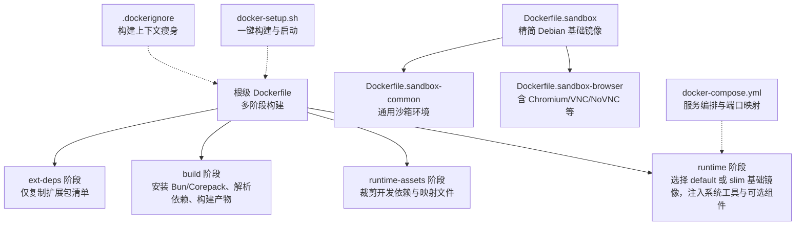
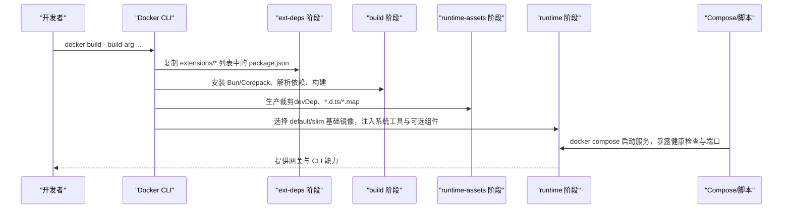
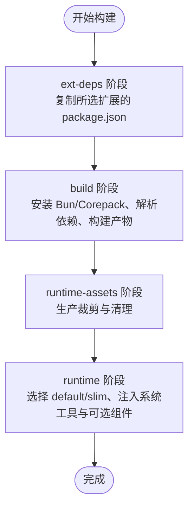
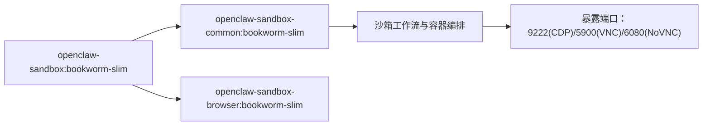
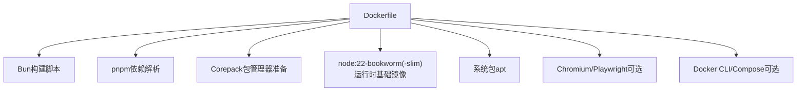

# Docker镜像构建

<cite>
**本文引用的文件**
- [Dockerfile](file://Dockerfile)
- [Dockerfile.sandbox](file://Dockerfile.sandbox)
- [Dockerfile.sandbox-browser](file://Dockerfile.sandbox-browser)
- [Dockerfile.sandbox-common](file://Dockerfile.sandbox-common)
- [.dockerignore](file://.dockerignore)
- [docker-compose.yml](file://docker-compose.yml)
- [docker-setup.sh](file://docker-setup.sh)
- [scripts/sandbox-browser-entrypoint.sh](file://scripts/sandbox-browser-entrypoint.sh)
- [scripts/sandbox-browser-setup.sh](file://scripts/sandbox-browser-setup.sh)
- [scripts/sandbox-common-setup.sh](file://scripts/sandbox-common-setup.sh)
</cite>

## 目录

1. [简介](#简介)
2. [项目结构](#项目结构)
3. [核心组件](#核心组件)
4. [架构总览](#架构总览)
5. [详细组件分析](#详细组件分析)
6. [依赖关系分析](#依赖关系分析)
7. [性能与优化](#性能与优化)
8. [故障排查指南](#故障排查指南)
9. [结论](#结论)
10. [附录](#附录)

## 简介

本指南面向需要基于仓库构建 OpenClaw 容器镜像的工程师与运维人员。文档覆盖多阶段 Dockerfile 构建流程（ext-deps → build → runtime-assets → runtime），解释构建参数（如 OPENCLAW_EXTENSIONS、OPENCLAW_VARIANT、OPENCLAW_DOCKER_APT_PACKAGES 等）的作用与最佳实践；说明默认与精简变体镜像（default vs slim）的差异与适用场景；提供浏览器自动化支持、Docker CLI 集成等可选功能的配置方法；并总结缓存策略、依赖管理与镜像体积优化技巧，帮助从基础构建到高级定制的完整落地。

## 项目结构

与容器构建直接相关的关键文件与目录如下：

- 根级 Dockerfile：定义多阶段构建与运行时镜像
- Dockerfile.sandbox / Dockerfile.sandbox-browser / Dockerfile.sandbox-common：沙箱相关镜像
- .dockerignore：排除不必要的构建上下文文件
- docker-compose.yml：本地编排与运行示例
- docker-setup.sh：一键化构建与启动脚本
- scripts/sandbox-\*：沙箱镜像构建与入口脚本

图表来源

- [Dockerfile:1-231](file://Dockerfile#L1-L231)
- [Dockerfile.sandbox:1-24](file://Dockerfile.sandbox#L1-L24)
- [Dockerfile.sandbox-common:1-48](file://Dockerfile.sandbox-common#L1-L48)
- [Dockerfile.sandbox-browser:1-35](file://Dockerfile.sandbox-browser#L1-L35)
- [.dockerignore:1-65](file://.dockerignore#L1-L65)
- [docker-compose.yml:1-77](file://docker-compose.yml#L1-L77)
- [docker-setup.sh:413-428](file://docker-setup.sh#L413-L428)

章节来源

- [Dockerfile:1-231](file://Dockerfile#L1-L231)
- [.dockerignore:1-65](file://.dockerignore#L1-L65)
- [docker-compose.yml:1-77](file://docker-compose.yml#L1-L77)
- [docker-setup.sh:413-428](file://docker-setup.sh#L413-L428)

## 核心组件

- 多阶段构建
  - ext-deps：仅复制所选扩展的 package.json，避免无关源码变更导致缓存失效
  - build：安装 Bun/Corepack，解析依赖，执行构建与 UI 打包
  - runtime-assets：生产裁剪，删除开发依赖与类型/映射文件
  - runtime：选择 default 或 slim 变体，注入系统工具与可选组件（浏览器、Docker CLI）
- 构建参数
  - OPENCLAW_EXTENSIONS：空格分隔的扩展目录名列表，用于在 ext-deps 阶段只复制这些扩展的依赖清单
  - OPENCLAW_VARIANT：default 或 slim，决定最终运行时基础镜像
  - OPENCLAW_DOCKER_APT_PACKAGES：追加安装的系统包
  - OPENCLAW_INSTALL_BROWSER：预装 Chromium 与 Playwright 二进制，减少容器启动时的下载开销
  - OPENCLAW_INSTALL_DOCKER_CLI：预装 Docker CLI，便于在容器内执行沙箱
- 运行时特性
  - 非 root 用户运行（node:1000）
  - 健康检查端点 /healthz /readyz
  - 指向 openclaw.mjs 的软链接，便于直接调用 openclaw 命令

章节来源

- [Dockerfile:12-231](file://Dockerfile#L12-L231)

## 架构总览

下图展示从构建到运行的端到端流程，以及可选功能的集成点。

图表来源

- [Dockerfile:27-231](file://Dockerfile#L27-L231)
- [docker-compose.yml:1-77](file://docker-compose.yml#L1-L77)
- [docker-setup.sh:413-428](file://docker-setup.sh#L413-L428)

## 详细组件分析

### 多阶段构建流程详解

- ext-deps 阶段
  - 作用：仅复制所选扩展的 package.json 到 /out，避免无关扩展源码变更影响后续层缓存
  - 关键点：通过 OPENCLAW_EXTENSIONS 控制复制范围
- build 阶段
  - 安装 Bun 并启用 Corepack
  - 使用 pnpm 安装依赖（带内存限制以降低 OOM 风险）
  - 规范化扩展权限，保证安全模式
  - 尝试 A2UI 打包，失败时生成占位文件以兼容跨架构
  - 执行构建与 UI 打包（强制 pnpm 以规避部分架构的 Bun 兼容性问题）
- runtime-assets 阶段
  - 生产裁剪：仅保留运行所需依赖与产物
  - 清理类型声明与 SourceMap 文件
- runtime 阶段
  - 选择 default 或 slim 基础镜像
  - 安装运行所需的系统工具（procps、hostname、curl、git、openssl）
  - 可选安装系统包（OPENCLAW_DOCKER_APT_PACKAGES）
  - 可选安装浏览器与 Playwright（OPENCLAW_INSTALL_BROWSER）
  - 可选安装 Docker CLI（OPENCLAW_INSTALL_DOCKER_CLI）
  - 设置非 root 用户与健康检查

图表来源

- [Dockerfile:27-231](file://Dockerfile#L27-L231)

章节来源

- [Dockerfile:27-231](file://Dockerfile#L27-L231)

### 构建参数与变体镜像

- OPENCLAW_EXTENSIONS
  - 类型：字符串（空格分隔）
  - 作用：在 ext-deps 阶段仅复制指定扩展的 package.json，提升缓存命中率
  - 示例：--build-arg OPENCLAW_EXTENSIONS="diagnostics-otel matrix"
- OPENCLAW_VARIANT
  - 取值：default 或 slim
  - 作用：控制最终运行时基础镜像为 node:22-bookworm 或 node:22-bookworm-slim
  - 默认：default
- OPENCLAW_DOCKER_APT_PACKAGES
  - 类型：字符串（空格分隔的包名）
  - 作用：在 runtime 阶段追加安装系统包
  - 示例：--build-arg OPENCLAW_DOCKER_APT_PACKAGES="python3 wget"
- OPENCLAW_INSTALL_BROWSER
  - 类型：空字符串或非空
  - 作用：预装 Chromium 与 Playwright，减少容器启动时的下载时间
  - 注意：需在 node_modules 复制之后再执行，以确保 playwright-core 可用
- OPENCLAW_INSTALL_DOCKER_CLI
  - 类型：空字符串或非空
  - 作用：预装 Docker CLI 与 Compose 插件，配合 agents.defaults.sandbox 使用
  - 安全校验：安装前验证 Docker GPG 密钥指纹

章节来源

- [Dockerfile:12-231](file://Dockerfile#L12-L231)

### 浏览器自动化支持

- 功能概述
  - 在 runtime 阶段可选安装 xvfb、Chromium 与 Playwright
  - 预装后 Playwright 二进制随容器持久化，避免每次启动重新下载
  - 适用于需要无头浏览器能力的技能与自动化任务
- 配置要点
  - 通过 OPENCLAW_INSTALL_BROWSER=1 启用
  - Playwright 缓存路径固定在 /home/node/.cache/ms-playwright
  - 该步骤必须在 node_modules 复制之后执行
- 端口与调试
  - 可结合沙箱浏览器镜像（Dockerfile.sandbox-browser）提供的 VNC/NoVNC 与 CDP 端口进行可视化调试

章节来源

- [Dockerfile:157-171](file://Dockerfile#L157-L171)
- [Dockerfile.sandbox-browser:1-35](file://Dockerfile.sandbox-browser#L1-L35)
- [scripts/sandbox-browser-entrypoint.sh:1-128](file://scripts/sandbox-browser-entrypoint.sh#L1-L128)

### Docker CLI 集成（沙箱）

- 功能概述
  - 在 runtime 阶段可选安装 Docker CLI 与 Compose 插件
  - 用于在容器内执行沙箱（agents.defaults.sandbox），隔离代理执行环境
- 安全校验
  - 安装前校验 Docker GPG 密钥指纹，防止中间人攻击
- 使用建议
  - 本地构建时建议开启 OPENCLAW_INSTALL_DOCKER_CLI=1
  - docker-setup.sh 会自动检测并按需启用沙箱配置与 Docker socket 挂载

章节来源

- [Dockerfile:173-203](file://Dockerfile#L173-L203)
- [docker-setup.sh:497-506](file://docker-setup.sh#L497-L506)

### 沙箱镜像体系

- openclaw-sandbox:bookworm-slim
  - 基于 Debian bookworm-slim，安装常用工具链与语言运行时
- openclaw-sandbox-common:bookworm-slim
  - 在上述基础上进一步安装 pnpm、Bun、Linuxbrew 等
  - 支持通过 ARG 自定义安装项与最终用户
- openclaw-sandbox-browser:bookworm-slim
  - 在 common 基础上安装 Chromium、VNC、NoVNC、x11vnc、xvfb 等
  - 提供浏览器自动化与远程桌面能力

图表来源

- [Dockerfile.sandbox:1-24](file://Dockerfile.sandbox#L1-L24)
- [Dockerfile.sandbox-common:1-48](file://Dockerfile.sandbox-common#L1-L48)
- [Dockerfile.sandbox-browser:1-35](file://Dockerfile.sandbox-browser#L1-L35)

章节来源

- [Dockerfile.sandbox:1-24](file://Dockerfile.sandbox#L1-L24)
- [Dockerfile.sandbox-common:1-48](file://Dockerfile.sandbox-common#L1-L48)
- [Dockerfile.sandbox-browser:1-35](file://Dockerfile.sandbox-browser#L1-L35)
- [scripts/sandbox-browser-entrypoint.sh:1-128](file://scripts/sandbox-browser-entrypoint.sh#L1-L128)
- [scripts/sandbox-browser-setup.sh:1-8](file://scripts/sandbox-browser-setup.sh#L1-L8)
- [scripts/sandbox-common-setup.sh:1-55](file://scripts/sandbox-common-setup.sh#L1-L55)

### 运行时与编排

- 健康检查
  - /healthz（存活）与 /readyz（就绪）别名 /health 与 /ready
- 端口映射
  - 网关默认绑定 127.0.0.1，可通过 --bind 覆盖
  - 建议使用主机网络或外部绑定并设置认证
- Compose 服务
  - openclaw-gateway：网关服务，支持健康检查与端口映射
  - openclaw-cli：与网关共享网络，提供 CLI 能力

章节来源

- [Dockerfile:224-231](file://Dockerfile#L224-L231)
- [docker-compose.yml:1-77](file://docker-compose.yml#L1-L77)

## 依赖关系分析

- 构建期依赖
  - Bun：用于构建脚本与部分工具链
  - Corepack：启用 pnpm 并准备包管理器版本
  - pnpm：解析与安装依赖，支持缓存与冻结锁文件
- 运行期依赖
  - Node 运行时（来自 node:22-bookworm(-slim)）
  - 可选系统包（由 OPENCLAW_DOCKER_APT_PACKAGES 注入）
  - 可选浏览器与 Playwright（由 OPENCLAW_INSTALL_BROWSER 注入）
  - 可选 Docker CLI（由 OPENCLAW_INSTALL_DOCKER_CLI 注入）

图表来源

- [Dockerfile:40-231](file://Dockerfile#L40-L231)

章节来源

- [Dockerfile:40-231](file://Dockerfile#L40-L231)

## 性能与优化

- 缓存策略
  - pnpm store 缓存：--mount=type=cache 指向 /root/.local/share/pnpm/store
  - APT 缓存：分别挂载 /var/cache/apt 与 /var/lib/apt，加速系统包安装
  - ext-deps 阶段仅复制选定扩展的 package.json，避免无关源码变更导致缓存失效
- 依赖管理
  - 使用 --frozen-lockfile 保证依赖一致性
  - 生产裁剪阶段删除 _.d.ts 与 _.map 文件，减小体积
- 镜像体积优化
  - slim 变体移除部分系统工具，适合对镜像大小敏感的场景
  - 仅在必要时启用浏览器与 Docker CLI，避免额外体积
- 构建上下文瘦身
  - .dockerignore 排除 node_modules、.pnpm-store、dist、媒体与大型子树
  - 保留 Canvas A2UI 打包所需资源，避免构建失败

章节来源

- [Dockerfile:58-91](file://Dockerfile#L58-L91)
- [.dockerignore:1-65](file://.dockerignore#L1-L65)

## 故障排查指南

- 低内存主机 OOM
  - build 阶段通过 NODE_OPTIONS=--max-old-space-size=2048 降低内存占用
  - 若仍失败，考虑在 CI 中使用原生每架构构建，或增大可用内存
- 跨架构（如 Apple Silicon 上构建 amd64）A2UI 打包失败
  - build 阶段提供回退：生成占位文件并清理 vendor/a2ui，确保本地交叉构建成功
- Docker socket 权限与沙箱启用
  - docker-setup.sh 会在检测到 Docker CLI 存在后才启用沙箱配置
  - 如未启用，检查是否以 OPENCLAW_INSTALL_DOCKER_CLI=1 重新构建镜像
- 健康检查失败
  - 确认网关绑定与端口映射正确
  - 在桥接网络中访问 /healthz 需要将绑定改为 lan 并设置认证

章节来源

- [Dockerfile:72-84](file://Dockerfile#L72-L84)
- [docker-setup.sh:497-506](file://docker-setup.sh#L497-L506)
- [Dockerfile:224-231](file://Dockerfile#L224-L231)

## 结论

通过多阶段构建与精心设计的缓存策略，OpenClaw 的 Docker 镜像在保证构建稳定性的同时实现了良好的可维护性与可扩展性。默认与精简两种变体满足不同部署需求；浏览器自动化与 Docker CLI 的可选集成则为高级场景提供了强大支撑。遵循本文的参数配置与优化建议，可在本地与 CI 环境中高效地完成镜像构建与发布。

## 附录

- 快速命令示例
  - 构建默认变体：docker build -t openclaw:local .
  - 构建 slim 变体：docker build --build-arg OPENCLAW_VARIANT=slim -t openclaw:local .
  - 启用浏览器：docker build --build-arg OPENCLAW_INSTALL_BROWSER=1 -t openclaw:local .
  - 启用 Docker CLI：docker build --build-arg OPENCLAW_INSTALL_DOCKER_CLI=1 -t openclaw:local .
  - 指定扩展：docker build --build-arg OPENCLAW_EXTENSIONS="diagnostics-otel matrix" -t openclaw:local .
  - 一键启动：OPENCLAW_IMAGE=openclaw:local ./docker-setup.sh
- 参考文件
  - [Dockerfile:1-231](file://Dockerfile#L1-L231)
  - [docker-compose.yml:1-77](file://docker-compose.yml#L1-L77)
  - [docker-setup.sh:413-428](file://docker-setup.sh#L413-L428)
  - [.dockerignore:1-65](file://.dockerignore#L1-L65)
  - [Dockerfile.sandbox:1-24](file://Dockerfile.sandbox#L1-L24)
  - [Dockerfile.sandbox-common:1-48](file://Dockerfile.sandbox-common#L1-L48)
  - [Dockerfile.sandbox-browser:1-35](file://Dockerfile.sandbox-browser#L1-L35)
  - [scripts/sandbox-browser-entrypoint.sh:1-128](file://scripts/sandbox-browser-entrypoint.sh#L1-L128)
  - [scripts/sandbox-browser-setup.sh:1-8](file://scripts/sandbox-browser-setup.sh#L1-L8)
  - [scripts/sandbox-common-setup.sh:1-55](file://scripts/sandbox-common-setup.sh#L1-L55)
