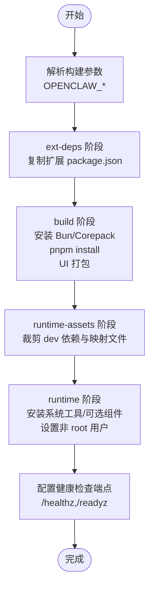
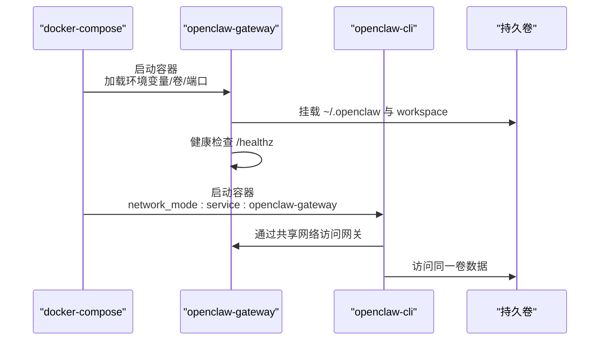
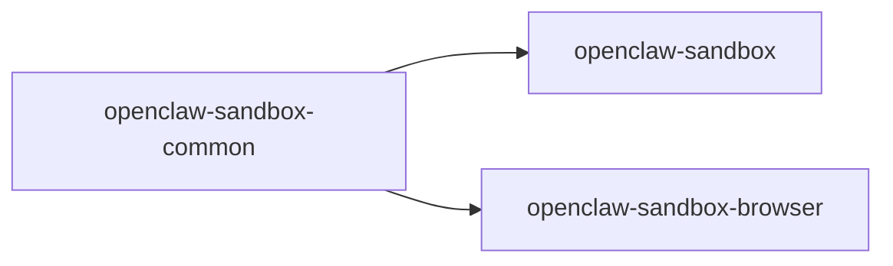
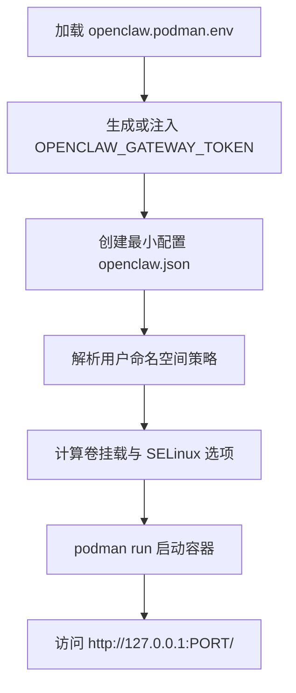
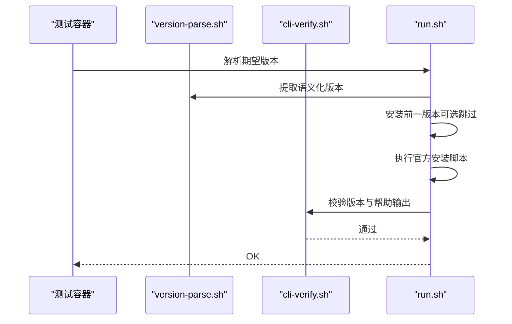
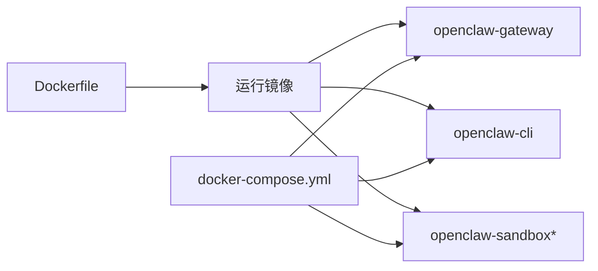

# 容器化部署

<cite>
**本文引用的文件**
- [Dockerfile](file://Dockerfile)
- [docker-compose.yml](file://docker-compose.yml)
- [.dockerignore](file://.dockerignore)
- [openclaw.podman.env](file://openclaw.podman.env)
- [scripts/run-openclaw-podman.sh](file://scripts/run-openclaw-podman.sh)
- [Dockerfile.sandbox](file://Dockerfile.sandbox)
- [Dockerfile.sandbox-browser](file://Dockerfile.sandbox-browser)
- [Dockerfile.sandbox-common](file://Dockerfile.sandbox-common)
- [scripts/docker/install-sh-smoke/Dockerfile](file://scripts/docker/install-sh-smoke/Dockerfile)
- [scripts/docker/install-sh-e2e/Dockerfile](file://scripts/docker/install-sh-e2e/Dockerfile)
- [scripts/docker/cleanup-smoke/Dockerfile](file://scripts/docker/cleanup-smoke/Dockerfile)
- [scripts/docker/install-sh-common/version-parse.sh](file://scripts/docker/install-sh-common/version-parse.sh)
- [scripts/docker/install-sh-common/cli-verify.sh](file://scripts/docker/install-sh-common/cli-verify.sh)
- [scripts/docker/install-sh-smoke/run.sh](file://scripts/docker/install-sh-smoke/run.sh)
- [scripts/docker/install-sh-e2e/run.sh](file://scripts/docker/install-sh-e2e/run.sh)
</cite>

## 目录

1. [简介](#简介)
2. [项目结构](#项目结构)
3. [核心组件](#核心组件)
4. [架构总览](#架构总览)
5. [详细组件分析](#详细组件分析)
6. [依赖关系分析](#依赖关系分析)
7. [性能与资源建议](#性能与资源建议)
8. [故障排查指南](#故障排查指南)
9. [结论](#结论)
10. [附录](#附录)

## 简介

本指南面向在容器环境中部署 OpenClaw 的工程团队与运维人员，覆盖从单容器到多容器集群的完整部署路径。内容包括：

- Docker 镜像构建流程与多阶段优化策略
- docker-compose 编排配置与网络/卷/健康检查
- 容器运行时环境设置与安全加固
- 端口映射、环境变量与持久化存储最佳实践
- 从 Docker 到 Podman 的等价运行方式
- 沙箱容器与浏览器自动化支持（可选）

## 项目结构

与容器化部署直接相关的关键文件与目录如下：

- 构建与镜像：Dockerfile、.dockerignore
- 编排与服务：docker-compose.yml
- 运行时环境：openclaw.podman.env、scripts/run-openclaw-podman.sh
- 沙箱与浏览器：Dockerfile.sandbox、Dockerfile.sandbox-browser、Dockerfile.sandbox-common
- 测试与安装脚本：scripts/docker/install-\*/Dockerfile 与对应 run.sh

```mermaid
graph TB
A["仓库根目录"] --> B["Dockerfile"]
A --> C[".dockerignore"]
A --> D["docker-compose.yml"]
A --> E["openclaw.podman.env"]
A --> F["scripts/run-openclaw-podman.sh"]
A --> G["Dockerfile.sandbox"]
A --> H["Dockerfile.sandbox-browser"]
A --> I["Dockerfile.sandbox-common"]
A --> J["scripts/docker/install-sh-smoke/Dockerfile"]
A --> K["scripts/docker/install-sh-e2e/Dockerfile"]
A --> L["scripts/docker/cleanup-smoke/Dockerfile"]
A --> M["scripts/docker/install-sh-common/version-parse.sh"]
A --> N["scripts/docker/install-sh-common/cli-verify.sh"]
A --> O["scripts/docker/install-sh-smoke/run.sh"]
A --> P["scripts/docker/install-sh-e2e/run.sh"]
```



图表来源

- [Dockerfile](file://Dockerfile)
- [docker-compose.yml](file://docker-compose.yml)
- [.dockerignore](file://.dockerignore)
- [openclaw.podman.env](file://openclaw.podman.env)
- [scripts/run-openclaw-podman.sh](file://scripts/run-openclaw-podman.sh)
- [Dockerfile.sandbox](file://Dockerfile.sandbox)
- [Dockerfile.sandbox-browser](file://Dockerfile.sandbox-browser)
- [Dockerfile.sandbox-common](file://Dockerfile.sandbox-common)
- [scripts/docker/install-sh-smoke/Dockerfile](file://scripts/docker/install-sh-smoke/Dockerfile)
- [scripts/docker/install-sh-e2e/Dockerfile](file://scripts/docker/install-sh-e2e/Dockerfile)
- [scripts/docker/cleanup-smoke/Dockerfile](file://scripts/docker/cleanup-smoke/Dockerfile)
- [scripts/docker/install-sh-common/version-parse.sh](file://scripts/docker/install-sh-common/version-parse.sh)
- [scripts/docker/install-sh-common/cli-verify.sh](file://scripts/docker/install-sh-common/cli-verify.sh)
- [scripts/docker/install-sh-smoke/run.sh](file://scripts/docker/install-sh-smoke/run.sh)
- [scripts/docker/install-sh-e2e/run.sh](file://scripts/docker/install-sh-e2e/run.sh)

章节来源

- [Dockerfile](file://Dockerfile)
- [docker-compose.yml](file://docker-compose.yml)
- [.dockerignore](file://.dockerignore)
- [openclaw.podman.env](file://openclaw.podman.env)
- [scripts/run-openclaw-podman.sh](file://scripts/run-openclaw-podman.sh)
- [Dockerfile.sandbox](file://Dockerfile.sandbox)
- [Dockerfile.sandbox-browser](file://Dockerfile.sandbox-browser)
- [Dockerfile.sandbox-common](file://Dockerfile.sandbox-common)
- [scripts/docker/install-sh-smoke/Dockerfile](file://scripts/docker/install-sh-smoke/Dockerfile)
- [scripts/docker/install-sh-e2e/Dockerfile](file://scripts/docker/install-sh-e2e/Dockerfile)
- [scripts/docker/cleanup-smoke/Dockerfile](file://scripts/docker/cleanup-smoke/Dockerfile)
- [scripts/docker/install-sh-common/version-parse.sh](file://scripts/docker/install-sh-common/version-parse.sh)
- [scripts/docker/install-sh-common/cli-verify.sh](file://scripts/docker/install-sh-common/cli-verify.sh)
- [scripts/docker/install-sh-smoke/run.sh](file://scripts/docker/install-sh-smoke/run.sh)
- [scripts/docker/install-sh-e2e/run.sh](file://scripts/docker/install-sh-e2e/run.sh)

## 核心组件

- 基础镜像与变体
  - 默认基础镜像：基于 Debian Bookworm 的 Node.js 22 运行时，带固定 SHA256 摘要以保证可复现性
  - 可选 slim 变体：更小体积，需在构建时通过构建参数选择
- 多阶段构建
  - 提取扩展依赖层（ext-deps）：仅复制所需扩展的 package.json，避免无关源码变更导致缓存失效
  - 构建层（build）：安装 Bun、Corepack，执行依赖安装与前端打包
  - 运行资产层（runtime-assets）：裁剪开发依赖与构建产物
  - 最终运行镜像（base-default/base-slim + runtime）：注入系统工具、Playwright 浏览器（可选）、Docker CLI（可选）
- 运行时用户与安全
  - 非 root 用户运行（node 用户），降低逃逸风险
  - 健康检查端点：/healthz（存活）与 /readyz（就绪）
- 编排与服务
  - openclaw-gateway：网关服务，暴露两个端口；支持健康检查与重启策略
  - openclaw-cli：与网关联动的 CLI 容器，共享网络，具备最小权限能力
- 持久化与卷
  - 将用户配置与工作区目录挂载为持久卷，便于升级与数据保留
- 环境变量与端口映射
  - 支持通过环境变量控制绑定地址、认证令牌、桥接端口等
  - 默认绑定回环地址，若需外部访问需显式改为 LAN 并配置认证

章节来源

- [Dockerfile](file://Dockerfile)
- [docker-compose.yml](file://docker-compose.yml)

## 架构总览

下图展示容器化部署的典型拓扑：单容器（网关+CLI）与多容器（网关+CLI+沙箱）两种模式。

```mermaid
graph TB
subgraph "宿主机"
U["用户/客户端"]
N["网络: 18789/tcp, 18790/tcp"]
V["卷: ~/.openclaw, ~/.openclaw/workspace"]
end
subgraph "容器编排"
GW["openclaw-gateway<br/>端口: 18789, 18790"]
CLI["openclaw-cli<br/>共享网络: service:openclaw-gateway"]
SB["openclaw-sandbox*<br/>可选: 9222, 5900, 6080"]
end
U --> N
N --> GW
GW <- --> CLI
GW -. 可选 .-> SB
GW --- V
CLI --- V
```

图表来源

- [docker-compose.yml](file://docker-compose.yml)
- [Dockerfile.sandbox](file://Dockerfile.sandbox)
- [Dockerfile.sandbox-browser](file://Dockerfile.sandbox-browser)

章节来源

- [docker-compose.yml](file://docker-compose.yml)
- [Dockerfile.sandbox](file://Dockerfile.sandbox)
- [Dockerfile.sandbox-browser](file://Dockerfile.sandbox-browser)

## 详细组件分析

### Dockerfile 构建流程与多阶段优化

- 构建参数
  - OPENCLAW_EXTENSIONS：按空格分隔的扩展目录名列表，仅提取这些扩展的依赖
  - OPENCLAW_VARIANT：default 或 slim，选择基础镜像变体
  - OPENCLAW_DOCKER_APT_PACKAGES：运行时需要的系统包（如 Python、wget 等）
  - OPENCLAW_INSTALL_BROWSER：是否预装 Chromium 与 Playwright，减少启动冷启动时间
  - OPENCLAW_INSTALL_DOCKER_CLI：是否安装 Docker CLI，用于沙箱容器管理
- 多阶段优化
  - ext-deps：仅复制扩展 package.json，避免无关源码变更影响缓存
  - build：安装 Bun/Corepack，执行 pnpm 安装与 UI 打包
  - runtime-assets：裁剪开发依赖与类型映射文件
  - runtime：拷贝运行资产，安装系统工具与可选组件，设置非 root 用户
- 安全与可复现性
  - 固定 Node 基础镜像摘要，避免上游标签漂移
  - 使用只读根文件系统与最小权限运行
  - 健康检查端点内置，便于容器编排使用



图表来源

- [Dockerfile](file://Dockerfile)

章节来源

- [Dockerfile](file://Dockerfile)

### docker-compose.yml 服务配置

- openclaw-gateway
  - 环境变量：HOME、TERM、OPENCLAW_GATEWAY_TOKEN、私有 WS 不安全选项、第三方会话/Cookie
  - 卷：~/.openclaw 与 ~/.openclaw/workspace
  - 端口：默认 18789（网关）、18790（桥接）
  - 健康检查：内置探针，轮询 /healthz
  - 命令：以网关模式启动，支持绑定地址参数
- openclaw-cli
  - 共享 openclaw-gateway 的网络命名空间
  - 能力限制：丢弃 NET_RAW/NET_ADMIN
  - 环境变量：与网关联动，BROWSER=echo
  - 卷：同上
  - 入口：node dist/index.js
  - 依赖：先于网关启动



图表来源

- [docker-compose.yml](file://docker-compose.yml)

章节来源

- [docker-compose.yml](file://docker-compose.yml)

### 沙箱与浏览器自动化（可选）

- openclaw-sandbox：基础沙箱容器，安装常用工具与语言运行时
- openclaw-sandbox-browser：预装 Chromium/Xvfb/novnc 等，支持远程桌面与调试端口
- openclaw-sandbox-common：作为公共基线，统一安装 pnpm、Bun、Homebrew 等工具链



图表来源

- [Dockerfile.sandbox-common](file://Dockerfile.sandbox-common)
- [Dockerfile.sandbox](file://Dockerfile.sandbox)
- [Dockerfile.sandbox-browser](file://Dockerfile.sandbox-browser)

章节来源

- [Dockerfile.sandbox-common](file://Dockerfile.sandbox-common)
- [Dockerfile.sandbox](file://Dockerfile.sandbox)
- [Dockerfile.sandbox-browser](file://Dockerfile.sandbox-browser)

### Podman 运行方式（等价于 Docker）

- openclaw.podman.env：定义网关令牌、端口映射、绑定地址与可选 Provider 凭证
- scripts/run-openclaw-podman.sh：封装 Podman 启动逻辑，自动处理用户命名空间、SELinux 绑定选项、生成令牌、写入最小配置等



图表来源

- [openclaw.podman.env](file://openclaw.podman.env)
- [scripts/run-openclaw-podman.sh](file://scripts/run-openclaw-podman.sh)

章节来源

- [openclaw.podman.env](file://openclaw.podman.env)
- [scripts/run-openclaw-podman.sh](file://scripts/run-openclaw-podman.sh)

### 安装与端到端测试（CI/本地验证）

- scripts/docker/install-sh-smoke/Dockerfile：最小系统工具集，用于“烟雾测试”
- scripts/docker/install-sh-e2e/Dockerfile：安装运行端到端测试所需的工具
- scripts/docker/cleanup-smoke/Dockerfile：清理类任务的基础镜像
- scripts/docker/install-sh-common/version-parse.sh：版本解析辅助
- scripts/docker/install-sh-common/cli-verify.sh：CLI 版本与可用性校验
- scripts/docker/install-sh-smoke/run.sh：拉取最新版本，强制升级路径，验证 CLI
- scripts/docker/install-sh-e2e/run.sh：根据模型模式（OpenAI/Anthropic/两者）执行端到端流程，含工具使用断言



图表来源

- [scripts/docker/install-sh-smoke/Dockerfile](file://scripts/docker/install-sh-smoke/Dockerfile)
- [scripts/docker/install-sh-e2e/Dockerfile](file://scripts/docker/install-sh-e2e/Dockerfile)
- [scripts/docker/cleanup-smoke/Dockerfile](file://scripts/docker/cleanup-smoke/Dockerfile)
- [scripts/docker/install-sh-common/version-parse.sh](file://scripts/docker/install-sh-common/version-parse.sh)
- [scripts/docker/install-sh-common/cli-verify.sh](file://scripts/docker/install-sh-common/cli-verify.sh)
- [scripts/docker/install-sh-smoke/run.sh](file://scripts/docker/install-sh-smoke/run.sh)
- [scripts/docker/install-sh-e2e/run.sh](file://scripts/docker/install-sh-e2e/run.sh)

章节来源

- [scripts/docker/install-sh-smoke/Dockerfile](file://scripts/docker/install-sh-smoke/Dockerfile)
- [scripts/docker/install-sh-e2e/Dockerfile](file://scripts/docker/install-sh-e2e/Dockerfile)
- [scripts/docker/cleanup-smoke/Dockerfile](file://scripts/docker/cleanup-smoke/Dockerfile)
- [scripts/docker/install-sh-common/version-parse.sh](file://scripts/docker/install-sh-common/version-parse.sh)
- [scripts/docker/install-sh-common/cli-verify.sh](file://scripts/docker/install-sh-common/cli-verify.sh)
- [scripts/docker/install-sh-smoke/run.sh](file://scripts/docker/install-sh-smoke/run.sh)
- [scripts/docker/install-sh-e2e/run.sh](file://scripts/docker/install-sh-e2e/run.sh)

## 依赖关系分析

- 构建期依赖
  - Node 22 基础镜像（固定摘要）
  - Bun 与 Corepack（启用 pnpm）
  - pnpm 依赖解析与 UI 构建
- 运行期依赖
  - 可选系统包（通过构建参数注入）
  - 可选 Playwright 浏览器（预装）
  - 可选 Docker CLI（用于沙箱容器管理）
- 编排期依赖
  - docker-compose 服务间网络共享
  - 健康检查端点与重启策略
  - 持久卷挂载与权限



图表来源

- [Dockerfile](file://Dockerfile)
- [docker-compose.yml](file://docker-compose.yml)
- [Dockerfile.sandbox](file://Dockerfile.sandbox)
- [Dockerfile.sandbox-browser](file://Dockerfile.sandbox-browser)

章节来源

- [Dockerfile](file://Dockerfile)
- [docker-compose.yml](file://docker-compose.yml)
- [Dockerfile.sandbox](file://Dockerfile.sandbox)
- [Dockerfile.sandbox-browser](file://Dockerfile.sandbox-browser)

## 性能与资源建议

- 构建缓存
  - 使用 ext-deps 阶段仅复制扩展依赖，避免无关源码变更导致缓存失效
  - 合理利用 pnpm store 缓存与 apt 缓存
- 运行时内存
  - 在低内存主机上，构建阶段已通过 Node 内存上限参数降低 OOM 风险
  - 运行时建议为容器设置合理的内存限制，防止突发占用
- 启动冷启动
  - 如需浏览器自动化，可在构建时预装 Playwright 与 Chromium，显著降低首次启动等待
- 网络与绑定
  - 默认绑定回环地址，外部访问需改为 LAN 并配置认证令牌
  - 使用健康检查端点配合编排实现自动重启与流量切换

[本节为通用建议，不直接分析具体文件]

## 故障排查指南

- 健康检查失败
  - 检查网关绑定地址与认证配置
  - 查看容器日志，确认端口映射与防火墙规则
- 权限问题
  - 确认持久卷归属与 SELinux 标记（Podman 场景）
  - 非 root 运行时需确保挂载目录权限正确
- 浏览器自动化异常
  - 若未预装浏览器，Playwright 首次安装可能耗时较长
  - 检查 Xvfb 与显示环境变量
- 安装与升级验证
  - 使用 smoke/e2e 测试脚本验证 CLI 版本与功能链路

章节来源

- [Dockerfile](file://Dockerfile)
- [docker-compose.yml](file://docker-compose.yml)
- [scripts/run-openclaw-podman.sh](file://scripts/run-openclaw-podman.sh)
- [scripts/docker/install-sh-smoke/run.sh](file://scripts/docker/install-sh-smoke/run.sh)
- [scripts/docker/install-sh-e2e/run.sh](file://scripts/docker/install-sh-e2e/run.sh)

## 结论

通过多阶段构建、固定基础镜像摘要与非 root 运行等措施，OpenClaw 的容器镜像具备良好的可复现性与安全性。结合 docker-compose 的服务编排与健康检查机制，可快速搭建从单容器到多容器（含沙箱）的生产级部署方案。Podman 等价运行脚本进一步降低了平台差异带来的复杂度。

[本节为总结性内容，不直接分析具体文件]

## 附录

### 端口映射与环境变量清单

- 网关端口
  - 18789：主服务端口（HTTP/WS）
  - 18790：桥接端口（内部/通道桥接）
- 环境变量
  - OPENCLAW_GATEWAY_TOKEN：网关访问令牌
  - OPENCLAW_GATEWAY_BIND：绑定地址（loopback/lan）
  - OPENCLAW_CONFIG_DIR、OPENCLAW_WORKSPACE_DIR：持久化卷挂载路径
  - CLAUDE_AI_SESSION_KEY、CLAUDE_WEB_SESSION_KEY、CLAUDE_WEB_COOKIE：可选 Provider 会话凭据
  - OPENCLAW_INSTALL_BROWSER、OPENCLAW_INSTALL_DOCKER_CLI：构建期可选组件开关

章节来源

- [docker-compose.yml](file://docker-compose.yml)
- [Dockerfile](file://Dockerfile)
- [openclaw.podman.env](file://openclaw.podman.env)

### 持久化存储与卷挂载

- 推荐挂载
  - ~/.openclaw：配置与状态
  - ~/.openclaw/workspace：工作区与会话数据
- 权限与 SELinux（Podman）
  - 自动检测并添加 SELinux relabel 选项，避免访问受限

章节来源

- [docker-compose.yml](file://docker-compose.yml)
- [scripts/run-openclaw-podman.sh](file://scripts/run-openclaw-podman.sh)

### 从单容器到多容器集群

- 单容器：openclaw-gateway + openclaw-cli（共享网络）
- 多容器：加入 openclaw-sandbox\*（可选），用于工具执行与浏览器自动化
- 网络：默认使用 bridge，也可通过 host 网络提升性能（需注意安全边界）

章节来源

- [docker-compose.yml](file://docker-compose.yml)
- [Dockerfile.sandbox](file://Dockerfile.sandbox)
- [Dockerfile.sandbox-browser](file://Dockerfile.sandbox-browser)
