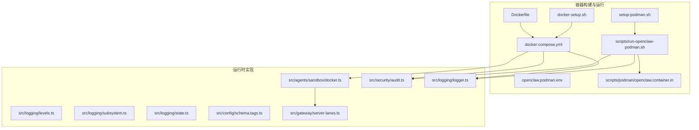
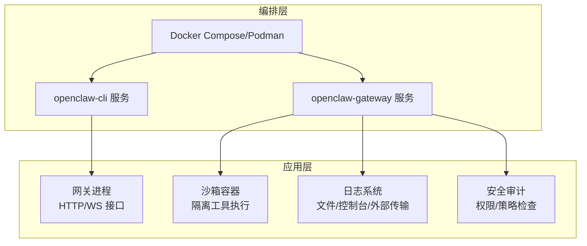
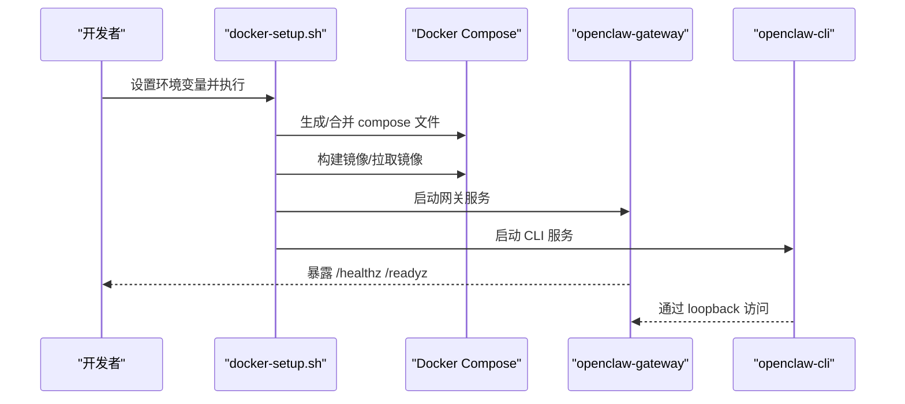
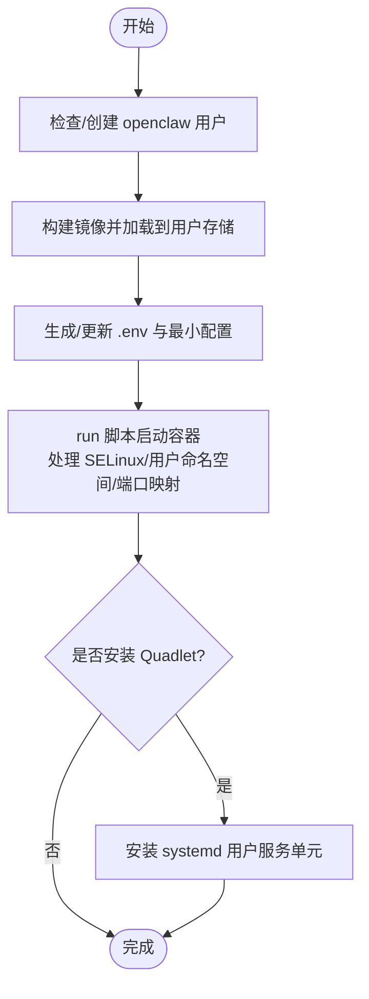
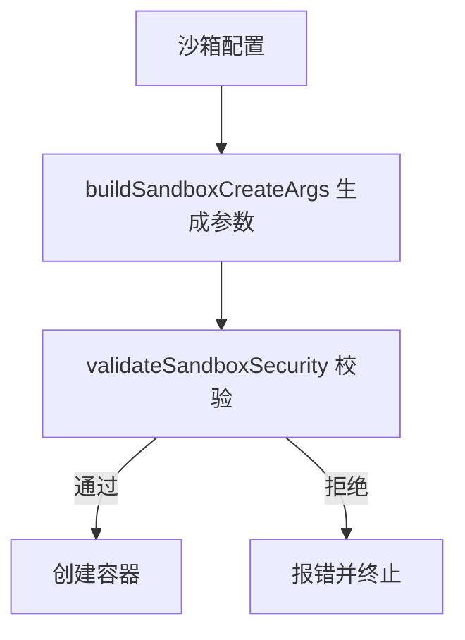
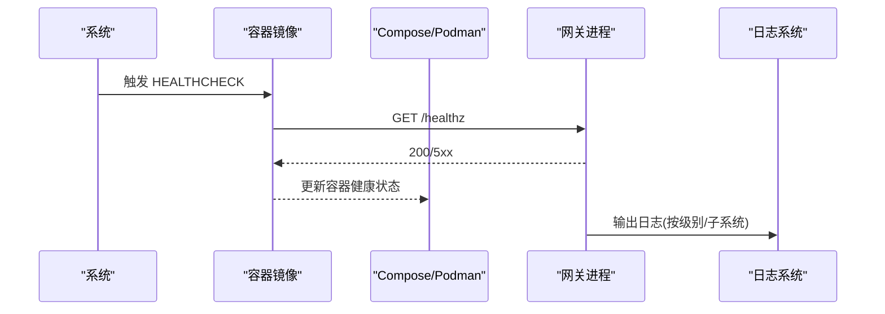
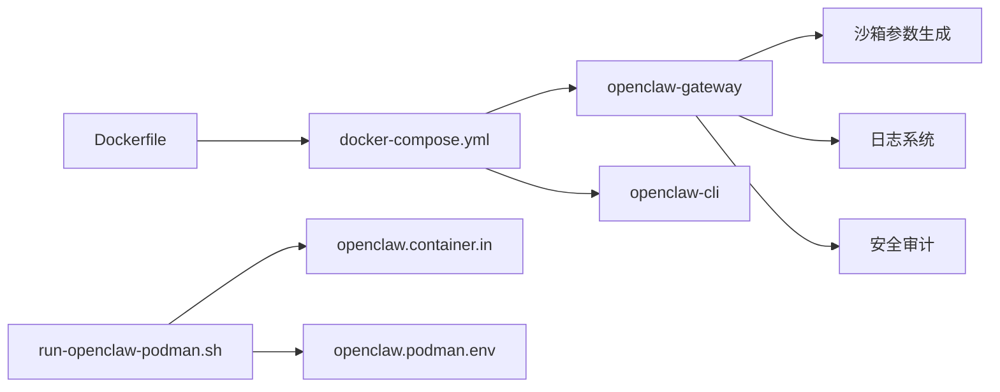

# 容器运行时配置

<cite>
**本文引用的文件**
- [Dockerfile](file://Dockerfile)
- [docker-compose.yml](file://docker-compose.yml)
- [docker-setup.sh](file://docker-setup.sh)
- [setup-podman.sh](file://setup-podman.sh)
- [scripts/run-openclaw-podman.sh](file://scripts/run-openclaw-podman.sh)
- [openclaw.podman.env](file://openclaw.podman.env)
- [scripts/podman/openclaw.container.in](file://scripts/podman/openclaw.container.in)
- [docs/install/docker.md](file://docs/install/docker.md)
- [docs/install/podman.md](file://docs/install/podman.md)
- [src/agents/sandbox/docker.ts](file://src/agents/sandbox/docker.ts)
- [src/agents/sandbox/validate-sandbox-security.test.ts](file://src/agents/sandbox/validate-sandbox-security.test.ts)
- [src/logging/logger.ts](file://src/logging/logger.ts)
- [src/logging/levels.ts](file://src/logging/levels.ts)
- [src/logging/subsystem.ts](file://src/logging/subsystem.ts)
- [src/logging/state.ts](file://src/logging/state.ts)
- [src/config/schema.tags.ts](file://src/config/schema.tags.ts)
- [src/security/audit.ts](file://src/security/audit.ts)
- [src/gateway/server-lanes.ts](file://src/gateway/server-lanes.ts)
</cite>

## 目录

1. [简介](#简介)
2. [项目结构](#项目结构)
3. [核心组件](#核心组件)
4. [架构总览](#架构总览)
5. [详细组件分析](#详细组件分析)
6. [依赖关系分析](#依赖关系分析)
7. [性能考虑](#性能考虑)
8. [故障排除指南](#故障排除指南)
9. [结论](#结论)
10. [附录](#附录)

## 简介

本指南面向在容器环境中运行 OpenClaw 的工程与运维人员，覆盖容器启动参数、环境变量、网络与安全配置、健康检查、资源限制与性能调优、跨平台差异（Linux/macOS/Windows）、日志管理与调试方法，并提供从开发测试到生产部署的完整运行时配置建议。内容基于仓库中的 Dockerfile、Compose 配置、Podman 脚本与相关运行时实现。

## 项目结构

围绕容器运行时的关键文件与脚本如下：

- Docker 构建与运行：Dockerfile、docker-compose.yml、docker-setup.sh
- Podman 运行：setup-podman.sh、scripts/run-openclaw-podman.sh、openclaw.podman.env、scripts/podman/openclaw.container.in
- 文档参考：docs/install/docker.md、docs/install/podman.md
- 安全与沙箱：src/agents/sandbox/docker.ts、src/agents/sandbox/validate-sandbox-security.test.ts
- 日志系统：src/logging/logger.ts、src/logging/levels.ts、src/logging/subsystem.ts、src/logging/state.ts
- 安全审计与配置标签：src/security/audit.ts、src/config/schema.tags.ts
- 性能与并发：src/gateway/server-lanes.ts

**图表来源**

- [Dockerfile:1-231](file://Dockerfile#L1-L231)
- [docker-compose.yml:1-77](file://docker-compose.yml#L1-L77)
- [docker-setup.sh:1-598](file://docker-setup.sh#L1-L598)
- [setup-podman.sh:1-313](file://setup-podman.sh#L1-L313)
- [scripts/run-openclaw-podman.sh:1-232](file://scripts/run-openclaw-podman.sh#L1-L232)
- [openclaw.podman.env:1-25](file://openclaw.podman.env#L1-L25)
- [scripts/podman/openclaw.container.in:1-29](file://scripts/podman/openclaw.container.in#L1-L29)
- [src/agents/sandbox/docker.ts:317-427](file://src/agents/sandbox/docker.ts#L317-L427)
- [src/security/audit.ts:276-343](file://src/security/audit.ts#L276-L343)
- [src/logging/logger.ts:210-321](file://src/logging/logger.ts#L210-L321)
- [src/gateway/server-lanes.ts:1-10](file://src/gateway/server-lanes.ts#L1-L10)

**章节来源**

- [Dockerfile:1-231](file://Dockerfile#L1-L231)
- [docker-compose.yml:1-77](file://docker-compose.yml#L1-L77)
- [docker-setup.sh:1-598](file://docker-setup.sh#L1-L598)
- [setup-podman.sh:1-313](file://setup-podman.sh#L1-L313)
- [scripts/run-openclaw-podman.sh:1-232](file://scripts/run-openclaw-podman.sh#L1-L232)
- [openclaw.podman.env:1-25](file://openclaw.podman.env#L1-L25)
- [scripts/podman/openclaw.container.in:1-29](file://scripts/podman/openclaw.container.in#L1-L29)
- [docs/install/docker.md:1-844](file://docs/install/docker.md#L1-L844)
- [docs/install/podman.md:1-123](file://docs/install/podman.md#L1-L123)

## 核心组件

- 容器镜像与基础运行时
  - Dockerfile 使用 node:22-bookworm 基础镜像，构建阶段安装 Bun/Corepack，运行阶段以非 root 用户 node 启动，内置健康检查探针。
  - 支持通过构建参数注入额外 apt 包、预装扩展依赖、预装浏览器与 Docker CLI。
- 编排与服务定义
  - docker-compose.yml 定义 openclaw-gateway 与 openclaw-cli 服务，端口映射、卷挂载、健康检查、重启策略等。
  - 提供可选的 Docker socket 挂载用于代理沙箱（agents.defaults.sandbox），并支持组加入以提升权限。
- Podman 运行与系统集成
  - setup-podman.sh 一次性初始化 openclaw 用户、构建镜像、生成 .env 与最小配置、可选安装 systemd Quadlet。
  - scripts/run-openclaw-podman.sh 提供启动、设置向导、日志查看、SELinux 绑定选项处理等。
- 安全与沙箱
  - 沙箱容器参数由 src/agents/sandbox/docker.ts 生成，包括只读根、tmpfs、网络 none、cap-drop、seccomp/apparmor、ulimits、DNS/hosts、CPU/内存限制等。
  - 安全审计与权限检查在 src/security/audit.ts 中实现，覆盖配置文件权限、可写性与可读性风险。
- 日志与可观测性
  - 日志系统支持滚动文件、子系统过滤、级别控制与外部传输注册；默认日志路径与大小限制在 logger 实现中解析。
- 性能与并发
  - 服务器通道并发通过 src/gateway/server-lanes.ts 应用，受配置影响，避免过度并发导致资源争用。

**章节来源**

- [Dockerfile:211-231](file://Dockerfile#L211-L231)
- [docker-compose.yml:23-50](file://docker-compose.yml#L23-L50)
- [docker-setup.sh:413-428](file://docker-setup.sh#L413-L428)
- [setup-podman.sh:230-256](file://setup-podman.sh#L230-L256)
- [scripts/run-openclaw-podman.sh:145-159](file://scripts/run-openclaw-podman.sh#L145-L159)
- [src/agents/sandbox/docker.ts:317-427](file://src/agents/sandbox/docker.ts#L317-L427)
- [src/security/audit.ts:276-343](file://src/security/audit.ts#L276-L343)
- [src/logging/logger.ts:210-321](file://src/logging/logger.ts#L210-L321)
- [src/gateway/server-lanes.ts:6-10](file://src/gateway/server-lanes.ts#L6-L10)

## 架构总览

下图展示容器运行时的整体交互：Compose/Podman 启动网关与 CLI，CLI 通过 loopback 或 LAN 访问网关；沙箱容器按需创建并隔离工具执行；日志系统输出到文件并支持外部传输；安全审计与权限检查贯穿配置加载与运行期。

**图表来源**

- [docker-compose.yml:1-77](file://docker-compose.yml#L1-L77)
- [Dockerfile:211-231](file://Dockerfile#L211-L231)
- [src/agents/sandbox/docker.ts:317-427](file://src/agents/sandbox/docker.ts#L317-L427)
- [src/logging/logger.ts:210-321](file://src/logging/logger.ts#L210-L321)
- [src/security/audit.ts:276-343](file://src/security/audit.ts#L276-L343)

## 详细组件分析

### Docker 运行时配置

- 基础镜像与用户
  - 使用 node:22-bookworm，运行时切换为非 root 用户 node，降低逃逸风险。
- 健康检查
  - 内置 HEALTHCHECK 对 /healthz 探活；Compose 层也定义了探针与重试策略。
- 环境变量与卷
  - 通过环境变量传递令牌、会话密钥、终端类型等；卷挂载配置与工作区目录，支持命名卷或主机绑定。
- 可选增强
  - 构建参数可安装额外 apt 包、预装扩展、预装浏览器与 Docker CLI，便于沙箱与浏览器工具使用。
- 端口与网络
  - 默认发布 18789/18790 端口；若需外网访问，需将 bind 切换为 LAN 并配置鉴权与允许的 Origin。

**图表来源**

- [docker-setup.sh:413-428](file://docker-setup.sh#L413-L428)
- [docker-compose.yml:23-50](file://docker-compose.yml#L23-L50)
- [Dockerfile:224-231](file://Dockerfile#L224-L231)

**章节来源**

- [Dockerfile:211-231](file://Dockerfile#L211-L231)
- [docker-compose.yml:1-77](file://docker-compose.yml#L1-L77)
- [docker-setup.sh:413-428](file://docker-setup.sh#L413-L428)
- [docs/install/docker.md:469-495](file://docs/install/docker.md#L469-L495)

### Podman 运行时配置

- 一次性初始化
  - 创建 openclaw 非登录用户，构建镜像，生成 .env 与最小配置，可选安装 systemd Quadlet。
- 启动流程
  - run 脚本负责生成/更新 .env、创建必要的目录、根据 SELinux 状态自动附加绑定选项、以 keep-id 或 host 用户命名空间启动容器。
- 环境与端口
  - 支持通过环境文件设置令牌、提供商密钥、端口映射与绑定模式；默认映射 18789/18790。
- 系统服务
  - Quadlet 单元文件由 setup 脚本生成，支持开机自启、自动重启与日志采集。

**图表来源**

- [setup-podman.sh:193-256](file://setup-podman.sh#L193-L256)
- [scripts/run-openclaw-podman.sh:161-181](file://scripts/run-openclaw-podman.sh#L161-L181)
- [openclaw.podman.env:1-25](file://openclaw.podman.env#L1-L25)
- [scripts/podman/openclaw.container.in:1-29](file://scripts/podman/openclaw.container.in#L1-L29)

**章节来源**

- [setup-podman.sh:1-313](file://setup-podman.sh#L1-L313)
- [scripts/run-openclaw-podman.sh:1-232](file://scripts/run-openclaw-podman.sh#L1-L232)
- [openclaw.podman.env:1-25](file://openclaw.podman.env#L1-L25)
- [scripts/podman/openclaw.container.in:1-29](file://scripts/podman/openclaw.container.in#L1-L29)
- [docs/install/podman.md:1-123](file://docs/install/podman.md#L1-L123)

### 沙箱与资源限制

- 沙箱参数生成
  - 通过 buildSandboxCreateArgs 生成容器创建参数，强制只读根、tmpfs、网络 none、cap-drop、seccomp/apparmor、ulimits、DNS/hosts、CPU/内存限制等。
- 安全校验
  - validateSandboxSecurity 对危险绑定源、网络模式与命名空间 join 进行阻断，必要时提供危险开关注释。
- 默认行为
  - 默认 scope 为 agent，workspaceAccess 为 none，网络 none，pids/memory/cpus 等限制可配置。

**图表来源**

- [src/agents/sandbox/docker.ts:317-427](file://src/agents/sandbox/docker.ts#L317-L427)
- [src/agents/sandbox/validate-sandbox-security.test.ts:288-299](file://src/agents/sandbox/validate-sandbox-security.test.ts#L288-L299)

**章节来源**

- [src/agents/sandbox/docker.ts:317-427](file://src/agents/sandbox/docker.ts#L317-L427)
- [src/agents/sandbox/validate-sandbox-security.test.ts:288-299](file://src/agents/sandbox/validate-sandbox-security.test.ts#L288-L299)

### 健康检查与可观测性

- 健康检查
  - Dockerfile 内置对 /healthz 的探针；Compose 层定义了探针命令、间隔、超时与重试。
- 日志系统
  - 支持按子系统、级别与文件滚动输出；默认日志路径与大小限制在实现中解析；可注册外部传输。
- 级别与过滤
  - 允许的日志级别与转换函数；子系统日志可独立控制输出。

**图表来源**

- [Dockerfile:224-231](file://Dockerfile#L224-L231)
- [docker-compose.yml:38-49](file://docker-compose.yml#L38-L49)
- [src/logging/logger.ts:210-321](file://src/logging/logger.ts#L210-L321)
- [src/logging/levels.ts:1-37](file://src/logging/levels.ts#L1-L37)

**章节来源**

- [Dockerfile:224-231](file://Dockerfile#L224-L231)
- [docker-compose.yml:38-49](file://docker-compose.yml#L38-L49)
- [src/logging/logger.ts:210-321](file://src/logging/logger.ts#L210-L321)
- [src/logging/levels.ts:1-37](file://src/logging/levels.ts#L1-L37)

### 安全配置与权限

- 配置文件权限审计
  - 对配置文件与包含文件进行世界可写/可读检查，给出修复建议（调整权限至 0600）。
- 网络与访问控制
  - 控制 UI 的允许 Origin 配置项与危险开关；默认非 root 运行减少攻击面。
- 沙箱安全
  - 默认网络 none、cap-drop ALL、seccomp/apparmor、只读根等，避免高危能力暴露。

**章节来源**

- [src/security/audit.ts:276-343](file://src/security/audit.ts#L276-L343)
- [src/config/schema.tags.ts:1-53](file://src/config/schema.tags.ts#L1-L53)
- [src/agents/sandbox/docker.ts:384-390](file://src/agents/sandbox/docker.ts#L384-L390)

### 跨平台差异（Linux/macOS/Windows）

- Linux
  - Docker Desktop/Engine + Compose；Podman rootless 需要 subuid/subgid；SELinux 场景自动附加绑定选项。
- macOS
  - Docker Desktop 默认共享路径；Compose 在 macOS/Windows 上需要共享路径；Playwright 浏览器需在容器内安装或持久化缓存。
- Windows
  - Docker Desktop 默认共享路径；Compose 在 Windows 上需要共享路径；Playwright 浏览器需在容器内安装或持久化缓存。

**章节来源**

- [docs/install/docker.md:26-34](file://docs/install/docker.md#L26-L34)
- [docs/install/docker.md:269-274](file://docs/install/docker.md#L269-L274)
- [docs/install/docker.md:385-391](file://docs/install/docker.md#L385-L391)
- [docs/install/podman.md:73-84](file://docs/install/podman.md#L73-L84)

## 依赖关系分析

- 组件耦合
  - docker-compose.yml 依赖 Dockerfile 的 CMD 与健康检查；Podman 运行脚本依赖 openclaw.podman.env 与 Quadlet 模板。
  - 沙箱参数生成依赖配置与安全校验模块；日志系统被网关与 CLI 共同使用。
- 外部依赖
  - Docker/Podman 引擎、Docker Compose、Playwright 浏览器、SELinux 工具链（仅 Linux）。

**图表来源**

- [Dockerfile:211-231](file://Dockerfile#L211-L231)
- [docker-compose.yml:1-77](file://docker-compose.yml#L1-L77)
- [scripts/run-openclaw-podman.sh:1-232](file://scripts/run-openclaw-podman.sh#L1-L232)
- [scripts/podman/openclaw.container.in:1-29](file://scripts/podman/openclaw.container.in#L1-L29)
- [openclaw.podman.env:1-25](file://openclaw.podman.env#L1-L25)
- [src/agents/sandbox/docker.ts:317-427](file://src/agents/sandbox/docker.ts#L317-L427)
- [src/logging/logger.ts:210-321](file://src/logging/logger.ts#L210-L321)
- [src/security/audit.ts:276-343](file://src/security/audit.ts#L276-L343)

**章节来源**

- [Dockerfile:211-231](file://Dockerfile#L211-L231)
- [docker-compose.yml:1-77](file://docker-compose.yml#L1-L77)
- [scripts/run-openclaw-podman.sh:1-232](file://scripts/run-openclaw-podman.sh#L1-L232)
- [scripts/podman/openclaw.container.in:1-29](file://scripts/podman/openclaw.container.in#L1-L29)
- [openclaw.podman.env:1-25](file://openclaw.podman.env#L1-L25)
- [src/agents/sandbox/docker.ts:317-427](file://src/agents/sandbox/docker.ts#L317-L427)
- [src/logging/logger.ts:210-321](file://src/logging/logger.ts#L210-L321)
- [src/security/audit.ts:276-343](file://src/security/audit.ts#L276-L343)

## 性能考虑

- 并发与队列
  - 服务器通道并发由配置解析并应用，避免过度并发导致资源争用。
- 资源限制
  - 沙箱容器支持 pids、memory、memorySwap、cpus、ulimits 等限制，建议结合业务负载合理设置。
- 构建与缓存
  - Dockerfile 层顺序优化可减少依赖安装重建时间；Compose/脚本中持久化 /home/node 与浏览器缓存可加速启动。
- 日志滚动
  - 日志文件大小与滚动路径在实现中解析，建议结合磁盘配额与保留策略控制增长热点。

**章节来源**

- [src/gateway/server-lanes.ts:6-10](file://src/gateway/server-lanes.ts#L6-L10)
- [src/agents/sandbox/docker.ts:401-420](file://src/agents/sandbox/docker.ts#L401-L420)
- [docs/install/docker.md:405-436](file://docs/install/docker.md#L405-L436)
- [src/logging/logger.ts:186-321](file://src/logging/logger.ts#L186-L321)

## 故障排除指南

- 权限问题（EACCES）
  - 确保宿主挂载目录属主为容器内 node 用户（uid 1000）；或在 Compose 中以 root 启动修复一次所有权后恢复非 root。
- 端口与网络
  - 若使用桥接网络映射端口，确认 bind 模式与允许的 Origin；LAN 模式需配置鉴权与允许的 Origin。
- 沙箱启用失败
  - 确认镜像已安装 Docker CLI；若缺少 Docker socket，脚本会回滚 sandbox 模式；检查 socket 路径与组加入。
- 日志定位
  - Docker：docker compose logs -f openclaw-gateway；Podman：journalctl -u openclaw.service（Quadlet）或 podman logs -f openclaw。
- 配置文件权限
  - 使用安全审计功能检查配置文件与包含文件的权限，必要时调整为 0600。

**章节来源**

- [docs/install/docker.md:392-404](file://docs/install/docker.md#L392-L404)
- [docker-setup.sh:508-534](file://docker-setup.sh#L508-L534)
- [docs/install/podman.md:111-119](file://docs/install/podman.md#L111-L119)
- [src/security/audit.ts:276-343](file://src/security/audit.ts#L276-L343)

## 结论

本指南总结了在 Docker 与 Podman 环境中运行 OpenClaw 的关键配置要点：非 root 运行、健康检查、卷与端口、沙箱安全与资源限制、日志与审计、跨平台注意事项以及故障排除方法。建议在生产环境采用 Podman Quadlet 或 Compose 的健康检查与重启策略，并结合沙箱与安全审计强化运行时安全。

## 附录

- 常用命令速查
  - Docker：docker compose up -d、logs -f、exec、run；docker build 与 pull。
  - Podman：systemctl --machine openclaw@ --user、journalctl、podman logs/start/stop。
- 最佳实践清单
  - 非 root 运行；最小权限原则；只读根与 tmpfs；网络 none；seccomp/apparmor；ulimits 与 CPU/内存限制；持久化 /home/node 与浏览器缓存；定期审计配置文件权限。
