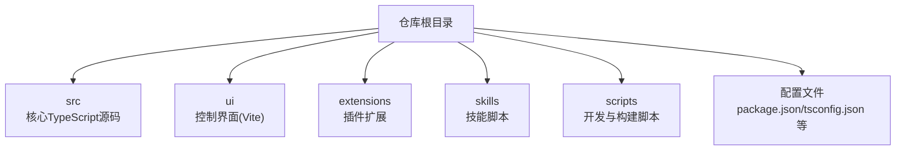
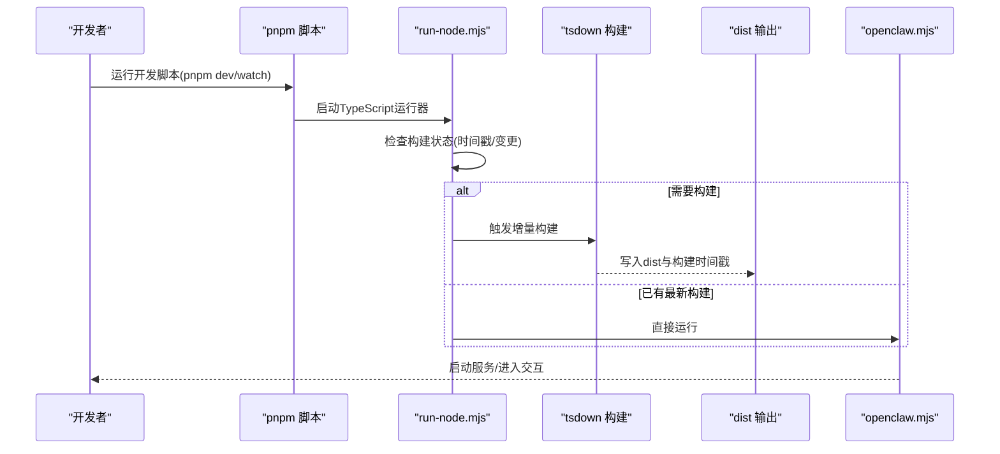
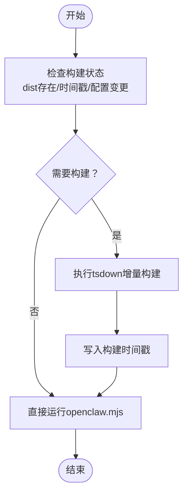
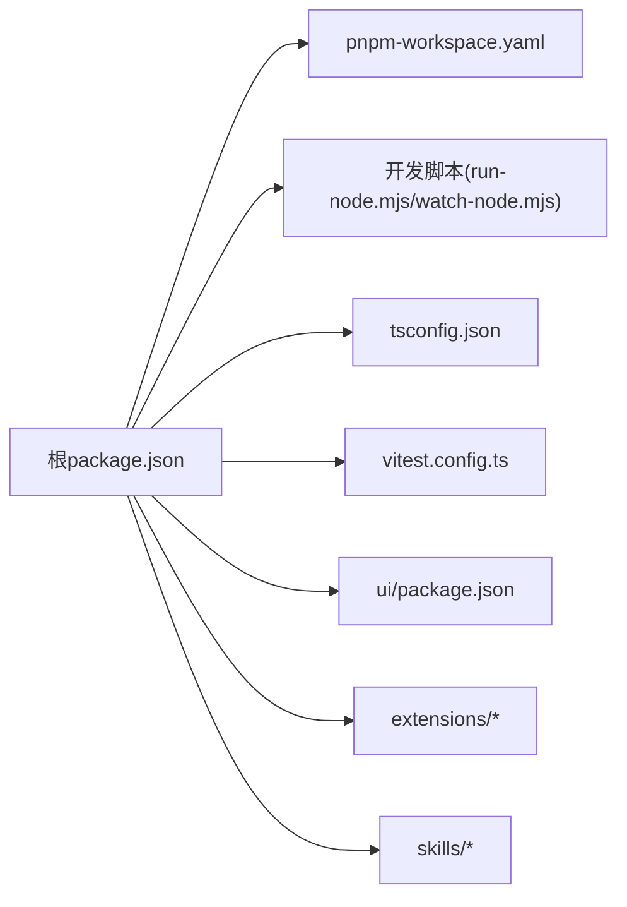

# 开发环境配置

<cite>
**本文档引用的文件**
- [package.json](file://package.json)
- [pnpm-workspace.yaml](file://pnpm-workspace.yaml)
- [tsconfig.json](file://tsconfig.json)
- [README.md](file://README.md)
- [.gitignore](file://.gitignore)
- [.npmrc](file://.npmrc)
- [.pre-commit-config.yaml](file://.pre-commit-config.yaml)
- [.markdownlint-cli2.jsonc](file://.markdownlint-cli2.jsonc)
- [.oxlintrc.json](file://.oxlintrc.json)
- [scripts/run-node.mjs](file://scripts/run-node.mjs)
- [scripts/watch-node.mjs](file://scripts/watch-node.mjs)
- [vitest.config.ts](file://vitest.config.ts)
- [ui/vite.config.ts](file://ui/vite.config.ts)
- [ui/package.json](file://ui/package.json)
</cite>

## 目录

1. [简介](#简介)
2. [项目结构](#项目结构)
3. [核心组件](#核心组件)
4. [架构总览](#架构总览)
5. [详细组件分析](#详细组件分析)
6. [依赖关系分析](#依赖关系分析)
7. [性能考虑](#性能考虑)
8. [故障排除指南](#故障排除指南)
9. [结论](#结论)
10. [附录](#附录)

## 简介

本指南面向OpenClaw项目的开发者，提供从环境搭建到开发调试的完整配置说明。内容覆盖Node.js版本要求、包管理器选择与配置（npm/pnpm）、TypeScript编译配置、开发工具链（ESLint、Prettier、Git hooks）、IDE配置建议、开发服务器与热重载、以及测试环境设置。目标是帮助你在本地快速建立一致且高效的开发环境。

## 项目结构

OpenClaw采用多包工作区结构，根目录包含核心应用、UI子包、扩展与技能等模块。关键特性：

- 使用pnpm工作区管理多包依赖与构建
- 核心TypeScript源码位于src目录，UI位于ui目录
- 扩展与技能位于extensions与skills目录
- 通过脚本实现开发时的自动构建与热重载

**图表来源**

- [package.json](file://package.json)
- [pnpm-workspace.yaml](file://pnpm-workspace.yaml)

**章节来源**

- [package.json](file://package.json)
- [pnpm-workspace.yaml](file://pnpm-workspace.yaml)

## 核心组件

- 包管理器与引擎：项目要求Node ≥22，并优先使用pnpm作为包管理器；支持npm与bun运行TypeScript直接执行。
- TypeScript编译：使用tsconfig.json定义严格模式、模块解析策略与路径映射，配合tsdown进行增量构建。
- 开发脚本：通过scripts/run-node.mjs与scripts/watch-node.mjs实现“TypeScript直接运行”与“热重载监听”。
- 测试框架：Vitest配置集中于vitest.config.ts，覆盖单元测试、覆盖率阈值与排除规则。
- UI构建：Vite用于控制界面构建，输出至dist/control-ui目录。

**章节来源**

- [package.json](file://package.json)
- [tsconfig.json](file://tsconfig.json)
- [scripts/run-node.mjs](file://scripts/run-node.mjs)
- [scripts/watch-node.mjs](file://scripts/watch-node.mjs)
- [vitest.config.ts](file://vitest.config.ts)
- [ui/vite.config.ts](file://ui/vite.config.ts)

## 架构总览

下图展示了从开发命令到TypeScript构建与运行的整体流程，包括热重载与构建触发条件。

**图表来源**

- [scripts/run-node.mjs](file://scripts/run-node.mjs)
- [package.json](file://package.json)

**章节来源**

- [scripts/run-node.mjs](file://scripts/run-node.mjs)
- [package.json](file://package.json)

## 详细组件分析

### Node.js与包管理器配置

- Node.js版本：要求≥22，确保与现代ES特性兼容。
- 包管理器：优先使用pnpm；支持npm与bun运行TypeScript直接执行（tsx）。
- pnpm工作区：根目录与ui、packages、extensions均纳入工作区管理。
- 仅构建依赖：通过onlyBuiltDependencies声明原生/二进制依赖，避免不必要的系统级安装。

**章节来源**

- [package.json](file://package.json)
- [pnpm-workspace.yaml](file://pnpm-workspace.yaml)
- [README.md](file://README.md)

### TypeScript编译配置

- 编译选项：启用严格模式、NodeNext模块与解析策略、目标ES2023、允许导入ts扩展名等。
- 路径映射：为openclaw/plugin-sdk提供别名，便于插件SDK引用。
- 入口与排除：include覆盖src、ui、extensions，排除node_modules与dist。
- 类型导出：通过package.json的exports字段暴露插件SDK类型与默认入口。

**章节来源**

- [tsconfig.json](file://tsconfig.json)
- [package.json](file://package.json)

### 开发工具链与代码质量

- ESLint：使用oxlint（基于oxc），规则分类为correctness/perf/suspicious，部分规则按需关闭以平衡约束与灵活性。
- Prettier：使用oxfmt统一格式化，支持检查与修复模式。
- Git hooks：通过pre-commit配置多项检查，包括YAML校验、大文件检测、私钥扫描、Shell脚本检查、GitHub Actions安全审计、SwiftLint/SwiftFormat等。
- 文档规范：markdownlint-cli2配置忽略特定目录与规则，允许自定义HTML元素标签。

**章节来源**

- [.oxlintrc.json](file://.oxlintrc.json)
- [.pre-commit-config.yaml](file://.pre-commit-config.yaml)
- [.markdownlint-cli2.jsonc](file://.markdownlint-cli2.jsonc)

### 开发服务器与热重载

- 开发脚本：pnpm dev与gateway:watch分别启动主应用与网关专用开发模式。
- 热重载机制：watch-node.mjs监听src、tsconfig.json、package.json等关键文件，结合run-node.mjs的构建状态判断决定是否重新构建或直接运行。
- 构建触发条件：当dist缺失、配置文件更新、源码变更或Git HEAD变化时触发增量构建。

**图表来源**

- [scripts/run-node.mjs](file://scripts/run-node.mjs)
- [scripts/watch-node.mjs](file://scripts/watch-node.mjs)

**章节来源**

- [scripts/run-node.mjs](file://scripts/run-node.mjs)
- [scripts/watch-node.mjs](file://scripts/watch-node.mjs)
- [package.json](file://package.json)

### 测试环境设置

- 测试框架：Vitest，配置了超时、池类型、最大并发、覆盖率阈值与排除规则。
- 覆盖率范围：仅统计src目录实际被测试覆盖的文件，排除大型集成模块与UI/CLI入口。
- 插件SDK别名：在测试配置中为openclaw/plugin-sdk各子路径提供别名映射，保证测试可定位SDK源码。

**章节来源**

- [vitest.config.ts](file://vitest.config.ts)
- [package.json](file://package.json)

### UI构建与开发服务器

- Vite配置：支持自定义base路径、预览依赖优化、构建输出目录与端口设置。
- UI独立包：ui/package.json声明依赖与脚本，与根脚本解耦。
- 控制界面：构建产物输出至dist/control-ui，供网关控制面板使用。

**章节来源**

- [ui/vite.config.ts](file://ui/vite.config.ts)
- [ui/package.json](file://ui/package.json)

### IDE配置建议

- VS Code扩展推荐（基于项目工具链）：
  - Prettier统一格式化（oxfmt）
  - Markdown lint（markdownlint-cli2）
  - Swift相关扩展（SwiftLint/SwiftFormat）
  - Git hooks支持（pre-commit）
- 调试配置：
  - 使用TypeScript直接运行：通过pnpm脚本启动openclaw.mjs，结合watch模式实现热重载。
  - 在VS Code中添加Node调试任务，指向openclaw.mjs，设置断点进行单步调试。

**章节来源**

- [.pre-commit-config.yaml](file://.pre-commit-config.yaml)
- [.markdownlint-cli2.jsonc](file://.markdownlint-cli2.jsonc)
- [package.json](file://package.json)

## 依赖关系分析

- 根包与工作区：根package.json声明工作区与脚本；pnpm-workspace.yaml定义包范围与仅构建依赖。
- 仅构建依赖：通过pnpm.onlyBuiltDependencies与workspace配置，限定原生/二进制依赖的安装范围，减少跨平台构建复杂度。
- UI与扩展：ui与extensions各自拥有独立的package.json与构建配置，通过根脚本统一协调。

**图表来源**

- [package.json](file://package.json)
- [pnpm-workspace.yaml](file://pnpm-workspace.yaml)

**章节来源**

- [package.json](file://package.json)
- [pnpm-workspace.yaml](file://pnpm-workspace.yaml)

## 性能考虑

- 并发与资源：Vitest根据平台与CI环境调整最大工作线程数，避免过度占用资源。
- 构建缓存：run-node.mjs通过构建时间戳与Git HEAD判断，避免不必要的全量构建。
- UI构建：Vite优化依赖与chunk大小警告阈值，平衡加载性能与日志清晰度。
- 仅构建依赖：限制原生/二进制依赖安装，降低安装时间与磁盘占用。

**章节来源**

- [vitest.config.ts](file://vitest.config.ts)
- [scripts/run-node.mjs](file://scripts/run-node.mjs)
- [ui/vite.config.ts](file://ui/vite.config.ts)
- [package.json](file://package.json)

## 故障排除指南

- Node版本不匹配：确认Node版本≥22，必要时使用nvm或类似工具切换。
- pnpm安装失败：检查onlyBuiltDependencies与平台兼容性，清理缓存后重试。
- 构建未触发：检查run-node.mjs的watch路径与构建时间戳，确认tsconfig.json与package.json未被忽略。
- Git钩子未生效：确认.pre-commit-config.yaml已安装并正确配置，必要时手动运行pre-commit run --all-files。
- UI构建异常：检查ui/vite.config.ts中的base路径与端口冲突，清理dist/control-ui后重试。

**章节来源**

- [scripts/run-node.mjs](file://scripts/run-node.mjs)
- [.pre-commit-config.yaml](file://.pre-commit-config.yaml)
- [ui/vite.config.ts](file://ui/vite.config.ts)
- [.gitignore](file://.gitignore)

## 结论

通过遵循本指南，你可以完成OpenClaw的开发环境搭建与配置。项目提供了完善的TypeScript编译、热重载、测试与UI构建能力，配合pnpm工作区与Git hooks，能够保障团队协作的一致性与效率。建议在本地开发时始终使用pnpm作为包管理器，并启用pre-commit钩子以保持代码质量。

## 附录

- 常用脚本速览：
  - 安装依赖：pnpm install
  - UI构建：pnpm ui:build
  - 核心构建：pnpm build
  - 开发模式：pnpm dev 或 pnpm gateway:watch
  - 单元测试：pnpm test 或 pnpm vitest run
  - 文档与格式检查：pnpm lint、pnpm format、pnpm check

**章节来源**

- [package.json](file://package.json)
- [README.md](file://README.md)
