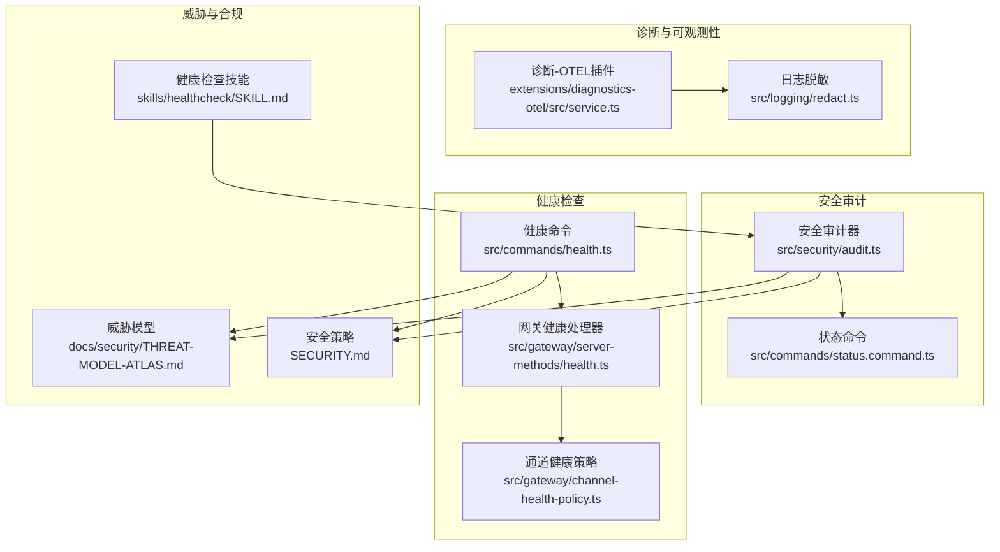
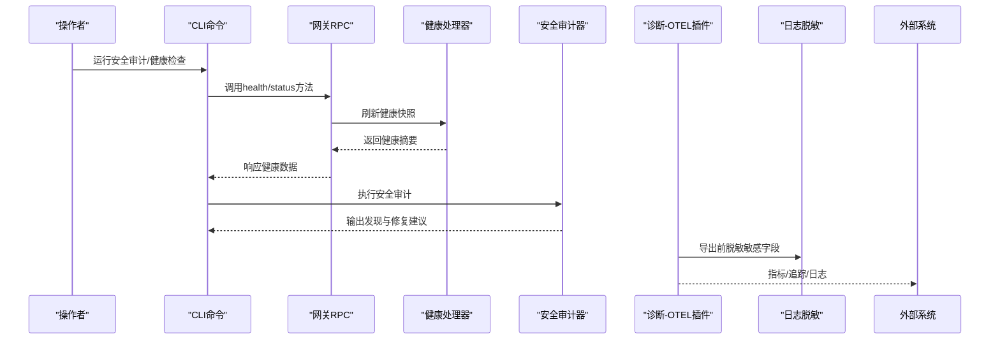
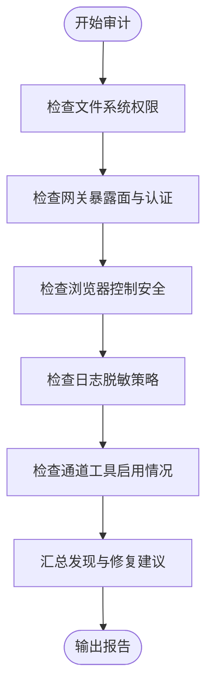
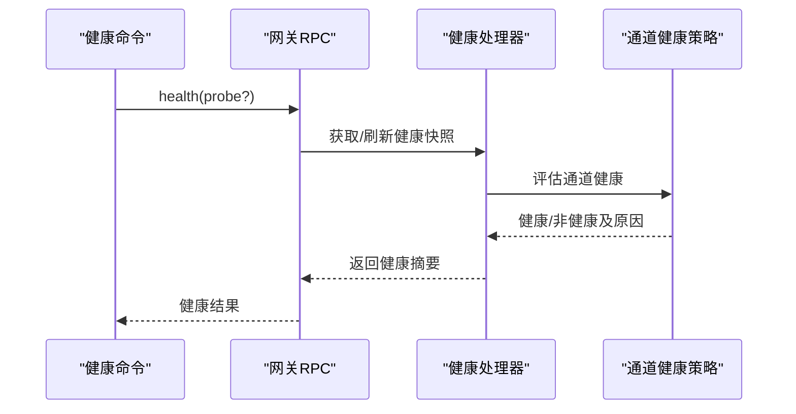
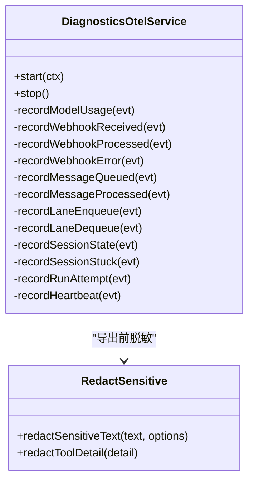
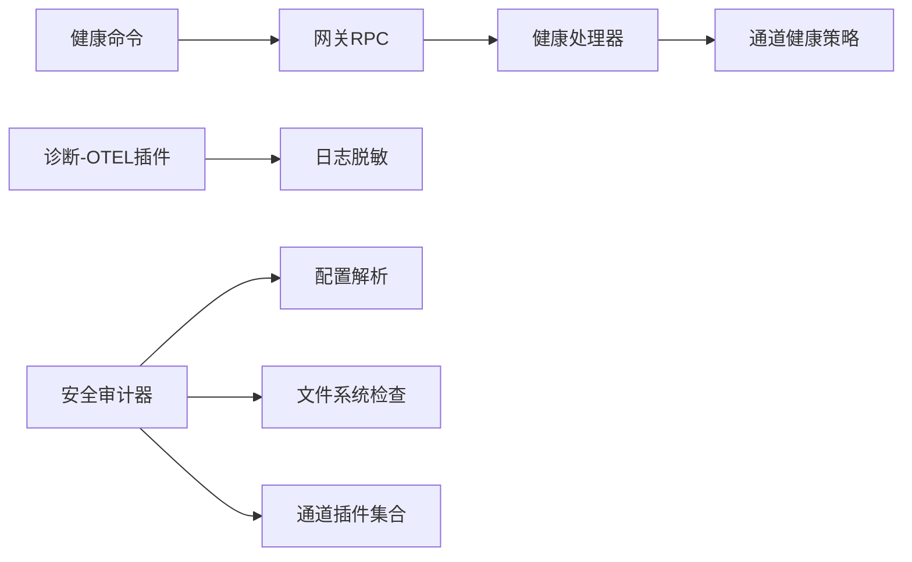

# 安全监控配置

<cite>
**本文档引用的文件**
- [src/security/audit.ts](file://src/security/audit.ts)
- [src/commands/status.command.ts](file://src/commands/status.command.ts)
- [src/commands/health.ts](file://src/commands/health.ts)
- [src/gateway/server-methods/health.ts](file://src/gateway/server-methods/health.ts)
- [extensions/diagnostics-otel/src/service.ts](file://extensions/diagnostics-otel/src/service.ts)
- [src/logging/redact.ts](file://src/logging/redact.ts)
- [src/gateway/channel-health-policy.ts](file://src/gateway/channel-health-policy.ts)
- [docs/security/THREAT-MODEL-ATLAS.md](file://docs/security/THREAT-MODEL-ATLAS.md)
- [SECURITY.md](file://SECURITY.md)
- [skills/healthcheck/SKILL.md](file://skills/healthcheck/SKILL.md)
</cite>

## 目录

1. [简介](#简介)
2. [项目结构](#项目结构)
3. [核心组件](#核心组件)
4. [架构总览](#架构总览)
5. [详细组件分析](#详细组件分析)
6. [依赖关系分析](#依赖关系分析)
7. [性能考虑](#性能考虑)
8. [故障排除指南](#故障排除指南)
9. [结论](#结论)
10. [附录](#附录)

## 简介

本指南面向OpenClaw的安全监控与运维团队，提供从基础监控到高级分析的完整安全监控体系配置说明。内容覆盖安全事件监控、日志审计与异常检测、入侵检测系统（IDS）配置、威胁情报集成、实时告警设置、性能监控、资源使用监控、健康检查、日志聚合与可视化、安全基线监控、合规性检查以及风险评估等。

## 项目结构

OpenClaw在多个层面提供了安全监控能力：

- 安全审计：通过命令行与运行时状态报告进行安全基线检查与风险评估
- 健康检查：对网关、通道、会话与心跳进行端到端健康度量
- 诊断导出：通过OpenTelemetry插件导出指标、追踪与日志
- 日志脱敏：内置敏感信息脱敏策略，支持自定义正则与模式
- 威胁建模：官方威胁模型文档用于指导风险评估与缓解措施

**图表来源**

- [src/security/audit.ts:1-800](file://src/security/audit.ts#L1-L800)
- [src/commands/status.command.ts:473-508](file://src/commands/status.command.ts#L473-L508)
- [src/commands/health.ts:1-752](file://src/commands/health.ts#L1-L752)
- [src/gateway/server-methods/health.ts:1-38](file://src/gateway/server-methods/health.ts#L1-L38)
- [src/gateway/channel-health-policy.ts:57-81](file://src/gateway/channel-health-policy.ts#L57-L81)
- [extensions/diagnostics-otel/src/service.ts:72-686](file://extensions/diagnostics-otel/src/service.ts#L72-L686)
- [src/logging/redact.ts:1-152](file://src/logging/redact.ts#L1-L152)
- [docs/security/THREAT-MODEL-ATLAS.md:168-529](file://docs/security/THREAT-MODEL-ATLAS.md#L168-L529)
- [SECURITY.md:48-67](file://SECURITY.md#L48-L67)
- [skills/healthcheck/SKILL.md:1-31](file://skills/healthcheck/SKILL.md#L1-L31)

**章节来源**

- [src/security/audit.ts:1-800](file://src/security/audit.ts#L1-L800)
- [src/commands/health.ts:1-752](file://src/commands/health.ts#L1-L752)
- [extensions/diagnostics-otel/src/service.ts:72-686](file://extensions/diagnostics-otel/src/service.ts#L72-L686)
- [src/logging/redact.ts:1-152](file://src/logging/redact.ts#L1-L152)
- [docs/security/THREAT-MODEL-ATLAS.md:168-529](file://docs/security/THREAT-MODEL-ATLAS.md#L168-L529)
- [SECURITY.md:48-67](file://SECURITY.md#L48-L67)
- [skills/healthcheck/SKILL.md:1-31](file://skills/healthcheck/SKILL.md#L1-L31)

## 核心组件

- 安全审计器：扫描配置、文件权限、网关暴露面、浏览器控制、日志脱敏策略等，生成严重性分级的发现项与修复建议
- 健康命令与网关健康处理器：提供端到端健康快照，包括通道连通性、账户认证状态、探针结果与会话统计
- 诊断-OTEL插件：将模型用量、消息处理、队列深度、会话卡住等关键事件导出为指标、追踪与日志
- 日志脱敏：基于默认与自定义正则表达式对敏感文本进行脱敏，支持“关闭”、“仅工具详情”等模式
- 威胁模型与安全策略：提供攻击场景、风险矩阵与常见误报判定，指导安全配置与告警优先级

**章节来源**

- [src/security/audit.ts:1-800](file://src/security/audit.ts#L1-L800)
- [src/commands/health.ts:1-752](file://src/commands/health.ts#L1-L752)
- [src/gateway/server-methods/health.ts:1-38](file://src/gateway/server-methods/health.ts#L1-L38)
- [extensions/diagnostics-otel/src/service.ts:72-686](file://extensions/diagnostics-otel/src/service.ts#L72-L686)
- [src/logging/redact.ts:1-152](file://src/logging/redact.ts#L1-L152)
- [docs/security/THREAT-MODEL-ATLAS.md:168-529](file://docs/security/THREAT-MODEL-ATLAS.md#L168-L529)
- [SECURITY.md:48-67](file://SECURITY.md#L48-L67)

## 架构总览

下图展示OpenClaw安全监控体系的关键交互路径：从安全审计与健康检查，到诊断导出与日志脱敏，再到威胁建模与合规策略。

**图表来源**

- [src/commands/health.ts:525-752](file://src/commands/health.ts#L525-L752)
- [src/gateway/server-methods/health.ts:10-38](file://src/gateway/server-methods/health.ts#L10-L38)
- [src/security/audit.ts:1-800](file://src/security/audit.ts#L1-L800)
- [extensions/diagnostics-otel/src/service.ts:72-686](file://extensions/diagnostics-otel/src/service.ts#L72-L686)
- [src/logging/redact.ts:126-152](file://src/logging/redact.ts#L126-L152)

## 详细组件分析

### 安全审计与基线监控

- 功能要点
  - 文件系统权限检查：状态目录与配置文件的可写/可读权限，给出POSIX模式建议
  - 网关暴露面检查：绑定地址、反向代理信任、控制UI允许来源、Host头回退、X-Real-IP回退、mDNS模式、Tailscale模式等
  - 认证与授权：令牌/密码强度、速率限制、受信代理模式与用户白名单
  - 浏览器控制：远程CDP协议安全性、无认证暴露风险
  - 日志脱敏：redactSensitive模式与自定义正则
  - 通道安全：特定渠道工具启用带来的权限风险
- 配置建议
  - 将gateway.bind限制为loopback或受控网络
  - 启用gateway.auth（推荐token），并配置rateLimit
  - 设置gateway.trustedProxies与allowedOrigins，禁用dangerouslyAllowHostHeaderOriginFallback
  - 将logging.redactSensitive设为tools或按需自定义patterns
  - 对浏览器控制启用时，必须配置gateway.auth
- 常见修复
  - 将配置文件权限调整为0600，状态目录为0700
  - 为Control UI设置明确的allowedOrigins，避免wildcard
  - 禁用mdns.full或改为minimal/off
  - 在Tailscale funnel模式下严格控制访问

**图表来源**

- [src/security/audit.ts:208-337](file://src/security/audit.ts#L208-L337)
- [src/security/audit.ts:339-687](file://src/security/audit.ts#L339-L687)
- [src/security/audit.ts:718-797](file://src/security/audit.ts#L718-L797)
- [src/security/audit.ts:799-800](file://src/security/audit.ts#L799-L800)

**章节来源**

- [src/security/audit.ts:1-800](file://src/security/audit.ts#L1-L800)
- [src/commands/status.command.ts:473-508](file://src/commands/status.command.ts#L473-L508)

### 健康检查与通道健康策略

- 功能要点
  - 健康命令：查询网关健康、通道账户连通性、探针结果、心跳间隔、会话存储状态
  - 网关健康处理器：缓存与刷新策略，支持带探针的健康快照
  - 通道健康策略：基于运行状态、忙碌态、最近活动时间与生命周期初始化判断健康
- 配置建议
  - 合理设置HEALTH_REFRESH_INTERVAL_MS以平衡实时性与开销
  - 为每个通道配置默认账户与绑定，确保探针能覆盖关键账户
  - 关注“会话卡住”计数与年龄直方图，及时发现处理阻塞
- 告警阈值示例
  - 通道不健康：probe.ok为false或超时
  - 会话卡住：session.stuck计数持续增长且ageMs超过阈值
  - 队列等待：queue.wait_ms分位数异常升高

**图表来源**

- [src/commands/health.ts:348-523](file://src/commands/health.ts#L348-L523)
- [src/gateway/server-methods/health.ts:10-38](file://src/gateway/server-methods/health.ts#L10-L38)
- [src/gateway/channel-health-policy.ts:57-81](file://src/gateway/channel-health-policy.ts#L57-L81)

**章节来源**

- [src/commands/health.ts:1-752](file://src/commands/health.ts#L1-L752)
- [src/gateway/server-methods/health.ts:1-38](file://src/gateway/server-methods/health.ts#L1-L38)
- [src/gateway/channel-health-policy.ts:57-81](file://src/gateway/channel-health-policy.ts#L57-L81)

### 诊断导出与实时观测

- 功能要点
  - 支持OTLP/Protobuf协议，导出Traces、Metrics、Logs
  - 指标覆盖：模型用量、消息处理、队列深度与等待、会话状态与卡住、运行尝试次数
  - 日志脱敏：导出前对消息体与属性进行敏感信息脱敏
  - 事件类型：model.usage、webhook.received/processed/error、message.queued/processed、queue.lane.enqueue/dequeue、session.state/stuck、run.attempt、diagnostic.heartbeat
- 配置建议
  - 设置OTEL_EXPORTER_OTLP_ENDPOINT与协议为http/protobuf
  - 启用traces/metrics/logs中需要的部分
  - 合理设置flushIntervalMs与采样率sampleRate
  - 使用服务名serviceName区分不同环境或实例
- 告警建议
  - webhook.error计数异常升高
  - session.stuck计数与ageMs直方图异常
  - queue.wait_ms分位数持续高于SLA

**图表来源**

- [extensions/diagnostics-otel/src/service.ts:72-686](file://extensions/diagnostics-otel/src/service.ts#L72-L686)
- [src/logging/redact.ts:126-152](file://src/logging/redact.ts#L126-L152)

**章节来源**

- [extensions/diagnostics-otel/src/service.ts:72-686](file://extensions/diagnostics-otel/src/service.ts#L72-L686)
- [src/logging/redact.ts:1-152](file://src/logging/redact.ts#L1-L152)

### 日志脱敏与合规

- 功能要点
  - 默认模式为tools，对工具详情进行脱敏；可设为off关闭
  - 内置多种敏感信息匹配模式（密钥、令牌、密码、PEM私钥、常见API前缀等）
  - 支持自定义正则patterns，按需扩展
- 配置建议
  - 生产环境建议保持默认脱敏模式
  - 如需自定义，使用安全正则编译函数，避免ReDoS
  - 对于高敏感场景，可临时关闭脱敏以采集证据，但需严格控制范围与时间

**章节来源**

- [src/logging/redact.ts:1-152](file://src/logging/redact.ts#L1-L152)

### 威胁建模与风险评估

- 功能要点
  - 提供攻击场景、技术映射与风险矩阵
  - 包含初始访问、持久化、执行、数据窃取、影响等阶段的威胁
  - 明确优先级与缓解建议
- 配置建议
  - 结合威胁模型识别高风险暴露面（如Tailscale funnel、wildcard allowedOrigins、mdns.full）
  - 依据风险矩阵设定告警优先级与处置流程
  - 对关键攻击链（如Prompt注入到RCE）加强沙箱与审批策略

**章节来源**

- [docs/security/THREAT-MODEL-ATLAS.md:168-529](file://docs/security/THREAT-MODEL-ATLAS.md#L168-L529)

### 常见误报与安全策略

- 功能要点
  - 列举常见误报模式，帮助安全运营人员快速甄别
  - 强调边界绕过要求与受信操作面的区分
- 配置建议
  - 在告警平台中建立误报规则与降噪策略
  - 对误报进行归档与复盘，优化规则与阈值

**章节来源**

- [SECURITY.md:48-67](file://SECURITY.md#L48-L67)

### 健康检查技能（辅助基线）

- 功能要点
  - 通过技能对主机进行安全加固与风险容忍度对齐
  - 工作流强调可逆变更与回滚计划
- 配置建议
  - 在自动化巡检中结合该技能生成报告
  - 将技能输出纳入合规检查清单

**章节来源**

- [skills/healthcheck/SKILL.md:1-31](file://skills/healthcheck/SKILL.md#L1-L31)

## 依赖关系分析

- 组件耦合
  - 健康命令依赖网关RPC与通道插件状态构建健康摘要
  - 网关健康处理器依赖健康缓存与后台刷新机制
  - 诊断-OTEL插件依赖诊断事件总线与日志脱敏模块
  - 安全审计器依赖配置解析、文件系统检查与通道插件集合
- 外部依赖
  - OpenTelemetry SDK与导出器
  - 正则安全编译器（防止ReDoS）

**图表来源**

- [src/commands/health.ts:348-523](file://src/commands/health.ts#L348-L523)
- [src/gateway/server-methods/health.ts:10-38](file://src/gateway/server-methods/health.ts#L10-L38)
- [src/gateway/channel-health-policy.ts:57-81](file://src/gateway/channel-health-policy.ts#L57-L81)
- [extensions/diagnostics-otel/src/service.ts:72-686](file://extensions/diagnostics-otel/src/service.ts#L72-L686)
- [src/logging/redact.ts:126-152](file://src/logging/redact.ts#L126-L152)
- [src/security/audit.ts:1-800](file://src/security/audit.ts#L1-L800)

**章节来源**

- [src/commands/health.ts:1-752](file://src/commands/health.ts#L1-L752)
- [src/gateway/server-methods/health.ts:1-38](file://src/gateway/server-methods/health.ts#L1-L38)
- [extensions/diagnostics-otel/src/service.ts:72-686](file://extensions/diagnostics-otel/src/service.ts#L72-L686)
- [src/logging/redact.ts:1-152](file://src/logging/redact.ts#L1-L152)
- [src/security/audit.ts:1-800](file://src/security/audit.ts#L1-L800)

## 性能考虑

- 健康快照刷新
  - 合理设置HEALTH_REFRESH_INTERVAL_MS，避免频繁探针导致的负载
  - 在非verbose模式下减少探针频率
- 诊断导出
  - 控制flushIntervalMs与采样率，避免高基数标签导致的内存与带宽压力
  - 仅启用必要的traces/metrics/logs子集
- 日志脱敏
  - 自定义patterns应尽量精确，避免全局贪婪匹配引发性能问题
  - 在高吞吐场景下优先使用默认模式

## 故障排除指南

- 常见问题
  - 网关未鉴权暴露：检查gateway.bind与gateway.auth配置，确保令牌/密码强度足够
  - 控制UI跨域问题：设置明确的allowedOrigins，禁用dangerouslyAllowHostHeaderOriginFallback
  - 通道探针失败：确认账户配置、令牌源与网络可达性
  - 诊断导出失败：检查OTLP端点协议与端口，验证headers与服务名
  - 健康缓存陈旧：检查HEALTH_REFRESH_INTERVAL_MS与后台刷新任务
- 排查步骤
  - 使用openclaw health命令获取健康摘要
  - 使用openclaw security audit生成安全审计报告
  - 查看诊断-OTEL插件日志与导出状态
  - 参考威胁模型定位高风险场景并实施缓解

**章节来源**

- [src/commands/health.ts:525-752](file://src/commands/health.ts#L525-L752)
- [src/commands/status.command.ts:473-508](file://src/commands/status.command.ts#L473-L508)
- [extensions/diagnostics-otel/src/service.ts:72-686](file://extensions/diagnostics-otel/src/service.ts#L72-L686)
- [docs/security/THREAT-MODEL-ATLAS.md:168-529](file://docs/security/THREAT-MODEL-ATLAS.md#L168-L529)

## 结论

通过将安全审计、健康检查、诊断导出与日志脱敏有机结合，并结合威胁模型与安全策略，OpenClaw提供了从基础监控到高级分析的完整安全监控体系。建议在生产环境中启用严格的网关鉴权、受信代理与跨域策略，开启诊断导出并设置合理的告警阈值，同时定期运行安全审计与健康检查技能，确保系统持续满足安全基线与合规要求。

## 附录

- 实施清单
  - 网关：bind=loopback或受控网络；启用auth与rateLimit；配置trustedProxies与allowedOrigins
  - 浏览器控制：启用时必须配置auth
  - 日志：redactSensitive=tools或按需自定义patterns
  - 观测：启用OTLP导出，设置flushIntervalMs与采样率
  - 健康：定期运行health/status命令，关注通道探针与会话卡住指标
  - 威胁：对照威胁模型识别高风险场景并制定缓解计划
