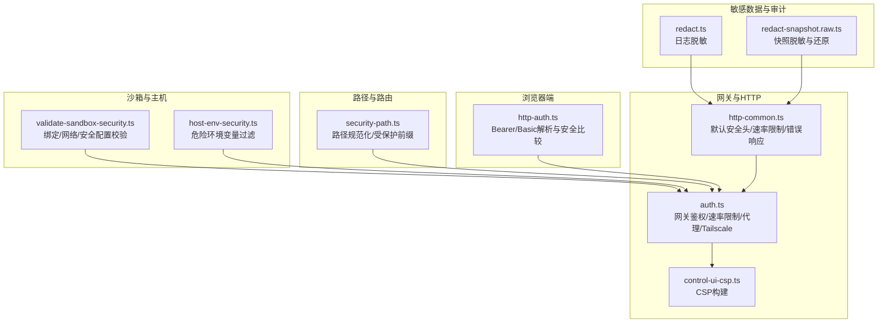
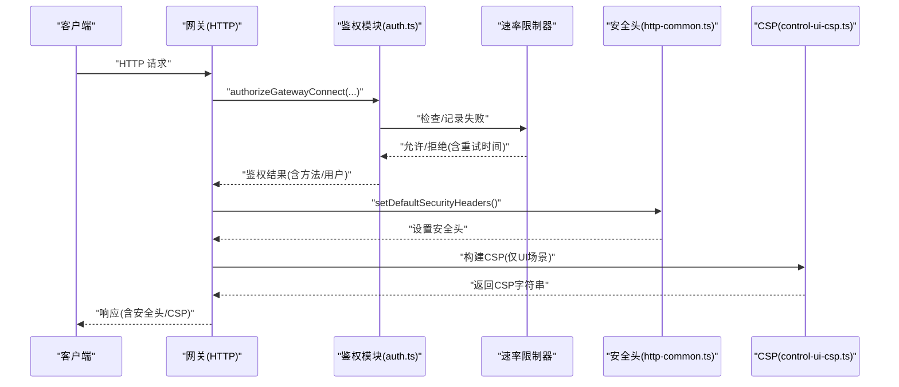
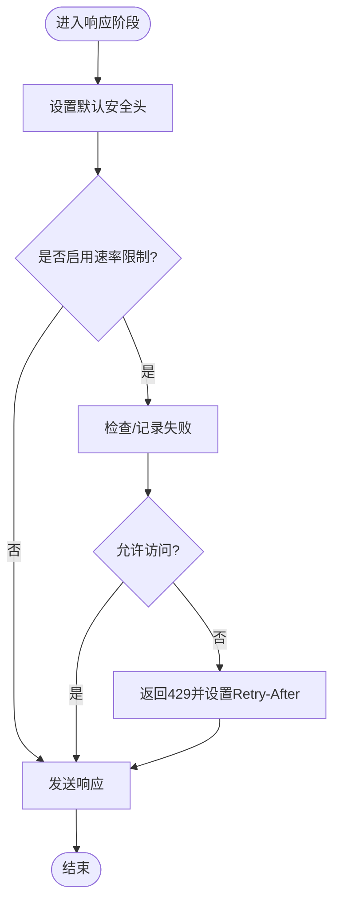
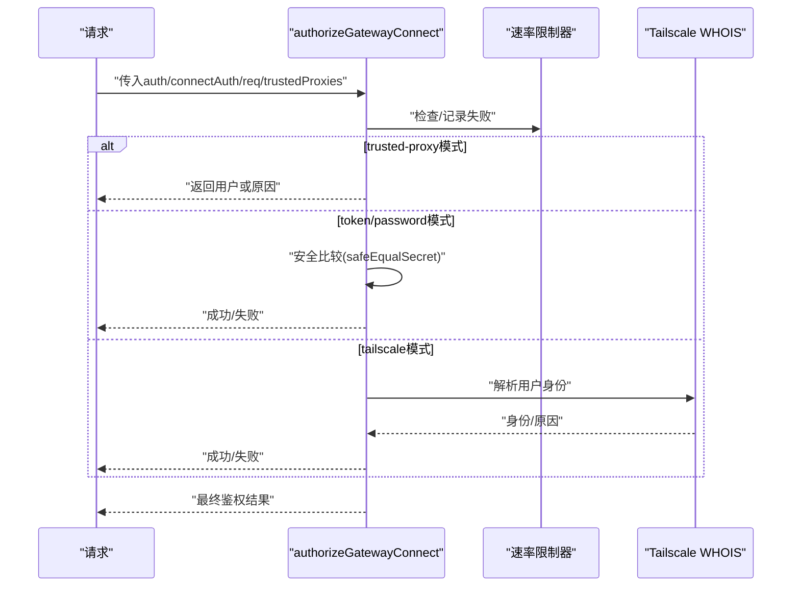
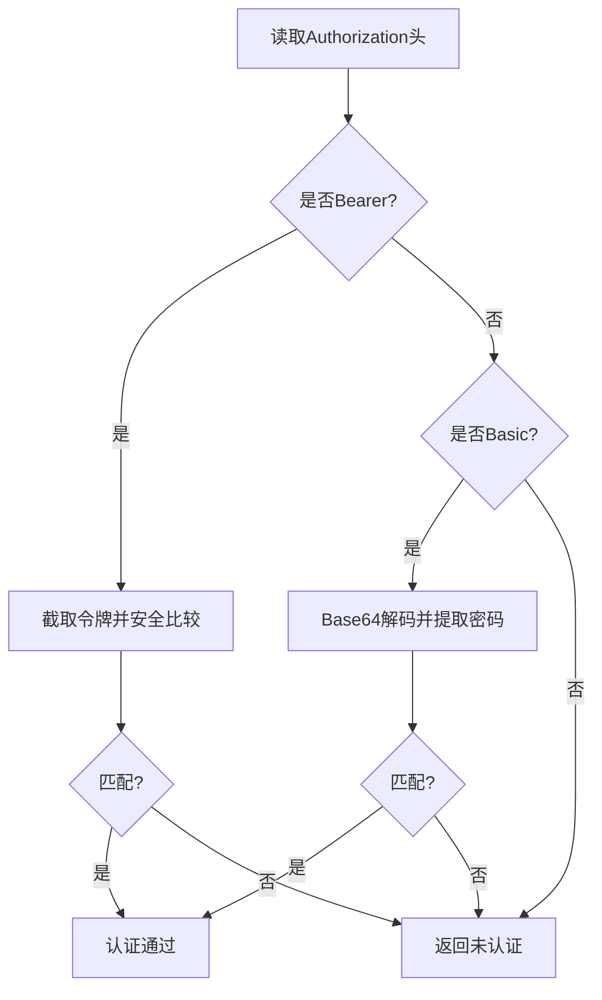
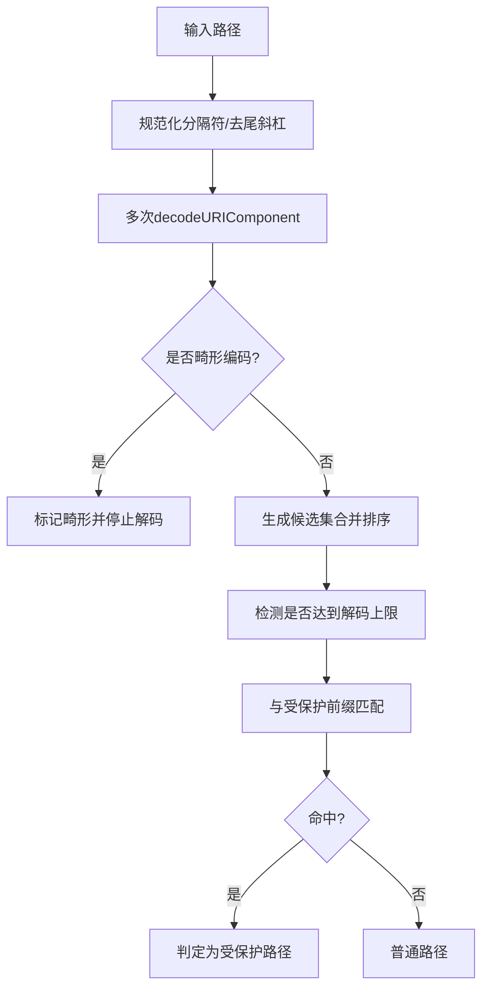
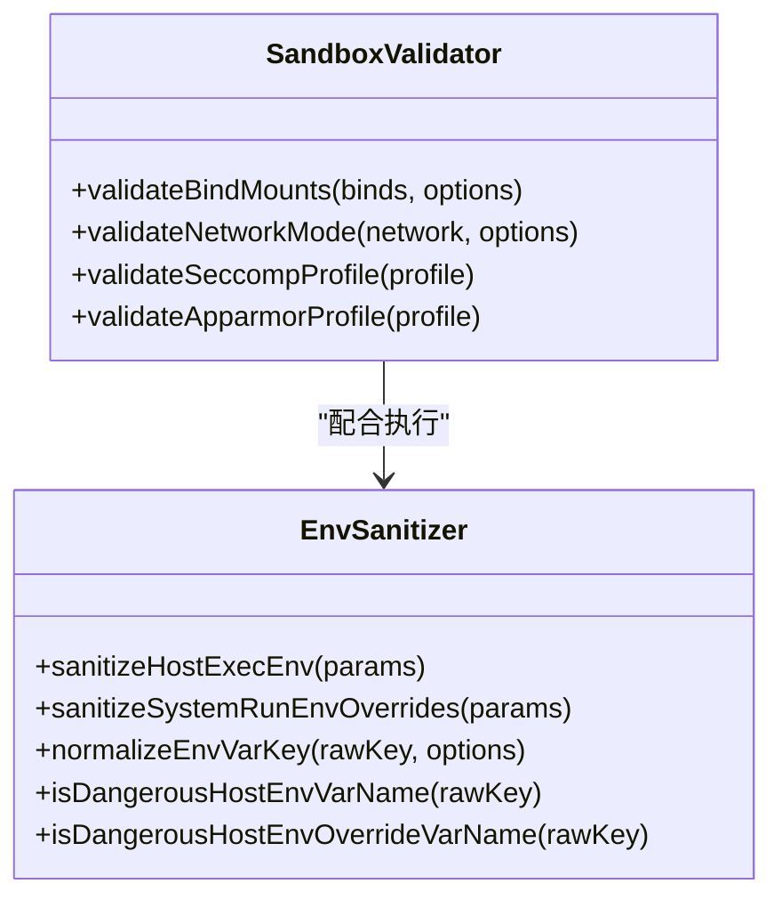
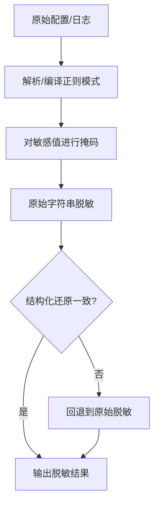
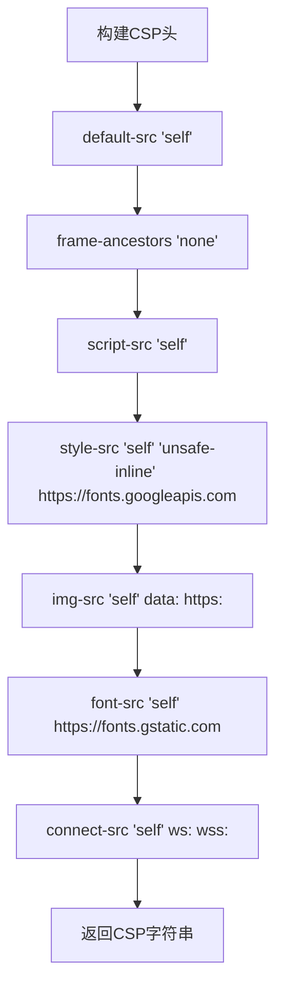
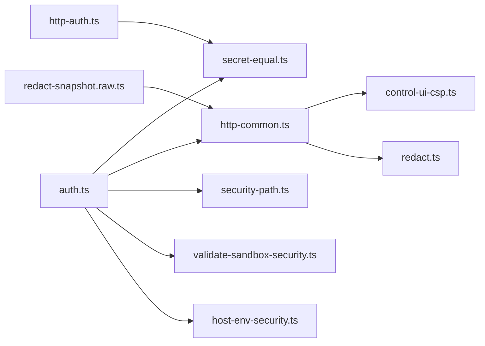

# 应用安全加固

<cite>
**本文引用的文件**
- [SECURITY.md](file://SECURITY.md)
- [http-common.ts](file://src/gateway/http-common.ts)
- [auth.ts](file://src/gateway/auth.ts)
- [secret-equal.ts](file://src/security/secret-equal.ts)
- [http-auth.ts](file://src/browser/http-auth.ts)
- [control-ui-csp.ts](file://src/gateway/control-ui-csp.ts)
- [control-ui-csp.test.ts](file://src/gateway/control-ui-csp.test.ts)
- [security-path.ts](file://src/gateway/security-path.ts)
- [validate-sandbox-security.ts](file://src/agents/sandbox/validate-sandbox-security.ts)
- [host-env-security.ts](file://src/infra/host-env-security.ts)
- [redact.ts](file://src/logging/redact.ts)
- [redact-snapshot.raw.ts](file://src/config/redact-snapshot.raw.ts)
- [index.md](file://docs/gateway/security/index.md)
</cite>

## 目录

1. [简介](#简介)
2. [项目结构](#项目结构)
3. [核心组件](#核心组件)
4. [架构总览](#架构总览)
5. [详细组件分析](#详细组件分析)
6. [依赖关系分析](#依赖关系分析)
7. [性能考量](#性能考量)
8. [故障排查指南](#故障排查指南)
9. [结论](#结论)
10. [附录](#附录)

## 简介

本指南面向OpenClaw应用的安全加固，覆盖应用层到数据层的完整安全防护体系，包括但不限于：应用安全配置、输入验证与输出编码、CSRF/XSS/SQL注入防护、API安全配置、认证授权与会话管理、敏感数据保护、加密存储与传输安全、安全头与CSP策略、以及安全审计日志。文档以仓库中已实现的安全能力为依据，结合威胁模型与最佳实践，提供可操作的加固建议与实施路径。

## 项目结构

OpenClaw采用多平台与多组件协同的架构，安全相关能力主要分布在以下模块：

- 网关与HTTP安全：默认安全头、速率限制、错误响应、CSP构建等
- 认证与授权：网关连接鉴权、令牌/密码校验、可信代理与Tailscale集成
- 浏览器端HTTP认证：Bearer与Basic解析与安全比较
- 路径与路由安全：路径规范化与受保护前缀检测
- 沙箱安全：绑定挂载、网络模式、安全配置文件策略
- 主机环境安全：危险环境变量过滤与白名单
- 敏感信息脱敏：日志与快照中的敏感值处理
- 安全策略与信任模型：官方安全策略与部署假设

图表来源

- [http-common.ts:1-109](file://src/gateway/http-common.ts#L1-L109)
- [auth.ts:1-504](file://src/gateway/auth.ts#L1-L504)
- [control-ui-csp.ts:1-17](file://src/gateway/control-ui-csp.ts#L1-L17)
- [http-auth.ts:1-48](file://src/browser/http-auth.ts#L1-L48)
- [security-path.ts:1-162](file://src/gateway/security-path.ts#L1-L162)
- [validate-sandbox-security.ts:1-344](file://src/agents/sandbox/validate-sandbox-security.ts#L1-L344)
- [host-env-security.ts:1-158](file://src/infra/host-env-security.ts#L1-L158)
- [redact.ts:47-83](file://src/logging/redact.ts#L47-L83)
- [redact-snapshot.raw.ts:1-32](file://src/config/redact-snapshot.raw.ts#L1-L32)

章节来源

- [SECURITY.md:1-288](file://SECURITY.md#L1-L288)

## 核心组件

- 默认安全头与速率限制：统一设置X-Content-Type-Options、Referrer-Policy、Permissions-Policy；支持可选的HSTS；提供速率限制与重试等待头；统一错误响应格式。
- 网关鉴权与授权：支持无、令牌、密码、可信代理、Tailscale五种模式；内置速率限制与失败记录；支持本地直连判定与代理IP解析。
- 浏览器端HTTP认证：解析Authorization头中的Bearer与Basic凭据，使用定时恒等比较防止时序攻击。
- 路径与路由安全：对路径进行多次解码、规范化与点段消除，生成候选路径集合，用于受保护前缀匹配与异常检测。
- 沙箱安全：严格禁止挂载系统关键目录与Docker套接字，限制保留目标路径，校验网络模式与安全配置文件（seccomp/AppArmor）。
- 主机环境安全：对环境变量进行键名标准化与危险项过滤，支持Shell包装器白名单覆盖。
- 敏感数据脱敏：日志与快照中对敏感值进行掩码与正则匹配替换，支持原始字符串回退与结构化还原一致性校验。
- 安全策略与信任模型：明确报告流程、范围与信任边界，指导部署与运行时行为。

章节来源

- [http-common.ts:1-109](file://src/gateway/http-common.ts#L1-L109)
- [auth.ts:1-504](file://src/gateway/auth.ts#L1-L504)
- [secret-equal.ts:1-13](file://src/security/secret-equal.ts#L1-L13)
- [http-auth.ts:1-48](file://src/browser/http-auth.ts#L1-L48)
- [security-path.ts:1-162](file://src/gateway/security-path.ts#L1-L162)
- [validate-sandbox-security.ts:1-344](file://src/agents/sandbox/validate-sandbox-security.ts#L1-L344)
- [host-env-security.ts:1-158](file://src/infra/host-env-security.ts#L1-L158)
- [redact.ts:47-83](file://src/logging/redact.ts#L47-L83)
- [redact-snapshot.raw.ts:1-32](file://src/config/redact-snapshot.raw.ts#L1-L32)
- [SECURITY.md:1-288](file://SECURITY.md#L1-L288)

## 架构总览

下图展示从客户端请求到服务端响应的关键安全控制点，包括鉴权、速率限制、CSP、路径安全与沙箱隔离。

图表来源

- [auth.ts:378-503](file://src/gateway/auth.ts#L378-L503)
- [http-common.ts:11-22](file://src/gateway/http-common.ts#L11-L22)
- [control-ui-csp.ts:1-17](file://src/gateway/control-ui-csp.ts#L1-L17)

## 详细组件分析

### 组件A：HTTP安全头与速率限制

- 默认安全头：设置X-Content-Type-Options、Referrer-Policy、Permissions-Policy；可选HSTS；适用于所有响应类型。
- 错误响应：统一400/401/405/413/408/429等错误格式，便于前端与日志统一处理。
- 速率限制：在鉴权失败时记录失败次数并在允许时重置；通过Retry-After头提示重试时间。

图表来源

- [http-common.ts:11-109](file://src/gateway/http-common.ts#L11-L109)

章节来源

- [http-common.ts:1-109](file://src/gateway/http-common.ts#L1-L109)

### 组件B：网关鉴权与授权

- 支持模式：none/token/password/trusted-proxy/tailscale；优先级与来源可配置。
- 本地直连判定：根据Host与转发头判断是否为本地直连，避免代理伪造。
- 可信代理：校验指定头部与用户标识，支持白名单用户。
- Tailscale：在非本地且允许时，校验代理头与WHOIS身份一致性。
- 速率限制：按IP与作用域跟踪失败尝试，成功后重置。

图表来源

- [auth.ts:378-503](file://src/gateway/auth.ts#L378-L503)
- [secret-equal.ts:1-13](file://src/security/secret-equal.ts#L1-L13)

章节来源

- [auth.ts:1-504](file://src/gateway/auth.ts#L1-L504)
- [secret-equal.ts:1-13](file://src/security/secret-equal.ts#L1-L13)

### 组件C：浏览器端HTTP认证

- 解析Authorization头：支持Bearer与Basic两种方式；Base64解码后提取凭据。
- 安全比较：使用恒定时长比较函数，避免时序攻击导致的泄露。

图表来源

- [http-auth.ts:1-48](file://src/browser/http-auth.ts#L1-L48)
- [secret-equal.ts:1-13](file://src/security/secret-equal.ts#L1-L13)

章节来源

- [http-auth.ts:1-48](file://src/browser/http-auth.ts#L1-L48)
- [secret-equal.ts:1-13](file://src/security/secret-equal.ts#L1-L13)

### 组件D：路径规范化与受保护前缀

- 多次解码与规范化：去除多余分隔符、解析点段、小写化，生成候选路径集合。
- 异常检测：检测畸形编码与解码上限；在无法完全解析时采取保守策略。
- 前缀匹配：对受保护前缀（如插件路由）进行匹配，确保安全边界。

图表来源

- [security-path.ts:45-162](file://src/gateway/security-path.ts#L45-L162)

章节来源

- [security-path.ts:1-162](file://src/gateway/security-path.ts#L1-L162)

### 组件E：沙箱安全与主机环境

- 绑定挂载校验：禁止挂载系统关键目录与Docker套接字；禁止非绝对源路径；禁止覆盖保留目标路径；支持允许根目录白名单与祖先解析。
- 网络模式校验：禁止host与容器命名空间加入；推荐bridge或none。
- 安全配置文件：禁止unconfined的seccomp/AppArmor配置。
- 主机环境变量：过滤危险键与前缀，支持Shell包装器白名单覆盖。

图表来源

- [validate-sandbox-security.ts:328-344](file://src/agents/sandbox/validate-sandbox-security.ts#L328-L344)
- [host-env-security.ts:83-157](file://src/infra/host-env-security.ts#L83-L157)

章节来源

- [validate-sandbox-security.ts:1-344](file://src/agents/sandbox/validate-sandbox-security.ts#L1-L344)
- [host-env-security.ts:1-158](file://src/infra/host-env-security.ts#L1-L158)

### 组件F：敏感数据脱敏与审计

- 日志脱敏：对PEM块、令牌等进行掩码与部分保留；支持自定义正则模式。
- 快照脱敏：对原始字符串进行值替换；若结构化还原不一致则回退到原始脱敏。
- 审计日志：建议开启并配置合理的保留周期，结合脱敏策略避免泄露。

图表来源

- [redact.ts:47-83](file://src/logging/redact.ts#L47-L83)
- [redact-snapshot.raw.ts:1-32](file://src/config/redact-snapshot.raw.ts#L1-L32)

章节来源

- [redact.ts:47-83](file://src/logging/redact.ts#L47-L83)
- [redact-snapshot.raw.ts:1-32](file://src/config/redact-snapshot.raw.ts#L1-L32)

### 组件G：CSP策略与安全头

- 控制UI CSP：默认仅自站资源，禁用内联脚本但允许内联样式与外部字体；限制帧嵌套与对象加载；连接仅限自站与WebSocket。
- 测试验证：单元测试覆盖了关键断言，确保策略正确性。

图表来源

- [control-ui-csp.ts:1-17](file://src/gateway/control-ui-csp.ts#L1-L17)

章节来源

- [control-ui-csp.ts:1-17](file://src/gateway/control-ui-csp.ts#L1-L17)
- [control-ui-csp.test.ts:1-18](file://src/gateway/control-ui-csp.test.ts#L1-L18)

## 依赖关系分析

- 鉴权模块依赖安全比较函数与速率限制器；同时被HTTP通用模块与浏览器端认证模块间接使用。
- 路径安全模块为路由与静态资源访问提供前置校验，降低路径遍历风险。
- 沙箱与主机环境安全模块共同构成容器与宿主层面的隔离边界。
- 脱敏模块贯穿日志与配置快照，保障审计与运维数据的最小暴露面。

图表来源

- [auth.ts:1-504](file://src/gateway/auth.ts#L1-L504)
- [secret-equal.ts:1-13](file://src/security/secret-equal.ts#L1-L13)
- [http-common.ts:1-109](file://src/gateway/http-common.ts#L1-L109)
- [http-auth.ts:1-48](file://src/browser/http-auth.ts#L1-L48)
- [security-path.ts:1-162](file://src/gateway/security-path.ts#L1-L162)
- [validate-sandbox-security.ts:1-344](file://src/agents/sandbox/validate-sandbox-security.ts#L1-L344)
- [host-env-security.ts:1-158](file://src/infra/host-env-security.ts#L1-L158)
- [control-ui-csp.ts:1-17](file://src/gateway/control-ui-csp.ts#L1-L17)
- [redact.ts:47-83](file://src/logging/redact.ts#L47-L83)
- [redact-snapshot.raw.ts:1-32](file://src/config/redact-snapshot.raw.ts#L1-L32)

章节来源

- [SECURITY.md:1-288](file://SECURITY.md#L1-L288)

## 性能考量

- 速率限制：在鉴权失败时记录与统计，成功后重置，避免频繁失败导致的额外开销。
- 路径解码：最大解码轮次有限制，畸形编码会提前终止，减少无效计算。
- 恒等比较：使用哈希与固定时间比较，避免分支导致的侧信道风险，性能稳定。
- CSP构建：静态字符串拼接，开销极低；仅在UI场景生效，避免影响API响应。

## 故障排查指南

- 鉴权失败与429：
  - 检查速率限制配置与作用域；确认客户端是否正确处理Retry-After。
  - 参考：[http-common.ts:47-65](file://src/gateway/http-common.ts#L47-L65)
- Bearer/Basic解析失败：
  - 确认Authorization头格式；检查Base64解码与冒号分割逻辑。
  - 参考：[http-auth.ts:1-48](file://src/browser/http-auth.ts#L1-L48)
- CSP策略问题：
  - 使用单元测试断言核对策略；确保字体与WebSocket连接符合预期。
  - 参考：[control-ui-csp.test.ts:1-18](file://src/gateway/control-ui-csp.test.ts#L1-L18)
- 路径异常与受保护前缀：
  - 检查是否存在畸形编码或超过解码上限；确认前缀匹配逻辑。
  - 参考：[security-path.ts:120-162](file://src/gateway/security-path.ts#L120-L162)
- 沙箱挂载失败：
  - 检查绑定源路径是否为绝对路径、是否覆盖保留目标、是否位于允许根目录。
  - 参考：[validate-sandbox-security.ts:234-281](file://src/agents/sandbox/validate-sandbox-security.ts#L234-L281)
- 环境变量污染：
  - 过滤危险键与前缀；Shell包装器仅允许白名单键。
  - 参考：[host-env-security.ts:83-157](file://src/infra/host-env-security.ts#L83-L157)
- 敏感数据泄露：
  - 检查脱敏正则与掩码长度；必要时回退到原始字符串脱敏。
  - 参考：[redact.ts:47-83](file://src/logging/redact.ts#L47-L83)、[redact-snapshot.raw.ts:17-32](file://src/config/redact-snapshot.raw.ts#L17-L32)

章节来源

- [http-common.ts:47-65](file://src/gateway/http-common.ts#L47-L65)
- [http-auth.ts:1-48](file://src/browser/http-auth.ts#L1-L48)
- [control-ui-csp.test.ts:1-18](file://src/gateway/control-ui-csp.test.ts#L1-L18)
- [security-path.ts:120-162](file://src/gateway/security-path.ts#L120-L162)
- [validate-sandbox-security.ts:234-281](file://src/agents/sandbox/validate-sandbox-security.ts#L234-L281)
- [host-env-security.ts:83-157](file://src/infra/host-env-security.ts#L83-L157)
- [redact.ts:47-83](file://src/logging/redact.ts#L47-L83)
- [redact-snapshot.raw.ts:17-32](file://src/config/redact-snapshot.raw.ts#L17-L32)

## 结论

OpenClaw在应用层、网关层与执行层均提供了完善的安全基线：默认安全头、鉴权与速率限制、CSP策略、路径安全、沙箱隔离、环境变量过滤与敏感数据脱敏。结合官方安全策略与信任模型，建议在生产环境中：

- 保持网关仅本地绑定或通过SSH隧道/Tailscale访问；
- 启用强令牌或密码鉴权并配置速率限制；
- 严格限制沙箱与主机环境变量，避免危险路径挂载；
- 对日志与快照进行脱敏，合理设置保留周期；
- 定期运行安全审计命令，修复高危与硬化工单。

## 附录

- 官方安全策略与信任模型参考：[SECURITY.md:1-288](file://SECURITY.md#L1-L288)
- 网关安全与部署假设参考：[index.md:836-860](file://docs/gateway/security/index.md#L836-L860)
