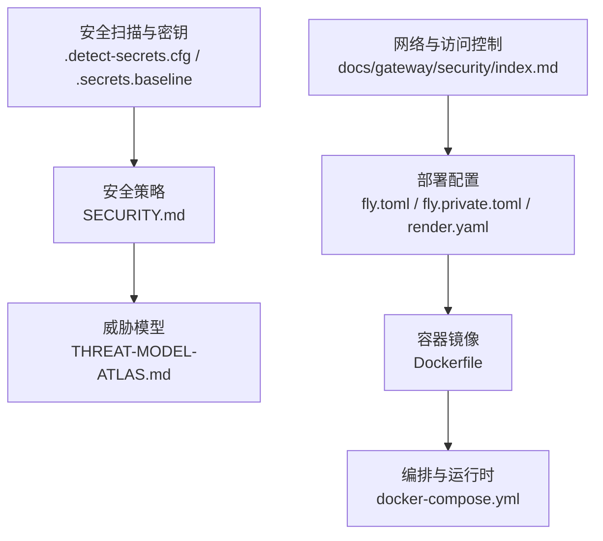
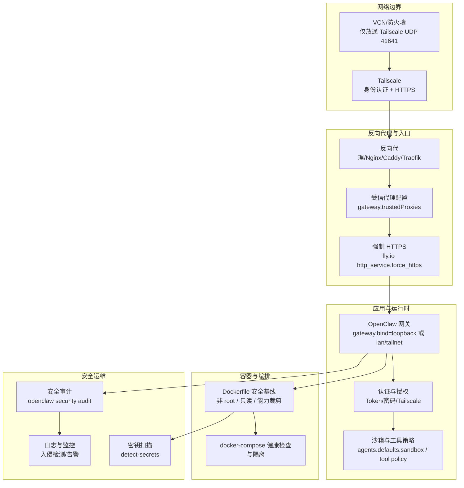
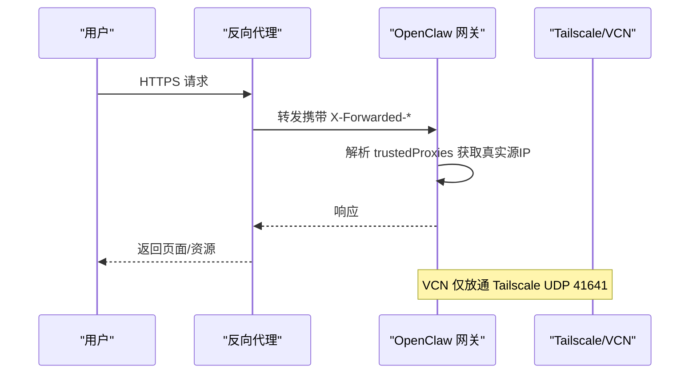
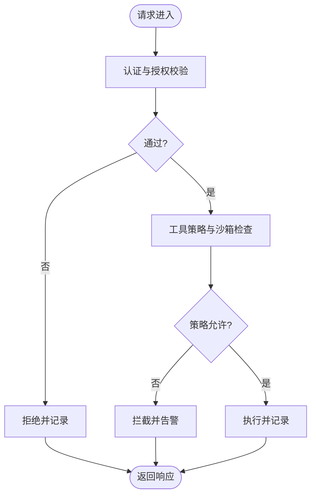
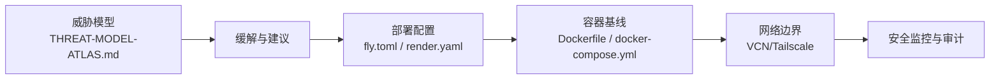

# 生产环境加固

<cite>
**本文引用的文件**
- [SECURITY.md](file://SECURITY.md)
- [docs/security/README.md](file://docs/security/README.md)
- [docs/security/CONTRIBUTING-THREAT-MODEL.md](file://docs/security/CONTRIBUTING-THREAT-MODEL.md)
- [docs/security/THREAT-MODEL-ATLAS.md](file://docs/security/THREAT-MODEL-ATLAS.md)
- [fly.toml](file://fly.toml)
- [fly.private.toml](file://fly.private.toml)
- [render.yaml](file://render.yaml)
- [Dockerfile](file://Dockerfile)
- [docker-compose.yml](file://docker-compose.yml)
- [docs/gateway/security/index.md](file://docs/gateway/security/index.md)
- [docs/platforms/oracle.md](file://docs/platforms/oracle.md)
- [.detect-secrets.cfg](file://.detect-secrets.cfg)
- [.secrets.baseline](file://.secrets.baseline)
</cite>

## 目录

1. [简介](#简介)
2. [项目结构](#项目结构)
3. [核心组件](#核心组件)
4. [架构总览](#架构总览)
5. [详细组件分析](#详细组件分析)
6. [依赖关系分析](#依赖关系分析)
7. [性能与安全权衡](#性能与安全权衡)
8. [故障排查指南](#故障排查指南)
9. [结论](#结论)
10. [附录](#附录)

## 简介

本指南面向生产环境的 OpenClaw 安全加固，覆盖系统安全配置、网络安全、应用安全、HTTPS/反向代理、负载均衡、安全监控、备份与灾备、安全更新流程等，形成从基础到高级的完整安全体系。文档同时结合官方威胁模型与部署配置，给出可落地的加固建议与最佳实践。

## 项目结构

OpenClaw 仓库包含多平台安装与部署示例、安全策略文档、威胁模型以及容器化与编排配置。生产加固需围绕以下关键点展开：

- 安全策略与报告流程：安全政策、漏洞上报、威胁模型与贡献指南
- 部署与运行时：Fly.io、Render、Docker 与 docker-compose
- 网络与访问控制：反向代理、受信代理、浏览器 SSRF 策略
- 容器安全：非 root 用户、只读文件系统、能力裁剪
- 安全扫描与密钥管理：detect-secrets 与基线

**图示来源**

- [SECURITY.md:1-288](file://SECURITY.md#L1-L288)
- [docs/security/THREAT-MODEL-ATLAS.md:1-604](file://docs/security/THREAT-MODEL-ATLAS.md#L1-L604)
- [fly.toml:1-35](file://fly.toml#L1-L35)
- [fly.private.toml:1-40](file://fly.private.toml#L1-L40)
- [render.yaml:1-22](file://render.yaml#L1-L22)
- [Dockerfile:1-231](file://Dockerfile#L1-L231)
- [docker-compose.yml:1-77](file://docker-compose.yml#L1-L77)
- [docs/gateway/security/index.md:619-1048](file://docs/gateway/security/index.md#L619-L1048)
- [.detect-secrets.cfg](file://.detect-secrets.cfg)
- [.secrets.baseline](file://.secrets.baseline)

**章节来源**

- [SECURITY.md:1-288](file://SECURITY.md#L1-L288)
- [docs/security/README.md:1-18](file://docs/security/README.md#L1-L18)
- [docs/security/CONTRIBUTING-THREAT-MODEL.md:1-91](file://docs/security/CONTRIBUTING-THREAT-MODEL.md#L1-L91)
- [docs/security/THREAT-MODEL-ATLAS.md:1-604](file://docs/security/THREAT-MODEL-ATLAS.md#L1-L604)

## 核心组件

- 安全政策与漏洞上报：定义报告流程、接受门槛、重复处理、信任模型与运营指导
- 威胁模型与攻击链：MITRE ATLAS 框架下的系统架构、威胁识别、缓解建议与风险矩阵
- 部署与运行时：Fly.io、Render 平台配置与 Dockerfile 安全基线
- 网络与访问控制：受信代理、浏览器 SSRF 策略、反向代理与 HTTPS 强制
- 容器安全：非 root 用户、只读文件系统、能力裁剪、健康检查
- 安全扫描与密钥：detect-secrets 扫描与基线管理

**章节来源**

- [SECURITY.md:1-288](file://SECURITY.md#L1-L288)
- [docs/security/THREAT-MODEL-ATLAS.md:1-604](file://docs/security/THREAT-MODEL-ATLAS.md#L1-L604)
- [fly.toml:1-35](file://fly.toml#L1-L35)
- [fly.private.toml:1-40](file://fly.private.toml#L1-L40)
- [render.yaml:1-22](file://render.yaml#L1-L22)
- [Dockerfile:1-231](file://Dockerfile#L1-L231)
- [docker-compose.yml:1-77](file://docker-compose.yml#L1-L77)
- [docs/gateway/security/index.md:619-1048](file://docs/gateway/security/index.md#L619-L1048)

## 架构总览

下图展示生产环境中的安全加固路径：从网络边界（VCN/Tailscale）、受信代理、HTTPS 强制，到容器运行时安全基线与访问控制，再到安全扫描与密钥管理。

**图示来源**

- [docs/platforms/oracle.md:159-215](file://docs/platforms/oracle.md#L159-L215)
- [fly.toml:20-26](file://fly.toml#L20-L26)
- [docs/gateway/security/index.md:619-1048](file://docs/gateway/security/index.md#L619-L1048)
- [Dockerfile:211-230](file://Dockerfile#L211-L230)
- [docker-compose.yml:38-49](file://docker-compose.yml#L38-L49)
- [SECURITY.md:207-288](file://SECURITY.md#L207-L288)
- [.detect-secrets.cfg](file://.detect-secrets.cfg)

## 详细组件分析

### 系统安全配置

- 文件权限与最小权限
  - 凭证与配置目录权限严格限制，避免组/全局可读
  - 使用非 root 用户运行容器，降低逃逸风险
- 容器安全基线
  - 只读根文件系统、丢弃多余 Linux 能力、启用 no-new-privileges
  - 健康检查与存活探针，确保服务可用性
- 运行时要求
  - Node.js 版本满足安全补丁要求，定期升级
  - Docker 运行参数遵循最小暴露原则（只读、能力裁剪）

**章节来源**

- [SECURITY.md:207-288](file://SECURITY.md#L207-L288)
- [Dockerfile:211-230](file://Dockerfile#L211-L230)
- [docker-compose.yml:54-58](file://docker-compose.yml#L54-L58)
- [SECURITY.md:246-259](file://SECURITY.md#L246-L259)

### 网络安全设置

- VCN 与 Tailscale
  - 仅放通 Tailscale UDP 41641，阻断 SSH/HTTP/HTTPS 等公网端口
  - Tailscale 提供身份认证与自动证书，无需额外 sshd 硬化
- 受信代理与反向代理
  - 正确配置 gateway.trustedProxies，确保客户端真实 IP
  - 强制 HTTPS，避免明文传输
- 浏览器 SSRF 策略
  - 默认允许私有网络，严格模式下显式白名单与例外
  - 导航阶段与最终 URL 再校验，减少重定向绕过

**图示来源**

- [docs/gateway/security/index.md:619-1048](file://docs/gateway/security/index.md#L619-L1048)
- [fly.toml:20-26](file://fly.toml#L20-L26)
- [docs/platforms/oracle.md:159-215](file://docs/platforms/oracle.md#L159-L215)

**章节来源**

- [docs/platforms/oracle.md:159-215](file://docs/platforms/oracle.md#L159-L215)
- [docs/gateway/security/index.md:619-1048](file://docs/gateway/security/index.md#L619-L1048)
- [fly.toml:20-26](file://fly.toml#L20-L26)

### 应用程序安全加固

- 认证与授权
  - 使用强令牌或密码进行网关认证，避免 loopback 外部暴露
  - 控制 UI 设备身份与令牌认证的降级开关
- 工具策略与沙箱
  - 对工具调用实施严格策略，必要时启用沙箱
  - 多代理场景下为每个代理设定独立的沙箱与工具策略
- 输入与输出保护
  - 外部内容包裹与安全提示，输出敏感动作需确认
  - SSRF 阻断与 DNS 绑定，限制内部地址访问

**图示来源**

- [docs/security/THREAT-MODEL-ATLAS.md:575-588](file://docs/security/THREAT-MODEL-ATLAS.md#L575-L588)
- [docs/gateway/security/index.md:619-1048](file://docs/gateway/security/index.md#L619-L1048)

**章节来源**

- [docs/security/THREAT-MODEL-ATLAS.md:575-588](file://docs/security/THREAT-MODEL-ATLAS.md#L575-L588)
- [docs/gateway/security/index.md:619-1048](file://docs/gateway/security/index.md#L619-L1048)

### HTTPS 配置与反向代理

- 强制 HTTPS
  - fly.io http_service.force_https= true，确保所有流量加密
- 反向代理
  - 设置 gateway.trustedProxies，正确解析客户端 IP
  - 将网关绑定至 loopback 或受控网络，配合代理实现安全暴露
- Tailscale Serve
  - 通过 Tailscale 提供自动证书与身份认证，简化公网访问

**章节来源**

- [fly.toml:20-26](file://fly.toml#L20-L26)
- [docs/gateway/security/index.md:619-1048](file://docs/gateway/security/index.md#L619-L1048)
- [docs/platforms/oracle.md:159-215](file://docs/platforms/oracle.md#L159-L215)

### 负载均衡与高可用

- 多实例与进程
  - fly.io 配置 min_machines_running=1，保持持久连接
  - Render 配置健康检查路径，确保服务可用
- 网关绑定与暴露
  - 优先 loopback + 受信代理/Tailscale，避免直接对外暴露
  - 如需 LAN 暴露，严格限制源 IP 并启用强认证

**章节来源**

- [fly.toml:25-26](file://fly.toml#L25-L26)
- [render.yaml:6](file://render.yaml#L6)
- [docs/gateway/security/index.md:619-1048](file://docs/gateway/security/index.md#L619-L1048)

### 安全监控与审计

- 安全审计
  - 使用 openclaw security audit 进行自动化检查与修复建议
- 日志与告警
  - 结合系统日志、应用日志与反向代理日志，建立入侵检测与异常告警
- 容器健康检查
  - 利用 /healthz 与 /readyz 探针，及时发现服务异常

**章节来源**

- [SECURITY.md:207-288](file://SECURITY.md#L207-L288)
- [docker-compose.yml:38-49](file://docker-compose.yml#L38-L49)
- [Dockerfile:224-229](file://Dockerfile#L224-L229)

### 数据备份与灾备

- 存储与挂载
  - 使用持久卷挂载 /data，确保状态与工作区数据持久化
- 备份策略
  - 定期备份 ~/.openclaw、workspace 与 /data 下的关键目录
  - 验证备份完整性与可恢复性，制定恢复演练计划
- 灾难恢复
  - 明确 RTO/RPO，准备多地域/多实例恢复方案

**章节来源**

- [fly.toml:32-35](file://fly.toml#L32-L35)
- [render.yaml:18-22](file://render.yaml#L18-L22)

### 安全更新流程

- 依赖与运行时
  - 定期升级 Node.js 至带安全补丁版本
  - 更新容器镜像与系统包，修补已知漏洞
- 漏洞管理
  - 通过 SECURITY.md 的报告流程提交与跟踪漏洞
  - 使用 detect-secrets 扫描与基线管理，防止密钥泄露

**章节来源**

- [SECURITY.md:246-259](file://SECURITY.md#L246-L259)
- [SECURITY.md:277-288](file://SECURITY.md#L277-L288)
- [.detect-secrets.cfg](file://.detect-secrets.cfg)
- [.secrets.baseline](file://.secrets.baseline)

## 依赖关系分析

- 威胁模型驱动安全设计：根据 ATLAS 攻击链与风险矩阵确定缓解优先级
- 部署配置决定暴露面：fly.toml/render.yaml 的 http_service.force_https 与绑定模式直接影响安全强度
- 容器基线决定逃逸成本：非 root、只读、能力裁剪显著提升容器安全
- 网络边界决定外部威胁：VCN/Tailscale 的组合提供强防御，减少主机级防火墙压力

**图示来源**

- [docs/security/THREAT-MODEL-ATLAS.md:530-557](file://docs/security/THREAT-MODEL-ATLAS.md#L530-L557)
- [fly.toml:20-26](file://fly.toml#L20-L26)
- [render.yaml:6](file://render.yaml#L6)
- [Dockerfile:211-230](file://Dockerfile#L211-L230)
- [docker-compose.yml:38-49](file://docker-compose.yml#L38-L49)
- [docs/platforms/oracle.md:159-215](file://docs/platforms/oracle.md#L159-L215)

**章节来源**

- [docs/security/THREAT-MODEL-ATLAS.md:530-557](file://docs/security/THREAT-MODEL-ATLAS.md#L530-L557)
- [fly.toml:20-26](file://fly.toml#L20-L26)
- [render.yaml:6](file://render.yaml#L6)
- [Dockerfile:211-230](file://Dockerfile#L211-L230)
- [docker-compose.yml:38-49](file://docker-compose.yml#L38-L49)
- [docs/platforms/oracle.md:159-215](file://docs/platforms/oracle.md#L159-L215)

## 性能与安全权衡

- 沙箱与工具策略可能增加执行开销，需在安全与性能间平衡
- 受信代理与 HTTPS 强制带来一定延迟，但换取更强的传输安全
- 容器只读与能力裁剪提升安全性，需评估对技能/扩展的影响

## 故障排查指南

- 常见问题定位
  - 网络：确认 VCN 规则与 Tailscale 状态，验证无公网端口暴露
  - 认证：检查令牌/密码配置与受信代理设置
  - 容器：查看健康检查失败原因，核对只读与能力配置
- 安全审计
  - 使用 openclaw security audit 快速识别高优先级问题
- 密钥扫描
  - 使用 detect-secrets 扫描并修复泄露风险

**章节来源**

- [docs/platforms/oracle.md:159-215](file://docs/platforms/oracle.md#L159-L215)
- [SECURITY.md:207-288](file://SECURITY.md#L207-L288)
- [.detect-secrets.cfg](file://.detect-secrets.cfg)

## 结论

通过将威胁模型、部署配置、容器基线与网络边界有机结合，OpenClaw 生产环境可在保证功能可用的同时实现纵深防御。建议优先落实 VCN/Tailscale 边界、HTTPS 强制、受信代理、容器安全基线与安全审计流程，并持续进行密钥扫描与漏洞修复，构建可持续演进的安全体系。

## 附录

- 关键参考路径
  - 安全政策与漏洞上报：[SECURITY.md](file://SECURITY.md)
  - 威胁模型与缓解：[docs/security/THREAT-MODEL-ATLAS.md](file://docs/security/THREAT-MODEL-ATLAS.md)
  - 部署配置（Fly.io）：[fly.toml](file://fly.toml)、[fly.private.toml](file://fly.private.toml)
  - 部署配置（Render）：[render.yaml](file://render.yaml)
  - 容器安全基线：[Dockerfile](file://Dockerfile)、[docker-compose.yml](file://docker-compose.yml)
  - 网络与访问控制：[docs/gateway/security/index.md](file://docs/gateway/security/index.md)
  - 平台安全（Oracle/Tailscale）：[docs/platforms/oracle.md](file://docs/platforms/oracle.md)
  - 安全扫描与密钥：[.detect-secrets.cfg](file://.detect-secrets.cfg)、[.secrets.baseline](file://.secrets.baseline)
