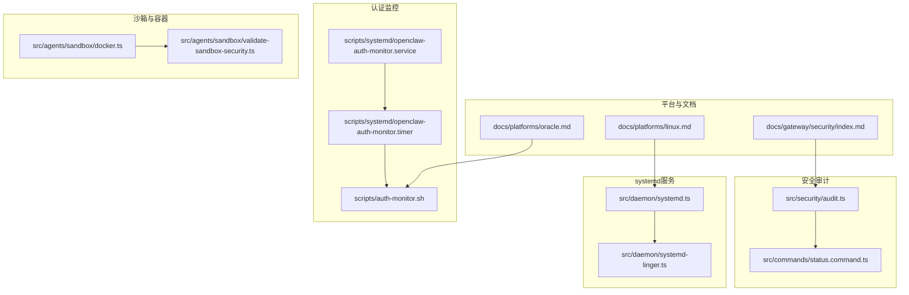
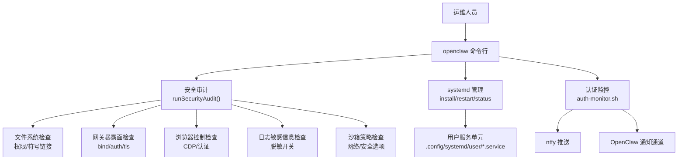
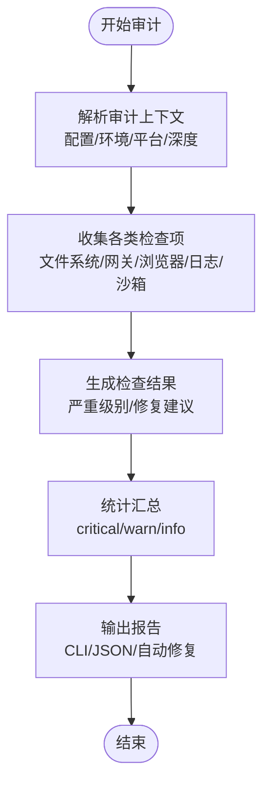
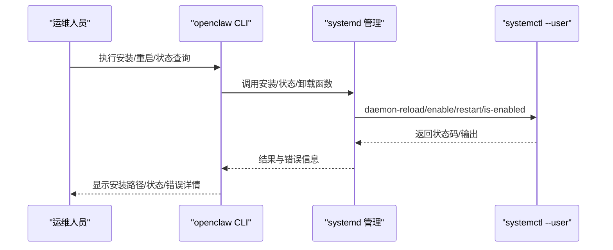
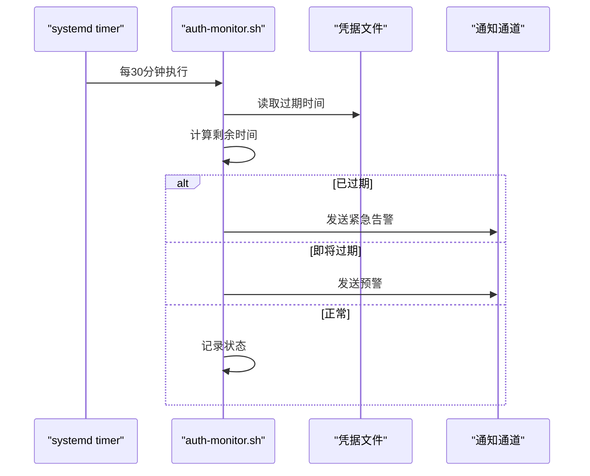
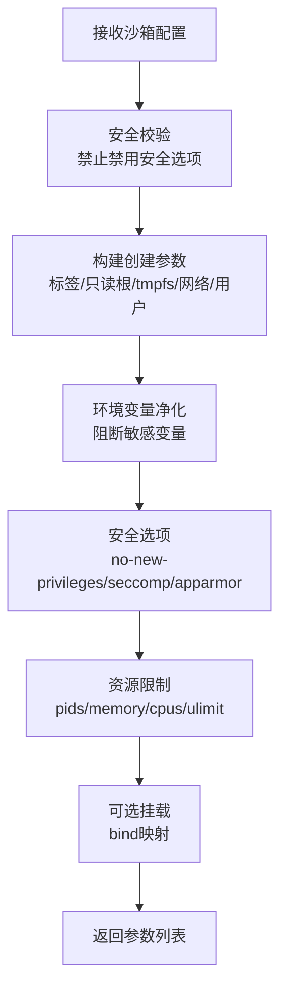
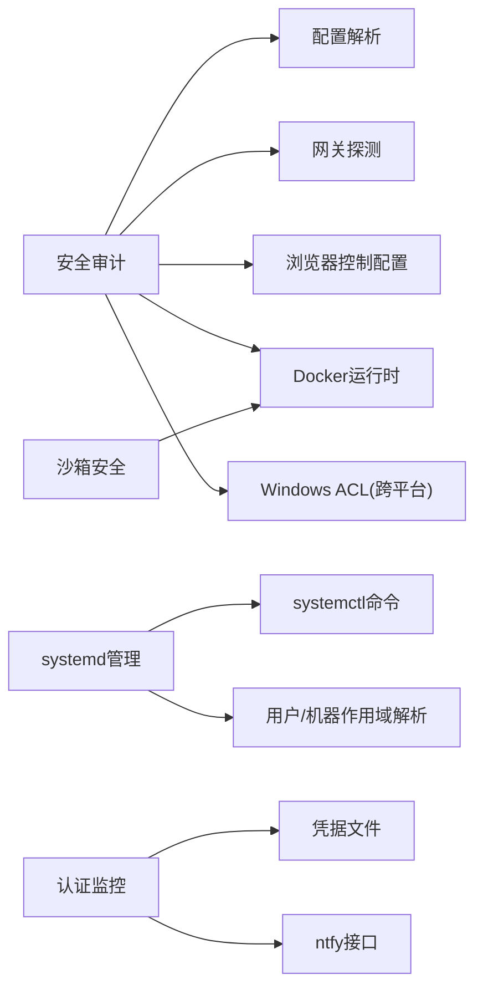

# 系统安全配置

<cite>
**本文档引用的文件**
- [scripts/systemd/openclaw-auth-monitor.service](file://scripts/systemd/openclaw-auth-monitor.service)
- [scripts/systemd/openclaw-auth-monitor.timer](file://scripts/systemd/openclaw-auth-monitor.timer)
- [scripts/auth-monitor.sh](file://scripts/auth-monitor.sh)
- [src/security/audit.ts](file://src/security/audit.ts)
- [src/daemon/systemd.ts](file://src/daemon/systemd.ts)
- [src/daemon/systemd-linger.ts](file://src/daemon/systemd-linger.ts)
- [docs/gateway/security/index.md](file://docs/gateway/security/index.md)
- [docs/platforms/linux.md](file://docs/platforms/linux.md)
- [docs/platforms/oracle.md](file://docs/platforms/oracle.md)
- [src/agents/sandbox/validate-sandbox-security.ts](file://src/agents/sandbox/validate-sandbox-security.ts)
- [src/agents/sandbox/docker.ts](file://src/agents/sandbox/docker.ts)
- [src/commands/status.command.ts](file://src/commands/status.command.ts)
</cite>

## 目录

1. [简介](#简介)
2. [项目结构](#项目结构)
3. [核心组件](#核心组件)
4. [架构总览](#架构总览)
5. [详细组件分析](#详细组件分析)
6. [依赖关系分析](#依赖关系分析)
7. [性能考虑](#性能考虑)
8. [故障排除指南](#故障排除指南)
9. [结论](#结论)
10. [附录](#附录)

## 简介

本指南面向在Linux环境下部署与运行OpenClaw系统的安全管理员与工程师，提供从基础系统安全到高级防护的完整配置体系。内容覆盖Linux系统安全基线、用户权限管理、进程安全控制、SSH访问控制、防火墙规则、系统服务加固、systemd服务配置、进程隔离与资源限制、用户账户与sudo权限、文件系统权限、安全审计与实时监控等主题。所有建议均基于仓库中现有的安全审计实现、systemd集成与平台文档。

## 项目结构

OpenClaw在Linux上的安全相关能力主要由以下模块构成：

- 安全审计：对配置、文件系统、网关暴露面、浏览器控制、日志脱敏、沙箱策略等进行检查与修复建议
- systemd服务管理：安装、启用、重启、状态查询与遗留单元清理
- 认证监控：通过systemd定时器周期性检查外部认证（如Claude Code）有效期并发出通知
- 平台文档：Linux与云平台（如Oracle Cloud）的部署与安全建议
- 沙箱与容器安全：Docker运行时参数与安全选项的构建与校验

**图表来源**

- [src/security/audit.ts:1131-1156](file://src/security/audit.ts#L1131-L1156)
- [src/commands/status.command.ts:473-508](file://src/commands/status.command.ts#L473-L508)
- [src/daemon/systemd.ts:451-521](file://src/daemon/systemd.ts#L451-L521)
- [src/daemon/systemd-linger.ts:46-73](file://src/daemon/systemd-linger.ts#L46-L73)
- [scripts/systemd/openclaw-auth-monitor.service:1-15](file://scripts/systemd/openclaw-auth-monitor.service#L1-L15)
- [scripts/systemd/openclaw-auth-monitor.timer:1-11](file://scripts/systemd/openclaw-auth-monitor.timer#L1-L11)
- [scripts/auth-monitor.sh:1-90](file://scripts/auth-monitor.sh#L1-L90)
- [docs/gateway/security/index.md:1-120](file://docs/gateway/security/index.md#L1-L120)
- [docs/platforms/linux.md:65-95](file://docs/platforms/linux.md#L65-L95)
- [docs/platforms/oracle.md:183-215](file://docs/platforms/oracle.md#L183-L215)
- [src/agents/sandbox/docker.ts:317-427](file://src/agents/sandbox/docker.ts#L317-L427)
- [src/agents/sandbox/validate-sandbox-security.ts:308-343](file://src/agents/sandbox/validate-sandbox-security.ts#L308-L343)

**章节来源**

- [src/security/audit.ts:1131-1156](file://src/security/audit.ts#L1131-L1156)
- [src/daemon/systemd.ts:451-521](file://src/daemon/systemd.ts#L451-L521)
- [scripts/systemd/openclaw-auth-monitor.service:1-15](file://scripts/systemd/openclaw-auth-monitor.service#L1-L15)
- [scripts/systemd/openclaw-auth-monitor.timer:1-11](file://scripts/systemd/openclaw-auth-monitor.timer#L1-L11)
- [scripts/auth-monitor.sh:1-90](file://scripts/auth-monitor.sh#L1-L90)
- [docs/gateway/security/index.md:1-120](file://docs/gateway/security/index.md#L1-L120)
- [docs/platforms/linux.md:65-95](file://docs/platforms/linux.md#L65-L95)
- [docs/platforms/oracle.md:183-215](file://docs/platforms/oracle.md#L183-L215)
- [src/agents/sandbox/docker.ts:317-427](file://src/agents/sandbox/docker.ts#L317-L427)
- [src/agents/sandbox/validate-sandbox-security.ts:308-343](file://src/agents/sandbox/validate-sandbox-security.ts#L308-L343)

## 核心组件

- 安全审计引擎：扫描配置文件权限、网关绑定与认证、浏览器控制、日志敏感信息、插件与工具策略、模型选择等，并输出严重级别与修复建议
- systemd服务管理：安装/卸载用户/系统服务、启用持久化、查询运行状态、迁移遗留单元
- 认证监控：定期检查外部认证凭据有效期，支持通过OpenClaw或ntfy推送告警
- 沙箱与容器安全：构建Docker创建参数，强制安全选项（只读根、cap-drop、no-new-privileges、seccomp/apparmor）、资源限制与ulimit
- 平台安全文档：Linux与云平台部署建议、防火墙与端口发布策略、mDNS信息泄露风险

**章节来源**

- [src/security/audit.ts:87-132](file://src/security/audit.ts#L87-L132)
- [src/daemon/systemd.ts:451-521](file://src/daemon/systemd.ts#L451-L521)
- [scripts/auth-monitor.sh:1-90](file://scripts/auth-monitor.sh#L1-L90)
- [src/agents/sandbox/docker.ts:317-427](file://src/agents/sandbox/docker.ts#L317-L427)
- [docs/gateway/security/index.md:601-800](file://docs/gateway/security/index.md#L601-L800)

## 架构总览

OpenClaw在Linux上的安全配置围绕“最小暴露面 + 强认证 + 进程隔离 + 可审计”的原则设计。系统通过systemd用户服务托管网关进程，安全审计作为CLI命令执行，认证监控以systemd定时器驱动，沙箱在需要时为工具执行提供强隔离。

**图表来源**

- [src/commands/status.command.ts:473-508](file://src/commands/status.command.ts#L473-L508)
- [src/daemon/systemd.ts:451-521](file://src/daemon/systemd.ts#L451-L521)
- [src/security/audit.ts:1131-1156](file://src/security/audit.ts#L1131-L1156)
- [scripts/auth-monitor.sh:32-66](file://scripts/auth-monitor.sh#L32-L66)

**章节来源**

- [src/commands/status.command.ts:473-508](file://src/commands/status.command.ts#L473-L508)
- [src/daemon/systemd.ts:451-521](file://src/daemon/systemd.ts#L451-L521)
- [src/security/audit.ts:1131-1156](file://src/security/audit.ts#L1131-L1156)
- [scripts/auth-monitor.sh:32-66](file://scripts/auth-monitor.sh#L32-L66)

## 详细组件分析

### 组件A：安全审计与修复建议

- 功能概述：扫描配置文件权限、网关绑定与认证、浏览器控制、日志敏感信息、插件与工具策略、模型选择等，输出严重级别与自动修复建议
- 关键流程：
  - 解析审计上下文（配置、环境、平台、深度扫描）
  - 收集攻击面摘要、同步目录、网关配置、浏览器控制、日志、提升权限、执行运行时、钩子加固、HTTP无认证、沙箱Docker无效、危险配置、节点命令模式、最小化配置覆盖、配置中的密钥、模型卫生、小模型风险、暴露矩阵、疑似多用户设置等
  - 输出汇总与前N条重要发现，支持JSON输出与自动修复
- 复杂度与性能：深度扫描包含对外部网关的探测，受超时参数影响；文件系统检查按路径逐项评估，复杂度与路径数量线性相关

**图表来源**

- [src/security/audit.ts:1131-1156](file://src/security/audit.ts#L1131-L1156)
- [src/commands/status.command.ts:473-508](file://src/commands/status.command.ts#L473-L508)

**章节来源**

- [src/security/audit.ts:87-132](file://src/security/audit.ts#L87-L132)
- [src/security/audit.ts:208-337](file://src/security/audit.ts#L208-L337)
- [src/security/audit.ts:339-687](file://src/security/audit.ts#L339-L687)
- [src/security/audit.ts:1131-1156](file://src/security/audit.ts#L1131-L1156)
- [src/commands/status.command.ts:473-508](file://src/commands/status.command.ts#L473-L508)

### 组件B：systemd服务管理与持久化

- 功能概述：安装/卸载用户/系统服务、启用持久化、查询运行状态、迁移遗留单元
- 关键流程：
  - 单元文件解析与渲染（ExecStart、WorkingDirectory、Environment、EnvironmentFile）
  - 读取服务运行时状态（ActiveState/SubState/MainPID/ExecMainStatus/ExecMainCode）
  - 安装服务：备份旧单元、写入新单元、daemon-reload、enable、restart
  - 卸载服务：disable --now、删除单元文件
  - 查找并卸载遗留单元
  - 用户linger启用（允许用户会话长期存在）

**图表来源**

- [src/daemon/systemd.ts:451-521](file://src/daemon/systemd.ts#L451-L521)
- [src/daemon/systemd.ts:582-604](file://src/daemon/systemd.ts#L582-L604)
- [src/daemon/systemd.ts:662-684](file://src/daemon/systemd.ts#L662-L684)
- [src/daemon/systemd-linger.ts:46-73](file://src/daemon/systemd-linger.ts#L46-L73)

**章节来源**

- [src/daemon/systemd.ts:61-122](file://src/daemon/systemd.ts#L61-L122)
- [src/daemon/systemd.ts:451-521](file://src/daemon/systemd.ts#L451-L521)
- [src/daemon/systemd.ts:662-684](file://src/daemon/systemd.ts#L662-L684)
- [src/daemon/systemd-linger.ts:46-73](file://src/daemon/systemd-linger.ts#L46-L73)

### 组件C：认证监控与实时告警

- 功能概述：通过systemd定时器周期性检查外部认证（如Claude Code）有效期，支持通过OpenClaw或ntfy推送告警
- 关键流程：
  - 定时器每30分钟触发一次
  - 读取凭据文件，计算剩余时间
  - 超时前按阈值告警，过期则紧急告警
  - 防抖：限制每小时最多一次通知
  - 通知渠道：OpenClaw消息通道、ntfy主题

**图表来源**

- [scripts/systemd/openclaw-auth-monitor.timer:1-11](file://scripts/systemd/openclaw-auth-monitor.timer#L1-L11)
- [scripts/systemd/openclaw-auth-monitor.service:1-15](file://scripts/systemd/openclaw-auth-monitor.service#L1-L15)
- [scripts/auth-monitor.sh:68-89](file://scripts/auth-monitor.sh#L68-L89)

**章节来源**

- [scripts/systemd/openclaw-auth-monitor.timer:1-11](file://scripts/systemd/openclaw-auth-monitor.timer#L1-L11)
- [scripts/systemd/openclaw-auth-monitor.service:1-15](file://scripts/systemd/openclaw-auth-monitor.service#L1-L15)
- [scripts/auth-monitor.sh:1-90](file://scripts/auth-monitor.sh#L1-L90)

### 组件D：沙箱与容器安全

- 功能概述：构建Docker创建参数，强制安全选项（只读根、cap-drop、no-new-privileges、seccomp/apparmor），设置资源限制与ulimit
- 关键流程：
  - 参数校验：阻止禁用seccomp/apparmor的配置
  - 构建创建参数：标签、只读根、tmpfs、网络、用户、环境变量净化、capabilities、安全选项、DNS、主机名、PID/内存/CPU限制、ulimit、bind挂载
  - 默认安全策略：默认只读根、禁用新特权、drop ALL capabilities、限制进程数与内存、CPU配额、ulimit

**图表来源**

- [src/agents/sandbox/validate-sandbox-security.ts:308-343](file://src/agents/sandbox/validate-sandbox-security.ts#L308-L343)
- [src/agents/sandbox/docker.ts:317-427](file://src/agents/sandbox/docker.ts#L317-L427)

**章节来源**

- [src/agents/sandbox/validate-sandbox-security.ts:308-343](file://src/agents/sandbox/validate-sandbox-security.ts#L308-L343)
- [src/agents/sandbox/docker.ts:317-427](file://src/agents/sandbox/docker.ts#L317-L427)

### 组件E：平台安全文档与最佳实践

- Linux平台：推荐使用systemd用户服务托管网关，提供最小单元示例与启用步骤
- 云平台（Oracle Cloud）：强调VCN层面的防火墙与fail2ban作用，建议保持state/config权限严格，定期更新系统，监控Tailscale设备
- 网络暴露与防火墙：建议优先Tailscale Serve，LAN绑定需严格防火墙与白名单；Docker发布端口需配合UFW的DOCKER-USER链策略

**章节来源**

- [docs/platforms/linux.md:65-95](file://docs/platforms/linux.md#L65-L95)
- [docs/platforms/oracle.md:183-215](file://docs/platforms/oracle.md#L183-L215)
- [docs/gateway/security/index.md:619-734](file://docs/gateway/security/index.md#L619-L734)

## 依赖关系分析

- 安全审计依赖配置解析、网关探测、浏览器控制配置、Docker运行时、Windows ACL（跨平台兼容）等模块
- systemd管理依赖systemctl命令与用户/机器作用域解析，具备降级与错误处理逻辑
- 认证监控脚本依赖凭据文件格式与ntfy接口，具备防抖与幂等通知机制
- 沙箱安全依赖Docker运行时参数构建与安全选项校验

**图表来源**

- [src/security/audit.ts:1-54](file://src/security/audit.ts#L1-L54)
- [src/daemon/systemd.ts:254-258](file://src/daemon/systemd.ts#L254-L258)
- [scripts/auth-monitor.sh:16-22](file://scripts/auth-monitor.sh#L16-L22)
- [src/agents/sandbox/docker.ts:317-380](file://src/agents/sandbox/docker.ts#L317-L380)

**章节来源**

- [src/security/audit.ts:1-54](file://src/security/audit.ts#L1-L54)
- [src/daemon/systemd.ts:254-258](file://src/daemon/systemd.ts#L254-L258)
- [scripts/auth-monitor.sh:16-22](file://scripts/auth-monitor.sh#L16-L22)
- [src/agents/sandbox/docker.ts:317-380](file://src/agents/sandbox/docker.ts#L317-L380)

## 性能考虑

- 安全审计的深度扫描可能对远程网关进行探测，建议合理设置超时参数，避免长时间阻塞
- 文件系统权限检查按路径逐一评估，路径数量较多时建议分批执行或缓存结果
- systemd操作涉及磁盘IO与systemctl调用，批量安装/卸载时建议合并操作并减少重复reload
- 沙箱容器创建参数构建涉及多次字符串拼接与对象遍历，建议在高频场景下复用已构建参数

[本节为通用指导，无需特定文件引用]

## 故障排除指南

- systemd不可用或用户作用域不可用：检查systemctl是否存在、DBUS_SESSION_BUS_ADDRESS与XDG_RUNTIME_DIR是否正确设置
- 服务未启用或状态异常：使用is-enabled与show查询具体状态，结合ActiveState/SubState/MainPID定位问题
- 认证监控不生效：确认timer已启用且服务指向正确的脚本路径，检查环境变量（WARN_HOURS/NOTIFY_PHONE/NOTIFY_NTFY）与脚本权限
- 安全审计无输出或报错：确认CLI可用性与配置路径解析，必要时使用--json输出调试信息

**章节来源**

- [src/daemon/systemd.ts:267-321](file://src/daemon/systemd.ts#L267-L321)
- [src/daemon/systemd.ts:582-604](file://src/daemon/systemd.ts#L582-L604)
- [scripts/systemd/openclaw-auth-monitor.timer:1-11](file://scripts/systemd/openclaw-auth-monitor.timer#L1-L11)
- [scripts/systemd/openclaw-auth-monitor.service:7-11](file://scripts/systemd/openclaw-auth-monitor.service#L7-L11)
- [src/commands/status.command.ts:473-508](file://src/commands/status.command.ts#L473-L508)

## 结论

OpenClaw在Linux上的安全配置以“最小暴露面 + 强认证 + 进程隔离 + 可审计”为核心，结合systemd服务管理、安全审计与认证监控形成闭环。通过严格的文件系统权限、网关绑定与认证策略、浏览器控制与日志脱敏、沙箱与容器安全选项以及平台化的防火墙与端口发布策略，可有效降低攻击面并提升整体安全性。建议将安全审计纳入日常运维流程，定期执行并落实修复建议，同时结合认证监控与平台文档的最佳实践，持续加固系统安全。

[本节为总结性内容，无需特定文件引用]

## 附录

- 基础系统安全基线
  - 文件系统权限：state目录与配置文件权限严格限制，避免组/世界可读写
  - 网络暴露：优先loopback或Tailscale Serve，LAN绑定需严格防火墙与白名单
  - mDNS：建议使用minimal或关闭，避免泄露cliPath与sshPort
- 用户权限管理
  - 使用systemd用户服务托管网关，避免root权限运行
  - 严格控制state与配置目录权限，仅限当前用户读写
- 进程安全控制
  - 启用沙箱与容器安全选项（只读根、cap-drop、no-new-privileges、seccomp/apparmor）
  - 设置资源限制（pids/memory/cpus/ulimit），防止资源滥用
- SSH访问控制与防火墙
  - 在云平台（如Oracle Cloud）利用VCN防火墙与Tailscale，减少直接SSH暴露
  - Docker发布端口需配合UFW的DOCKER-USER链策略
- 系统服务加固与systemd配置
  - 使用最小单元模板，启用持久化与自动重启
  - 定期迁移遗留单元，保持服务整洁
- 安全审计与实时监控
  - 定期执行安全审计，关注高危发现并及时修复
  - 配置认证监控，提前预警外部认证过期风险

**章节来源**

- [docs/gateway/security/index.md:601-800](file://docs/gateway/security/index.md#L601-L800)
- [docs/platforms/oracle.md:183-215](file://docs/platforms/oracle.md#L183-L215)
- [docs/platforms/linux.md:65-95](file://docs/platforms/linux.md#L65-L95)
- [src/agents/sandbox/docker.ts:317-427](file://src/agents/sandbox/docker.ts#L317-L427)
- [scripts/auth-monitor.sh:1-90](file://scripts/auth-monitor.sh#L1-L90)
