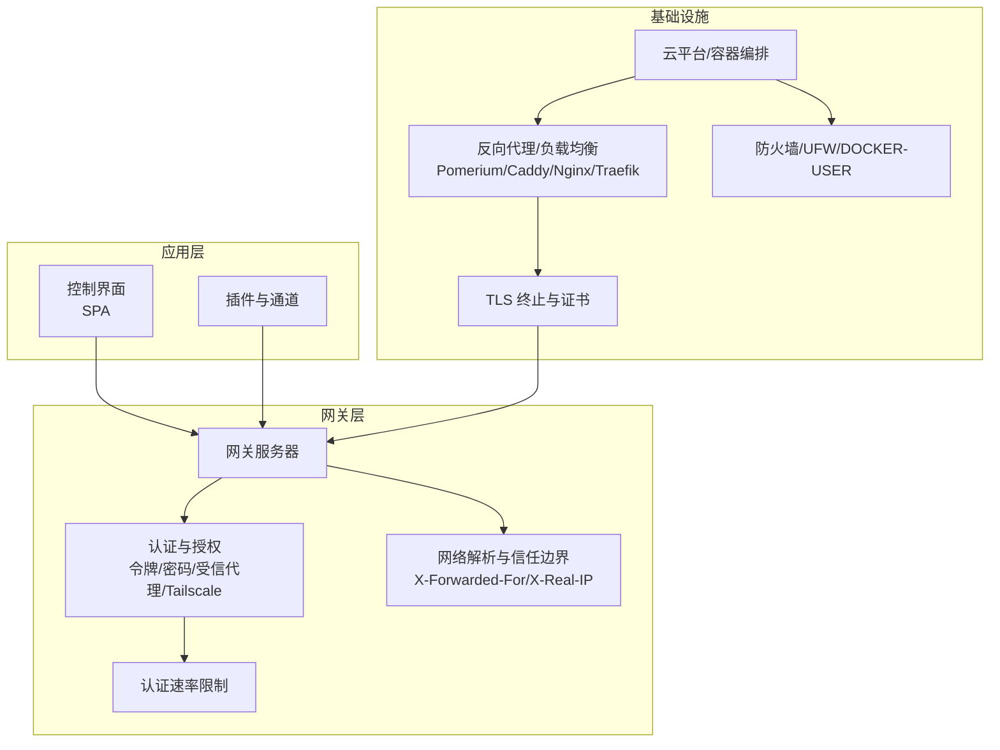
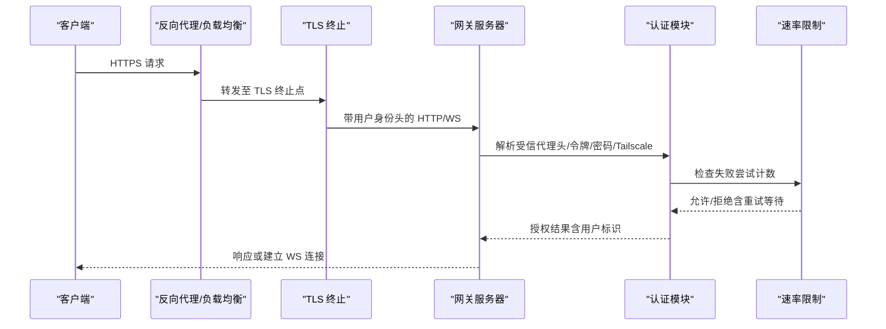
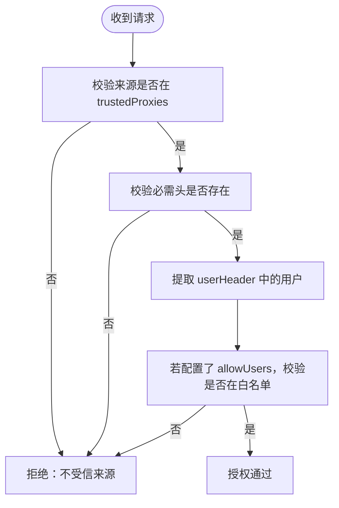
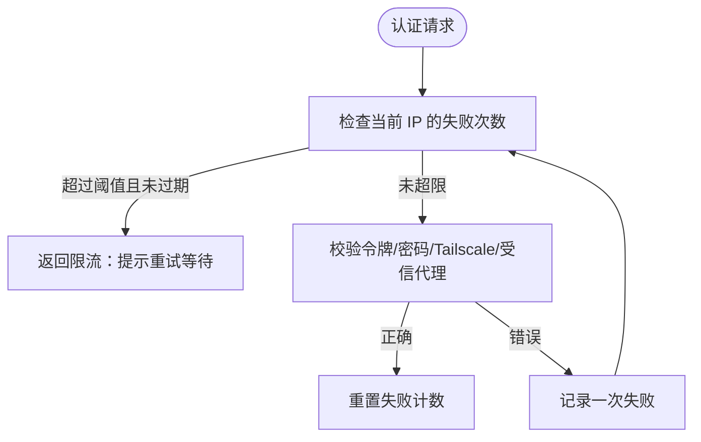
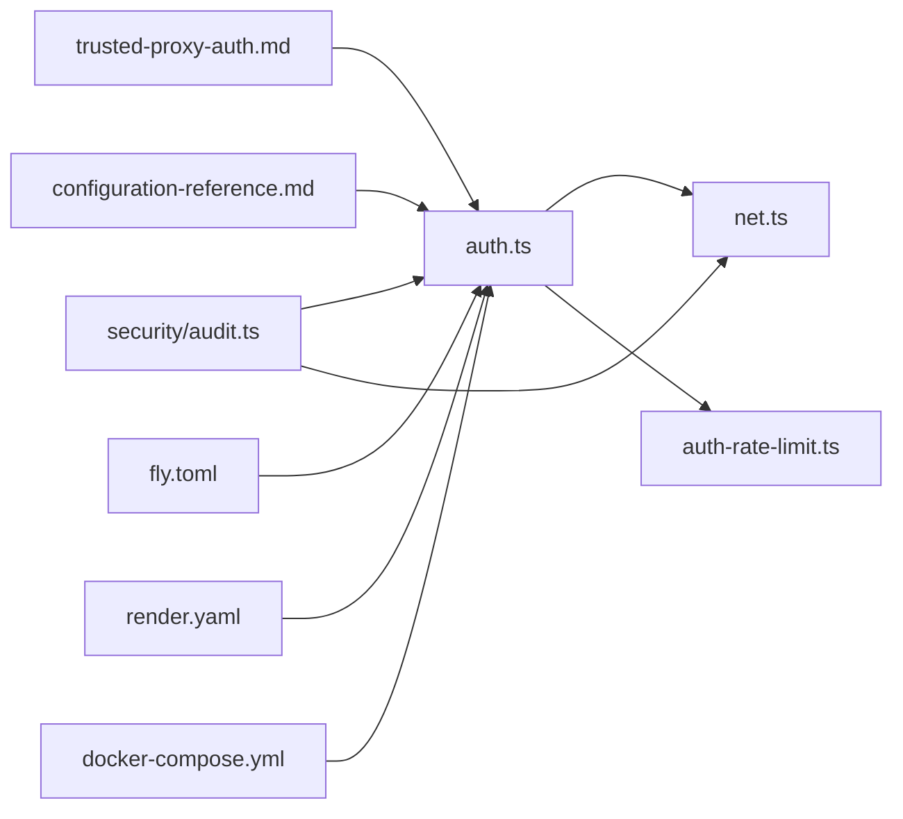

# 网络安全配置

<cite>
**本文档引用的文件**
- [src/security/audit.ts](file://src/security/audit.ts)
- [src/gateway/auth.ts](file://src/gateway/auth.ts)
- [src/gateway/auth-rate-limit.ts](file://src/gateway/auth-rate-limit.ts)
- [src/gateway/net.ts](file://src/gateway/net.ts)
- [docs/gateway/trusted-proxy-auth.md](file://docs/gateway/trusted-proxy-auth.md)
- [docs/gateway/configuration-reference.md](file://docs/gateway/configuration-reference.md)
- [docs/network.md](file://docs/network.md)
- [fly.toml](file://fly.toml)
- [render.yaml](file://render.yaml)
- [docker-compose.yml](file://docker-compose.yml)
- [apps/android/app/src/main/java/ai/openclaw/app/gateway/GatewayTls.kt](file://apps/android/app/gateway/GatewayTls.kt)
- [docs/gateway/security/index.md](file://docs/gateway/security/index.md)
</cite>

## 目录

1. [简介](#简介)
2. [项目结构](#项目结构)
3. [核心组件](#核心组件)
4. [架构总览](#架构总览)
5. [详细组件分析](#详细组件分析)
6. [依赖关系分析](#依赖关系分析)
7. [性能考量](#性能考量)
8. [故障排除指南](#故障排除指南)
9. [结论](#结论)

## 简介

本指南面向在生产环境中部署与运维 OpenClaw 的工程师，系统性阐述从网络边界到内部通信的完整安全防护体系，覆盖以下主题：

- 网络访问控制：绑定模式、信任代理、尾网访问、本地直连判定
- TLS 证书配置与加密通信：客户端指纹校验、主机名校验、证书信任链
- 反向代理配置、负载均衡与 SSL/TLS 终止：代理头、用户身份传递、HSTS 策略
- 防火墙规则、端口管理与网络隔离：Docker 发布链路、UFW 规则、mDNS 信息泄露
- DDoS 防护、速率限制与连接数控制：认证速率限制、滑动窗口计数、锁定期策略
- 网络安全监控、流量分析与异常检测：安全审计报告、错误观测与脱敏

## 项目结构

OpenClaw 将“网络与安全”能力集中在网关服务与安全审计模块中，并通过配置参考文档提供可操作的键值语义。部署侧通过容器编排与云平台配置文件体现对外暴露面与健康检查。

图示来源

- [src/gateway/auth.ts](file://src/gateway/auth.ts)
- [src/gateway/auth-rate-limit.ts](file://src/gateway/auth-rate-limit.ts)
- [src/gateway/net.ts](file://src/gateway/net.ts)
- [docs/gateway/trusted-proxy-auth.md](file://docs/gateway/trusted-proxy-auth.md)
- [fly.toml](file://fly.toml)
- [render.yaml](file://render.yaml)
- [docker-compose.yml](file://docker-compose.yml)

章节来源

- [docs/network.md](file://docs/network.md)
- [docs/gateway/configuration-reference.md](file://docs/gateway/configuration-reference.md)

## 核心组件

- 认证与授权：支持共享令牌、密码、受信代理与 Tailscale 身份认证；对受信代理模式进行严格校验（代理 IP 白名单、必需头、用户白名单）
- 认证速率限制：基于内存的滑动窗口计数器，按作用域（共享凭据/设备令牌等）独立统计，支持锁定期与周期清理
- 网络解析与信任边界：解析 X-Forwarded-For、X-Real-IP，结合受信代理列表判定真实客户端 IP，避免伪造
- 反向代理与 TLS：推荐由代理统一终止 TLS 并注入用户身份头；HSTS 建议在代理侧集中配置
- 部署与暴露：Fly.io Render 容器化部署示例；Docker Compose 明确健康检查与端口映射

章节来源

- [src/gateway/auth.ts](file://src/gateway/auth.ts)
- [src/gateway/auth-rate-limit.ts](file://src/gateway/auth-rate-limit.ts)
- [src/gateway/net.ts](file://src/gateway/net.ts)
- [docs/gateway/trusted-proxy-auth.md](file://docs/gateway/trusted-proxy-auth.md)
- [fly.toml](file://fly.toml)
- [render.yaml](file://render.yaml)
- [docker-compose.yml](file://docker-compose.yml)

## 架构总览

下图展示从客户端到网关、再到代理与 TLS 终止的关键交互路径，以及认证与速率限制的处理流程。

图示来源

- [src/gateway/auth.ts](file://src/gateway/auth.ts)
- [src/gateway/auth-rate-limit.ts](file://src/gateway/auth-rate-limit.ts)
- [docs/gateway/trusted-proxy-auth.md](file://docs/gateway/trusted-proxy-auth.md)

## 详细组件分析

### 网络访问控制与绑定模式

- 绑定模式
  - loopback：仅本地回环，适合单机或受信代理后端
  - lan：监听所有接口，需配合防火墙与强认证
  - tailnet：优先使用尾网地址，否则回退
  - auto/custom：自动选择或指定地址
- 本地直连判定：结合 Host 头与受信代理判定是否为本地请求，避免伪造
- mDNS/Bonjour：全量模式可能泄露 CLI 路径与 SSH 端口等信息，建议最小化或关闭

章节来源

- [src/gateway/net.ts](file://src/gateway/net.ts)
- [docs/gateway/security/index.md](file://docs/gateway/security/index.md)

### 受信代理认证与反向代理配置

- 工作原理：代理负责认证，向网关注入用户身份头；网关仅验证代理 IP 与必要头
- 关键配置
  - gateway.trustedProxies：仅允许的代理 IP 列表
  - gateway.auth.mode：必须为 trusted-proxy
  - gateway.auth.trustedProxy.userHeader：承载已认证用户的身份头
  - gateway.auth.trustedProxy.requiredHeaders：额外必需头（如 JWT）
  - gateway.auth.trustedProxy.allowUsers：用户白名单
- TLS 终止与 HSTS：建议在代理侧统一终止 TLS 并设置 HSTS；网关可保持 loopback HTTP
- 代理示例：Pomerium、Caddy、Nginx + oauth2-proxy、Traefik + Forward Auth

图示来源

- [src/gateway/auth.ts](file://src/gateway/auth.ts)
- [docs/gateway/trusted-proxy-auth.md](file://docs/gateway/trusted-proxy-auth.md)

章节来源

- [src/gateway/auth.ts](file://src/gateway/auth.ts)
- [docs/gateway/trusted-proxy-auth.md](file://docs/gateway/trusted-proxy-auth.md)

### TLS 证书配置与加密通信

- Android 客户端实现：支持期望指纹匹配、临时信任（TOFU）与默认信任管理器回退
- 核心要点
  - 若提供期望指纹，必须与服务端证书首张证书 SHA-256 匹配
  - 允许 TOFU 时，首次连接会存储指纹以备后续校验
  - 未提供期望指纹时，采用系统默认信任链校验
- 建议：在代理层统一终止 TLS，减少网关直接持证的复杂度

章节来源

- [apps/android/app/src/main/java/ai/openclaw/app/gateway/GatewayTls.kt](file://apps/android/app/src/main/java/ai/openclaw/app/gateway/GatewayTls.kt)

### 认证速率限制与 DDoS 防护

- 机制：滑动窗口计数 + 锁定期，按作用域（共享凭据/设备令牌等）独立统计
- 默认参数：窗口 1 分钟、最大失败次数 10、锁定 5 分钟；回环地址默认豁免
- 使用场景：防止暴力破解、降低认证面攻击风险
- 与绑定模式联动：非 loopback 绑定且未启用受信代理时，建议配置速率限制

图示来源

- [src/gateway/auth-rate-limit.ts](file://src/gateway/auth-rate-limit.ts)
- [src/gateway/auth.ts](file://src/gateway/auth.ts)
- [src/security/audit.ts](file://src/security/audit.ts)

章节来源

- [src/gateway/auth-rate-limit.ts](file://src/gateway/auth-rate-limit.ts)
- [src/gateway/auth.ts](file://src/gateway/auth.ts)
- [src/security/audit.ts](file://src/security/audit.ts)

### 防火墙规则、端口管理与网络隔离

- Docker 发布链路：Published 端口经由 DOCKER-USER 链路转发，需在该链路施加严格的入站策略
- UFW 示例：保留回环与私有网段放行，其他新建连接一律丢弃，仅开放必要端口
- 端口与健康检查：容器内服务端口与外部映射、健康检查脚本
- mDNS 信息泄露：全量模式可能暴露 CLI 路径与 SSH 端口，建议最小化或关闭

章节来源

- [docs/gateway/security/index.md](file://docs/gateway/security/index.md)
- [docker-compose.yml](file://docker-compose.yml)
- [fly.toml](file://fly.toml)
- [render.yaml](file://render.yaml)

### 负载均衡与 SSL/TLS 终止

- 单实例与多实例：Fly.io 与 Render 提供进程/机器数量配置，保证持久连接
- 健康检查：容器内健康端点与外部环境一致，便于 LB 与平台健康探测
- TLS 终止：建议在代理层统一终止，HSTS 在代理侧集中配置，网关可保持 loopback HTTP

章节来源

- [fly.toml](file://fly.toml)
- [render.yaml](file://render.yaml)
- [docs/gateway/trusted-proxy-auth.md](file://docs/gateway/trusted-proxy-auth.md)

### 网络安全监控、流量分析与异常检测

- 安全审计：自动扫描绑定模式、受信代理配置、速率限制、Origin 策略、Tailscale 模式等，输出严重级别与修复建议
- 错误观测与脱敏：对嵌入式观察字段进行稳定化指纹与敏感信息脱敏，支持动态重载脱敏模式
- 建议实践：将审计作为 CI/CD 必检步骤；对异常指纹与错误类型建立告警

章节来源

- [src/security/audit.ts](file://src/security/audit.ts)
- [src/agents/pi-embedded-error-observation.ts](file://src/agents/pi-embedded-error-observation.ts)

## 依赖关系分析

图示来源

- [src/gateway/auth.ts](file://src/gateway/auth.ts)
- [src/gateway/net.ts](file://src/gateway/net.ts)
- [src/gateway/auth-rate-limit.ts](file://src/gateway/auth-rate-limit.ts)
- [src/security/audit.ts](file://src/security/audit.ts)
- [docs/gateway/trusted-proxy-auth.md](file://docs/gateway/trusted-proxy-auth.md)
- [docs/gateway/configuration-reference.md](file://docs/gateway/configuration-reference.md)
- [fly.toml](file://fly.toml)
- [render.yaml](file://render.yaml)
- [docker-compose.yml](file://docker-compose.yml)

章节来源

- [src/gateway/auth.ts](file://src/gateway/auth.ts)
- [src/gateway/net.ts](file://src/gateway/net.ts)
- [src/gateway/auth-rate-limit.ts](file://src/gateway/auth-rate-limit.ts)
- [src/security/audit.ts](file://src/security/audit.ts)
- [docs/gateway/trusted-proxy-auth.md](file://docs/gateway/trusted-proxy-auth.md)
- [docs/gateway/configuration-reference.md](file://docs/gateway/configuration-reference.md)
- [fly.toml](file://fly.toml)
- [render.yaml](file://render.yaml)
- [docker-compose.yml](file://docker-compose.yml)

## 性能考量

- 速率限制的内存占用：基于 Map 存储，具备周期清理定时器，避免无限增长
- 本地直连豁免：回环地址不计入限流，保障本地 CLI 体验
- 绑定模式选择：非 loopback 绑定会扩大攻击面，需配合强认证与防火墙
- 代理层集中 TLS：减少网关 CPU 加密开销，提升吞吐

## 故障排除指南

- 受信代理常见问题
  - 不受信来源：确认代理 IP 是否在 trustedProxies 列表
  - 缺少用户头：确认代理是否正确注入 userHeader
  - 用户不在白名单：调整 allowUsers 或移除白名单
  - WebSocket 仍被拒绝：确认代理是否在升级请求中传递身份头
- 速率限制
  - 被锁定：等待锁定期结束或重置失败计数
  - 回环豁免：确认客户端是否为 127.0.0.1/::1
- Docker 发布链路
  - 端口未生效：检查 DOCKER-USER 链路规则与 UFW 状态
  - 健康检查失败：核对容器内健康端点与外部访问路径

章节来源

- [docs/gateway/trusted-proxy-auth.md](file://docs/gateway/trusted-proxy-auth.md)
- [src/gateway/auth-rate-limit.ts](file://src/gateway/auth-rate-limit.ts)
- [docs/gateway/security/index.md](file://docs/gateway/security/index.md)

## 结论

通过“绑定模式 + 受信代理 + 速率限制 + 代理 TLS 终止 + 防火墙”的组合策略，OpenClaw 可在不同部署形态（单机、容器、云平台）下构建稳健的网络安全边界。建议：

- 优先使用受信代理认证并集中 TLS 终止
- 对非 loopback 绑定强制启用速率限制与严格防火墙
- 将安全审计纳入日常运维与 CI/CD 流程
- 对 mDNS 等信息泄露面进行最小化配置
