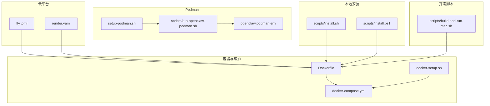
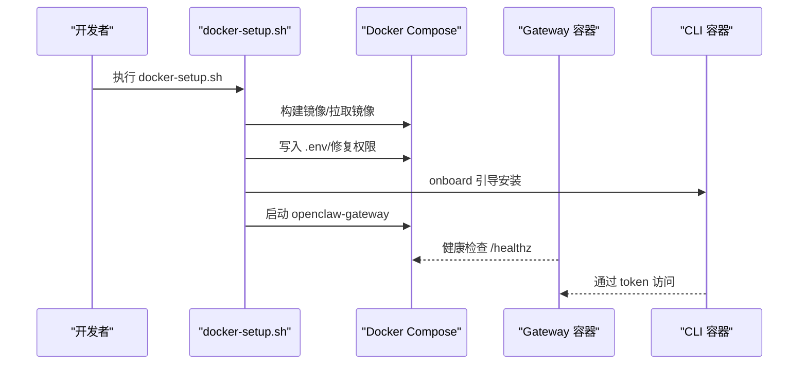
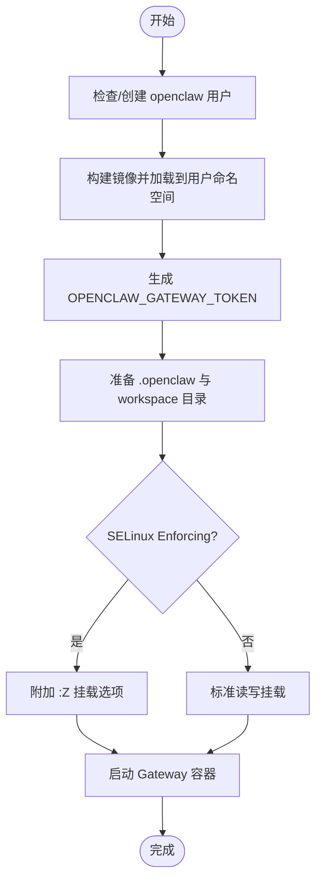
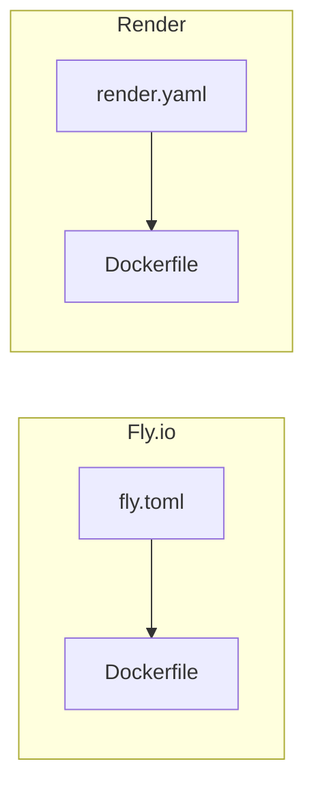
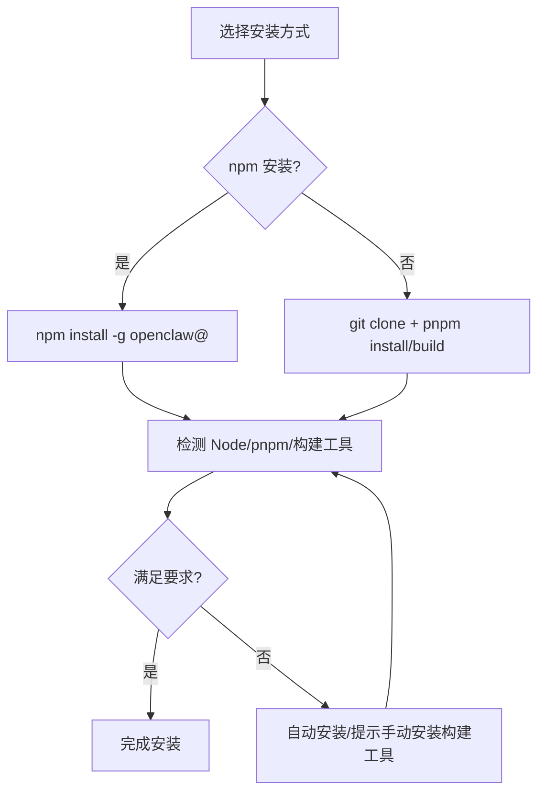
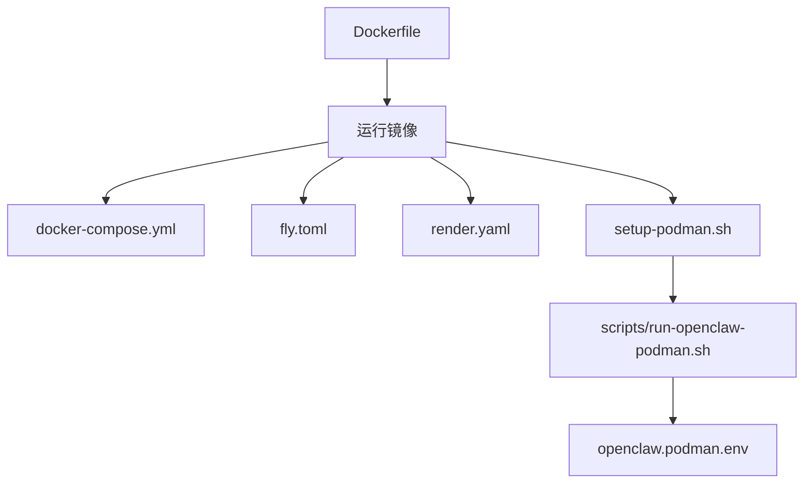

# 部署配置

<cite>
**本文引用的文件**
- [README.md](file://README.md)
- [Dockerfile](file://Dockerfile)
- [docker-compose.yml](file://docker-compose.yml)
- [docker-setup.sh](file://docker-setup.sh)
- [fly.toml](file://fly.toml)
- [render.yaml](file://render.yaml)
- [setup-podman.sh](file://setup-podman.sh)
- [openclaw.podman.env](file://openclaw.podman.env)
- [scripts/install.sh](file://scripts/install.sh)
- [scripts/install.ps1](file://scripts/install.ps1)
- [scripts/run-openclaw-podman.sh](file://scripts/run-openclaw-podman.sh)
- [scripts/build-and-run-mac.sh](file://scripts/build-and-run-mac.sh)
</cite>

## 目录

1. [简介](#简介)
2. [项目结构](#项目结构)
3. [核心组件](#核心组件)
4. [架构总览](#架构总览)
5. [详细组件分析](#详细组件分析)
6. [依赖关系分析](#依赖关系分析)
7. [性能考虑](#性能考虑)
8. [故障排查指南](#故障排查指南)
9. [结论](#结论)
10. [附录](#附录)

## 简介

本指南面向在多类环境中部署 OpenClaw 的工程与运维人员，覆盖以下部署形态与场景：

- 容器化部署：Docker 与 Podman（含 systemd Quadlet）
- 传统虚拟机/物理机部署：基于包管理器与系统服务
- 云平台部署：Fly.io、Render 等
- 本地开发环境：macOS、Linux、Windows（WSL）

同时提供生产级最佳实践，包括负载均衡、高可用、安全加固、环境变量、网络与存储配置示例，并给出从开发测试到生产的完整流程。

## 项目结构

OpenClaw 提供了多条部署路径与工具链：

- 容器镜像与编排：Dockerfile、docker-compose.yml、docker-setup.sh
- 云平台配置：fly.toml、render.yaml
- Podman 一键安装与运行：setup-podman.sh、scripts/run-openclaw-podman.sh、openclaw.podman.env
- 本地安装脚本：scripts/install.sh（macOS/Linux）、scripts/install.ps1（Windows）
- 开发调试脚本：scripts/build-and-run-mac.sh



图表来源

- [Dockerfile:1-231](file://Dockerfile#L1-L231)
- [docker-compose.yml:1-77](file://docker-compose.yml#L1-L77)
- [docker-setup.sh:1-598](file://docker-setup.sh#L1-L598)
- [fly.toml:1-35](file://fly.toml#L1-L35)
- [render.yaml:1-22](file://render.yaml#L1-L22)
- [setup-podman.sh:1-313](file://setup-podman.sh#L1-L313)
- [scripts/run-openclaw-podman.sh:1-232](file://scripts/run-openclaw-podman.sh#L1-L232)
- [openclaw.podman.env:1-25](file://openclaw.podman.env#L1-L25)
- [scripts/install.sh:1-800](file://scripts/install.sh#L1-L800)
- [scripts/install.ps1:1-330](file://scripts/install.ps1#L1-L330)
- [scripts/build-and-run-mac.sh:1-19](file://scripts/build-and-run-mac.sh#L1-L19)

章节来源

- [README.md:1-560](file://README.md#L1-L560)

## 核心组件

- 网关（Gateway）：WebSocket 控制面，承载会话、通道、工具与事件；默认绑定回环地址，支持通过外部暴露策略（如 Tailscale）安全访问。
- CLI：命令行工具，用于引导安装、健康检查、配置管理与诊断。
- 容器镜像：基于 Node.js 22 的最小化镜像，内置 pnpm、可选安装浏览器与 Docker CLI，支持沙箱隔离。
- 编排与编排辅助：Compose 文件定义服务、端口映射、健康检查；docker-setup.sh 自动化构建、初始化、配置与沙箱设置。
- 云平台配置：Fly.io 与 Render 提供容器化部署模板，含状态目录挂载、健康检查与资源规格。
- Podman 一键安装：setup-podman.sh 创建专用用户、生成令牌、构建镜像、加载到用户命名空间、可选安装 systemd Quadlet。
- 本地安装：install.sh（macOS/Linux）与 install.ps1（Windows）自动检测依赖、安装 Node/npm/pnpm 并完成全局安装或 Git 源码安装。

章节来源

- [README.md:180-238](file://README.md#L180-L238)
- [Dockerfile:211-231](file://Dockerfile#L211-L231)
- [docker-compose.yml:1-77](file://docker-compose.yml#L1-L77)
- [docker-setup.sh:413-477](file://docker-setup.sh#L413-L477)
- [fly.toml:1-35](file://fly.toml#L1-L35)
- [render.yaml:1-22](file://render.yaml#L1-L22)
- [setup-podman.sh:1-313](file://setup-podman.sh#L1-L313)
- [scripts/run-openclaw-podman.sh:1-232](file://scripts/run-openclaw-podman.sh#L1-L232)
- [scripts/install.sh:1-800](file://scripts/install.sh#L1-L800)
- [scripts/install.ps1:1-330](file://scripts/install.ps1#L1-L330)

## 架构总览

下图展示 OpenClaw 在不同部署形态下的典型拓扑与交互：

```mermaid
graph TB
subgraph "客户端"
U["用户终端<br/>WebChat/桌面应用/移动节点"]
end
subgraph "边缘/出口"
LB["反向代理/负载均衡器"]
TLS["TLS 终止/证书管理"]
end
subgraph "控制面Gateway"
GW["Gateway WebSocket 服务"]
CFG["配置与密钥<br/>.openclaw/*.json/.env"]
WS["工作区与技能<br/>.openclaw/workspace"]
end
subgraph "数据面可选"
SAN["沙箱容器Docker/Podman"]
BROW["浏览器自动化可选"]
end
U --> LB --> TLS --> GW
GW <- --> CFG
GW <- --> WS
GW --> SAN
GW --> BROW
```

图表来源

- [README.md:180-238](file://README.md#L180-L238)
- [Dockerfile:147-203](file://Dockerfile#L147-L203)
- [docker-compose.yml:12-25](file://docker-compose.yml#L12-L25)

## 详细组件分析

### Docker 容器化部署

- 基础镜像与变体：支持默认与 slim 两种基础镜像，固定 Node.js 22 版本以保证可复现性。
- 构建阶段：安装 Bun、启用 Corepack、按需打包 A2UI、构建 UI、裁剪开发依赖。
- 运行时：非 root 用户执行，可选安装 Chromium/Xvfb、Docker CLI，暴露健康检查端点。
- Compose 服务：定义网关与 CLI 服务，挂载配置与工作区，设置健康检查与重启策略。
- docker-setup.sh：自动化构建镜像、写入 .env、修复权限、执行 onboarding、可选启用沙箱（需要 Docker CLI）。



图表来源

- [docker-setup.sh:413-477](file://docker-setup.sh#L413-L477)
- [docker-compose.yml:1-77](file://docker-compose.yml#L1-L77)
- [Dockerfile:224-231](file://Dockerfile#L224-L231)

章节来源

- [Dockerfile:1-231](file://Dockerfile#L1-L231)
- [docker-compose.yml:1-77](file://docker-compose.yml#L1-L77)
- [docker-setup.sh:1-598](file://docker-setup.sh#L1-L598)

### Podman 部署（含 systemd Quadlet）

- 一次性安装：setup-podman.sh 创建 openclaw 用户、生成令牌、构建镜像并加载到用户命名空间、可选安装 Quadlet。
- 运行脚本：scripts/run-openclaw-podman.sh 负责生成/注入令牌、准备配置与工作区、根据 SELinux 状态选择挂载选项、启动容器。
- 环境文件：openclaw.podman.env 提供默认端口、绑定模式与可选提供商凭据占位。



图表来源

- [setup-podman.sh:193-277](file://setup-podman.sh#L193-L277)
- [scripts/run-openclaw-podman.sh:186-200](file://scripts/run-openclaw-podman.sh#L186-L200)
- [openclaw.podman.env:1-25](file://openclaw.podman.env#L1-L25)

章节来源

- [setup-podman.sh:1-313](file://setup-podman.sh#L1-L313)
- [scripts/run-openclaw-podman.sh:1-232](file://scripts/run-openclaw-podman.sh#L1-L232)
- [openclaw.podman.env:1-25](file://openclaw.podman.env#L1-L25)

### 云平台部署（Fly.io 与 Render）

- Fly.io：使用 Dockerfile 构建，进程类型为 app，内部端口 3000，绑定 lan，持久化挂载 /data。
- Render：Web 服务，Docker 运行时，健康检查路径 /health，磁盘挂载 /data，状态目录与工作区分别指向 /data/.openclaw 与 /data/workspace。



图表来源

- [fly.toml:1-35](file://fly.toml#L1-L35)
- [render.yaml:1-22](file://render.yaml#L1-L22)
- [Dockerfile:1-231](file://Dockerfile#L1-L231)

章节来源

- [fly.toml:1-35](file://fly.toml#L1-L35)
- [render.yaml:1-22](file://render.yaml#L1-L22)

### 传统虚拟机/物理机部署（本地安装）

- macOS/Linux：scripts/install.sh 支持 npm 全局安装与 Git 源码安装，自动检测 Node 版本、必要构建工具，处理失败重试与诊断。
- Windows：scripts/install.ps1 支持 npm 与 Git 源码安装，自动处理执行策略、Node/Git 检测与安装。



图表来源

- [scripts/install.sh:784-800](file://scripts/install.sh#L784-L800)
- [scripts/install.ps1:202-258](file://scripts/install.ps1#L202-L258)

章节来源

- [scripts/install.sh:1-800](file://scripts/install.sh#L1-L800)
- [scripts/install.ps1:1-330](file://scripts/install.ps1#L1-L330)

### 本地开发环境（macOS、Linux、Windows）

- macOS：scripts/build-and-run-mac.sh 快速构建并启动 macOS 应用，便于本地联调 Gateway。
- Linux：使用安装脚本或容器方案。
- Windows：使用 PowerShell 脚本安装，推荐 WSL2 环境运行。

章节来源

- [scripts/build-and-run-mac.sh:1-19](file://scripts/build-and-run-mac.sh#L1-L19)
- [README.md:28-31](file://README.md#L28-L31)

## 依赖关系分析

- 容器镜像依赖：Node.js 22（固定 digest）、pnpm、可选浏览器与 Docker CLI。
- Compose 服务依赖：Gateway 与 CLI 服务共享配置与工作区卷，Gateway 暴露健康检查端点。
- 云平台依赖：Fly.io/Render 使用同一 Dockerfile，Fly 通过 vm 规格与挂载实现持久化。
- Podman 依赖：rootless 用户命名空间、可选 Quadlet、SELinux 挂载选项。



图表来源

- [Dockerfile:1-231](file://Dockerfile#L1-L231)
- [docker-compose.yml:1-77](file://docker-compose.yml#L1-L77)
- [fly.toml:1-35](file://fly.toml#L1-L35)
- [render.yaml:1-22](file://render.yaml#L1-L22)
- [setup-podman.sh:1-313](file://setup-podman.sh#L1-L313)
- [scripts/run-openclaw-podman.sh:1-232](file://scripts/run-openclaw-podman.sh#L1-L232)
- [openclaw.podman.env:1-25](file://openclaw.podman.env#L1-L25)

章节来源

- [Dockerfile:1-231](file://Dockerfile#L1-L231)
- [docker-compose.yml:1-77](file://docker-compose.yml#L1-L77)
- [fly.toml:1-35](file://fly.toml#L1-L35)
- [render.yaml:1-22](file://render.yaml#L1-L22)
- [setup-podman.sh:1-313](file://setup-podman.sh#L1-L313)
- [scripts/run-openclaw-podman.sh:1-232](file://scripts/run-openclaw-podman.sh#L1-L232)
- [openclaw.podman.env:1-25](file://openclaw.podman.env#L1-L25)

## 性能考虑

- 容器内存上限：Fly.io 中 NODE_OPTIONS 设置最大堆大小，避免 OOM。
- 浏览器自动化：预装 Chromium 可减少冷启动时间，但会增加镜像体积。
- 沙箱隔离：启用 Docker CLI 以支持 per-session 沙箱，提升安全性但可能带来额外开销。
- 端口与绑定：默认回环绑定更安全，生产中可通过反向代理与 TLS 终止对外暴露。

章节来源

- [fly.toml:10-16](file://fly.toml#L10-L16)
- [Dockerfile:157-171](file://Dockerfile#L157-L171)
- [Dockerfile:173-203](file://Dockerfile#L173-L203)

## 故障排查指南

- 健康检查失败：检查 /healthz 与 /readyz 端点，确认容器内监听端口与绑定模式一致。
- 权限问题：Compose 与 Podman 场景均需确保宿主机挂载目录对容器内 node 用户可写。
- 沙箱不可用：确认镜像已安装 Docker CLI 或使用本地构建；若未安装，沙箱配置会被回滚。
- Windows 执行策略：PowerShell 脚本需调整执行策略或以管理员身份运行。
- macOS/Linux 构建工具缺失：install.sh 会尝试自动安装，若失败请手动安装 make/cmake/gcc 等。

章节来源

- [docker-compose.yml:38-49](file://docker-compose.yml#L38-L49)
- [Dockerfile:224-231](file://Dockerfile#L224-L231)
- [docker-setup.sh:497-506](file://docker-setup.sh#L497-L506)
- [scripts/install.sh:656-672](file://scripts/install.sh#L656-L672)
- [scripts/install.ps1:56-80](file://scripts/install.ps1#L56-L80)

## 结论

OpenClaw 提供了从本地开发到生产部署的全栈能力：容器化、云平台与 Podman 一键安装，配合完善的健康检查、配置与卷管理，能够满足不同规模与安全等级的部署需求。建议在生产环境中结合反向代理、TLS 终止、沙箱隔离与最小权限原则，确保稳定与安全。

## 附录

### 多部署方式与前置条件

- Docker 容器化
  - 前置条件：Docker、Docker Compose、可选浏览器与 Docker CLI（沙箱）
  - 关键步骤：执行 docker-setup.sh，完成 onboarding，启用沙箱（可选）
- Podman（rootless）
  - 前置条件：Podman、用户命名空间、可选 Quadlet
  - 关键步骤：setup-podman.sh 一次性安装，scripts/run-openclaw-podman.sh 启动
- 云平台（Fly.io/Render）
  - 前置条件：Dockerfile 已就绪，Fly/Render 账户
  - 关键步骤：按 fly.toml/render.yaml 配置，提交镜像并启动
- 传统虚拟机/物理机
  - 前置条件：Node 22+、npm/pnpm、可选构建工具
  - 关键步骤：scripts/install.sh 或 scripts/install.ps1 安装
- 本地开发
  - macOS：scripts/build-and-run-mac.sh
  - Linux：安装脚本或容器方案
  - Windows：PowerShell 脚本 + WSL2 推荐

章节来源

- [docker-setup.sh:413-477](file://docker-setup.sh#L413-L477)
- [setup-podman.sh:258-277](file://setup-podman.sh#L258-L277)
- [scripts/run-openclaw-podman.sh:215-227](file://scripts/run-openclaw-podman.sh#L215-L227)
- [fly.toml:1-35](file://fly.toml#L1-L35)
- [render.yaml:1-22](file://render.yaml#L1-L22)
- [scripts/install.sh:1-800](file://scripts/install.sh#L1-L800)
- [scripts/install.ps1:1-330](file://scripts/install.ps1#L1-L330)
- [scripts/build-and-run-mac.sh:1-19](file://scripts/build-and-run-mac.sh#L1-L19)

### 生产环境最佳实践

- 负载均衡与高可用
  - 使用反向代理（Nginx/Traefik）分发请求，开启健康检查
  - 多实例部署，共享持久化存储（Fly.io/Render 挂载 /data）
- 安全加固
  - 默认回环绑定，通过 TLS 终止对外暴露
  - 严格限制 allowedOrigins（Compose 场景由 docker-setup.sh 注入）
  - 最小权限：非 root 用户运行，最小化容器功能
  - 沙箱隔离：启用 per-session 沙箱，限制工具集
- 环境变量与配置
  - OPENCLAW_GATEWAY_TOKEN：随机令牌，Compose/Podman 场景自动生成
  - OPENCLAW_GATEWAY_BIND：loopback/lan，生产建议 loopback + 外部暴露
  - OPENCLAW_STATE_DIR 与 OPENCLAW_WORKSPACE_DIR：持久化路径
- 网络与存储
  - 端口映射：18789（Gateway）、18790（Bridge），按需调整
  - 卷挂载：.openclaw 与 workspace，确保权限正确
- 云平台配置要点
  - Fly.io：vm 规格与内存、持久化 /data
  - Render：健康检查路径 /health，磁盘挂载与状态目录

章节来源

- [docker-setup.sh:101-123](file://docker-setup.sh#L101-L123)
- [docker-compose.yml:12-25](file://docker-compose.yml#L12-L25)
- [Dockerfile:209-231](file://Dockerfile#L209-L231)
- [fly.toml:10-35](file://fly.toml#L10-L35)
- [render.yaml:6-22](file://render.yaml#L6-L22)
