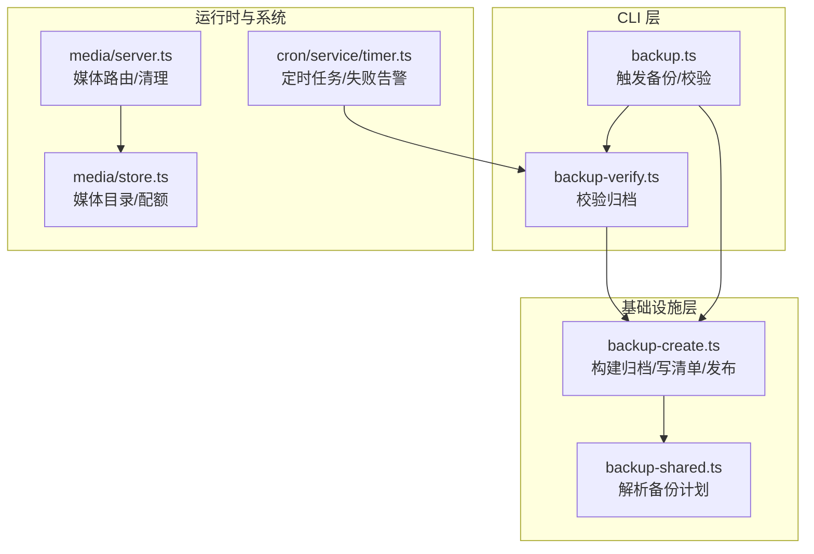
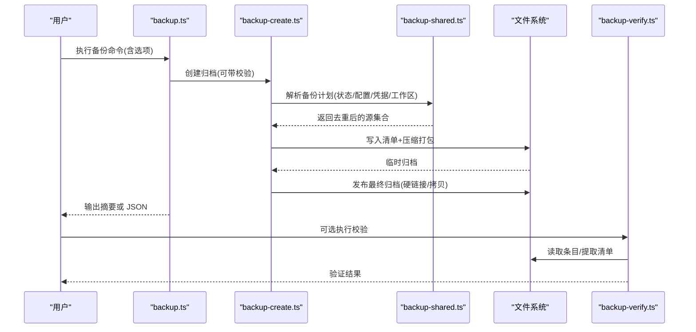
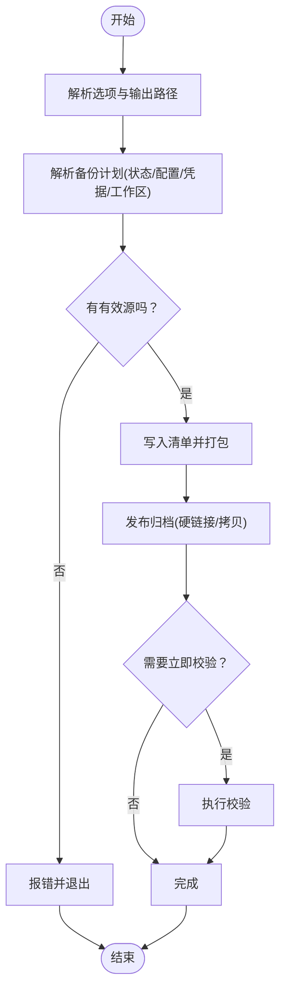
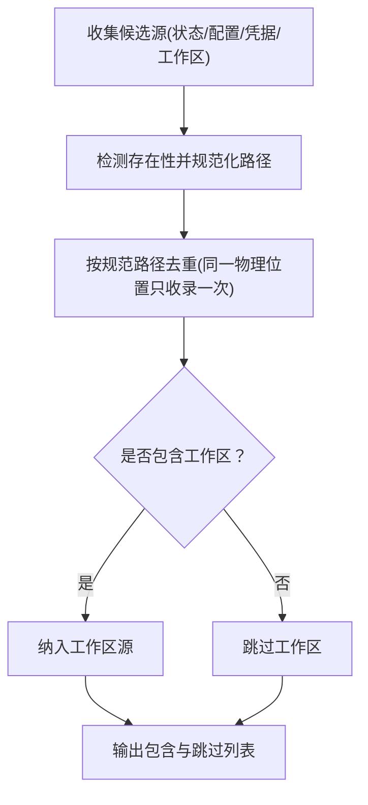
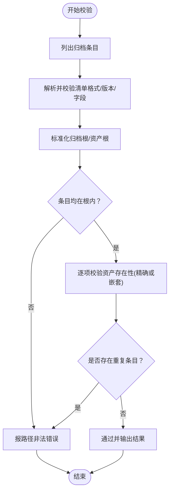
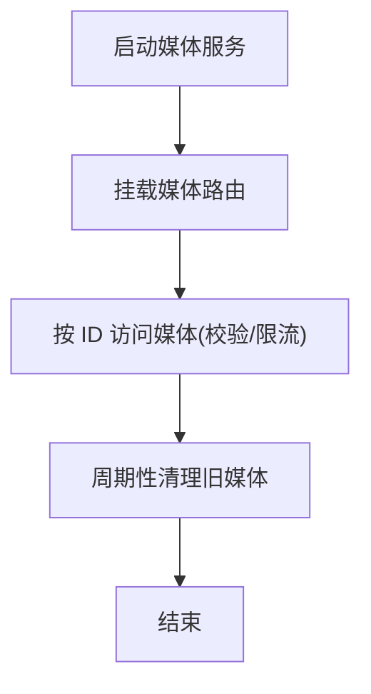
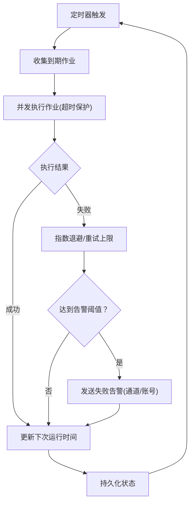
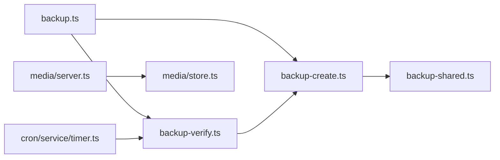

# 备份恢复

<cite>
**本文引用的文件**
- [docs/cli/backup.md](file://docs/cli/backup.md)
- [src/commands/backup.ts](file://src/commands/backup.ts)
- [src/commands/backup-verify.ts](file://src/commands/backup-verify.ts)
- [src/infra/backup-create.ts](file://src/infra/backup-create.ts)
- [src/commands/backup-shared.ts](file://src/commands/backup-shared.ts)
- [src/media/server.ts](file://src/media/server.ts)
- [src/media/store.ts](file://src/media/store.ts)
- [src/cron/service/timer.ts](file://src/cron/service/timer.ts)
- [src/cron/service.failure-alert.test.ts](file://src/cron/service.failure-alert.test.ts)
- [ui/src/ui/controllers/cron.ts](file://ui/src/ui/controllers/cron.ts)
</cite>

## 目录

1. [简介](#简介)
2. [项目结构](#项目结构)
3. [核心组件](#核心组件)
4. [架构总览](#架构总览)
5. [详细组件分析](#详细组件分析)
6. [依赖关系分析](#依赖关系分析)
7. [性能考量](#性能考量)
8. [故障排查指南](#故障排查指南)
9. [结论](#结论)
10. [附录](#附录)

## 简介

本指南面向 OpenClaw 的备份与恢复场景，围绕 CLI 备份命令、归档结构与校验、配置文件、会话数据与工作区、媒体文件、以及自动化调度与告警等主题，提供可操作的策略与流程建议。文档同时给出灾难恢复计划制定、RTO/RPO 目标设定与业务连续性保障思路，并覆盖本地与云端存储的实践要点。

## 项目结构

围绕备份与恢复的关键代码分布在以下模块：

- CLI 命令层：负责解析参数、触发备份与校验
- 基础设施层：负责构建归档、写入清单、发布最终产物
- 共享逻辑层：负责解析备份计划（状态、配置、凭据、工作区）
- 校验工具：负责对归档进行完整性与路径安全检查
- 媒体服务：提供媒体文件访问与清理能力
- 调度与告警：提供定时任务失败告警与重试策略

图表来源

- [src/commands/backup.ts:11-31](file://src/commands/backup.ts#L11-L31)
- [src/commands/backup-verify.ts:279-324](file://src/commands/backup-verify.ts#L279-L324)
- [src/infra/backup-create.ts:272-368](file://src/infra/backup-create.ts#L272-L368)
- [src/commands/backup-shared.ts:16-38](file://src/commands/backup-shared.ts#L16-L38)
- [src/media/server.ts:28-101](file://src/media/server.ts#L28-L101)
- [src/media/store.ts](file://src/media/store.ts)
- [src/cron/service/timer.ts:507-731](file://src/cron/service/timer.ts#L507-L731)

章节来源

- [docs/cli/backup.md:9-77](file://docs/cli/backup.md#L9-L77)
- [src/commands/backup.ts:11-31](file://src/commands/backup.ts#L11-L31)
- [src/commands/backup-verify.ts:279-324](file://src/commands/backup-verify.ts#L279-L324)
- [src/infra/backup-create.ts:272-368](file://src/infra/backup-create.ts#L272-L368)
- [src/commands/backup-shared.ts:16-38](file://src/commands/backup-shared.ts#L16-L38)
- [src/media/server.ts:28-101](file://src/media/server.ts#L28-L101)
- [src/cron/service/timer.ts:507-731](file://src/cron/service/timer.ts#L507-L731)

## 核心组件

- 备份命令入口：解析选项、调用归档创建、可选立即校验
- 归档创建器：生成时间戳根目录、构建清单、压缩打包、发布产物
- 备份计划解析：从状态目录、配置文件、凭据目录、工作区中收集去重后的源路径
- 归档校验器：解析清单、校验路径合法性、确认资产存在性与完整性
- 媒体服务：提供媒体文件访问与定期清理
- 定时任务与失败告警：为备份相关自动化提供重试与告警能力

章节来源

- [src/commands/backup.ts:11-31](file://src/commands/backup.ts#L11-L31)
- [src/infra/backup-create.ts:18-76](file://src/infra/backup-create.ts#L18-L76)
- [src/commands/backup-shared.ts:16-38](file://src/commands/backup-shared.ts#L16-L38)
- [src/commands/backup-verify.ts:39-52](file://src/commands/backup-verify.ts#L39-L52)
- [src/media/server.ts:28-101](file://src/media/server.ts#L28-L101)
- [src/cron/service/timer.ts:206-288](file://src/cron/service/timer.ts#L206-L288)

## 架构总览

下图展示从 CLI 到归档与校验的整体流程，以及与媒体与定时系统的交互。

图表来源

- [src/commands/backup.ts:11-31](file://src/commands/backup.ts#L11-L31)
- [src/infra/backup-create.ts:272-368](file://src/infra/backup-create.ts#L272-L368)
- [src/commands/backup-shared.ts:172-211](file://src/commands/backup-shared.ts#L172-L211)
- [src/commands/backup-verify.ts:279-324](file://src/commands/backup-verify.ts#L279-L324)

## 详细组件分析

### 备份命令与归档创建

- 支持输出目录、仅配置备份、工作区包含/排除、干跑、立即校验、JSON 输出等选项
- 归档采用时间戳根目录，清单记录归档布局与资产映射
- 发布阶段优先硬链接，不支持时回退到排他复制，避免覆盖既有归档

图表来源

- [src/commands/backup.ts:11-31](file://src/commands/backup.ts#L11-L31)
- [src/infra/backup-create.ts:78-168](file://src/infra/backup-create.ts#L78-L168)
- [src/infra/backup-create.ts:272-368](file://src/infra/backup-create.ts#L272-L368)
- [src/commands/backup-shared.ts:172-211](file://src/commands/backup-shared.ts#L172-L211)

章节来源

- [docs/cli/backup.md:13-32](file://docs/cli/backup.md#L13-L32)
- [src/commands/backup.ts:11-31](file://src/commands/backup.ts#L11-L31)
- [src/infra/backup-create.ts:78-168](file://src/infra/backup-create.ts#L78-L168)
- [src/infra/backup-create.ts:272-368](file://src/infra/backup-create.ts#L272-L368)

### 备份计划解析与去重

- 按优先级合并状态、配置、凭据与工作区候选源
- 对候选源进行存在性检测与规范化，消除符号链接与子目录重复
- 若配置/凭据位于状态目录内，则跳过重复收录

图表来源

- [src/commands/backup-shared.ts:172-211](file://src/commands/backup-shared.ts#L172-L211)

章节来源

- [src/commands/backup-shared.ts:16-38](file://src/commands/backup-shared.ts#L16-L38)
- [src/commands/backup-shared.ts:172-211](file://src/commands/backup-shared.ts#L172-L211)

### 归档校验与完整性检查

- 校验清单唯一且位于归档根下
- 校验条目路径合法（相对、无穿越、无 Windows 反斜杠）
- 校验清单声明的每个资产在归档中存在或被嵌套包含
- 统计资产数与扫描条目数，输出人类可读或 JSON 结果

图表来源

- [src/commands/backup-verify.ts:173-216](file://src/commands/backup-verify.ts#L173-L216)
- [src/commands/backup-verify.ts:218-253](file://src/commands/backup-verify.ts#L218-L253)
- [src/commands/backup-verify.ts:279-324](file://src/commands/backup-verify.ts#L279-L324)

章节来源

- [src/commands/backup-verify.ts:39-52](file://src/commands/backup-verify.ts#L39-L52)
- [src/commands/backup-verify.ts:97-171](file://src/commands/backup-verify.ts#L97-L171)
- [src/commands/backup-verify.ts:279-324](file://src/commands/backup-verify.ts#L279-L324)

### 媒体文件备份与清理

- 媒体服务器提供受控访问，限制路径与大小
- 提供周期性清理旧媒体的任务，避免空间膨胀
- 备份策略建议：媒体文件通常体量大，建议单独归档或采用增量/差异策略；若启用自动清理，需确保清理窗口外进行备份

图表来源

- [src/media/server.ts:28-101](file://src/media/server.ts#L28-L101)
- [src/media/server.ts:97-101](file://src/media/server.ts#L97-L101)

章节来源

- [src/media/server.ts:103-118](file://src/media/server.ts#L103-L118)
- [src/media/server.ts:28-101](file://src/media/server.ts#L28-L101)

### 定时任务与失败告警（用于备份监控）

- 定时器根据作业状态计算下次运行时间，应用指数退避与最大并发控制
- 失败告警支持全局与作业级配置，具备冷却时间与通道选择
- 可用于备份相关自动化任务的健康监控与告警

图表来源

- [src/cron/service/timer.ts:507-731](file://src/cron/service/timer.ts#L507-L731)
- [src/cron/service/timer.ts:206-288](file://src/cron/service/timer.ts#L206-L288)
- [src/cron/service.failure-alert.test.ts:90-126](file://src/cron/service.failure-alert.test.ts#L90-L126)
- [ui/src/ui/controllers/cron.ts:588-634](file://ui/src/ui/controllers/cron.ts#L588-L634)

章节来源

- [src/cron/service/timer.ts:507-731](file://src/cron/service/timer.ts#L507-L731)
- [src/cron/service/timer.ts:206-288](file://src/cron/service/timer.ts#L206-L288)
- [src/cron/service.failure-alert.test.ts:90-126](file://src/cron/service.failure-alert.test.ts#L90-L126)
- [ui/src/ui/controllers/cron.ts:588-634](file://ui/src/ui/controllers/cron.ts#L588-L634)

## 依赖关系分析

- CLI 命令依赖基础设施层创建归档
- 归档创建依赖共享层解析计划
- 校验器独立于创建器，仅依赖归档与清单
- 媒体服务与备份无直接耦合，但需注意媒体清理与备份窗口协调
- 定时任务与告警为备份自动化提供监控与恢复保障

图表来源

- [src/commands/backup.ts:11-31](file://src/commands/backup.ts#L11-L31)
- [src/infra/backup-create.ts:272-368](file://src/infra/backup-create.ts#L272-L368)
- [src/commands/backup-shared.ts:172-211](file://src/commands/backup-shared.ts#L172-L211)
- [src/commands/backup-verify.ts:279-324](file://src/commands/backup-verify.ts#L279-L324)
- [src/media/server.ts:28-101](file://src/media/server.ts#L28-L101)
- [src/cron/service/timer.ts:507-731](file://src/cron/service/timer.ts#L507-L731)

章节来源

- [src/commands/backup.ts:11-31](file://src/commands/backup.ts#L11-L31)
- [src/infra/backup-create.ts:272-368](file://src/infra/backup-create.ts#L272-L368)
- [src/commands/backup-shared.ts:172-211](file://src/commands/backup-shared.ts#L172-L211)
- [src/commands/backup-verify.ts:279-324](file://src/commands/backup-verify.ts#L279-L324)
- [src/media/server.ts:28-101](file://src/media/server.ts#L28-L101)
- [src/cron/service/timer.ts:507-731](file://src/cron/service/timer.ts#L507-L731)

## 性能考量

- 大型工作区是归档体积的主要驱动因素，可通过“仅配置”或“不包含工作区”降低体积与耗时
- 校验会重新扫描归档，建议在生产环境谨慎使用
- 发布阶段优先硬链接，不支持时采用排他复制，避免覆盖已有归档
- 媒体文件清理周期应避开备份窗口，防止备份过程中文件被删除

章节来源

- [docs/cli/backup.md:63-77](file://docs/cli/backup.md#L63-L77)
- [src/infra/backup-create.ts:134-168](file://src/infra/backup-create.ts#L134-L168)
- [src/media/server.ts:97-101](file://src/media/server.ts#L97-L101)

## 故障排查指南

- 归档为空或清单缺失：检查归档条目数量与清单路径
- 路径穿越或非法条目：校验器会拒绝包含“..”或绝对路径的条目
- 重复条目：校验器会报告重复标准化路径
- 覆盖既有归档：发布阶段拒绝覆盖，需更换输出路径
- 配置无效导致无法发现工作区：可使用“仅配置”或“不包含工作区”进行部分备份
- 失败告警未触发：检查全局与作业级失败告警配置、冷却时间与通道设置

章节来源

- [src/commands/backup-verify.ts:284-302](file://src/commands/backup-verify.ts#L284-L302)
- [src/commands/backup-verify.ts:308-310](file://src/commands/backup-verify.ts#L308-L310)
- [src/infra/backup-create.ts:113-124](file://src/infra/backup-create.ts#L113-L124)
- [docs/cli/backup.md:49-62](file://docs/cli/backup.md#L49-L62)
- [src/cron/service/timer.ts:206-288](file://src/cron/service/timer.ts#L206-L288)

## 结论

OpenClaw 的备份体系以 CLI 命令为核心，结合清单化的归档与严格的路径校验，提供了可验证、可恢复的本地备份能力。配合定时任务与失败告警，可实现备份自动化与监控闭环。针对媒体文件与工作区，建议制定差异化策略并在清理窗口外进行备份，以兼顾容量与一致性。

## 附录

### 数据备份策略与实施要点

- 全量备份
  - 使用默认选项创建完整归档，包含状态、配置、凭据与工作区
  - 适合灾难恢复基线与迁移场景
- 增量备份
  - 当前实现为归档打包，未内置基于变更的增量算法
  - 建议：在外部脚本中对比上次归档清单与当前源，仅打包新增/变更文件，再生成新清单并发布
- 差异备份
  - 建议：保留最近 N 个全量归档，其余采用差异归档（仅包含自上次全量以来的变更），并定期轮换

章节来源

- [docs/cli/backup.md:13-32](file://docs/cli/backup.md#L13-L32)
- [src/commands/backup-shared.ts:172-211](file://src/commands/backup-shared.ts#L172-L211)

### 配置文件、会话数据与工作区备份

- 配置文件：支持“仅配置”模式，独立于工作区发现
- 凭据目录：与状态目录同处时自动去重
- 工作区：默认包含，可通过选项排除
- 会话数据：由工作区与状态共同决定，建议在备份窗口外清理旧会话

章节来源

- [docs/cli/backup.md:34-47](file://docs/cli/backup.md#L34-L47)
- [src/commands/backup-shared.ts:172-211](file://src/commands/backup-shared.ts#L172-L211)

### 媒体文件备份

- 媒体文件体量大，建议单独归档或采用差异策略
- 清理周期应在备份窗口之外，避免备份过程中文件被删除
- 访问与清理由媒体服务统一管理

章节来源

- [src/media/server.ts:28-101](file://src/media/server.ts#L28-L101)
- [src/media/server.ts:97-101](file://src/media/server.ts#L97-L101)

### 存储方案与异地容灾

- 本地存储
  - 默认输出为当前工作目录或用户主目录下的时间戳归档
  - 建议：在多个磁盘/卷上轮换存放，避免单点故障
- 云存储
  - 将归档上传至对象存储（如 S3/GCS/OSS），开启版本控制与生命周期策略
  - 建议：启用跨区域复制与多版本保留
- 异地容灾
  - 在不同地理区域保留至少一份可恢复的归档
  - 定期进行跨地域恢复演练

章节来源

- [docs/cli/backup.md:23-32](file://docs/cli/backup.md#L23-L32)

### 备份验证、完整性检查与恢复测试

- 验证流程
  - 使用校验命令检查清单唯一性、路径合法性与资产存在性
  - 建议：在归档发布后立即执行校验
- 恢复测试
  - 在隔离环境中解包归档并验证关键文件存在与可读
  - 验证配置、凭据与工作区可被正确加载

章节来源

- [src/commands/backup-verify.ts:279-324](file://src/commands/backup-verify.ts#L279-L324)
- [docs/cli/backup.md:25-31](file://docs/cli/backup.md#L25-L31)

### 灾难恢复计划、RTO/RPO 与业务连续性

- RTO/RPO 目标
  - 全量备份：RPO=当天，RTO=恢复窗口（含校验与加载）
  - 增量/差异：按频率调整 RPO；RTO 包含增量应用与校验
- 业务连续性
  - 保持最小可用配置与关键凭据的快速恢复
  - 通过定时任务与失败告警监控备份健康

章节来源

- [src/cron/service/timer.ts:206-288](file://src/cron/service/timer.ts#L206-L288)

### 自动化备份任务调度、监控与告警

- 调度
  - 使用系统定时器或平台计划任务触发备份命令
  - 建议：在低峰时段执行，避免与媒体清理冲突
- 监控
  - 通过校验命令与定时任务日志监控备份状态
  - 失败告警：根据连续失败次数与冷却时间触发通知
- 告警
  - 支持多种通道与账号绑定，必要时启用 Webhook

章节来源

- [src/cron/service/timer.ts:507-731](file://src/cron/service/timer.ts#L507-L731)
- [src/cron/service/timer.ts:206-288](file://src/cron/service/timer.ts#L206-L288)
- [ui/src/ui/controllers/cron.ts:588-634](file://ui/src/ui/controllers/cron.ts#L588-L634)
