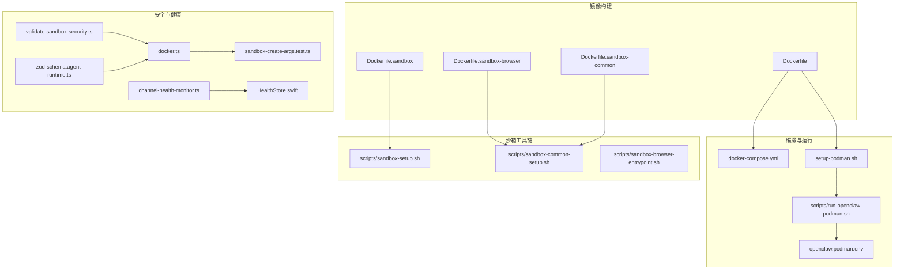
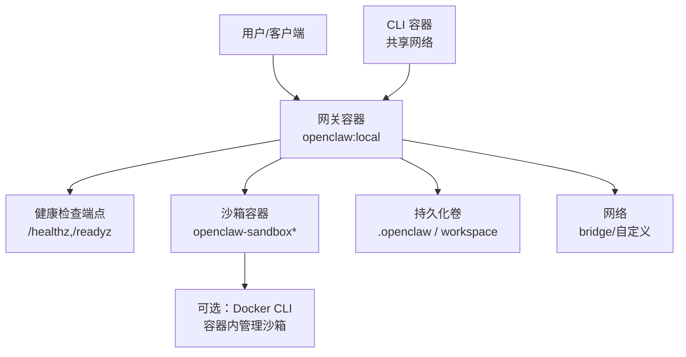
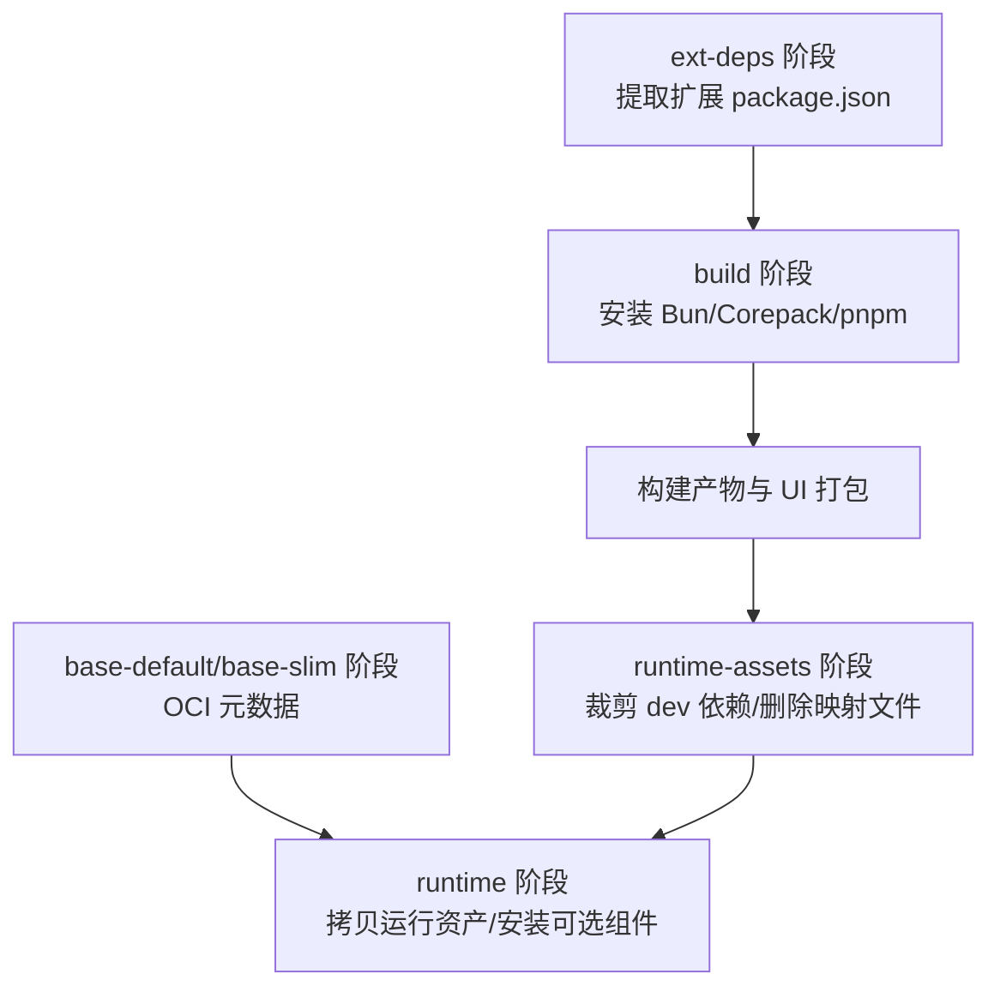
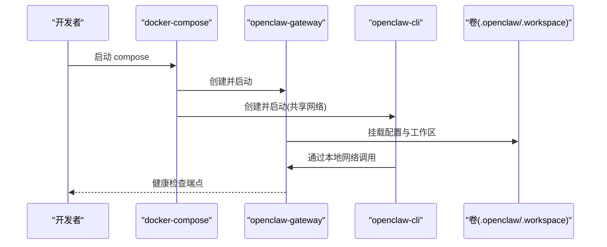
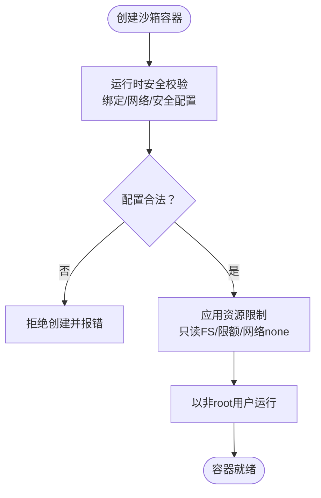
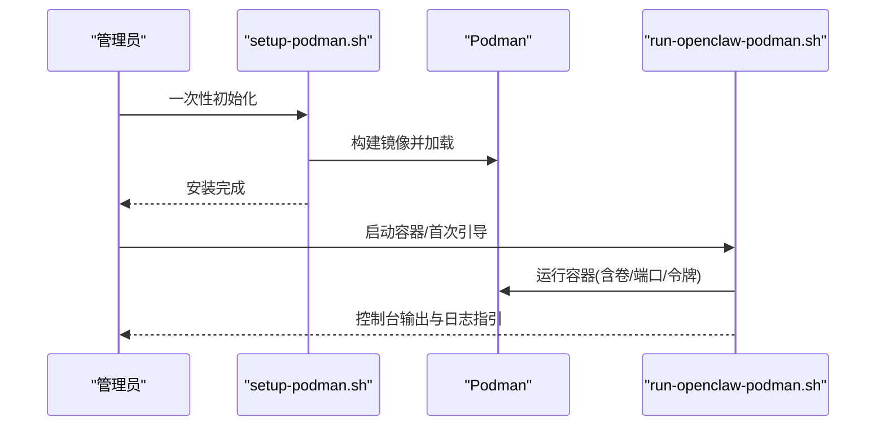
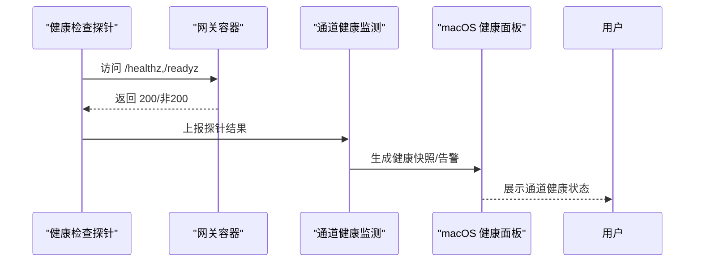
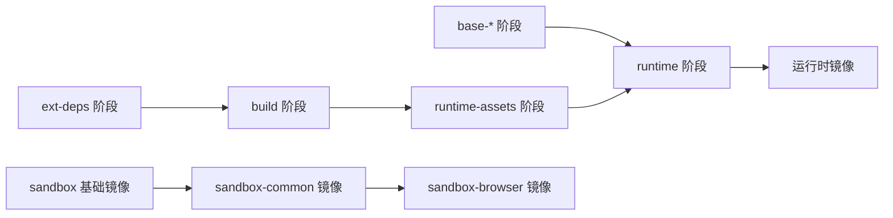

# 容器化方案

<cite>
**本文引用的文件**
- [Dockerfile](file://Dockerfile)
- [Dockerfile.sandbox](file://Dockerfile.sandbox)
- [Dockerfile.sandbox-browser](file://Dockerfile.sandbox-browser)
- [Dockerfile.sandbox-common](file://Dockerfile.sandbox-common)
- [docker-compose.yml](file://docker-compose.yml)
- [.dockerignore](file://.dockerignore)
- [scripts/sandbox-browser-entrypoint.sh](file://scripts/sandbox-browser-entrypoint.sh)
- [scripts/sandbox-setup.sh](file://scripts/sandbox-setup.sh)
- [scripts/sandbox-common-setup.sh](file://scripts/sandbox-common-setup.sh)
- [setup-podman.sh](file://setup-podman.sh)
- [openclaw.podman.env](file://openclaw.podman.env)
- [scripts/run-openclaw-podman.sh](file://scripts/run-openclaw-podman.sh)
- [src/agents/sandbox/validate-sandbox-security.ts](file://src/agents/sandbox/validate-sandbox-security.ts)
- [src/agents/sandbox/docker.ts](file://src/agents/sandbox/docker.ts)
- [src/agents/sandbox-create-args.test.ts](file://src/agents/sandbox-create-args.test.ts)
- [src/config/zod-schema.agent-runtime.ts](file://src/config/zod-schema.agent-runtime.ts)
- [src/gateway/channel-health-monitor.ts](file://src/gateway/channel-health-monitor.ts)
- [apps/macos/Sources/OpenClaw/HealthStore.swift](file://apps/macos/Sources/OpenClaw/HealthStore.swift)
</cite>

## 目录

1. [简介](#简介)
2. [项目结构](#项目结构)
3. [核心组件](#核心组件)
4. [架构总览](#架构总览)
5. [详细组件分析](#详细组件分析)
6. [依赖关系分析](#依赖关系分析)
7. [性能考量](#性能考量)
8. [故障排查指南](#故障排查指南)
9. [结论](#结论)
10. [附录](#附录)

## 简介

本文件系统性阐述本项目的容器化方案，覆盖以下方面：

- Docker 镜像构建：基础镜像选择、依赖安装与安全加固、多阶段构建与体积优化
- Docker Compose 编排：服务定义、网络与存储卷管理
- 沙箱容器：安全隔离、资源限制、权限控制与浏览器沙盒
- 监控与健康检查：内置探针、重启策略与通道健康监测
- 最佳实践：容器间通信、数据持久化与配置管理

## 项目结构

围绕容器化的核心文件与脚本分布如下：

- 镜像构建：根目录 Dockerfile 及多个专用沙箱 Dockerfile
- 编排与运行：docker-compose.yml、Podman 一键安装与运行脚本
- 沙箱工具链：沙箱基础镜像与通用开发环境镜像的构建脚本
- 健康检查与安全校验：运行时沙箱安全校验与健康监测模块

**图表来源**

- [Dockerfile:1-231](file://Dockerfile#L1-L231)
- [docker-compose.yml:1-77](file://docker-compose.yml#L1-L77)
- [setup-podman.sh:1-313](file://setup-podman.sh#L1-L313)
- [scripts/run-openclaw-podman.sh:1-232](file://scripts/run-openclaw-podman.sh#L1-L232)
- [openclaw.podman.env:1-25](file://openclaw.podman.env#L1-L25)
- [Dockerfile.sandbox:1-24](file://Dockerfile.sandbox#L1-L24)
- [Dockerfile.sandbox-browser:1-35](file://Dockerfile.sandbox-browser#L1-L35)
- [Dockerfile.sandbox-common:1-48](file://Dockerfile.sandbox-common#L1-L48)
- [scripts/sandbox-setup.sh:1-8](file://scripts/sandbox-setup.sh#L1-L8)
- [scripts/sandbox-common-setup.sh:1-55](file://scripts/sandbox-common-setup.sh#L1-L55)
- [scripts/sandbox-browser-entrypoint.sh:1-128](file://scripts/sandbox-browser-entrypoint.sh#L1-L128)
- [src/agents/sandbox/validate-sandbox-security.ts:1-343](file://src/agents/sandbox/validate-sandbox-security.ts#L1-L343)
- [src/agents/sandbox/docker.ts:292-344](file://src/agents/sandbox/docker.ts#L292-L344)
- [src/agents/sandbox-create-args.test.ts:41-239](file://src/agents/sandbox-create-args.test.ts#L41-L239)
- [src/config/zod-schema.agent-runtime.ts:131-165](file://src/config/zod-schema.agent-runtime.ts#L131-L165)
- [src/gateway/channel-health-monitor.ts:76-111](file://src/gateway/channel-health-monitor.ts#L76-L111)
- [apps/macos/Sources/OpenClaw/HealthStore.swift:147-163](file://apps/macos/Sources/OpenClaw/HealthStore.swift#L147-L163)

**章节来源**

- [Dockerfile:1-231](file://Dockerfile#L1-L231)
- [docker-compose.yml:1-77](file://docker-compose.yml#L1-L77)

## 核心组件

- 运行时镜像（Gateway）：基于 Node.js 22 的 Debian Bookworm，多阶段构建，最终仅包含生产依赖与运行产物；默认非 root 用户执行；内置健康检查端点；支持可选安装浏览器与 Docker CLI。
- 沙箱镜像族：
  - openclaw-sandbox：最小开发/调试环境
  - openclaw-sandbox-browser：带 Chromium/Xvfb/VNC/noVNC 的浏览器沙盒
  - openclaw-sandbox-common：在基础镜像上安装常用工具链（Node/Bun/Homebrew/pnpm 等）
- 编排与运行：
  - docker-compose：定义网关与 CLI 服务，挂载配置与工作区，健康检查与重启策略
  - Podman 一键安装与运行：自动创建用户、生成令牌、构建镜像、加载到用户命名空间、启动容器
- 沙箱安全与资源限制：运行时对危险绑定、网络模式、安全配置进行校验，并提供资源限制参数

**章节来源**

- [Dockerfile:103-231](file://Dockerfile#L103-L231)
- [Dockerfile.sandbox:1-24](file://Dockerfile.sandbox#L1-L24)
- [Dockerfile.sandbox-browser:1-35](file://Dockerfile.sandbox-browser#L1-L35)
- [Dockerfile.sandbox-common:1-48](file://Dockerfile.sandbox-common#L1-L48)
- [docker-compose.yml:1-77](file://docker-compose.yml#L1-L77)
- [setup-podman.sh:1-313](file://setup-podman.sh#L1-L313)
- [scripts/run-openclaw-podman.sh:1-232](file://scripts/run-openclaw-podman.sh#L1-L232)

## 架构总览

下图展示容器化部署的整体交互：Compose/Podman 启动运行时镜像与 CLI；CLI 通过本地网络访问网关；沙箱容器用于受限执行任务；健康检查贯穿服务生命周期。

**图表来源**

- [docker-compose.yml:1-77](file://docker-compose.yml#L1-L77)
- [Dockerfile:224-231](file://Dockerfile#L224-L231)
- [Dockerfile.sandbox-common:1-48](file://Dockerfile.sandbox-common#L1-L48)

## 详细组件分析

### Dockerfile 多阶段构建与安全加固

- 基础镜像与变体
  - 默认与 slim 两种变体，均固定镜像摘要以确保可复现性
  - slim 版本通过额外安装系统工具满足运行需求
- 多阶段构建
  - ext-deps：仅复制所需扩展的 package.json，避免无关源码变更导致缓存失效
  - build：安装 Bun/Corepack，使用 pnpm 安装依赖与构建产物
  - runtime-assets：裁剪开发依赖与类型映射文件
  - base-default/base-slim：注入 OCI 基镜像元信息
  - runtime：拷贝运行产物与依赖，安装可选系统包与浏览器
- 安全加固
  - 非 root 用户运行（node:1000）
  - 内置健康检查探针（/healthz,/readyz）
  - 可选安装 Docker CLI 以便在容器内管理沙箱
- 体积优化
  - 使用 slim 基镜像
  - 仅保留 dist、node_modules、必要 docs/skills/extensions
  - 清理 dev 依赖与映射文件

**图表来源**

- [Dockerfile:27-136](file://Dockerfile#L27-L136)

**章节来源**

- [Dockerfile:1-231](file://Dockerfile#L1-L231)
- [.dockerignore:1-65](file://.dockerignore#L1-L65)

### Docker Compose 编排配置

- 服务定义
  - openclaw-gateway：暴露网关与桥接端口，挂载配置与工作区，健康检查与重启策略
  - openclaw-cli：与网关共享网络，具备最小权限能力集（cap_drop），tty/交互式
- 存储卷管理
  - 将宿主机目录映射为只读或读写，确保权限与安全
- 网络设置
  - 默认桥接网络；如需外网访问，可调整绑定模式并设置认证
- 沙箱集成
  - 可选挂载 Docker 套接字以启用 agents.defaults.sandbox 功能（需在镜像中安装 Docker CLI）

**图表来源**

- [docker-compose.yml:1-77](file://docker-compose.yml#L1-L77)

**章节来源**

- [docker-compose.yml:1-77](file://docker-compose.yml#L1-L77)

### 沙箱容器的安全隔离与资源限制

- 安全隔离
  - 运行时安全校验：禁止危险路径绑定、禁止 host 网络模式、禁止未受约束的 seccomp/apparmor
  - 绑定挂载白名单与保留目标路径保护
- 资源限制
  - 支持只读根文件系统、tmpfs、网络 none、用户/组、PID/内存/CPU/ulimit 等
- 权限控制
  - capDrop: ALL，禁用特权提升
  - 非 root 用户运行
- 浏览器沙盒
  - 提供带 Chromium/Xvfb/VNC/noVNC 的镜像
  - 启动脚本负责 Xvfb、Chromium、CDP/VNC/noVNC 映射与参数去重

**图表来源**

- [src/agents/sandbox/validate-sandbox-security.ts:328-343](file://src/agents/sandbox/validate-sandbox-security.ts#L328-L343)
- [src/agents/sandbox/docker.ts:317-344](file://src/agents/sandbox/docker.ts#L317-L344)
- [src/agents/sandbox-create-args.test.ts:41-239](file://src/agents/sandbox-create-args.test.ts#L41-L239)
- [src/config/zod-schema.agent-runtime.ts:131-165](file://src/config/zod-schema.agent-runtime.ts#L131-L165)

**章节来源**

- [Dockerfile.sandbox:1-24](file://Dockerfile.sandbox#L1-L24)
- [Dockerfile.sandbox-browser:1-35](file://Dockerfile.sandbox-browser#L1-L35)
- [scripts/sandbox-browser-entrypoint.sh:1-128](file://scripts/sandbox-browser-entrypoint.sh#L1-L128)
- [src/agents/sandbox/validate-sandbox-security.ts:1-343](file://src/agents/sandbox/validate-sandbox-security.ts#L1-L343)
- [src/agents/sandbox/docker.ts:292-344](file://src/agents/sandbox/docker.ts#L292-L344)
- [src/agents/sandbox-create-args.test.ts:41-239](file://src/agents/sandbox-create-args.test.ts#L41-L239)
- [src/config/zod-schema.agent-runtime.ts:131-165](file://src/config/zod-schema.agent-runtime.ts#L131-L165)

### Podman 一键安装与运行

- 自动化流程
  - 创建非登录用户、生成网关令牌、初始化配置与工作区
  - 构建镜像并加载到目标用户 Podman 存储
  - 可选安装 systemd Quadlet，实现开机自启
- 运行脚本
  - 支持以 openclaw 用户身份运行容器，处理 SELinux 挂载选项
  - 支持首次引导向导与常规启动

**图表来源**

- [setup-podman.sh:1-313](file://setup-podman.sh#L1-L313)
- [scripts/run-openclaw-podman.sh:1-232](file://scripts/run-openclaw-podman.sh#L1-L232)
- [openclaw.podman.env:1-25](file://openclaw.podman.env#L1-L25)

**章节来源**

- [setup-podman.sh:1-313](file://setup-podman.sh#L1-L313)
- [scripts/run-openclaw-podman.sh:1-232](file://scripts/run-openclaw-podman.sh#L1-L232)
- [openclaw.podman.env:1-25](file://openclaw.podman.env#L1-L25)

### 监控、日志与健康检查

- 内置健康检查
  - 运行时镜像提供 /healthz（存活）与 /readyz（就绪）端点
  - Compose 中定义了健康检查命令与重试策略
- 通道健康监测
  - 后端定时采集通道健康快照，具备冷却周期与重启节流
  - macOS 前端根据探针结果渲染健康状态与超时提示

**图表来源**

- [Dockerfile:224-231](file://Dockerfile#L224-L231)
- [docker-compose.yml:38-49](file://docker-compose.yml#L38-L49)
- [src/gateway/channel-health-monitor.ts:76-111](file://src/gateway/channel-health-monitor.ts#L76-L111)
- [apps/macos/Sources/OpenClaw/HealthStore.swift:147-163](file://apps/macos/Sources/OpenClaw/HealthStore.swift#L147-L163)

**章节来源**

- [Dockerfile:224-231](file://Dockerfile#L224-L231)
- [docker-compose.yml:38-49](file://docker-compose.yml#L38-L49)
- [src/gateway/channel-health-monitor.ts:76-111](file://src/gateway/channel-health-monitor.ts#L76-L111)
- [apps/macos/Sources/OpenClaw/HealthStore.swift:147-163](file://apps/macos/Sources/OpenClaw/HealthStore.swift#L147-L163)

## 依赖关系分析

- 构建期依赖
  - ext-deps 阶段仅依赖扩展的 package.json，降低缓存失效范围
  - build 阶段依赖 Node/Bun/Corepack/pnpm 与项目源码
- 运行期依赖
  - 运行时镜像仅包含 dist、node_modules、必要 docs/skills/extensions
  - 可选安装浏览器与 Docker CLI，按需启用
- 沙箱依赖
  - openclaw-sandbox-common 在基础镜像上叠加工具链
  - 浏览器沙盒镜像包含 Chromium/Xvfb/VNC/noVNC

**图表来源**

- [Dockerfile:27-136](file://Dockerfile#L27-L136)
- [Dockerfile.sandbox-common:1-48](file://Dockerfile.sandbox-common#L1-L48)
- [Dockerfile.sandbox-browser:1-35](file://Dockerfile.sandbox-browser#L1-L35)

**章节来源**

- [Dockerfile:1-231](file://Dockerfile#L1-L231)
- [Dockerfile.sandbox-common:1-48](file://Dockerfile.sandbox-common#L1-L48)
- [Dockerfile.sandbox-browser:1-35](file://Dockerfile.sandbox-browser#L1-L35)

## 性能考量

- 镜像体积
  - 使用 slim 基镜像与多阶段构建，仅拷贝运行必需文件
  - 清理 dev 依赖与映射文件，减少层大小
- 构建缓存
  - ext-deps 仅复制扩展清单，避免无关源码变更导致缓存失效
  - pnpm store 使用共享缓存 mount，加速安装
- 运行性能
  - 可选预装浏览器与 Playwright 二进制，避免容器启动时下载
  - 通过 ulimits、memory、cpus 等限制防止资源争用

**章节来源**

- [Dockerfile:56-90](file://Dockerfile#L56-L90)
- [.dockerignore:1-65](file://.dockerignore#L1-L65)

## 故障排查指南

- 健康检查失败
  - 检查 /healthz 与 /readyz 是否可达，确认端口映射与绑定模式
  - 关注探针超时与返回码，结合后端通道健康监测定位问题
- 沙箱创建失败
  - 检查是否使用了危险绑定/网络模式/未受约束的安全配置
  - 确认未尝试挂载 /etc、/proc、/sys、/dev 或 Docker 套接字等敏感路径
- Podman 启动异常
  - 确认用户与子 UID/GID 配置，检查 SELinux 挂载选项
  - 验证令牌与配置文件存在且权限正确

**章节来源**

- [Dockerfile:224-231](file://Dockerfile#L224-L231)
- [src/agents/sandbox/validate-sandbox-security.ts:16-37](file://src/agents/sandbox/validate-sandbox-security.ts#L16-L37)
- [src/agents/sandbox-create-args.test.ts:200-239](file://src/agents/sandbox-create-args.test.ts#L200-L239)
- [setup-podman.sh:186-200](file://setup-podman.sh#L186-L200)

## 结论

本容器化方案通过多阶段构建与 slim 基镜像实现体积优化，结合非 root 运行、健康检查与沙箱安全校验强化运行时安全。Compose 与 Podman 提供便捷的编排与一键安装体验，配合浏览器沙盒与资源限制，满足多样化运行场景与安全隔离需求。

## 附录

- 沙箱镜像构建脚本
  - 基础镜像：scripts/sandbox-setup.sh
  - 通用开发环境：scripts/sandbox-common-setup.sh
- 浏览器沙盒入口脚本：scripts/sandbox-browser-entrypoint.sh
- 运行时镜像构建参数参考：Dockerfile 中的 ARG 与安装开关

**章节来源**

- [scripts/sandbox-setup.sh:1-8](file://scripts/sandbox-setup.sh#L1-L8)
- [scripts/sandbox-common-setup.sh:1-55](file://scripts/sandbox-common-setup.sh#L1-L55)
- [scripts/sandbox-browser-entrypoint.sh:1-128](file://scripts/sandbox-browser-entrypoint.sh#L1-L128)
- [Dockerfile.sandbox-common:1-48](file://Dockerfile.sandbox-common#L1-L48)
