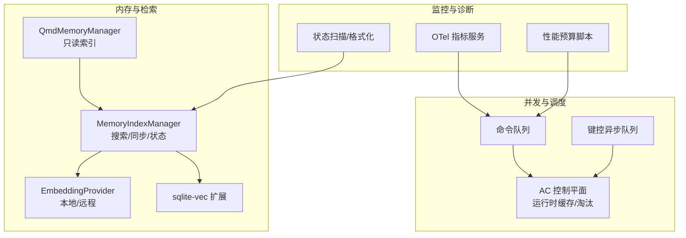
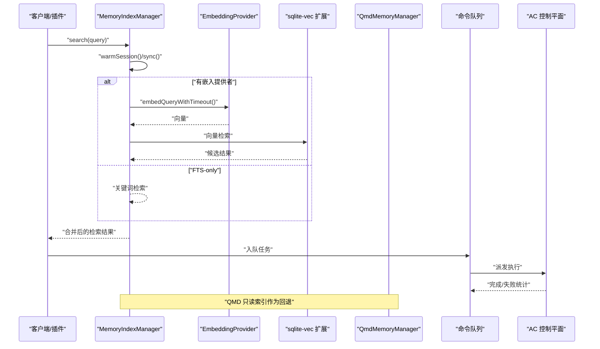
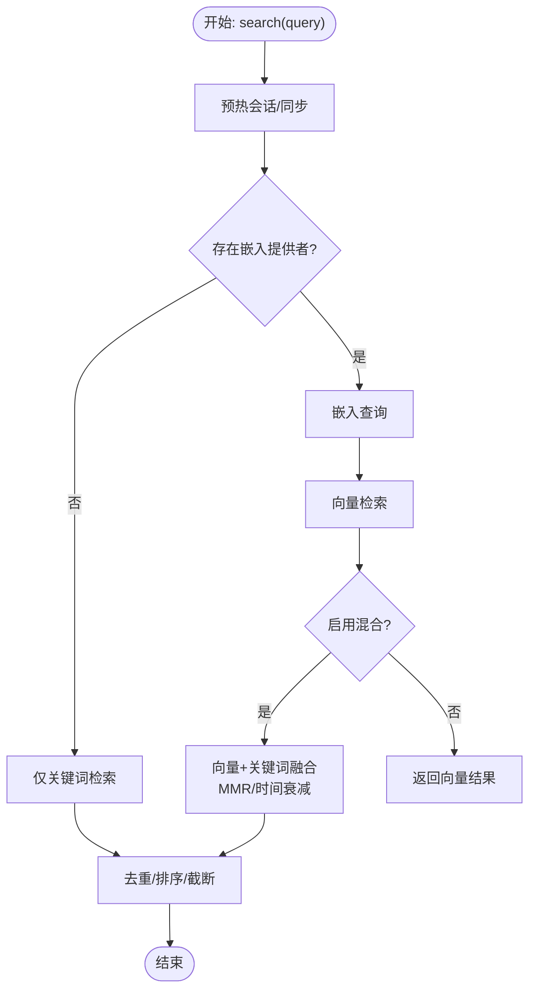
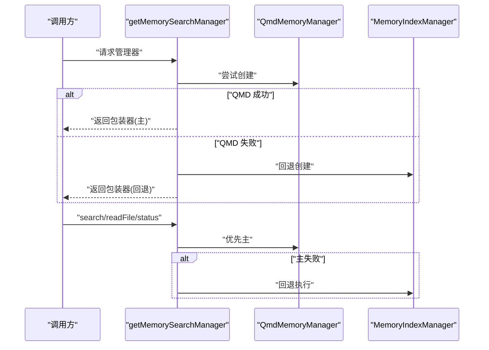
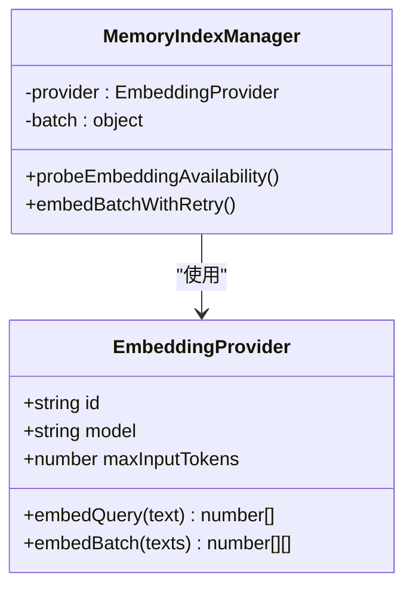
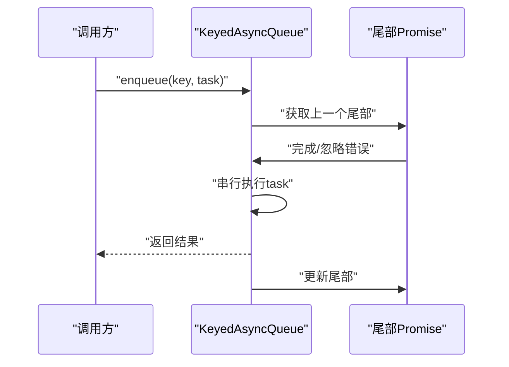
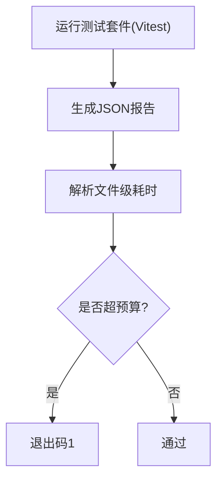
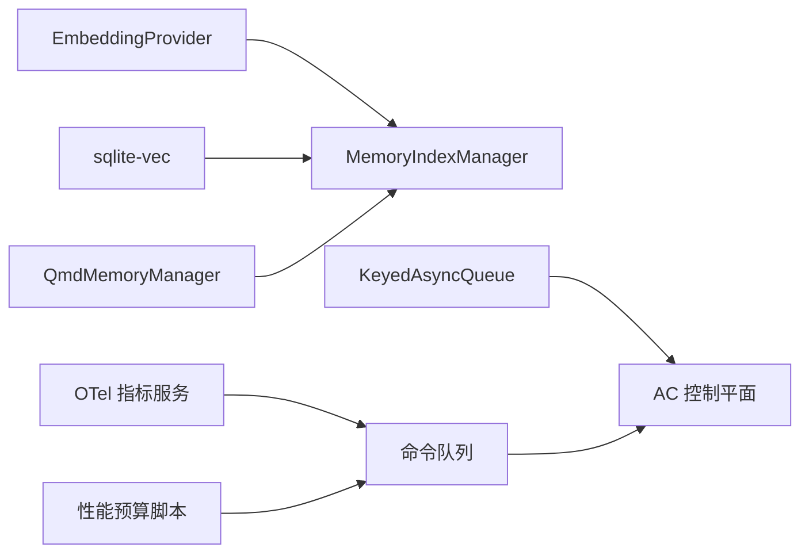

# 性能优化

<cite>
**本文引用的文件**
- [src/memory/manager.ts](file://src/memory/manager.ts)
- [src/memory/search-manager.ts](file://src/memory/search-manager.ts)
- [src/memory/qmd-manager.ts](file://src/memory/qmd-manager.ts)
- [src/memory/embeddings.ts](file://src/memory/embeddings.ts)
- [src/memory/sqlite-vec.ts](file://src/memory/sqlite-vec.ts)
- [src/memory/manager.readonly-recovery.test.ts](file://src/memory/manager.readonly-recovery.test.ts)
- [src/memory/manager.readonly-recovery.test.ts](file://src/memory/manager.readonly-recovery.test.ts)
- [src/auto-reply/status.ts](file://src/auto-reply/status.ts)
- [src/commands/status.scan.ts](file://src/commands/status.scan.ts)
- [src/memory/status-format.ts](file://src/memory/status-format.ts)
- [scripts/test-perf-budget.mjs](file://scripts/test-perf-budget.mjs)
- [src/discord/monitor/thread-bindings.lifecycle.ts](file://src/discord/monitor/thread-bindings.lifecycle.ts)
- [src/acp/control-plane/manager.core.ts](file://src/acp/control-plane/manager.core.ts)
- [src/acp/control-plane/runtime-cache.ts](file://src/acp/control-plane/runtime-cache.ts)
- [src/plugin-sdk/keyed-async-queue.ts](file://src/plugin-sdk/keyed-async-queue.ts)
- [src/process/command-queue.ts](file://src/process/command-queue.ts)
- [src/utils/queue-helpers.ts](file://src/utils/queue-helpers.ts)
- [extensions/diagnostics-otel/src/service.ts](file://extensions/diagnostics-otel/src/service.ts)
- [src/plugin-sdk/webhook-memory-guards.ts](file://src/plugin-sdk/webhook-memory-guards.ts)
- [src/agents/auth-profiles/usage.ts](file://src/agents/auth-profiles/usage.ts)
- [src/agents/memory-search.ts](file://src/agents/memory-search.ts)
- [src/memory/manager.readonly-recovery.test.ts](file://src/memory/manager.readonly-recovery.test.ts)
- [src/memory/qmd-manager.test.ts](file://src/memory/qmd-manager.test.ts)
- [src/memory/qmd-manager.ts](file://src/memory/qmd-manager.ts)
- [src/memory/manager.ts](file://src/memory/manager.ts)
- [src/memory/search-manager.ts](file://src/memory/search-manager.ts)
- [src/memory/embeddings.ts](file://src/memory/embeddings.ts)
- [src/memory/sqlite-vec.ts](file://src/memory/sqlite-vec.ts)
- [src/auto-reply/status.ts](file://src/auto-reply/status.ts)
- [src/commands/status.scan.ts](file://src/commands/status.scan.ts)
- [src/memory/status-format.ts](file://src/memory/status-format.ts)
- [scripts/test-perf-budget.mjs](file://scripts/test-perf-budget.mjs)
- [src/discord/monitor/thread-bindings.lifecycle.ts](file://src/discord/monitor/thread-bindings.lifecycle.ts)
- [src/acp/control-plane/manager.core.ts](file://src/acp/control-plane/manager.core.ts)
- [src/acp/control-plane/runtime-cache.ts](file://src/acp/control-plane/runtime-cache.ts)
- [src/plugin-sdk/keyed-async-queue.ts](file://src/plugin-sdk/keyed-async-queue.ts)
- [src/process/command-queue.ts](file://src/process/command-queue.ts)
- [src/utils/queue-helpers.ts](file://src/utils/queue-helpers.ts)
- [extensions/diagnostics-otel/src/service.ts](file://extensions/diagnostics-otel/src/service.ts)
- [src/plugin-sdk/webhook-memory-guards.ts](file://src/plugin-sdk/webhook-memory-guards.ts)
- [src/agents/auth-profiles/usage.ts](file://src/agents/auth-profiles/usage.ts)
- [src/agents/memory-search.ts](file://src/agents/memory-search.ts)
</cite>

## 目录

1. [简介](#简介)
2. [项目结构](#项目结构)
3. [核心组件](#核心组件)
4. [架构总览](#架构总览)
5. [详细组件分析](#详细组件分析)
6. [依赖关系分析](#依赖关系分析)
7. [性能考量](#性能考量)
8. [故障排查指南](#故障排查指南)
9. [结论](#结论)
10. [附录](#附录)

## 简介

本指南聚焦于系统性能优化，覆盖以下关键主题：

- 性能瓶颈识别：CPU 使用率、内存占用、磁盘 I/O、网络延迟的观测与定位
- 缓存策略优化：Bootstrap 缓存、会话缓存、模型缓存的配置与调优
- 内存管理优化：垃圾回收调优、内存泄漏检测、内存池管理
- 并发处理优化：线程池配置、异步处理、资源池管理
- 数据库查询优化：索引策略、连接池配置、只读恢复机制
- 基准测试与压力测试：性能预算、回归阈值、容量规划

本指南以仓库中的实际实现为依据，结合可操作的配置项与运行时状态，帮助读者在不牺牲功能的前提下获得稳定且可预期的性能表现。

## 项目结构

本项目采用多模块分层组织，与性能相关的核心路径如下：

- 内存子系统：内存索引管理、向量扩展加载、嵌入提供者、只读恢复
- 并发控制：命令队列、键控异步队列、AC 控制平面运行时缓存与淘汰
- 监控与诊断：OTel 指标采集、性能预算脚本、状态快照与格式化
- 插件与网关：Webhook 内存守卫、认证配置使用统计

图示来源

- [src/memory/manager.ts:61-238](file://src/memory/manager.ts#L61-L238)
- [src/memory/search-manager.ts:25-86](file://src/memory/search-manager.ts#L25-L86)
- [src/memory/embeddings.ts:166-200](file://src/memory/embeddings.ts#L166-L200)
- [src/memory/sqlite-vec.ts:3-24](file://src/memory/sqlite-vec.ts#L3-L24)
- [src/process/command-queue.ts:43-123](file://src/process/command-queue.ts#L43-L123)
- [src/plugin-sdk/keyed-async-queue.ts:33-48](file://src/plugin-sdk/keyed-async-queue.ts#L33-L48)
- [src/acp/control-plane/manager.core.ts:1097-1139](file://src/acp/control-plane/manager.core.ts#L1097-L1139)
- [extensions/diagnostics-otel/src/service.ts:201-587](file://extensions/diagnostics-otel/src/service.ts#L201-L587)
- [scripts/test-perf-budget.mjs:15-55](file://scripts/test-perf-budget.mjs#L15-L55)

章节来源

- [src/memory/manager.ts:1-800](file://src/memory/manager.ts#L1-L800)
- [src/memory/search-manager.ts:1-253](file://src/memory/search-manager.ts#L1-L253)
- [src/memory/embeddings.ts:1-200](file://src/memory/embeddings.ts#L1-L200)
- [src/memory/sqlite-vec.ts:1-24](file://src/memory/sqlite-vec.ts#L1-L24)
- [src/process/command-queue.ts:43-123](file://src/process/command-queue.ts#L43-L123)
- [src/plugin-sdk/keyed-async-queue.ts:1-48](file://src/plugin-sdk/keyed-async-queue.ts#L1-L48)
- [src/acp/control-plane/manager.core.ts:1080-1158](file://src/acp/control-plane/manager.core.ts#L1080-L1158)
- [extensions/diagnostics-otel/src/service.ts:201-587](file://extensions/diagnostics-otel/src/service.ts#L201-L587)
- [scripts/test-perf-budget.mjs:1-128](file://scripts/test-perf-budget.mjs#L1-L128)

## 核心组件

- 内存索引管理器（MemoryIndexManager）
  - 负责向量/关键词混合检索、批量嵌入、只读恢复、缓存与状态导出
  - 关键配置点：缓存开关与最大条目、向量维度、FTS 可用性、批处理参数
- QMD 只读索引管理器（QmdMemoryManager）
  - 通过只读数据库提供快速检索；支持回退到内置索引
  - 连接级 busy_timeout 设置，避免 SQLITE_BUSY
- 嵌入提供者（EmbeddingProvider）
  - 支持本地 llama.cpp、Ollama、Gemini、Voyage、Mistral、OpenAI
  - 自动选择与回退策略，错误格式化与可用性探测
- 并发与调度
  - 命令队列：按车道（lane）限流与并发控制，等待时间告警
  - 键控异步队列：同键串行、跨键并行，避免热点竞争
  - ACP 控制平面：运行时缓存与空闲淘汰，降低启动抖动
- 监控与诊断
  - OTel 指标：消息处理时延、队列深度/等待、会话卡住等
  - 性能预算脚本：基于 Vitest 的墙钟时间预算与回归阈值
  - 状态扫描与格式化：内存后端状态、缓存命中率、可用性

章节来源

- [src/memory/manager.ts:61-238](file://src/memory/manager.ts#L61-L238)
- [src/memory/search-manager.ts:104-193](file://src/memory/search-manager.ts#L104-L193)
- [src/memory/qmd-manager.ts:1417-1430](file://src/memory/qmd-manager.ts#L1417-L1430)
- [src/memory/embeddings.ts:166-200](file://src/memory/embeddings.ts#L166-L200)
- [src/process/command-queue.ts:43-123](file://src/process/command-queue.ts#L43-L123)
- [src/plugin-sdk/keyed-async-queue.ts:33-48](file://src/plugin-sdk/keyed-async-queue.ts#L33-L48)
- [src/acp/control-plane/manager.core.ts:1097-1139](file://src/acp/control-plane/manager.core.ts#L1097-L1139)
- [extensions/diagnostics-otel/src/service.ts:201-587](file://extensions/diagnostics-otel/src/service.ts#L201-L587)
- [scripts/test-perf-budget.mjs:61-127](file://scripts/test-perf-budget.mjs#L61-L127)

## 架构总览

下图展示内存检索与并发控制的关键交互，以及监控指标的采集入口。

图示来源

- [src/memory/manager.ts:256-364](file://src/memory/manager.ts#L256-L364)
- [src/memory/embeddings.ts:166-200](file://src/memory/embeddings.ts#L166-L200)
- [src/memory/sqlite-vec.ts:3-24](file://src/memory/sqlite-vec.ts#L3-L24)
- [src/memory/search-manager.ts:104-193](file://src/memory/search-manager.ts#L104-L193)
- [src/process/command-queue.ts:92-123](file://src/process/command-queue.ts#L92-L123)
- [src/acp/control-plane/manager.core.ts:1097-1139](file://src/acp/control-plane/manager.core.ts#L1097-L1139)

## 详细组件分析

### 内存检索与缓存优化

- 混合检索与候选集裁剪
  - 向量与关键词结果按权重融合，并支持 MMR 与时间衰减
  - 候选集数量按倍数放大后再裁剪，平衡召回与性能
- 缓存策略
  - 嵌入缓存表记录条目数，支持最大条目上限
  - QMD 只读连接设置较低 busy_timeout，避免主流程阻塞
- 只读恢复
  - 遇到只读数据库错误时自动重建连接并重试，减少外部锁竞争影响
- 状态导出
  - 提供缓存启用/条目数、FTS/向量可用性、批处理参数、只读恢复统计等

图示来源

- [src/memory/manager.ts:256-364](file://src/memory/manager.ts#L256-L364)
- [src/memory/manager.ts:416-449](file://src/memory/manager.ts#L416-L449)
- [src/memory/manager.ts:626-738](file://src/memory/manager.ts#L626-L738)

章节来源

- [src/memory/manager.ts:256-364](file://src/memory/manager.ts#L256-L364)
- [src/memory/manager.ts:416-449](file://src/memory/manager.ts#L416-L449)
- [src/memory/manager.ts:626-738](file://src/memory/manager.ts#L626-L738)
- [src/memory/manager.readonly-recovery.test.ts:113-122](file://src/memory/manager.readonly-recovery.test.ts#L113-L122)

### QMD 只读索引与回退机制

- 只读连接
  - 使用只读数据库，设置较低 busy_timeout，适合同步查询场景
- 回退策略
  - QMD 失败时切换到内置索引管理器，状态中记录回退原因
- 缓存键
  - 基于 agentId 与解析后的 QMD 配置生成缓存键，避免重复实例化

图示来源

- [src/memory/search-manager.ts:25-86](file://src/memory/search-manager.ts#L25-L86)
- [src/memory/search-manager.ts:104-193](file://src/memory/search-manager.ts#L104-L193)
- [src/memory/qmd-manager.ts:1417-1430](file://src/memory/qmd-manager.ts#L1417-L1430)

章节来源

- [src/memory/search-manager.ts:25-86](file://src/memory/search-manager.ts#L25-L86)
- [src/memory/search-manager.ts:104-193](file://src/memory/search-manager.ts#L104-L193)
- [src/memory/qmd-manager.ts:1417-1430](file://src/memory/qmd-manager.ts#L1417-L1430)

### 嵌入提供者与批处理优化

- 提供者选择与回退
  - 支持本地 llama.cpp、Ollama、Gemini、Voyage、Mistral、OpenAI
  - 自动模式排除 Ollama，避免误判本地可用性
- 批处理与失败抑制
  - 批处理具备失败计数与锁定，超过阈值后降级或等待
- 可用性探测
  - 通过 ping 测试探测嵌入可用性，便于快速失败与降级

图示来源

- [src/memory/embeddings.ts:32-42](file://src/memory/embeddings.ts#L32-L42)
- [src/memory/manager.ts:84-94](file://src/memory/manager.ts#L84-L94)
- [src/memory/manager.ts:751-766](file://src/memory/manager.ts#L751-L766)

章节来源

- [src/memory/embeddings.ts:166-200](file://src/memory/embeddings.ts#L166-L200)
- [src/memory/embeddings.ts:103-164](file://src/memory/embeddings.ts#L103-L164)
- [src/memory/manager.ts:84-94](file://src/memory/manager.ts#L84-L94)
- [src/memory/manager.ts:751-766](file://src/memory/manager.ts#L751-L766)

### 并发与资源池管理

- 命令队列
  - 按车道限制并发，记录等待时长与队列深度，超阈值告警
- 键控异步队列
  - 同一键串行、不同键并行，避免热点争用
- ACP 运行时缓存与空闲淘汰
  - 统计回合时延、错误码分布；定期清理长时间未触碰的运行时句柄

图示来源

- [src/plugin-sdk/keyed-async-queue.ts:33-48](file://src/plugin-sdk/keyed-async-queue.ts#L33-L48)

章节来源

- [src/process/command-queue.ts:43-123](file://src/process/command-queue.ts#L43-L123)
- [src/plugin-sdk/keyed-async-queue.ts:1-48](file://src/plugin-sdk/keyed-async-queue.ts#L1-L48)
- [src/acp/control-plane/manager.core.ts:1097-1139](file://src/acp/control-plane/manager.core.ts#L1097-L1139)
- [src/acp/control-plane/runtime-cache.ts:57-99](file://src/acp/control-plane/runtime-cache.ts#L57-L99)

### 监控与诊断

- OTel 指标
  - 消息处理次数与时延、队列深度/等待、会话卡住与年龄、运行尝试次数
- 性能预算脚本
  - 基于 Vitest 报告统计文件级耗时，对比最大墙钟与基线回归阈值
- 状态快照与格式化
  - 内存后端状态、缓存命中率、可用性提示

图示来源

- [scripts/test-perf-budget.mjs:61-127](file://scripts/test-perf-budget.mjs#L61-L127)

章节来源

- [extensions/diagnostics-otel/src/service.ts:201-587](file://extensions/diagnostics-otel/src/service.ts#L201-L587)
- [scripts/test-perf-budget.mjs:1-128](file://scripts/test-perf-budget.mjs#L1-L128)
- [src/auto-reply/status.ts:306-343](file://src/auto-reply/status.ts#L306-L343)
- [src/commands/status.scan.ts:157-180](file://src/commands/status.scan.ts#L157-L180)
- [src/memory/status-format.ts:1-45](file://src/memory/status-format.ts#L1-L45)

## 依赖关系分析

- 内存检索链路
  - MemoryIndexManager 依赖 EmbeddingProvider 与 sqlite-vec 扩展
  - QmdMemoryManager 作为只读回退，与内置索引管理器并存
- 并发链路
  - 命令队列与键控异步队列共同支撑 ACP 控制平面的任务执行
- 监控链路
  - OTel 指标服务从命令队列与会话状态事件中采集数据
  - 性能预算脚本驱动测试执行并进行回归评估

图示来源

- [src/memory/embeddings.ts:166-200](file://src/memory/embeddings.ts#L166-L200)
- [src/memory/sqlite-vec.ts:3-24](file://src/memory/sqlite-vec.ts#L3-L24)
- [src/memory/manager.ts:61-238](file://src/memory/manager.ts#L61-L238)
- [src/memory/search-manager.ts:104-193](file://src/memory/search-manager.ts#L104-L193)
- [src/process/command-queue.ts:43-123](file://src/process/command-queue.ts#L43-L123)
- [src/plugin-sdk/keyed-async-queue.ts:33-48](file://src/plugin-sdk/keyed-async-queue.ts#L33-L48)
- [extensions/diagnostics-otel/src/service.ts:201-587](file://extensions/diagnostics-otel/src/service.ts#L201-L587)
- [scripts/test-perf-budget.mjs:61-127](file://scripts/test-perf-budget.mjs#L61-L127)

章节来源

- [src/memory/manager.ts:61-238](file://src/memory/manager.ts#L61-L238)
- [src/memory/search-manager.ts:104-193](file://src/memory/search-manager.ts#L104-L193)
- [src/process/command-queue.ts:43-123](file://src/process/command-queue.ts#L43-L123)
- [src/plugin-sdk/keyed-async-queue.ts:1-48](file://src/plugin-sdk/keyed-async-queue.ts#L1-L48)
- [extensions/diagnostics-otel/src/service.ts:201-587](file://extensions/diagnostics-otel/src/service.ts#L201-L587)
- [scripts/test-perf-budget.mjs:1-128](file://scripts/test-perf-budget.mjs#L1-L128)

## 性能考量

- CPU 使用率
  - 向量检索与嵌入计算是主要 CPU 开销来源；可通过候选集放大系数与最小分数阈值控制召回规模
  - 本地嵌入模型初始化成本高，建议复用上下文并避免频繁重建
- 内存占用
  - 嵌入缓存表条目数与最大条目上限直接影响内存占用；合理设置 maxEntries
  - 运行时缓存与只读恢复会增加连接与对象生命周期管理复杂度，需配合淘汰策略
- 磁盘 I/O
  - SQLite WAL 模式下读写分离；只读连接设置较低 busy_timeout，避免主线程阻塞
  - 批处理失败抑制与重试策略减少频繁 I/O
- 网络延迟
  - 远程嵌入提供者（OpenAI/Gemini/Voyage/Mistral）延迟与可用性波动较大，建议启用回退与探测
- 并发与资源池
  - 命令队列按车道限流，避免全局拥塞；键控队列保证热点键串行，降低争用
  - ACP 空闲淘汰降低常驻进程数量，减少上下文切换与内存占用

章节来源

- [src/memory/manager.ts:277-280](file://src/memory/manager.ts#L277-L280)
- [src/memory/manager.ts:689-700](file://src/memory/manager.ts#L689-L700)
- [src/memory/qmd-manager.ts:1417-1430](file://src/memory/qmd-manager.ts#L1417-L1430)
- [src/memory/embeddings.ts:166-200](file://src/memory/embeddings.ts#L166-L200)
- [src/process/command-queue.ts:43-123](file://src/process/command-queue.ts#L43-L123)
- [src/plugin-sdk/keyed-async-queue.ts:33-48](file://src/plugin-sdk/keyed-async-queue.ts#L33-L48)
- [src/acp/control-plane/manager.core.ts:1097-1139](file://src/acp/control-plane/manager.core.ts#L1097-L1139)

## 故障排查指南

- 只读数据库错误
  - 现象：同步过程中出现只读数据库错误
  - 处理：自动重建连接并重试；检查外部锁竞争与权限
- SQLITE_BUSY 与 busy_timeout
  - 现象：只读连接出现 SQLITE_BUSY
  - 处理：设置较低 busy_timeout；必要时缩短查询超时或改用异步查询
- 嵌入提供者不可用
  - 现象：无可用嵌入提供者或探测失败
  - 处理：启用回退策略；检查密钥、网络与模型路径
- 队列积压与等待超时
  - 现象：队列深度上升、等待时间告警
  - 处理：调整车道并发、引入背压或限流；检查下游依赖延迟
- 缓存命中率低
  - 现象：缓存条目数增长缓慢或命中率偏低
  - 处理：增大候选集倍数、放宽最小分数；检查缓存上限与淘汰策略

章节来源

- [src/memory/manager.ts:468-551](file://src/memory/manager.ts#L468-L551)
- [src/memory/manager.readonly-recovery.test.ts:113-122](file://src/memory/manager.readonly-recovery.test.ts#L113-L122)
- [src/memory/qmd-manager.test.ts:2006-2041](file://src/memory/qmd-manager.test.ts#L2006-L2041)
- [src/memory/embeddings.ts:197-199](file://src/memory/embeddings.ts#L197-L199)
- [src/process/command-queue.ts:92-123](file://src/process/command-queue.ts#L92-L123)
- [src/auto-reply/status.ts:315-343](file://src/auto-reply/status.ts#L315-L343)

## 结论

本指南基于仓库中的实际实现，总结了内存检索、并发调度与监控诊断的关键优化点。通过合理配置缓存、批处理与只读恢复策略，结合队列限流与键控串行，可在保证稳定性的同时显著提升吞吐与响应质量。建议在生产环境中持续采集 OTel 指标，配合性能预算脚本进行回归评估，确保长期性能健康。

## 附录

- 性能基准测试与压力测试
  - 使用性能预算脚本对测试套件进行墙钟时间预算与回归阈值校验
  - 在 CI 中集成该脚本，确保回归不恶化
- 容量规划
  - 基于 OTel 指标（队列深度、等待时延、会话卡住）与内存状态（缓存条目、向量维度、FTS/向量可用性）进行容量评估
  - 对热点键与高并发场景进行专项压测，验证键控队列与命令队列的极限

章节来源

- [scripts/test-perf-budget.mjs:1-128](file://scripts/test-perf-budget.mjs#L1-L128)
- [extensions/diagnostics-otel/src/service.ts:201-587](file://extensions/diagnostics-otel/src/service.ts#L201-L587)
- [src/memory/status-format.ts:1-45](file://src/memory/status-format.ts#L1-L45)
- [src/commands/status.scan.ts:157-180](file://src/commands/status.scan.ts#L157-L180)
