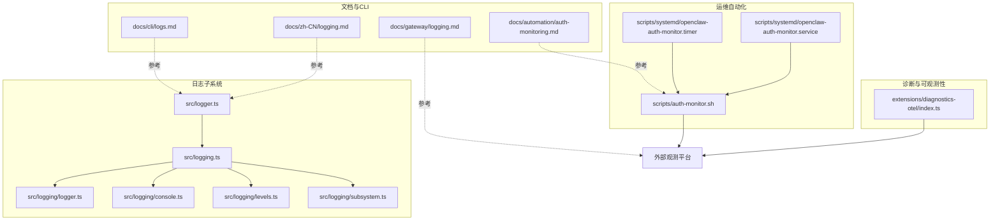
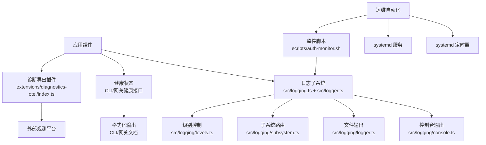
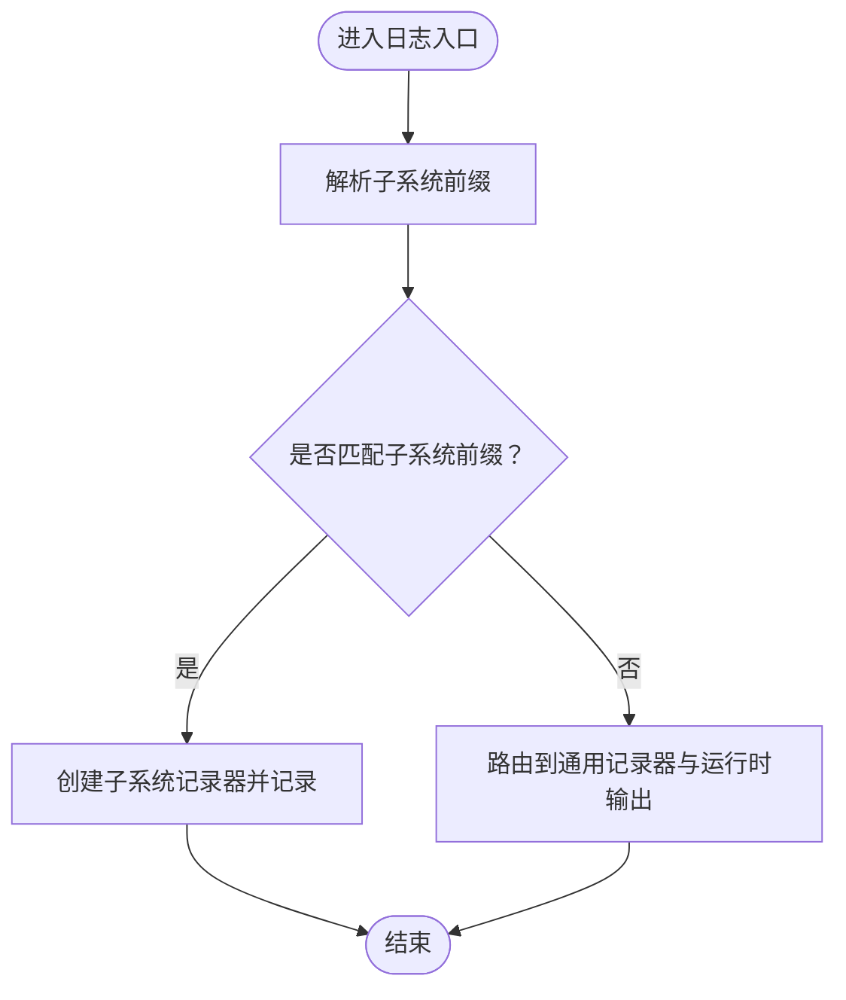
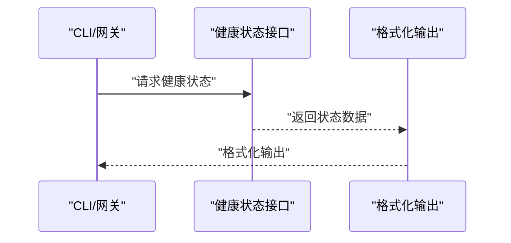
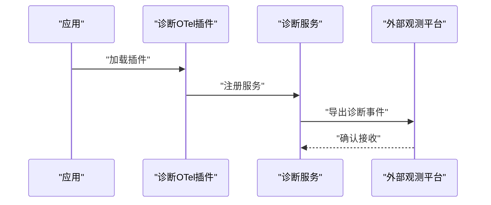
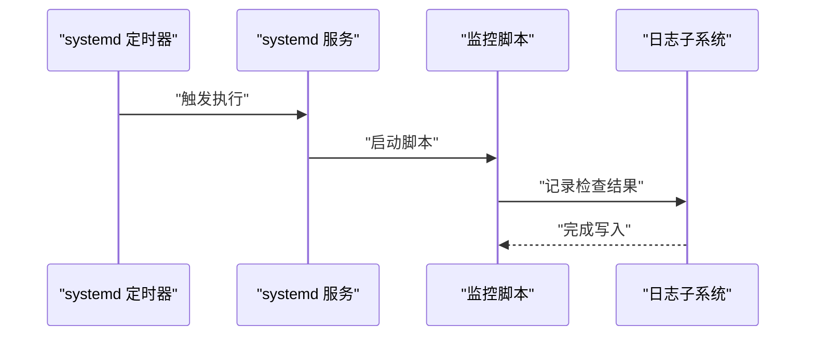
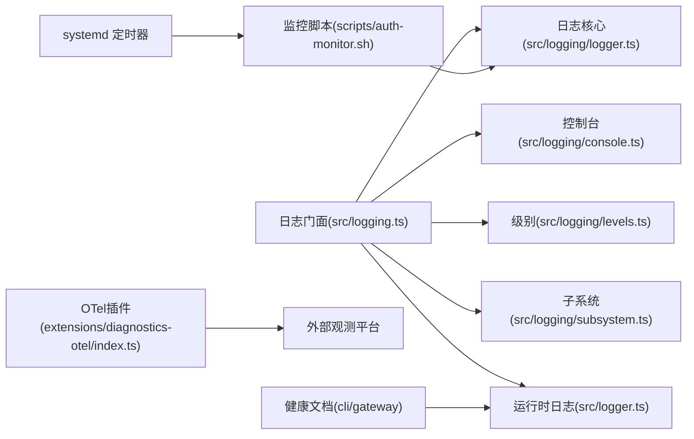

# 监控告警

<cite>
**本文引用的文件**   
- [src/logging.ts](file://src/logging.ts)
- [src/logger.ts](file://src/logger.ts)
- [src/logging/logger.ts](file://src/logging/logger.ts)
- [src/logging/console.ts](file://src/logging/console.ts)
- [src/logging/levels.ts](file://src/logging/levels.ts)
- [src/logging/subsystem.ts](file://src/logging/subsystem.ts)
- [extensions/diagnostics-otel/index.ts](file://extensions/diagnostics-otel/index.ts)
- [scripts/systemd/openclaw-auth-monitor.service](file://scripts/systemd/openclaw-auth-monitor.service)
- [scripts/systemd/openclaw-auth-monitor.timer](file://scripts/systemd/openclaw-auth-monitor.timer)
- [scripts/auth-monitor.sh](file://scripts/auth-monitor.sh)
- [docs/zh-CN/logging.md](file://docs/zh-CN/logging.md)
- [docs/automation/auth-monitoring.md](file://docs/automation/auth-monitoring.md)
- [docs/automation/cron-jobs.md](file://docs/automation/cron-jobs.md)
- [docs/automation/poll.md](file://docs/automation/poll.md)
- [docs/automation/webhook.md](file://docs/automation/webhook.md)
- [docs/cli/logs.md](file://docs/cli/logs.md)
- [docs/gateway/logging.md](file://docs/gateway/logging.md)
- [docs/concepts/architecture.md](file://docs/concepts/architecture.md)
- [docs/start/getting-started.md](file://docs/start/getting-started.md)
</cite>

## 目录

1. [简介](#简介)
2. [项目结构](#项目结构)
3. [核心组件](#核心组件)
4. [架构总览](#架构总览)
5. [详细组件分析](#详细组件分析)
6. [依赖关系分析](#依赖关系分析)
7. [性能考虑](#性能考虑)
8. [故障排查指南](#故障排查指南)
9. [结论](#结论)
10. [附录](#附录)

## 简介

本文件面向监控与告警体系，围绕系统资源使用率、服务健康状态与业务指标三类关键监控维度，结合日志采集、聚合与分析流程（含结构化日志与日志轮转）、告警规则配置与阈值设定、通知渠道集成、性能监控与错误追踪、用户体验监控、可视化与历史趋势分析、容量规划支持，以及自愈机制与运维自动化进行系统性梳理。本文以仓库现有实现为依据，提供可操作的实践建议与扩展方向。

## 项目结构

监控与告警相关能力在本仓库中主要由以下部分组成：

- 日志子系统：统一的日志入口、级别控制、子系统路由与文件落盘
- 健康检查与状态上报：命令行与网关侧的健康接口与格式化输出
- 诊断插件：OpenTelemetry 导出器插件，用于将诊断事件导出到外部观测平台
- 运维自动化：基于 systemd 的定时任务与脚本，支撑认证状态监控等周期性任务
- 文档与CLI：日志与健康状态的使用说明与命令行参考

图表来源

- [src/logging.ts:1-70](file://src/logging.ts#L1-L70)
- [src/logger.ts:1-86](file://src/logger.ts#L1-L86)
- [src/logging/logger.ts](file://src/logging/logger.ts)
- [src/logging/console.ts](file://src/logging/console.ts)
- [src/logging/levels.ts](file://src/logging/levels.ts)
- [src/logging/subsystem.ts](file://src/logging/subsystem.ts)
- [extensions/diagnostics-otel/index.ts:1-16](file://extensions/diagnostics-otel/index.ts#L1-L16)
- [scripts/systemd/openclaw-auth-monitor.service](file://scripts/systemd/openclaw-auth-monitor.service)
- [scripts/systemd/openclaw-auth-monitor.timer](file://scripts/systemd/openclaw-auth-monitor.timer)
- [scripts/auth-monitor.sh](file://scripts/auth-monitor.sh)
- [docs/zh-CN/logging.md](file://docs/zh-CN/logging.md)
- [docs/gateway/logging.md](file://docs/gateway/logging.md)
- [docs/cli/logs.md](file://docs/cli/logs.md)
- [docs/automation/auth-monitoring.md](file://docs/automation/auth-monitoring.md)

章节来源

- [src/logging.ts:1-70](file://src/logging.ts#L1-L70)
- [src/logger.ts:1-86](file://src/logger.ts#L1-L86)
- [extensions/diagnostics-otel/index.ts:1-16](file://extensions/diagnostics-otel/index.ts#L1-L16)
- [scripts/systemd/openclaw-auth-monitor.service](file://scripts/systemd/openclaw-auth-monitor.service)
- [scripts/systemd/openclaw-auth-monitor.timer](file://scripts/systemd/openclaw-auth-monitor.timer)
- [scripts/auth-monitor.sh](file://scripts/auth-monitor.sh)
- [docs/zh-CN/logging.md](file://docs/zh-CN/logging.md)
- [docs/gateway/logging.md](file://docs/gateway/logging.md)
- [docs/cli/logs.md](file://docs/cli/logs.md)
- [docs/automation/auth-monitoring.md](file://docs/automation/auth-monitoring.md)

## 核心组件

- 日志门面与子系统路由
  - 统一入口导出日志能力，并提供子系统前缀解析与路由，便于按模块分发日志
  - 支持控制台与文件双通道输出，级别过滤与冗余前缀清理
- 健康检查与状态展示
  - 提供健康状态查询与格式化输出，便于CLI与自动化集成
- 诊断导出（OTel）
  - 插件注册服务，将诊断事件导出至外部观测平台，支撑指标与追踪
- 运维自动化
  - systemd 定时任务与监控脚本，执行认证状态等周期性检查

章节来源

- [src/logging.ts:1-70](file://src/logging.ts#L1-L70)
- [src/logger.ts:1-86](file://src/logger.ts#L1-L86)
- [extensions/diagnostics-otel/index.ts:1-16](file://extensions/diagnostics-otel/index.ts#L1-L16)
- [scripts/systemd/openclaw-auth-monitor.service](file://scripts/systemd/openclaw-auth-monitor.service)
- [scripts/systemd/openclaw-auth-monitor.timer](file://scripts/systemd/openclaw-auth-monitor.timer)
- [scripts/auth-monitor.sh](file://scripts/auth-monitor.sh)

## 架构总览

下图展示了从应用到日志、健康状态、诊断导出与运维自动化之间的交互路径：

图表来源

- [src/logging.ts:1-70](file://src/logging.ts#L1-L70)
- [src/logger.ts:1-86](file://src/logger.ts#L1-L86)
- [src/logging/console.ts](file://src/logging/console.ts)
- [src/logging/logger.ts](file://src/logging/logger.ts)
- [src/logging/subsystem.ts](file://src/logging/subsystem.ts)
- [src/logging/levels.ts](file://src/logging/levels.ts)
- [extensions/diagnostics-otel/index.ts:1-16](file://extensions/diagnostics-otel/index.ts#L1-L16)
- [scripts/systemd/openclaw-auth-monitor.service](file://scripts/systemd/openclaw-auth-monitor.service)
- [scripts/systemd/openclaw-auth-monitor.timer](file://scripts/systemd/openclaw-auth-monitor.timer)
- [scripts/auth-monitor.sh](file://scripts/auth-monitor.sh)

## 详细组件分析

### 日志子系统（结构化、级别与子系统）

- 结构化日志
  - 通过子系统前缀解析，将消息拆分为“子系统: 消息体”，并路由到对应子系统记录器，便于结构化检索与聚合
- 级别控制
  - 提供允许的日志级别集合与归一化逻辑，支持最小级别过滤与文件级别开关
- 输出通道
  - 控制台与文件双通道，控制台可选择时间戳前缀、子系统过滤与冗余前缀清理；文件默认落盘目录与文件名常量可配置
- 子系统路由
  - 将带前缀的消息定向到子系统记录器，未匹配则回退到通用记录器与运行时输出

图表来源

- [src/logger.ts:20-35](file://src/logger.ts#L20-L35)
- [src/logging/subsystem.ts](file://src/logging/subsystem.ts)
- [src/logging.ts:27-32](file://src/logging.ts#L27-L32)

章节来源

- [src/logger.ts:1-86](file://src/logger.ts#L1-L86)
- [src/logging.ts:1-70](file://src/logging.ts#L1-L70)
- [src/logging/subsystem.ts](file://src/logging/subsystem.ts)
- [src/logging/levels.ts](file://src/logging/levels.ts)
- [src/logging/console.ts](file://src/logging/console.ts)
- [src/logging/logger.ts](file://src/logging/logger.ts)

### 健康检查与状态展示

- CLI与网关健康接口
  - 提供健康状态查询与格式化输出，便于在自动化流程中调用与展示
- 配置与使用
  - 参考CLI与网关文档，明确健康端点、输出格式与集成方式

图表来源

- [docs/cli/logs.md](file://docs/cli/logs.md)
- [docs/gateway/logging.md](file://docs/gateway/logging.md)

章节来源

- [docs/cli/logs.md](file://docs/cli/logs.md)
- [docs/gateway/logging.md](file://docs/gateway/logging.md)

### 诊断导出（OpenTelemetry）

- 插件注册
  - 通过插件入口注册诊断服务，将诊断事件导出到外部观测平台
- 扩展性
  - 可在此基础上扩展指标、追踪与日志的统一导出

图表来源

- [extensions/diagnostics-otel/index.ts:1-16](file://extensions/diagnostics-otel/index.ts#L1-L16)

章节来源

- [extensions/diagnostics-otel/index.ts:1-16](file://extensions/diagnostics-otel/index.ts#L1-L16)

### 运维自动化（定时任务与监控脚本）

- systemd 定时器与服务
  - 通过定时器触发服务执行，适合周期性健康检查、认证状态监控等任务
- 监控脚本
  - 脚本负责具体检查逻辑，并将结果写入日志或输出到标准流，便于后续处理

图表来源

- [scripts/systemd/openclaw-auth-monitor.timer](file://scripts/systemd/openclaw-auth-monitor.timer)
- [scripts/systemd/openclaw-auth-monitor.service](file://scripts/systemd/openclaw-auth-monitor.service)
- [scripts/auth-monitor.sh](file://scripts/auth-monitor.sh)
- [src/logging.ts:1-70](file://src/logging.ts#L1-L70)

章节来源

- [scripts/systemd/openclaw-auth-monitor.timer](file://scripts/systemd/openclaw-auth-monitor.timer)
- [scripts/systemd/openclaw-auth-monitor.service](file://scripts/systemd/openclaw-auth-monitor.service)
- [scripts/auth-monitor.sh](file://scripts/auth-monitor.sh)
- [src/logging.ts:1-70](file://src/logging.ts#L1-L70)

## 依赖关系分析

- 组件耦合
  - 日志子系统通过统一入口导出能力，降低上层对具体实现的耦合
  - 健康状态与诊断导出作为独立模块，通过CLI/网关与插件机制接入
  - 运维自动化与日志子系统解耦，仅依赖标准输出与文件落盘
- 外部依赖
  - 诊断导出依赖外部观测平台（OTel导出器），需在部署环境配置相应端点与凭据

图表来源

- [src/logging.ts:1-70](file://src/logging.ts#L1-L70)
- [src/logger.ts:1-86](file://src/logger.ts#L1-L86)
- [src/logging/logger.ts](file://src/logging/logger.ts)
- [src/logging/console.ts](file://src/logging/console.ts)
- [src/logging/levels.ts](file://src/logging/levels.ts)
- [src/logging/subsystem.ts](file://src/logging/subsystem.ts)
- [extensions/diagnostics-otel/index.ts:1-16](file://extensions/diagnostics-otel/index.ts#L1-L16)
- [scripts/systemd/openclaw-auth-monitor.timer](file://scripts/systemd/openclaw-auth-monitor.timer)
- [scripts/auth-monitor.sh](file://scripts/auth-monitor.sh)

章节来源

- [src/logging.ts:1-70](file://src/logging.ts#L1-L70)
- [src/logger.ts:1-86](file://src/logger.ts#L1-L86)
- [extensions/diagnostics-otel/index.ts:1-16](file://extensions/diagnostics-otel/index.ts#L1-L16)
- [scripts/systemd/openclaw-auth-monitor.timer](file://scripts/systemd/openclaw-auth-monitor.timer)
- [scripts/auth-monitor.sh](file://scripts/auth-monitor.sh)

## 性能考虑

- 日志级别与过滤
  - 使用级别归一化与最小级别过滤减少不必要的序列化与IO开销
- 子系统路由
  - 通过子系统前缀快速分流，避免全局扫描，提升解析效率
- 文件落盘
  - 合理设置日志目录与文件名，结合外部轮转策略（如 logrotate）降低单文件过大带来的IO压力
- 导出链路
  - OTel导出应配置批量大小、超时与重试，避免阻塞主业务线程

## 故障排查指南

- 日志无法输出到文件
  - 检查文件级别开关与落盘目录权限，确认日志级别与最小级别过滤设置
- 控制台输出异常
  - 检查控制台时间戳前缀、子系统过滤与冗余前缀清理设置
- 健康状态不更新
  - 校验CLI/网关健康接口可用性与格式化输出配置
- OTel导出失败
  - 检查外部观测平台端点、认证与网络连通性
- 定时任务未执行
  - 检查 systemd 定时器与服务状态，确认脚本可执行权限与日志输出

章节来源

- [src/logging/logger.ts](file://src/logging/logger.ts)
- [src/logging/console.ts](file://src/logging/console.ts)
- [src/logging/levels.ts](file://src/logging/levels.ts)
- [src/logging/subsystem.ts](file://src/logging/subsystem.ts)
- [docs/cli/logs.md](file://docs/cli/logs.md)
- [docs/gateway/logging.md](file://docs/gateway/logging.md)
- [extensions/diagnostics-otel/index.ts:1-16](file://extensions/diagnostics-otel/index.ts#L1-L16)
- [scripts/systemd/openclaw-auth-monitor.timer](file://scripts/systemd/openclaw-auth-monitor.timer)
- [scripts/systemd/openclaw-auth-monitor.service](file://scripts/systemd/openclaw-auth-monitor.service)
- [scripts/auth-monitor.sh](file://scripts/auth-monitor.sh)

## 结论

本仓库提供了完善的日志子系统、健康状态接口与OTel导出插件，配合systemd定时任务与监控脚本，形成从采集、聚合到导出与自动化的监控告警基础能力。建议在生产环境中结合外部观测平台完善指标与追踪，同时制定日志轮转与告警阈值策略，持续优化性能与可靠性。

## 附录

- 关键文档索引
  - 日志子系统与使用：[docs/zh-CN/logging.md](file://docs/zh-CN/logging.md)
  - CLI日志参考：[docs/cli/logs.md](file://docs/cli/logs.md)
  - 网关日志参考：[docs/gateway/logging.md](file://docs/gateway/logging.md)
  - 认证监控自动化：[docs/automation/auth-monitoring.md](file://docs/automation/auth-monitoring.md)
  - 周期性任务与轮询：[docs/automation/cron-jobs.md](file://docs/automation/cron-jobs.md)、[docs/automation/poll.md](file://docs/automation/poll.md)
  - Webhook与通知：[docs/automation/webhook.md](file://docs/automation/webhook.md)
  - 架构概览：[docs/concepts/architecture.md](file://docs/concepts/architecture.md)
  - 快速开始与安装：[docs/start/getting-started.md](file://docs/start/getting-started.md)
