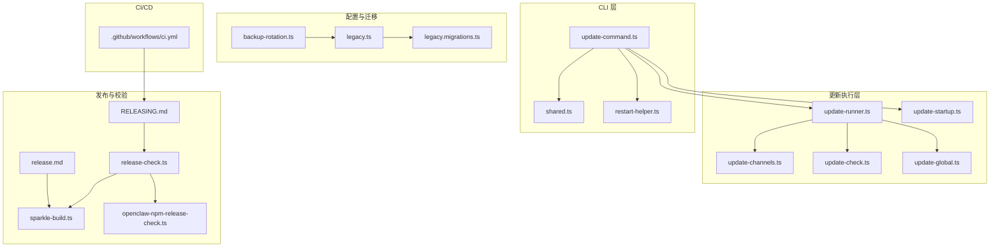
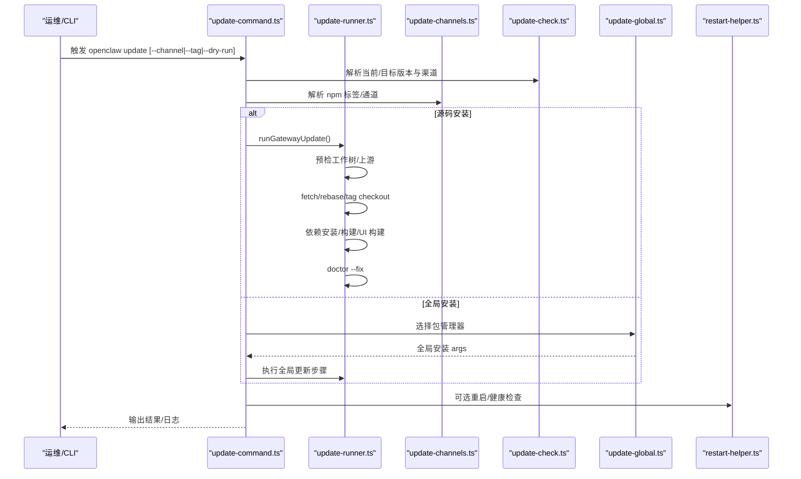
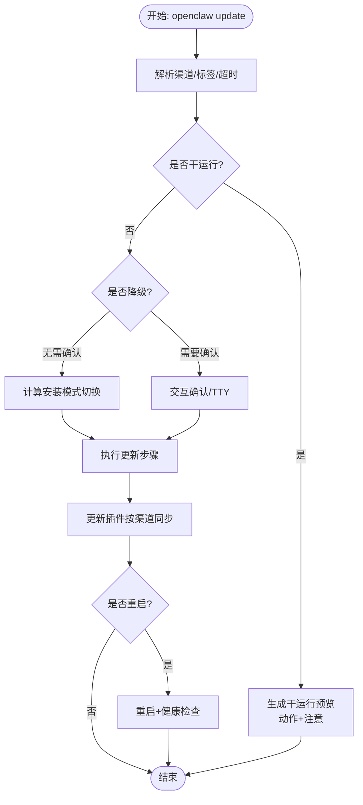
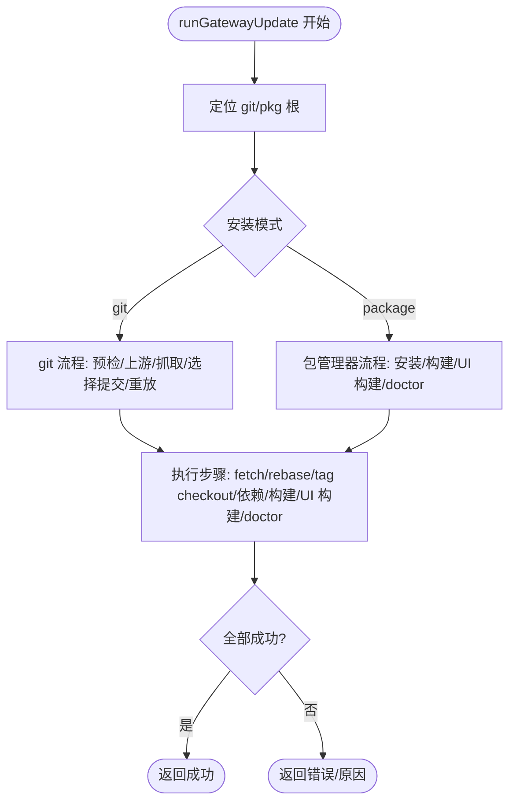
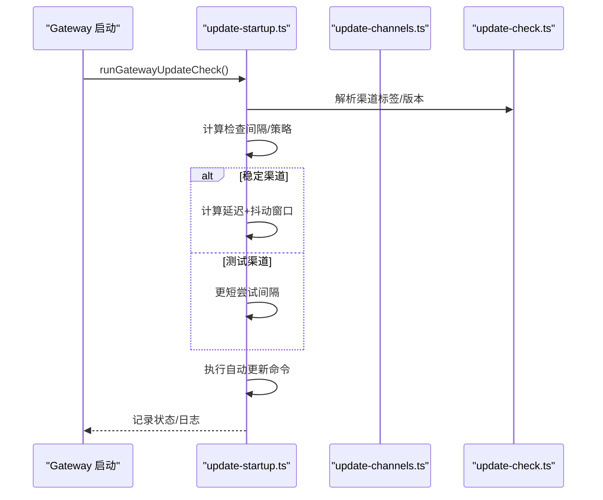
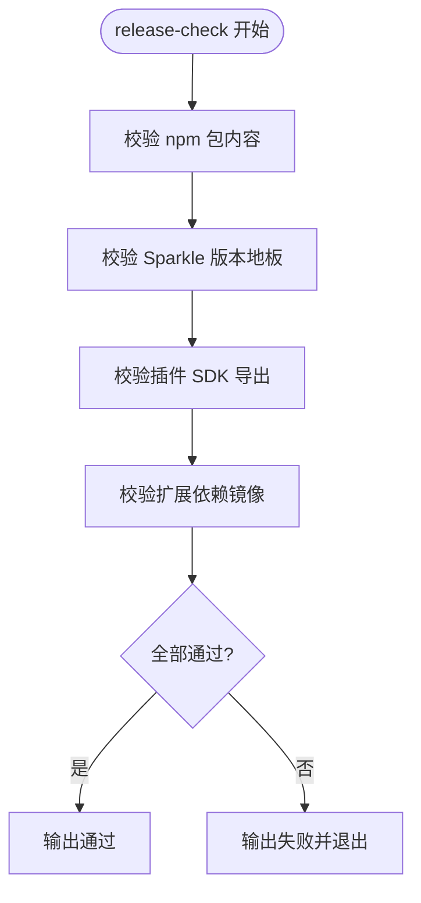
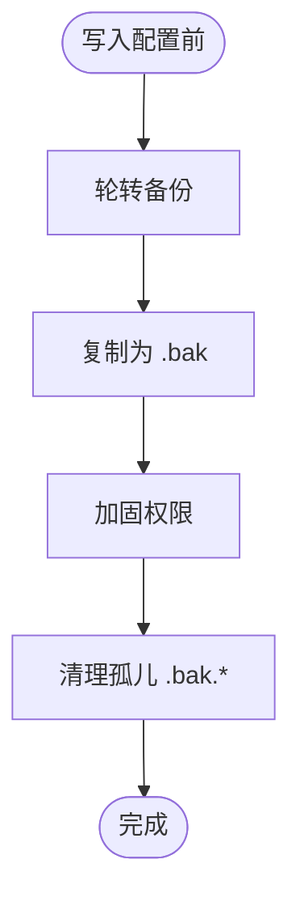
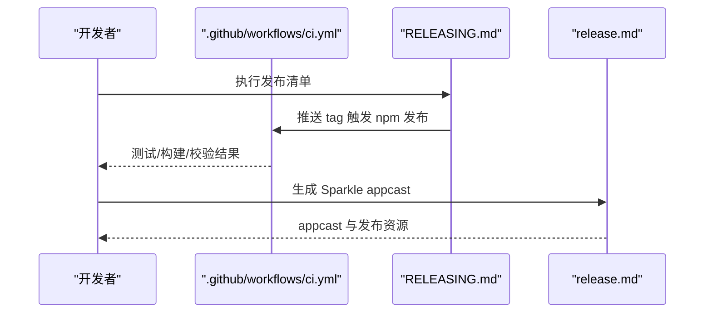
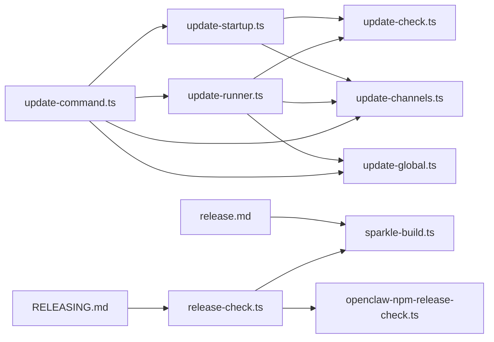

# 维护更新

<cite>
**本文引用的文件**
- [update-command.ts](file://src/cli/update-cli/update-command.ts)
- [update-runner.ts](file://src/infra/update-runner.ts)
- [update-startup.ts](file://src/infra/update-startup.ts)
- [update-channels.ts](file://src/infra/update-channels.ts)
- [update-check.ts](file://src/infra/update-check.ts)
- [update-global.ts](file://src/infra/update-global.ts)
- [shared.ts](file://src/cli/update-cli/shared.ts)
- [restart-helper.ts](file://src/cli/update-cli/restart-helper.ts)
- [daemon-cli/restart-health.ts](file://src/cli/daemon-cli/restart-health.ts)
- [release-check.ts](file://scripts/release-check.ts)
- [sparkle-build.ts](file://scripts/sparkle-build.ts)
- [openclaw-npm-release-check.ts](file://scripts/openclaw-npm-release-check.ts)
- [updating.md](file://docs/zh-CN/install/updating.md)
- [RELEASING.md](file://docs/reference/RELEASING.md)
- [release.md](file://docs/zh-CN/platforms/mac/release.md)
- [ci.yml](file://.github/workflows/ci.yml)
- [backup-rotation.ts](file://src/config/backup-rotation.ts)
- [legacy.ts](file://src/config/legacy.ts)
- [legacy.migrations.ts](file://src/config/legacy.migrations.ts)
- [delivery-queue.ts](file://src/infra/outbound/delivery-queue.ts)
- [outbound.test.ts](file://src/infra/outbound/outbound.test.ts)
- [ghsa-patch.mjs](file://scripts/ghsa-patch.mjs)
- [45-plugin-release.prose](file://extensions/open-prose/skills/prose/examples/45-plugin-release.prose)
</cite>

## 目录

1. [简介](#简介)
2. [项目结构](#项目结构)
3. [核心组件](#核心组件)
4. [架构总览](#架构总览)
5. [详细组件分析](#详细组件分析)
6. [依赖关系分析](#依赖关系分析)
7. [性能考量](#性能考量)
8. [故障排查指南](#故障排查指南)
9. [结论](#结论)
10. [附录](#附录)

## 简介

本文件面向维护与运营团队，系统化阐述 OpenClaw 的维护更新标准操作程序（SOP）。内容覆盖版本发布、变更管理、平滑升级策略、补丁与安全更新、紧急修复流程、维护窗口规划与停机最小化、业务影响评估、配置与数据迁移、向后兼容保障、回滚与故障恢复、应急响应、自动化部署与滚动发布（蓝绿/金丝雀）实践，以及更新前后检查清单、验证与用户通知机制。

## 项目结构

围绕“更新”的关键代码与文档分布如下：

- CLI 更新命令与流程：src/cli/update-cli/\*
- 更新执行器与通道解析：src/infra/update-\*.ts
- 发布校验与 Sparkle 版本计算：scripts/release-check.ts、scripts/sparkle-build.ts、scripts/openclaw-npm-release-check.ts
- 文档与发布清单：docs/reference/RELEASING.md、docs/zh-CN/platforms/mac/release.md、docs/zh-CN/install/updating.md
- CI 流水线：.github/workflows/ci.yml
- 配置备份与迁移：src/config/backup-rotation.ts、src/config/legacy\*.ts
- 恢复与重试队列：src/infra/outbound/delivery-queue.ts、src/infra/outbound/outbound.test.ts
- 安全补丁脚本：scripts/ghsa-patch.mjs
- 插件发布流程：extensions/open-prose/skills/prose/examples/45-plugin-release.prose

图表来源

- [update-command.ts:630-800](file://src/cli/update-cli/update-command.ts#L630-L800)
- [update-runner.ts:320-420](file://src/infra/update-runner.ts#L320-L420)
- [update-startup.ts:300-380](file://src/infra/update-startup.ts#L300-L380)
- [release-check.ts:407-446](file://scripts/release-check.ts#L407-L446)
- [sparkle-build.ts:14-57](file://scripts/sparkle-build.ts#L14-L57)
- [openclaw-npm-release-check.ts:159-196](file://scripts/openclaw-npm-release-check.ts#L159-L196)
- [updating.md:1-234](file://docs/zh-CN/install/updating.md#L1-L234)
- [RELEASING.md:1-152](file://docs/reference/RELEASING.md#L1-L152)
- [release.md:1-93](file://docs/zh-CN/platforms/mac/release.md#L1-L93)
- [ci.yml:1-737](file://.github/workflows/ci.yml#L1-L737)
- [backup-rotation.ts:115-125](file://src/config/backup-rotation.ts#L115-L125)
- [legacy.ts:42-58](file://src/config/legacy.ts#L42-L58)
- [legacy.migrations.ts:1-9](file://src/config/legacy.migrations.ts#L1-L9)

章节来源

- [update-command.ts:630-800](file://src/cli/update-cli/update-command.ts#L630-L800)
- [update-runner.ts:320-420](file://src/infra/update-runner.ts#L320-L420)
- [update-startup.ts:300-380](file://src/infra/update-startup.ts#L300-L380)
- [release-check.ts:407-446](file://scripts/release-check.ts#L407-L446)
- [sparkle-build.ts:14-57](file://scripts/sparkle-build.ts#L14-L57)
- [openclaw-npm-release-check.ts:159-196](file://scripts/openclaw-npm-release-check.ts#L159-L196)
- [updating.md:1-234](file://docs/zh-CN/install/updating.md#L1-L234)
- [RELEASING.md:1-152](file://docs/reference/RELEASING.md#L1-L152)
- [release.md:1-93](file://docs/zh-CN/platforms/mac/release.md#L1-L93)
- [ci.yml:1-737](file://.github/workflows/ci.yml#L1-L737)
- [backup-rotation.ts:115-125](file://src/config/backup-rotation.ts#L115-L125)
- [legacy.ts:42-58](file://src/config/legacy.ts#L42-L58)
- [legacy.migrations.ts:1-9](file://src/config/legacy.migrations.ts#L1-L9)

## 核心组件

- 更新命令与交互：负责解析渠道、版本、干运行预览、降级确认、插件同步、重启与诊断。
- 更新执行器：根据安装模式（git/pnpm/npm）执行 fetch/rebase/build/doctor，支持预检工作树与失败回滚。
- 自动更新调度：按稳定/测试渠道策略延迟与抖动，避免集中升级。
- 发布校验：校验 npm 包内容、Sparkle 版本地板、插件 SDK 导出完整性、扩展依赖镜像一致性。
- 配置备份与迁移：环形轮转备份、权限加固、孤儿清理；遗留配置迁移。
- CI/CD：多平台测试矩阵、文档变更检测、发布流水线触发。
- 安全补丁：GHSA 补丁脚本与发布校验联动，确保版本范围与补丁版本正确。

章节来源

- [update-command.ts:630-800](file://src/cli/update-cli/update-command.ts#L630-L800)
- [update-runner.ts:320-420](file://src/infra/update-runner.ts#L320-L420)
- [update-startup.ts:409-482](file://src/infra/update-startup.ts#L409-L482)
- [release-check.ts:407-446](file://scripts/release-check.ts#L407-L446)
- [backup-rotation.ts:115-125](file://src/config/backup-rotation.ts#L115-L125)
- [legacy.ts:42-58](file://src/config/legacy.ts#L42-L58)
- [ci.yml:1-737](file://.github/workflows/ci.yml#L1-L737)
- [ghsa-patch.mjs:94-168](file://scripts/ghsa-patch.mjs#L94-L168)

## 架构总览

下图展示“更新”主流程：CLI 命令调用更新执行器，依据安装模式与渠道进行 fetch/rebase/build/doctor，随后可选重启与 doctor 检查；自动更新在启动时按策略延后执行。

图表来源

- [update-command.ts:630-800](file://src/cli/update-cli/update-command.ts#L630-L800)
- [update-runner.ts:320-420](file://src/infra/update-runner.ts#L320-L420)
- [update-channels.ts:15-21](file://src/infra/update-channels.ts#L15-L21)
- [update-check.ts:22-25](file://src/infra/update-check.ts#L22-L25)
- [update-global.ts:24-28](file://src/infra/update-global.ts#L24-L28)
- [restart-helper.ts:1-50](file://src/cli/update-cli/restart-helper.ts#L1-L50)

## 详细组件分析

### 更新命令与流程（update-command.ts）

- 支持渠道切换（stable/beta/dev）、显式标签/版本、干运行预览、降级确认、插件同步与重启。
- 预览阶段输出计划动作与注意事项，便于评审与回滚准备。
- 与 doctor、重启助手、守护进程重启健康检查协同，确保更新后服务可用。

图表来源

- [update-command.ts:630-800](file://src/cli/update-cli/update-command.ts#L630-L800)

章节来源

- [update-command.ts:630-800](file://src/cli/update-cli/update-command.ts#L630-L800)

### 更新执行器（update-runner.ts）

- 源码安装：预检工作树（无未提交更改）、dev 渠道 rebase、稳定/测试标签 checkout、依赖安装、构建、UI 构建、doctor。
- 全局安装：检测包管理器，执行全局安装步骤，失败回滚。
- 失败场景：checkout/rebase/fetch/构建/doctor 任一步骤失败均终止并返回错误信息。

图表来源

- [update-runner.ts:320-420](file://src/infra/update-runner.ts#L320-L420)

章节来源

- [update-runner.ts:320-420](file://src/infra/update-runner.ts#L320-L420)

### 自动更新调度（update-startup.ts）

- 启动时按策略决定是否提示更新、是否自动尝试更新。
- 稳定渠道采用延迟与抖动窗口，避免集中升级；测试渠道更频繁尝试。
- 记录尝试/成功时间，防止重复尝试同一版本。

图表来源

- [update-startup.ts:409-482](file://src/infra/update-startup.ts#L409-L482)

章节来源

- [update-startup.ts:409-482](file://src/infra/update-startup.ts#L409-L482)

### 发布校验与 Sparkle 版本（release-check.ts、sparkle-build.ts、openclaw-npm-release-check.ts）

- npm 包内容校验：必需 dist 文件、禁止打包 app bundle、插件 SDK 导出完整性。
- Sparkle 版本地板：基于 CalVer 短版本推导 legacy/lane 地板，确保 appcast 版本合规。
- npm 发布校验：版本格式、CalVer 日期偏差限制、package.json 与 tag 一致性。

图表来源

- [release-check.ts:407-446](file://scripts/release-check.ts#L407-L446)
- [sparkle-build.ts:14-57](file://scripts/sparkle-build.ts#L14-L57)
- [openclaw-npm-release-check.ts:159-196](file://scripts/openclaw-npm-release-check.ts#L159-L196)

章节来源

- [release-check.ts:407-446](file://scripts/release-check.ts#L407-L446)
- [sparkle-build.ts:14-57](file://scripts/sparkle-build.ts#L14-L57)
- [openclaw-npm-release-check.ts:159-196](file://scripts/openclaw-npm-release-check.ts#L159-L196)

### 配置备份与迁移（backup-rotation.ts、legacy.ts、legacy.migrations.ts）

- 备份维护：环形轮转、创建 .bak、权限加固、孤儿清理。
- 遗留迁移：对旧配置键与路径进行迁移，记录变更。

图表来源

- [backup-rotation.ts:115-125](file://src/config/backup-rotation.ts#L115-L125)

章节来源

- [backup-rotation.ts:115-125](file://src/config/backup-rotation.ts#L115-L125)
- [legacy.ts:42-58](file://src/config/legacy.ts#L42-L58)
- [legacy.migrations.ts:1-9](file://src/config/legacy.migrations.ts#L1-L9)

### CI/CD 与发布（ci.yml、RELEASING.md、release.md）

- CI：按文档变更检测跳过重型任务，按变更范围矩阵化运行测试与构建。
- 发布：日期版本规范、校验 npm 包、macOS Sparkle appcast、GitHub 发布与验证。

图表来源

- [ci.yml:1-737](file://.github/workflows/ci.yml#L1-L737)
- [RELEASING.md:1-152](file://docs/reference/RELEASING.md#L1-L152)
- [release.md:1-93](file://docs/zh-CN/platforms/mac/release.md#L1-L93)

章节来源

- [ci.yml:1-737](file://.github/workflows/ci.yml#L1-L737)
- [RELEASING.md:1-152](file://docs/reference/RELEASING.md#L1-L152)
- [release.md:1-93](file://docs/zh-CN/platforms/mac/release.md#L1-L93)

### 安全补丁与紧急修复（ghsa-patch.mjs、openclaw-npm-release-check.ts）

- GHSA 补丁：构造补丁载荷，更新 Advisory，支持 CVSS 恢复。
- 发布校验：版本格式与 CalVer 日期偏差约束，避免错误发布。

章节来源

- [ghsa-patch.mjs:94-168](file://scripts/ghsa-patch.mjs#L94-L168)
- [openclaw-npm-release-check.ts:159-196](file://scripts/openclaw-npm-release-check.ts#L159-L196)

### 插件发布流程（45-plugin-release.prose）

- 从变更分析、impact 分类、版本确定到并行生成发布工件与验证，形成闭环。

章节来源

- [45-plugin-release.prose:47-159](file://extensions/open-prose/skills/prose/examples/45-plugin-release.prose#L47-L159)

## 依赖关系分析

- CLI 更新命令依赖更新执行器、通道解析、全局安装检测与重启助手。
- 更新执行器依赖通道解析、包管理器检测、包版本读取与 doctor。
- 自动更新调度依赖配置加载、策略计算与命令执行。
- 发布校验依赖 Sparkle 版本工具与 npm 校验脚本。
- CI 依赖发布清单与平台发布文档。

图表来源

- [update-command.ts:630-800](file://src/cli/update-cli/update-command.ts#L630-L800)
- [update-runner.ts:320-420](file://src/infra/update-runner.ts#L320-L420)
- [update-startup.ts:409-482](file://src/infra/update-startup.ts#L409-L482)
- [release-check.ts:407-446](file://scripts/release-check.ts#L407-L446)
- [sparkle-build.ts:14-57](file://scripts/sparkle-build.ts#L14-L57)
- [openclaw-npm-release-check.ts:159-196](file://scripts/openclaw-npm-release-check.ts#L159-L196)
- [RELEASING.md:1-152](file://docs/reference/RELEASING.md#L1-L152)
- [release.md:1-93](file://docs/zh-CN/platforms/mac/release.md#L1-L93)

章节来源

- [update-command.ts:630-800](file://src/cli/update-cli/update-command.ts#L630-L800)
- [update-runner.ts:320-420](file://src/infra/update-runner.ts#L320-L420)
- [update-startup.ts:409-482](file://src/infra/update-startup.ts#L409-L482)
- [release-check.ts:407-446](file://scripts/release-check.ts#L407-L446)
- [sparkle-build.ts:14-57](file://scripts/sparkle-build.ts#L14-L57)
- [openclaw-npm-release-check.ts:159-196](file://scripts/openclaw-npm-release-check.ts#L159-L196)
- [RELEASING.md:1-152](file://docs/reference/RELEASING.md#L1-L152)
- [release.md:1-93](file://docs/zh-CN/platforms/mac/release.md#L1-L93)

## 性能考量

- 自动更新延迟与抖动：稳定渠道引入延迟与抖动窗口，降低集中升级带来的瞬时压力。
- CI 任务分流：按文档变更与变更范围矩阵化运行，减少不必要的重型任务。
- 预检工作树：在源码更新前进行预检，避免无效构建与失败重试。
- 发布校验前置：在 CI 中尽早发现包内容与版本问题，缩短反馈周期。

章节来源

- [update-startup.ts:424-435](file://src/infra/update-startup.ts#L424-L435)
- [ci.yml:1-737](file://.github/workflows/ci.yml#L1-L737)
- [update-runner.ts:531-625](file://src/infra/update-runner.ts#L531-L625)
- [release-check.ts:407-446](file://scripts/release-check.ts#L407-L446)

## 故障排查指南

- Doctor 优先：任何更新后问题，先运行 doctor 以修复迁移与配置问题。
- 回滚策略：固定版本（npm/pnpm）或按日期 checkout（git）。
- 重启与健康检查：通过重启助手与健康检查确保服务可用。
- 恢复与重试：消息投递队列具备退避与恢复逻辑，支持崩溃后恢复。
- 配置备份：更新前自动轮转备份，必要时回滚至最近 .bak。

章节来源

- [updating.md:145-234](file://docs/zh-CN/install/updating.md#L145-L234)
- [restart-helper.ts:1-50](file://src/cli/update-cli/restart-helper.ts#L1-L50)
- [daemon-cli/restart-health.ts:1-50](file://src/cli/daemon-cli/restart-health.ts#L1-L50)
- [delivery-queue.ts:244-276](file://src/infra/outbound/delivery-queue.ts#L244-L276)
- [outbound.test.ts:277-547](file://src/infra/outbound/outbound.test.ts#L277-L547)
- [backup-rotation.ts:115-125](file://src/config/backup-rotation.ts#L115-L125)

## 结论

通过 CLI 更新命令、更新执行器、自动更新调度、发布校验与 CI/CD 的协同，OpenClaw 实现了可审计、可回滚、可自动化的维护更新体系。配合配置备份与迁移、安全补丁与紧急修复流程，能够在最小停机与低业务影响的前提下，持续交付高质量版本。

## 附录

### 维护更新标准操作程序（SOP）

- 版本发布
  - 使用日期版本规范，遵循发布清单与 CI 触发。
  - 校验 npm 包内容、Sparkle 版本地板与插件 SDK 导出完整性。
  - 生成 appcast 并在 GitHub 发布中附带资源与说明。

- 变更管理
  - 通过变更范围检测与矩阵化任务，确保 CI 高效运行。
  - 发布前执行安装烟雾测试与端到端验证。

- 平滑升级策略
  - 稳定渠道采用延迟与抖动窗口，避免集中升级。
  - 测试渠道更频繁尝试，快速发现问题。

- 补丁与安全更新
  - 使用 GHSA 补丁脚本更新 Advisory，确保版本范围与补丁版本一致。
  - 发布校验严格限制 CalVer 日期偏差与版本格式。

- 紧急修复
  - 快速固定版本或按日期 checkout 回退。
  - 通过 doctor 修复配置迁移与服务异常。

- 维护窗口与停机最小化
  - 在业务低峰期执行更新，利用自动更新延迟窗口。
  - 通过 doctor 与健康检查减少重启时间。

- 业务影响评估
  - 更新前后运行健康检查与 smoke 测试。
  - 通过 CI 矩阵化任务评估跨平台影响。

- 配置迁移与数据迁移
  - 更新前自动轮转备份，权限加固与孤儿清理。
  - 遗留配置迁移自动处理，记录变更。

- 向后兼容性
  - 发布校验确保插件 SDK 导出完整。
  - 通道解析与版本比较避免降级破坏。

- 回滚与故障恢复
  - 固定版本回滚或按日期 checkout。
  - doctor 修复与重启助手结合健康检查。
  - 消息投递队列具备退避与恢复逻辑。

- 应急响应
  - 安全补丁脚本与发布校验联动。
  - CI 快速反馈与文档指引。

- 自动化部署与滚动发布
  - CI 矩阵化任务与文档变更检测。
  - 通过健康检查路径与持久化存储支持滚动发布。

- 更新前后检查清单
  - 更新前：快照配置/凭证/工作区；确认安装方式与服务运行方式。
  - 更新中：干运行预览；按渠道执行更新；插件同步。
  - 更新后：doctor；重启；健康检查；用户通知。

- 用户通知机制
  - 通过插件通知服务与渠道集成，按订阅模式推送。
  - 提供状态查询与一键开启/关闭通知。

章节来源

- [RELEASING.md:1-152](file://docs/reference/RELEASING.md#L1-L152)
- [release.md:1-93](file://docs/zh-CN/platforms/mac/release.md#L1-L93)
- [ci.yml:1-737](file://.github/workflows/ci.yml#L1-L737)
- [updating.md:1-234](file://docs/zh-CN/install/updating.md#L1-L234)
- [release-check.ts:407-446](file://scripts/release-check.ts#L407-L446)
- [sparkle-build.ts:14-57](file://scripts/sparkle-build.ts#L14-L57)
- [openclaw-npm-release-check.ts:159-196](file://scripts/openclaw-npm-release-check.ts#L159-L196)
- [ghsa-patch.mjs:94-168](file://scripts/ghsa-patch.mjs#L94-L168)
- [backup-rotation.ts:115-125](file://src/config/backup-rotation.ts#L115-L125)
- [legacy.ts:42-58](file://src/config/legacy.ts#L42-L58)
- [delivery-queue.ts:244-276](file://src/infra/outbound/delivery-queue.ts#L244-L276)
- [outbound.test.ts:277-547](file://src/infra/outbound/outbound.test.ts#L277-L547)
- [45-plugin-release.prose:47-159](file://extensions/open-prose/skills/prose/examples/45-plugin-release.prose#L47-L159)
