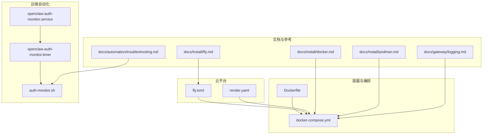
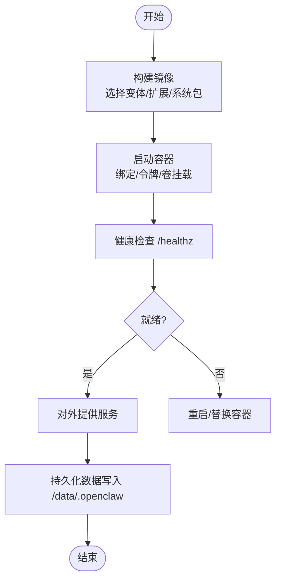
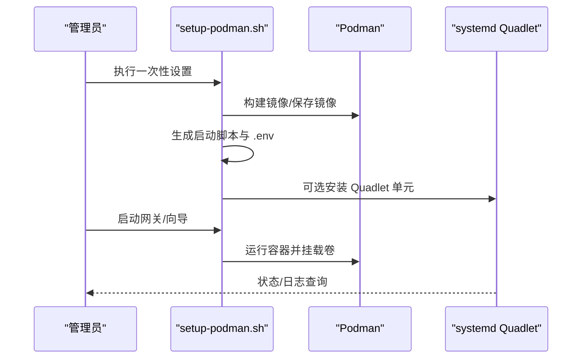
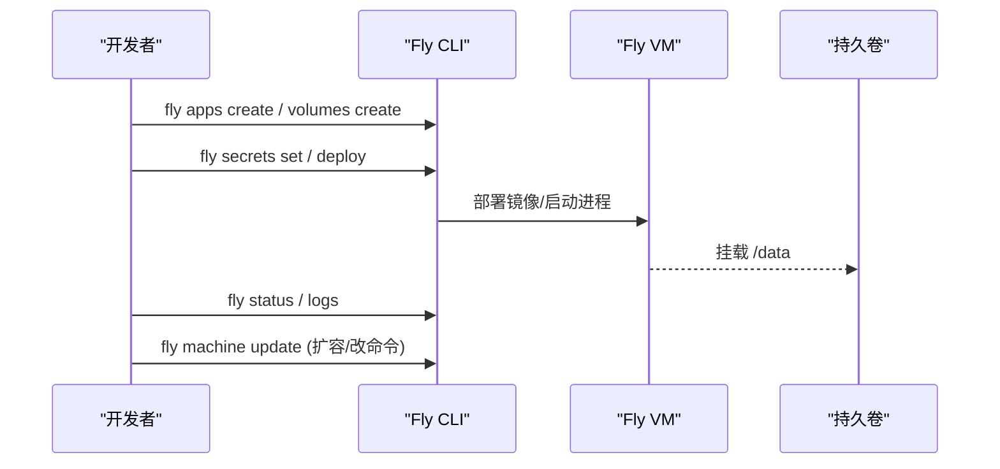
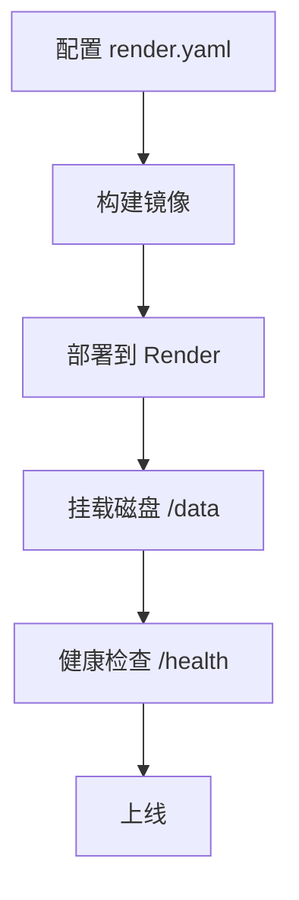
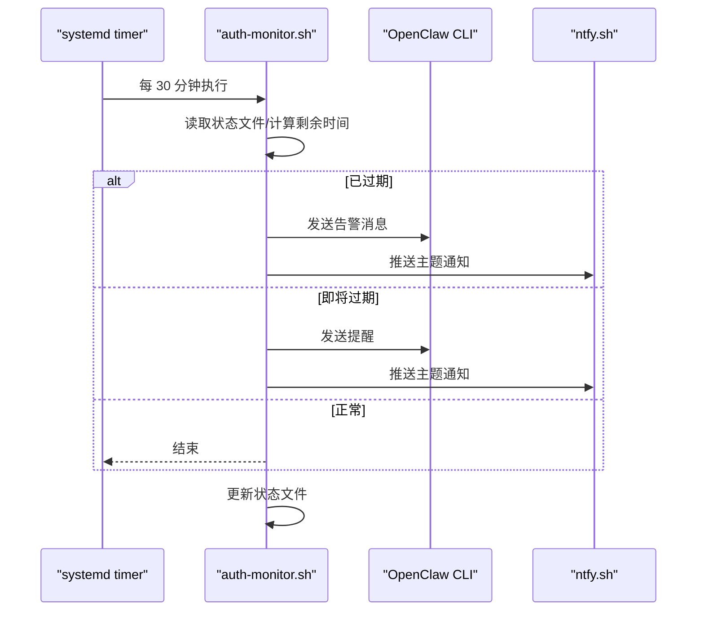
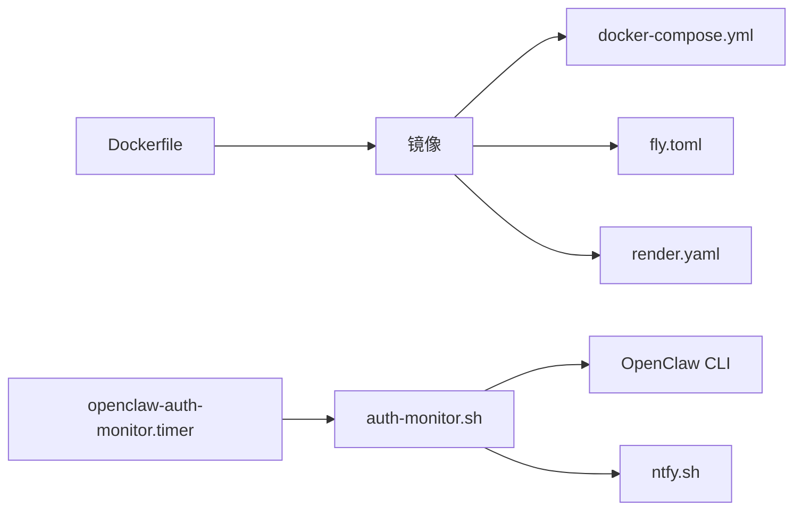
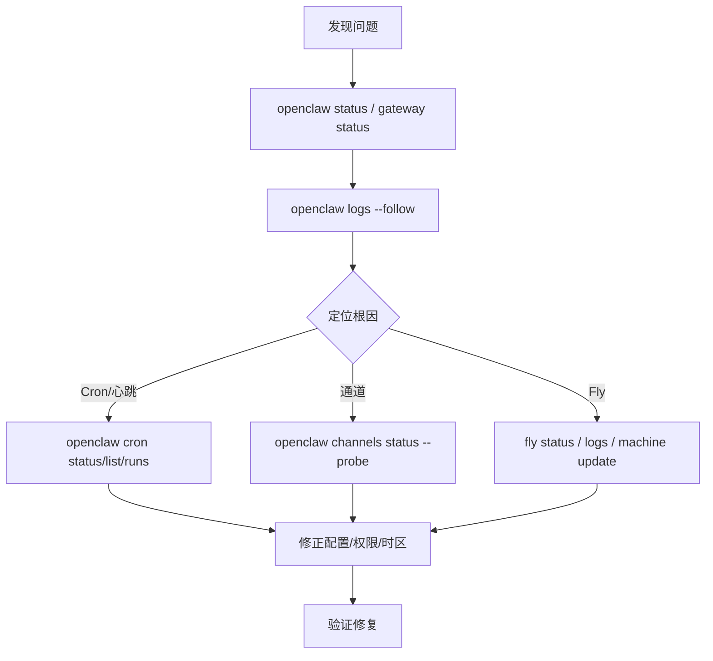

# 部署与运维

<cite>
**本文引用的文件**
- [Dockerfile](file://Dockerfile)
- [docker-compose.yml](file://docker-compose.yml)
- [fly.toml](file://fly.toml)
- [render.yaml](file://render.yaml)
- [setup-podman.sh](file://setup-podman.sh)
- [openclaw-auth-monitor.service](file://scripts/systemd/openclaw-auth-monitor.service)
- [openclaw-auth-monitor.timer](file://scripts/systemd/openclaw-auth-monitor.timer)
- [auth-monitor.sh](file://scripts/auth-monitor.sh)
- [docs/install/docker.md](file://docs/install/docker.md)
- [docs/install/fly.md](file://docs/install/fly.md)
- [docs/install/podman.md](file://docs/install/podman.md)
- [docs/automation/troubleshooting.md](file://docs/automation/troubleshooting.md)
- [docs/gateway/logging.md](file://docs/gateway/logging.md)
</cite>

## 目录

1. [简介](#简介)
2. [项目结构](#项目结构)
3. [核心组件](#核心组件)
4. [架构总览](#架构总览)
5. [详细组件分析](#详细组件分析)
6. [依赖关系分析](#依赖关系分析)
7. [性能考量](#性能考量)
8. [故障排除指南](#故障排除指南)
9. [结论](#结论)
10. [附录](#附录)

## 简介

本指南面向生产环境的部署与运维，覆盖容器化（Docker/Podman）、云平台（Fly.io、Render）集成、监控与日志、性能优化、备份恢复与高可用、自动化与故障排除、升级维护以及多环境部署与扩展性建议。内容基于仓库中的官方安装与运维文档、容器编排与脚本，确保可操作、可落地。

## 项目结构

围绕部署与运维的关键文件与目录如下：

- 容器镜像与构建：Dockerfile、docker-compose.yml
- 云平台配置：fly.toml、render.yaml
- 运维自动化：systemd 单元与定时器、认证过期监控脚本
- 文档与参考：各平台安装与运维文档、自动化与日志文档



**图表来源**

- [Dockerfile](file://Dockerfile)
- [docker-compose.yml](file://docker-compose.yml)
- [fly.toml](file://fly.toml)
- [render.yaml](file://render.yaml)
- [openclaw-auth-monitor.service](file://scripts/systemd/openclaw-auth-monitor.service)
- [openclaw-auth-monitor.timer](file://scripts/systemd/openclaw-auth-monitor.timer)
- [auth-monitor.sh](file://scripts/auth-monitor.sh)
- [docs/install/docker.md](file://docs/install/docker.md)
- [docs/install/fly.md](file://docs/install/fly.md)
- [docs/install/podman.md](file://docs/install/podman.md)
- [docs/automation/troubleshooting.md](file://docs/automation/troubleshooting.md)
- [docs/gateway/logging.md](file://docs/gateway/logging.md)

**章节来源**

- [Dockerfile](file://Dockerfile)
- [docker-compose.yml](file://docker-compose.yml)
- [fly.toml](file://fly.toml)
- [render.yaml](file://render.yaml)
- [setup-podman.sh](file://setup-podman.sh)
- [openclaw-auth-monitor.service](file://scripts/systemd/openclaw-auth-monitor.service)
- [openclaw-auth-monitor.timer](file://scripts/systemd/openclaw-auth-monitor.timer)
- [auth-monitor.sh](file://scripts/auth-monitor.sh)
- [docs/install/docker.md](file://docs/install/docker.md)
- [docs/install/fly.md](file://docs/install/fly.md)
- [docs/install/podman.md](file://docs/install/podman.md)
- [docs/automation/troubleshooting.md](file://docs/automation/troubleshooting.md)
- [docs/gateway/logging.md](file://docs/gateway/logging.md)

## 核心组件

- 容器镜像与运行时
  - 使用 Node.js 22-bookworm 基础镜像，支持 slim 变体；默认非 root 用户运行；内置健康检查端点；支持可选安装 Playwright 浏览器与 Docker CLI。
- 编排与服务
  - docker-compose 提供网关与 CLI 服务，支持持久化配置与工作区挂载、可选沙箱模式、健康检查与重启策略。
- 云平台部署
  - Fly.io：通过 fly.toml 指定 Dockerfile、进程命令、HTTP 服务、VM 规格与持久卷挂载。
  - Render：通过 render.yaml 指定 Docker 运行时、健康检查路径、环境变量与磁盘挂载。
- 运维自动化
  - systemd 服务与定时器周期性检查认证状态并通过 OpenClaw 或 ntfy 发送告警。
- 日志与可观测性
  - 文件日志（JSONL）与控制台输出分离；WS 日志风格可调；支持敏感信息脱敏与工具摘要脱敏。

**章节来源**

- [Dockerfile](file://Dockerfile)
- [docker-compose.yml](file://docker-compose.yml)
- [fly.toml](file://fly.toml)
- [render.yaml](file://render.yaml)
- [openclaw-auth-monitor.service](file://scripts/systemd/openclaw-auth-monitor.service)
- [openclaw-auth-monitor.timer](file://scripts/systemd/openclaw-auth-monitor.timer)
- [auth-monitor.sh](file://scripts/auth-monitor.sh)
- [docs/gateway/logging.md](file://docs/gateway/logging.md)

## 架构总览

下图展示生产环境典型拓扑：容器或云平台承载网关与 CLI，持久化存储挂载到 /data 或宿主机目录，认证与通道凭据通过环境变量注入，健康检查与自动重启保障可用性。

```mermaid
graph TB
subgraph "客户端"
B["浏览器/CLI"]
end
subgraph "入口与反向代理"
RP["反向代理/负载均衡"]
end
subgraph "运行时"
GW["OpenClaw 网关容器/VM"]
CLI["OpenClaw CLI 容器/VM"]
VOL["持久化卷 /data 或宿主机目录"]
end
subgraph "外部系统"
CH["渠道/模型提供商"]
MON["监控/告警(n.tf/y)"]
end
B --> RP --> GW
CLI --- GW
GW <- --> VOL
GW --> CH
GW -. 健康检查 .-> RP
GW -. 认证过期监控 .-> MON
```

**图表来源**

- [docker-compose.yml](file://docker-compose.yml)
- [fly.toml](file://fly.toml)
- [render.yaml](file://render.yaml)
- [openclaw-auth-monitor.service](file://scripts/systemd/openclaw-auth-monitor.service)
- [openclaw-auth-monitor.timer](file://scripts/systemd/openclaw-auth-monitor.timer)
- [auth-monitor.sh](file://scripts/auth-monitor.sh)

## 详细组件分析

### 容器化方案（Docker）

- 构建与变体
  - 支持默认与 slim 两种基础镜像变体；通过构建参数选择扩展依赖预装、系统包安装、是否预装浏览器与 Docker CLI。
- 运行时安全
  - 非 root 用户运行；健康检查端点 /healthz 与 /readyz；支持 loopback/lan 绑定与令牌鉴权。
- 持久化与挂载
  - 通过环境变量与卷挂载实现配置与工作区持久化；支持额外挂载与命名卷。
- 沙箱模式
  - 可选启用 Docker 网关沙箱；需要在镜像中安装 Docker CLI 或使用脚本引导。



**图表来源**

- [Dockerfile](file://Dockerfile)
- [docker-compose.yml](file://docker-compose.yml)

**章节来源**

- [Dockerfile](file://Dockerfile)
- [docker-compose.yml](file://docker-compose.yml)
- [docs/install/docker.md](file://docs/install/docker.md)

### 容器化方案（Podman）

- 一次性设置
  - 创建专用 openclaw 用户、构建镜像、生成启动脚本；可选安装 systemd Quadlet 作为用户服务。
- 运行与管理
  - 支持手动启动与 systemd 管理；日志与停止/启动命令；子 UID/GID 要求。
- 存储模型
  - 配置与工作区挂载到宿主机；沙箱容器使用内存后端临时文件系统。



**图表来源**

- [setup-podman.sh](file://setup-podman.sh)
- [openclaw-auth-monitor.service](file://scripts/systemd/openclaw-auth-monitor.service)
- [openclaw-auth-monitor.timer](file://scripts/systemd/openclaw-auth-monitor.timer)

**章节来源**

- [setup-podman.sh](file://setup-podman.sh)
- [docs/install/podman.md](file://docs/install/podman.md)

### 云平台集成（Fly.io）

- 应用与卷
  - 创建应用与 1GB 持久卷；设置环境变量与密钥（如 OPENCLAW_GATEWAY_TOKEN、模型与渠道凭据）。
- 配置要点
  - 进程命令绑定 LAN 并允许未配置启动；HTTP 内部端口与强制 HTTPS；最小运行机器数；VM 规格与内存。
- 私有部署
  - 释放公网 IP，仅保留私有 IPv6；通过本地代理、WireGuard 或 SSH 访问；Webhook 通过 ngrok/Tailscale 隧道暴露。
- 更新与扩容
  - 重新部署更新；必要时调整机器规格与命令；注意 fly deploy 后机器命令可能重置。



**图表来源**

- [fly.toml](file://fly.toml)
- [docs/install/fly.md](file://docs/install/fly.md)

**章节来源**

- [fly.toml](file://fly.toml)
- [docs/install/fly.md](file://docs/install/fly.md)

### 云平台集成（Render）

- 运行时与健康检查
  - Docker 运行时；健康检查路径 /health；环境变量（端口、状态目录、工作区目录、网关令牌）。
- 存储与容量
  - 磁盘挂载与容量配置；卷名称与挂载路径。
- 环境变量最佳实践
  - 将密钥与令牌置于环境变量而非配置文件，避免泄露。



**图表来源**

- [render.yaml](file://render.yaml)

**章节来源**

- [render.yaml](file://render.yaml)

### 监控与告警（认证过期监控）

- 周期性检查
  - systemd timer 每 30 分钟触发一次；检查 Claude 凭据有效期，临近过期或已过期发送通知。
- 通知渠道
  - 可通过 OpenClaw 发送消息至指定号码；或通过 ntfy.sh 推送主题通知。
- 防抖与状态
  - 最小通知间隔限制；状态文件记录最近通知时间，避免频繁打扰。



**图表来源**

- [openclaw-auth-monitor.service](file://scripts/systemd/openclaw-auth-monitor.service)
- [openclaw-auth-monitor.timer](file://scripts/systemd/openclaw-auth-monitor.timer)
- [auth-monitor.sh](file://scripts/auth-monitor.sh)

**章节来源**

- [openclaw-auth-monitor.service](file://scripts/systemd/openclaw-auth-monitor.service)
- [openclaw-auth-monitor.timer](file://scripts/systemd/openclaw-auth-monitor.timer)
- [auth-monitor.sh](file://scripts/auth-monitor.sh)

### 日志管理

- 文件日志
  - 默认滚动日志位于 /tmp/openclaw/ 下按日切分；可通过配置调整路径与级别。
- 控制台与 WS 日志
  - 控制台级别与样式独立于文件日志；WS 日志支持正常/紧凑/全量三种风格；支持敏感信息脱敏与工具摘要脱敏。
- 实操建议
  - 生产环境建议将文件日志级别设为 debug/trace，并结合控制台级别 pretty/compact；对敏感字段开启脱敏。

**章节来源**

- [docs/gateway/logging.md](file://docs/gateway/logging.md)

### 性能优化策略

- 容器层
  - 选择 slim 变体以减小镜像体积；预装系统包与浏览器减少首次启动开销；合理设置内存上限避免 OOM。
- 云平台层
  - Fly.io 建议至少 2GB 内存；根据并发与通道数量调整 VM 规格；启用持久卷避免频繁重建。
- 日志与 IO
  - 关注媒体、会话与日志目录的磁盘增长热点；必要时拆分卷或清理历史数据。

**章节来源**

- [Dockerfile](file://Dockerfile)
- [docs/install/fly.md](file://docs/install/fly.md)
- [docs/gateway/logging.md](file://docs/gateway/logging.md)

### 备份与恢复

- 持久化目录
  - /data（或宿主机映射目录）存放配置与状态；确保定期备份该目录。
- 恢复流程
  - 停止服务后恢复 /data；重新部署或启动容器；验证网关与通道连通性。

**章节来源**

- [fly.toml](file://fly.toml)
- [docker-compose.yml](file://docker-compose.yml)

### 高可用与扩展

- 多实例与负载均衡
  - 在云平台或自建集群中部署多个网关实例，配合反向代理进行轮询或会话亲和。
- 自动重启与健康检查
  - 利用容器健康检查与云平台自动重启策略，提升可用性。
- 扩展性考虑
  - 通道与模型提供商的速率限制；队列与并发控制；按需增加 CPU/内存与存储。

**章节来源**

- [docker-compose.yml](file://docker-compose.yml)
- [fly.toml](file://fly.toml)

### 运维自动化与升级维护

- 自动化
  - systemd 定时器负责认证过期监控；容器编排负责启动/重启；脚本化一键设置与启动。
- 升级维护
  - Docker：拉取新镜像或重新构建；Compose/云平台部署；验证健康检查与日志。
  - Fly.io：重新部署；必要时更新机器命令与规格。

**章节来源**

- [openclaw-auth-monitor.timer](file://scripts/systemd/openclaw-auth-monitor.timer)
- [auth-monitor.sh](file://scripts/auth-monitor.sh)
- [docs/install/docker.md](file://docs/install/docker.md)
- [docs/install/fly.md](file://docs/install/fly.md)

## 依赖关系分析

- 组件耦合
  - docker-compose 依赖 Dockerfile 产出的镜像；fly.toml/Render 配置依赖镜像构建产物。
  - systemd 定时器与脚本独立于容器，但共同保障认证健康。
- 外部依赖
  - 云平台 API（Fly、Render）、渠道与模型提供商 API、ntfy 等通知服务。



**图表来源**

- [Dockerfile](file://Dockerfile)
- [docker-compose.yml](file://docker-compose.yml)
- [fly.toml](file://fly.toml)
- [render.yaml](file://render.yaml)
- [openclaw-auth-monitor.timer](file://scripts/systemd/openclaw-auth-monitor.timer)
- [auth-monitor.sh](file://scripts/auth-monitor.sh)

**章节来源**

- [Dockerfile](file://Dockerfile)
- [docker-compose.yml](file://docker-compose.yml)
- [fly.toml](file://fly.toml)
- [render.yaml](file://render.yaml)
- [openclaw-auth-monitor.timer](file://scripts/systemd/openclaw-auth-monitor.timer)
- [auth-monitor.sh](file://scripts/auth-monitor.sh)

## 性能考量

- 内存与并发
  - 通道与工具执行可能占用内存；Fly.io 建议 2GB 起步；根据实际负载调整。
- I/O 与磁盘
  - 媒体、会话与日志目录增长快；建议拆分卷或定期清理。
- 容器镜像
  - slim 变体更轻量；预装浏览器与系统包可减少冷启动时间。

**章节来源**

- [docs/install/fly.md](file://docs/install/fly.md)
- [Dockerfile](file://Dockerfile)
- [docs/gateway/logging.md](file://docs/gateway/logging.md)

## 故障排除指南

- 常见问题定位
  - 使用 openclaw status/gateway status/logs/doctor/channels status/probe 等命令链逐步排查。
- Cron 与心跳
  - 检查调度器状态、作业列表、最近运行结果与通道探测；关注时区与活跃时段配置。
- Fly.io
  - 绑定地址与端口不匹配、内存不足、锁文件残留等问题的修复步骤。



**图表来源**

- [docs/automation/troubleshooting.md](file://docs/automation/troubleshooting.md)
- [docs/install/fly.md](file://docs/install/fly.md)

**章节来源**

- [docs/automation/troubleshooting.md](file://docs/automation/troubleshooting.md)
- [docs/install/fly.md](file://docs/install/fly.md)

## 结论

通过容器化与云平台部署、完善的健康检查与自动重启、认证过期监控与日志管理，OpenClaw 可在生产环境中实现稳定、可观测与可维护的运行。建议结合业务负载与合规要求，选择合适的平台与配置，并建立标准化的备份、升级与故障处理流程。

## 附录

- 快速对照表
  - 容器镜像：Dockerfile；编排：docker-compose.yml；云平台：fly.toml/Render；认证监控：systemd + auth-monitor.sh；日志：logging.md。
- 建议流程
  - 设计阶段：确定平台（Docker/Podman/Fly/Render）、绑定模式、令牌与凭据注入方式；规划持久化与备份策略。
  - 部署阶段：构建镜像、准备密钥、挂载卷、启动服务、验证健康检查。
  - 运维阶段：启用认证监控、配置日志级别与脱敏、定期巡检、按需扩容与升级。
