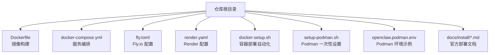
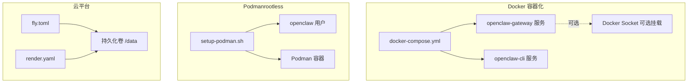
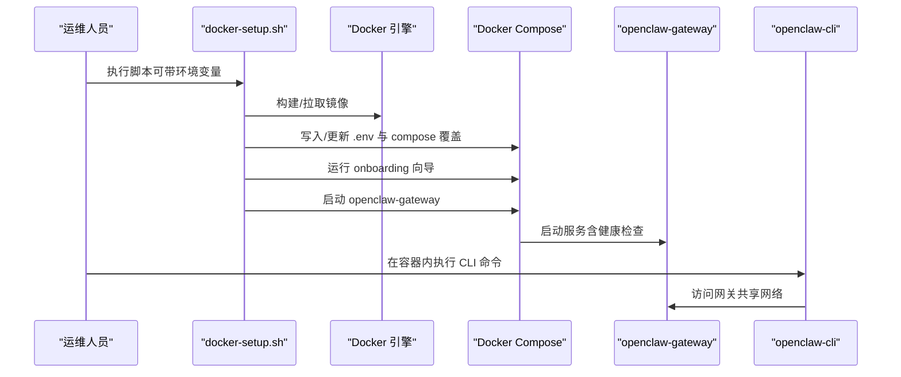
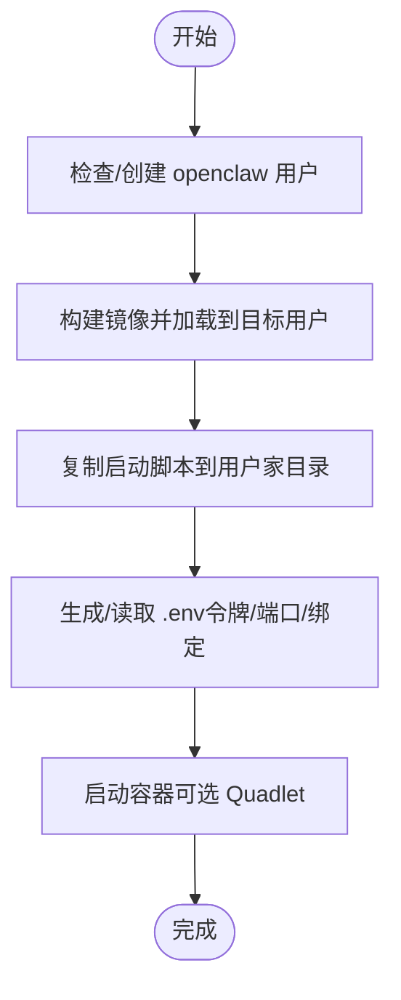
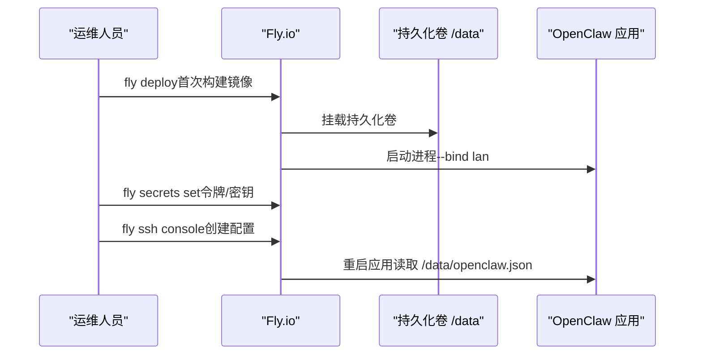
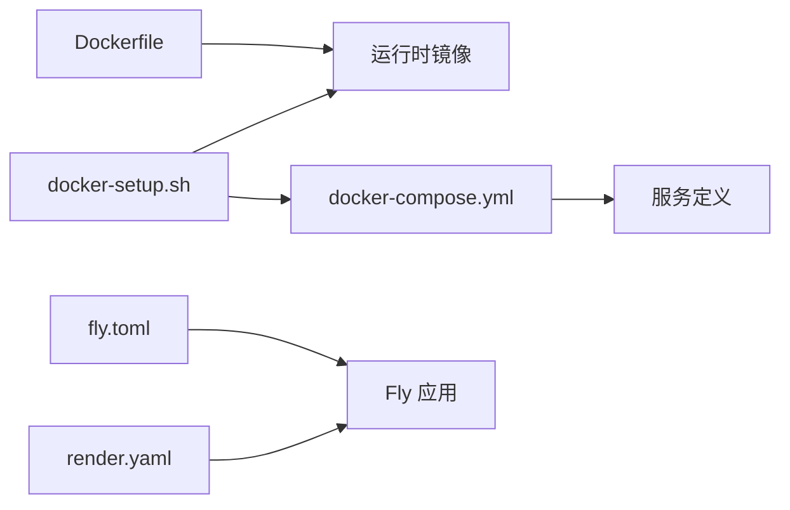

# 部署环境

<cite>
**本文引用的文件**
- [Dockerfile](file://Dockerfile)
- [docker-compose.yml](file://docker-compose.yml)
- [docker-setup.sh](file://docker-setup.sh)
- [setup-podman.sh](file://setup-podman.sh)
- [openclaw.podman.env](file://openclaw.podman.env)
- [fly.toml](file://fly.toml)
- [render.yaml](file://render.yaml)
- [docs/install/docker.md](file://docs/install/docker.md)
- [docs/install/podman.md](file://docs/install/podman.md)
- [docs/install/fly.md](file://docs/install/fly.md)
- [docs/install/index.md](file://docs/install/index.md)
</cite>

## 目录

1. [简介](#简介)
2. [项目结构](#项目结构)
3. [核心组件](#核心组件)
4. [架构总览](#架构总览)
5. [详细组件分析](#详细组件分析)
6. [依赖关系分析](#依赖关系分析)
7. [性能考量](#性能考量)
8. [故障排查指南](#故障排查指南)
9. [结论](#结论)
10. [附录](#附录)

## 简介

本指南面向不同部署环境（开发、测试、生产）与多种部署方式（Docker 容器化、Podman、云平台、传统虚拟机/裸机），提供从环境准备、系统要求、硬件资源评估到镜像构建、服务编排、网络配置、环境变量与依赖管理、版本兼容性检查的完整落地步骤。文档同时覆盖 Fly.io、Render 等云平台部署与安全加固要点，并给出常见问题的排查路径。

## 项目结构

围绕部署相关的仓库关键位置如下：

- 容器镜像与编排：根目录 Dockerfile、docker-compose.yml、fly.toml、render.yaml
- 自动化部署脚本：docker-setup.sh、setup-podman.sh
- 环境示例：openclaw.podman.env
- 官方部署文档：docs/install 下的 docker.md、podman.md、fly.md、index.md

图表来源

- [Dockerfile](file://Dockerfile)
- [docker-compose.yml](file://docker-compose.yml)
- [fly.toml](file://fly.toml)
- [render.yaml](file://render.yaml)
- [docker-setup.sh](file://docker-setup.sh)
- [setup-podman.sh](file://setup-podman.sh)
- [openclaw.podman.env](file://openclaw.podman.env)
- [docs/install/docker.md](file://docs/install/docker.md)

章节来源

- [Dockerfile](file://Dockerfile)
- [docker-compose.yml](file://docker-compose.yml)
- [fly.toml](file://fly.toml)
- [render.yaml](file://render.yaml)
- [docker-setup.sh](file://docker-setup.sh)
- [setup-podman.sh](file://setup-podman.sh)
- [openclaw.podman.env](file://openclaw.podman.env)
- [docs/install/docker.md](file://docs/install/docker.md)
- [docs/install/podman.md](file://docs/install/podman.md)
- [docs/install/fly.md](file://docs/install/fly.md)
- [docs/install/index.md](file://docs/install/index.md)

## 核心组件

- 容器镜像构建
  - 多阶段构建，基于 node:22-bookworm（或 slim），默认运行用户为非 root 的 node 用户，内置健康检查端点与可选的浏览器/Playwright 安装参数。
- 服务编排
  - docker-compose.yml 定义 openclaw-gateway 与 openclaw-cli 两个服务，前者暴露网关端口，后者通过共享网络模式访问前者；支持按需挂载 Docker socket 实现沙箱隔离。
- 云平台配置
  - fly.toml 指定 Dockerfile、进程命令、HTTP 服务、VM 规格与持久化卷挂载；render.yaml 提供 Render 平台的容器部署模板。
- 自动化部署脚本
  - docker-setup.sh：一键构建/拉取镜像、生成网关令牌、引导向导、启动服务、可选启用沙箱与额外挂载。
  - setup-podman.sh：为 Podman（rootless）创建专用用户、构建镜像、生成启动脚本与可选 systemd Quadlet 单元。
- 环境变量与示例
  - openclaw.podman.env 提供 Podman 场景下的令牌、端口映射与绑定模式等示例键值。

章节来源

- [Dockerfile](file://Dockerfile)
- [docker-compose.yml](file://docker-compose.yml)
- [fly.toml](file://fly.toml)
- [render.yaml](file://render.yaml)
- [docker-setup.sh](file://docker-setup.sh)
- [setup-podman.sh](file://setup-podman.sh)
- [openclaw.podman.env](file://openclaw.podman.env)

## 架构总览

下图展示三种典型部署形态的组件交互与数据流：

图表来源

- [docker-compose.yml](file://docker-compose.yml)
- [docker-setup.sh](file://docker-setup.sh)
- [setup-podman.sh](file://setup-podman.sh)
- [fly.toml](file://fly.toml)
- [render.yaml](file://render.yaml)

## 详细组件分析

### Docker 容器化部署

- 镜像构建
  - 多阶段构建，首阶段提取扩展依赖清单，次阶段安装 Bun/Corepack，执行 UI 与后端构建，再将产物复制至最终基础镜像（bookworm 或 bookworm-slim）。默认运行用户为非 root 的 node 用户，内置健康检查。
- 服务编排
  - openclaw-gateway：暴露网关与桥接端口，支持通过环境变量注入令牌与第三方凭据；可挂载 Docker socket 启用沙箱；健康检查探针指向 /healthz。
  - openclaw-cli：共享 openclaw-gateway 网络，具备最小权限能力集与 no-new-privileges 策略。
- 自动化部署流程
  - docker-setup.sh 支持本地构建或远程镜像拉取、生成令牌、引导向导、启动服务、可选沙箱与额外挂载；对权限不足、路径校验、socket 路径等进行严格校验与提示。
- 网络与安全
  - 默认绑定模式为 lan（对外可达），loopback 仅容器内可达；建议在非 loopback 绑定时设置 OPENCLAW_GATEWAY_TOKEN 并配合防火墙策略。
- 健康检查
  - 内置 /healthz 与 /readyz 探针，Compose 层面也定义了健康检查命令；可通过 exec 进入容器执行深探针。

图表来源

- [docker-setup.sh](file://docker-setup.sh)
- [docker-compose.yml](file://docker-compose.yml)

章节来源

- [Dockerfile](file://Dockerfile)
- [docker-compose.yml](file://docker-compose.yml)
- [docker-setup.sh](file://docker-setup.sh)
- [docs/install/docker.md](file://docs/install/docker.md)

### Podman（rootless）部署

- 一次性设置
  - setup-podman.sh 创建专用 openclaw 用户、构建镜像、生成启动脚本；可选安装 systemd Quadlet 单元实现开机自启与自动重启。
- 运行与配置
  - openclaw.podman.env 提供令牌、端口映射、绑定模式与可选模型提供商密钥示例；默认以 --bind loopback 启动，如需 LAN 访问需显式调整并配置允许源。
- 存储与权限
  - 配置与工作区通过 bind mount 挂载到 openclaw 用户家目录；注意宿主机 UID/GID 与容器内 node 用户一致，避免 EACCES。

图表来源

- [setup-podman.sh](file://setup-podman.sh)
- [openclaw.podman.env](file://openclaw.podman.env)

章节来源

- [setup-podman.sh](file://setup-podman.sh)
- [openclaw.podman.env](file://openclaw.podman.env)
- [docs/install/podman.md](file://docs/install/podman.md)

### 云平台部署（Fly.io）

- 配置要点
  - fly.toml 指定 Dockerfile、进程命令（--bind lan、--allow-unconfigured）、HTTP 服务、VM 规格与持久化卷挂载；建议内存不低于 2GB。
- 密钥与凭据
  - 使用 fly secrets 设置 OPENCLAW_GATEWAY_TOKEN、模型提供商 API Key、频道令牌等；优先使用环境变量而非明文写入配置文件。
- 首次运行与配置
  - 首次部署后通过 SSH 进入机器创建 /data/openclaw.json；重启应用后生效。
- 私有部署
  - 可释放公网 IP，仅保留私有 IPv6，结合本地代理、WireGuard 或 ngrok 隧道实现受控访问与 webhook 回调。

图表来源

- [fly.toml](file://fly.toml)
- [docs/install/fly.md](file://docs/install/fly.md)

章节来源

- [fly.toml](file://fly.toml)
- [docs/install/fly.md](file://docs/install/fly.md)

### Render 平台部署

- 配置要点
  - render.yaml 定义容器类型、计划、健康检查路径、环境变量（PORT、OPENCLAW_STATE_DIR、OPENCLAW_WORKSPACE_DIR、OPENCLAW_GATEWAY_TOKEN 等）与持久化磁盘挂载。
- 建议
  - 将敏感信息置于环境变量，避免写入配置文件；根据负载情况选择合适计划与磁盘容量。

章节来源

- [render.yaml](file://render.yaml)

### 传统虚拟机/裸机部署

- 系统要求与安装方式
  - 官方文档提供安装脚本、npm/pnpm、从源码构建等多种方式；推荐使用安装脚本以获得统一的 Node 检测、安装与引导体验。
- 环境变量与路径
  - OPENCLAW_HOME、OPENCLAW_STATE_DIR、OPENCLAW_CONFIG_PATH 等用于定制运行时路径；Fly.io 文档中也有类似 STATE_DIR 的实践可供参考。
- 版本通道
  - 支持 stable/beta/dev 三通道切换，便于在不同环境中保持一致性。

章节来源

- [docs/install/index.md](file://docs/install/index.md)
- [docs/install/development-channels.md](file://docs/install/development-channels.md)

## 依赖关系分析

- 镜像构建依赖
  - Dockerfile 显式 pin 基础镜像 digest，确保可复现性；多阶段构建减少最终镜像体积并避免构建工具进入运行时。
- 编排与脚本耦合
  - docker-setup.sh 依赖 docker-compose.yml 的服务定义与环境变量；若启用沙箱，需确保镜像包含 Docker CLI 或在 compose 覆盖层挂载 docker.sock。
- 云平台配置耦合
  - fly.toml 与 render.yaml 对应平台的镜像构建入口、进程命令、端口与持久化卷；需与应用内部绑定模式与健康检查保持一致。

图表来源

- [Dockerfile](file://Dockerfile)
- [docker-compose.yml](file://docker-compose.yml)
- [docker-setup.sh](file://docker-setup.sh)
- [fly.toml](file://fly.toml)
- [render.yaml](file://render.yaml)

章节来源

- [Dockerfile](file://Dockerfile)
- [docker-compose.yml](file://docker-compose.yml)
- [docker-setup.sh](file://docker-setup.sh)
- [fly.toml](file://fly.toml)
- [render.yaml](file://render.yaml)

## 性能考量

- 内存与垃圾回收
  - Fly.io 示例中通过 NODE_OPTIONS 限制堆大小；云平台部署建议至少 2GB 内存，避免 OOM 与频繁重启。
- 构建缓存与分层
  - Dockerfile 中将依赖安装与源码复制顺序合理安排，避免无关变更导致 pnpm install 重新执行。
- 浏览器与 Playwright
  - 可在镜像中预装 Chromium/Playwright，减少容器启动时的下载与安装开销；持久化缓存目录可结合 HOME_VOLUME 或额外挂载实现。
- 持久化与 IO
  - 将状态目录与工作区挂载到持久化卷；关注媒体、会话日志与 cron 输出等热点目录的磁盘增长。

章节来源

- [Dockerfile](file://Dockerfile)
- [docs/install/fly.md](file://docs/install/fly.md)
- [docs/install/docker.md](file://docs/install/docker.md)

## 故障排查指南

- Docker Compose
  - 权限错误（EACCES）：确保宿主挂载目录属主为容器内 node 用户（UID/GID 1000:1000）。
  - 绑定模式与端口映射：若容器内绑定 loopback，桥接端口可能无法从宿主访问；需改为 lan 并设置 OPENCLAW_GATEWAY_TOKEN。
  - 沙箱启用失败：确认镜像包含 Docker CLI，且 docker.sock 可用；必要时在 compose 覆盖层挂载并添加组 ID。
- Podman
  - rootless 失败：检查 /etc/subuid 与 /etc/subgid 是否为 openclaw 用户分配范围；容器名冲突时使用 --replace。
  - Quadlet 服务：编辑 .container 文件后需执行 daemon-reload 并重启服务；确保 cgroups v2。
- 云平台（Fly.io）
  - 健康检查失败：确保 internal_port 与应用监听端口一致；检查 --bind 与 --port 参数。
  - 内存不足：提升 VM 内存；查看日志中的 SIGABRT/v8 错误。
  - 状态未持久化：确认 OPENCLAW_STATE_DIR 指向 /data 并已挂载卷。
- 通用
  - 控制面板配对：若出现“未授权/需要配对”，使用 compose run 执行 dashboard 与 devices 命令刷新链接与批准设备。
  - 健康检查：/healthz 为浅探针，/readyz 为就绪探针；深探针可通过 exec 进入容器执行健康命令。

章节来源

- [docker-setup.sh](file://docker-setup.sh)
- [setup-podman.sh](file://setup-podman.sh)
- [docs/install/docker.md](file://docs/install/docker.md)
- [docs/install/podman.md](file://docs/install/podman.md)
- [docs/install/fly.md](file://docs/install/fly.md)

## 结论

本指南提供了从开发到生产的全链路部署路径：以 Docker 与 Podman 快速搭建隔离环境，借助 fly.toml 与 render.yaml 在云平台实现弹性与持久化，辅以 docker-setup.sh 与 setup-podman.sh 的自动化流程与 openclaw.podman.env 的环境示例，满足不同团队与场景的部署需求。建议在生产环境遵循最小权限、非 root 运行、健康检查与持久化卷等最佳实践，并结合云平台的安全策略与私有部署选项实现强健与可控的运行时。

## 附录

- 环境变量清单（节选）
  - OPENCLAW_GATEWAY_TOKEN：网关访问令牌（非 loopback 绑定时必需）
  - OPENCLAW_GATEWAY_BIND：绑定模式（lan/loopback/auto 等）
  - OPENCLAW_CONFIG_DIR、OPENCLAW_WORKSPACE_DIR：宿主挂载路径
  - OPENCLAW_DOCKER_APT_PACKAGES：构建期安装系统包
  - OPENCLAW_EXTENSIONS：预安装扩展依赖
  - OPENCLAW_SANDBOX：启用沙箱（1/true/on）
  - OPENCLAW_INSTALL_DOCKER_CLI：在镜像中安装 Docker CLI
  - OPENCLAW_DOCKER_SOCKET：Docker socket 路径
  - OPENCLAW_ALLOW_INSECURE_PRIVATE_WS：允许私有网络 ws 目标（调试用途）
  - OPENCLAW*BROWSER*\*：浏览器沙箱相关标志与渲染器限制
  - OPENCLAW_STATE_DIR：云平台持久化状态目录
  - OPENCLAW_PREFER_PNPM：强制使用 pnpm
  - NODE_OPTIONS：Node 堆大小限制
- 版本与通道
  - 支持 stable/beta/dev 三通道；通道切换会影响插件来源与安装方式。

章节来源

- [docker-setup.sh](file://docker-setup.sh)
- [openclaw.podman.env](file://openclaw.podman.env)
- [docs/install/development-channels.md](file://docs/install/development-channels.md)
- [docs/install/fly.md](file://docs/install/fly.md)
- [docs/install/docker.md](file://docs/install/docker.md)
