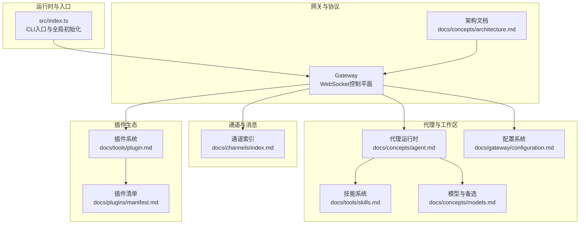
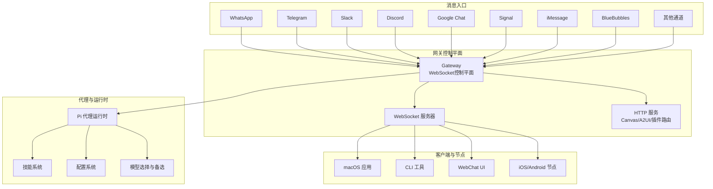
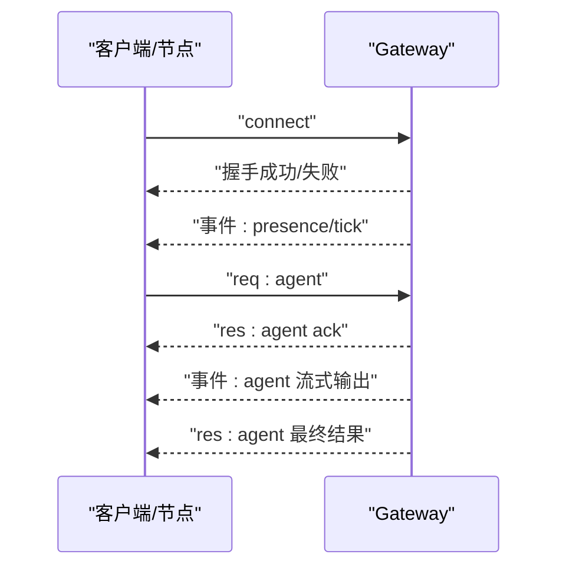
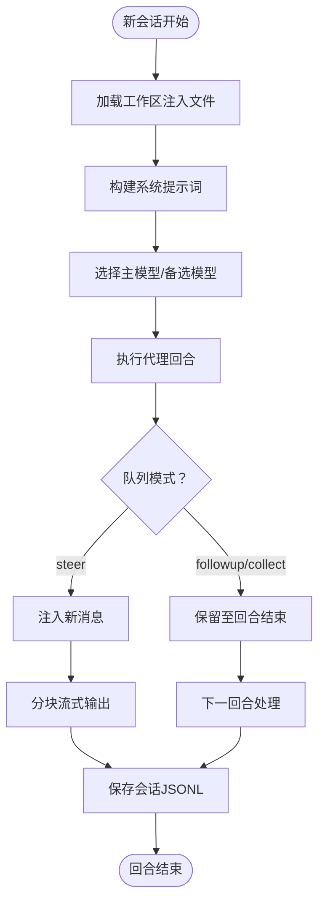
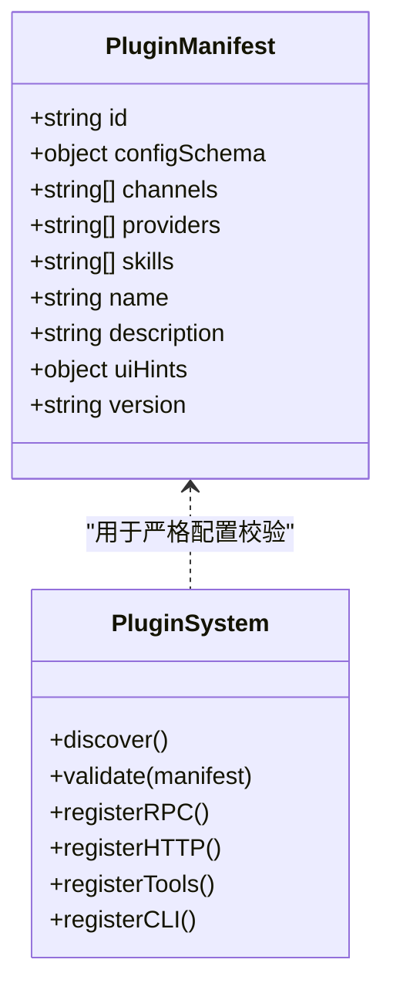
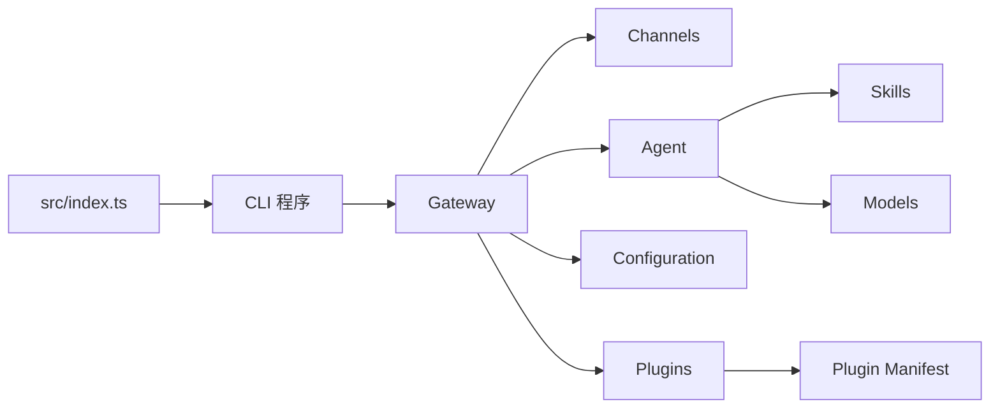

# 什么是OpenClaw

<cite>
**本文引用的文件**
- [README.md](file://README.md)
- [VISION.md](file://VISION.md)
- [src/index.ts](file://src/index.ts)
- [docs/start/openclaw.md](file://docs/start/openclaw.md)
- [docs/concepts/architecture.md](file://docs/concepts/architecture.md)
- [docs/concepts/agent.md](file://docs/concepts/agent.md)
- [docs/concepts/models.md](file://docs/concepts/models.md)
- [docs/tools/skills.md](file://docs/tools/skills.md)
- [docs/gateway/configuration.md](file://docs/gateway/configuration.md)
- [docs/channels/index.md](file://docs/channels/index.md)
- [docs/tools/plugin.md](file://docs/tools/plugin.md)
- [docs/plugins/manifest.md](file://docs/plugins/manifest.md)
</cite>

## 目录

1. [引言](#引言)
2. [项目结构](#项目结构)
3. [核心组件](#核心组件)
4. [架构总览](#架构总览)
5. [详细组件分析](#详细组件分析)
6. [依赖关系分析](#依赖关系分析)
7. [性能考量](#性能考量)
8. [故障排查指南](#故障排查指南)
9. [结论](#结论)
10. [附录](#附录)

## 引言

OpenClaw 是一个“个人AI助手”，你可以把它运行在自己的设备上。它通过你已经使用的聊天渠道（如 WhatsApp、Telegram、Slack、Discord、Google Chat、Signal、iMessage、BlueBubbles、IRC、Microsoft Teams、Matrix、飞书、LINE、Mattermost、Nextcloud Talk、Nostr、Synology Chat、Tlon、Twitch、Zalo、Zalo Personal、WebChat 等）来回答你，并能在 macOS/iOS/Android 上进行语音与视频交互，还能渲染一个可由你控制的实时画布（Canvas）。Gateway 是控制平面；产品本身是这个“助手”。

OpenClaw 的核心价值在于：

- 在你的设备上本地运行，强调隐私与安全
- 支持超过20个主流消息平台，统一接入
- 提供可扩展的 AI 代理引擎与插件生态
- 以终端优先的方式，确保首次体验与安全决策透明可控

## 项目结构

从顶层视角看，OpenClaw 包含以下关键部分：

- 核心运行时与CLI入口：负责加载配置、构建命令行程序、处理错误与端口占用等
- 网关（Gateway）：单一路由与控制平面，承载会话、通道、工具与事件
- 通道（Channels）：对各类IM平台的适配器集合
- 技能（Skills）：可被模型调用的工具与能力集合
- 插件（Plugins）：扩展Gateway能力的模块化组件
- 配置（Configuration）：集中式JSON5配置与热重载
- 文档与指南：面向安装、配置、运维与开发者的完整文档

图表来源

- [src/index.ts:1-94](file://src/index.ts#L1-L94)
- [docs/concepts/architecture.md:1-140](file://docs/concepts/architecture.md#L1-L140)
- [docs/channels/index.md:1-48](file://docs/channels/index.md#L1-L48)
- [docs/concepts/agent.md:1-124](file://docs/concepts/agent.md#L1-L124)
- [docs/tools/skills.md:1-303](file://docs/tools/skills.md#L1-L303)
- [docs/gateway/configuration.md:1-547](file://docs/gateway/configuration.md#L1-L547)
- [docs/concepts/models.md:1-222](file://docs/concepts/models.md#L1-L222)
- [docs/tools/plugin.md:1-800](file://docs/tools/plugin.md#L1-L800)
- [docs/plugins/manifest.md:1-76](file://docs/plugins/manifest.md#L1-L76)

章节来源

- [README.md:21-26](file://README.md#L21-L26)
- [src/index.ts:36-44](file://src/index.ts#L36-L44)

## 核心组件

- 网关（Gateway）
  - 单一长连接的WebSocket控制平面，承载所有消息表面（如 WhatsApp、Telegram、Slack、Discord、Signal、iMessage、WebChat 等），并提供类型化请求/响应与事件推送
  - 客户端（macOS应用、CLI、Web UI、自动化）与节点（macOS/iOS/Android/headless）均通过WS连接到同一网关
  - 支持远程访问（Tailscale Serve/Funnel 或 SSH隧道），并具备配对与本地信任机制
- 通道（Channels）
  - 对20+平台提供统一接入，支持文本、媒体与反应等差异化能力
  - 每个通道有独立配置段落，支持DM策略（配对/白名单/开放/禁用）与群组路由
- 代理（Agent）
  - 基于嵌入式运行时（pi-mono派生），使用工作区注入的“记忆”与指令驱动行为
  - 支持会话管理、队列模式、分块流式输出、模型切换与失败回退
- 技能（Skills）
  - AgentSkills兼容的技能目录，包含工具使用说明与前置条件（环境变量、二进制、配置）
  - 支持工作区/托管/内置三层优先级与按需热加载
- 插件（Plugins）
  - 扩展Gateway能力的模块化组件，注册RPC方法、HTTP路由、Agent工具、CLI命令、背景服务、上下文引擎等
  - 严格清单校验（openclaw.plugin.json）与JSON Schema验证，避免执行未验证代码
- 配置（Configuration）
  - JSON5集中配置，支持热重载、分层include、环境变量替换与SecretRef凭据
  - 提供CLI、Control UI与RPC三种更新方式

章节来源

- [docs/concepts/architecture.md:12-140](file://docs/concepts/architecture.md#L12-L140)
- [docs/channels/index.md:14-48](file://docs/channels/index.md#L14-L48)
- [docs/concepts/agent.md:8-124](file://docs/concepts/agent.md#L8-L124)
- [docs/tools/skills.md:9-303](file://docs/tools/skills.md#L9-L303)
- [docs/tools/plugin.md:9-800](file://docs/tools/plugin.md#L9-L800)
- [docs/gateway/configuration.md:10-547](file://docs/gateway/configuration.md#L10-L547)

## 架构总览

下图展示了OpenClaw的端到端架构：从消息入口到网关控制平面，再到代理运行时与工具链，以及可选的节点与客户端。

图表来源

- [docs/concepts/architecture.md:12-140](file://docs/concepts/architecture.md#L12-L140)
- [docs/channels/index.md:14-48](file://docs/channels/index.md#L14-L48)
- [docs/concepts/agent.md:8-124](file://docs/concepts/agent.md#L8-L124)
- [docs/gateway/configuration.md:10-547](file://docs/gateway/configuration.md#L10-L547)
- [docs/concepts/models.md:16-222](file://docs/concepts/models.md#L16-L222)

## 详细组件分析

### 组件A：网关（Gateway）与协议

- 连接生命周期：客户端/节点通过WS握手后订阅状态与事件，发送请求并接收流式事件
- 协议要点：首帧必须为connect；后续请求/响应与事件采用JSON载荷；支持鉴权令牌、幂等键与节点角色声明
- 安全与配对：设备身份与签名挑战、本地/非本地配对策略、Gateway认证策略
- 远程访问：Tailscale Serve/Funnel或SSH隧道，统一鉴权与TLS可选

图表来源

- [docs/concepts/architecture.md:59-92](file://docs/concepts/architecture.md#L59-L92)

章节来源

- [docs/concepts/architecture.md:12-140](file://docs/concepts/architecture.md#L12-L140)

### 组件B：通道（Channels）与多平台接入

- 平台覆盖：WhatsApp、Telegram、Discord、Slack、Google Chat、Signal、iMessage、BlueBubbles、IRC、Microsoft Teams、Matrix、飞书、LINE、Mattermost、Nextcloud Talk、Nostr、Synology Chat、Tlon、Twitch、Zalo、Zalo Personal、WebChat
- DM策略：配对（pairing）、白名单（allowlist）、开放（open）、禁用（disabled），并支持群组路由与提及门控
- 快速上手：Telegram通常最简单（仅需Bot Token）；WhatsApp需要QR配对并存储较多状态

章节来源

- [docs/channels/index.md:14-48](file://docs/channels/index.md#L14-L48)
- [README.md:129-154](file://README.md#L129-L154)

### 组件C：代理（Agent）与工作区

- 工作区：默认位于 ~/.openclaw/workspace，包含AGENTS.md、SOUL.md、TOOLS.md、BOOTSTRAP.md、IDENTITY.md、USER.md等注入文件
- 会话：JSONL格式存储，支持队列模式（steer/followup/collect）与分块流式输出
- 模型：支持主模型+备选模型、别名与失败回退；可通过CLI与Slash命令切换
- 安全：沙箱模式（Docker容器）可隔离非主会话，限制工具集与权限

图表来源

- [docs/concepts/agent.md:73-104](file://docs/concepts/agent.md#L73-L104)
- [docs/concepts/models.md:16-137](file://docs/concepts/models.md#L16-L137)

章节来源

- [docs/concepts/agent.md:12-124](file://docs/concepts/agent.md#L12-L124)
- [docs/concepts/models.md:16-222](file://docs/concepts/models.md#L16-L222)

### 组件D：技能（Skills）与工具生态

- 位置与优先级：内置 → 托管（~/.openclaw/skills） → 工作区（<workspace>/skills）
- 加载过滤：基于元数据（OS、二进制、环境变量、配置项）的运行时门控
- 安装与同步：ClawHub注册表，支持安装、更新与备份
- 性能与成本：技能列表注入提示词具有确定性字符开销，XML转义会增加长度

章节来源

- [docs/tools/skills.md:9-303](file://docs/tools/skills.md#L9-L303)

### 组件E：插件（Plugins）与扩展机制

- 清单与校验：每个插件必须提供 openclaw.plugin.json，包含id、configSchema等，用于严格配置验证
- 注册能力：Gateway RPC、HTTP路由、Agent工具、CLI命令、背景服务、上下文引擎、自动回复命令等
- 排他槽位：memory、contextEngine等排他槽位通过 plugins.slots 选择
- 安全与发现：路径安全检查、世界可写检测、所有权检查；支持包打包与外部通道目录合并

图表来源

- [docs/plugins/manifest.md:18-76](file://docs/plugins/manifest.md#L18-L76)
- [docs/tools/plugin.md:228-447](file://docs/tools/plugin.md#L228-L447)

章节来源

- [docs/tools/plugin.md:9-800](file://docs/tools/plugin.md#L9-L800)
- [docs/plugins/manifest.md:18-76](file://docs/plugins/manifest.md#L18-L76)

### 组件F：配置（Configuration）与热重载

- 文件与来源：~/.openclaw/openclaw.json（JSON5），支持$include分层组织
- 热重载：大部分字段即时生效；端口/网关/基础设施变更需要重启
- 更新方式：CLI（openclaw config）、Control UI、RPC（config.apply/config.patch）
- 环境与密钥：支持.env、~/.openclaw/.env、Shell导入与SecretRef凭据

章节来源

- [docs/gateway/configuration.md:10-547](file://docs/gateway/configuration.md#L10-L547)

### 组件G：入门与个人助理设置

- 安全优先：始终设置 channels.<platform>.allowFrom；建议使用独立号码作为助理
- 两部曲设置：配对通道（如WhatsApp Web QR）→ 启动Gateway → 最小配置（允许来源）
- 工作区：AGENTS.md、SOUL.md、TOOLS.md等作为“记忆”注入代理
- 心跳与媒体：可配置周期性主动汇报与媒体模板占位符

章节来源

- [docs/start/openclaw.md:13-217](file://docs/start/openclaw.md#L13-L217)

## 依赖关系分析

- 入口与运行时
  - src/index.ts 负责加载dotenv、标准化环境、捕获控制台日志、断言运行时版本、构建CLI程序并安装未处理异常处理器
- 网关与通道
  - 架构文档定义了通道接入与事件流；通道索引列出支持平台
- 代理与技能
  - 代理文档定义工作区注入与会话行为；技能文档定义加载与过滤规则
- 插件与清单
  - 插件系统文档定义扩展能力与安全策略；清单文档定义严格校验要求
- 配置与模型
  - 配置文档定义热重载与更新方式；模型文档定义选择与备选策略

图表来源

- [src/index.ts:36-94](file://src/index.ts#L36-L94)
- [docs/concepts/architecture.md:12-140](file://docs/concepts/architecture.md#L12-L140)
- [docs/channels/index.md:14-48](file://docs/channels/index.md#L14-L48)
- [docs/concepts/agent.md:12-124](file://docs/concepts/agent.md#L12-L124)
- [docs/tools/skills.md:9-303](file://docs/tools/skills.md#L9-L303)
- [docs/gateway/configuration.md:10-547](file://docs/gateway/configuration.md#L10-L547)
- [docs/tools/plugin.md:9-800](file://docs/tools/plugin.md#L9-L800)
- [docs/plugins/manifest.md:18-76](file://docs/plugins/manifest.md#L18-L76)
- [docs/concepts/models.md:16-222](file://docs/concepts/models.md#L16-L222)

章节来源

- [src/index.ts:36-94](file://src/index.ts#L36-L94)
- [docs/concepts/architecture.md:12-140](file://docs/concepts/architecture.md#L12-L140)
- [docs/channels/index.md:14-48](file://docs/channels/index.md#L14-L48)
- [docs/concepts/agent.md:12-124](file://docs/concepts/agent.md#L12-L124)
- [docs/tools/skills.md:9-303](file://docs/tools/skills.md#L9-L303)
- [docs/gateway/configuration.md:10-547](file://docs/gateway/configuration.md#L10-L547)
- [docs/tools/plugin.md:9-800](file://docs/tools/plugin.md#L9-L800)
- [docs/plugins/manifest.md:18-76](file://docs/plugins/manifest.md#L18-L76)
- [docs/concepts/models.md:16-222](file://docs/concepts/models.md#L16-L222)

## 性能考量

- 模型与备选：优先最强最新模型，使用备选降低成本与延迟；图片模型在主模型不接受图像时启用
- 会话与队列：队列模式影响吞吐与实时性；分块流式输出减少单行刷屏并可合并
- 技能列表：XML注入开销确定，注意转义带来的长度膨胀
- 沙箱：非主会话容器化可提升安全性，但会引入容器启动与网络开销
- 热重载：大部分配置即时生效，避免频繁重启

## 故障排查指南

- 配置校验失败：Gateway拒绝启动，仅诊断命令可用；使用 openclaw doctor 查看问题并修复
- 端口占用：确保端口可用或描述占用进程；必要时处理端口冲突
- 安全与权限：DM策略与配对流程需正确配置；使用 doctor 检查风险配置
- 远程访问：Tailscale Serve/Funnel与SSH隧道需匹配鉴权与绑定策略

章节来源

- [docs/gateway/configuration.md:61-73](file://docs/gateway/configuration.md#L61-L73)
- [docs/concepts/architecture.md:117-128](file://docs/concepts/architecture.md#L117-L128)
- [README.md:112-125](file://README.md#L112-L125)

## 结论

OpenClaw 将“个人AI助手”的理念落地为一套可运行、可扩展、可本地化的系统：以网关为核心，统一接入20+消息平台；以代理与工作区为“记忆”，结合技能与插件生态实现强大能力；以严格的配置与安全策略保障隐私与稳定。对于初学者，推荐从终端向导开始，逐步完成通道配对、最小配置与工作区注入，再根据场景启用模型备选、沙箱与插件。

## 附录

- 术语对照
  - Gateway：网关控制平面
  - Agent：代理运行时
  - Skills：技能（工具与能力）
  - Plugins：插件（扩展）
  - Channels：通道（消息平台）
  - Workspace：工作区（注入“记忆”）
  - Session：会话（对话历史）
  - Heartbeat：心跳（周期性汇报）
  - Sandbox：沙箱（容器化隔离）
  - Tailscale/SSH：远程访问方案
