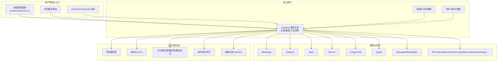
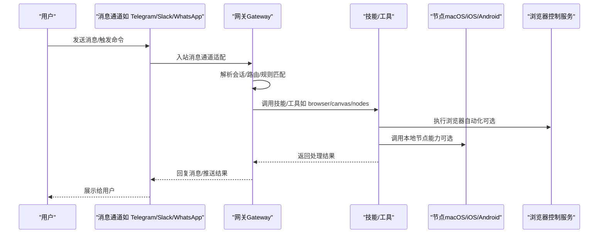
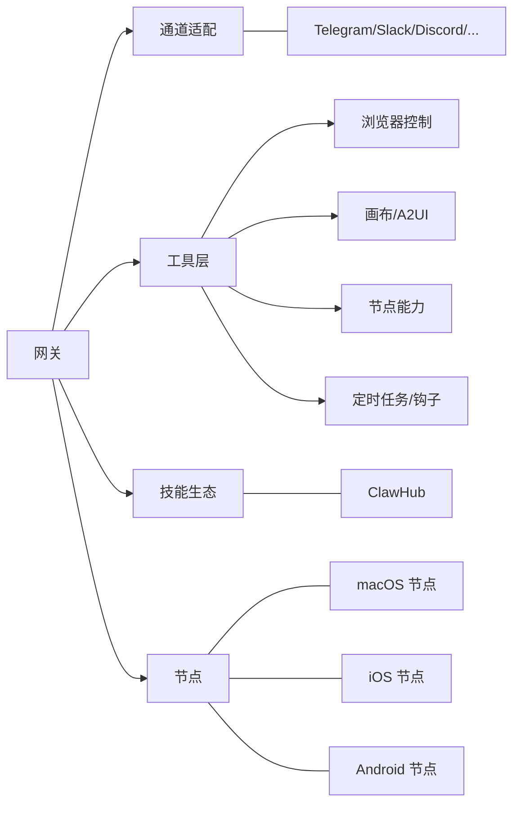

# 应用场景与用户群体

<cite>
**本文引用的文件**
- [README.md](file://README.md)
- [VISION.md](file://VISION.md)
- [docs/start/showcase.md](file://docs/start/showcase.md)
- [docs/start/getting-started.md](file://docs/start/getting-started.md)
- [docs/tools/skills.md](file://docs/tools/skills.md)
- [docs/tools/browser.md](file://docs/tools/browser.md)
- [docs/channels/index.md](file://docs/channels/index.md)
- [docs/concepts/architecture.md](file://docs/concepts/architecture.md)
- [docs/platforms/macos.md](file://docs/platforms/macos.md)
- [docs/platforms/ios.md](file://docs/platforms/ios.md)
- [docs/platforms/android.md](file://docs/platforms/android.md)
- [docs/platforms/linux.md](file://docs/platforms/linux.md)
- [docs/platforms/windows.md](file://docs/platforms/windows.md)
- [docs/gateway/security.md](file://docs/gateway/security.md)
- [docs/help/index.md](file://docs/help/index.md)
- [docs/zh-CN/start/showcase.md](file://docs/zh-CN/start/showcase.md)
</cite>

## 目录

1. [引言](#引言)
2. [项目结构](#项目结构)
3. [核心组件](#核心组件)
4. [架构总览](#架构总览)
5. [详细组件分析](#详细组件分析)
6. [依赖关系分析](#依赖关系分析)
7. [性能考量](#性能考量)
8. [故障排查指南](#故障排查指南)
9. [结论](#结论)
10. [附录](#附录)

## 引言

本文件面向希望了解 OpenClaw 在不同领域中可落地的应用场景与目标用户群体的读者。OpenClaw 是一款“本地优先”的个人 AI 助手，可在您自己的设备上运行，并通过多种即时通讯渠道与您互动；同时支持浏览器自动化、节点控制（macOS/iOS/Android）、画布可视化工作区、多代理路由与技能生态等能力。本文将从“用户画像、使用场景、典型用例、最佳实践”四个维度，系统阐述 OpenClaw 的适用性与价值。

## 项目结构

OpenClaw 采用模块化设计：核心网关负责会话、通道、工具与事件的统一控制平面；平台侧提供 macOS/iOS/Android 等节点与配套应用；工具层提供浏览器控制、画布、节点、定时任务等；技能生态通过 ClawHub 进行注册与分发。下图给出与应用场景直接相关的高层视图。

图表来源

- [README.md: 185-238:185-238](file://README.md#L185-L238)
- [docs/concepts/architecture.md](file://docs/concepts/architecture.md)
- [docs/tools/browser.md: 10-14:10-14](file://docs/tools/browser.md#L10-L14)
- [docs/tools/skills.md: 10-11:10-11](file://docs/tools/skills.md#L10-L11)

章节来源

- [README.md: 21-23:21-23](file://README.md#L21-L23)
- [README.md: 126-176:126-176](file://README.md#L126-L176)
- [docs/concepts/architecture.md](file://docs/concepts/architecture.md)

## 核心组件

- 网关（Gateway）：统一的控制平面，承载会话、通道、工具与事件处理，提供 WebSocket 接口供客户端与工具访问。
- 多通道接入：覆盖主流 IM 渠道，支持私聊与群组路由、提及触发、回复标签等规则。
- 浏览器控制：专用或扩展中继两种模式，提供快照、截图、动作、等待、状态设置等能力。
- 画布与 A2UI：支持可视化工作区，便于演示、协作与交互。
- 节点（Nodes）：在 macOS/iOS/Android 上执行本地能力（如系统命令、相机、屏幕录制、通知、定位等）。
- 技能生态（Skills/ClawHub）：通过 SKILL.md 描述的技能，将工具能力转化为自然语言指令，支持按环境/配置/二进制进行加载门控。
- 安全与隔离：默认安全策略、沙箱模式、远程暴露与认证、权限模型等。

章节来源

- [README.md: 126-176:126-176](file://README.md#L126-L176)
- [docs/tools/browser.md: 10-14:10-14](file://docs/tools/browser.md#L10-L14)
- [docs/tools/skills.md: 10-11:10-11](file://docs/tools/skills.md#L10-L11)
- [docs/gateway/security.md](file://docs/gateway/security.md)

## 架构总览

下图展示 OpenClaw 的端到端工作流：用户通过任意渠道与网关交互，网关根据会话与规则调度工具与技能，必要时通过节点执行本地能力，最终返回结果或触发自动化流程。

图表来源

- [README.md: 185-238:185-238](file://README.md#L185-L238)
- [docs/tools/browser.md: 418-430:418-430](file://docs/tools/browser.md#L418-L430)
- [docs/platforms/macos.md](file://docs/platforms/macos.md)
- [docs/platforms/ios.md](file://docs/platforms/ios.md)
- [docs/platforms/android.md](file://docs/platforms/android.md)

章节来源

- [README.md: 185-238:185-238](file://README.md#L185-L238)

## 详细组件分析

### 场景一：个人助理（个人用户）

- 用户画像
  - 需要“本地、快速、始终在线”的个人助手
  - 希望在常用即时通讯渠道中与助手对话，无需切换应用
  - 对隐私与安全有较高要求，偏好自托管
- 使用需求
  - 快速问答、日程提醒、邮件摘要、天气查询、学习辅助
  - 自动化日常事务（如购物清单、账单整理、健康记录同步）
  - 通过浏览器自动化完成登录、下单、截图、报告生成等
- 典型用例
  - 通过 Telegram/WhatsApp/Slack 私聊获取每日简报、任务提醒与知识检索
  - 使用浏览器技能自动完成每周超市购物清单的下单与确认
  - 通过画布生成可视化日程或思维导图
- 最佳实践
  - 使用“配对/批准”机制确保私聊安全
  - 启用沙箱模式运行非主会话，降低风险
  - 利用技能生态与 ClawHub 获取现成能力，按需启用
  - 通过 Tailscale 或 SSH 隧道安全暴露网关（仅限受信网络）

章节来源

- [README.md: 21-23:21-23](file://README.md#L21-L23)
- [README.md: 112-125:112-125](file://README.md#L112-L125)
- [docs/start/getting-started.md: 13-18:13-18](file://docs/start/getting-started.md#L13-L18)
- [docs/tools/browser.md: 246-254:246-254](file://docs/tools/browser.md#L246-L254)
- [docs/tools/skills.md: 50-68:50-68](file://docs/tools/skills.md#L50-L68)

### 场景二：企业协作（团队与组织）

- 用户画像
  - 需要在 Slack/Discord/Teams 等团队协作平台中进行智能问答与任务编排
  - 关注合规、审计与权限控制，需要明确的路由与隔离策略
- 使用需求
  - 按项目/群组路由到专属代理，避免信息泄露
  - 自动化工单处理、会议纪要生成、知识检索与索引
  - 通过浏览器自动化对接内部系统（如 Jira/Notion/Confluence）
- 典型用例
  - Slack 中通过提及触发特定代理，自动拉取任务并生成进度报告
  - Discord 中基于技能自动创建/更新任务卡片并转发至项目看板
  - Teams 中自动归档会议记录并生成摘要
- 最佳实践
  - 使用“群组路由”与“激活模式”控制响应范围
  - 为不同项目/群组配置独立代理与工作空间
  - 启用“重试策略”与“打字指示”提升用户体验
  - 严格限制通道白名单与 DM 策略，避免未授权访问

章节来源

- [README.md: 129-131:129-131](file://README.md#L129-L131)
- [docs/channels/index.md](file://docs/channels/index.md)
- [docs/concepts/architecture.md](file://docs/concepts/architecture.md)

### 场景三：开发者工具（技术团队与独立开发者）

- 用户画像
  - 需要跨平台、可扩展、可编程的开发辅助工具
  - 希望在终端、浏览器与聊天界面之间无缝切换
- 使用需求
  - 代码审查反馈、文档搜索、API 调用与测试
  - 本地/远程节点执行系统命令、抓取屏幕/相机、定位与通知
  - 通过画布进行原型设计与可视化说明
- 典型用例
  - 在 Telegram 中发起 PR 审查，OpenClaw 自动分析差异并给出建议
  - 通过浏览器自动化完成网站登录、表单填写与截图存档
  - 在 iOS/Android 节点上触发摄像头拍摄并回传到聊天界面
- 最佳实践
  - 使用“节点模式”在设备侧执行敏感操作（如屏幕录制、通知）
  - 将技能安装到工作空间，确保团队共享与版本一致
  - 通过 TUI/CLI 与 Dashboard 结合进行监控与调试

章节来源

- [docs/platforms/macos.md](file://docs/platforms/macos.md)
- [docs/platforms/ios.md](file://docs/platforms/ios.md)
- [docs/platforms/android.md](file://docs/platforms/android.md)
- [docs/tools/browser.md: 418-430:418-430](file://docs/tools/browser.md#L418-L430)
- [docs/tools/skills.md: 28-40:28-40](file://docs/tools/skills.md#L28-L40)

### 场景四：教育辅助（学生与教师）

- 用户画像
  - 需要个性化学习路径与口语练习反馈
  - 希望通过多模态（语音/图像/文本）进行互动
- 使用需求
  - 语言学习（发音纠正、词汇练习、语法讲解）
  - 作业与实验记录（拍照/截图/视频），自动生成报告
  - 课程资料检索与知识图谱构建
- 典型用例
  - 通过 Telegram 与语音助手进行中文口语练习，获得即时反馈
  - 使用相机技能拍摄实验现象，结合 OCR 生成实验报告
  - 基于技能构建“知识记忆库”，支持语义检索与交叉引用
- 最佳实践
  - 为学习场景定制专属代理与提示词模板
  - 使用浏览器自动化抓取教育资源并结构化存储
  - 通过画布生成学习计划与进度可视化

章节来源

- [docs/tools/browser.md: 10-14:10-14](file://docs/tools/browser.md#L10-L14)
- [docs/tools/skills.md: 78-102:78-102](file://docs/tools/skills.md#L78-L102)

### 场景五：家庭与硬件控制（智能家居与个人设备）

- 用户画像
  - 希望通过自然语言控制家电、机器人与周边设备
  - 重视隐私与本地化，不希望云端集中存储设备数据
- 使用需求
  - 设备状态查询、任务调度与异常告警
  - 与 Home Assistant 等系统联动，实现自动化场景
- 典型用例
  - 通过 Telegram 控制 Roborock 扫地机器人启动/暂停/回充
  - 使用浏览器自动化登录设备管理页面，批量配置参数
  - 基于技能构建“家庭日程”与“能耗统计”
- 最佳实践
  - 将设备控制封装为技能，统一接口与鉴权
  - 通过节点在本地执行命令，避免网络延迟与隐私泄露
  - 使用沙箱模式隔离高风险操作

章节来源

- [docs/platforms/macos.md](file://docs/platforms/macos.md)
- [docs/platforms/linux.md](file://docs/platforms/linux.md)
- [docs/platforms/windows.md](file://docs/platforms/windows.md)

## 依赖关系分析

- 组件耦合
  - 网关是核心控制平面，与通道、工具、节点、技能高度解耦，通过统一协议交互
  - 通道适配层与工具层相对独立，便于扩展新渠道与新工具
- 外部依赖
  - 浏览器自动化依赖 CDP 与 Playwright（可选）
  - 节点侧依赖各平台系统权限与能力（macOS TCC、iOS/Android 权限）
  - 技能生态依赖 ClawHub 注册中心与本地工作空间
- 安全边界
  - 默认 DM 策略与配对机制防止未授权访问
  - 沙箱模式与远程暴露策略共同保障运行安全

图表来源

- [README.md: 126-176:126-176](file://README.md#L126-L176)
- [docs/tools/browser.md: 10-14:10-14](file://docs/tools/browser.md#L10-L14)
- [docs/tools/skills.md: 10-11:10-11](file://docs/tools/skills.md#L10-L11)

章节来源

- [README.md: 126-176:126-176](file://README.md#L126-L176)

## 性能考量

- 会话与上下文压缩：通过会话修剪与紧凑模式减少 token 消耗
- 技能列表注入开销：技能列表长度影响系统提示字符数，建议按需启用
- 浏览器自动化：在缺少 Playwright 时部分高级能力不可用，建议按需安装
- 远程暴露：通过 Tailscale Serve/Funnel 提供安全外网访问，注意认证与权限

章节来源

- [docs/concepts/architecture.md](file://docs/concepts/architecture.md)
- [docs/tools/browser.md: 393-403:393-403](file://docs/tools/browser.md#L393-L403)
- [docs/tools/skills.md: 269-286:269-286](file://docs/tools/skills.md#L269-L286)

## 故障排查指南

- 常见问题定位
  - 安装与环境：检查 Node 版本与 PATH，参考“安装健康检查”
  - 网关状态：使用状态命令确认服务是否正常
  - 日志与诊断：通过日志与 Doctor 工具进行诊断
- 通道与安全
  - DM 策略与配对：确保未知发送方被正确拦截与批准
  - 远程暴露：仅在受信网络下开启，避免公网暴露
- 浏览器自动化
  - Playwright 缺失：按需安装并重启网关
  - 跨主机（WSL2/Windows）：调整 relay 绑定地址与网络策略

章节来源

- [docs/help/index.md: 13-18:13-18](file://docs/help/index.md#L13-L18)
- [docs/start/getting-started.md: 84-102:84-102](file://docs/start/getting-started.md#L84-L102)
- [docs/gateway/security.md](file://docs/gateway/security.md)
- [docs/tools/browser.md: 647-654:647-654](file://docs/tools/browser.md#L647-L654)

## 结论

OpenClaw 以“本地优先、通道丰富、工具完备、生态开放”为核心优势，能够覆盖从个人助理到企业协作、从开发者工具到教育辅助、从家庭控制到多平台应用的广泛场景。通过安全默认、沙箱隔离与灵活的远程暴露策略，OpenClaw 在保障隐私与可控性的前提下，最大化发挥 AI 助手的生产力价值。建议用户结合自身需求选择合适的通道与工具组合，并遵循最佳实践以获得稳定、安全与高效的体验。

## 附录

### 成功案例与社区展示

- 社区展示了大量真实用例，涵盖 PR 审查反馈、自动化购物、语音转写、3D 打印机控制、旅行查询、健康数据整合、iOS 应用构建等，均可作为参考与灵感来源。

章节来源

- [docs/start/showcase.md: 88-210:88-210](file://docs/start/showcase.md#L88-L210)
- [docs/start/showcase.md: 211-287:211-287](file://docs/start/showcase.md#L211-L287)
- [docs/start/showcase.md: 289-337:289-337](file://docs/start/showcase.md#L289-L337)
- [docs/start/showcase.md: 339-367:339-367](file://docs/start/showcase.md#L339-L367)
- [docs/start/showcase.md: 369-389:369-389](file://docs/start/showcase.md#L369-L389)
- [docs/start/showcase.md: 391-401:391-401](file://docs/start/showcase.md#L391-L401)
- [docs/zh-CN/start/showcase.md: 157-191:157-191](file://docs/zh-CN/start/showcase.md#L157-L191)
