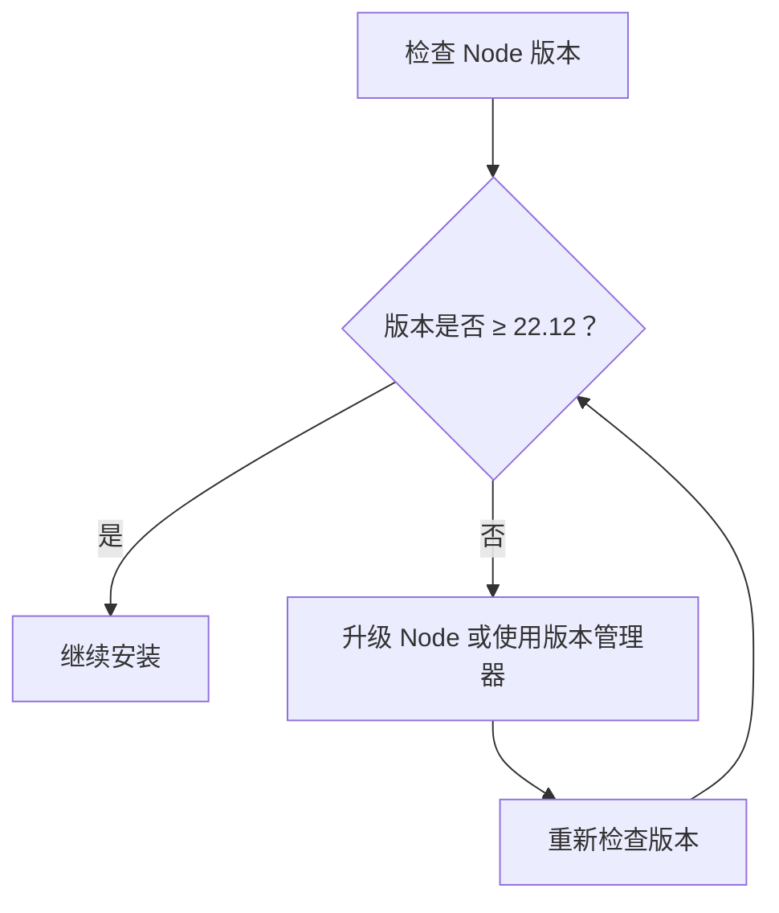
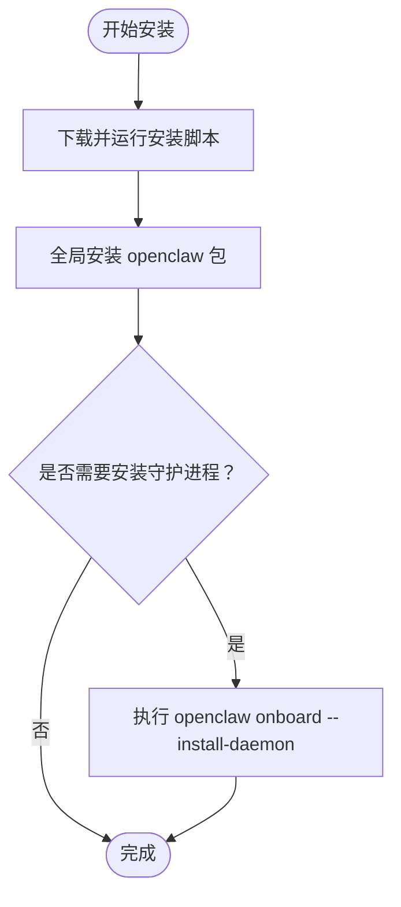
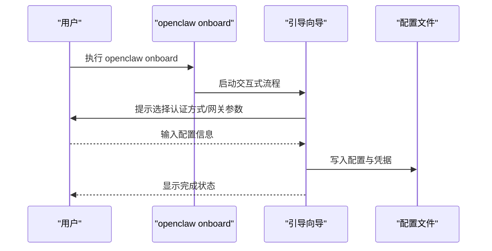
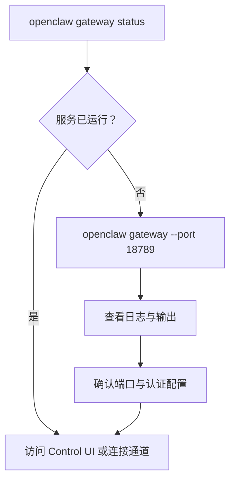
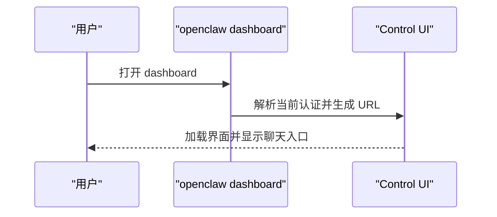

# 快速开始指南

<cite>
**本文档引用的文件**
- [README.md](file://README.md)
- [package.json](file://package.json)
- [openclaw.mjs](file://openclaw.mjs)
- [docs/start/getting-started.md](file://docs/start/getting-started.md)
- [docs/install/node.md](file://docs/install/node.md)
- [docs/cli/onboard.md](file://docs/cli/onboard.md)
- [docs/cli/gateway.md](file://docs/cli/gateway.md)
- [docs/cli/message.md](file://docs/cli/message.md)
- [docs/cli/agent.md](file://docs/cli/agent.md)
- [docs/cli/dashboard.md](file://docs/cli/dashboard.md)
</cite>

## 目录

1. [简介](#简介)
2. [系统要求与环境准备](#系统要求与环境准备)
3. [安装 OpenClaw](#安装-openclaw)
4. [运行引导向导](#运行引导向导)
5. [启动网关服务](#启动网关服务)
6. [基础配置与验证](#基础配置与验证)
7. [核心命令使用](#核心命令使用)
8. [常见示例](#常见示例)
9. [故障排除](#故障排除)
10. [总结](#总结)

## 简介

OpenClaw 是一个可在本地设备上运行的个人 AI 助手，支持多渠道消息集成（如 WhatsApp、Telegram、Slack、Discord、Google Chat、Signal、iMessage、BlueBubbles、IRC、Microsoft Teams、Matrix、Feishu、LINE、Mattermost、Nextcloud Talk、Nostr、Synology Chat、Tlon、Twitch、Zalo 等），并提供网关控制平面用于会话管理、工具调用与事件处理。本指南将带你从零开始完成安装、配置与首次使用。

## 系统要求与环境准备

- 运行时：Node.js 版本需满足最低要求（建议使用 Node 22 或更高版本）。
- 推荐使用 npm、pnpm 或 bun 进行安装与运行。
- 在 Windows 上推荐通过 WSL2 使用（官方支持）。

**图表来源**

- [openclaw.mjs:17-34](file://openclaw.mjs#L17-L34)
- [docs/install/node.md:14-21](file://docs/install/node.md#L14-L21)

**章节来源**

- [openclaw.mjs:5-34](file://openclaw.mjs#L5-L34)
- [docs/install/node.md:12-21](file://docs/install/node.md#L12-L21)

## 安装 OpenClaw

- 推荐使用官方安装脚本进行安装（支持 macOS/Linux 和 Windows PowerShell）。
- 安装后可通过 `openclaw onboard --install-daemon` 安装并启动后台服务（可选）。

**图表来源**

- [docs/start/getting-started.md:30-58](file://docs/start/getting-started.md#L30-L58)
- [README.md:50-61](file://README.md#L50-L61)

**章节来源**

- [docs/start/getting-started.md:30-58](file://docs/start/getting-started.md#L30-L58)
- [README.md:50-61](file://README.md#L50-L61)

## 运行引导向导

- 使用交互式引导向导完成认证、网关设置与可选渠道配置。
- 支持多种模式与非交互式自动化选项，适合不同场景（快速入门、手动配置、远程网关等）。

**图表来源**

- [docs/cli/onboard.md:20-27](file://docs/cli/onboard.md#L20-L27)
- [docs/cli/onboard.md:129-134](file://docs/cli/onboard.md#L129-L134)

**章节来源**

- [docs/cli/onboard.md:8-27](file://docs/cli/onboard.md#L8-L27)
- [docs/cli/onboard.md:129-134](file://docs/cli/onboard.md#L129-L134)

## 启动网关服务

- 可通过 `openclaw gateway status` 检查服务状态。
- 如需前台运行或调试，可使用 `openclaw gateway --port 18789`。
- 支持多种绑定模式与认证方式（令牌/密码），以及通过 Tailscale 暴露网关的能力。

**图表来源**

- [docs/cli/gateway.md:85-99](file://docs/cli/gateway.md#L85-L99)
- [docs/cli/gateway.md:22-34](file://docs/cli/gateway.md#L22-L34)

**章节来源**

- [docs/cli/gateway.md:85-99](file://docs/cli/gateway.md#L85-L99)
- [docs/cli/gateway.md:22-34](file://docs/cli/gateway.md#L22-L34)

## 基础配置与验证

- 首次运行后，可通过 `openclaw dashboard` 打开控制界面进行验证。
- 若仅需最小化聊天体验，无需配置任何外部渠道，直接打开 Control UI 即可开始对话。
- 环境变量可用于自定义配置路径与状态目录（如 `OPENCLAW_HOME`、`OPENCLAW_STATE_DIR`、`OPENCLAW_CONFIG_PATH`）。

**图表来源**

- [docs/cli/dashboard.md:9-16](file://docs/cli/dashboard.md#L9-L16)

**章节来源**

- [docs/start/getting-started.md:72-77](file://docs/start/getting-started.md#L72-L77)
- [docs/cli/dashboard.md:9-16](file://docs/cli/dashboard.md#L9-L16)
- [docs/start/getting-started.md:104-112](file://docs/start/getting-started.md#L104-L112)

## 核心命令使用

以下为核心命令及其用途概览（更多选项与示例请参考对应文档）：

- openclaw onboard
  - 用途：交互式引导向导，完成认证、网关与渠道配置。
  - 示例：`openclaw onboard --install-daemon`
  - 参考：[onboard 文档:20-27](file://docs/cli/onboard.md#L20-L27)

- openclaw gateway
  - 用途：运行、查询与发现网关；管理服务生命周期。
  - 示例：`openclaw gateway status`、`openclaw gateway --port 18789`
  - 参考：[gateway 文档:85-99](file://docs/cli/gateway.md#L85-L99)

- openclaw message
  - 用途：发送消息与执行频道操作（支持多平台）。
  - 示例：`openclaw message send --target +1234567890 --message "Hello"`
  - 参考：[message 文档:57-59](file://docs/cli/message.md#L57-L59)

- openclaw agent
  - 用途：通过网关执行一次代理回合（可选回复交付）。
  - 示例：`openclaw agent --message "Ship checklist" --thinking high`
  - 参考：[agent 文档:19-24](file://docs/cli/agent.md#L19-L24)

- openclaw dashboard
  - 用途：打开控制界面，支持不自动打开浏览器。
  - 示例：`openclaw dashboard --no-open`
  - 参考：[dashboard 文档:13-16](file://docs/cli/dashboard.md#L13-L16)

**章节来源**

- [docs/cli/onboard.md:20-27](file://docs/cli/onboard.md#L20-L27)
- [docs/cli/gateway.md:85-99](file://docs/cli/gateway.md#L85-L99)
- [docs/cli/message.md:57-59](file://docs/cli/message.md#L57-L59)
- [docs/cli/agent.md:19-24](file://docs/cli/agent.md#L19-L24)
- [docs/cli/dashboard.md:13-16](file://docs/cli/dashboard.md#L13-L16)

## 常见示例

- 快速开始（最小化体验）
  - 安装后直接打开 Control UI 开始聊天，无需配置任何外部渠道。
  - 参考：[Getting Started:13-18](file://docs/start/getting-started.md#L13-L18)

- 发送测试消息
  - 需要已配置的频道后，可使用如下命令发送测试消息：
  - 示例：`openclaw message send --target +15555550123 --message "Hello from OpenClaw"`
  - 参考：[message 文档:97-99](file://docs/cli/message.md#L97-L99)

- 通过代理对话
  - 示例：`openclaw agent --message "Ship checklist" --thinking high`
  - 参考：[agent 文档:19-24](file://docs/cli/agent.md#L19-L24)

- 启动网关并指定端口
  - 示例：`openclaw gateway --port 18789`
  - 参考：[gateway 文档:22-34](file://docs/cli/gateway.md#L22-L34)

**章节来源**

- [docs/start/getting-started.md:13-18](file://docs/start/getting-started.md#L13-L18)
- [docs/cli/message.md:97-99](file://docs/cli/message.md#L97-L99)
- [docs/cli/agent.md:19-24](file://docs/cli/agent.md#L19-L24)
- [docs/cli/gateway.md:22-34](file://docs/cli/gateway.md#L22-L34)

## 故障排除

- Node 版本问题
  - 症状：提示需要更高版本的 Node。
  - 处理：确保 Node 版本满足最低要求，并正确初始化版本管理器（如 nvm/fnm）。
  - 参考：[Node 安装与版本检查:14-21](file://docs/install/node.md#L14-L21)

- 命令未找到（command not found）
  - 症状：终端提示 `openclaw: command not found`。
  - 处理：检查 npm 全局前缀是否在 PATH 中，并将其添加到 shell 启动文件。
  - 参考：[Node 安装与 PATH 修复:91-126](file://docs/install/node.md#L91-L126)

- 权限错误（Linux）
  - 症状：`npm install -g` 报错 `EACCES`。
  - 处理：将 npm 全局前缀切换到用户可写目录并更新 PATH。
  - 参考：[权限错误处理:128-139](file://docs/install/node.md#L128-L139)

- 网关无法绑定或认证失败
  - 症状：网关拒绝启动或无法对外暴露。
  - 处理：检查绑定模式与认证配置，必要时使用 Tailscale 暴露网关。
  - 参考：[gateway 认证与绑定:36-53](file://docs/cli/gateway.md#L36-L53)

**章节来源**

- [docs/install/node.md:14-21](file://docs/install/node.md#L14-L21)
- [docs/install/node.md:91-126](file://docs/install/node.md#L91-L126)
- [docs/install/node.md:128-139](file://docs/install/node.md#L128-L139)
- [docs/cli/gateway.md:36-53](file://docs/cli/gateway.md#L36-L53)

## 总结

通过本指南，你已完成：

- Node.js 环境准备与版本检查
- OpenClaw 的安装与守护进程安装
- 引导向导的运行与基础配置
- 网关服务的启动与状态检查
- 控制界面的访问与首次聊天体验
- 常用命令的使用与简单示例
- 常见问题的排查与解决

下一步建议：

- 配置常用消息渠道（如 Telegram/WhatsApp/Slack 等）
- 查看安全策略与 DM 配置
- 探索更多高级功能（工具、技能、自动化）
