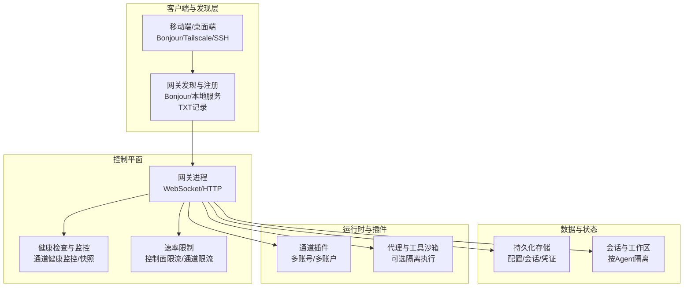
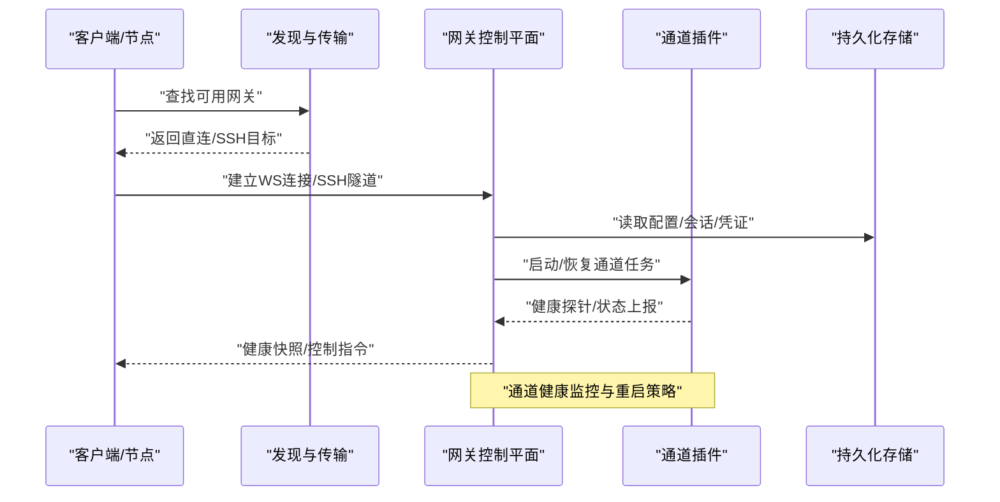
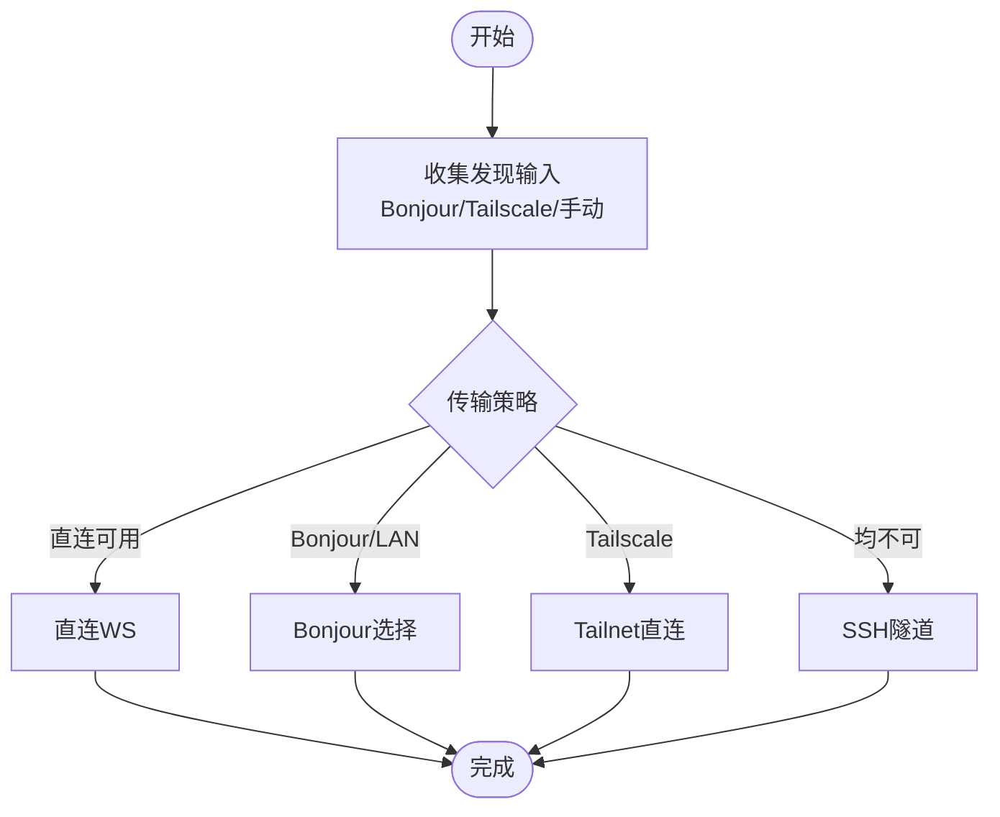
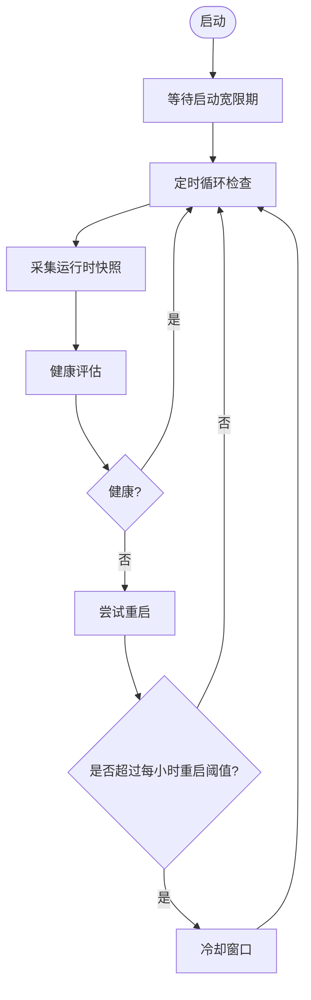
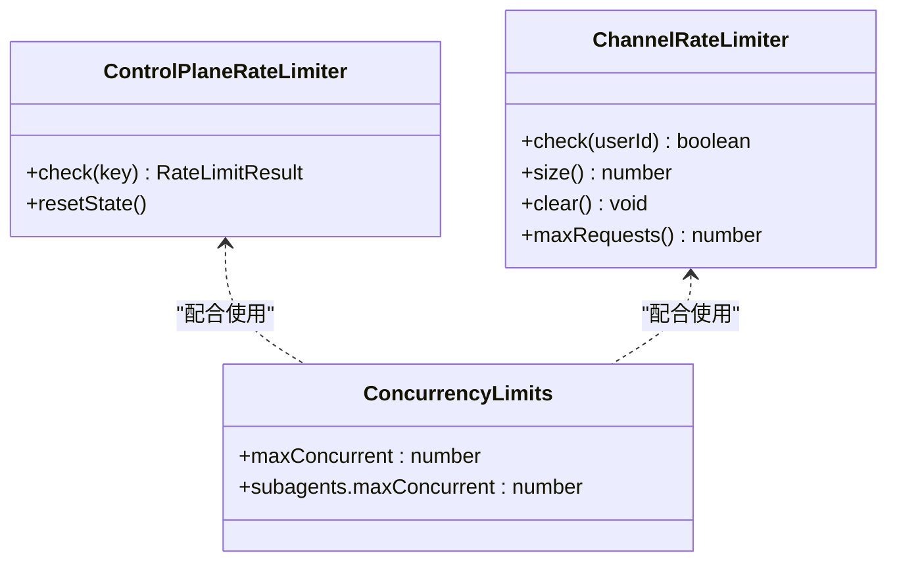
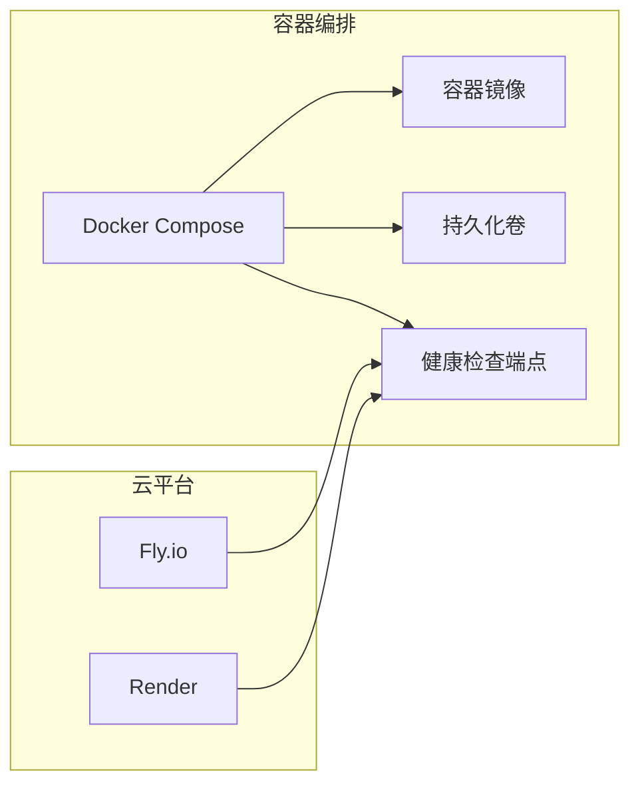
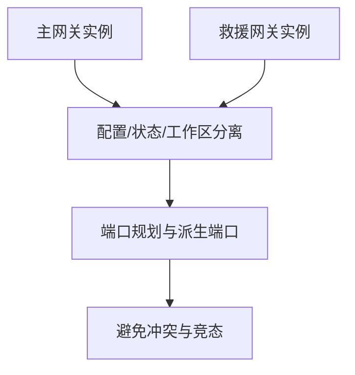
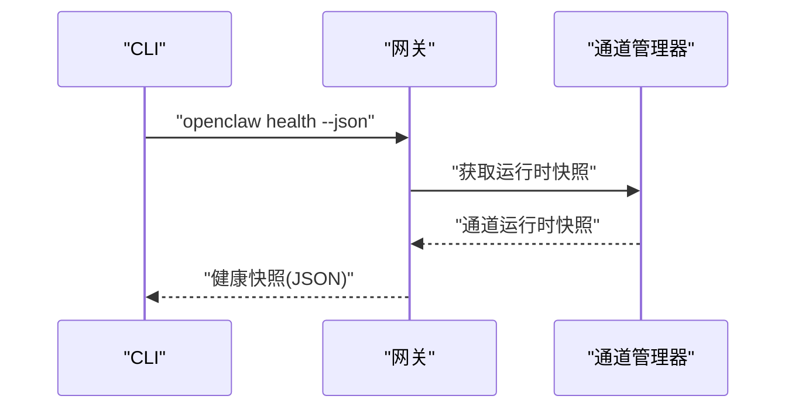
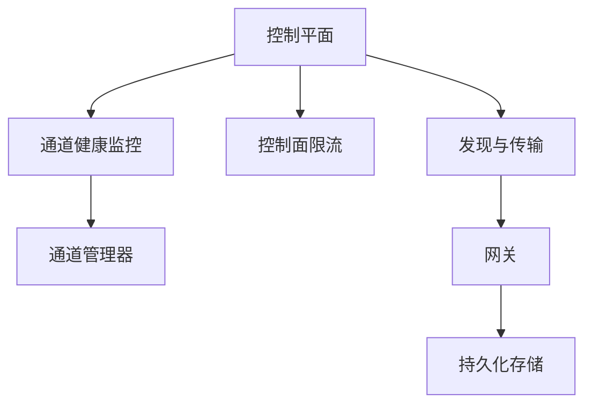

# 可扩展性设计

<cite>
**本文引用的文件**
- [multiple-gateways.md](file://docs/gateway/multiple-gateways.md)
- [discovery.md](file://docs/gateway/discovery.md)
- [fly.md](file://docs/install/fly.md)
- [docker.md](file://docs/install/docker.md)
- [health.md](file://docs/gateway/health.md)
- [auth-monitoring.md](file://docs/automation/auth-monitoring.md)
- [cluster.md](file://docs/refactor/cluster.md)
- [render.mdx](file://docs/install/render.mdx)
- [gateway-models.profiles.live.test.ts](file://src/gateway/gateway-models.profiles.live.test.ts)
- [channel-health-monitor.ts](file://src/gateway/channel-health-monitor.ts)
- [channel-health-policy.ts](file://src/gateway/channel-health-policy.ts)
- [status-helpers.ts](file://src/plugin-sdk/status-helpers.ts)
- [control-plane-rate-limit.ts](file://src/gateway/control-plane-rate-limit.ts)
- [limits.test.ts](file://extensions/matrix/src/matrix/actions/limits.test.ts)
- [security.ts](file://extensions/synology-chat/src/security.ts)
- [health.ts](file://src/commands/health.ts)
- [status.command.ts](file://src/commands/status.command.ts)
- [failover-error.ts](file://src/agents/failover-error.ts)
- [thread-bindings.lifecycle.ts](file://src/discord/monitor/thread-bindings.lifecycle.ts)
- [GatewayDiscovery.kt](file://apps/android/app/src/main/java/ai/openclaw/app/gateway/GatewayDiscovery.kt)
</cite>

## 目录

1. [引言](#引言)
2. [项目结构](#项目结构)
3. [核心组件](#核心组件)
4. [架构总览](#架构总览)
5. [详细组件分析](#详细组件分析)
6. [依赖关系分析](#依赖关系分析)
7. [性能考量](#性能考量)
8. [故障排查指南](#故障排查指南)
9. [结论](#结论)
10. [附录](#附录)

## 引言

本文件面向OpenClaw的可扩展性设计，聚焦于水平扩展能力（多网关集群、负载均衡与故障转移）、节点发现与动态路由、性能优化与容量规划、监控与健康检查、以及自动扩缩容与运维最佳实践。文档基于仓库内现有实现与文档进行系统化梳理，并通过图示展示关键流程与组件交互。

## 项目结构

OpenClaw围绕“网关（Gateway）+ 多通道插件”的架构组织，支持单机多实例隔离部署、容器化编排、跨网络发现与安全传输、以及可观测与限流控制。下图给出与可扩展性相关的核心模块关系概览：

图表来源

- [discovery.md:1-124](file://docs/gateway/discovery.md#L1-L124)
- [health.md:1-36](file://docs/gateway/health.md#L1-L36)
- [docker.md:1-844](file://docs/install/docker.md#L1-L844)

章节来源

- [discovery.md:1-124](file://docs/gateway/discovery.md#L1-L124)
- [docker.md:1-844](file://docs/install/docker.md#L1-L844)

## 核心组件

- 网关（Gateway）：长期运行的控制平面，负责状态管理、通道运行、配对与认证、健康检查与限流。
- 节点发现与传输：Bonjour/LAN、Tailscale跨网络、SSH回退，确保不同网络环境下可达。
- 健康检查与通道监控：周期性通道健康评估与重启策略，结合探针超时与冷却窗口。
- 速率限制：控制面固定窗口限流与通道侧滑动窗口限流，避免过载。
- 容器化与编排：Docker Compose与云平台模板，提供健康检查路径与持久化卷。
- 多网关与多实例：同一主机多实例隔离、端口与派生端口规划、救援型网关。

章节来源

- [multiple-gateways.md:1-113](file://docs/gateway/multiple-gateways.md#L1-L113)
- [discovery.md:1-124](file://docs/gateway/discovery.md#L1-L124)
- [health.md:1-36](file://docs/gateway/health.md#L1-L36)
- [control-plane-rate-limit.ts:47-86](file://src/gateway/control-plane-rate-limit.ts#L47-L86)
- [security.ts:86-124](file://extensions/synology-chat/src/security.ts#L86-L124)

## 架构总览

OpenClaw的可扩展性以“网关为中心”的分布式控制面为核心，结合以下关键机制：

- 水平扩展：通过多网关实例与通道多账户并行处理，提升吞吐与可用性。
- 动态路由：基于节点发现与传输选择策略，优先直连，失败时回退到SSH。
- 故障转移：通道健康监控与重启策略，结合探针超时与冷却窗口，避免雪崩。
- 资源治理：控制面与通道侧限流、并发上限、会话与工作区隔离。
- 运维可观测：健康快照、探针超时、日志与告警脚本、容器健康检查端点。

图表来源

- [discovery.md:100-124](file://docs/gateway/discovery.md#L100-L124)
- [health.ts:348-375](file://src/commands/health.ts#L348-L375)
- [channel-health-monitor.ts:76-111](file://src/gateway/channel-health-monitor.ts#L76-L111)

## 详细组件分析

### 组件A：节点发现与动态路由

- 发现输入：Bonjour（局域网）、Tailscale（跨网络）、手动/SSH。
- 传输选择：优先已配对直连；否则Bonjour/LAN；再者Tailscale；最后SSH回退。
- 安全约束：Bonjour TXT未认证，客户端应以解析到的服务端点为准；TLS指纹需显式确认。
- 客户端实现要点：维护候选网关列表、状态文本、DNS解析与TXT记录解析、稳定ID生成与去重。

图表来源

- [discovery.md:100-124](file://docs/gateway/discovery.md#L100-L124)
- [GatewayDiscovery.kt:46-285](file://apps/android/app/src/main/java/ai/openclaw/app/gateway/GatewayDiscovery.kt#L46-L285)

章节来源

- [discovery.md:1-124](file://docs/gateway/discovery.md#L1-L124)
- [GatewayDiscovery.kt:46-285](file://apps/android/app/src/main/java/ai/openclaw/app/gateway/GatewayDiscovery.kt#L46-L285)

### 组件B：通道健康监控与故障转移

- 周期性检查：在启动宽限期后开始，结合冷却周期与重启次数限制。
- 健康评估：基于运行时快照、忙碌状态、最近活动时间等综合判断。
- 故障转移：超时或失败触发重启，超过每小时重启阈值进入冷却。
- 探针超时：统一的探针超时封装，避免长时间阻塞。

图表来源

- [channel-health-monitor.ts:76-111](file://src/gateway/channel-health-monitor.ts#L76-L111)
- [channel-health-policy.ts:57-81](file://src/gateway/channel-health-policy.ts#L57-L81)
- [gateway-models.profiles.live.test.ts:104-145](file://src/gateway/gateway-models.profiles.live.test.ts#L104-L145)

章节来源

- [channel-health-monitor.ts:76-111](file://src/gateway/channel-health-monitor.ts#L76-L111)
- [channel-health-policy.ts:57-81](file://src/gateway/channel-health-policy.ts#L57-L81)
- [gateway-models.profiles.live.test.ts:104-145](file://src/gateway/gateway-models.profiles.live.test.ts#L104-L145)

### 组件C：速率限制与资源治理

- 控制面限流：固定窗口限流，限制控制平面请求频率，返回剩余配额与重试时间。
- 通道侧限流：按用户ID的固定窗口限流，可配置窗口与最大跟踪用户数。
- 并发上限：通道动作限制与子代理并发默认值，保证资源不被过度占用。
- 会话与工作区隔离：多Agent多会话隔离，避免共享状态引发竞争。

图表来源

- [control-plane-rate-limit.ts:47-86](file://src/gateway/control-plane-rate-limit.ts#L47-L86)
- [security.ts:86-124](file://extensions/synology-chat/src/security.ts#L86-L124)
- [limits.test.ts:1-15](file://extensions/matrix/src/matrix/actions/limits.test.ts#L1-L15)

章节来源

- [control-plane-rate-limit.ts:47-86](file://src/gateway/control-plane-rate-limit.ts#L47-L86)
- [security.ts:86-124](file://extensions/synology-chat/src/security.ts#L86-L124)
- [limits.test.ts:1-15](file://extensions/matrix/src/matrix/actions/limits.test.ts#L1-L15)

### 组件D：容器化与编排（含健康检查）

- Docker Compose：容器化网关、持久化卷、健康检查端点、沙箱与浏览器镜像。
- 云平台模板：Fly.io/Render等提供健康检查路径与自动启停/扩缩容配置。
- 健康检查：/healthz（浅存活）、/readyz（就绪）、CLI健康快照命令。

图表来源

- [docker.md:469-495](file://docs/install/docker.md#L469-L495)
- [fly.md:66-92](file://docs/install/fly.md#L66-L92)
- [render.mdx:26-63](file://docs/install/render.mdx#L26-L63)

章节来源

- [docker.md:1-844](file://docs/install/docker.md#L1-L844)
- [fly.md:1-491](file://docs/install/fly.md#L1-L491)
- [render.mdx:1-54](file://docs/install/render.mdx#L1-L54)

### 组件E：多网关与多实例（同机隔离）

- 隔离清单：独立配置、状态目录、工作区、唯一端口与派生端口。
- 推荐：使用profile自动作用域化状态与服务名，便于多实例并存。
- 救援型网关：与主网关隔离，端口间距至少20，便于调试与变更。
- 端口映射：基础端口、浏览器控制端口、画布端口、CDP范围分配规则。

图表来源

- [multiple-gateways.md:13-113](file://docs/gateway/multiple-gateways.md#L13-L113)

章节来源

- [multiple-gateways.md:1-113](file://docs/gateway/multiple-gateways.md#L1-L113)

### 组件F：健康检查与可观测

- CLI健康快照：聚合通道探针、会话摘要、心跳间隔等，支持超时参数。
- 深度诊断：通道登录状态、会话存储、日志关键词过滤。
- 认证监控：模型提供商OAuth到期检查与告警脚本。
- 状态汇总：心跳间隔、队列事件、会话路径等。

图表来源

- [health.md:1-36](file://docs/gateway/health.md#L1-L36)
- [health.ts:348-375](file://src/commands/health.ts#L348-L375)
- [status-helpers.ts:90-123](file://src/plugin-sdk/status-helpers.ts#L90-L123)
- [status.command.ts:318-358](file://src/commands/status.command.ts#L318-L358)

章节来源

- [health.md:1-36](file://docs/gateway/health.md#L1-L36)
- [health.ts:348-375](file://src/commands/health.ts#L348-L375)
- [status-helpers.ts:90-123](file://src/plugin-sdk/status-helpers.ts#L90-L123)
- [status.command.ts:318-358](file://src/commands/status.command.ts#L318-L358)

## 依赖关系分析

- 组件耦合
  - 控制平面与通道插件：通过通道管理器与健康监控解耦，通道侧可独立演进。
  - 发现与传输：客户端仅消费发现结果，传输策略集中于客户端逻辑。
  - 限流与并发：控制面与通道侧限流相互补充，避免全局过载。
- 外部依赖
  - 云平台健康检查端点与自动启停/扩缩容策略。
  - 容器健康检查（/healthz）作为编排系统重启/替换依据。
- 循环依赖
  - 未见直接循环依赖；通道健康监控依赖通道管理器快照，属于单向依赖。

图表来源

- [channel-health-monitor.ts:76-111](file://src/gateway/channel-health-monitor.ts#L76-L111)
- [control-plane-rate-limit.ts:47-86](file://src/gateway/control-plane-rate-limit.ts#L47-L86)
- [discovery.md:1-124](file://docs/gateway/discovery.md#L1-L124)

章节来源

- [channel-health-monitor.ts:76-111](file://src/gateway/channel-health-monitor.ts#L76-L111)
- [control-plane-rate-limit.ts:47-86](file://src/gateway/control-plane-rate-limit.ts#L47-L86)
- [discovery.md:1-124](file://docs/gateway/discovery.md#L1-L124)

## 性能考量

- 并发与限流
  - 控制面固定窗口限流，避免管理接口过载。
  - 通道侧固定窗口限流，按用户维度控制请求频次。
  - 通道动作与子代理并发上限，防止资源争用。
- 启动与探针
  - 通道启动并发限制，避免大规模绑定导致探针风暴。
  - 探针超时封装，避免长时间阻塞影响整体响应。
- 存储与I/O
  - 会话与转录文件、日志滚动为热点，建议监控磁盘增长并设置保留策略。
- 容器内存
  - 建议2GB起步，避免OOM与隐式重启；根据负载调整。

章节来源

- [control-plane-rate-limit.ts:47-86](file://src/gateway/control-plane-rate-limit.ts#L47-L86)
- [security.ts:86-124](file://extensions/synology-chat/src/security.ts#L86-L124)
- [limits.test.ts:1-15](file://extensions/matrix/src/matrix/actions/limits.test.ts#L1-L15)
- [thread-bindings.lifecycle.ts:45-81](file://src/discord/monitor/thread-bindings.lifecycle.ts#L45-L81)
- [gateway-models.profiles.live.test.ts:104-145](file://src/gateway/gateway-models.profiles.live.test.ts#L104-L145)
- [docker.md:469-495](file://docs/install/docker.md#L469-L495)

## 故障排查指南

- 健康检查
  - 使用CLI健康快照命令获取通道与会话摘要；必要时增加超时。
  - 关注探针超时、状态码与错误信息，定位网络/认证/通道问题。
- 通道异常
  - 登出后重新登录；检查允许列表与提及规则；确认设备在线。
- 网关不可达
  - 启动网关进程；如端口占用，使用强制模式；检查绑定模式。
- 认证到期
  - 使用模型状态检查命令与告警脚本自动化监控与提醒。
- 容器健康
  - 确认健康检查端点与容器重启策略；查看日志与磁盘空间。

章节来源

- [health.md:1-36](file://docs/gateway/health.md#L1-L36)
- [auth-monitoring.md:1-45](file://docs/automation/auth-monitoring.md#L1-L45)
- [status.command.ts:318-358](file://src/commands/status.command.ts#L318-L358)

## 结论

OpenClaw通过“发现—传输—控制面—通道”的分层设计，提供了可扩展的多网关集群能力。结合通道健康监控与限流、容器健康检查与云平台编排、以及多实例隔离与救援网关策略，系统在高并发与跨网络场景下具备良好的弹性与韧性。建议在生产中启用深度健康检查、严格的速率限制与容量规划，并配合自动化告警与扩缩容策略，持续优化资源利用率与稳定性。

## 附录

- 自动扩缩容与运维最佳实践
  - 云平台健康检查端点与最小运行实例数配置，结合容器健康检查实现自动重启与替换。
  - 建议开启深度健康快照与通道探针，结合告警脚本实现自动化运维。
  - 多网关实例采用profile隔离与端口规划，预留救援实例以保障业务连续性。
  - 通道侧限流与控制面限流协同，避免突发流量冲击；并发上限与启动并发限制降低抖动风险。
  - 持久化卷与日志轮转策略，确保状态与可观测性在扩缩容中保持一致。

章节来源

- [fly.md:66-92](file://docs/install/fly.md#L66-L92)
- [render.mdx:26-63](file://docs/install/render.mdx#L26-L63)
- [docker.md:469-495](file://docs/install/docker.md#L469-L495)
- [cluster.md:1-300](file://docs/refactor/cluster.md#L1-L300)
- [failover-error.ts:211-240](file://src/agents/failover-error.ts#L211-L240)
