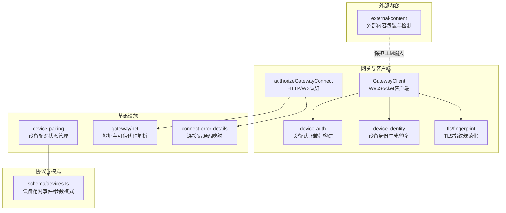
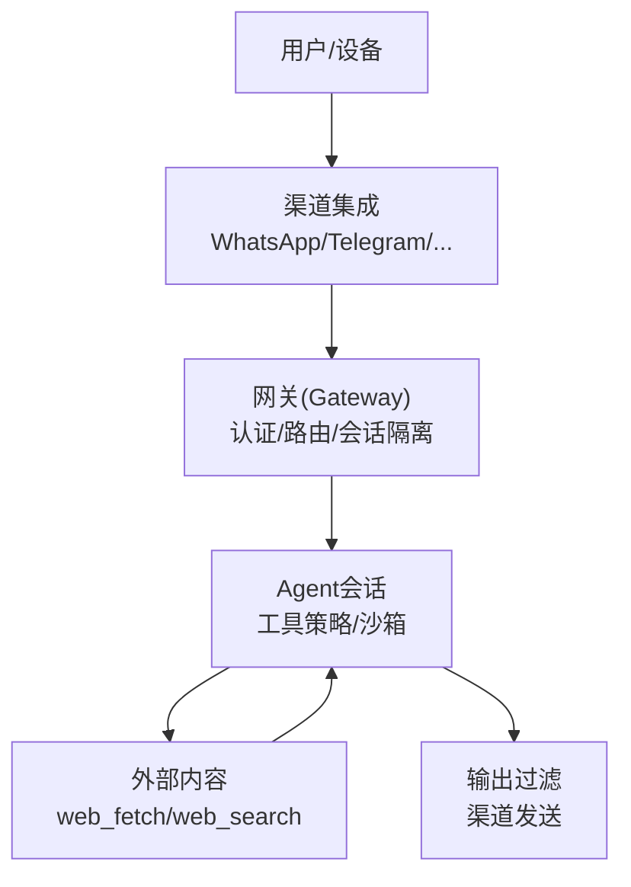
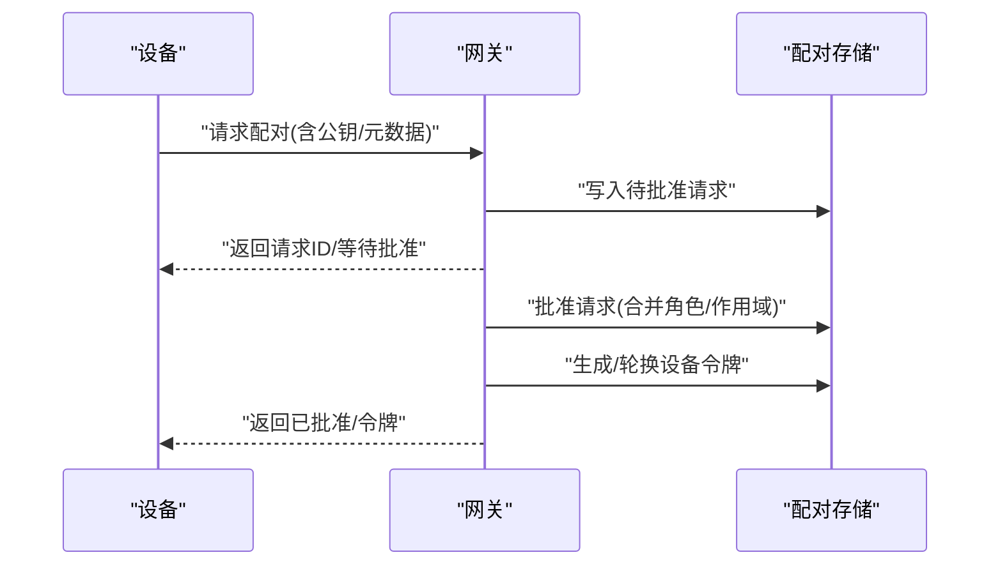
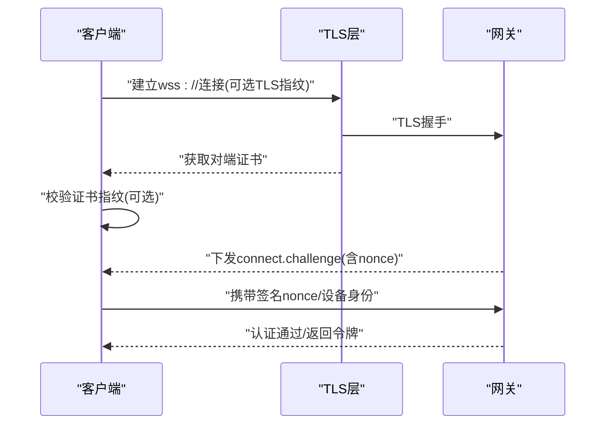
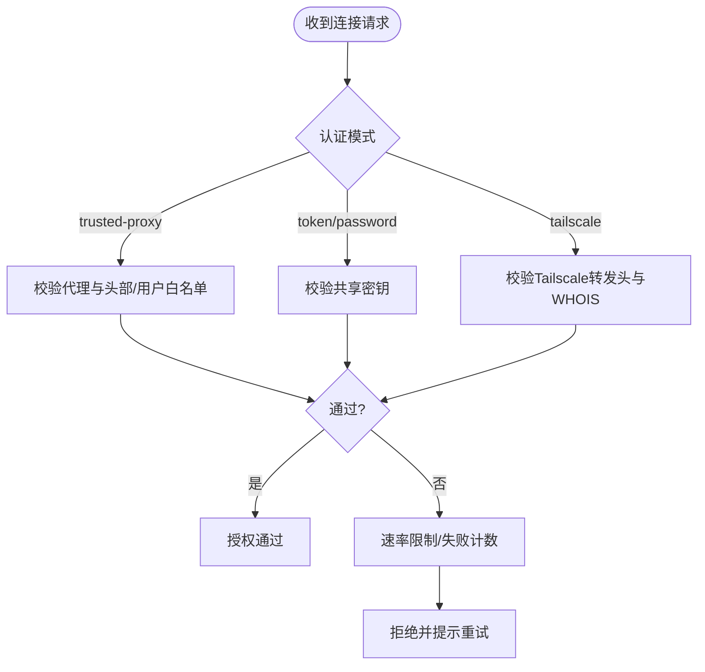
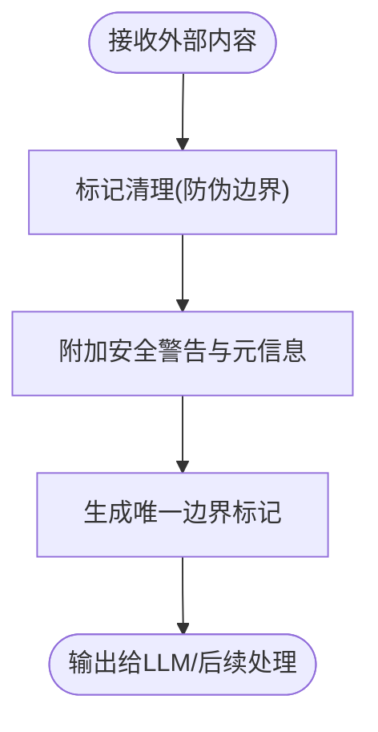
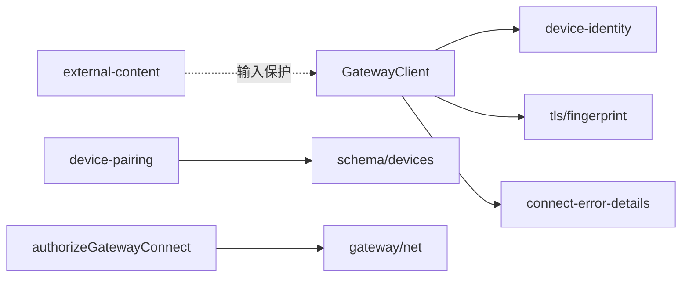

# 安全架构设计

<cite>
**本文引用的文件**
- [docs/security/README.md](file://docs/security/README.md)
- [docs/security/THREAT-MODEL-ATLAS.md](file://docs/security/THREAT-MODEL-ATLAS.md)
- [SECURITY.md](file://SECURITY.md)
- [src/gateway/protocol/schema/devices.ts](file://src/gateway/protocol/schema/devices.ts)
- [src/infra/device-pairing.ts](file://src/infra/device-pairing.ts)
- [src/gateway/client.ts](file://src/gateway/client.ts)
- [src/gateway/auth.ts](file://src/gateway/auth.ts)
- [src/gateway/device-auth.ts](file://src/gateway/device-auth.ts)
- [src/infra/device-identity.ts](file://src/infra/device-identity.ts)
- [src/gateway/protocol/connect-error-details.ts](file://src/gateway/protocol/connect-error-details.ts)
- [src/gateway/net.ts](file://src/gateway/net.ts)
- [src/infra/tls/fingerprint.ts](file://src/infra/tls/fingerprint.ts)
- [src/security/external-content.ts](file://src/security/external-content.ts)
- [docs/zh-CN/gateway/protocol.md](file://docs/zh-CN/gateway/protocol.md)
- [apps/shared/OpenClawKit/Sources/OpenClawKit/GatewayTLSPinning.swift](file://apps/shared/OpenClawKit/Sources/OpenClawKit/GatewayTLSPinning.swift)
</cite>

## 目录

1. [引言](#引言)
2. [项目结构](#项目结构)
3. [核心组件](#核心组件)
4. [架构总览](#架构总览)
5. [详细组件分析](#详细组件分析)
6. [依赖关系分析](#依赖关系分析)
7. [性能考量](#性能考量)
8. [故障排查指南](#故障排查指南)
9. [结论](#结论)
10. [附录](#附录)

## 引言

本文件面向OpenClaw安全架构，系统化阐述其多层次安全防护体系：身份认证、授权控制、加密通信与访问审计；并深入解析设备配对机制、本地信任模型与远程访问安全策略，覆盖WebSocket连接安全、TLS配置与证书管理。同时结合威胁模型分析、安全边界定义与风险缓解措施，提供可操作的安全配置指南与最佳实践。

## 项目结构

OpenClaw安全相关代码主要分布在以下模块：

- 网关与客户端：WebSocket连接、认证与授权、设备身份与配对、TLS固定与指纹校验
- 基础设施：设备身份生成与签名、配对状态持久化、TLS指纹规范化
- 协议与模式：设备配对事件与参数的类型约束
- 外部内容处理：外部输入包装与注入检测，降低提示注入风险
- 文档与策略：威胁模型、安全政策与部署指导

图示来源

- [src/gateway/client.ts:109-674](file://src/gateway/client.ts#L109-L674)
- [src/gateway/auth.ts:378-504](file://src/gateway/auth.ts#L378-L504)
- [src/gateway/device-auth.ts:1-55](file://src/gateway/device-auth.ts#L1-L55)
- [src/infra/device-identity.ts:1-183](file://src/infra/device-identity.ts#L1-L183)
- [src/infra/tls/fingerprint.ts:1-6](file://src/infra/tls/fingerprint.ts#L1-L6)
- [src/infra/device-pairing.ts:1-654](file://src/infra/device-pairing.ts#L1-L654)
- [src/gateway/net.ts:1-457](file://src/gateway/net.ts#L1-L457)
- [src/gateway/protocol/connect-error-details.ts:1-137](file://src/gateway/protocol/connect-error-details.ts#L1-L137)
- [src/gateway/protocol/schema/devices.ts:1-68](file://src/gateway/protocol/schema/devices.ts#L1-L68)
- [src/security/external-content.ts:1-346](file://src/security/external-content.ts#L1-L346)

章节来源

- [src/gateway/client.ts:1-674](file://src/gateway/client.ts#L1-L674)
- [src/gateway/auth.ts:1-504](file://src/gateway/auth.ts#L1-L504)
- [src/infra/device-pairing.ts:1-654](file://src/infra/device-pairing.ts#L1-L654)
- [src/gateway/net.ts:1-457](file://src/gateway/net.ts#L1-L457)
- [src/security/external-content.ts:1-346](file://src/security/external-content.ts#L1-L346)

## 核心组件

- 设备身份与配对
  - 设备身份：基于Ed25519公钥派生稳定设备ID，私钥用于签名，确保设备身份不可伪造且可追溯
  - 配对流程：请求、合并、批准、撤销与轮换令牌，支持角色与作用域的细粒度授权
  - 事件模式：设备配对请求与结果事件的TypeBox模式，保证跨组件一致性
- 认证与授权
  - 网关认证：支持token/password/trusted-proxy/tailscale多种模式，按需启用速率限制
  - 连接授权：区分HTTP与WS控制界面，允许在受信场景下无凭据登录
  - 错误码映射：统一连接失败原因，便于客户端重试与修复建议
- 加密通信与TLS固定
  - WebSocket强制TLS（wss），默认拒绝非本地明文ws
  - 支持TLS指纹固定，客户端在握手阶段校验证书指纹，抵御中间人攻击
  - 移动端Swift实现提供证书固定回调，确保平台一致性
- 外部内容安全
  - 包装边界与安全警告：为邮件、Webhook、Web搜索/抓取等外部输入添加唯一边界标记与安全提示
  - 注入检测：识别常见提示注入模式，记录日志并继续安全处理
- 本地信任模型与远程访问
  - 本地优先：推荐绑定loopback，通过SSH隧道或Tailscale Serve/Funnel进行远程访问
  - 受信代理：支持通过可信代理传递用户身份，配合白名单与头部校验
  - 速率限制：共享密钥场景下的失败尝试计数，防止暴力破解

章节来源

- [src/infra/device-identity.ts:1-183](file://src/infra/device-identity.ts#L1-L183)
- [src/infra/device-pairing.ts:1-654](file://src/infra/device-pairing.ts#L1-L654)
- [src/gateway/protocol/schema/devices.ts:1-68](file://src/gateway/protocol/schema/devices.ts#L1-L68)
- [src/gateway/auth.ts:1-504](file://src/gateway/auth.ts#L1-L504)
- [src/gateway/protocol/connect-error-details.ts:1-137](file://src/gateway/protocol/connect-error-details.ts#L1-L137)
- [src/gateway/client.ts:1-674](file://src/gateway/client.ts#L1-L674)
- [src/infra/tls/fingerprint.ts:1-6](file://src/infra/tls/fingerprint.ts#L1-L6)
- [apps/shared/OpenClawKit/Sources/OpenClawKit/GatewayTLSPinning.swift:66-87](file://apps/shared/OpenClawKit/Sources/OpenClawKit/GatewayTLSPinning.swift#L66-L87)
- [src/security/external-content.ts:1-346](file://src/security/external-content.ts#L1-L346)
- [docs/zh-CN/gateway/protocol.md:199-221](file://docs/zh-CN/gateway/protocol.md#L199-L221)

## 架构总览

OpenClaw安全架构以“个人助理”信任模型为核心：网关作为控制面，节点作为执行扩展，二者处于同一操作者信任边界内。数据流自通道进入网关，经会话隔离与工具策略后进入执行层，外部内容在进入LLM前被严格包装与检测。

图示来源

- [docs/security/THREAT-MODEL-ATLAS.md:56-123](file://docs/security/THREAT-MODEL-ATLAS.md#L56-L123)
- [src/security/external-content.ts:239-303](file://src/security/external-content.ts#L239-L303)

章节来源

- [docs/security/THREAT-MODEL-ATLAS.md:56-123](file://docs/security/THREAT-MODEL-ATLAS.md#L56-L123)

## 详细组件分析

### 设备配对与本地信任模型

- 设备身份
  - 使用Ed25519密钥对，公钥导出SPKI DER并计算SHA-256作为设备ID，确保全局唯一且可验证
  - 私钥用于对连接挑战nonce进行签名，配合设备ID与元数据构建认证载荷
- 配对生命周期
  - 请求：合并重复请求、保留静默/修复标志、记录远端IP
  - 批准：合并角色与作用域，生成/轮换令牌，记录批准时间
  - 撤销/移除：按角色撤销令牌，或移除设备
  - 元数据更新：动态更新显示名、平台、设备族等
- 本地信任与自动批准
  - 同主机tailnet地址或回环地址连接默认视为本地，可自动批准
  - 控制界面在特定配置下可省略设备身份要求，但不建议生产使用

图示来源

- [src/infra/device-pairing.ts:272-318](file://src/infra/device-pairing.ts#L272-L318)
- [src/infra/device-pairing.ts:320-384](file://src/infra/device-pairing.ts#L320-L384)
- [src/gateway/protocol/schema/devices.ts:38-67](file://src/gateway/protocol/schema/devices.ts#L38-L67)

章节来源

- [src/infra/device-identity.ts:1-183](file://src/infra/device-identity.ts#L1-L183)
- [src/gateway/device-auth.ts:1-55](file://src/gateway/device-auth.ts#L1-L55)
- [src/infra/device-pairing.ts:1-654](file://src/infra/device-pairing.ts#L1-L654)
- [src/gateway/protocol/schema/devices.ts:1-68](file://src/gateway/protocol/schema/devices.ts#L1-L68)
- [docs/zh-CN/gateway/protocol.md:199-221](file://docs/zh-CN/gateway/protocol.md#L199-L221)

### WebSocket连接安全与TLS固定

- 明文传输限制
  - 默认拒绝非本地明文ws://，避免凭证与对话内容被窃听
  - 仅在受控私有网络环境可通过环境变量开启例外（断路器）
- TLS固定
  - 客户端在建立wss://连接时，可配置服务端证书指纹
  - 握手阶段通过自定义checkServerIdentity校验指纹一致性
  - 移动端Swift实现提供证书固定回调，确保一致的终端安全策略
- 连接挑战与重试
  - 服务端下发随机nonce，客户端必须用设备私钥签名nonce并通过网关验证
  - 对于设备令牌不匹配等错误，客户端根据错误码与恢复建议决定是否重试

图示来源

- [src/gateway/client.ts:134-251](file://src/gateway/client.ts#L134-L251)
- [src/gateway/client.ts:267-415](file://src/gateway/client.ts#L267-L415)
- [src/infra/tls/fingerprint.ts:1-6](file://src/infra/tls/fingerprint.ts#L1-L6)
- [apps/shared/OpenClawKit/Sources/OpenClawKit/GatewayTLSPinning.swift:77-87](file://apps/shared/OpenClawKit/Sources/OpenClawKit/GatewayTLSPinning.swift#L77-L87)

章节来源

- [src/gateway/client.ts:1-674](file://src/gateway/client.ts#L1-L674)
- [src/infra/tls/fingerprint.ts:1-6](file://src/infra/tls/fingerprint.ts#L1-L6)
- [apps/shared/OpenClawKit/Sources/OpenClawKit/GatewayTLSPinning.swift:66-87](file://apps/shared/OpenClawKit/Sources/OpenClawKit/GatewayTLSPinning.swift#L66-L87)

### 认证与授权控制

- 多模式认证
  - token/password：静态共享密钥，适用于简单部署
  - trusted-proxy：通过可信代理传递用户身份，需校验必要头部与用户白名单
  - tailscale：在非本地场景下，通过Tailscale转发头与WHOIS校验用户身份
- 授权边界
  - 会话标识符仅为路由控制，不构成多租户授权边界
  - 工具调用与命令执行需遵循工具策略与执行审批
- 速率限制
  - 共享密钥场景对失败尝试计数，超限阻断并提示重试时间

图示来源

- [src/gateway/auth.ts:378-504](file://src/gateway/auth.ts#L378-L504)
- [src/gateway/net.ts:108-185](file://src/gateway/net.ts#L108-L185)

章节来源

- [src/gateway/auth.ts:1-504](file://src/gateway/auth.ts#L1-L504)
- [src/gateway/net.ts:1-457](file://src/gateway/net.ts#L1-L457)

### 外部内容安全与提示注入缓解

- 包装策略
  - 为邮件、Webhook、Web搜索/抓取等外部输入添加唯一边界标记与安全警告
  - 记录来源、发件人、主题等元信息，便于审计与溯源
- 注入检测
  - 识别常见提示注入模式并记录，内容仍被安全包装处理
- 会话来源识别
  - 识别来自钩子(Hook)的会话来源，采用更严格的包装策略

图示来源

- [src/security/external-content.ts:239-265](file://src/security/external-content.ts#L239-L265)
- [src/security/external-content.ts:338-345](file://src/security/external-content.ts#L338-L345)

章节来源

- [src/security/external-content.ts:1-346](file://src/security/external-content.ts#L1-L346)

### 远程访问安全策略与部署建议

- 本地优先
  - 默认绑定loopback，控制界面仅在明确配置下允许无设备身份登录
- 远程访问
  - 推荐通过SSH隧道或Tailscale Serve/Funnel，使网关仍绑定loopback
  - 非本地与高风险配置会被安全审计工具标记
- 临时目录与媒体
  - 严格限制媒体下载与临时文件路径，避免任意主机路径成为信任根

章节来源

- [SECURITY.md:207-245](file://SECURITY.md#L207-L245)

## 依赖关系分析

- 组件耦合
  - GatewayClient依赖设备身份与TLS指纹模块完成安全握手
  - 设备配对状态与协议模式共同保障配对事件的一致性
  - 外部内容模块独立于核心流程，仅在输入侧提供安全包装
- 外部依赖
  - ws库用于WebSocket连接与TLS固定
  - Node.js crypto用于密钥生成、签名与哈希
  - 平台SDK（如Swift）提供证书固定回调

图示来源

- [src/gateway/client.ts:1-674](file://src/gateway/client.ts#L1-L674)
- [src/infra/device-identity.ts:1-183](file://src/infra/device-identity.ts#L1-L183)
- [src/infra/tls/fingerprint.ts:1-6](file://src/infra/tls/fingerprint.ts#L1-L6)
- [src/gateway/protocol/connect-error-details.ts:1-137](file://src/gateway/protocol/connect-error-details.ts#L1-L137)
- [src/infra/device-pairing.ts:1-654](file://src/infra/device-pairing.ts#L1-L654)
- [src/gateway/protocol/schema/devices.ts:1-68](file://src/gateway/protocol/schema/devices.ts#L1-L68)
- [src/gateway/auth.ts:1-504](file://src/gateway/auth.ts#L1-L504)
- [src/gateway/net.ts:1-457](file://src/gateway/net.ts#L1-L457)
- [src/security/external-content.ts:1-346](file://src/security/external-content.ts#L1-L346)

章节来源

- [src/gateway/client.ts:1-674](file://src/gateway/client.ts#L1-L674)
- [src/infra/device-pairing.ts:1-654](file://src/infra/device-pairing.ts#L1-L654)
- [src/gateway/auth.ts:1-504](file://src/gateway/auth.ts#L1-L504)
- [src/security/external-content.ts:1-346](file://src/security/external-content.ts#L1-L346)

## 性能考量

- 连接握手与重试
  - 客户端指数退避重连，避免风暴式重试
  - 连接挑战超时与心跳监控，及时发现静默断开
- 认证与速率限制
  - 速率限制仅针对失败尝试，正常请求不受影响
  - 令牌校验与作用域检查为常量时间操作，开销可控
- 外部内容处理
  - 边界标记替换与注入检测为线性扫描，对大文本有优化空间（可分块处理）

## 故障排查指南

- 连接失败与恢复
  - 依据错误码判断：令牌缺失/不匹配、密码缺失/不匹配、速率限制、设备令牌不匹配等
  - 根据恢复建议选择重试策略或调整配置
- 设备令牌问题
  - 当设备令牌与共享令牌冲突时，客户端可能自动切换到存储的设备令牌
  - 若目标端点不受信任，设备令牌重试可能被暂停
- TLS指纹问题
  - 确认wss://与指纹配置一致，检查证书链与指纹规范化
- 外部内容异常
  - 检查边界标记是否被恶意内容混淆，确认包装与警告是否正确插入

章节来源

- [src/gateway/protocol/connect-error-details.ts:1-137](file://src/gateway/protocol/connect-error-details.ts#L1-L137)
- [src/gateway/client.ts:417-495](file://src/gateway/client.ts#L417-L495)
- [src/infra/tls/fingerprint.ts:1-6](file://src/infra/tls/fingerprint.ts#L1-L6)
- [src/security/external-content.ts:161-210](file://src/security/external-content.ts#L161-L210)

## 结论

OpenClaw通过设备身份与配对、多模式认证与授权、TLS固定与证书管理、以及外部内容包装与注入检测，构建了面向个人助理场景的纵深防御体系。结合威胁模型与安全边界定义，建议在生产环境中坚持“本地优先+受控隧道”的远程访问策略，并持续完善令牌轮换、速率限制与供应链安全控制。

## 附录

### 威胁模型与风险矩阵

- 关键威胁
  - 提示注入（直接/间接）、工具参数注入、执行审批绕过
  - 令牌窃取、配对代码拦截、通道身份伪造
  - 技能供应链污染、资源耗尽DoS、声誉损害
- 风险等级与优先级
  - 高危：技能供应链、提示注入、执行审批绕过
  - 中危：令牌存储、配对宽限期、外部内容逃逸
- 攻击链
  - 技能数据窃取：发布恶意技能→规避审核→窃取凭证
  - 提示注入到RCE：注入提示→绕过审批→执行命令
  - 间接注入：毒化URL内容→代理抓取→注入指令

章节来源

- [docs/security/THREAT-MODEL-ATLAS.md:485-527](file://docs/security/THREAT-MODEL-ATLAS.md#L485-L527)

### 安全配置指南与最佳实践

- 认证与授权
  - 优先使用token模式并定期轮换；在需要时启用trusted-proxy/tailscale
  - 为HTTP与WS控制界面设置速率限制，防止暴力破解
- 设备配对
  - 启用设备令牌轮换与撤销机制；严格控制角色与作用域
  - 对重复请求进行合并，缩短配对宽限期
- 通信安全
  - 默认使用wss://并配置TLS指纹固定；仅在受控私有网络允许ws://
  - 通过SSH隧道或Tailscale Serve/Funnel进行远程访问
- 外部内容
  - 对所有外部输入进行包装与安全警告；启用注入检测日志
  - 对web_fetch实施URL白名单与数据分类意识
- 运行时与部署
  - 使用loopback绑定，避免直接暴露到公网
  - 临时目录与媒体路径严格限制，避免任意主机路径信任

章节来源

- [SECURITY.md:207-288](file://SECURITY.md#L207-L288)
- [docs/zh-CN/gateway/protocol.md:199-221](file://docs/zh-CN/gateway/protocol.md#L199-L221)
