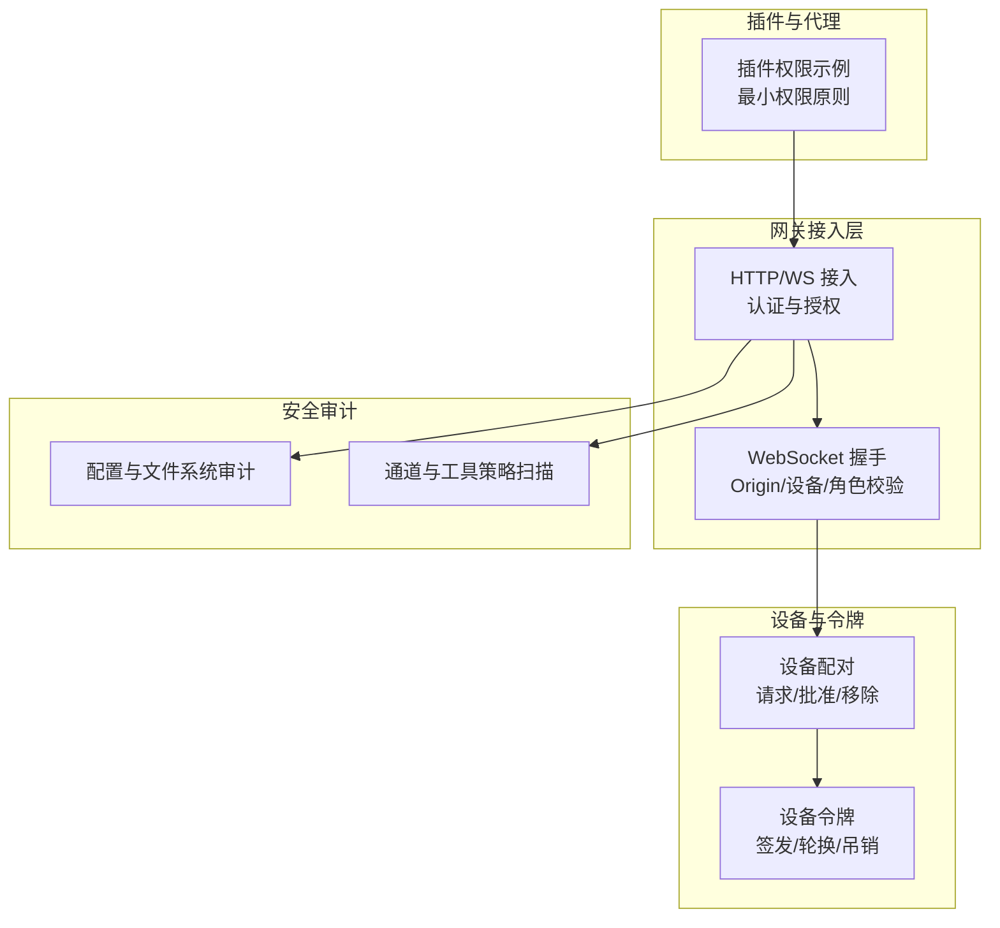
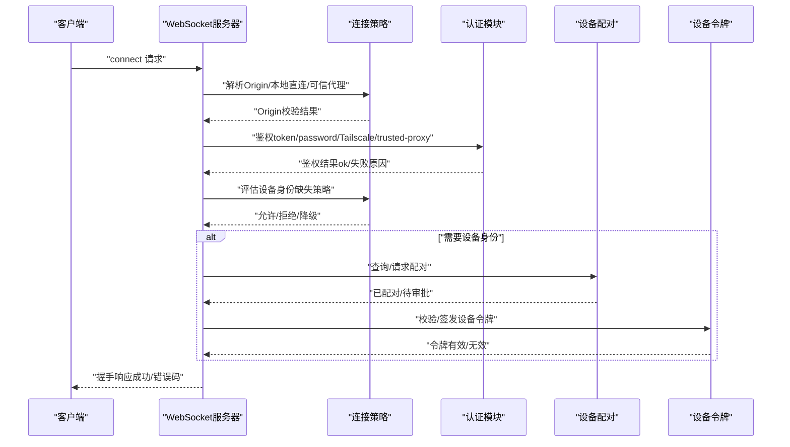
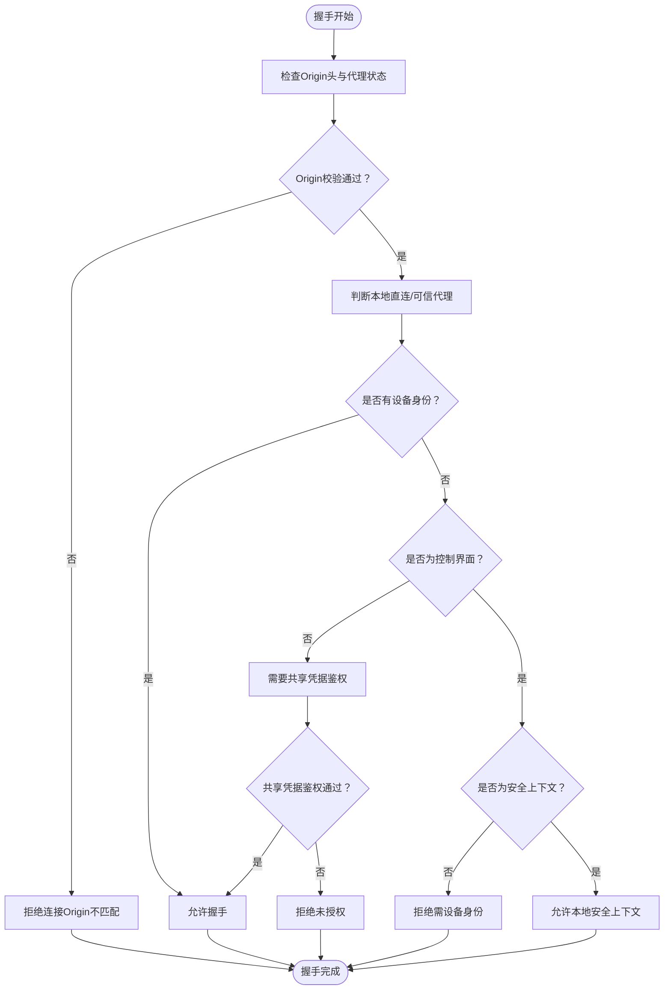
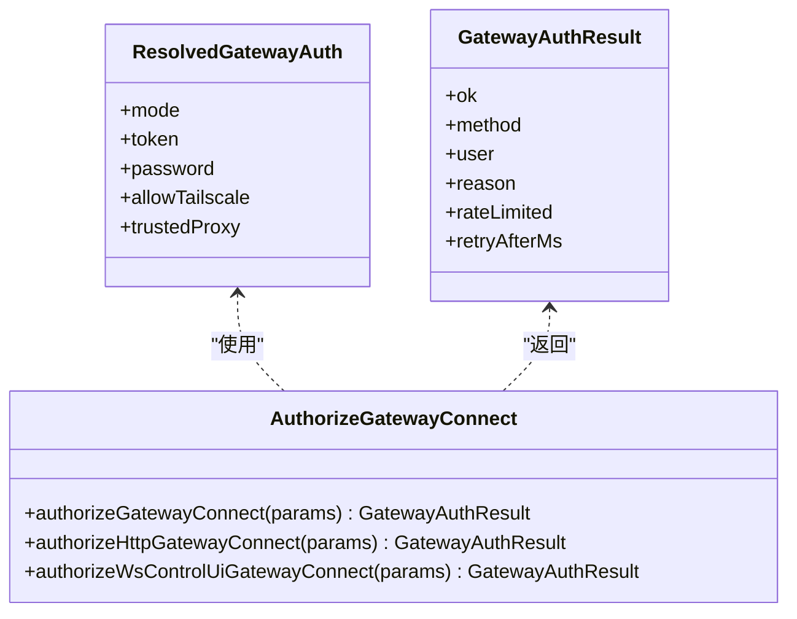
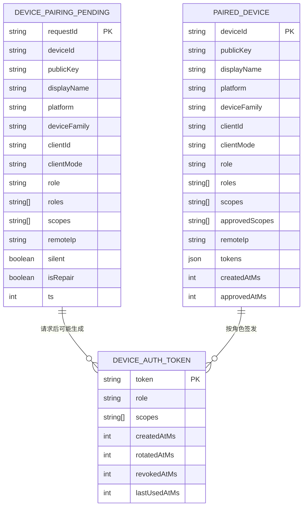
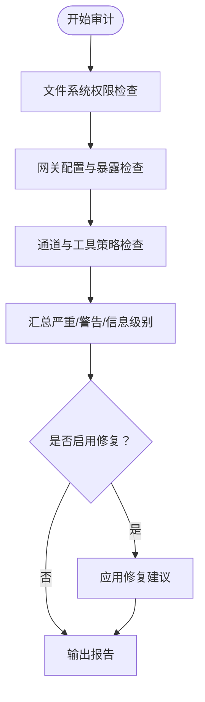
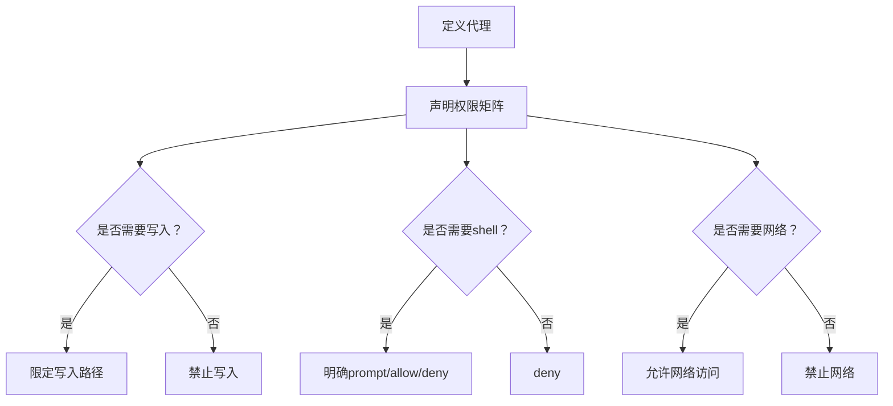
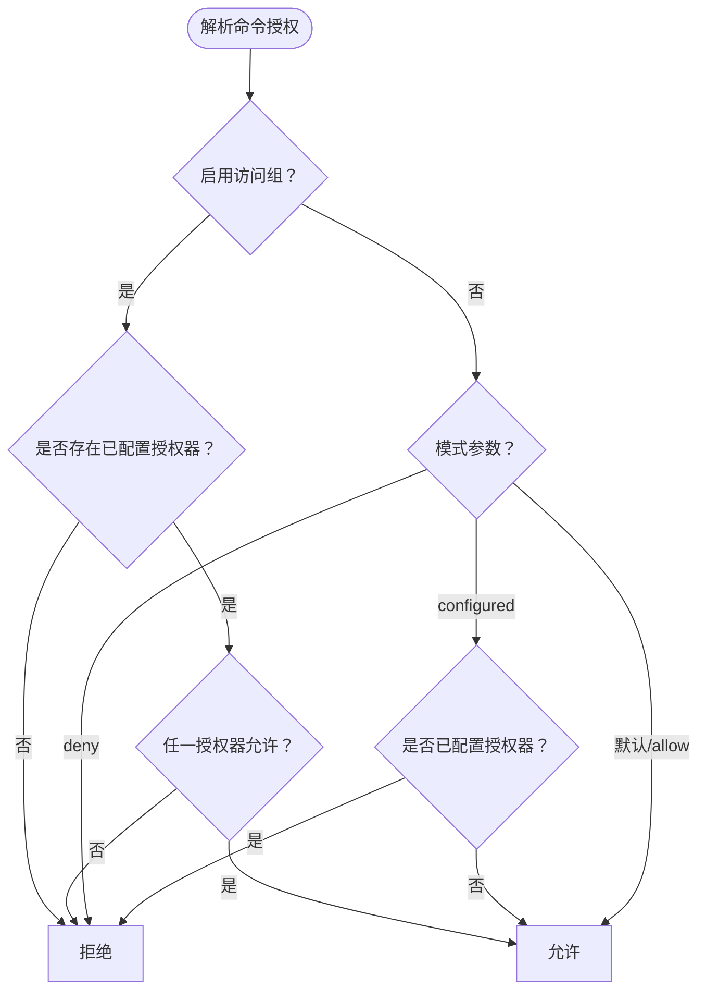
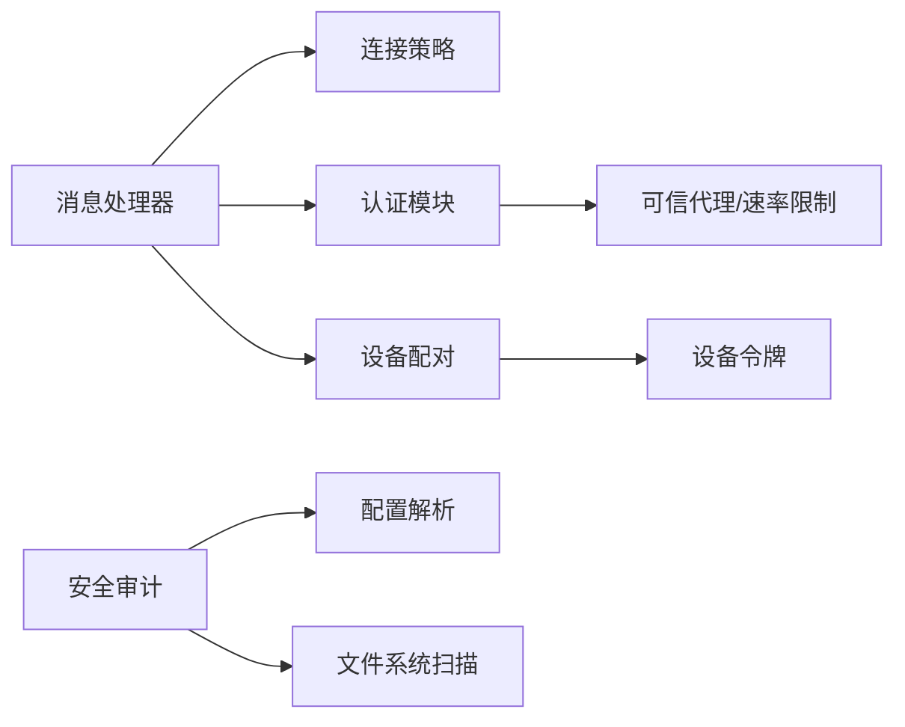

# 安全模型与访问控制

<cite>
**本文档引用的文件**
- [src/gateway/auth.ts](file://src/gateway/auth.ts)
- [src/gateway/server/ws-connection/connect-policy.ts](file://src/gateway/server/ws-connection/connect-policy.ts)
- [src/gateway/server/ws-connection/message-handler.ts](file://src/gateway/server/ws-connection/message-handler.ts)
- [src/gateway/server/ws-connection/connect-policy.test.ts](file://src/gateway/server/ws-connection/connect-policy.test.ts)
- [src/gateway/server-methods/devices.ts](file://src/gateway/server-methods/devices.ts)
- [src/gateway/protocol/schema/devices.ts](file://src/gateway/protocol/schema/devices.ts)
- [src/infra/device-pairing.ts](file://src/infra/device-pairing.ts)
- [src/security/audit.ts](file://src/security/audit.ts)
- [src/security/audit-extra.async.ts](file://src/security/audit-extra.async.ts)
- [src/channels/command-gating.test.ts](file://src/channels/command-gating.test.ts)
- [extensions/open-prose/skills/prose/examples/12-secure-agent-permissions.prose](file://extensions/open-prose/skills/prose/examples/12-secure-agent-permissions.prose)
- [docs/zh-CN/gateway/security/index.md](file://docs/zh-CN/gateway/security/index.md)
</cite>

## 目录

1. [简介](#简介)
2. [项目结构](#项目结构)
3. [核心组件](#核心组件)
4. [架构总览](#架构总览)
5. [详细组件分析](#详细组件分析)
6. [依赖关系分析](#依赖关系分析)
7. [性能考量](#性能考量)
8. [故障排查指南](#故障排查指南)
9. [结论](#结论)
10. [附录](#附录)

## 简介

本文件面向OpenClaw的安全模型与访问控制机制，系统化梳理多层安全架构设计，覆盖身份认证、授权控制、访问审计与数据保护；并深入解释WebSocket连接安全、API访问控制、插件权限管理与设备配对机制。文档同时提供安全策略配置方式、权限继承规则与安全事件处理流程，并以架构图、权限矩阵与威胁模型帮助读者快速理解与落地。

## 项目结构

OpenClaw的安全能力主要分布在以下模块：

- 网关认证与授权：负责HTTP与WebSocket接入的身份鉴别、速率限制与可信代理信任链
- WebSocket握手与连接策略：负责Origin校验、设备身份绑定、角色与作用域授权
- 设备配对与令牌管理：负责设备公钥签名验证、令牌签发与轮换、作用域继承
- 安全审计：负责配置与文件系统安全扫描、通道与工具策略评估
- 插件与代理权限示例：通过示例技能展示最小权限原则与权限矩阵

**图表来源**

- [src/gateway/auth.ts:1-504](file://src/gateway/auth.ts#L1-L504)
- [src/gateway/server/ws-connection/message-handler.ts:1-800](file://src/gateway/server/ws-connection/message-handler.ts#L1-L800)
- [src/infra/device-pairing.ts:1-654](file://src/infra/device-pairing.ts#L1-L654)
- [src/security/audit.ts:1-800](file://src/security/audit.ts#L1-L800)
- [extensions/open-prose/skills/prose/examples/12-secure-agent-permissions.prose:1-43](file://extensions/open-prose/skills/prose/examples/12-secure-agent-permissions.prose#L1-L43)

**章节来源**

- [src/gateway/auth.ts:1-504](file://src/gateway/auth.ts#L1-L504)
- [src/gateway/server/ws-connection/message-handler.ts:1-800](file://src/gateway/server/ws-connection/message-handler.ts#L1-L800)
- [src/infra/device-pairing.ts:1-654](file://src/infra/device-pairing.ts#L1-L654)
- [src/security/audit.ts:1-800](file://src/security/audit.ts#L1-L800)
- [extensions/open-prose/skills/prose/examples/12-secure-agent-permissions.prose:1-43](file://extensions/open-prose/skills/prose/examples/12-secure-agent-permissions.prose#L1-L43)

## 核心组件

- 网关认证与授权
  - 支持token/password/trusted-proxy模式，内置速率限制与Tailscale身份识别
  - 提供HTTP与WS两种接入面的认证决策
- WebSocket连接策略
  - 基于Origin白名单、Host头回退开关、可信代理与本地直连检测
  - 设备身份缺失时的严格判定与降级策略
- 设备配对与令牌
  - 基于公钥签名的设备身份验证、令牌签发与轮换、作用域继承与拒绝
- 安全审计
  - 配置与文件系统权限扫描、通道与工具策略评估、深检探测
- 插件与代理权限
  - 示例展示最小权限原则与权限矩阵

**章节来源**

- [src/gateway/auth.ts:1-504](file://src/gateway/auth.ts#L1-L504)
- [src/gateway/server/ws-connection/connect-policy.ts:1-103](file://src/gateway/server/ws-connection/connect-policy.ts#L1-L103)
- [src/gateway/server/ws-connection/message-handler.ts:1-800](file://src/gateway/server/ws-connection/message-handler.ts#L1-L800)
- [src/infra/device-pairing.ts:1-654](file://src/infra/device-pairing.ts#L1-L654)
- [src/security/audit.ts:1-800](file://src/security/audit.ts#L1-L800)
- [extensions/open-prose/skills/prose/examples/12-secure-agent-permissions.prose:1-43](file://extensions/open-prose/skills/prose/examples/12-secure-agent-permissions.prose#L1-L43)

## 架构总览

下图展示了OpenClaw安全架构的关键交互：客户端发起WebSocket连接，服务端进行Origin校验、设备身份与共享凭据双重鉴权，随后根据策略决定是否进入配对流程与作用域绑定。

**图表来源**

- [src/gateway/server/ws-connection/message-handler.ts:480-780](file://src/gateway/server/ws-connection/message-handler.ts#L480-L780)
- [src/gateway/server/ws-connection/connect-policy.ts:68-103](file://src/gateway/server/ws-connection/connect-policy.ts#L68-L103)
- [src/gateway/auth.ts:378-504](file://src/gateway/auth.ts#L378-L504)
- [src/infra/device-pairing.ts:470-508](file://src/infra/device-pairing.ts#L470-L508)

**章节来源**

- [src/gateway/server/ws-connection/message-handler.ts:1-800](file://src/gateway/server/ws-connection/message-handler.ts#L1-L800)
- [src/gateway/server/ws-connection/connect-policy.ts:1-103](file://src/gateway/server/ws-connection/connect-policy.ts#L1-L103)
- [src/gateway/auth.ts:1-504](file://src/gateway/auth.ts#L1-L504)
- [src/infra/device-pairing.ts:1-654](file://src/infra/device-pairing.ts#L1-L654)

## 详细组件分析

### 组件A：WebSocket连接安全与Origin校验

- Origin校验策略
  - 仅在存在浏览器Origin头且未受代理转发时强制校验
  - 支持Host头回退开关，但会记录安全指标
- 本地直连与可信代理
  - 严格区分本地直连与代理转发，防止绕过
  - 可信代理列表用于恢复本地客户端检测
- 设备身份缺失判定
  - 控制界面在非HTTPS或localhost安全上下文下要求设备身份
  - 受信任代理的operator可豁免设备身份要求

**图表来源**

- [src/gateway/server/ws-connection/message-handler.ts:499-532](file://src/gateway/server/ws-connection/message-handler.ts#L499-L532)
- [src/gateway/server/ws-connection/connect-policy.ts:68-103](file://src/gateway/server/ws-connection/connect-policy.ts#L68-L103)
- [src/gateway/server/ws-connection/connect-policy.test.ts:40-172](file://src/gateway/server/ws-connection/connect-policy.test.ts#L40-L172)

**章节来源**

- [src/gateway/server/ws-connection/message-handler.ts:1-800](file://src/gateway/server/ws-connection/message-handler.ts#L1-L800)
- [src/gateway/server/ws-connection/connect-policy.ts:1-103](file://src/gateway/server/ws-connection/connect-policy.ts#L1-L103)
- [src/gateway/server/ws-connection/connect-policy.test.ts:1-242](file://src/gateway/server/ws-connection/connect-policy.test.ts#L1-L242)

### 组件B：网关认证与授权（HTTP/WS）

- 认证模式
  - token/password/trusted-proxy，默认token
  - 支持Tailscale用户身份透传与校验
- 速率限制
  - 共享密钥类凭据统一限流，失败计入并返回重试时间
- 接入面差异
  - WS控制界面允许Tailscale头部鉴权，HTTP禁用

**图表来源**

- [src/gateway/auth.ts:31-77](file://src/gateway/auth.ts#L31-L77)
- [src/gateway/auth.ts:378-504](file://src/gateway/auth.ts#L378-L504)

**章节来源**

- [src/gateway/auth.ts:1-504](file://src/gateway/auth.ts#L1-L504)

### 组件C：设备配对与令牌管理

- 配对生命周期
  - 请求（待审批）、批准（生成令牌）、拒绝、移除
  - 支持修复模式（repair）与静默请求
- 令牌策略
  - 按角色签发令牌，支持轮换与吊销
  - 作用域继承与拒绝：管理员作用域隐含读写等子作用域
- 签名与元数据
  - 设备公钥签名验证，时间戳与随机数校验
  - 平台/设备族固定与不匹配检测

**图表来源**

- [src/infra/device-pairing.ts:14-77](file://src/infra/device-pairing.ts#L14-L77)
- [src/infra/device-pairing.ts:51-67](file://src/infra/device-pairing.ts#L51-L67)
- [src/infra/device-pairing.ts:32-49](file://src/infra/device-pairing.ts#L32-L49)

**章节来源**

- [src/infra/device-pairing.ts:1-654](file://src/infra/device-pairing.ts#L1-L654)
- [src/gateway/server-methods/devices.ts:34-79](file://src/gateway/server-methods/devices.ts#L34-L79)
- [src/gateway/protocol/schema/devices.ts:1-68](file://src/gateway/protocol/schema/devices.ts#L1-L68)

### 组件D：安全审计与配置加固

- 配置与网络暴露
  - 网关绑定非本地且无认证时发出严重告警
  - 控制界面Origin白名单为空或包含通配符时发出严重告警
  - Host头回退开关启用时发出严重告警
- 文件系统权限
  - 状态目录与配置文件的可读/可写权限检查
  - 凭证与认证文件的敏感度提示与修复建议
- 通道与工具策略
  - 重新启用危险HTTP工具时发出严重告警
  - 多用户场景与沙箱策略评估

**图表来源**

- [src/security/audit.ts:208-337](file://src/security/audit.ts#L208-L337)
- [src/security/audit.ts:339-687](file://src/security/audit.ts#L339-L687)
- [src/security/audit-extra.async.ts:983-1067](file://src/security/audit-extra.async.ts#L983-L1067)
- [docs/zh-CN/gateway/security/index.md:17-36](file://docs/zh-CN/gateway/security/index.md#L17-L36)

**章节来源**

- [src/security/audit.ts:1-800](file://src/security/audit.ts#L1-L800)
- [src/security/audit-extra.async.ts:1-1254](file://src/security/audit-extra.async.ts#L1-L1254)
- [docs/zh-CN/gateway/security/index.md:1-45](file://docs/zh-CN/gateway/security/index.md#L1-L45)

### 组件E：插件权限管理与最小权限原则

- 权限矩阵示例
  - 代码审查代理：只读源码与文档，禁止shell
  - 文档写入代理：限定docs目录写入，禁止shell
  - 管理员代理：全量读写与网络访问
- 最小权限原则
  - 明确声明read/write/bash/network等权限范围
  - 通过权限矩阵约束代理行为，降低越权风险

**图表来源**

- [extensions/open-prose/skills/prose/examples/12-secure-agent-permissions.prose:7-36](file://extensions/open-prose/skills/prose/examples/12-secure-agent-permissions.prose#L7-L36)

**章节来源**

- [extensions/open-prose/skills/prose/examples/12-secure-agent-permissions.prose:1-43](file://extensions/open-prose/skills/prose/examples/12-secure-agent-permissions.prose#L1-L43)

### 组件F：命令访问控制与访问组

- 访问组策略
  - 启用访问组时，未配置授权器则拒绝
  - 关闭访问组时默认允许，可通过模式参数控制
- 控制命令拦截
  - 当存在控制命令且未授权时阻断

**图表来源**

- [src/channels/command-gating.test.ts:7-74](file://src/channels/command-gating.test.ts#L7-L74)

**章节来源**

- [src/channels/command-gating.test.ts:1-97](file://src/channels/command-gating.test.ts#L1-L97)

## 依赖关系分析

- 组件耦合
  - WebSocket消息处理器依赖连接策略与认证模块
  - 设备配对模块依赖令牌生成与文件持久化
  - 安全审计模块依赖配置解析与文件系统扫描
- 外部依赖
  - 反向代理可信列表影响本地直连判定
  - Tailscale身份透传用于WS控制界面鉴权

**图表来源**

- [src/gateway/server/ws-connection/message-handler.ts:1-800](file://src/gateway/server/ws-connection/message-handler.ts#L1-L800)
- [src/gateway/server/ws-connection/connect-policy.ts:1-103](file://src/gateway/server/ws-connection/connect-policy.ts#L1-L103)
- [src/gateway/auth.ts:1-504](file://src/gateway/auth.ts#L1-L504)
- [src/infra/device-pairing.ts:1-654](file://src/infra/device-pairing.ts#L1-L654)
- [src/security/audit.ts:1-800](file://src/security/audit.ts#L1-L800)

**章节来源**

- [src/gateway/server/ws-connection/message-handler.ts:1-800](file://src/gateway/server/ws-connection/message-handler.ts#L1-L800)
- [src/gateway/server/ws-connection/connect-policy.ts:1-103](file://src/gateway/server/ws-connection/connect-policy.ts#L1-L103)
- [src/gateway/auth.ts:1-504](file://src/gateway/auth.ts#L1-L504)
- [src/infra/device-pairing.ts:1-654](file://src/infra/device-pairing.ts#L1-L654)
- [src/security/audit.ts:1-800](file://src/security/audit.ts#L1-L800)

## 性能考量

- 速率限制
  - 对共享密钥类凭据统一限流，避免暴力破解
- 握手阶段开销
  - Origin校验、设备签名验证与令牌校验均在握手阶段完成，建议优化签名算法与令牌存储
- 审计扫描
  - 深度审计涉及网络探测与文件系统遍历，建议在维护窗口执行

[本节为通用指导，无需特定文件来源]

## 故障排查指南

- WebSocket连接被拒绝
  - 检查Origin白名单与Host头回退开关
  - 确认设备身份是否必需（控制界面在非安全上下文下需要设备身份）
  - 核对共享凭据鉴权是否通过
- 设备配对失败
  - 确认设备公钥签名与时间戳、随机数校验
  - 检查配对请求是否在超时内被批准
- 审计报告异常
  - 关注文件系统权限与配置暴露问题
  - 按照修复建议调整权限与配置

**章节来源**

- [src/gateway/server/ws-connection/message-handler.ts:564-627](file://src/gateway/server/ws-connection/message-handler.ts#L564-L627)
- [src/gateway/server/ws-connection/connect-policy.ts:68-103](file://src/gateway/server/ws-connection/connect-policy.ts#L68-L103)
- [src/infra/device-pairing.ts:470-508](file://src/infra/device-pairing.ts#L470-L508)
- [src/security/audit.ts:1-800](file://src/security/audit.ts#L1-L800)

## 结论

OpenClaw通过“多层安全架构”实现从接入层到设备层的纵深防御：HTTP/WS接入采用严格的Origin校验与多种认证模式，WebSocket握手结合设备身份与角色作用域进行细粒度授权，设备配对与令牌管理确保最小权限与可追溯性，安全审计提供持续的风险发现与修复闭环。配合插件权限示例与访问组策略，整体安全模型既满足生产可用性，又具备良好的可运维性与可扩展性。

[本节为总结，无需特定文件来源]

## 附录

- 安全策略配置要点
  - 网关绑定优先使用本地回环，必要时启用严格Origin白名单
  - 控制界面启用HTTPS或本地安全上下文，谨慎开启Host头回退
  - 启用速率限制，合理设置共享密钥凭据的限流参数
  - 定期运行安全审计命令，及时修复高危与警告项
- 权限继承规则
  - 管理员作用域隐含读写等子作用域，写入作用域隐含读取
  - 令牌轮换与吊销遵循最小权限原则，避免长期有效令牌
- 威胁模型与缓解
  - 中间人攻击：通过HTTPS与设备身份签名缓解
  - 代理绕过：通过可信代理列表与本地直连检测缓解
  - 权限提升：通过设备令牌与作用域继承规则缓解
  - 暴力破解：通过速率限制与强令牌策略缓解

**章节来源**

- [docs/zh-CN/gateway/security/index.md:17-36](file://docs/zh-CN/gateway/security/index.md#L17-L36)
- [src/infra/device-pairing.ts:195-220](file://src/infra/device-pairing.ts#L195-L220)
- [src/gateway/auth.ts:614-684](file://src/gateway/auth.ts#L614-L684)
