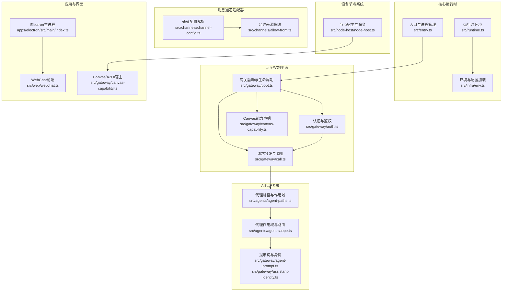
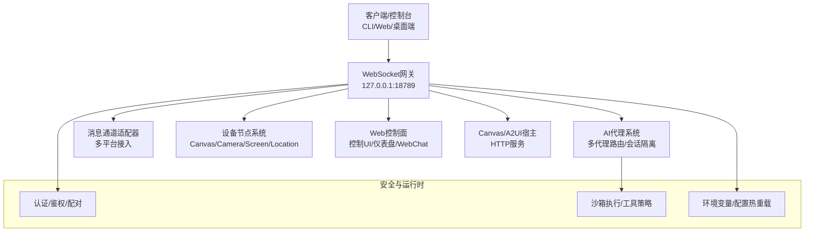
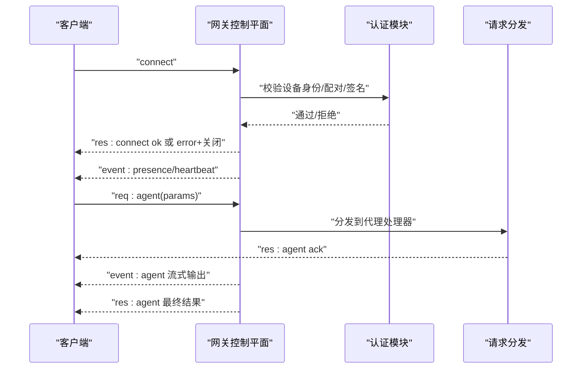
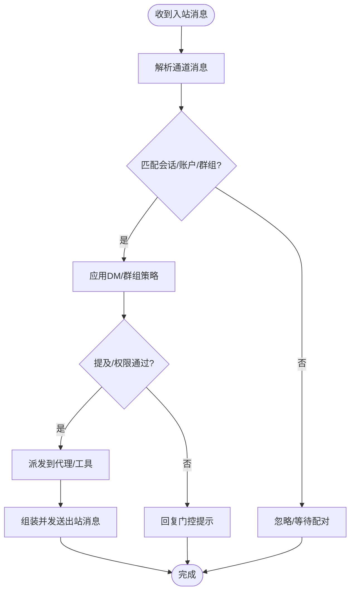
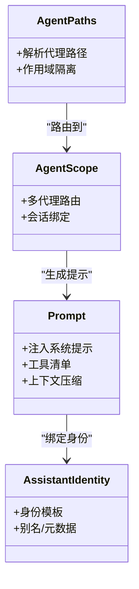
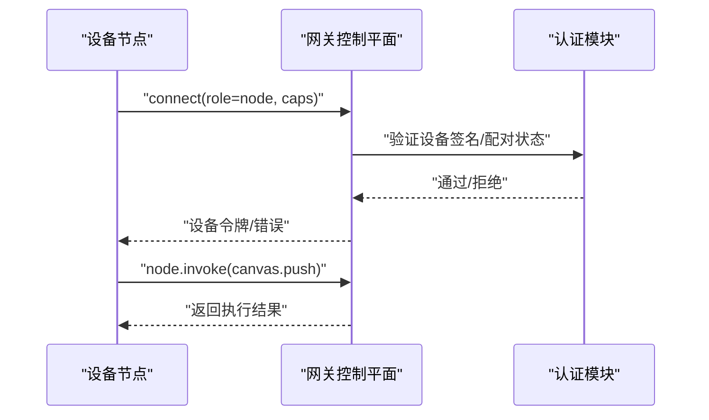
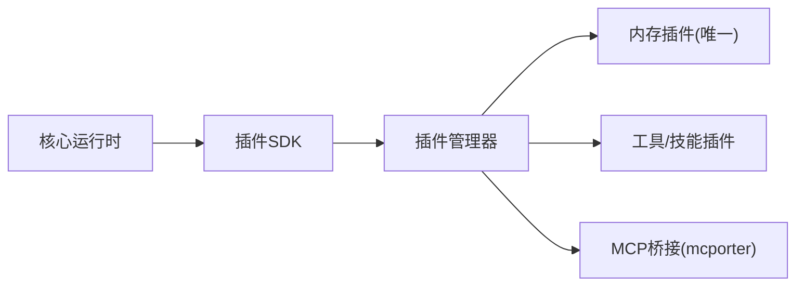
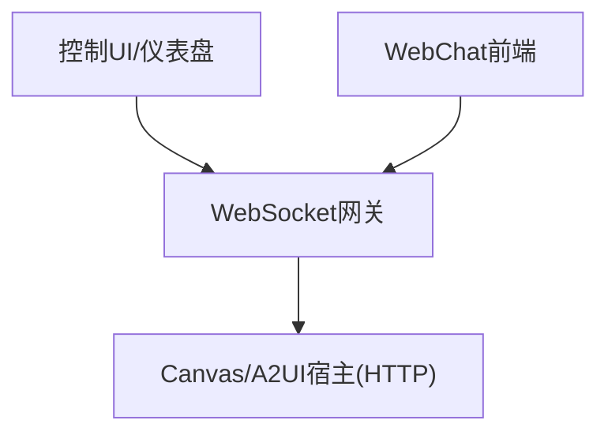
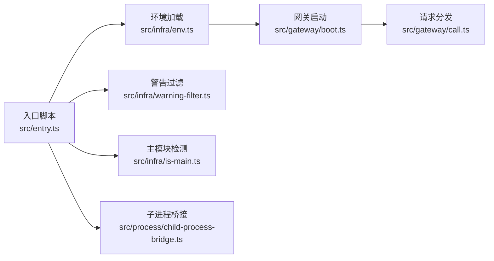

# 技术架构概览

<cite>
**本文档引用的文件**
- [README.md](file://README.md)
- [VISION.md](file://VISION.md)
- [docs/concepts/architecture.md](file://docs/concepts/architecture.md)
- [docs/gateway/configuration.md](file://docs/gateway/configuration.md)
- [src/entry.ts](file://src/entry.ts)
- [src/runtime.ts](file://src/runtime.ts)
- [src/gateway/boot.ts](file://src/gateway/boot.ts)
- [src/gateway/auth.ts](file://src/gateway/auth.ts)
- [src/gateway/call.ts](file://src/gateway/call.ts)
- [src/gateway/canvas-capability.ts](file://src/gateway/canvas-capability.ts)
- [src/gateway/agent-prompt.ts](file://src/gateway/agent-prompt.ts)
- [src/gateway/assistant-identity.ts](file://src/gateway/assistant-identity.ts)
- [src/agents/agent-paths.ts](file://src/agents/agent-paths.ts)
- [src/agents/agent-scope.ts](file://src/agents/agent-scope.ts)
- [src/channels/channel-config.ts](file://src/channels/channel-config.ts)
- [src/channels/allow-from.ts](file://src/channels/allow-from.ts)
- [src/memory/memory-core.ts](file://src/memory/memory-core.ts)
- [src/plugins/plugins-manager.ts](file://src/plugins/plugins-manager.ts)
- [src/node-host/node-host.ts](file://src/node-host/node-host.ts)
- [src/browser/browser-control.ts](file://src/browser/browser-control.ts)
- [src/media/media-pipeline.ts](file://src/media/media-pipeline.ts)
- [src/cron/cron-jobs.ts](file://src/cron/cron-jobs.ts)
- [src/hooks/hooks.ts](file://src/hooks/hooks.ts)
- [src/web/webchat.ts](file://src/web/webchat.ts)
- [src/cli/run-main.ts](file://src/cli/run-main.ts)
- [src/cli/program.ts](file://src/cli/program.ts)
- [src/infra/env.ts](file://src/infra/env.ts)
- [src/infra/is-main.ts](file://src/infra/is-main.ts)
- [src/infra/warning-filter.ts](file://src/infra/warning-filter.ts)
- [src/process/child-process-bridge.ts](file://src/process/child-process-bridge.ts)
- [apps/electron/src/main/index.ts](file://apps/electron/src/main/index.ts)
- [apps/macos/Package.swift](file://apps/macos/Package.swift)
- [apps/shared/OpenClawKit/Package.swift](file://apps/shared/OpenClawKit/Package.swift)
</cite>

## 目录

1. [引言](#引言)
2. [项目结构](#项目结构)
3. [核心组件](#核心组件)
4. [架构总览](#架构总览)
5. [详细组件分析](#详细组件分析)
6. [依赖关系分析](#依赖关系分析)
7. [性能考虑](#性能考虑)
8. [故障排除指南](#故障排除指南)
9. [结论](#结论)
10. [附录](#附录)

## 引言

本文件面向OpenClaw项目的开发者与运维人员，提供系统级技术架构概览。OpenClaw是一个在用户设备上运行的个人AI助手，通过统一的WebSocket网关控制平面连接多渠道消息、设备节点与AI代理系统，并以插件化方式扩展能力。本文档聚焦以下主题：

- 系统边界与核心子系统：网关控制平面、消息通道适配器、AI代理系统、设备节点系统、Web控制面与Canvas宿主
- 微服务架构、事件驱动模式与插件化设计的落地方式
- 组件交互关系、数据流向与通信协议
- 技术栈选择与架构决策考量（安全、可维护性、可扩展性）

## 项目结构

OpenClaw采用多包工作区组织，核心代码位于src目录，包含网关、通道、代理、插件、节点、媒体、自动化等模块；应用层包括Electron桌面端、macOS/iOS/Android节点以及共享SDK包。

**图示来源**

- [src/entry.ts:1-195](file://src/entry.ts#L1-L195)
- [src/runtime.ts:1-54](file://src/runtime.ts#L1-L54)
- [src/gateway/boot.ts:1-200](file://src/gateway/boot.ts#L1-L200)
- [src/gateway/auth.ts:1-200](file://src/gateway/auth.ts#L1-L200)
- [src/gateway/call.ts:1-200](file://src/gateway/call.ts#L1-L200)
- [src/gateway/canvas-capability.ts:1-200](file://src/gateway/canvas-capability.ts#L1-L200)
- [src/agents/agent-paths.ts:1-200](file://src/agents/agent-paths.ts#L1-L200)
- [src/agents/agent-scope.ts:1-200](file://src/agents/agent-scope.ts#L1-L200)
- [src/gateway/agent-prompt.ts:1-200](file://src/gateway/agent-prompt.ts#L1-L200)
- [src/gateway/assistant-identity.ts:1-200](file://src/gateway/assistant-identity.ts#L1-L200)
- [src/channels/channel-config.ts:1-200](file://src/channels/channel-config.ts#L1-L200)
- [src/channels/allow-from.ts:1-200](file://src/channels/allow-from.ts#L1-L200)
- [src/node-host/node-host.ts:1-200](file://src/node-host/node-host.ts#L1-L200)
- [apps/electron/src/main/index.ts:1-200](file://apps/electron/src/main/index.ts#L1-L200)
- [src/web/webchat.ts:1-200](file://src/web/webchat.ts#L1-L200)

**章节来源**

- [README.md:185-240](file://README.md#L185-L240)
- [docs/concepts/architecture.md:12-26](file://docs/concepts/architecture.md#L12-L26)

## 核心组件

- 网关控制平面（Gateway Control Plane）
  - 职责：维护消息通道连接、暴露类型化WebSocket API、生成事件流、执行认证与鉴权、管理会话与路由
  - 关键点：单实例、长连接、事件不重放、握手与鉴权令牌、设备配对与签名验证
- 消息通道适配器（Channel Adapters）
  - 职责：对接多平台消息服务（WhatsApp、Telegram、Discord、Slack、Signal、iMessage、Google Chat、IRC、Teams、Matrix、Feishu、LINE、Mattermost、Nextcloud Talk、Nostr、Synology Chat、Tlon、Twitch、Zalo、WebChat等），统一入站/出站消息处理
  - 关键点：按通道配置启用/禁用、DM策略（配对/白名单/开放/禁用）、群组提及门控、线程绑定与会话隔离
- AI代理系统（Agent Runtime）
  - 职责：根据会话上下文与工具策略生成响应，支持多代理路由、模型切换与降级、心跳与清理
  - 关键点：提示词模板与身份注入、代理作用域隔离、沙箱执行与工具策略
- 设备节点系统（Node Host）
  - 职责：在macOS/iOS/Android/Headless设备上暴露本地能力（Canvas、Camera、Screen、Location、System命令等），通过WebSocket节点角色连接
  - 关键点：设备配对、能力声明、权限校验（TCC/屏幕录制/通知等）
- 插件与技能（Plugins & Skills）
  - 职责：扩展工具集与功能，遵循插件化设计，社区技能发布至ClawHub
  - 关键点：npm包分发、本地开发加载、内存插件唯一性
- Web控制面与Canvas宿主（Web UI & Canvas Host）
  - 职责：提供控制面板、仪表盘、WebChat与Canvas/A2UI宿主，使用同一网关端口
  - 关键点：静态UI通过WebSocket API交互，远程访问可通过Tailscale或SSH隧道

**章节来源**

- [docs/concepts/architecture.md:27-58](file://docs/concepts/architecture.md#L27-L58)
- [docs/gateway/configuration.md:74-347](file://docs/gateway/configuration.md#L74-L347)
- [VISION.md:52-84](file://VISION.md#L52-L84)

## 架构总览

OpenClaw采用“单网关控制平面 + 多客户端/节点”的微服务架构，所有消息与控制均通过WebSocket长连接进行，事件驱动模式贯穿会话、通道、代理与自动化。系统边界清晰：网关负责控制与编排，通道适配器负责接入外部消息源，代理系统负责推理与工具调用，节点负责设备侧能力，Web面负责可视化与调试。

**图示来源**

- [docs/concepts/architecture.md:12-26](file://docs/concepts/architecture.md#L12-L26)
- [docs/concepts/architecture.md:80-92](file://docs/concepts/architecture.md#L80-L92)
- [docs/gateway/configuration.md:349-387](file://docs/gateway/configuration.md#L349-L387)

## 详细组件分析

### 网关控制平面（WebSocket控制平面）

- 连接生命周期与握手
  - 首帧必须为connect；握手后支持请求/响应与事件推送
  - 支持鉴权令牌、幂等键去重、设备配对与签名验证
- 请求分发与调用
  - 将请求方法映射到具体处理器，支持同步响应与流式事件
- 认证与鉴权
  - 基于设备身份与配对状态，结合网关认证策略（密码/Tailscale/令牌）
- 事件模型
  - 提供agent、chat、presence、health、heartbeat、cron等事件，客户端订阅消费

**图示来源**

- [docs/concepts/architecture.md:59-78](file://docs/concepts/architecture.md#L59-L78)
- [docs/concepts/architecture.md:80-92](file://docs/concepts/architecture.md#L80-L92)
- [src/gateway/auth.ts:1-200](file://src/gateway/auth.ts#L1-L200)
- [src/gateway/call.ts:1-200](file://src/gateway/call.ts#L1-L200)

**章节来源**

- [docs/concepts/architecture.md:27-58](file://docs/concepts/architecture.md#L27-L58)
- [src/gateway/boot.ts:1-200](file://src/gateway/boot.ts#L1-L200)
- [src/gateway/auth.ts:1-200](file://src/gateway/auth.ts#L1-L200)
- [src/gateway/call.ts:1-200](file://src/gateway/call.ts#L1-L200)

### 消息通道适配器（Channel Adapters）

- 通道配置与启用
  - 各通道在channels.<provider>下配置，支持启用/禁用、DM策略、群组策略
- 入站/出站消息处理
  - 解析入站消息，路由到对应会话；组装出站消息，调用通道API发送
- 安全与策略
  - allowFrom白名单、提及门控、线程绑定、会话作用域隔离

**图示来源**

- [src/channels/channel-config.ts:1-200](file://src/channels/channel-config.ts#L1-L200)
- [src/channels/allow-from.ts:1-200](file://src/channels/allow-from.ts#L1-L200)
- [docs/gateway/configuration.md:135-176](file://docs/gateway/configuration.md#L135-L176)

**章节来源**

- [docs/gateway/configuration.md:74-347](file://docs/gateway/configuration.md#L74-L347)
- [src/channels/channel-config.ts:1-200](file://src/channels/channel-config.ts#L1-L200)
- [src/channels/allow-from.ts:1-200](file://src/channels/allow-from.ts#L1-L200)

### AI代理系统（Agent Runtime）

- 代理路径与作用域
  - 代理路径解析与作用域隔离，支持多代理并行与会话绑定
- 提示词与身份
  - 注入系统提示、工具清单、会话历史，形成上下文
- 模型与降级
  - 主模型与回退模型配置，支持轮换与失败转移
- 心跳与清理
  - 定期检查与会话清理，避免资源泄漏

**图示来源**

- [src/agents/agent-paths.ts:1-200](file://src/agents/agent-paths.ts#L1-L200)
- [src/agents/agent-scope.ts:1-200](file://src/agents/agent-scope.ts#L1-L200)
- [src/gateway/agent-prompt.ts:1-200](file://src/gateway/agent-prompt.ts#L1-L200)
- [src/gateway/assistant-identity.ts:1-200](file://src/gateway/assistant-identity.ts#L1-L200)

**章节来源**

- [src/agents/agent-paths.ts:1-200](file://src/agents/agent-paths.ts#L1-L200)
- [src/agents/agent-scope.ts:1-200](file://src/agents/agent-scope.ts#L1-L200)
- [src/gateway/agent-prompt.ts:1-200](file://src/gateway/agent-prompt.ts#L1-L200)
- [src/gateway/assistant-identity.ts:1-200](file://src/gateway/assistant-identity.ts#L1-L200)

### 设备节点系统（Node Host）

- 节点角色与能力
  - 通过WebSocket连接，声明role: node，提供Canvas、Camera、Screen、Location、System命令等能力
- 权限与安全
  - macOS TCC权限、屏幕录制/通知等需要显式授权；节点命令需经网关鉴权
- 配对与信任
  - 设备基于配对存储进行信任，本地连接可自动批准，远程连接仍需人工确认

**图示来源**

- [docs/concepts/architecture.md:42-47](file://docs/concepts/architecture.md#L42-L47)
- [docs/concepts/architecture.md:93-109](file://docs/concepts/architecture.md#L93-L109)
- [src/gateway/canvas-capability.ts:1-200](file://src/gateway/canvas-capability.ts#L1-L200)
- [src/node-host/node-host.ts:1-200](file://src/node-host/node-host.ts#L1-L200)

**章节来源**

- [docs/concepts/architecture.md:42-47](file://docs/concepts/architecture.md#L42-L47)
- [src/gateway/canvas-capability.ts:1-200](file://src/gateway/canvas-capability.ts#L1-L200)
- [src/node-host/node-host.ts:1-200](file://src/node-host/node-host.ts#L1-L200)

### 插件与技能（Plugins & Skills）

- 插件化设计
  - 核心保持精简，可选能力以插件形式提供；内存插件唯一激活
- 分发与开发
  - npm包分发，本地开发加载；社区插件在ClawHub发布
- MCP支持
  - 通过mcporter桥接MCP服务器，降低对核心的耦合

**图示来源**

- [VISION.md:52-84](file://VISION.md#L52-L84)
- [src/plugins/plugins-manager.ts:1-200](file://src/plugins/plugins-manager.ts#L1-L200)

**章节来源**

- [VISION.md:52-84](file://VISION.md#L52-L84)
- [src/plugins/plugins-manager.ts:1-200](file://src/plugins/plugins-manager.ts#L1-L200)

### Web控制面与Canvas宿主

- 控制UI与仪表盘
  - 通过网关WebSocket API提供配置、健康、日志等操作
- WebChat
  - 前端通过WebSocket与网关交互，支持远程隧道访问
- Canvas/A2UI
  - 网关HTTP服务提供Canvas与A2UI宿主，便于可视化工作区

**图示来源**

- [docs/concepts/architecture.md:22-25](file://docs/concepts/architecture.md#L22-L25)
- [src/web/webchat.ts:1-200](file://src/web/webchat.ts#L1-L200)

**章节来源**

- [docs/concepts/architecture.md:22-25](file://docs/concepts/architecture.md#L22-L25)
- [src/web/webchat.ts:1-200](file://src/web/webchat.ts#L1-L200)

## 依赖关系分析

- 运行时与入口
  - 入口脚本负责进程环境初始化、警告过滤、环境变量规范化、快速版本/帮助路径、CLI主流程启动
- 环境与配置
  - 环境变量加载顺序与配置热重载策略，支持$include与SecretRef
- 进程桥接
  - 子进程桥接用于实验性警告抑制后的重启与日志桥接

**图示来源**

- [src/entry.ts:1-195](file://src/entry.ts#L1-L195)
- [src/infra/env.ts:1-200](file://src/infra/env.ts#L1-L200)
- [src/infra/warning-filter.ts:1-200](file://src/infra/warning-filter.ts#L1-L200)
- [src/infra/is-main.ts:1-200](file://src/infra/is-main.ts#L1-L200)
- [src/process/child-process-bridge.ts:1-200](file://src/process/child-process-bridge.ts#L1-L200)
- [src/gateway/boot.ts:1-200](file://src/gateway/boot.ts#L1-L200)
- [src/gateway/call.ts:1-200](file://src/gateway/call.ts#L1-L200)

**章节来源**

- [src/entry.ts:1-195](file://src/entry.ts#L1-L195)
- [src/runtime.ts:1-54](file://src/runtime.ts#L1-L54)
- [src/infra/env.ts:1-200](file://src/infra/env.ts#L1-L200)
- [src/infra/warning-filter.ts:1-200](file://src/infra/warning-filter.ts#L1-L200)
- [src/infra/is-main.ts:1-200](file://src/infra/is-main.ts#L1-L200)
- [src/process/child-process-bridge.ts:1-200](file://src/process/child-process-bridge.ts#L1-L200)

## 性能考虑

- 单网关单实例：减少跨实例协调成本，保证会话一致性
- 事件驱动与流式输出：降低延迟，提升用户体验
- 沙箱与工具策略：隔离高风险操作，避免阻塞与崩溃扩散
- 配置热重载：非关键变更无需重启，缩短运维窗口
- 远程访问：Tailscale/SSH隧道，兼顾安全性与可用性

[本节为通用指导，无需特定文件引用]

## 故障排除指南

- 网关健康检查
  - 使用health事件与hello-ok快照判断运行状态
- 配置校验
  - 严格JSON Schema校验，未知键或非法值会导致启动失败；使用doctor修复
- 认证与配对
  - 设备签名验证失败、令牌不匹配、非本地连接未批准都会导致断开
- 远程访问
  - 确认Tailscale Serve/Funnel或SSH隧道配置正确，必要时开启TLS与证书固定

**章节来源**

- [docs/concepts/architecture.md:129-140](file://docs/concepts/architecture.md#L129-L140)
- [docs/gateway/configuration.md:61-73](file://docs/gateway/configuration.md#L61-L73)
- [docs/concepts/architecture.md:93-109](file://docs/concepts/architecture.md#L93-L109)

## 结论

OpenClaw通过“单网关控制平面 + 多客户端/节点”的微服务架构，结合事件驱动与插件化设计，在保障安全与隐私的前提下实现了强大的跨平台消息与设备控制能力。其清晰的系统边界、严格的配置校验与灵活的远程访问策略，使其既适合个人自建，也便于团队与企业级部署。

[本节为总结性内容，无需特定文件引用]

## 附录

- 应用与平台
  - Electron桌面端、macOS/iOS/Android节点、共享SDK包（Swift/TypeScript）
- CLI与运行时
  - CLI主流程、程序构建、运行时IO封装与终端恢复

**章节来源**

- [apps/electron/src/main/index.ts:1-200](file://apps/electron/src/main/index.ts#L1-L200)
- [apps/macos/Package.swift:1-200](file://apps/macos/Package.swift#L1-L200)
- [apps/shared/OpenClawKit/Package.swift:1-200](file://apps/shared/OpenClawKit/Package.swift#L1-L200)
- [src/cli/run-main.ts:1-200](file://src/cli/run-main.ts#L1-L200)
- [src/cli/program.ts:1-200](file://src/cli/program.ts#L1-L200)
- [src/runtime.ts:1-54](file://src/runtime.ts#L1-L54)
