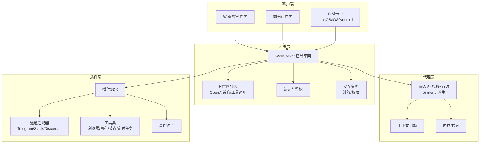
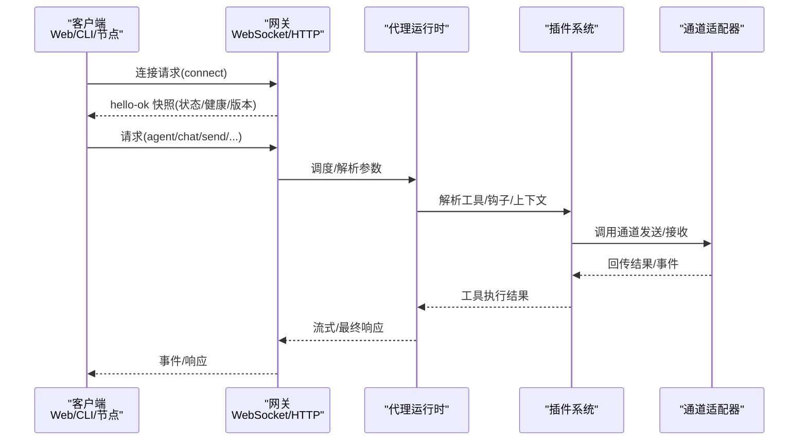
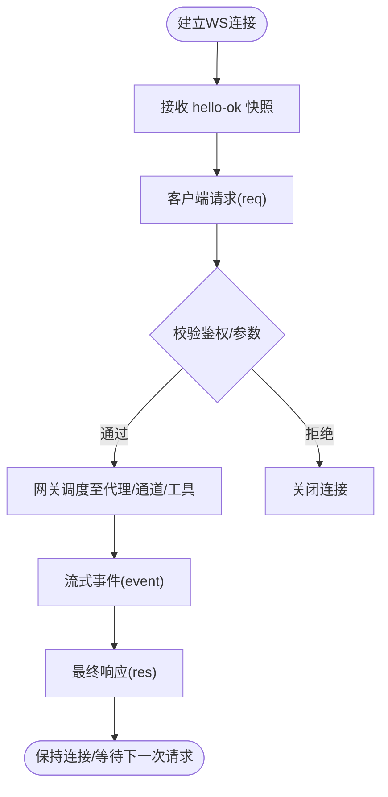
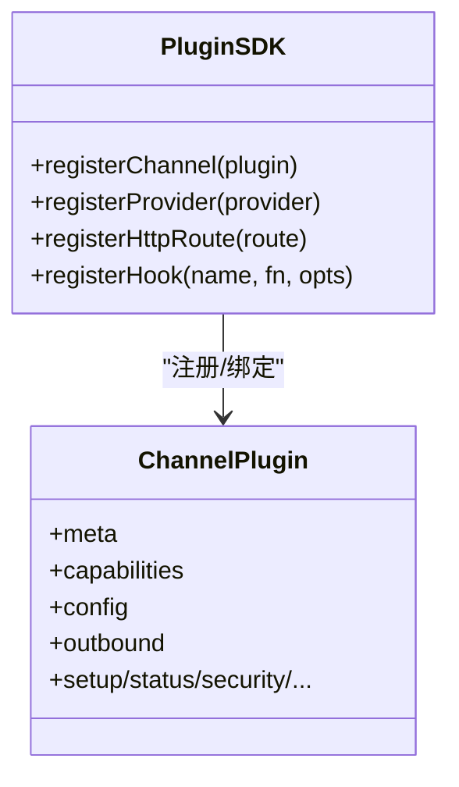
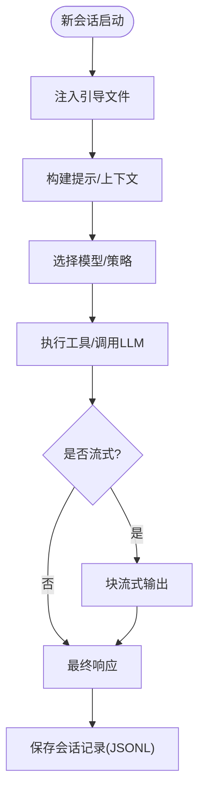
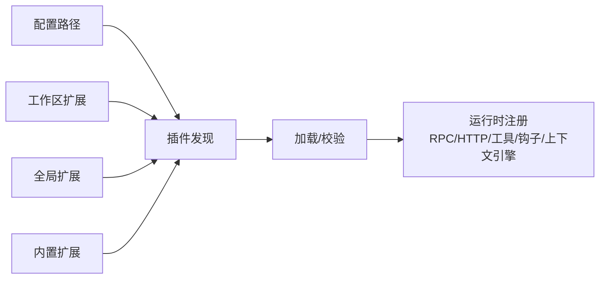
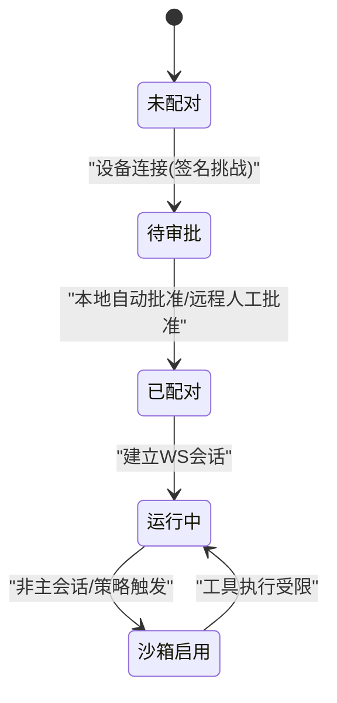
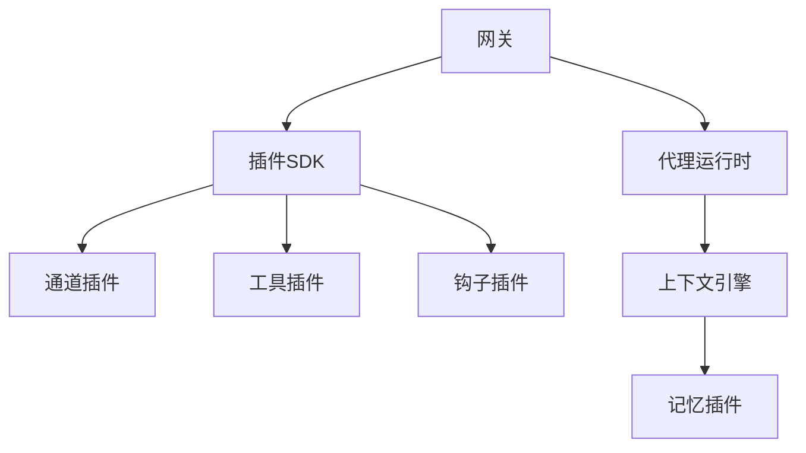

# 技术架构概览

<cite>
**本文档引用的文件**
- [README.md](file://README.md)
- [VISION.md](file://VISION.md)
- [architecture.md](file://docs/concepts/architecture.md)
- [gateway/index.md](file://docs/gateway/index.md)
- [plugin.md](file://docs/tools/plugin.md)
- [agent.md](file://docs/concepts/agent.md)
- [gateway.ts](file://src/gateway/index.ts)
- [entry.ts](file://src/entry.ts)
- [runtime.ts](file://src/runtime.ts)
- [plugin-sdk/index.ts](file://src/plugin-sdk/index.ts)
- [security.md](file://docs/gateway/security.md)
</cite>

## 目录

1. [引言](#引言)
2. [项目结构](#项目结构)
3. [核心组件](#核心组件)
4. [架构总览](#架构总览)
5. [详细组件分析](#详细组件分析)
6. [依赖关系分析](#依赖关系分析)
7. [性能考量](#性能考量)
8. [故障排查指南](#故障排查指南)
9. [结论](#结论)

## 引言

本文件面向OpenClaw的技术架构，围绕其核心子系统进行系统化梳理：WebSocket控制平面、多平台通道适配器、AI代理引擎、插件系统与安全沙箱。文档旨在帮助开发者快速理解OpenClaw的运行时组织、组件交互与扩展边界，并提供可操作的架构视图与流程图示。

## 项目结构

OpenClaw采用以“网关（Gateway）+ 代理（Agent）+ 插件（Plugin）”为核心的分层架构：

- 网关层：统一的WebSocket控制平面，承载会话、通道、工具与事件。
- 代理层：嵌入式pi-mono派生的单代理运行时，负责对话循环、上下文管理与工具执行。
- 插件层：通过插件SDK注册通道、工具、HTTP路由、钩子与上下文引擎，实现功能扩展。
- 安全层：基于设备配对、认证令牌与容器沙箱的多层安全策略。

图表来源

- [architecture.md:12-26](file://docs/concepts/architecture.md#L12-L26)
- [gateway/index.md:68-77](file://docs/gateway/index.md#L68-L77)

章节来源

- [README.md:185-212](file://README.md#L185-L212)
- [architecture.md:12-26](file://docs/concepts/architecture.md#L12-L26)
- [gateway/index.md:68-77](file://docs/gateway/index.md#L68-L77)

## 核心组件

- WebSocket控制平面（网关）
  - 单一长连接控制平面，承载请求/响应与事件推送；支持设备配对、鉴权与远程访问。
  - 提供HTTP服务（OpenAI兼容接口、工具调用、控制UI）。
- 多平台通道适配器
  - 基于插件的通道注册机制，统一接入WhatsApp、Telegram、Slack、Discord、Signal、iMessage、WebChat等。
- AI代理引擎
  - 嵌入式代理运行时，使用TypeScript构建，具备会话管理、上下文注入、工具调用与流式输出能力。
- 插件系统
  - 通过插件SDK注册通道、工具、HTTP路由、钩子与上下文引擎，支持独占槽位（如记忆插件）。
- 安全沙箱
  - 默认在非主会话中启用容器沙箱，限制工具访问范围；支持设备权限与节点能力声明。

章节来源

- [architecture.md:27-52](file://docs/concepts/architecture.md#L27-L52)
- [plugin.md:62-80](file://docs/tools/plugin.md#L62-L80)
- [agent.md:10-23](file://docs/concepts/agent.md#L10-L23)
- [security.md:1-50](file://docs/gateway/security.md#L1-L50)

## 架构总览

OpenClaw采用“单网关 + 多客户端 + 插件化适配”的架构模式，强调本地优先、安全默认与可扩展性。下图展示典型客户端到网关的握手与消息流转：

图表来源

- [architecture.md:59-78](file://docs/concepts/architecture.md#L59-L78)
- [gateway/index.md:202-214](file://docs/gateway/index.md#L202-L214)

章节来源

- [architecture.md:59-78](file://docs/concepts/architecture.md#L59-L78)
- [gateway/index.md:202-214](file://docs/gateway/index.md#L202-L214)

## 详细组件分析

### 组件A：WebSocket控制平面（网关）

- 角色与职责
  - 维护通道连接、暴露Typed WS API、事件发布（agent/chat/presence/health/tick/cron）、HTTP服务。
  - 支持设备配对、鉴权令牌、远程访问（Tailscale/SSH隧道）。
- 数据流与处理
  - 首帧必须为connect；握手后请求/响应与事件双向流动；支持幂等键去重。
  - 事件不重放，客户端需在序列断点刷新状态。
- 关键特性
  - 类型安全：基于TypeBox生成JSON Schema与Swift模型。
  - 可靠性：优雅关闭前广播shutdown事件；失败快速断开避免降级路径。

图表来源

- [architecture.md:80-92](file://docs/concepts/architecture.md#L80-L92)
- [gateway/index.md:216-234](file://docs/gateway/index.md#L216-L234)

章节来源

- [architecture.md:27-52](file://docs/concepts/architecture.md#L27-L52)
- [gateway/index.md:68-77](file://docs/gateway/index.md#L68-L77)

### 组件B：多平台通道适配器

- 注册与发现
  - 通过插件SDK注册通道元数据、配置解析、出站发送与可选能力（提及/线程/媒体/命令）。
  - 支持自定义安装提示与向导集成。
- 生命周期
  - 插件可定义setup/status/security/mentions/threading/streaming/actions/commands等适配器。
- 典型场景
  - 出站发送：统一由插件的outbound.sendText完成。
  - 入站事件：通道适配器将外部消息映射为内部事件，经网关转发给代理。

图表来源

- [plugin.md:655-799](file://docs/tools/plugin.md#L655-L799)
- [plugin.md:228-277](file://docs/tools/plugin.md#L228-L277)

章节来源

- [plugin.md:62-80](file://docs/tools/plugin.md#L62-L80)
- [plugin.md:228-277](file://docs/tools/plugin.md#L228-L277)
- [plugin.md:655-799](file://docs/tools/plugin.md#L655-L799)

### 组件C：AI代理引擎（嵌入式运行时）

- 工作区与引导
  - 使用单一工作区目录作为工具cwd；首次会话注入AGENTS/SOUL/TOOLS等引导文件。
- 工具与技能
  - 内置系统工具（读写/编辑/应用补丁等），受工具策略约束；技能来自bundle/managed/workspace三处。
- 会话与流式
  - 会话转录存储为JSONL；支持队列模式（steer/followup/collect）与块流式输出。
- 模型引用
  - 通过“provider/model”或别名解析模型；支持默认提供者与OpenRouter风格ID。

图表来源

- [agent.md:24-42](file://docs/concepts/agent.md#L24-L42)
- [agent.md:73-104](file://docs/concepts/agent.md#L73-L104)

章节来源

- [agent.md:10-23](file://docs/concepts/agent.md#L10-L23)
- [agent.md:49-104](file://docs/concepts/agent.md#L49-L104)

### 组件D：插件系统（SDK与扩展点）

- 扩展点
  - Gateway RPC方法、HTTP路由、Agent工具、CLI命令、后台服务、上下文引擎、技能、自动回复命令。
- 加载与信任
  - 发现顺序：配置路径 > 工作区扩展 > 全局扩展 > 内置扩展；支持白名单/黑名单与安装追踪。
  - 安全检查：路径合法性、权限与所有权校验；未受信加载发出警告。
- 独占槽位
  - 记忆插件与上下文引擎为独占槽位，通过plugins.slots选择当前实现。

图表来源

- [plugin.md:228-277](file://docs/tools/plugin.md#L228-L277)
- [plugin.md:393-426](file://docs/tools/plugin.md#L393-L426)

章节来源

- [plugin.md:62-80](file://docs/tools/plugin.md#L62-L80)
- [plugin.md:357-383](file://docs/tools/plugin.md#L357-L383)
- [plugin.md:393-426](file://docs/tools/plugin.md#L393-L426)

### 组件E：安全沙箱与权限

- 设备配对与鉴权
  - connect阶段携带设备身份与签名挑战；本地连接可自动批准；远程连接需显式批准。
- 沙箱策略
  - 非主会话默认启用容器沙箱，允许/禁止工具清单明确；支持按会话覆盖。
- 权限与节点能力
  - 节点通过connect声明能力（canvas/camera/screen/location等），受TCC与用户授权影响。

图表来源

- [architecture.md:93-109](file://docs/concepts/architecture.md#L93-L109)
- [security.md:1-50](file://docs/gateway/security.md#L1-L50)

章节来源

- [architecture.md:93-109](file://docs/concepts/architecture.md#L93-L109)
- [security.md:1-50](file://docs/gateway/security.md#L1-L50)

## 依赖关系分析

- 组件耦合
  - 网关与代理：强耦合（RPC/事件），代理依赖插件提供的工具与上下文。
  - 插件与通道：松耦合（通过SDK注册），通道适配器仅暴露最小API面。
  - 客户端与网关：弱耦合（WS协议），通过类型化消息契约通信。
- 外部依赖
  - 模型提供商（OpenAI/Anthropic等）通过插件或直接配置接入。
  - 通道提供商（Telegram/Slack/Discord等）通过各自插件接入。
- 循环依赖风险
  - 插件注册在运行时完成，避免编译期循环；通道适配器通过抽象接口解耦。

图表来源

- [plugin.md:62-80](file://docs/tools/plugin.md#L62-L80)
- [agent.md:49-65](file://docs/concepts/agent.md#L49-L65)

章节来源

- [plugin.md:62-80](file://docs/tools/plugin.md#L62-L80)
- [agent.md:49-65](file://docs/concepts/agent.md#L49-L65)

## 性能考量

- 事件不重放：客户端需在断点后刷新状态，避免重复消费导致的额外负载。
- 幂等键：对有副作用的方法（如发送/代理调用）要求幂等键，减少重复执行。
- 流式输出：块流式与合并策略降低高频小包带来的网络与渲染压力。
- 插件缓存：插件发现与清单元数据短时缓存，减少启动/热重载抖动。
- 远程访问：Tailscale/SSH隧道保持与本地相同的鉴权与握手流程，避免额外代理层。

章节来源

- [architecture.md:89-92](file://docs/concepts/architecture.md#L89-L92)
- [plugin.md:219-227](file://docs/tools/plugin.md#L219-L227)

## 故障排查指南

- 启动与健康
  - 本地5分钟启动流程：启动网关 → 健康检查 → 通道就绪探测。
  - 远程访问：Tailscale/VPN优先，SSH隧道回退；隧道内仍需鉴权。
- 常见失败征兆
  - 绑定无鉴权：非loopback绑定且未配置token/password。
  - 端口冲突：已有实例监听或EADDRINUSE。
  - 配置模式冲突：设置为远程模式但未满足条件。
  - 连接鉴权不匹配：客户端与网关鉴权不一致。
- 运维建议
  - 使用守护进程（launchd/systemd）保障重启；定期doctor巡检。
  - 对插件变更采用“需要重启”的热重载模式，确保一致性。

章节来源

- [gateway/index.md:27-61](file://docs/gateway/index.md#L27-L61)
- [gateway/index.md:108-123](file://docs/gateway/index.md#L108-L123)
- [gateway/index.md:235-244](file://docs/gateway/index.md#L235-L244)

## 结论

OpenClaw以“单网关控制平面 + 嵌入式代理 + 插件化适配 + 安全沙箱”为核心，形成可扩展、可审计、可远程的安全个人AI助手体系。通过严格的类型化协议、设备配对与鉴权、容器沙箱与工具白名单，以及模块化的插件生态，OpenClaw在保证安全性的同时，提供了强大的扩展能力与良好的开发体验。
