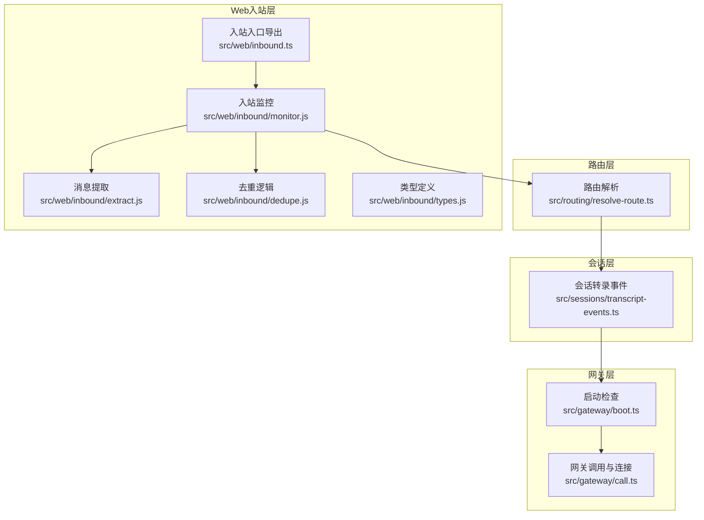
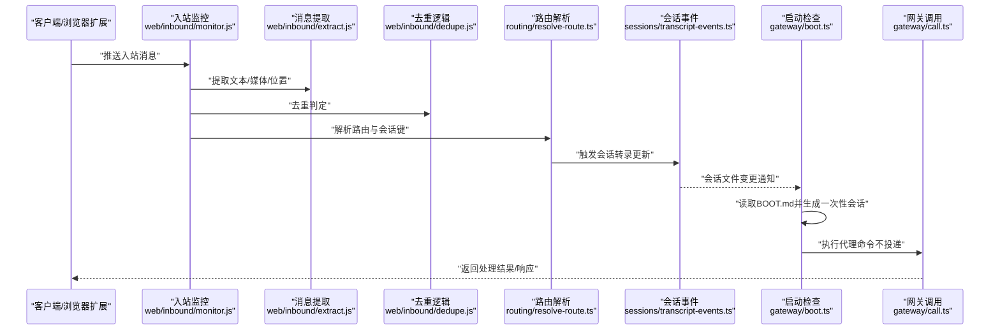
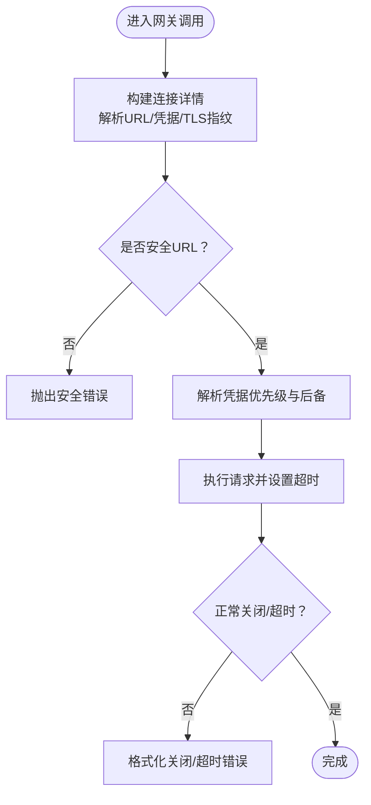
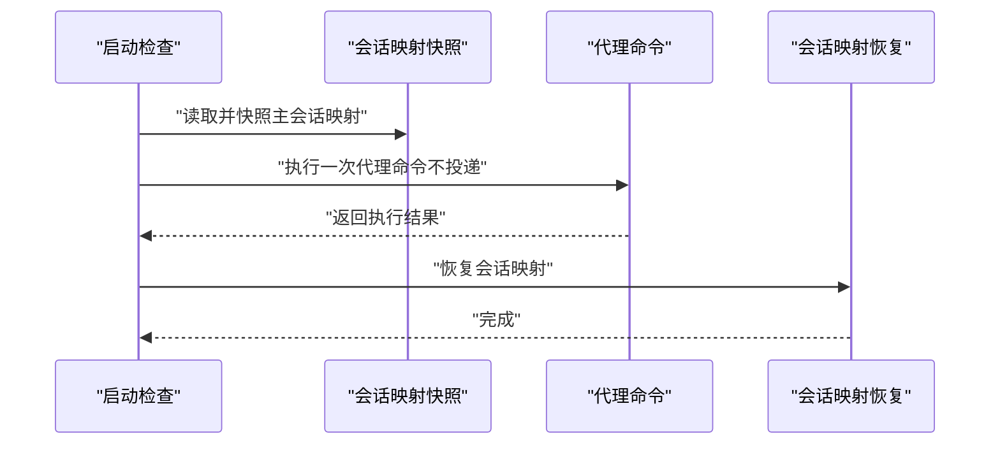
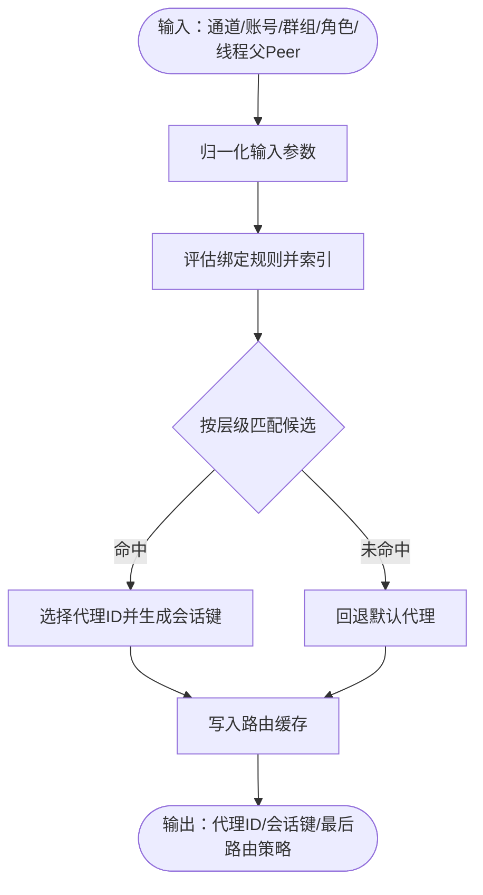
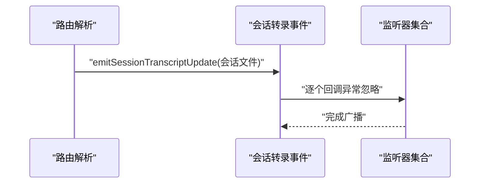
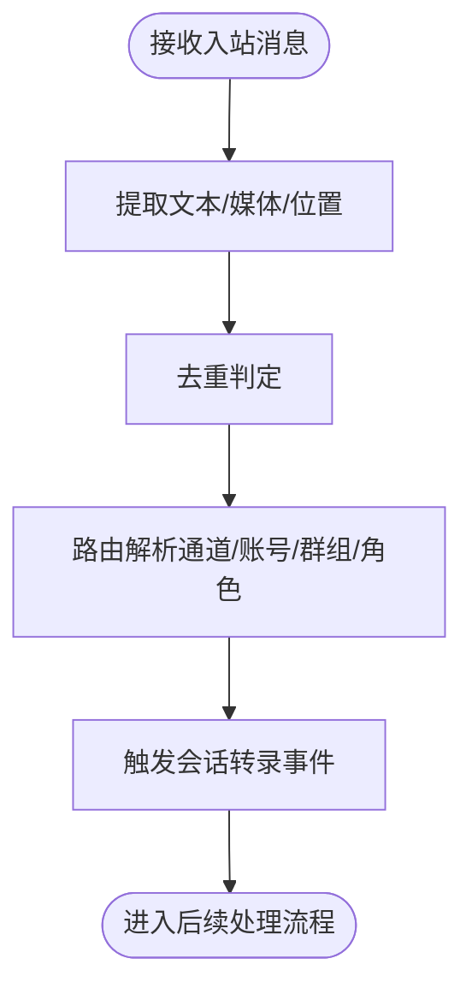

# 数据流与处理流程

<cite>
**本文引用的文件**
- [src/gateway/boot.ts](file://src/gateway/boot.ts)
- [src/gateway/call.ts](file://src/gateway/call.ts)
- [src/routing/resolve-route.ts](file://src/routing/resolve-route.ts)
- [src/sessions/transcript-events.ts](file://src/sessions/transcript-events.ts)
- [src/web/inbound.ts](file://src/web/inbound.ts)
- [src/web/inbound/monitor.js](file://src/web/inbound/monitor.js)
- [src/web/inbound/extract.js](file://src/web/inbound/extract.js)
- [src/web/inbound/dedupe.js](file://src/web/inbound/dedupe.js)
- [src/web/inbound/types.js](file://src/web/inbound/types.js)
</cite>

## 目录

1. [引言](#引言)
2. [项目结构](#项目结构)
3. [核心组件](#核心组件)
4. [架构总览](#架构总览)
5. [详细组件分析](#详细组件分析)
6. [依赖关系分析](#依赖关系分析)
7. [性能考量](#性能考量)
8. [故障排查指南](#故障排查指南)
9. [结论](#结论)
10. [附录](#附录)

## 引言

本技术文档聚焦于 OpenClaw 的数据流与处理流程，系统性阐述消息从接收、路由、处理到响应的完整数据路径；解释 WebSocket 连接管理、消息序列化、会话状态管理与并发处理机制；并深入说明 AI 代理的推理过程、工具调用链与结果聚合流程。文档包含数据流图、时序图与状态转换图，并通过“章节来源”定位到具体实现文件，帮助读者快速定位到关键处理节点与数据转换点。

## 项目结构

OpenClaw 采用模块化分层设计：网关层负责与远端网关建立安全连接与认证；路由层根据通道、账号、群组/频道、角色等维度解析代理路由；会话层维护会话键与转录事件；Web 入站层负责消息提取、去重与监控。下图给出与本文相关的模块关系概览：

**图表来源**

- [src/gateway/boot.ts:1-204](file://src/gateway/boot.ts#L1-L204)
- [src/gateway/call.ts:1-800](file://src/gateway/call.ts#L1-L800)
- [src/routing/resolve-route.ts:1-805](file://src/routing/resolve-route.ts#L1-L805)
- [src/sessions/transcript-events.ts:1-30](file://src/sessions/transcript-events.ts#L1-L30)
- [src/web/inbound.ts:1-5](file://src/web/inbound.ts#L1-L5)

**章节来源**

- [src/gateway/boot.ts:1-204](file://src/gateway/boot.ts#L1-L204)
- [src/gateway/call.ts:1-800](file://src/gateway/call.ts#L1-L800)
- [src/routing/resolve-route.ts:1-805](file://src/routing/resolve-route.ts#L1-L805)
- [src/sessions/transcript-events.ts:1-30](file://src/sessions/transcript-events.ts#L1-L30)
- [src/web/inbound.ts:1-5](file://src/web/inbound.ts#L1-L5)

## 核心组件

- 网关调用与连接（src/gateway/call.ts）
  - 负责构建连接详情、解析凭据、校验 URL 安全性、执行请求并处理超时与关闭错误。
  - 支持本地/远程模式、TLS 指纹校验、方法能力要求校验。
- 启动检查与会话映射（src/gateway/boot.ts）
  - 读取工作区 BOOT.md，生成一次性会话 ID，执行一次代理命令，恢复主会话映射。
- 路由解析（src/routing/resolve-route.ts）
  - 基于通道、账号、群组/频道、角色等维度匹配绑定规则，解析代理路由与会话键。
  - 提供会话键缓存与调试日志输出。
- 会话转录事件（src/sessions/transcript-events.ts）
  - 维护会话转录更新监听器集合，广播会话文件变更事件。
- Web 入站消息处理（src/web/inbound.ts 及其子模块）
  - 导出入站监控、消息提取、去重与类型定义，支撑多通道消息的统一接入。

**章节来源**

- [src/gateway/call.ts:1-800](file://src/gateway/call.ts#L1-L800)
- [src/gateway/boot.ts:1-204](file://src/gateway/boot.ts#L1-L204)
- [src/routing/resolve-route.ts:1-805](file://src/routing/resolve-route.ts#L1-L805)
- [src/sessions/transcript-events.ts:1-30](file://src/sessions/transcript-events.ts#L1-L30)
- [src/web/inbound.ts:1-5](file://src/web/inbound.ts#L1-L5)

## 架构总览

下图展示从 Web 入站到网关调用的整体数据流与控制流：

**图表来源**

- [src/web/inbound/monitor.js](file://src/web/inbound/monitor.js)
- [src/web/inbound/extract.js](file://src/web/inbound/extract.js)
- [src/web/inbound/dedupe.js](file://src/web/inbound/dedupe.js)
- [src/routing/resolve-route.ts:614-800](file://src/routing/resolve-route.ts#L614-L800)
- [src/sessions/transcript-events.ts:16-29](file://src/sessions/transcript-events.ts#L16-L29)
- [src/gateway/boot.ts:138-203](file://src/gateway/boot.ts#L138-L203)
- [src/gateway/call.ts:779-800](file://src/gateway/call.ts#L779-L800)

## 详细组件分析

### 组件一：网关调用与连接管理

- 关键职责
  - 解析配置与环境变量，构建安全的 WebSocket 目标地址（仅允许 wss 或本地回环的 ws）。
  - 解析凭据优先级与后备策略，支持 SecretRef 动态解析。
  - 执行请求、设置超时、处理关闭与方法能力校验。
- 并发与错误处理
  - 使用定时器与安全超时范围，避免整数溢出问题。
  - 对异常关闭与超时进行格式化错误提示，包含连接详情。
- 代码片段路径
  - [连接详情构建与安全校验:137-226](file://src/gateway/call.ts#L137-L226)
  - [凭据解析与 SecretRef 处理:330-650](file://src/gateway/call.ts#L330-L650)
  - [超时与关闭错误格式化:743-748](file://src/gateway/call.ts#L743-L748)
  - [方法能力校验:750-777](file://src/gateway/call.ts#L750-L777)

**图表来源**

- [src/gateway/call.ts:137-226](file://src/gateway/call.ts#L137-L226)
- [src/gateway/call.ts:330-650](file://src/gateway/call.ts#L330-L650)
- [src/gateway/call.ts:743-777](file://src/gateway/call.ts#L743-L777)

**章节来源**

- [src/gateway/call.ts:1-800](file://src/gateway/call.ts#L1-L800)

### 组件二：启动检查与会话映射

- 关键职责
  - 读取工作区 BOOT.md 内容，构造引导提示词，生成一次性会话 ID。
  - 快照主会话映射，执行一次代理命令（deliver=false），最后恢复映射。
- 并发与一致性
  - 使用快照/恢复确保在引导期间不会影响当前会话状态。
- 代码片段路径
  - [引导提示词构建:42-54](file://src/gateway/boot.ts#L42-L54)
  - [会话映射快照与恢复:76-136](file://src/gateway/boot.ts#L76-L136)
  - [执行引导命令与结果汇总:138-203](file://src/gateway/boot.ts#L138-L203)

**图表来源**

- [src/gateway/boot.ts:76-136](file://src/gateway/boot.ts#L76-L136)
- [src/gateway/boot.ts:138-203](file://src/gateway/boot.ts#L138-L203)

**章节来源**

- [src/gateway/boot.ts:1-204](file://src/gateway/boot.ts#L1-L204)

### 组件三：路由解析与会话键

- 关键职责
  - 将通道、账号、群组/频道、角色等输入归一化，按层级匹配绑定规则。
  - 生成内部会话键与主会话键，决定最后路由更新策略。
  - 缓存评估结果与路由结果，降低重复计算成本。
- 代码片段路径
  - [路由输入与输出结构:26-59](file://src/routing/resolve-route.ts#L26-L59)
  - [会话键构建与主会话键派生:91-112](file://src/routing/resolve-route.ts#L91-L112)
  - [路由匹配层级与候选选择:723-800](file://src/routing/resolve-route.ts#L723-L800)
  - [路由结果缓存与调试日志:508-526](file://src/routing/resolve-route.ts#L508-L526)

**图表来源**

- [src/routing/resolve-route.ts:614-800](file://src/routing/resolve-route.ts#L614-L800)

**章节来源**

- [src/routing/resolve-route.ts:1-805](file://src/routing/resolve-route.ts#L1-L805)

### 组件四：会话转录事件与并发广播

- 关键职责
  - 维护会话转录监听器集合，广播会话文件更新事件。
  - 保证监听器异常不影响广播流程。
- 代码片段路径
  - [监听器注册与移除:9-14](file://src/sessions/transcript-events.ts#L9-L14)
  - [事件广播与异常忽略:16-29](file://src/sessions/transcript-events.ts#L16-L29)

**图表来源**

- [src/sessions/transcript-events.ts:16-29](file://src/sessions/transcript-events.ts#L16-L29)

**章节来源**

- [src/sessions/transcript-events.ts:1-30](file://src/sessions/transcript-events.ts#L1-L30)

### 组件五：Web 入站消息处理

- 关键职责
  - 入站入口导出监控、提取、去重与类型定义。
  - 监控器负责接收消息、提取文本/媒体/位置、去重后交由路由解析与会话事件。
- 代码片段路径
  - [入口导出:1-5](file://src/web/inbound.ts#L1-L5)
  - [监控器/提取器/去重器/类型定义](file://src/web/inbound/monitor.js), (file://src/web/inbound/extract.js), (file://src/web/inbound/dedupe.js), (file://src/web/inbound/types.js)

**图表来源**

- [src/web/inbound.ts:1-5](file://src/web/inbound.ts#L1-L5)
- [src/web/inbound/monitor.js](file://src/web/inbound/monitor.js)
- [src/web/inbound/extract.js](file://src/web/inbound/extract.js)
- [src/web/inbound/dedupe.js](file://src/web/inbound/dedupe.js)
- [src/web/inbound/types.js](file://src/web/inbound/types.js)

**章节来源**

- [src/web/inbound.ts:1-5](file://src/web/inbound.ts#L1-L5)

## 依赖关系分析

- 模块耦合
  - Web 入站层与路由层存在直接依赖：监控器在完成提取与去重后调用路由解析。
  - 路由层与会话层通过会话转录事件解耦：路由层无需关心具体存储细节。
  - 启动检查与网关调用通过会话映射与凭据解析间接关联。
- 外部依赖
  - 网关调用层依赖配置加载、TLS 运行时、凭据解析与方法能力声明。
- 循环依赖
  - 当前模块间无循环依赖迹象，各层职责清晰。

**图表来源**

- [src/web/inbound/monitor.js](file://src/web/inbound/monitor.js)
- [src/routing/resolve-route.ts:614-800](file://src/routing/resolve-route.ts#L614-L800)
- [src/sessions/transcript-events.ts:16-29](file://src/sessions/transcript-events.ts#L16-L29)
- [src/gateway/boot.ts:138-203](file://src/gateway/boot.ts#L138-L203)
- [src/gateway/call.ts:779-800](file://src/gateway/call.ts#L779-L800)

**章节来源**

- [src/routing/resolve-route.ts:1-805](file://src/routing/resolve-route.ts#L1-L805)
- [src/sessions/transcript-events.ts:1-30](file://src/sessions/transcript-events.ts#L1-L30)
- [src/gateway/boot.ts:1-204](file://src/gateway/boot.ts#L1-L204)
- [src/gateway/call.ts:1-800](file://src/gateway/call.ts#L1-L800)

## 性能考量

- 路由解析缓存
  - 通过弱映射缓存评估绑定与路由结果，限制最大键数量，避免内存膨胀。
- 会话事件广播
  - 监听器集合使用 Set 存储，广播时异常被忽略，保证高并发下的稳定性。
- 网关调用超时
  - 严格限制定时器安全范围，避免整数溢出导致的不可预期行为。
- 建议
  - 在高并发场景下，建议对路由输入进行预过滤与去重，减少重复计算。
  - 对会话事件监听器进行限流或批量处理，避免热点会话造成抖动。

[本节为通用指导，不直接分析具体文件]

## 故障排查指南

- 网关 URL 安全性错误
  - 现象：连接被拒绝，提示使用明文 ws:// 非回环地址。
  - 排查：确认目标为 wss:// 或使用受信任私有网络开关。
  - 参考路径：[安全校验与错误格式化:186-207](file://src/gateway/call.ts#L186-L207)
- 凭据解析失败
  - 现象：SecretRef 无法解析或为空字符串。
  - 排查：检查配置中的 SecretRef 是否正确，确认后备策略生效。
  - 参考路径：[凭据解析与 SecretRef 处理:330-650](file://src/gateway/call.ts#L330-L650)
- 方法能力不满足
  - 现象：提示当前网关不支持所需方法。
  - 排查：升级网关版本或禁用需要 SecretRef 的功能。
  - 参考路径：[方法能力校验:750-777](file://src/gateway/call.ts#L750-L777)
- 启动检查失败
  - 现象：BOOT.md 读取失败或代理运行失败。
  - 排查：检查工作区 BOOT.md 文件是否存在且非空，查看日志错误原因。
  - 参考路径：[启动检查执行与恢复:138-203](file://src/gateway/boot.ts#L138-L203)

**章节来源**

- [src/gateway/call.ts:186-207](file://src/gateway/call.ts#L186-L207)
- [src/gateway/call.ts:330-650](file://src/gateway/call.ts#L330-L650)
- [src/gateway/call.ts:750-777](file://src/gateway/call.ts#L750-L777)
- [src/gateway/boot.ts:138-203](file://src/gateway/boot.ts#L138-L203)

## 结论

OpenClaw 的数据流以“Web 入站 → 路由解析 → 会话事件 → 启动检查/网关调用”为主线，结合缓存与事件广播机制，在保证安全性与可扩展性的同时，实现了高效的消息处理闭环。通过明确的模块边界与严格的错误处理策略，系统能够在复杂通道与多代理场景下稳定运行。

[本节为总结性内容，不直接分析具体文件]

## 附录

- 典型数据处理场景参考路径
  - Web 入站消息提取与去重：[入口导出:1-5](file://src/web/inbound.ts#L1-L5)
  - 路由解析与会话键生成：[路由解析实现:614-800](file://src/routing/resolve-route.ts#L614-800)
  - 会话转录事件广播：[事件广播:16-29](file://src/sessions/transcript-events.ts#L16-29)
  - 启动检查与代理命令执行：[启动检查:138-203](file://src/gateway/boot.ts#L138-203)
  - 网关连接与凭据解析：[网关调用:330-650](file://src/gateway/call.ts#L330-650)

[本节为补充信息，不直接分析具体文件]
