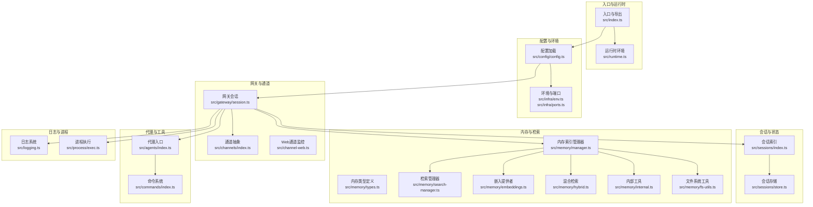
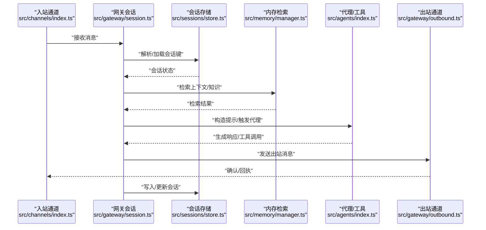
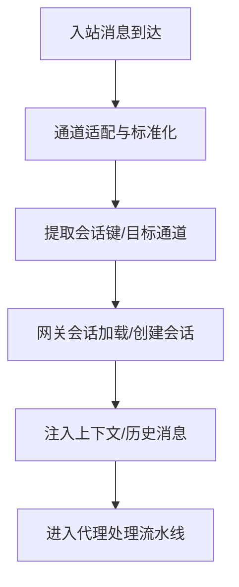
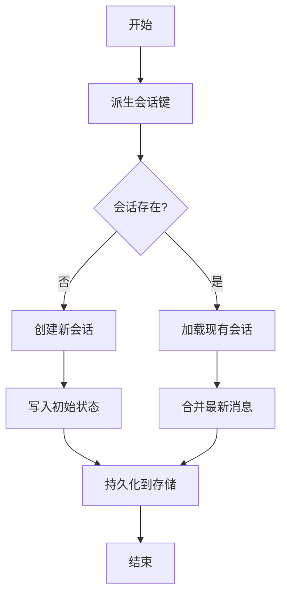
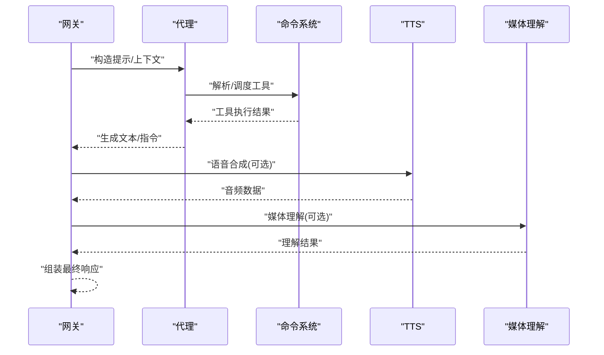
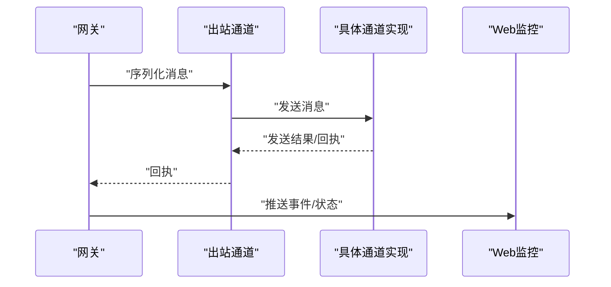
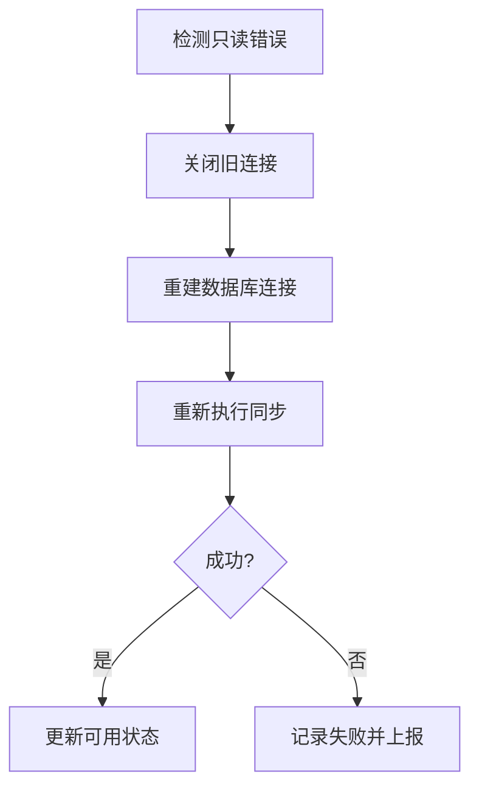
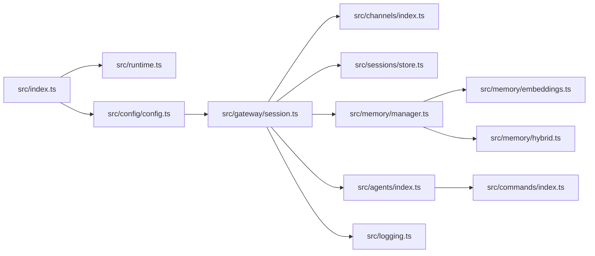

# 数据流设计

<cite>
**本文引用的文件**
- [src/index.ts](file://src/index.ts)
- [src/runtime.ts](file://src/runtime.ts)
- [src/memory/manager.ts](file://src/memory/manager.ts)
- [src/memory/types.ts](file://src/memory/types.ts)
- [src/memory/search-manager.ts](file://src/memory/search-manager.ts)
- [src/memory/embeddings.ts](file://src/memory/embeddings.ts)
- [src/memory/manager-search.ts](file://src/memory/manager-search.ts)
- [src/memory/hybrid.ts](file://src/memory/hybrid.ts)
- [src/memory/internal.ts](file://src/memory/internal.ts)
- [src/memory/fs-utils.ts](file://src/memory/fs-utils.ts)
- [src/memory/manager-embedding-ops.ts](file://src/memory/manager-embedding-ops.ts)
- [src/sessions/index.ts](file://src/sessions/index.ts)
- [src/sessions/store.ts](file://src/sessions/store.ts)
- [src/sessions/types.ts](file://src/sessions/types.ts)
- [src/gateway/index.ts](file://src/gateway/index.ts)
- [src/gateway/session.ts](file://src/gateway/session.ts)
- [src/gateway/outbound.ts](file://src/gateway/outbound.ts)
- [src/channels/index.ts](file://src/channels/index.ts)
- [src/channels/types.ts](file://src/channels/types.ts)
- [src/agents/index.ts](file://src/agents/index.ts)
- [src/agents/types.ts](file://src/agents/types.ts)
- [src/commands/index.ts](file://src/commands/index.ts)
- [src/commands/types.ts](file://src/commands/types.ts)
- [src/shared/index.ts](file://src/shared/index.ts)
- [src/shared/types.ts](file://src/shared/types.ts)
- [src/utils.ts](file://src/utils.ts)
- [src/logging.ts](file://src/logging.ts)
- [src/process/exec.ts](file://src/process/exec.ts)
- [src/config/config.ts](file://src/config/config.ts)
- [src/config/sessions.ts](file://src/config/sessions.ts)
- [src/infra/errors.ts](file://src/infra/errors.ts)
- [src/infra/unhandled-rejections.ts](file://src/infra/unhandled-rejections.ts)
- [src/infra/runtime-guard.ts](file://src/infra/runtime-guard.ts)
- [src/infra/env.ts](file://src/infra/env.ts)
- [src/infra/dotenv.ts](file://src/infra/dotenv.ts)
- [src/infra/path-env.ts](file://src/infra/path-env.ts)
- [src/infra/ports.ts](file://src/infra/ports.ts)
- [src/cli/program.ts](file://src/cli/program.ts)
- [src/cli/deps.ts](file://src/cli/deps.ts)
- [src/channel-web.ts](file://src/channel-web.ts)
- [src/auto-reply/reply.ts](file://src/auto-reply/reply.ts)
- [src/auto-reply/templating.ts](file://src/auto-reply/templating.ts)
- [src/cli/prompt.ts](file://src/cli/prompt.ts)
- [src/cli/wait.ts](file://src/cli/wait.ts)
- [src/tts/index.ts](file://src/tts/index.ts)
- [src/media-understanding/index.ts](file://src/media-understanding/index.ts)
- [src/media-understanding/types.ts](file://src/media-understanding/types.ts)
- [src/routing/index.ts](file://src/routing/index.ts)
- [src/routing/types.ts](file://src/routing/types.ts)
- [src/hooks/index.ts](file://src/hooks/index.ts)
- [src/hooks/types.ts](file://src/hooks/types.ts)
- [src/plugins/index.ts](file://src/plugins/index.ts)
- [src/plugins/types.ts](file://src/plugins/types.ts)
- [src/plugin-sdk/index.ts](file://src/plugin-sdk/index.ts)
- [src/plugin-sdk/types.ts](file://src/plugin-sdk/types.ts)
- [src/context-engine/index.ts](file://src/context-engine/index.ts)
- [src/context-engine/types.ts](file://src/context-engine/types.ts)
- [src/providers/index.ts](file://src/providers/index.ts)
- [src/providers/types.ts](file://src/providers/types.ts)
- [src/secrets/index.ts](file://src/secrets/index.ts)
- [src/secrets/types.ts](file://src/secrets/types.ts)
- [src/security/index.ts](file://src/security/index.ts)
- [src/security/types.ts](file://src/security/types.ts)
- [src/cron/index.ts](file://src/cron/index.ts)
- [src/cron/types.ts](file://src/cron/types.ts)
- [src/daemon/index.ts](file://src/daemon/index.ts)
- [src/daemon/types.ts](file://src/daemon/types.ts)
- [src/web/index.ts](file://src/web/index.ts)
- [src/web/types.ts](file://src/web/types.ts)
- [src/node-host/index.ts](file://src/node-host/index.ts)
- [src/node-host/types.ts](file://src/node-host/types.ts)
- [src/browser/index.ts](file://src/browser/index.ts)
- [src/browser/types.ts](file://src/browser/types.ts)
- [src/terminal/index.ts](file://src/terminal/index.ts)
- [src/terminal/types.ts](file://src/terminal/types.ts)
- [src/tui/index.ts](file://src/tui/index.ts)
- [src/tui/types.ts](file://src/tui/types.ts)
- [src/wizard/index.ts](file://src/wizard/index.ts)
- [src/wizard/types.ts](file://src/wizard/types.ts)
- [src/pairing/index.ts](file://src/pairing/index.ts)
- [src/pairing/types.ts](file://src/pairing/types.ts)
- [src/compat/index.ts](file://src/compat/index.ts)
- [src/compat/types.ts](file://src/compat/types.ts)
- [src/test-helpers/index.ts](file://src/test-helpers/index.ts)
- [src/test-helpers/types.ts](file://src/test-helpers/types.ts)
- [src/test-utils/index.ts](file://src/test-utils/index.ts)
- [src/test-utils/types.ts](file://src/test-utils/types.ts)
- [src/markdown/index.ts](file://src/markdown/index.ts)
- [src/markdown/types.ts](file://src/markdown/types.ts)
- [src/media/index.ts](file://src/media/index.ts)
- [src/media/types.ts](file://src/media/types.ts)
- [src/link-understanding/index.ts](file://src/link-understanding/index.ts)
- [src/link-understanding/types.ts](file://src/link-understanding/types.ts)
- [src/i18n/index.ts](file://src/i18n/index.ts)
- [src/i18n/types.ts](file://src/i18n/types.ts)
- [src/logging/index.ts](file://src/logging/index.ts)
- [src/logging/types.ts](file://src/logging/types.ts)
- [src/types/index.ts](file://src/types/index.ts)
- [src/types/types.ts](file://src/types/types.ts)
- [src/utils/index.ts](file://src/utils/index.ts)
- [src/utils/types.ts](file://src/utils/types.ts)
- [src/entry.ts](file://src/entry.ts)
- [src/version.ts](file://src/version.ts)
- [src/polls.ts](file://src/polls.ts)
- [src/polls/types.ts](file://src/polls/types.ts)
- [src/poll-params.ts](file://src/poll-params.ts)
- [src/poll-params/types.ts](file://src/poll-params/types.ts)
- [src/extensionAPI.ts](file://src/extensionAPI.ts)
- [src/globals.ts](file://src/globals.ts)
- [src/runtime.ts](file://src/runtime.ts)
- [src/infra/errors.ts](file://src/infra/errors.ts)
- [src/infra/unhandled-rejections.ts](file://src/infra/unhandled-rejections.ts)
- [src/infra/runtime-guard.ts](file://src/infra/runtime-guard.ts)
- [src/infra/env.ts](file://src/infra/env.ts)
- [src/infra/dotenv.ts](file://src/infra/dotenv.ts)
- [src/infra/path-env.ts](file://src/infra/path-env.ts)
- [src/infra/ports.ts](file://src/infra/ports.ts)
- [src/cli/program.ts](file://src/cli/program.ts)
- [src/cli/deps.ts](file://src/cli/deps.ts)
- [src/channel-web.ts](file://src/channel-web.ts)
- [src/auto-reply/reply.ts](file://src/auto-reply/reply.ts)
- [src/auto-reply/templating.ts](file://src/auto-reply/templating.ts)
- [src/cli/prompt.ts](file://src/cli/prompt.ts)
- [src/cli/wait.ts](file://src/cli/wait.ts)
- [src/tts/index.ts](file://src/tts/index.ts)
- [src/media-understanding/index.ts](file://src/media-understanding/index.ts)
- [src/media-understanding/types.ts](file://src/media-understanding/types.ts)
- [src/routing/index.ts](file://src/routing/index.ts)
- [src/routing/types.ts](file://src/routing/types.ts)
- [src/hooks/index.ts](file://src/hooks/index.ts)
- [src/hooks/types.ts](file://src/hooks/types.ts)
- [src/plugins/index.ts](file://src/plugins/index.ts)
- [src/plugins/types.ts](file://src/plugins/types.ts)
- [src/plugin-sdk/index.ts](file://src/plugin-sdk/index.ts)
- [src/plugin-sdk/types.ts](file://src/plugin-sdk/types.ts)
- [src/context-engine/index.ts](file://src/context-engine/index.ts)
- [src/context-engine/types.ts](file://src/context-engine/types.ts)
- [src/providers/index.ts](file://src/providers/index.ts)
- [src/providers/types.ts](file://src/providers/types.ts)
- [src/secrets/index.ts](file://src/secrets/index.ts)
- [src/secrets/types.ts](file://src/secrets/types.ts)
- [src/security/index.ts](file://src/security/index.ts)
- [src/security/types.ts](file://src/security/types.ts)
- [src/cron/index.ts](file://src/cron/index.ts)
- [src/cron/types.ts](file://src/cron/types.ts)
- [src/daemon/index.ts](file://src/daemon/index.ts)
- [src/daemon/types.ts](file://src/daemon/types.ts)
- [src/web/index.ts](file://src/web/index.ts)
- [src/web/types.ts](file://src/web/types.ts)
- [src/node-host/index.ts](file://src/node-host/index.ts)
- [src/node-host/types.ts](file://src/node-host/types.ts)
- [src/browser/index.ts](file://src/browser/index.ts)
- [src/browser/types.ts](file://src/browser/types.ts)
- [src/terminal/index.ts](file://src/terminal/index.ts)
- [src/terminal/types.ts](file://src/terminal/types.ts)
- [src/tui/index.ts](file://src/tui/index.ts)
- [src/tui/types.ts](file://src/tui/types.ts)
- [src/wizard/index.ts](file://src/wizard/index.ts)
- [src/wizard/types.ts](file://src/wizard/types.ts)
- [src/pairing/index.ts](file://src/pairing/index.ts)
- [src/pairing/types.ts](file://src/pairing/types.ts)
- [src/compat/index.ts](file://src/compat/index.ts)
- [src/compat/types.ts](file://src/compat/types.ts)
- [src/test-helpers/index.ts](file://src/test-helpers/index.ts)
- [src/test-helpers/types.ts](file://src/test-helpers/types.ts)
- [src/test-utils/index.ts](file://src/test-utils/index.ts)
- [src/test-utils/types.ts](file://src/test-utils/types.ts)
- [src/markdown/index.ts](file://src/markdown/index.ts)
- [src/markdown/types.ts](file://src/markdown/types.ts)
- [src/media/index.ts](file://src/media/index.ts)
- [src/media/types.ts](file://src/media/types.ts)
- [src/link-understanding/index.ts](file://src/link-understanding/index.ts)
- [src/link-understanding/types.ts](file://src/link-understanding/types.ts)
- [src/i18n/index.ts](file://src/i18n/index.ts)
- [src/i18n/types.ts](file://src/i18n/types.ts)
- [src/logging/index.ts](file://src/logging/index.ts)
- [src/logging/types.ts](file://src/logging/types.ts)
- [src/types/index.ts](file://src/types/index.ts)
- [src/types/types.ts](file://src/types/types.ts)
- [src/utils/index.ts](file://src/utils/index.ts)
- [src/utils/types.ts](file://src/utils/types.ts)
- [src/entry.ts](file://src/entry.ts)
- [src/version.ts](file://src/version.ts)
- [src/polls.ts](file://src/polls.ts)
- [src/polls/types.ts](file://src/polls/types.ts)
- [src/poll-params.ts](file://src/poll-params.ts)
- [src/poll-params/types.ts](file://src/poll-params/types.ts)
- [src/extensionAPI.ts](file://src/extensionAPI.ts)
- [src/globals.ts](file://src/globals.ts)
</cite>

## 目录

1. [引言](#引言)
2. [项目结构](#项目结构)
3. [核心组件](#核心组件)
4. [架构总览](#架构总览)
5. [详细组件分析](#详细组件分析)
6. [依赖关系分析](#依赖关系分析)
7. [性能考量](#性能考量)
8. [故障排查指南](#故障排查指南)
9. [结论](#结论)
10. [附录](#附录)

## 引言

本文件面向OpenClaw数据流设计，系统性阐述消息从“接收—处理—响应”的完整路径，覆盖入站消息处理、AI代理调用、工具执行与出站消息发送；同时解释会话状态管理、内存存储策略与缓存机制，以及数据序列化、传输格式与持久化方案，并给出数据一致性、事务处理与并发访问控制的实现要点与可视化流程图。

## 项目结构

OpenClaw采用多模块分层组织：入口与CLI、配置与环境、网关与通道、会话与状态、内存与检索、代理与工具、插件与SDK、上下文引擎、提供方与安全等。下图展示与数据流相关的关键模块及其交互关系。



图表来源

- [src/index.ts:1-94](file://src/index.ts#L1-L94)
- [src/runtime.ts:1-54](file://src/runtime.ts#L1-L54)
- [src/config/config.ts](file://src/config/config.ts)
- [src/infra/env.ts](file://src/infra/env.ts)
- [src/infra/ports.ts](file://src/infra/ports.ts)
- [src/gateway/session.ts](file://src/gateway/session.ts)
- [src/channels/index.ts](file://src/channels/index.ts)
- [src/channel-web.ts](file://src/channel-web.ts)
- [src/sessions/index.ts](file://src/sessions/index.ts)
- [src/sessions/store.ts](file://src/sessions/store.ts)
- [src/memory/manager.ts:1-803](file://src/memory/manager.ts#L1-L803)
- [src/memory/types.ts](file://src/memory/types.ts)
- [src/memory/search-manager.ts](file://src/memory/search-manager.ts)
- [src/memory/embeddings.ts](file://src/memory/embeddings.ts)
- [src/memory/hybrid.ts](file://src/memory/hybrid.ts)
- [src/memory/internal.ts](file://src/memory/internal.ts)
- [src/memory/fs-utils.ts](file://src/memory/fs-utils.ts)
- [src/agents/index.ts](file://src/agents/index.ts)
- [src/commands/index.ts](file://src/commands/index.ts)
- [src/logging.ts](file://src/logging.ts)
- [src/process/exec.ts](file://src/process/exec.ts)

章节来源

- [src/index.ts:1-94](file://src/index.ts#L1-L94)
- [src/runtime.ts:1-54](file://src/runtime.ts#L1-L54)

## 核心组件

- 入口与导出：负责加载环境、构建CLI程序、暴露运行期能力（会话、模板、通道监控、执行等）。
- 运行时环境：统一日志输出、错误处理与进程退出行为。
- 网关与通道：承载入站消息接入、会话路由与出站消息发送。
- 会话与状态：维护会话键、存储路径解析、会话持久化与加载。
- 内存与检索：向量化与关键词混合检索、嵌入缓存、只读数据库恢复、增量同步。
- 代理与工具：代理循环、命令执行与工具链集成。
- 日志与进程：结构化日志与子进程执行封装。

章节来源

- [src/index.ts:1-94](file://src/index.ts#L1-L94)
- [src/runtime.ts:1-54](file://src/runtime.ts#L1-L54)
- [src/gateway/session.ts](file://src/gateway/session.ts)
- [src/sessions/index.ts](file://src/sessions/index.ts)
- [src/sessions/store.ts](file://src/sessions/store.ts)
- [src/memory/manager.ts:1-803](file://src/memory/manager.ts#L1-L803)
- [src/agents/index.ts](file://src/agents/index.ts)
- [src/commands/index.ts](file://src/commands/index.ts)
- [src/logging.ts](file://src/logging.ts)
- [src/process/exec.ts](file://src/process/exec.ts)

## 架构总览

下图展示从入站消息到响应的端到端数据流，涵盖会话状态、内存检索、代理调用与工具执行、出站发送与持久化。



图表来源

- [src/channels/index.ts](file://src/channels/index.ts)
- [src/gateway/session.ts](file://src/gateway/session.ts)
- [src/sessions/store.ts](file://src/sessions/store.ts)
- [src/memory/manager.ts:1-803](file://src/memory/manager.ts#L1-L803)
- [src/agents/index.ts](file://src/agents/index.ts)
- [src/gateway/outbound.ts](file://src/gateway/outbound.ts)

## 详细组件分析

### 入站消息处理与通道抽象

- 通道抽象定义消息输入接口与协议适配，支持多渠道接入。
- 网关会话负责将入站消息映射到会话上下文，解析会话键并加载状态。
- Web通道监控用于浏览器或Web端的事件监听与转发。



图表来源

- [src/channels/index.ts](file://src/channels/index.ts)
- [src/gateway/session.ts](file://src/gateway/session.ts)
- [src/channel-web.ts](file://src/channel-web.ts)

章节来源

- [src/channels/index.ts](file://src/channels/index.ts)
- [src/gateway/session.ts](file://src/gateway/session.ts)
- [src/channel-web.ts](file://src/channel-web.ts)

### 会话状态管理与持久化

- 会话键派生与解析、存储路径解析与保存。
- 会话存储提供键值式状态读写，支持并发访问控制与一致性保障。
- 会话状态包含消息历史、工具调用记录、上下文片段与元信息。



图表来源

- [src/config/sessions.ts](file://src/config/sessions.ts)
- [src/sessions/index.ts](file://src/sessions/index.ts)
- [src/sessions/store.ts](file://src/sessions/store.ts)

章节来源

- [src/config/sessions.ts](file://src/config/sessions.ts)
- [src/sessions/index.ts](file://src/sessions/index.ts)
- [src/sessions/store.ts](file://src/sessions/store.ts)

### 内存存储策略与缓存机制

- 内存索引管理器负责向量与全文检索、嵌入缓存、增量同步与只读数据库恢复。
- 混合检索通过向量相似度与关键词BM25融合，支持MMR与时间衰减。
- 嵌入提供者支持多模型与本地/远程回退，具备批量重试与失败计数。
- 文件系统监视与定时同步确保索引与源文件一致。

```mermaid
classDiagram
class MemoryIndexManager {
+search(query, opts) MemorySearchResult[]
+sync(params) void
+probeVectorAvailability() Promise~boolean~
+probeEmbeddingAvailability() Promise~MemoryEmbeddingProbeResult~
+readFile(params) Promise~{text,path}~
+status() MemoryProviderStatus
+close() Promise~void~
}
class EmbeddingProvider {
+id string
+model string
+embedBatchWithRetry(texts) Promise~number[][]
}
class MemorySearchManager {
<<interface>>
+search(query, opts) MemorySearchResult[]
+sync(params) void
}
MemoryIndexManager ..|> MemorySearchManager
MemoryIndexManager --> EmbeddingProvider : "使用"
```

图表来源

- [src/memory/manager.ts:1-803](file://src/memory/manager.ts#L1-L803)
- [src/memory/embeddings.ts](file://src/memory/embeddings.ts)
- [src/memory/types.ts](file://src/memory/types.ts)

章节来源

- [src/memory/manager.ts:1-803](file://src/memory/manager.ts#L1-L803)
- [src/memory/embeddings.ts](file://src/memory/embeddings.ts)
- [src/memory/hybrid.ts](file://src/memory/hybrid.ts)
- [src/memory/search-manager.ts](file://src/memory/search-manager.ts)
- [src/memory/internal.ts](file://src/memory/internal.ts)
- [src/memory/fs-utils.ts](file://src/memory/fs-utils.ts)

### AI代理调用与工具执行

- 代理入口负责编排提示工程、上下文注入与工具选择。
- 命令系统提供工具注册、权限控制与执行策略。
- TTS与媒体理解模块作为工具扩展，参与响应生成与多媒体处理。



图表来源

- [src/agents/index.ts](file://src/agents/index.ts)
- [src/commands/index.ts](file://src/commands/index.ts)
- [src/tts/index.ts](file://src/tts/index.ts)
- [src/media-understanding/index.ts](file://src/media-understanding/index.ts)

章节来源

- [src/agents/index.ts](file://src/agents/index.ts)
- [src/commands/index.ts](file://src/commands/index.ts)
- [src/tts/index.ts](file://src/tts/index.ts)
- [src/media-understanding/index.ts](file://src/media-understanding/index.ts)

### 出站消息发送与确认

- 出站通道根据目标通道类型与协议进行消息编码与发送。
- 支持确认/回执处理与错误重试策略。
- Web通道监控与事件回传用于前端交互与状态同步。



图表来源

- [src/gateway/outbound.ts](file://src/gateway/outbound.ts)
- [src/channels/index.ts](file://src/channels/index.ts)
- [src/channel-web.ts](file://src/channel-web.ts)

章节来源

- [src/gateway/outbound.ts](file://src/gateway/outbound.ts)
- [src/channels/index.ts](file://src/channels/index.ts)
- [src/channel-web.ts](file://src/channel-web.ts)

### 数据一致性、事务与并发控制

- 内存索引管理器在同步过程中对只读数据库错误进行自动恢复，重建连接并重试，减少数据不一致风险。
- 批量嵌入操作具备失败计数与锁定机制，避免并发写入冲突。
- 会话存储采用键值式持久化，结合文件系统监视与定时同步，降低竞态条件。



图表来源

- [src/memory/manager.ts:451-551](file://src/memory/manager.ts#L451-L551)

章节来源

- [src/memory/manager.ts:451-551](file://src/memory/manager.ts#L451-L551)

### 序列化、传输格式与持久化方案

- 消息在通道层进行序列化与反序列化，确保跨通道一致性。
- 会话状态以键值形式持久化，支持增量更新与压缩。
- 内存索引采用SQLite与FTS扩展，向量维度与嵌入缓存表保障检索效率。

章节来源

- [src/channels/types.ts](file://src/channels/types.ts)
- [src/sessions/store.ts](file://src/sessions/store.ts)
- [src/memory/manager.ts:1-803](file://src/memory/manager.ts#L1-L803)

## 依赖关系分析

- 入口模块依赖运行时、配置与CLI构建，统一错误处理与日志捕获。
- 网关依赖通道、会话与内存检索，形成消息处理闭环。
- 内存检索依赖嵌入提供者与混合检索算法，支撑高精度检索。
- 代理与命令系统依赖上下文引擎与工具SDK，实现智能决策与执行。



图表来源

- [src/index.ts:1-94](file://src/index.ts#L1-L94)
- [src/runtime.ts:1-54](file://src/runtime.ts#L1-L54)
- [src/config/config.ts](file://src/config/config.ts)
- [src/gateway/session.ts](file://src/gateway/session.ts)
- [src/channels/index.ts](file://src/channels/index.ts)
- [src/sessions/store.ts](file://src/sessions/store.ts)
- [src/memory/manager.ts:1-803](file://src/memory/manager.ts#L1-L803)
- [src/memory/embeddings.ts](file://src/memory/embeddings.ts)
- [src/memory/hybrid.ts](file://src/memory/hybrid.ts)
- [src/agents/index.ts](file://src/agents/index.ts)
- [src/commands/index.ts](file://src/commands/index.ts)
- [src/logging.ts](file://src/logging.ts)

章节来源

- [src/index.ts:1-94](file://src/index.ts#L1-L94)
- [src/runtime.ts:1-54](file://src/runtime.ts#L1-L54)

## 性能考量

- 检索优化：混合检索权重与候选集倍数控制召回规模；MMR与时间衰减提升相关性。
- 批量嵌入：并发限制与超时控制，失败计数阈值防止雪崩。
- 增量同步：文件系统监视与定时任务，减少全量索引开销。
- 缓存策略：嵌入缓存表与最大条目限制，平衡内存占用与命中率。

## 故障排查指南

- 未捕获异常与未处理拒绝：全局安装错误处理器，结构化日志输出，便于定位。
- 端口占用：端口可用性检查与错误描述，辅助快速切换端口。
- 只读数据库：自动恢复重建连接，记录尝试次数与最后错误，指导运维干预。
- 嵌入提供者不可用：探测接口返回错误原因，便于切换回退策略。

章节来源

- [src/infra/errors.ts](file://src/infra/errors.ts)
- [src/infra/unhandled-rejections.ts](file://src/infra/unhandled-rejections.ts)
- [src/infra/ports.ts](file://src/infra/ports.ts)
- [src/memory/manager.ts:451-551](file://src/memory/manager.ts#L451-L551)
- [src/memory/embeddings.ts](file://src/memory/embeddings.ts)

## 结论

OpenClaw的数据流设计围绕“通道—网关—会话—内存—代理—工具—出站”的闭环展开，通过会话状态管理、内存检索与缓存、嵌入提供者与混合检索、以及严格的错误恢复与并发控制，实现了高可靠、可扩展的消息处理体系。建议在生产环境中结合监控与告警，持续优化检索权重与批处理参数，以获得最佳吞吐与延迟表现。

## 附录

- 关键流程图与类图已在前述章节中给出，对应文件路径见“图表来源”与“章节来源”。
