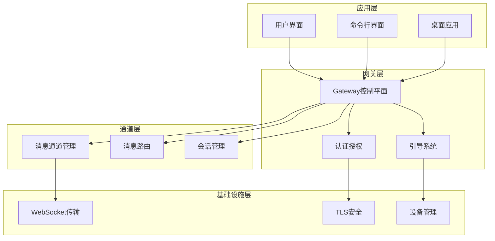
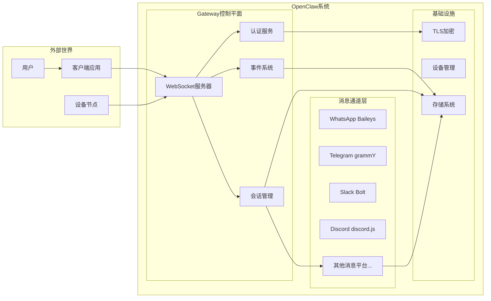
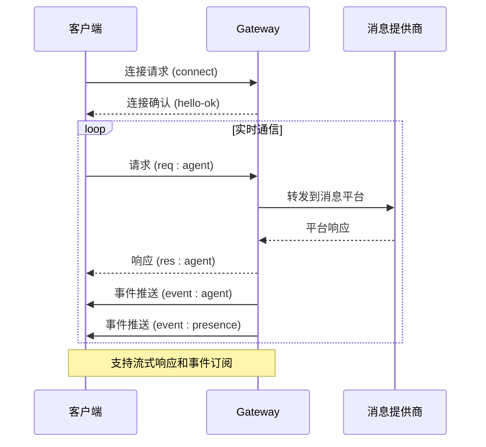
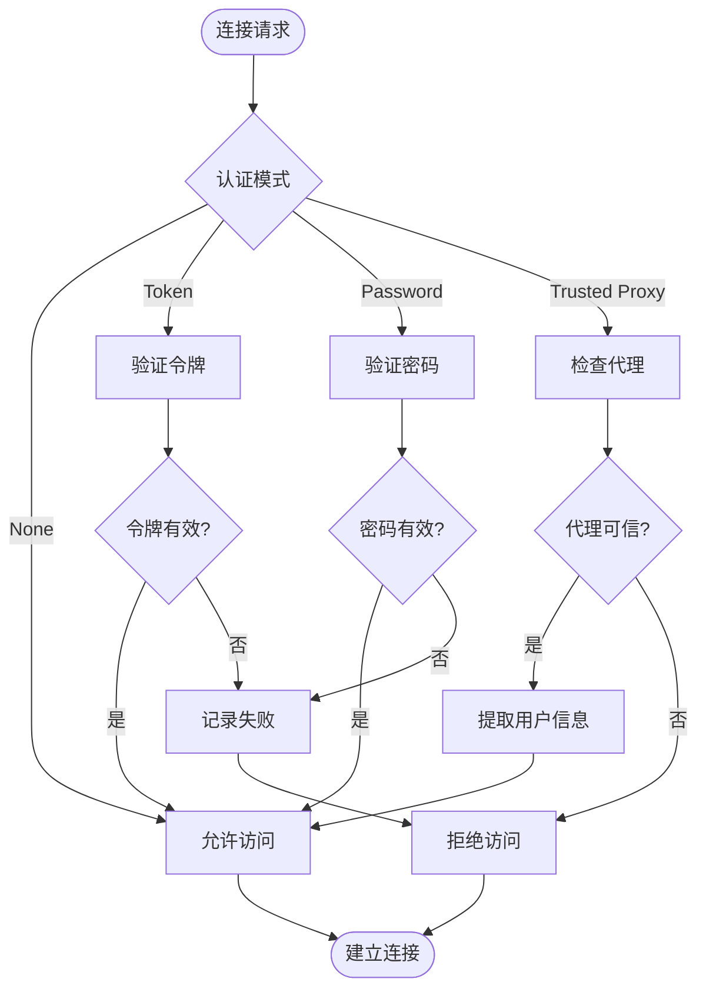
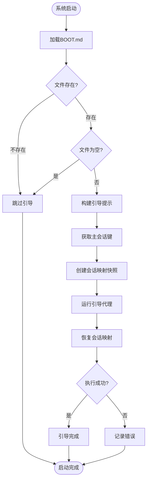
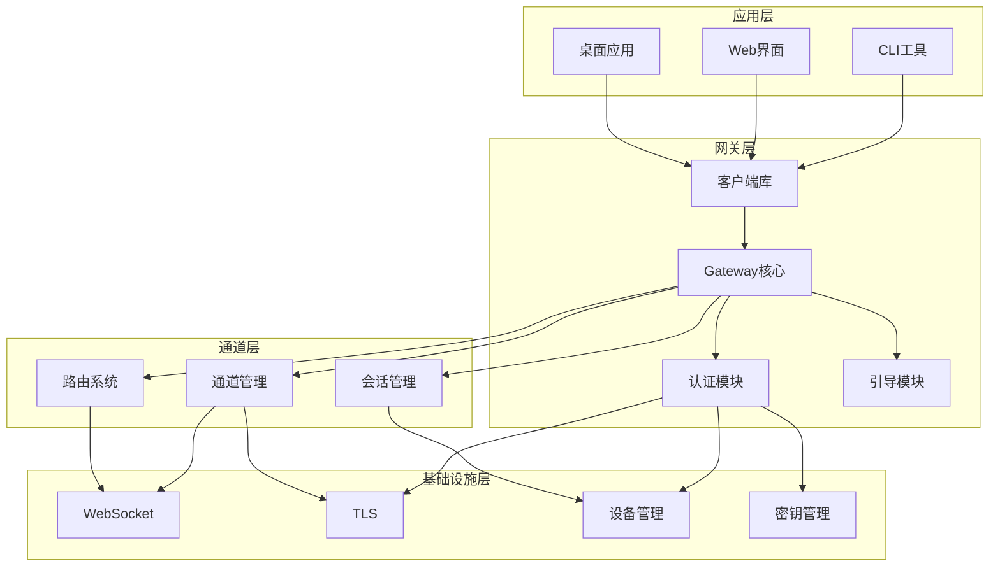

# 系统架构总览

<cite>
**本文档引用的文件**
- [README.md](file://README.md)
- [VISION.md](file://VISION.md)
- [architecture.md](file://docs/concepts/architecture.md)
- [boot.ts](file://src/gateway/boot.ts)
- [auth.ts](file://src/gateway/auth.ts)
- [call.ts](file://src/gateway/call.ts)
- [ws.ts](file://src/infra/ws.ts)
</cite>

## 目录

1. [引言](#引言)
2. [项目结构](#项目结构)
3. [核心组件](#核心组件)
4. [架构总览](#架构总览)
5. [详细组件分析](#详细组件分析)
6. [依赖关系分析](#依赖关系分析)
7. [性能考虑](#性能考虑)
8. [故障排除指南](#故障排除指南)
9. [结论](#结论)

## 引言

OpenClaw是一个个人AI助手系统，采用"单一网关多通道"的架构设计，通过一个统一的WebSocket控制平面管理40+个消息平台的连接。该系统的核心设计理念是：

- **单一网关控制平面**：所有消息渠道通过一个中心化的Gateway进行统一管理
- **WebSocket控制平面**：为客户端、工具和事件提供统一的通信协议
- **多通道路由机制**：支持WhatsApp、Telegram、Slack、Discord、Google Chat、Signal、iMessage等多种消息平台
- **分层架构设计**：清晰的组件边界和职责划分

系统通过单网关架构实现了对多消息平台的统一管理，既带来了集中控制的优势，也面临着扩展性和复杂性管理的挑战。

## 项目结构

OpenClaw项目采用模块化设计，主要分为以下几个核心层次：

**图表来源**

- [architecture.md:12-26](file://docs/concepts/architecture.md#L12-L26)
- [README.md:144-154](file://README.md#L144-L154)

**章节来源**

- [README.md:144-154](file://README.md#L144-L154)
- [architecture.md:12-26](file://docs/concepts/architecture.md#L12-L26)

## 核心组件

### 网关控制平面 (Gateway Control Plane)

Gateway作为系统的核心控制节点，负责以下关键功能：

- **单一网关管理**：维护所有消息提供商的连接
- **类型化WS API**：提供请求、响应、服务器推送事件的统一接口
- **事件发布**：发布agent、chat、presence、health、heartbeat、cron等事件
- **协议验证**：基于JSON Schema验证入站帧

### 认证授权系统 (Authentication & Authorization)

系统提供了多层次的安全保障：

- **多种认证模式**：token、password、trusted-proxy、none模式
- **速率限制**：防止暴力破解和滥用
- **Tailscale集成**：支持基于Tailscale的身份验证
- **设备配对**：基于设备身份的本地信任机制

### 引导系统 (Boot System)

Boot系统确保系统启动时的正确配置和状态恢复：

- **启动检查**：执行BOOT.md中的指令
- **会话映射快照**：保存和恢复主会话状态
- **错误处理**：优雅处理启动失败情况

**章节来源**

- [architecture.md:29-47](file://docs/concepts/architecture.md#L29-L47)
- [auth.ts:23-49](file://src/gateway/auth.ts#L23-L49)
- [boot.ts:37-54](file://src/gateway/boot.ts#L37-L54)

## 架构总览

OpenClaw采用"单一网关多通道"的架构模式，通过一个中心化的Gateway控制平面统一管理所有消息渠道：

**图表来源**

- [architecture.md:14-25](file://docs/concepts/architecture.md#L14-L25)
- [README.md:128-130](file://README.md#L128-L130)

### 单一网关架构的优势

1. **统一管理**：所有消息渠道通过单一入口点管理，简化了运维复杂度
2. **资源共享**：可以共享连接池、缓存和其他系统资源
3. **一致性保证**：统一的认证、授权和安全策略
4. **监控便利**：集中的日志记录和性能监控
5. **扩展性**：便于添加新的消息平台和功能

### 单一网关架构的挑战

1. **单点故障风险**：Gateway故障会影响所有消息渠道
2. **性能瓶颈**：高并发场景下可能成为性能瓶颈
3. **复杂性管理**：需要处理40+个不同消息平台的差异
4. **扩展难度**：随着平台数量增加，系统复杂度呈指数级增长
5. **故障隔离**：某个消息平台的问题可能影响整个系统

**章节来源**

- [architecture.md:14-25](file://docs/concepts/architecture.md#L14-L25)
- [README.md:128-130](file://README.md#L128-L130)

## 详细组件分析

### WebSocket控制平面

WebSocket是OpenClaw系统的核心通信协议，提供了实时双向通信能力：

**图表来源**

- [architecture.md:61-78](file://docs/concepts/architecture.md#L61-L78)

#### 协议特性

- **文本帧传输**：使用JSON负载的WebSocket文本帧
- **强制握手**：第一个帧必须是connect请求
- **请求-响应模式**：标准的请求-响应交互
- **事件推送**：服务器向客户端推送实时事件
- **幂等键支持**：为有副作用的方法提供重试保护

### 认证与授权机制

系统提供了灵活的认证方案，适应不同的部署场景：

**图表来源**

- [auth.ts:378-485](file://src/gateway/auth.ts#L378-L485)

#### 多层次安全策略

1. **本地直接访问**：回环地址的本地访问通常自动批准
2. **设备配对**：新设备需要手动配对批准
3. **速率限制**：防止暴力破解攻击
4. **Tailscale集成**：支持基于Tailscale的身份验证
5. **可信代理**：支持通过可信代理进行身份验证

**章节来源**

- [auth.ts:378-485](file://src/gateway/auth.ts#L378-L485)
- [architecture.md:93-109](file://docs/concepts/architecture.md#L93-L109)

### 引导系统 (Boot System)

Boot系统确保系统在启动时能够正确恢复状态和执行必要的初始化任务：

**图表来源**

- [boot.ts:138-203](file://src/gateway/boot.ts#L138-L203)

#### 关键特性

- **状态恢复**：自动恢复之前的会话状态
- **错误隔离**：引导过程中的错误不会影响系统正常运行
- **原子操作**：确保会话映射的完整性和一致性
- **静默回复**：支持无输出的静默引导模式

**章节来源**

- [boot.ts:138-203](file://src/gateway/boot.ts#L138-L203)

## 依赖关系分析

OpenClaw系统的组件间依赖关系体现了清晰的分层架构：

**图表来源**

- [call.ts:38-82](file://src/gateway/call.ts#L38-L82)
- [auth.ts:1-22](file://src/gateway/auth.ts#L1-L22)

### 组件耦合度分析

- **低耦合高内聚**：各模块职责明确，内部实现细节封装良好
- **向上依赖**：底层模块不依赖上层模块
- **向下依赖**：上层模块依赖底层模块提供的抽象接口
- **横向依赖**：相邻层级之间保持最小必要依赖

### 外部依赖管理

系统对外部依赖采取了严格的管理策略：

- **WebSocket库**：使用标准ws库处理WebSocket通信
- **TLS库**：集成Node.js内置TLS功能
- **设备管理**：通过设备标识符管理客户端连接
- **密钥管理**：支持环境变量和配置文件两种密钥存储方式

**章节来源**

- [call.ts:38-82](file://src/gateway/call.ts#L38-L82)
- [auth.ts:1-22](file://src/gateway/auth.ts#L1-L22)

## 性能考虑

### 连接管理优化

OpenClaw在连接管理方面采用了多项优化策略：

- **连接复用**：多个客户端共享底层的WebSocket连接
- **心跳检测**：定期发送心跳包维持连接活跃
- **超时处理**：合理的超时设置避免资源泄露
- **流量控制**：支持背压机制防止消息洪泛

### 内存管理策略

- **会话状态压缩**：定期清理不活跃的会话状态
- **事件流控**：对高频事件进行限速处理
- **缓存策略**：合理设置缓存大小和过期时间
- **垃圾回收**：及时释放不再使用的对象引用

### 扩展性设计

- **水平扩展**：支持多实例部署和负载均衡
- **垂直扩展**：通过增加资源提升单实例性能
- **异步处理**：大量使用Promise和async/await减少阻塞
- **事件驱动**：基于事件的异步架构提高响应性

## 故障排除指南

### 常见问题诊断

#### 连接问题

1. **连接被拒绝**：检查认证配置和防火墙设置
2. **连接超时**：验证网络连通性和端口开放情况
3. **握手失败**：确认第一个帧是否为connect请求
4. **认证失败**：检查令牌或密码配置

#### 性能问题

1. **响应缓慢**：检查系统资源使用情况
2. **内存泄漏**：监控内存使用趋势
3. **连接数过多**：检查客户端连接管理和清理机制
4. **事件丢失**：确认事件订阅和处理逻辑

### 调试工具

系统提供了丰富的调试和诊断工具：

- **健康检查**：通过health方法检查系统状态
- **日志记录**：详细的日志输出帮助问题定位
- **性能监控**：内置性能指标收集和报告
- **配置验证**：自动验证配置文件的有效性

**章节来源**

- [architecture.md:129-134](file://docs/concepts/architecture.md#L129-L134)

## 结论

OpenClaw的"单一网关多通道"架构设计在提供统一管理优势的同时，也面临着扩展性和复杂性管理的挑战。该架构的核心价值在于：

1. **简化运维**：通过单一入口点管理复杂的多平台生态系统
2. **增强安全性**：统一的安全策略和访问控制机制
3. **提升可靠性**：集中化的监控和故障处理能力
4. **促进创新**：标准化的接口为新功能开发提供基础

未来的发展方向应该重点关注：

- **微服务化改造**：将某些功能模块拆分为独立的服务
- **容器化部署**：利用Docker和Kubernetes提升可扩展性
- **云原生架构**：充分利用云平台的弹性伸缩能力
- **AI能力集成**：深度整合大模型和智能算法

通过持续的架构演进和技术优化，OpenClaw有望在个人AI助手领域保持技术领先地位，为用户提供更加智能、便捷和安全的使用体验。
