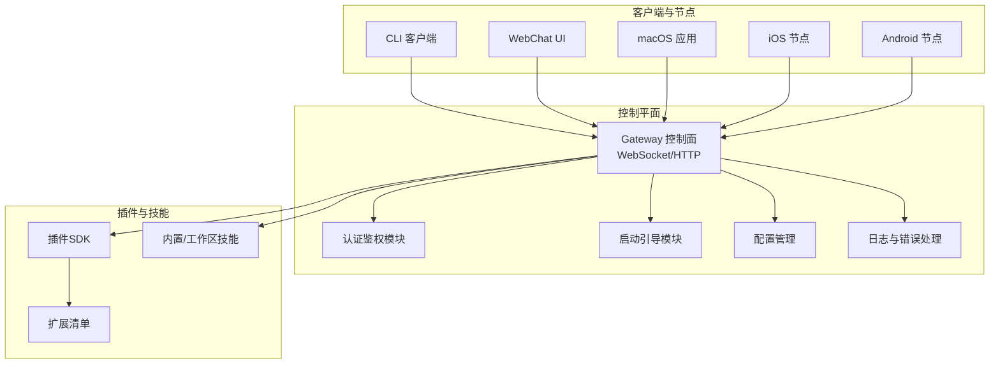
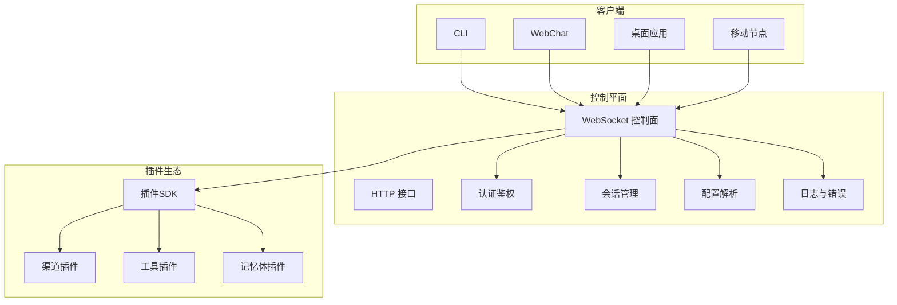
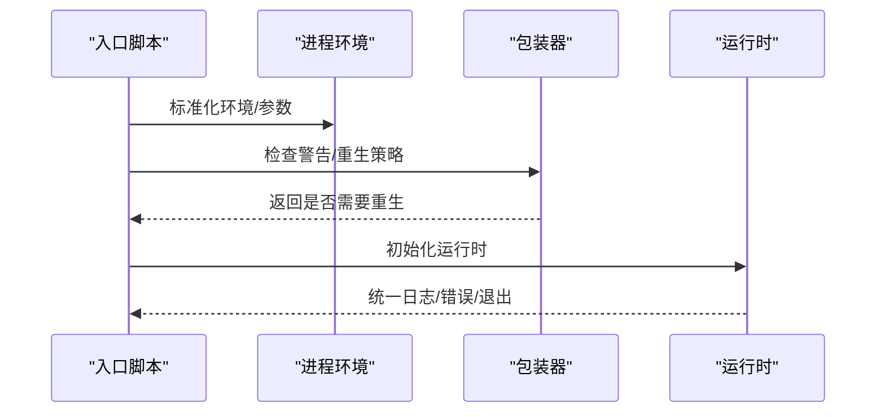
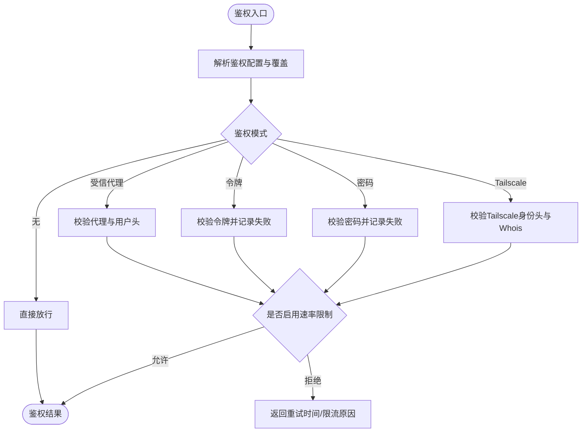
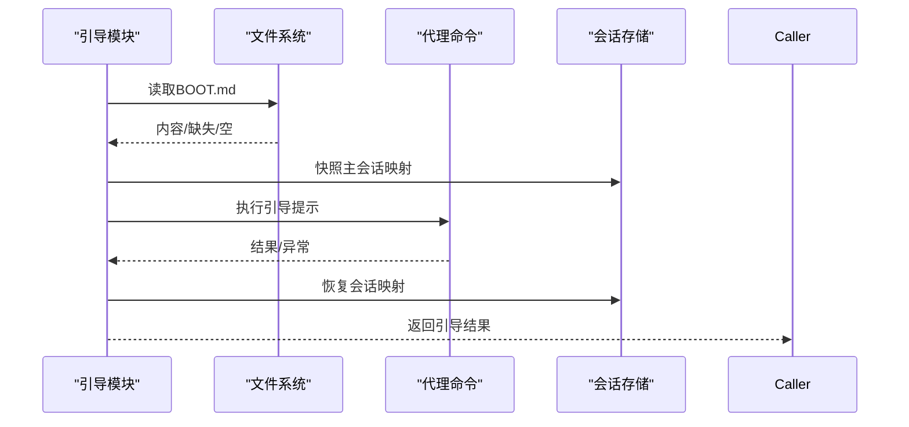
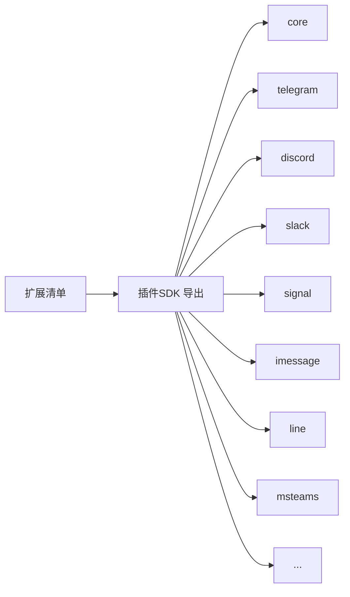
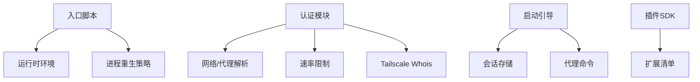

# 系统架构设计

<cite>
**本文档引用的文件**
- [README.md](file://README.md)
- [VISION.md](file://VISION.md)
- [package.json](file://package.json)
- [src/index.ts](file://src/index.ts)
- [src/entry.ts](file://src/entry.ts)
- [src/runtime.ts](file://src/runtime.ts)
- [src/gateway/boot.ts](file://src/gateway/boot.ts)
- [src/gateway/auth.ts](file://src/gateway/auth.ts)
</cite>

## 目录

1. [引言](#引言)
2. [项目结构](#项目结构)
3. [核心组件](#核心组件)
4. [架构总览](#架构总览)
5. [详细组件分析](#详细组件分析)
6. [依赖分析](#依赖分析)
7. [性能考虑](#性能考虑)
8. [故障排除指南](#故障排除指南)
9. [结论](#结论)

## 引言

本文件面向OpenClaw系统架构设计，聚焦其微服务架构、事件驱动架构与插件化架构的设计理念，阐释高层设计原则、组件边界划分与模块化组织方式，并说明运行时环境抽象、统一入口点设计与配置管理系统的职责与协作机制。文档旨在帮助开发者与运维人员快速理解OpenClaw的控制平面（Gateway）如何通过WebSocket控制通道统一调度多客户端、工具与事件，以及如何通过插件生态扩展能力。

## 项目结构

OpenClaw采用以“控制平面（Gateway）+ 多客户端 + 插件生态”为核心的分层组织方式：

- 控制平面：Gateway作为统一的控制与编排中心，提供WebSocket控制面、HTTP接口、会话与权限管理、自动化与诊断等能力。
- 客户端与节点：CLI、WebChat、桌面应用、移动端节点通过WebSocket或HTTP接入Gateway。
- 插件与技能：通过插件SDK与扩展清单实现渠道、工具、记忆体等能力的可插拔扩展。
- 配置与运行时：集中式配置解析、运行时环境抽象、日志与错误处理贯穿全栈。

图表来源

- [src/gateway/auth.ts:1-504](file://src/gateway/auth.ts#L1-L504)
- [src/gateway/boot.ts:1-204](file://src/gateway/boot.ts#L1-L204)
- [src/index.ts:1-94](file://src/index.ts#L1-L94)
- [src/entry.ts:1-195](file://src/entry.ts#L1-L195)
- [package.json:1-465](file://package.json#L1-L465)

章节来源

- [README.md:185-239](file://README.md#L185-L239)
- [package.json:16-33](file://package.json#L16-L33)

## 核心组件

- 统一入口点与运行时
  - 入口脚本与守护进程：通过入口包装器与进程重生策略确保稳定启动与实验性警告抑制。
  - 运行时环境抽象：提供统一的日志、错误输出与退出行为，支持测试场景下的非退出运行时。
- 控制平面（Gateway）
  - 认证与鉴权：支持多种鉴权模式（无、令牌、密码、受信代理、Tailscale），并集成速率限制与代理头校验。
  - 启动引导：读取工作区BOOT.md并以代理命令执行引导任务，保证首次运行一致性。
  - 配置管理：集中解析配置、会话存储路径与主会话键，支撑多代理路由与隔离。
- 插件与扩展
  - 插件SDK导出：按渠道与功能维度导出插件SDK命名空间，便于扩展开发与类型安全。
  - 扩展清单：通过openclaw.plugin.json声明扩展元数据，实现本地开发与npm分发的双路径。

章节来源

- [src/entry.ts:1-195](file://src/entry.ts#L1-L195)
- [src/runtime.ts:1-54](file://src/runtime.ts#L1-L54)
- [src/gateway/auth.ts:1-504](file://src/gateway/auth.ts#L1-L504)
- [src/gateway/boot.ts:1-204](file://src/gateway/boot.ts#L1-L204)
- [package.json:37-216](file://package.json#L37-L216)

## 架构总览

OpenClaw采用“控制平面（Gateway）+ 多客户端 + 插件生态”的微服务化架构，配合事件驱动与插件化扩展，形成高内聚、低耦合的系统：

- 微服务化：Gateway作为单一控制平面，承载会话、通道、工具、事件与运维能力；客户端与节点通过统一协议接入。
- 事件驱动：通过WebSocket控制通道与HTTP接口，实现消息路由、状态变更、自动化触发与远程控制。
- 插件化：通过插件SDK与扩展清单，将渠道、工具、记忆体等能力以插件形式注入，保持核心轻量化。

图表来源

- [README.md:185-239](file://README.md#L185-L239)
- [src/gateway/auth.ts:217-292](file://src/gateway/auth.ts#L217-L292)
- [src/gateway/boot.ts:138-203](file://src/gateway/boot.ts#L138-L203)
- [package.json:37-216](file://package.json#L37-L216)

## 详细组件分析

### 组件A：统一入口点与运行时环境抽象

- 入口包装与进程重生
  - 入口脚本负责环境标准化、编译缓存启用、实验性警告抑制与参数归一化。
  - 在未满足条件时进行进程重生，确保启动稳定性与一致的运行环境。
- 运行时环境抽象
  - 提供统一的日志与错误输出接口，支持在测试中使用非退出运行时，避免进程提前退出影响测试。
  - 退出时恢复终端状态，保证用户体验与调试便利性。

图表来源

- [src/entry.ts:16-126](file://src/entry.ts#L16-L126)
- [src/runtime.ts:21-53](file://src/runtime.ts#L21-L53)

章节来源

- [src/entry.ts:1-195](file://src/entry.ts#L1-L195)
- [src/runtime.ts:1-54](file://src/runtime.ts#L1-L54)

### 组件B：认证与鉴权（事件驱动与安全边界）

- 鉴权模式与来源
  - 支持无、令牌、密码、受信代理与Tailscale五种模式，优先级与来源可配置与覆盖。
  - 受信代理模式要求代理头与用户白名单校验，Tailscale模式通过反向代理身份头与Whois校验。
- 速率限制与请求追踪
  - 基于客户端IP的速率限制，支持共享密钥作用域与失败记录，防止暴力破解。
  - 请求IP解析支持X-Forwarded-For、X-Real-IP与受信代理列表，增强跨代理部署的安全性。
- 本地直连判定
  - 通过主机头与代理转发信息判断本地直连，用于区分不同鉴权表面（HTTP/WS控制UI）的行为差异。

图表来源

- [src/gateway/auth.ts:217-292](file://src/gateway/auth.ts#L217-L292)
- [src/gateway/auth.ts:378-485](file://src/gateway/auth.ts#L378-L485)

章节来源

- [src/gateway/auth.ts:1-504](file://src/gateway/auth.ts#L1-L504)

### 组件C：启动引导（事件驱动的自检与修复）

- 引导文件加载
  - 从工作区根目录读取BOOT.md，若缺失或为空则跳过引导流程。
- 会话映射快照与恢复
  - 在引导前对主会话映射进行快照，引导后尝试恢复，确保状态一致性。
- 引导执行与失败聚合
  - 使用代理命令执行引导提示，捕获代理运行与映射恢复的失败原因并汇总返回。

图表来源

- [src/gateway/boot.ts:56-136](file://src/gateway/boot.ts#L56-L136)
- [src/gateway/boot.ts:138-203](file://src/gateway/boot.ts#L138-L203)

章节来源

- [src/gateway/boot.ts:1-204](file://src/gateway/boot.ts#L1-L204)

### 组件D：插件SDK与扩展清单（插件化架构）

- 插件SDK导出
  - 通过包导出字段为各渠道与功能提供独立的插件SDK命名空间，便于按需引入与类型推断。
- 扩展清单
  - 扩展通过openclaw.plugin.json声明元数据，支持本地开发与npm分发两种路径，降低集成成本。

图表来源

- [package.json:37-216](file://package.json#L37-L216)

章节来源

- [package.json:1-465](file://package.json#L1-L465)

## 依赖分析

- 运行时与入口
  - 入口脚本依赖运行时环境抽象与进程重生策略，确保启动稳定性与一致的运行环境。
- 控制平面
  - 认证模块依赖网络与代理解析、速率限制与Tailscale Whois能力，形成安全边界。
  - 启动引导模块依赖会话存储与代理命令，保障首次运行一致性。
- 插件生态
  - 插件SDK导出与扩展清单共同构成插件化能力的契约，降低核心与扩展的耦合度。

图表来源

- [src/entry.ts:16-126](file://src/entry.ts#L16-L126)
- [src/runtime.ts:21-53](file://src/runtime.ts#L21-L53)
- [src/gateway/auth.ts:108-123](file://src/gateway/auth.ts#L108-L123)
- [src/gateway/boot.ts:114-136](file://src/gateway/boot.ts#L114-L136)
- [package.json:37-216](file://package.json#L37-L216)

章节来源

- [src/entry.ts:1-195](file://src/entry.ts#L1-L195)
- [src/runtime.ts:1-54](file://src/runtime.ts#L1-L54)
- [src/gateway/auth.ts:1-504](file://src/gateway/auth.ts#L1-L504)
- [src/gateway/boot.ts:1-204](file://src/gateway/boot.ts#L1-L204)
- [package.json:1-465](file://package.json#L1-L465)

## 性能考虑

- 启动与缓存
  - 启用编译缓存与参数归一化，减少重复启动开销，提升冷启动性能。
- 日志与错误处理
  - 结构化日志与进度线清理，避免频繁刷新导致的UI抖动，提升终端交互体验。
- 速率限制与鉴权
  - 基于IP的速率限制与失败记录，有效缓解暴力破解风险，同时避免对合法请求造成过度影响。

## 故障排除指南

- 启动失败
  - 检查运行时版本与环境变量标准化，确认入口脚本的重生策略是否生效。
- 鉴权失败
  - 核对鉴权模式配置与来源，检查令牌/密码/Tailscale代理头与受信代理列表。
  - 若被限流，等待重试时间或调整速率限制策略。
- 引导失败
  - 检查BOOT.md是否存在且内容非空，确认会话存储路径与主会话键解析正确。

章节来源

- [src/entry.ts:168-194](file://src/entry.ts#L168-L194)
- [src/gateway/auth.ts:294-329](file://src/gateway/auth.ts#L294-L329)
- [src/gateway/boot.ts:158-203](file://src/gateway/boot.ts#L158-L203)

## 结论

OpenClaw通过“控制平面 + 多客户端 + 插件生态”的微服务化架构，结合事件驱动与插件化扩展，实现了高内聚、低耦合与强安全边界的系统设计。统一入口点与运行时环境抽象确保了启动稳定性与一致的运行体验；认证与鉴权模块提供了灵活的安全策略；启动引导模块保障了首次运行的一致性；插件SDK与扩展清单则为能力扩展提供了清晰的契约与低耦合路径。该架构既满足了个人用户的易用性需求，也为多平台、多渠道与多代理场景提供了可演进的扩展基础。
