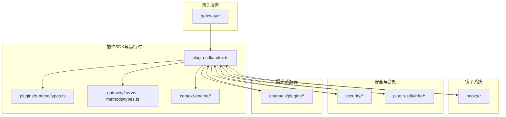
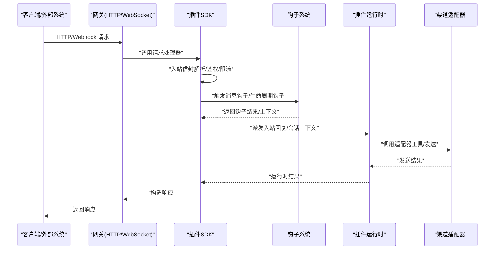
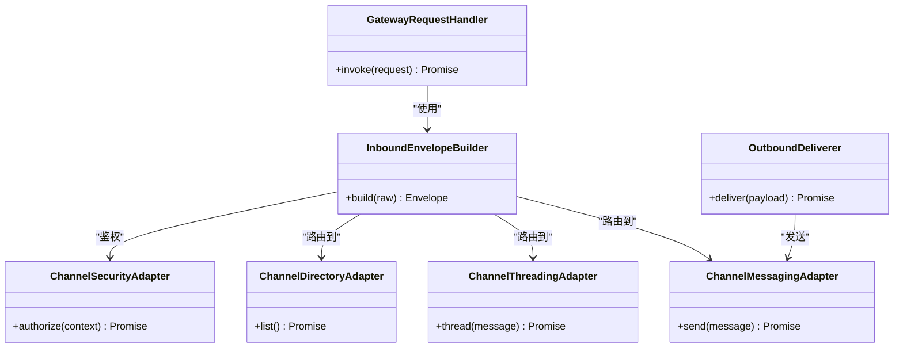
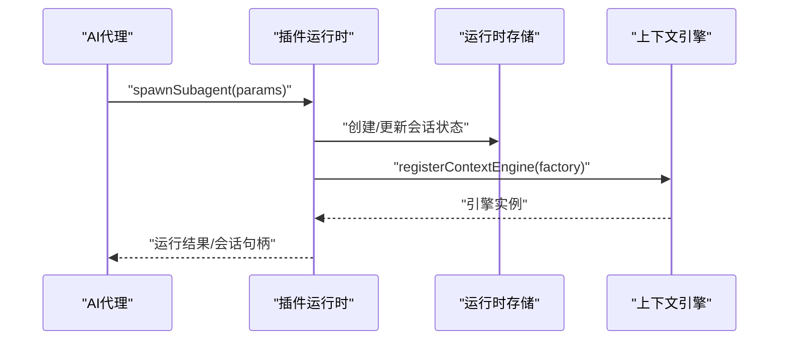
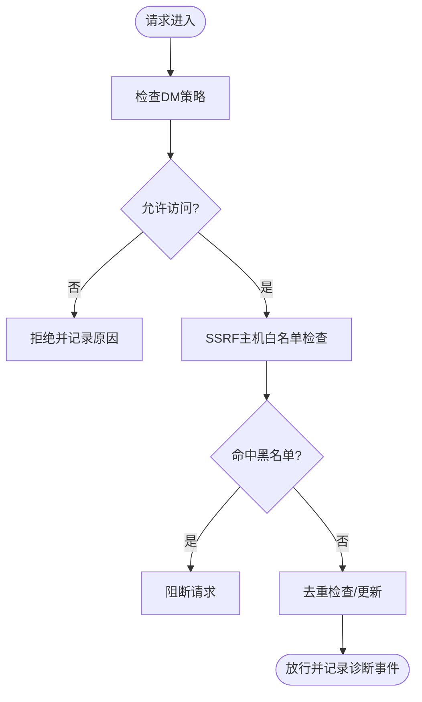
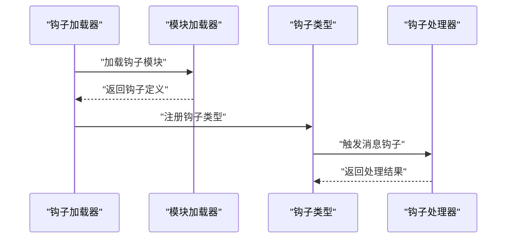
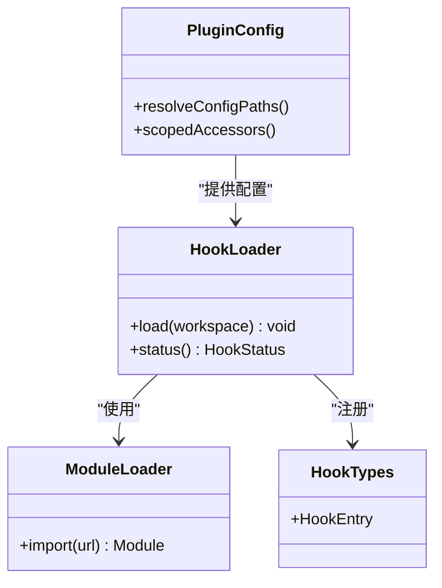
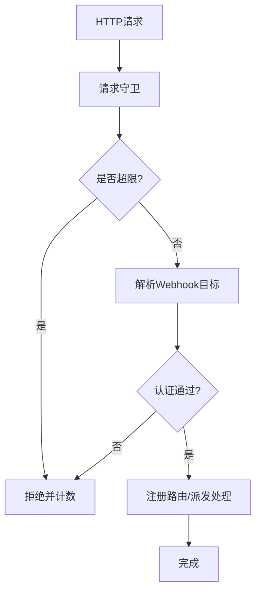
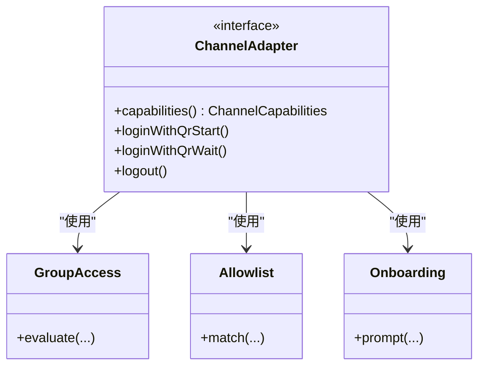
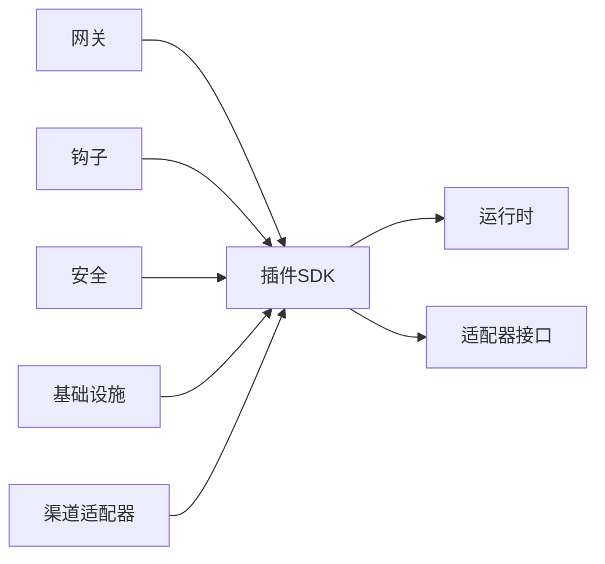

# 组件交互与集成

<cite>
**本文引用的文件**
- [src/plugin-sdk/index.ts](file://src/plugin-sdk/index.ts)
- [src/gateway/server-methods/types.ts](file://src/gateway/server-methods/types.ts)
- [src/plugins/runtime/types.ts](file://src/plugins/runtime/types.ts)
- [src/hooks/loader.ts](file://src/hooks/loader.ts)
- [src/hooks/module-loader.ts](file://src/hooks/module-loader.ts)
- [src/hooks/types.ts](file://src/hooks/types.ts)
- [src/security/dm-policy-shared.ts](file://src/security/dm-policy-shared.ts)
- [src/channels/plugins/types.ts](file://src/channels/plugins/types.ts)
- [src/channels/plugins/types.plugin.ts](file://src/channels/plugins/types.plugin.ts)
- [src/acp/runtime/types.ts](file://src/acp/runtime/types.ts)
- [src/acp/runtime/registry.ts](file://src/acp/runtime/registry.ts)
- [src/plugins/types.ts](file://src/plugins/types.ts)
- [src/plugin-sdk/webhook-targets.ts](file://src/plugin-sdk/webhook-targets.ts)
- [src/plugin-sdk/webhook-request-guards.ts](file://src/plugin-sdk/webhook-request-guards.ts)
- [src/plugin-sdk/inbound-envelope.ts](file://src/plugin-sdk/inbound-envelope.ts)
- [src/plugin-sdk/inbound-reply-dispatch.ts](file://src/plugin-sdk/inbound-reply-dispatch.ts)
- [src/plugin-sdk/reply-payload.ts](file://src/plugin-sdk/reply-payload.ts)
- [src/plugin-sdk/status-helpers.ts](file://src/plugin-sdk/status-helpers.ts)
- [src/plugin-sdk/runtime-store.ts](file://src/plugin-sdk/runtime-store.ts)
- [src/plugin-sdk/runtime.ts](file://src/plugin-sdk/runtime.ts)
- [src/plugin-sdk/keyed-async-queue.ts](file://src/plugin-sdk/keyed-async-queue.ts)
- [src/plugin-sdk/allowlist-resolution.ts](file://src/plugin-sdk/allowlist-resolution.ts)
- [src/plugin-sdk/group-access.ts](file://src/plugin-sdk/group-access.ts)
- [src/plugin-sdk/command-auth.ts](file://src/plugin-sdk/command-auth.ts)
- [src/plugin-sdk/config-paths.ts](file://src/plugin-sdk/config-paths.ts)
- [src/plugin-sdk/channel-config-helpers.ts](file://src/plugin-sdk/channel-config-helpers.ts)
- [src/plugin-sdk/group-policy-warnings.ts](file://src/plugin-sdk/group-policy-warnings.ts)
- [src/plugin-sdk/helpers.ts](file://src/plugin-sdk/helpers.ts)
- [src/plugin-sdk/onboarding/helpers.ts](file://src/plugin-sdk/onboarding/helpers.ts)
- [src/plugin-sdk/onboarding-types.ts](file://src/plugin-sdk/onboarding-types.ts)
- [src/plugin-sdk/text-chunking.ts](file://src/plugin-sdk/text-chunking.ts)
- [src/plugin-sdk/windows-spawn.ts](file://src/plugin-sdk/windows-spawn.ts)
- [src/plugin-sdk/run-command.ts](file://src/plugin-sdk/run-command.ts)
- [src/plugin-sdk/shared/gateway-bind-url.ts](file://src/plugin-sdk/shared/gateway-bind-url.ts)
- [src/plugin-sdk/shared/tailscale-status.ts](file://src/plugin-sdk/shared/tailscale-status.ts)
- [src/plugin-sdk/infra/http-body.ts](file://src/plugin-sdk/infra/http-body.ts)
- [src/plugin-sdk/infra/net/ssrf.ts](file://src/plugin-sdk/infra/net/ssrf.ts)
- [src/plugin-sdk/infra/net/fetch-guard.ts](file://src/plugin-sdk/infra/net/fetch-guard.ts)
- [src/plugin-sdk/infra/net/ssrf-policy.ts](file://src/plugin-sdk/infra/net/ssrf-policy.ts)
- [src/plugin-sdk/infra/dedup.ts](file://src/plugin-sdk/infra/dedup.ts)
- [src/plugin-sdk/infra/diagnostic-events.ts](file://src/plugin-sdk/infra/diagnostic-events.ts)
- [src/plugin-sdk/infra/errors.ts](file://src/plugin-sdk/infra/errors.ts)
- [src/plugin-sdk/infra/env.ts](file://src/plugin-sdk/infra/env.ts)
- [src/plugin-sdk/infra/ws.ts](file://src/plugin-sdk/infra/ws.ts)
- [src/plugin-sdk/media/mime.ts](file://src/plugin-sdk/media/mime.ts)
- [src/plugin-sdk/media/store.ts](file://src/plugin-sdk/media/store.ts)
- [src/plugin-sdk/context-engine/types.ts](file://src/plugin-sdk/context-engine/types.ts)
- [src/plugin-sdk/context-engine/registry.ts](file://src/plugin-sdk/context-engine/registry.ts)
- [src/plugin-sdk/agents/model-auth.ts](file://src/plugin-sdk/agents/model-auth.ts)
- [src/plugin-sdk/logging/redact.ts](file://src/plugin-sdk/logging/redact.ts)
</cite>

## 目录

1. [引言](#引言)
2. [项目结构](#项目结构)
3. [核心组件](#核心组件)
4. [架构总览](#架构总览)
5. [详细组件分析](#详细组件分析)
6. [依赖分析](#依赖分析)
7. [性能考量](#性能考量)
8. [故障排查指南](#故障排查指南)
9. [结论](#结论)
10. [附录](#附录)

## 引言

本技术文档聚焦于OpenClaw的组件交互与集成机制，围绕以下主题展开：网关控制平面与通道适配器的交互、AI代理与插件系统的集成、安全层的统一接入；阐述事件驱动的消息传递机制、钩子系统的扩展点与插件加载机制；并提供组件交互图、接口契约与集成示例，帮助读者实现松耦合的模块化设计。

## 项目结构

OpenClaw采用多模块分层组织，核心能力分布如下：

- 插件SDK与运行时：提供插件开发、运行时、消息路由、安全策略、上下文引擎等通用能力
- 网关服务：负责HTTP/WebSocket请求处理、方法路由与安全校验
- 钩子系统：事件驱动的扩展点，支持消息钩子、生命周期钩子等
- 安全与合规：统一的DM策略、SSRF防护、去重与诊断事件
- 渠道适配器：面向不同IM平台（Discord、Slack、Telegram、Signal、WhatsApp等）的适配逻辑

**图表来源**

- [src/plugin-sdk/index.ts:1-826](file://src/plugin-sdk/index.ts#L1-L826)
- [src/gateway/server-methods/types.ts](file://src/gateway/server-methods/types.ts)
- [src/plugins/runtime/types.ts](file://src/plugins/runtime/types.ts)
- [src/hooks/loader.ts](file://src/hooks/loader.ts)
- [src/hooks/module-loader.ts](file://src/hooks/module-loader.ts)
- [src/security/dm-policy-shared.ts](file://src/security/dm-policy-shared.ts)
- [src/channels/plugins/types.ts](file://src/channels/plugins/types.ts)

**章节来源**

- [src/plugin-sdk/index.ts:1-826](file://src/plugin-sdk/index.ts#L1-L826)

## 核心组件

- 插件SDK与运行时：统一导出插件API、运行时类型、队列与Webhook处理、状态构建、配置路径与解析工具等
- 网关控制平面：定义请求处理器、响应函数、绑定URL解析等
- 钩子系统：加载器、模块加载器、钩子类型与消息映射
- 安全层：DM策略、SSRF防护、去重缓存、诊断事件
- 渠道适配器：适配器类型、认证/消息/线程/目录等接口契约

**章节来源**

- [src/plugin-sdk/index.ts:1-826](file://src/plugin-sdk/index.ts#L1-L826)
- [src/gateway/server-methods/types.ts](file://src/gateway/server-methods/types.ts)
- [src/hooks/types.ts](file://src/hooks/types.ts)
- [src/security/dm-policy-shared.ts](file://src/security/dm-policy-shared.ts)
- [src/channels/plugins/types.ts](file://src/channels/plugins/types.ts)

## 架构总览

OpenClaw通过“插件SDK”作为统一抽象层，向上承载网关、钩子、安全与渠道适配器，向下对接具体平台与运行环境。消息从网关进入，经由插件SDK的入站信封、路由与派发，再由插件运行时执行工具或回调，最终回写到渠道适配器完成发送。

**图表来源**

- [src/gateway/server-methods/types.ts](file://src/gateway/server-methods/types.ts)
- [src/plugin-sdk/inbound-envelope.ts](file://src/plugin-sdk/inbound-envelope.ts)
- [src/plugin-sdk/inbound-reply-dispatch.ts](file://src/plugin-sdk/inbound-reply-dispatch.ts)
- [src/plugin-sdk/webhook-targets.ts](file://src/plugin-sdk/webhook-targets.ts)
- [src/plugin-sdk/webhook-request-guards.ts](file://src/plugin-sdk/webhook-request-guards.ts)
- [src/plugins/runtime/types.ts](file://src/plugins/runtime/types.ts)
- [src/channels/plugins/types.ts](file://src/channels/plugins/types.ts)

## 详细组件分析

### 网关控制平面与通道适配器交互

- 网关请求处理器：定义请求处理函数与选项，用于HTTP/Webhook入口
- 入站信封与路由：解析入站消息、构建路由上下文，支持会话键解析与线程绑定
- 出站派发：标准化出站负载、分片文本、媒体处理与附件链接格式化
- 渠道适配器契约：消息、线程、目录、心跳、安全等适配器接口类型

**图表来源**

- [src/gateway/server-methods/types.ts](file://src/gateway/server-methods/types.ts)
- [src/plugin-sdk/inbound-envelope.ts](file://src/plugin-sdk/inbound-envelope.ts)
- [src/plugin-sdk/reply-payload.ts](file://src/plugin-sdk/reply-payload.ts)
- [src/channels/plugins/types.ts](file://src/channels/plugins/types.ts)

**章节来源**

- [src/gateway/server-methods/types.ts](file://src/gateway/server-methods/types.ts)
- [src/plugin-sdk/inbound-envelope.ts](file://src/plugin-sdk/inbound-envelope.ts)
- [src/plugin-sdk/inbound-reply-dispatch.ts](file://src/plugin-sdk/inbound-reply-dispatch.ts)
- [src/plugin-sdk/reply-payload.ts](file://src/plugin-sdk/reply-payload.ts)
- [src/channels/plugins/types.ts](file://src/channels/plugins/types.ts)

### AI代理与插件系统的集成

- 插件运行时：提供子代理运行、会话查询、删除等运行时能力
- 运行时存储：插件运行时状态持久化与作用域管理
- 上下文引擎：注册上下文引擎工厂，支持子代理准备与上下文组装
- 模型认证：插件应使用运行时提供的模型认证能力，避免直接导入不安全的底层工具

**图表来源**

- [src/plugins/runtime/types.ts](file://src/plugins/runtime/types.ts)
- [src/plugin-sdk/runtime-store.ts](file://src/plugin-sdk/runtime-store.ts)
- [src/plugin-sdk/context-engine/registry.ts](file://src/plugin-sdk/context-engine/registry.ts)
- [src/plugin-sdk/context-engine/types.ts](file://src/plugin-sdk/context-engine/types.ts)
- [src/plugin-sdk/agents/model-auth.ts](file://src/plugin-sdk/agents/model-auth.ts)

**章节来源**

- [src/plugins/runtime/types.ts](file://src/plugins/runtime/types.ts)
- [src/plugin-sdk/runtime-store.ts](file://src/plugin-sdk/runtime-store.ts)
- [src/plugin-sdk/context-engine/registry.ts](file://src/plugin-sdk/context-engine/registry.ts)
- [src/plugin-sdk/context-engine/types.ts](file://src/plugin-sdk/context-engine/types.ts)
- [src/plugin-sdk/agents/model-auth.ts](file://src/plugin-sdk/agents/model-auth.ts)

### 安全层的统一接入

- DM策略：统一的私聊访问决策与原因码，支持多渠道策略解析
- SSRF防护：主机白名单策略、HTTPS限制、SSRF拦截错误
- 去重与诊断：内存去重缓存、持久化去重、诊断事件总线
- 错误与日志：统一错误格式化、敏感信息脱敏

**图表来源**

- [src/security/dm-policy-shared.ts](file://src/security/dm-policy-shared.ts)
- [src/plugin-sdk/infra/net/ssrf.ts](file://src/plugin-sdk/infra/net/ssrf.ts)
- [src/plugin-sdk/infra/net/ssrf-policy.ts](file://src/plugin-sdk/infra/net/ssrf-policy.ts)
- [src/plugin-sdk/infra/dedup.ts](file://src/plugin-sdk/infra/dedup.ts)
- [src/plugin-sdk/infra/diagnostic-events.ts](file://src/plugin-sdk/infra/diagnostic-events.ts)
- [src/plugin-sdk/logging/redact.ts](file://src/plugin-sdk/logging/redact.ts)

**章节来源**

- [src/security/dm-policy-shared.ts](file://src/security/dm-policy-shared.ts)
- [src/plugin-sdk/infra/net/ssrf.ts](file://src/plugin-sdk/infra/net/ssrf.ts)
- [src/plugin-sdk/infra/net/ssrf-policy.ts](file://src/plugin-sdk/infra/net/ssrf-policy.ts)
- [src/plugin-sdk/infra/dedup.ts](file://src/plugin-sdk/infra/dedup.ts)
- [src/plugin-sdk/infra/diagnostic-events.ts](file://src/plugin-sdk/infra/diagnostic-events.ts)
- [src/plugin-sdk/logging/redact.ts](file://src/plugin-sdk/logging/redact.ts)

### 事件驱动的消息传递机制

- 钩子系统：钩子加载器与模块加载器负责动态加载钩子模块，钩子类型定义了事件契约
- 消息钩子映射：将入站消息映射到钩子处理流程，支持异步与无抛出模式
- 生命周期钩子：启动、安装、卸载等生命周期事件

**图表来源**

- [src/hooks/loader.ts](file://src/hooks/loader.ts)
- [src/hooks/module-loader.ts](file://src/hooks/module-loader.ts)
- [src/hooks/types.ts](file://src/hooks/types.ts)

**章节来源**

- [src/hooks/loader.ts](file://src/hooks/loader.ts)
- [src/hooks/module-loader.ts](file://src/hooks/module-loader.ts)
- [src/hooks/types.ts](file://src/hooks/types.ts)

### 钩子系统的扩展点与插件加载机制

- 扩展点：消息钩子、生命周期钩子、命令钩子等
- 插件加载：通过钩子加载器与模块加载器实现插件的动态发现与加载
- 配置与路径：提供配置路径解析、作用域配置访问器与设置辅助

**图表来源**

- [src/hooks/loader.ts](file://src/hooks/loader.ts)
- [src/hooks/module-loader.ts](file://src/hooks/module-loader.ts)
- [src/hooks/types.ts](file://src/hooks/types.ts)
- [src/plugin-sdk/config-paths.ts](file://src/plugin-sdk/config-paths.ts)
- [src/plugin-sdk/channel-config-helpers.ts](file://src/plugin-sdk/channel-config-helpers.ts)

**章节来源**

- [src/hooks/loader.ts](file://src/hooks/loader.ts)
- [src/hooks/module-loader.ts](file://src/hooks/module-loader.ts)
- [src/hooks/types.ts](file://src/hooks/types.ts)
- [src/plugin-sdk/config-paths.ts](file://src/plugin-sdk/config-paths.ts)
- [src/plugin-sdk/channel-config-helpers.ts](file://src/plugin-sdk/channel-config-helpers.ts)

### Webhook与HTTP集成

- Webhook目标注册与解析：支持单个/多个目标解析、认证与同步/异步解析管线
- 请求守卫：JSON内容类型判断、请求体读取限制、并发飞行请求限制
- 路径规范化：HTTP路径规范化与Webhook路径解析

**图表来源**

- [src/plugin-sdk/webhook-targets.ts](file://src/plugin-sdk/webhook-targets.ts)
- [src/plugin-sdk/webhook-request-guards.ts](file://src/plugin-sdk/webhook-request-guards.ts)
- [src/plugin-sdk/index.ts:125-175](file://src/plugin-sdk/index.ts#L125-L175)

**章节来源**

- [src/plugin-sdk/webhook-targets.ts](file://src/plugin-sdk/webhook-targets.ts)
- [src/plugin-sdk/webhook-request-guards.ts](file://src/plugin-sdk/webhook-request-guards.ts)
- [src/plugin-sdk/index.ts:125-175](file://src/plugin-sdk/index.ts#L125-L175)

### 渠道适配器与策略集成

- 适配器类型：消息、线程、目录、心跳、安全、认证等适配器接口
- 策略解析：分组访问决策、发送者授权、提及要求、工具策略
- 允许列表与警告：允许列表匹配、分组策略警告收集
- 配置与引导：账户配置解析、引导输入提示、配对消息与提示

**图表来源**

- [src/channels/plugins/types.ts](file://src/channels/plugins/types.ts)
- [src/plugin-sdk/group-access.ts](file://src/plugin-sdk/group-access.ts)
- [src/plugin-sdk/allowlist-resolution.ts](file://src/plugin-sdk/allowlist-resolution.ts)
- [src/plugin-sdk/onboarding/helpers.ts](file://src/plugin-sdk/onboarding/helpers.ts)

**章节来源**

- [src/channels/plugins/types.ts](file://src/channels/plugins/types.ts)
- [src/plugin-sdk/group-access.ts](file://src/plugin-sdk/group-access.ts)
- [src/plugin-sdk/allowlist-resolution.ts](file://src/plugin-sdk/allowlist-resolution.ts)
- [src/plugin-sdk/onboarding/helpers.ts](file://src/plugin-sdk/onboarding/helpers.ts)

## 依赖分析

- 松耦合设计：插件SDK作为统一抽象层，网关、钩子、安全与渠道适配器均依赖该层
- 可替换性：适配器接口与运行时类型解耦，便于新增渠道或替换实现
- 依赖方向：网关→SDK→运行时/适配器；钩子→SDK；安全/基础设施→SDK

**图表来源**

- [src/plugin-sdk/index.ts:1-826](file://src/plugin-sdk/index.ts#L1-L826)
- [src/gateway/server-methods/types.ts](file://src/gateway/server-methods/types.ts)
- [src/hooks/loader.ts](file://src/hooks/loader.ts)
- [src/security/dm-policy-shared.ts](file://src/security/dm-policy-shared.ts)

**章节来源**

- [src/plugin-sdk/index.ts:1-826](file://src/plugin-sdk/index.ts#L1-L826)

## 性能考量

- 并发与队列：基于键的异步队列确保同键任务串行化，降低竞争与重复工作
- 文本分片：出站文本分片减少单次发送大小，提升稳定性
- 去重与缓存：内存/持久化去重避免重复处理，降低后端压力
- 限流与守卫：Webhook请求体大小与并发限制，防止资源滥用

**章节来源**

- [src/plugin-sdk/keyed-async-queue.ts](file://src/plugin-sdk/keyed-async-queue.ts)
- [src/plugin-sdk/text-chunking.ts](file://src/plugin-sdk/text-chunking.ts)
- [src/plugin-sdk/infra/dedup.ts](file://src/plugin-sdk/infra/dedup.ts)
- [src/plugin-sdk/infra/http-body.ts](file://src/plugin-sdk/infra/http-body.ts)

## 故障排查指南

- 错误格式化：统一错误文本格式，便于日志与诊断
- 敏感信息脱敏：日志中自动脱敏敏感字段
- 诊断事件：启用诊断事件总线，追踪消息入队、出队、处理与Webhook接收/错误
- SSRF拦截：检查主机白名单与HTTPS策略，确认未被拦截

**章节来源**

- [src/plugin-sdk/infra/errors.ts](file://src/plugin-sdk/infra/errors.ts)
- [src/plugin-sdk/logging/redact.ts](file://src/plugin-sdk/logging/redact.ts)
- [src/plugin-sdk/infra/diagnostic-events.ts](file://src/plugin-sdk/infra/diagnostic-events.ts)
- [src/plugin-sdk/infra/net/ssrf.ts](file://src/plugin-sdk/infra/net/ssrf.ts)

## 结论

OpenClaw通过插件SDK实现了网关、钩子、安全与渠道适配器的统一抽象与松耦合集成。借助事件驱动的钩子系统、严格的Webhook守卫与安全策略、以及可替换的适配器接口，系统在保证安全性的同时具备良好的扩展性与可维护性。建议在新功能开发中优先使用插件SDK提供的运行时与工具，遵循统一的接口契约与安全规范。

## 附录

- 接口契约速览
  - 网关请求处理器：定义请求处理函数与选项
  - 插件运行时：子代理运行、会话查询与删除
  - 钩子类型：消息钩子、生命周期钩子、命令钩子
  - 渠道适配器：消息、线程、目录、心跳、安全、认证接口
- 集成示例（步骤）
  1. 在插件中声明适配器类型与能力
  2. 注册Webhook目标与请求守卫
  3. 在钩子中订阅消息钩子并进行预处理
  4. 使用运行时派发入站回复并回写渠道
  5. 启用诊断事件与安全策略以保障稳定运行
