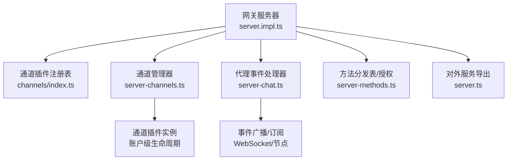
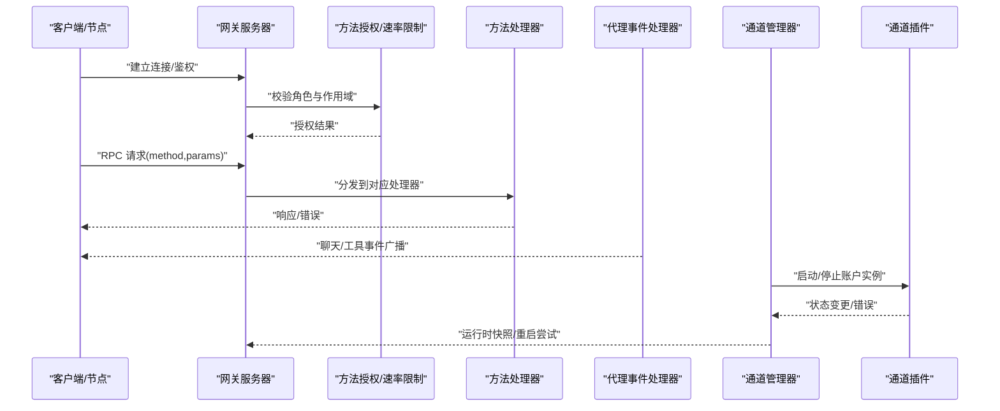
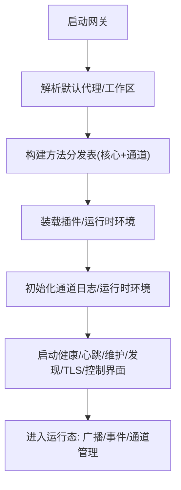
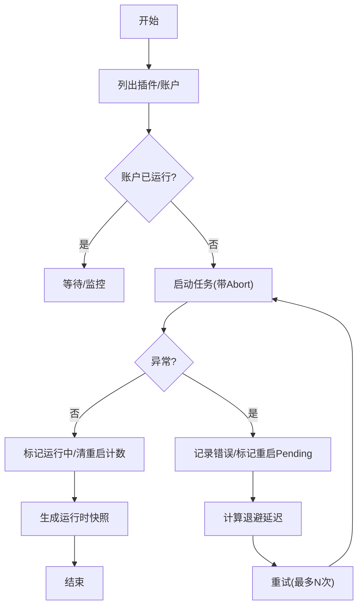
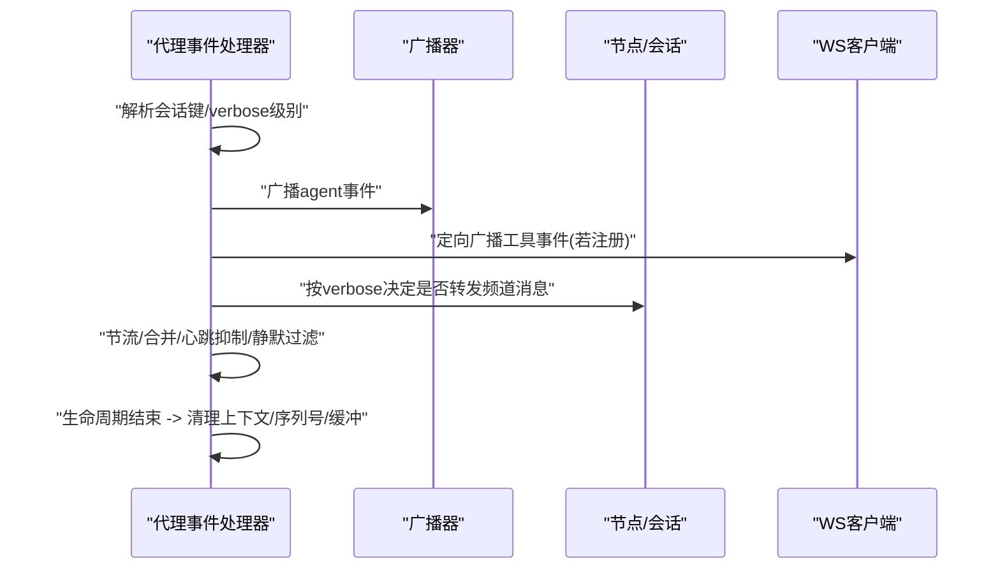
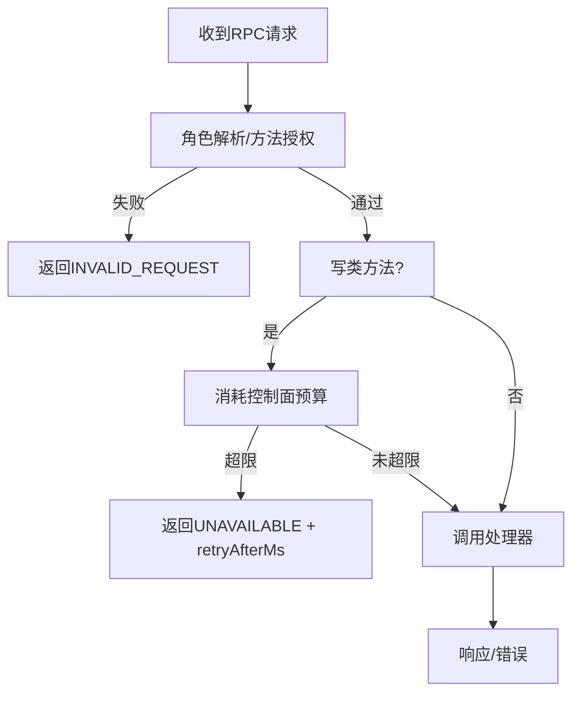
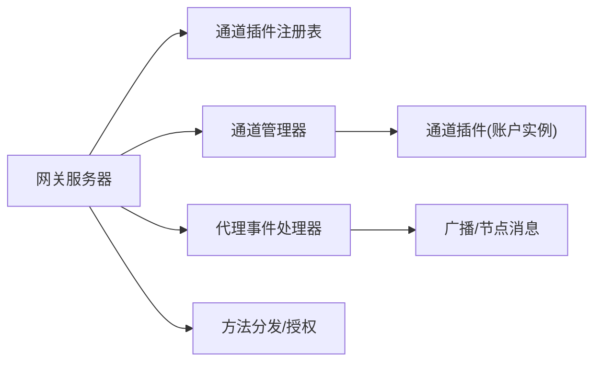

# 组件交互机制

<cite>
**本文引用的文件**
- [server.ts](file://src/gateway/server.ts)
- [server.impl.ts](file://src/gateway/server.impl.ts)
- [server-channels.ts](file://src/gateway/server-channels.ts)
- [server-chat.ts](file://src/gateway/server-chat.ts)
- [server-methods.ts](file://src/gateway/server-methods.ts)
- [channels/index.ts](file://src/channels/plugins/index.ts)
- [message-tool.ts](file://src/agents/tools/message-tool.ts)
- [NodeAppModel.swift](file://apps/ios/Sources/Model/NodeAppModel.swift)
- [server.agent.gateway-server-agent-a.test.ts](file://src/gateway/server.agent.gateway-server-agent-a.test.ts)
- [server.tools-catalog.test.ts](file://src/gateway/server.tools-catalog.test.ts)
- [server-chat.agent-events.test.ts](file://src/gateway/server-chat.agent-events.test.ts)
</cite>

## 目录

1. [引言](#引言)
2. [项目结构](#项目结构)
3. [核心组件](#核心组件)
4. [架构总览](#架构总览)
5. [详细组件分析](#详细组件分析)
6. [依赖分析](#依赖分析)
7. [性能考虑](#性能考虑)
8. [故障排查指南](#故障排查指南)
9. [结论](#结论)

## 引言

本文件系统化阐述 OpenClaw 的组件交互机制，聚焦网关服务器、通道适配器、代理管理器与工具执行器之间的协作关系，解释消息路由算法、事件传播机制与状态同步策略，并给出并发控制、错误处理与故障恢复的实现要点。文档同时提供时序图与流程图，帮助读者快速理解端到端的数据流与控制流。

## 项目结构

OpenClaw 的“网关”作为统一入口，承载 RPC 方法分发、会话与通道生命周期管理、事件广播与订阅、以及插件生态集成。核心模块包括：

- 网关服务器：负责启动、配置加载、方法分发、事件广播、通道管理、插件装载与运行时上下文。
- 通道适配器：通过插件注册表动态发现并启停各渠道（如 Discord、Telegram、Signal 等）的账户实例。
- 代理管理器：负责代理运行上下文、会话键解析、事件序列与缓冲、工具事件接收者注册。
- 工具执行器：在代理运行上下文中触发工具调用，事件经由代理事件处理器进行路由与广播。

图表来源

- [server.impl.ts:1-200](file://src/gateway/server.impl.ts#L1-L200)
- [channels/index.ts:1-118](file://src/channels/plugins/index.ts#L1-L118)
- [server-channels.ts:1-458](file://src/gateway/server-channels.ts#L1-L458)
- [server-chat.ts:1-649](file://src/gateway/server-chat.ts#L1-L649)
- [server-methods.ts:1-158](file://src/gateway/server-methods.ts#L1-L158)
- [server.ts:1-4](file://src/gateway/server.ts#L1-L4)

章节来源

- [server.impl.ts:1-200](file://src/gateway/server.impl.ts#L1-L200)
- [server.ts:1-4](file://src/gateway/server.ts#L1-L4)

## 核心组件

- 网关服务器（Gateway Server）
  - 负责加载配置、初始化插件与通道运行时、构建方法分发表、启动通道、维护健康状态与诊断事件、处理连接与认证、暴露 RPC 接口。
  - 关键职责：方法授权与速率限制、事件广播、通道启停与自动重启、会话键解析、插件服务装载。
- 通道适配器（Channel Manager）
  - 基于插件注册表按渠道与账户维度启停实例，维护运行时快照、手动停止标记、重启尝试计数与指数退避重试。
  - 关键职责：账户级启停、错误记录、自动重启、运行时状态快照。
- 代理事件处理器（Agent Event Handler）
  - 将代理运行事件转换为聊天与工具事件，负责文本合并、静默回复过滤、心跳抑制、节流与最终态刷新、工具事件接收者定向广播。
  - 关键职责：聊天流节流与去噪、工具事件定向广播、生命周期结束清理。
- 方法分发与授权（Gateway Methods）
  - 统一聚合核心与插件方法，执行角色与作用域授权校验，对写类控制面方法施加速率限制。
  - 关键职责：方法存在性检查、权限校验、速率限制、请求作用域包装。
- 工具执行器（Agent Tools）
  - 在代理运行上下文中解析网关选项并发起工具调用；支持当前消息 ID 传递以建立端到端追踪。
  - 关键职责：网关参数解析、客户端标识与模式设置、消息上下文关联。

章节来源

- [server.impl.ts:465-493](file://src/gateway/server.impl.ts#L465-L493)
- [server-channels.ts:100-458](file://src/gateway/server-channels.ts#L100-L458)
- [server-chat.ts:134-649](file://src/gateway/server-chat.ts#L134-L649)
- [server-methods.ts:38-158](file://src/gateway/server-methods.ts#L38-L158)
- [message-tool.ts:726-747](file://src/agents/tools/message-tool.ts#L726-L747)

## 架构总览

下图展示从客户端连接到事件广播、再到通道与工具执行的整体交互路径。

图表来源

- [server-methods.ts:100-158](file://src/gateway/server-methods.ts#L100-L158)
- [server-chat.ts:331-649](file://src/gateway/server-chat.ts#L331-L649)
- [server-channels.ts:149-305](file://src/gateway/server-channels.ts#L149-L305)
- [server.impl.ts:465-493](file://src/gateway/server.impl.ts#L465-L493)

## 详细组件分析

### 网关服务器（启动与运行时）

- 启动阶段
  - 解析默认代理与工作区、构建基础与通道方法集合、装载插件与运行时环境、初始化通道日志与运行时环境映射。
  - 初始化健康状态、诊断事件、心跳、维护定时器、发现服务、TLS、浏览器控制服务、插件服务句柄等。
- 运行时特性
  - 方法分发表去重合并，确保核心与通道方法一致；提供最小测试网关能力用于测试场景。
  - 通过运行时配置解析器生成对外绑定信息（端口、主机、控制界面启用）。

图表来源

- [server.impl.ts:465-493](file://src/gateway/server.impl.ts#L465-L493)

章节来源

- [server.impl.ts:1-200](file://src/gateway/server.impl.ts#L1-L200)
- [server.impl.ts:465-493](file://src/gateway/server.impl.ts#L465-L493)

### 通道适配器（插件注册与生命周期）

- 插件注册与排序
  - 基于插件注册版本缓存插件列表，按预定义顺序与元数据 order 排序，去重后提供查询与规范化通道 ID。
- 生命周期管理
  - 按渠道与账户维度启动/停止；维护 AbortController、任务跟踪、运行时快照；记录启用/配置/运行状态与最后错误。
  - 自动重启：指数退避与抖动，最大尝试次数限制；手动停止标记避免自动重启；登出标记更新状态。
- 运行时快照
  - 汇总每个渠道的默认账户与所有账户的当前状态，用于外部查询与诊断。

图表来源

- [server-channels.ts:149-305](file://src/gateway/server-channels.ts#L149-L305)
- [server-channels.ts:368-458](file://src/gateway/server-channels.ts#L368-L458)
- [channels/index.ts:74-90](file://src/channels/plugins/index.ts#L74-L90)

章节来源

- [server-channels.ts:1-458](file://src/gateway/server-channels.ts#L1-L458)
- [channels/index.ts:1-118](file://src/channels/plugins/index.ts#L1-L118)

### 代理事件处理器（消息路由与事件传播）

- 聊天事件
  - 文本合并与去噪：静默回复令牌过滤、心跳抑制、节流（150ms）；最终态刷新保证客户端收到完整文本。
  - 会话键解析：优先使用聊天运行链接，其次事件携带的 sessionKey，最后回退到运行上下文解析。
- 工具事件
  - 工具事件总是向“具备 tool-events 能力”的连接定向广播，与 verbose 级别无关；verbose 控制的是频道消息细节。
  - 工具事件接收者注册表维护 TTL 与最终态宽限，避免过期后仍广播给已断开连接。
- 生命周期与清理
  - runId 序列号校验，缺失时发送“序列缺口”错误；生命周期结束或错误时清理运行上下文、序列号与缓冲。

图表来源

- [server-chat.ts:331-649](file://src/gateway/server-chat.ts#L331-L649)

章节来源

- [server-chat.ts:134-649](file://src/gateway/server-chat.ts#L134-L649)

### 方法分发与授权（接口契约与并发控制）

- 授权与作用域
  - 角色解析失败返回无效请求；节点角色可直接访问部分方法；非管理员需满足方法所需作用域；健康检查方法免授权。
- 写类控制面速率限制
  - 对 config.apply、config.patch、update.run 施加“每60秒3次”的预算限制，超限返回 UNAVAILABLE 并提示重试时间。
- 并发与请求作用域
  - 所有处理器在请求作用域内执行，允许插件运行时子代理在工具执行期间回调网关。

图表来源

- [server-methods.ts:38-158](file://src/gateway/server-methods.ts#L38-L158)

章节来源

- [server-methods.ts:1-158](file://src/gateway/server-methods.ts#L1-L158)

### 工具执行器（消息工具）

- 网关参数解析
  - 支持从参数解析 gatewayUrl、gatewayToken、timeoutMs；构造客户端标识与模式（后端）。
- 上下文关联
  - 若存在当前消息 ID，将其注入工具调用上下文，便于端到端追踪。

章节来源

- [message-tool.ts:726-747](file://src/agents/tools/message-tool.ts#L726-L747)

### 客户端集成示例（iOS）

- 客户端通过网关 RPC 列举代理、刷新主会话键、更新 UI 与画布视图。
- 连接状态检查失败时采用尽力而为策略，避免阻塞 UI 更新。

章节来源

- [NodeAppModel.swift:565-590](file://apps/ios/Sources/Model/NodeAppModel.swift#L565-L590)

## 依赖分析

- 组件耦合
  - 网关服务器对通道插件注册表与通道管理器强依赖；对代理事件处理器提供广播与节点消息转发接口。
  - 代理事件处理器依赖运行上下文、会话键解析、verbose 策略与工具事件接收者注册表。
  - 方法分发层对授权与速率限制的依赖，确保控制面安全与稳定性。
- 外部依赖
  - 插件生态通过注册表动态扩展；通道插件提供账户级启停钩子；工具执行器通过消息工具与网关交互。

图表来源

- [server.impl.ts:465-493](file://src/gateway/server.impl.ts#L465-L493)
- [server-channels.ts:100-458](file://src/gateway/server-channels.ts#L100-L458)
- [server-chat.ts:331-649](file://src/gateway/server-chat.ts#L331-L649)
- [server-methods.ts:68-98](file://src/gateway/server-methods.ts#L68-L98)

章节来源

- [server.impl.ts:465-493](file://src/gateway/server.impl.ts#L465-L493)
- [server-channels.ts:100-458](file://src/gateway/server-channels.ts#L100-L458)
- [server-chat.ts:331-649](file://src/gateway/server-chat.ts#L331-L649)
- [server-methods.ts:68-98](file://src/gateway/server-methods.ts#L68-L98)

## 性能考虑

- 事件节流与去噪
  - 聊天 delta 节流（150ms）减少冗余广播；心跳抑制与静默回复过滤降低无意义流量。
- 自动重启退避
  - 指数退避与抖动避免雪崩式重试；最大尝试次数限制防止无限循环。
- 广播优化
  - 工具事件定向广播仅投递给具备 tool-events 能力的连接，降低广播压力。
- 速率限制
  - 控制面写操作预算限制，保障系统在高负载下的稳定性。

## 故障排查指南

- 通道无法启动/频繁退出
  - 检查账户配置与启用状态；查看最近错误与重启尝试计数；确认手动停止标记是否被意外设置。
- 事件未到达客户端
  - 确认工具事件接收者注册是否仍在 TTL 内；verbose 级别是否导致频道消息被抑制；检查连接能力声明。
- 方法调用失败
  - 校验角色与作用域；关注速率限制返回的 retryAfterMs；确认方法是否存在且已正确装载。
- 端到端测试参考
  - 提供工具目录查询与代理列表的测试用例，可用于验证网关功能与客户端集成。

章节来源

- [server-channels.ts:149-305](file://src/gateway/server-channels.ts#L149-L305)
- [server-chat.ts:528-649](file://src/gateway/server-chat.ts#L528-L649)
- [server-methods.ts:100-158](file://src/gateway/server-methods.ts#L100-L158)
- [server.tools-catalog.test.ts:1-46](file://src/gateway/server.tools-catalog.test.ts#L1-L46)
- [server-chat.agent-events.test.ts:515-547](file://src/gateway/server-chat.agent-events.test.ts#L515-L547)

## 结论

OpenClaw 的组件交互以“网关服务器”为中心，通过插件化的通道适配器实现多渠道账户级生命周期管理，借助代理事件处理器完成消息路由与事件传播，并以方法分发层确保安全与稳定。该设计在并发控制、错误处理与故障恢复方面具备完善的机制，适合在复杂多渠道场景下保持一致性与可运维性。
