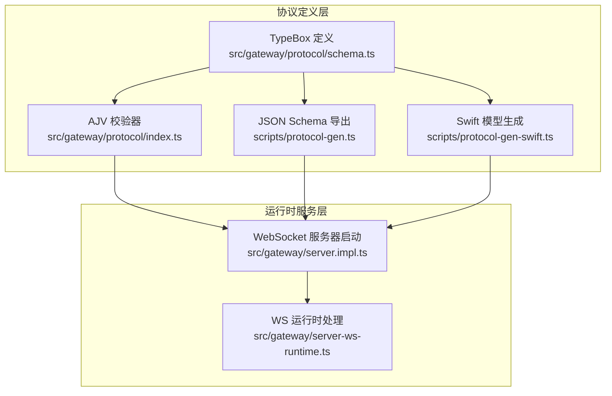
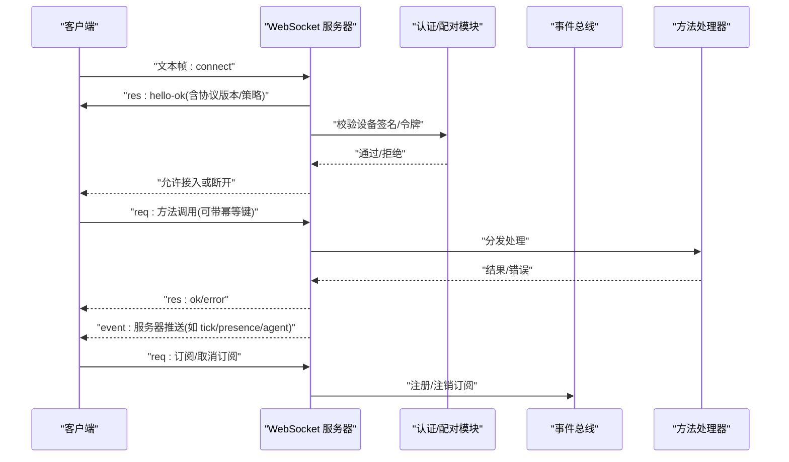
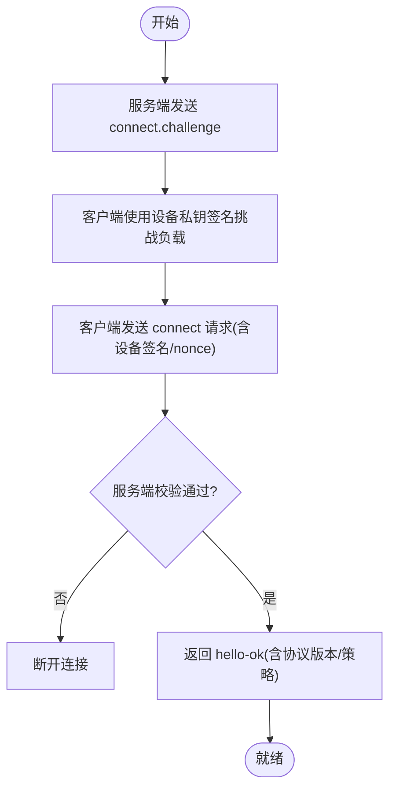
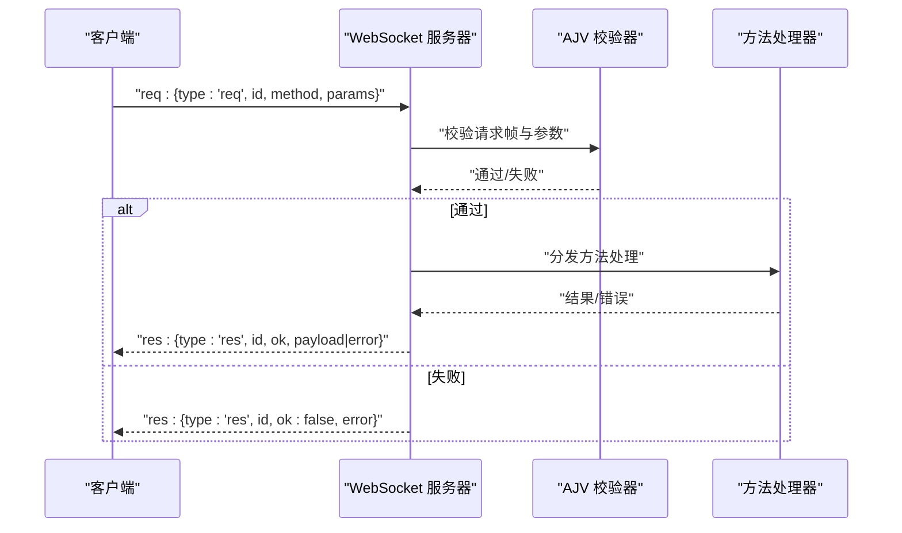
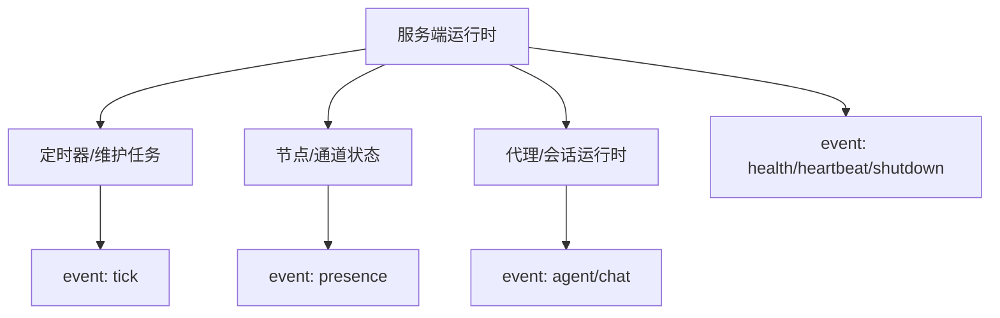
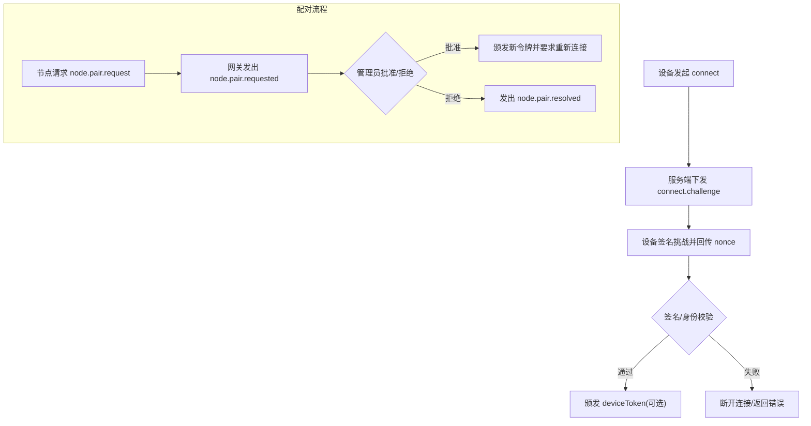
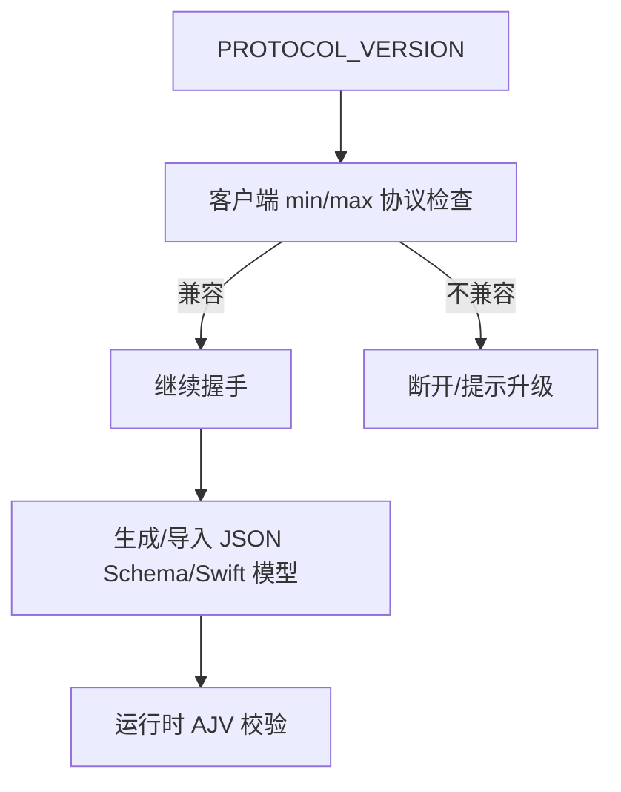
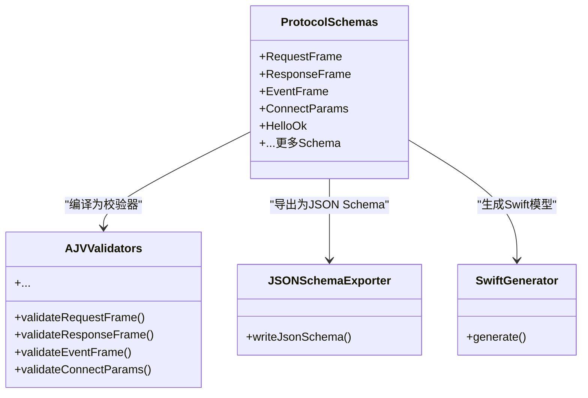
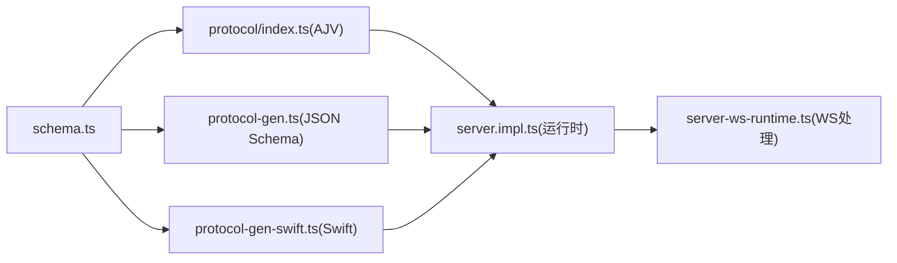

# 网关协议设计

<cite>
**本文引用的文件**
- [docs/gateway/protocol.md](file://docs/gateway/protocol.md)
- [docs/gateway/index.md](file://docs/gateway/index.md)
- [docs/gateway/pairing.md](file://docs/gateway/pairing.md)
- [docs/concepts/typebox.md](file://docs/concepts/typebox.md)
- [src/gateway/protocol/schema.ts](file://src/gateway/protocol/schema.ts)
- [src/gateway/protocol/index.ts](file://src/gateway/protocol/index.ts)
- [scripts/protocol-gen.ts](file://scripts/protocol-gen.ts)
- [scripts/protocol-gen-swift.ts](file://scripts/protocol-gen-swift.ts)
- [src/gateway/server.impl.ts](file://src/gateway/server.impl.ts)
- [src/gateway/server-ws-runtime.ts](file://src/gateway/server-ws-runtime.ts)
</cite>

## 目录

1. [简介](#简介)
2. [项目结构](#项目结构)
3. [核心组件](#核心组件)
4. [架构总览](#架构总览)
5. [详细组件分析](#详细组件分析)
6. [依赖关系分析](#依赖关系分析)
7. [性能考量](#性能考量)
8. [故障排查指南](#故障排查指南)
9. [结论](#结论)
10. [附录](#附录)

## 简介

本文件面向OpenClaw网关协议（WebSocket）的设计与实现，系统化阐述连接生命周期、请求-响应模式、事件推送机制；详解协议的JSON Schema定义、TypeBox类型系统与代码生成流程；说明身份验证、配对流程、安全令牌与签名验证；并给出协议版本管理、向后兼容性与迁移策略，以及具体示例与最佳实践。

## 项目结构

OpenClaw将“协议即代码”的理念贯穿到运行时与跨语言生成链路：TypeBox定义作为单一真实来源，驱动AJV运行时校验、JSON Schema导出与Swift模型生成。WebSocket服务端在启动时装配方法表与事件表，并通过统一的帧格式承载握手、请求、响应与事件。

图表来源

- [src/gateway/protocol/schema.ts:1-19](file://src/gateway/protocol/schema.ts#L1-L19)
- [src/gateway/protocol/index.ts:1-673](file://src/gateway/protocol/index.ts#L1-L673)
- [scripts/protocol-gen.ts:1-52](file://scripts/protocol-gen.ts#L1-L52)
- [scripts/protocol-gen-swift.ts:1-248](file://scripts/protocol-gen-swift.ts#L1-L248)
- [src/gateway/server.impl.ts:266-1066](file://src/gateway/server.impl.ts#L266-L1066)
- [src/gateway/server-ws-runtime.ts](file://src/gateway/server-ws-runtime.ts)

章节来源

- [docs/gateway/protocol.md:1-268](file://docs/gateway/protocol.md#L1-L268)
- [docs/concepts/typebox.md:1-292](file://docs/concepts/typebox.md#L1-L292)

## 核心组件

- 协议帧模型：req（请求）、res（响应）、event（事件），由TypeBox定义并通过AJV编译为运行时校验器。
- 握手与认证：首次帧必须是connect；服务端返回hello-ok；设备需完成挑战签名与设备身份校验。
- 方法与事件：服务端维护方法表与事件表，在hello-ok中声明可用能力。
- 代码生成：从TypeBox导出JSON Schema，再生成Swift模型，确保跨语言一致性。
- 配对与授权：节点配对、设备令牌轮换与撤销、执行审批等安全流程。

章节来源

- [docs/gateway/protocol.md:127-268](file://docs/gateway/protocol.md#L127-L268)
- [docs/concepts/typebox.md:74-145](file://docs/concepts/typebox.md#L74-L145)

## 架构总览

下图展示从客户端到服务端的关键交互路径：连接建立、握手、方法调用与事件订阅。

图表来源

- [docs/gateway/protocol.md:22-134](file://docs/gateway/protocol.md#L22-L134)
- [src/gateway/server.impl.ts:871-893](file://src/gateway/server.impl.ts#L871-L893)

章节来源

- [docs/gateway/protocol.md:22-134](file://docs/gateway/protocol.md#L22-L134)
- [src/gateway/server.impl.ts:871-893](file://src/gateway/server.impl.ts#L871-L893)

## 详细组件分析

### WebSocket连接生命周期与握手

- 首帧约束：首个帧必须是connect请求，否则直接关闭。
- 挑战-应答：服务端先下发connect.challenge（包含随机数nonce与时间戳），客户端需使用设备私钥对v2/v3签名负载进行签名，并在connect.params.device.nonce回传相同nonce。
- 设备身份：connect.params.device包含设备指纹、公钥、签名、签名时间与nonce；服务端校验签名有效性、时间偏差、设备ID与公钥规范化。
- 成功握手：服务端返回res类型的hello-ok，包含协议版本、策略参数（如心跳间隔）与可选的设备令牌信息。

图表来源

- [docs/gateway/protocol.md:22-90](file://docs/gateway/protocol.md#L22-L90)

章节来源

- [docs/gateway/protocol.md:22-90](file://docs/gateway/protocol.md#L22-L90)

### 请求-响应模式与方法分发

- 帧结构：req包含id、method、params；res包含id、ok、payload或error；event包含event、payload及可选序列号与状态版本。
- 方法表：服务端在启动时构建方法集合，并在hello-ok.features.methods中暴露可用方法。
- 幂等键：有副作用的方法通常要求在params中携带幂等键以避免重复执行。
- 错误模型：错误形状由TypeBox定义并通过AJV校验，错误详情包含错误码与建议操作。

图表来源

- [src/gateway/protocol/index.ts:253-458](file://src/gateway/protocol/index.ts#L253-L458)
- [src/gateway/server.impl.ts:871-893](file://src/gateway/server.impl.ts#L871-L893)

章节来源

- [src/gateway/protocol/index.ts:253-458](file://src/gateway/protocol/index.ts#L253-L458)
- [docs/concepts/typebox.md:74-145](file://docs/concepts/typebox.md#L74-L145)

### 事件推送机制

- 事件类型：tick、presence、agent、chat、health、heartbeat、shutdown等。
- 推送策略：服务端周期性广播tick；健康状态变化触发health事件；节点能力变更触发presence更新；会话/代理运行过程通过agent事件流式通知。
- 序列与状态版本：事件可携带seq与stateVersion，用于检测重放与恢复状态。

图表来源

- [docs/gateway/protocol.md:127-134](file://docs/gateway/protocol.md#L127-L134)
- [src/gateway/server.impl.ts:700-780](file://src/gateway/server.impl.ts#L700-L780)

章节来源

- [docs/gateway/protocol.md:127-134](file://docs/gateway/protocol.md#L127-L134)
- [src/gateway/server.impl.ts:700-780](file://src/gateway/server.impl.ts#L700-L780)

### 身份验证、设备配对与安全令牌

- 传输层安全：支持TLS；客户端可选择证书指纹固定。
- 连接层认证：若配置了网关令牌，connect.params.auth.token必须匹配；否则断开。
- 设备签名：所有WS连接必须对服务端挑战进行签名；v3签名绑定平台与设备家族等上下文字段。
- 设备令牌：握手成功后可颁发设备令牌（deviceToken），按角色与作用域限定；支持轮换与撤销。
- 配对流程：节点发起配对请求，网关发出node.pair.requested事件；管理员批准后颁发新令牌；请求5分钟过期。
- 执行审批：当需要系统级执行审批时，网关广播exec.approval.requested，管理员以operator.approvals权限解析。

图表来源

- [docs/gateway/protocol.md:200-262](file://docs/gateway/protocol.md#L200-L262)
- [docs/gateway/pairing.md:27-71](file://docs/gateway/pairing.md#L27-L71)

章节来源

- [docs/gateway/protocol.md:200-262](file://docs/gateway/protocol.md#L200-L262)
- [docs/gateway/pairing.md:1-100](file://docs/gateway/pairing.md#L1-L100)

### 协议版本管理与向后兼容

- 版本常量：PROTOCOL_VERSION位于协议Schema入口，客户端需在connect.params中声明minProtocol/maxProtocol，服务端拒绝不兼容范围。
- 兼容策略：Swift模型保留未知帧类型以避免破坏旧客户端；JSON Schema导出包含discriminator与oneOf，确保解析向前兼容。
- 迁移指引：对于遗留签名行为，服务端返回DEVICE*AUTH*\*错误码与稳定reason，指导客户端升级到v2/v3签名并带上nonce。

图表来源

- [docs/concepts/typebox.md:264-269](file://docs/concepts/typebox.md#L264-L269)
- [docs/gateway/protocol.md:191-199](file://docs/gateway/protocol.md#L191-L199)

章节来源

- [docs/concepts/typebox.md:264-269](file://docs/concepts/typebox.md#L264-L269)
- [docs/gateway/protocol.md:191-199](file://docs/gateway/protocol.md#L191-L199)

### TypeBox类型系统与代码生成

- 单一真实来源：TypeBox定义覆盖帧、参数、结果、错误与快照等全部协议对象。
- 运行时校验：AJV编译各Schema为静态校验器，服务端/客户端均使用。
- JSON Schema导出：脚本遍历ProtocolSchemas，生成根Schema并写入dist/protocol.schema.json。
- Swift模型生成：脚本将Schema转为Swift结构体与枚举，生成GatewayModels.swift并注入协议版本与错误码。

图表来源

- [src/gateway/protocol/schema.ts:1-19](file://src/gateway/protocol/schema.ts#L1-L19)
- [src/gateway/protocol/index.ts:253-458](file://src/gateway/protocol/index.ts#L253-L458)
- [scripts/protocol-gen.ts:9-42](file://scripts/protocol-gen.ts#L9-L42)
- [scripts/protocol-gen-swift.ts:213-242](file://scripts/protocol-gen-swift.ts#L213-L242)

章节来源

- [src/gateway/protocol/schema.ts:1-19](file://src/gateway/protocol/schema.ts#L1-L19)
- [src/gateway/protocol/index.ts:253-458](file://src/gateway/protocol/index.ts#L253-L458)
- [scripts/protocol-gen.ts:9-42](file://scripts/protocol-gen.ts#L9-L42)
- [scripts/protocol-gen-swift.ts:213-242](file://scripts/protocol-gen-swift.ts#L213-L242)
- [docs/concepts/typebox.md:65-82](file://docs/concepts/typebox.md#L65-L82)

### 最佳实践与示例

- 安全：始终等待connect.challenge后再发送connect；使用v3签名并携带nonce；生产环境启用TLS并考虑证书指纹固定。
- 可靠性：对有副作用的方法添加幂等键；在握手失败时遵循错误详情中的建议步骤；对AUTH_TOKEN_MISMATCH进行有限重试。
- 可维护性：通过pnpm protocol:check确保Schema与生成物一致；新增方法需同步更新Schema、校验器、服务端处理器与文档。
- 运维：结合网关runbook进行健康检查与就绪探测；多实例部署时确保端口、配置与状态目录唯一。

章节来源

- [docs/gateway/protocol.md:200-262](file://docs/gateway/protocol.md#L200-L262)
- [docs/gateway/index.md:202-262](file://docs/gateway/index.md#L202-L262)
- [docs/concepts/typebox.md:287-292](file://docs/concepts/typebox.md#L287-L292)

## 依赖关系分析

- 协议定义与校验：schema.ts导出所有Schema，index.ts基于AJV编译为校验器；server.impl.ts在启动时装配方法与事件表，并在WS运行时使用校验器。
- 生成链路：protocol-gen.ts与protocol-gen-swift.ts分别负责JSON Schema与Swift模型生成，二者均依赖ProtocolSchemas。
- 运行时集成：server-ws-runtime.ts承接WebSocket连接，调用attachGatewayWsHandlers完成握手、方法分发与事件广播。

图表来源

- [src/gateway/protocol/schema.ts:1-19](file://src/gateway/protocol/schema.ts#L1-L19)
- [src/gateway/protocol/index.ts:1-673](file://src/gateway/protocol/index.ts#L1-L673)
- [scripts/protocol-gen.ts:1-52](file://scripts/protocol-gen.ts#L1-L52)
- [scripts/protocol-gen-swift.ts:1-248](file://scripts/protocol-gen-swift.ts#L1-L248)
- [src/gateway/server.impl.ts:871-893](file://src/gateway/server.impl.ts#L871-L893)
- [src/gateway/server-ws-runtime.ts](file://src/gateway/server-ws-runtime.ts)

章节来源

- [src/gateway/protocol/schema.ts:1-19](file://src/gateway/protocol/schema.ts#L1-L19)
- [src/gateway/protocol/index.ts:1-673](file://src/gateway/protocol/index.ts#L1-L673)
- [scripts/protocol-gen.ts:1-52](file://scripts/protocol-gen.ts#L1-L52)
- [scripts/protocol-gen-swift.ts:1-248](file://scripts/protocol-gen-swift.ts#L1-L248)
- [src/gateway/server.impl.ts:871-893](file://src/gateway/server.impl.ts#L871-L893)
- [src/gateway/server-ws-runtime.ts](file://src/gateway/server-ws-runtime.ts)

## 性能考量

- 心跳与维护：服务端周期性广播tick并维护健康状态，避免客户端频繁轮询。
- 事件去抖与丢弃：对高频事件采用dropIfSlow策略，防止阻塞主循环。
- 幂等与重入：对有副作用的方法强制幂等键，减少重复计算与网络往返。
- 生成物一致性：通过protocol:check确保Schema与生成物一致，避免运行时因类型不匹配导致的额外校验成本。

## 故障排查指南

- 连接失败
  - 未等待connect.challenge或签名不正确：检查设备签名流程与nonce一致性。
  - AUTH_TOKEN_MISMATCH：根据错误详情中的canRetryWithDeviceToken与recommendedNextStep采取行动。
  - 设备签名迁移：参考DEVICE*AUTH*\*错误码与reason定位问题（nonce缺失/不匹配、签名无效/过期、设备ID不匹配、公钥无效）。
- 配对异常
  - 节点请求未生效：确认是否收到node.pair.requested并已批准；请求5分钟过期。
  - 令牌轮换：批准后需使用新令牌重新连接。
- 运行时问题
  - 方法调用失败：检查AJV校验错误消息，定位多余属性或字段类型不符。
  - 事件缺失：确认客户端已订阅对应事件；关注seq与stateVersion以恢复状态。

章节来源

- [docs/gateway/protocol.md:209-262](file://docs/gateway/protocol.md#L209-L262)
- [docs/gateway/pairing.md:35-71](file://docs/gateway/pairing.md#L35-L71)

## 结论

OpenClaw网关协议以TypeBox为核心，形成“定义—校验—导出—生成—运行”的闭环，既保证了跨语言一致性，又提供了清晰的版本演进与兼容策略。通过严格的握手与设备签名、完善的配对与令牌管理、以及稳健的事件推送与方法分发，协议在安全性与可用性之间取得平衡。建议在生产环境中严格遵循安全最佳实践与版本管理策略，并持续通过生成链路保障一致性。

## 附录

- 示例参考
  - 握手与hello-ok：参见协议文档中的connect与hello-ok示例。
  - 请求-响应：参见TypeBox文档中的请求与响应示例。
  - 事件：参见协议文档中的事件列表与示例。
- 工具与命令
  - 生成JSON Schema：pnpm protocol:gen
  - 生成Swift模型：pnpm protocol:gen:swift
  - 校验生成物：pnpm protocol:check
- 运维参考
  - 网关runbook与健康检查：参见gateway/index.md中的运行时模型与常见失败签名。

章节来源

- [docs/gateway/protocol.md:1-268](file://docs/gateway/protocol.md#L1-L268)
- [docs/concepts/typebox.md:65-82](file://docs/concepts/typebox.md#L65-L82)
- [docs/gateway/index.md:202-262](file://docs/gateway/index.md#L202-L262)
