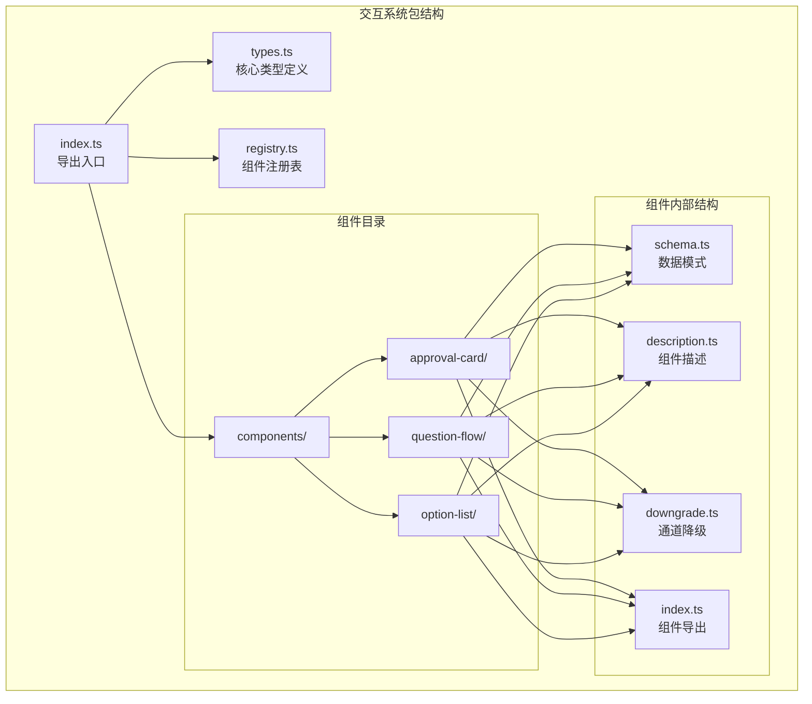
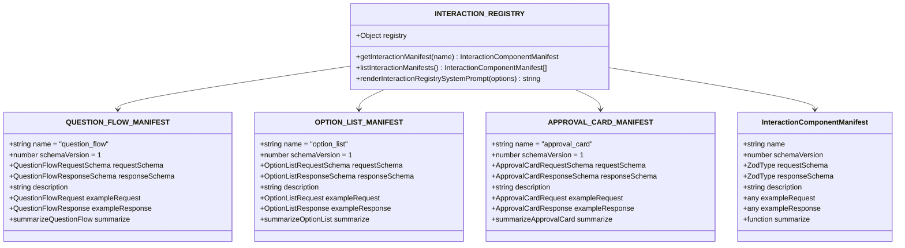
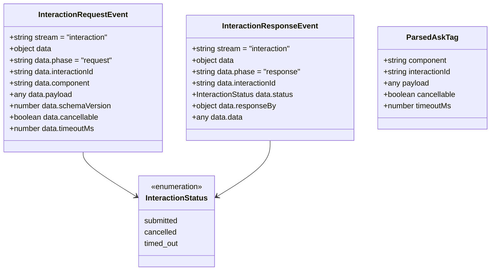
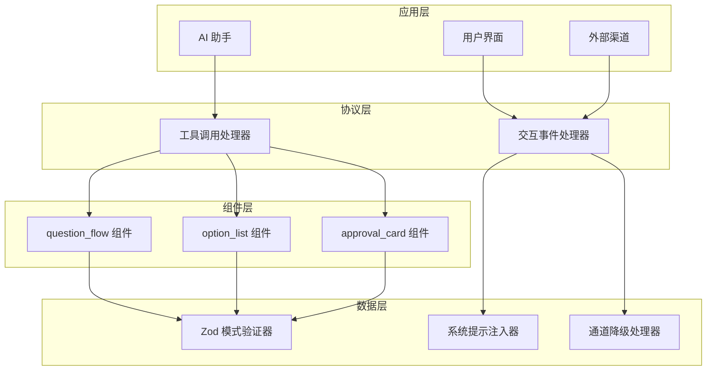
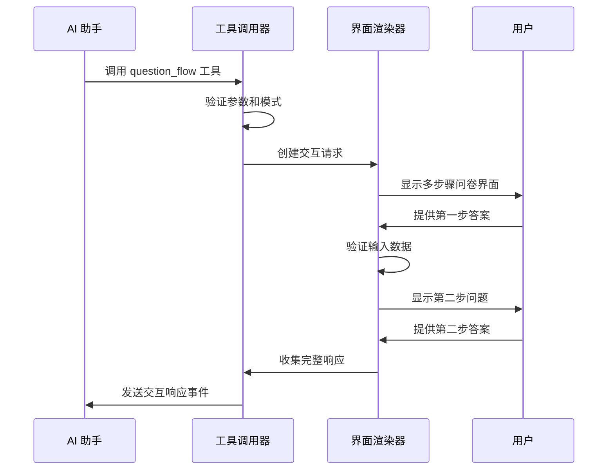
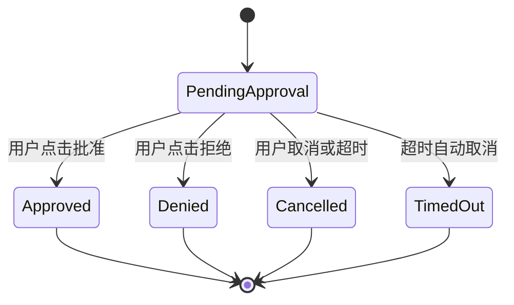
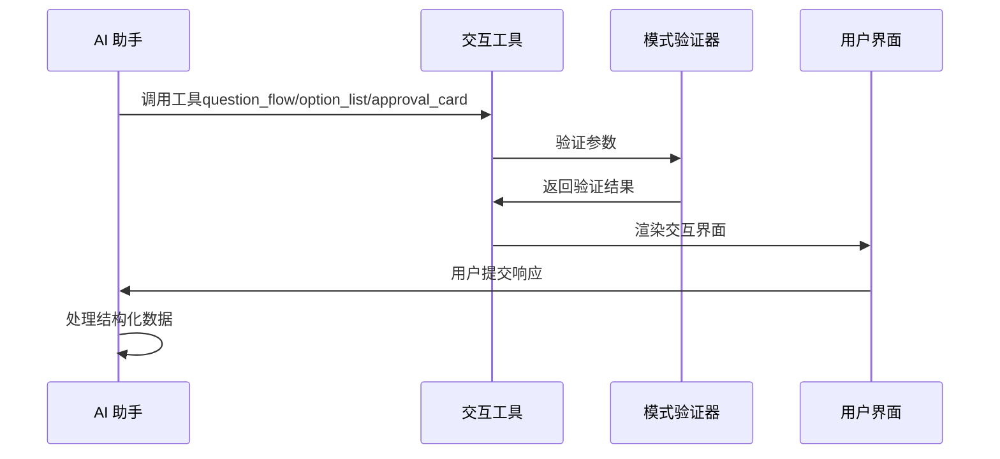

# 交互系统包

<cite>
**本文档引用的文件**
- [packages/interactions/src/index.ts](file://packages/interactions/src/index.ts)
- [packages/interactions/src/types.ts](file://packages/interactions/src/types.ts)
- [packages/interactions/src/registry.ts](file://packages/interactions/src/registry.ts)
- [packages/interactions/src/components/approval-card/index.ts](file://packages/interactions/src/components/approval-card/index.ts)
- [packages/interactions/src/components/question-flow/index.ts](file://packages/interactions/src/components/question-flow/index.ts)
- [packages/interactions/src/components/option-list/index.ts](file://packages/interactions/src/components/option-list/index.ts)
- [packages/interactions/src/components/approval-card/schema.ts](file://packages/interactions/src/components/approval-card/schema.ts)
- [packages/interactions/src/components/question-flow/schema.ts](file://packages/interactions/src/components/question-flow/schema.ts)
- [packages/interactions/src/components/option-list/schema.ts](file://packages/interactions/src/components/option-list/schema.ts)
- [skills/openclaw-interactions/SKILL.md](file://skills/openclaw-interactions/SKILL.md)
- [src/agents/tools/approval-card-tool.ts](file://src/agents/tools/approval-card-tool.ts)
- [src/agents/tools/question-flow-tool.ts](file://src/agents/tools/question-flow-tool.ts)
- [src/agents/tools/option-list-tool.ts](file://src/agents/tools/option-list-tool.ts)
</cite>

## 更新摘要
**所做更改**
- 更新架构概览以反映从ask标签系统到工具化交互系统的重大迁移
- 新增工具化交互系统的详细说明和工作流程
- 移除旧的ask标签语法和系统提示相关内容
- 强调工具化交互系统的实时性和流式处理特性
- 更新组件交互模式以适应新的工具调用机制

## 目录
1. [简介](#简介)
2. [项目结构](#项目结构)
3. [核心组件](#核心组件)
4. [架构概览](#架构概览)
5. [详细组件分析](#详细组件分析)
6. [工具化交互系统](#工具化交互系统)
7. [依赖关系分析](#依赖关系分析)
8. [性能考虑](#性能考虑)
9. [故障排除指南](#故障排除指南)
10. [结论](#结论)

## 简介

交互系统包是 OpenClaw 人工智能助手平台中的核心组件，负责提供结构化的用户交互协议和组件。该包实现了基于工具调用的交互协议，允许 AI 助手通过标准工具接口向用户请求结构化输入，而不是依赖于传统的 `<ask>` 标签系统。

该系统提供了三种主要的交互组件：
- **question_flow**: 多步骤问卷调查组件
- **option_list**: 单步骤选项列表组件  
- **approval_card**: 明确的批准/拒绝确认组件

通过标准化的工具接口，OpenClaw 能够在不同的通信渠道（如 Telegram、Discord、WebChat 等）上提供一致的用户体验，同时确保数据的结构化和可验证性。

**更新** 系统已从基于 `<ask>` 标签的传统交互模式迁移到现代工具化交互系统，提供更好的实时性和流式处理能力。

## 项目结构

交互系统包采用模块化设计，主要包含以下结构：



**图表来源**
- [packages/interactions/src/index.ts:1-6](file://packages/interactions/src/index.ts#L1-L6)
- [packages/interactions/src/registry.ts:1-70](file://packages/interactions/src/registry.ts#L1-L70)

**章节来源**
- [packages/interactions/src/index.ts:1-6](file://packages/interactions/src/index.ts#L1-L6)
- [packages/interactions/src/registry.ts:1-70](file://packages/interactions/src/registry.ts#L1-L70)

## 核心组件

交互系统包的核心由三个主要组件构成，每个组件都有其特定的用途和数据模式：

### 1. 交互组件清单

系统维护一个中央注册表，包含所有可用的交互组件：



**图表来源**
- [packages/interactions/src/registry.ts:12-16](file://packages/interactions/src/registry.ts#L12-L16)
- [packages/interactions/src/types.ts:55-71](file://packages/interactions/src/types.ts#L55-L71)

### 2. 核心数据类型

系统使用 Zod 模式验证器来确保数据的完整性和一致性：



**图表来源**
- [packages/interactions/src/types.ts:10-82](file://packages/interactions/src/types.ts#L10-L82)

**章节来源**
- [packages/interactions/src/types.ts:1-83](file://packages/interactions/src/types.ts#L1-L83)
- [packages/interactions/src/registry.ts:1-70](file://packages/interactions/src/registry.ts#L1-L70)

## 架构概览

交互系统包采用分层架构设计，确保了组件间的松耦合和高内聚：



**更新** 系统已从基于 `<ask>` 标签的传统模式迁移到现代工具化交互系统。新的架构采用工具调用机制，提供更好的实时性和流式处理能力。

系统的工作流程如下：

1. **AI 助手调用工具**: AI 助手通过标准工具接口请求交互
2. **工具执行验证**: 系统验证工具参数并创建交互请求
3. **组件渲染**: 根据组件类型渲染相应的用户界面
4. **用户交互**: 用户通过界面提供结构化输入
5. **响应处理**: 系统处理用户响应并继续对话流程

**章节来源**
- [skills/openclaw-interactions/SKILL.md:1-172](file://skills/openclaw-interactions/SKILL.md#L1-L172)

## 详细组件分析

### 1. Question Flow 组件

Question Flow 组件用于创建多步骤的结构化问卷调查：



**图表来源**
- [packages/interactions/src/components/question-flow/index.ts:15-39](file://packages/interactions/src/components/question-flow/index.ts#L15-L39)
- [packages/interactions/src/components/question-flow/schema.ts:27-42](file://packages/interactions/src/components/question-flow/schema.ts#L27-L42)

#### 数据模式特点

Question Flow 使用嵌套的数据结构来支持复杂的多步骤交互：

| 字段名 | 类型 | 必需 | 描述 |
|--------|------|------|------|
| id | string | 是 | 流程标识符 |
| steps | Array[Step] | 是 | 步骤数组 |
| Step.id | string | 是 | 步骤标识符 |
| Step.title | string | 是 | 步骤标题 |
| Step.options | Array[Option] | 是 | 选项列表 |
| Option.id | string | 是 | 选项标识符 |
| Option.label | string | 是 | 选项标签 |
| selectionMode | enum | 否 | 选择模式（single/multi） |

**章节来源**
- [packages/interactions/src/components/question-flow/schema.ts:1-43](file://packages/interactions/src/components/question-flow/schema.ts#L1-L43)

### 2. Option List 组件

Option List 组件提供单步骤的选择列表功能：


**图表来源**
- [packages/interactions/src/components/option-list/schema.ts:10-54](file://packages/interactions/src/components/option-list/schema.ts#L10-L54)

#### 高级验证规则

Option List 组件实现了复杂的验证逻辑：

1. **范围验证**：确保 `minSelections` 不大于 `maxSelections`
2. **唯一性检查**：验证选项 ID 的唯一性
3. **数据完整性**：确保所有必需字段都存在

**章节来源**
- [packages/interactions/src/components/option-list/schema.ts:21-44](file://packages/interactions/src/components/option-list/schema.ts#L21-L44)

### 3. Approval Card 组件

Approval Card 组件专门用于处理需要明确批准或拒绝的操作：



**图表来源**
- [packages/interactions/src/components/approval-card/schema.ts:23-27](file://packages/interactions/src/components/approval-card/schema.ts#L23-L27)

#### 变体支持

Approval Card 支持两种视觉变体：

| 变体名称 | 用途 | 视觉效果 |
|----------|------|----------|
| default | 普通操作确认 | 标准样式 |
| destructive | 破坏性操作确认 | 危险警告样式 |

**章节来源**
- [packages/interactions/src/components/approval-card/schema.ts:1-30](file://packages/interactions/src/components/approval-card/schema.ts#L1-L30)

## 工具化交互系统

**新增** 交互系统现已完全迁移到工具化交互模式，提供更强大的功能和更好的用户体验。

### 工具调用机制

工具化交互系统采用标准的工具调用接口，每个交互组件都对应一个专用工具：



**图表来源**
- [src/agents/tools/approval-card-tool.ts:35-58](file://src/agents/tools/approval-card-tool.ts#L35-L58)
- [src/agents/tools/question-flow-tool.ts:47-72](file://src/agents/tools/question-flow-tool.ts#L47-L72)
- [src/agents/tools/option-list-tool.ts:43-69](file://src/agents/tools/option-list-tool.ts#L43-L69)

### 工具参数规范

每个工具都定义了严格的参数规范和验证规则：

#### Approval Card 工具参数
- `id`: 唯一稳定的交互实例ID
- `title`: 显示给用户的确认标题
- `description`: 可选的详细说明
- `variant`: 界面变体（default/destructive）
- 其他可选参数用于自定义界面外观

#### Question Flow 工具参数
- `id`: 唯一稳定的流程ID
- `steps`: 包含多个步骤的数组
- 每个步骤包含 `id`、`title`、`options` 等字段
- 支持单选和多选模式

#### Option List 工具参数
- `id`: 唯一稳定的选项列表ID
- `options`: 可选列表项数组
- `selectionMode`: 选择模式（single/multi）

**章节来源**
- [src/agents/tools/approval-card-tool.ts:9-33](file://src/agents/tools/approval-card-tool.ts#L9-L33)
- [src/agents/tools/question-flow-tool.ts:15-45](file://src/agents/tools/question-flow-tool.ts#L15-L45)
- [src/agents/tools/option-list-tool.ts:15-42](file://src/agents/tools/option-list-tool.ts#L15-L42)

### 实时交互处理

工具化系统提供实时的交互处理能力：

1. **即时验证**: 工具调用时立即验证参数
2. **流式响应**: 用户提交后立即处理响应
3. **状态跟踪**: 完整跟踪交互生命周期
4. **错误处理**: 提供详细的错误信息和重试机制

**章节来源**
- [src/agents/tools/approval-card-tool.ts:46-57](file://src/agents/tools/approval-card-tool.ts#L46-L57)
- [src/agents/tools/question-flow-tool.ts:60-71](file://src/agents/tools/question-flow-tool.ts#L60-L71)
- [src/agents/tools/option-list-tool.ts:56-68](file://src/agents/tools/option-list-tool.ts#L56-L68)

## 依赖关系分析

交互系统包的依赖关系相对简单且集中：

```mermaid
graph TB
subgraph "外部依赖"
A[zod ^4.3.6<br/>数据模式验证]
B[@sinclair/typebox<br/>TypeBox 类型系统]
C[@openclaw/interactions<br/>交互包引用]
end
subgraph "内部模块"
B[types.ts<br/>核心类型定义]
C[registry.ts<br/>组件注册表]
D[components/]
E[approval-card/]
F[question-flow/]
G[option-list/]
end
subgraph "工具实现"
H[approval-card-tool.ts<br/>工具定义]
I[question-flow-tool.ts<br/>工具定义]
J[option-list-tool.ts<br/>工具定义]
end
subgraph "技能集成"
K[openclaw-interactions/SKILL.md<br/>技能文档]
end
A --> B
B --> C
C --> D
D --> E
D --> F
D --> G
H --> C
I --> C
J --> C
K --> H
K --> I
K --> J
```

**图表来源**
- [packages/interactions/package.json:15-17](file://packages/interactions/package.json#L15-L17)
- [packages/interactions/src/index.ts:1-6](file://packages/interactions/src/index.ts#L1-L6)

### 模块间依赖

系统采用清晰的模块边界设计：

1. **types.ts** 作为所有组件的基础类型定义
2. **registry.ts** 管理组件注册和系统提示生成
3. **components/** 目录下的具体组件实现
4. **工具实现** 通过 TypeBox 定义参数规范
5. **技能集成** 通过文档和工具调用进行连接

**章节来源**
- [packages/interactions/package.json:1-19](file://packages/interactions/package.json#L1-L19)

## 性能考虑

交互系统包在设计时考虑了多个性能方面：

### 1. 内存优化

- **组件注册表缓存**：注册表在模块加载时初始化，避免重复计算
- **类型验证器复用**：Zod 模式验证器在模块级别缓存
- **字符串常量优化**：系统提示和组件描述作为常量存储

### 2. 运行时性能

- **异步验证**：数据验证采用异步模式，避免阻塞主线程
- **最小化序列化**：只传输必要的数据字段
- **事件驱动架构**：使用事件处理器减少不必要的计算

### 3. 工具化优化

- **即时参数验证**：工具调用时立即验证参数，减少运行时错误
- **流式处理**：用户提交后立即处理，提供更好的响应速度
- **状态管理**：完整的交互状态跟踪，避免重复处理

## 故障排除指南

### 常见问题及解决方案

#### 1. 工具调用失败

**症状**：AI 助手调用交互工具时抛出 ToolInputError

**可能原因**：
- 参数格式不正确
- 缺少必需字段
- 数据类型不匹配
- 模式验证失败

**解决方法**：
1. 检查工具参数的 JSON 格式
2. 验证所有必需字段是否完整
3. 确认数据类型符合 TypeBox 规范
4. 查看详细的错误信息并修正参数

#### 2. 交互无响应

**症状**：用户提交后没有收到预期的响应

**可能原因**：
- 工具调用后继续输出文本
- 交互ID不匹配
- 用户提交格式错误

**解决方法**：
1. 确保工具调用后立即停止输出
2. 验证交互ID的唯一性和稳定性
3. 检查用户提交的 metadata.interaction 格式
4. 确认下一回合的处理逻辑

#### 3. 界面渲染问题

**症状**：交互界面显示异常或功能不正常

**可能原因**：
- 参数验证通过但界面逻辑错误
- UI 组件版本不兼容
- 通道降级处理失败

**解决方法**：
1. 验证参数在服务端和客户端的一致性
2. 检查 UI 组件的版本和依赖
3. 实现适当的降级策略
4. 提供替代的文本交互方式

**章节来源**
- [skills/openclaw-interactions/SKILL.md:161-172](file://skills/openclaw-interactions/SKILL.md#L161-L172)

## 结论

交互系统包为 OpenClaw 平台提供了强大而灵活的结构化交互能力。通过从基于 `<ask>` 标签的传统系统迁移到现代工具化交互系统，该系统能够：

1. **统一用户体验**：在不同通信渠道上提供一致的交互体验
2. **确保数据质量**：通过严格的模式验证保证数据的完整性和准确性
3. **支持扩展发展**：模块化设计便于添加新的交互组件和功能
4. **提高开发效率**：清晰的接口和文档降低了开发和维护成本
5. **增强实时性**：工具化系统提供更好的响应速度和流式处理能力

该系统的成功在于其平衡了功能的丰富性与实现的简洁性，既满足了复杂交互场景的需求，又保持了良好的性能和可维护性。随着 OpenClaw 平台的发展，交互系统包将继续演进，为用户提供更加智能和便捷的交互体验。

**更新** 从工具化交互系统的角度看，该包现在专注于提供标准化的工具接口和强大的实时交互能力，为 AI 助手提供了更可靠和高效的用户交互解决方案。