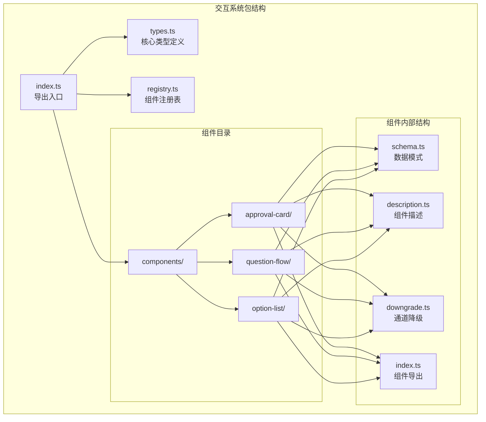
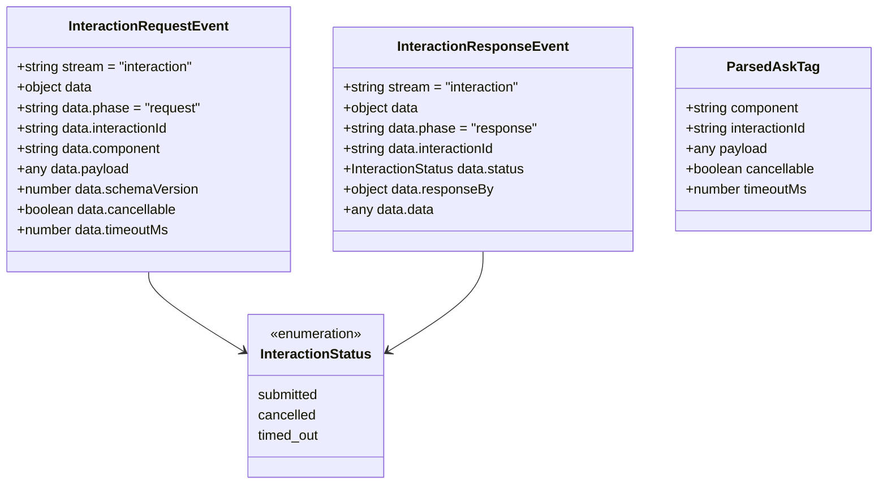
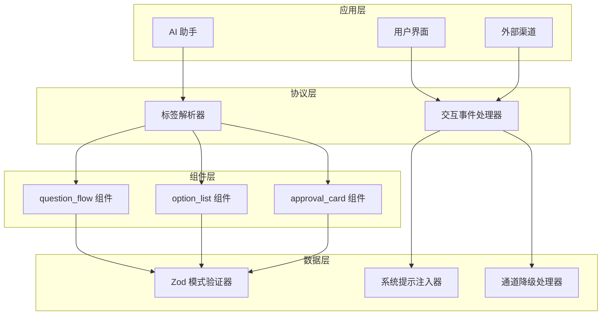
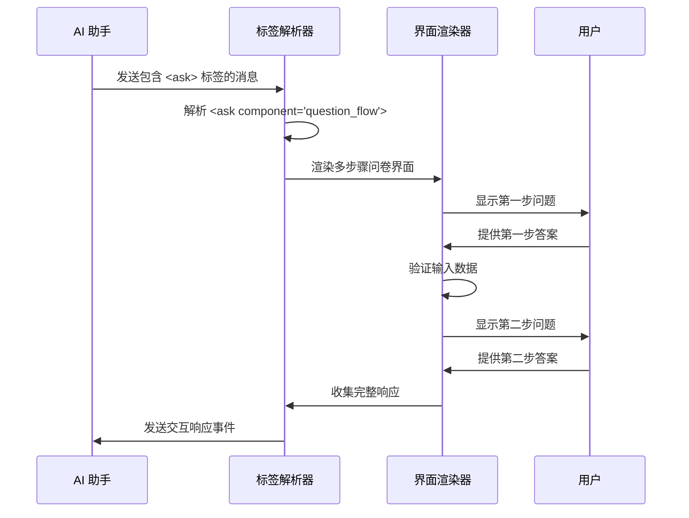
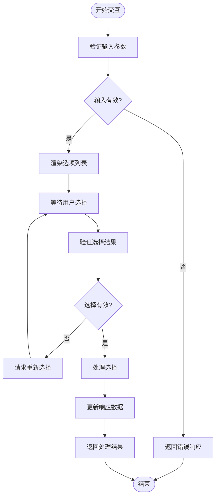
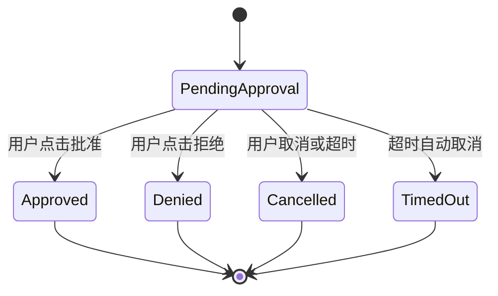
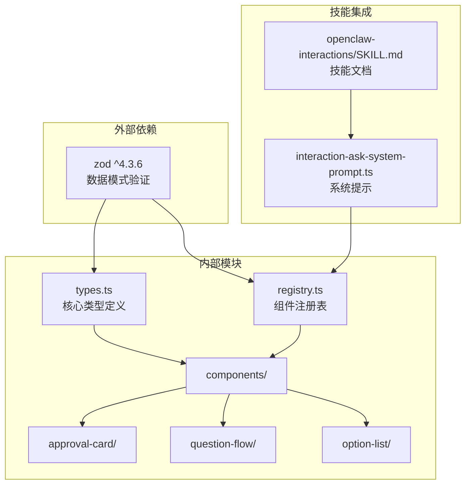

# 交互系统包

<cite>
**本文档引用的文件**
- [packages/interactions/src/index.ts](file://packages/interactions/src/index.ts)
- [packages/interactions/src/types.ts](file://packages/interactions/src/types.ts)
- [packages/interactions/src/registry.ts](file://packages/interactions/src/registry.ts)
- [packages/interactions/src/components/approval-card/index.ts](file://packages/interactions/src/components/approval-card/index.ts)
- [packages/interactions/src/components/question-flow/index.ts](file://packages/interactions/src/components/question-flow/index.ts)
- [packages/interactions/src/components/option-list/index.ts](file://packages/interactions/src/components/option-list/index.ts)
- [packages/interactions/src/components/approval-card/schema.ts](file://packages/interactions/src/components/approval-card/schema.ts)
- [packages/interactions/src/components/question-flow/schema.ts](file://packages/interactions/src/components/question-flow/schema.ts)
- [packages/interactions/src/components/option-list/schema.ts](file://packages/interactions/src/components/option-list/schema.ts)
- [skills/openclaw-interactions/SKILL.md](file://skills/openclaw-interactions/SKILL.md)
- [src/auto-reply/reply/interaction-ask-system-prompt.ts](file://src/auto-reply/reply/interaction-ask-system-prompt.ts)
</cite>

## 目录
1. [简介](#简介)
2. [项目结构](#项目结构)
3. [核心组件](#核心组件)
4. [架构概览](#架构概览)
5. [详细组件分析](#详细组件分析)
6. [依赖关系分析](#依赖关系分析)
7. [性能考虑](#性能考虑)
8. [故障排除指南](#故障排除指南)
9. [结论](#结论)

## 简介

交互系统包是 OpenClaw 人工智能助手平台中的核心组件，负责提供结构化的用户交互协议和组件。该包实现了基于 `<ask>` 标签的交互协议，允许 AI 助手向用户请求结构化输入，而不是依赖于自由格式的文本回答。

该系统提供了三种主要的交互组件：
- **question_flow**: 多步骤问卷调查组件
- **option_list**: 单步骤选项列表组件  
- **approval_card**: 明确的批准/拒绝确认组件

通过标准化的交互协议，OpenClaw 能够在不同的通信渠道（如 Telegram、Discord、WebChat 等）上提供一致的用户体验，同时确保数据的结构化和可验证性。

## 项目结构

交互系统包采用模块化设计，主要包含以下结构：

**图表来源**
- [packages/interactions/src/index.ts:1-6](file://packages/interactions/src/index.ts#L1-L6)
- [packages/interactions/src/registry.ts:1-70](file://packages/interactions/src/registry.ts#L1-L70)

**章节来源**
- [packages/interactions/src/index.ts:1-6](file://packages/interactions/src/index.ts#L1-L6)
- [packages/interactions/src/registry.ts:1-70](file://packages/interactions/src/registry.ts#L1-L70)

## 核心组件

交互系统包的核心由三个主要组件构成，每个组件都有其特定的用途和数据模式：

### 1. 交互组件清单

系统维护一个中央注册表，包含所有可用的交互组件：

**图表来源**
- [packages/interactions/src/registry.ts:12-16](file://packages/interactions/src/registry.ts#L12-L16)
- [packages/interactions/src/types.ts:55-71](file://packages/interactions/src/types.ts#L55-L71)

### 2. 核心数据类型

系统使用 Zod 模式验证器来确保数据的完整性和一致性：

**图表来源**
- [packages/interactions/src/types.ts:10-82](file://packages/interactions/src/types.ts#L10-L82)

**章节来源**
- [packages/interactions/src/types.ts:1-83](file://packages/interactions/src/types.ts#L1-L83)
- [packages/interactions/src/registry.ts:1-70](file://packages/interactions/src/registry.ts#L1-L70)

## 架构概览

交互系统包采用分层架构设计，确保了组件间的松耦合和高内聚：

**图表来源**
- [skills/openclaw-interactions/SKILL.md:1-218](file://skills/openclaw-interactions/SKILL.md#L1-L218)
- [src/auto-reply/reply/interaction-ask-system-prompt.ts:1-59](file://src/auto-reply/reply/interaction-ask-system-prompt.ts#L1-L59)

系统的工作流程如下：

1. **AI 助手生成 <ask> 标签**：AI 助手在响应中嵌入结构化的 `<ask>` 标签
2. **标签解析**：系统解析 `<ask>` 标签并验证数据模式
3. **组件渲染**：根据组件类型渲染相应的用户界面
4. **用户交互**：用户通过界面提供结构化输入
5. **响应处理**：系统处理用户响应并继续对话流程

**章节来源**
- [skills/openclaw-interactions/SKILL.md:1-218](file://skills/openclaw-interactions/SKILL.md#L1-L218)

## 详细组件分析

### 1. Question Flow 组件

Question Flow 组件用于创建多步骤的结构化问卷调查：

**图表来源**
- [packages/interactions/src/components/question-flow/index.ts:15-39](file://packages/interactions/src/components/question-flow/index.ts#L15-L39)
- [packages/interactions/src/components/question-flow/schema.ts:27-42](file://packages/interactions/src/components/question-flow/schema.ts#L27-L42)

#### 数据模式特点

Question Flow 使用嵌套的数据结构来支持复杂的多步骤交互：

| 字段名 | 类型 | 必需 | 描述 |
|--------|------|------|------|
| id | string | 是 | 流程标识符 |
| steps | Array[Step] | 是 | 步骤数组 |
| Step.id | string | 是 | 步骤标识符 |
| Step.title | string | 是 | 步骤标题 |
| Step.options | Array[Option] | 是 | 选项列表 |
| Option.id | string | 是 | 选项标识符 |
| Option.label | string | 是 | 选项标签 |
| selectionMode | enum | 否 | 选择模式（single/multi） |

**章节来源**
- [packages/interactions/src/components/question-flow/schema.ts:1-43](file://packages/interactions/src/components/question-flow/schema.ts#L1-L43)

### 2. Option List 组件

Option List 组件提供单步骤的选择列表功能：

**图表来源**
- [packages/interactions/src/components/option-list/schema.ts:10-54](file://packages/interactions/src/components/option-list/schema.ts#L10-L54)

#### 高级验证规则

Option List 组件实现了复杂的验证逻辑：

1. **范围验证**：确保 `minSelections` 不大于 `maxSelections`
2. **唯一性检查**：验证选项 ID 的唯一性
3. **数据完整性**：确保所有必需字段都存在

**章节来源**
- [packages/interactions/src/components/option-list/schema.ts:21-44](file://packages/interactions/src/components/option-list/schema.ts#L21-L44)

### 3. Approval Card 组件

Approval Card 组件专门用于处理需要明确批准或拒绝的操作：

**图表来源**
- [packages/interactions/src/components/approval-card/schema.ts:23-27](file://packages/interactions/src/components/approval-card/schema.ts#L23-L27)

#### 变体支持

Approval Card 支持两种视觉变体：

| 变体名称 | 用途 | 视觉效果 |
|----------|------|----------|
| default | 普通操作确认 | 标准样式 |
| destructive | 破坏性操作确认 | 危险警告样式 |

**章节来源**
- [packages/interactions/src/components/approval-card/schema.ts:1-30](file://packages/interactions/src/components/approval-card/schema.ts#L1-L30)

## 依赖关系分析

交互系统包的依赖关系相对简单且集中：

**图表来源**
- [packages/interactions/package.json:15-17](file://packages/interactions/package.json#L15-L17)
- [packages/interactions/src/index.ts:1-6](file://packages/interactions/src/index.ts#L1-L6)

### 模块间依赖

系统采用清晰的模块边界设计：

1. **types.ts** 作为所有组件的基础类型定义
2. **registry.ts** 管理组件注册和系统提示生成
3. **components/** 目录下的具体组件实现
4. **技能集成** 通过文档和系统提示进行连接

**章节来源**
- [packages/interactions/package.json:1-19](file://packages/interactions/package.json#L1-L19)

## 性能考虑

交互系统包在设计时考虑了多个性能方面：

### 1. 内存优化

- **组件注册表缓存**：注册表在模块加载时初始化，避免重复计算
- **类型验证器复用**：Zod 模式验证器在模块级别缓存
- **字符串常量优化**：系统提示和组件描述作为常量存储

### 2. 运行时性能

- **异步验证**：数据验证采用异步模式，避免阻塞主线程
- **最小化序列化**：只传输必要的数据字段
- **事件驱动架构**：使用事件处理器减少不必要的计算

### 3. 扩展性考虑

- **插件化架构**：新的交互组件可以轻松添加到注册表中
- **配置驱动**：通过配置文件控制组件行为
- **通道适配器**：支持不同通信渠道的优化

## 故障排除指南

### 常见问题及解决方案

#### 1. <ask> 标签解析失败

**症状**：AI 助手发出的 `<ask>` 标签无法被正确解析

**可能原因**：
- JSON 格式不正确
- 缺少必需字段
- 组件名称无效

**解决方法**：
1. 验证 JSON 格式的正确性
2. 检查必需字段是否完整
3. 确认组件名称在注册表中存在

#### 2. 数据验证错误

**症状**：用户提交的数据无法通过验证

**可能原因**：
- 选项 ID 重复
- 选择数量超出限制
- 数据类型不匹配

**解决方法**：
1. 检查选项 ID 的唯一性
2. 验证选择数量范围
3. 确认数据类型符合模式要求

#### 3. 通道兼容性问题

**症状**：某些通信渠道无法正确显示交互组件

**可能原因**：
- 渠道不支持交互功能
- 渠道能力限制
- 降级处理失败

**解决方法**：
1. 检查渠道的交互能力
2. 实现适当的降级策略
3. 提供替代的文本交互方式

**章节来源**
- [skills/openclaw-interactions/SKILL.md:185-210](file://skills/openclaw-interactions/SKILL.md#L185-L210)

## 结论

交互系统包为 OpenClaw 平台提供了强大而灵活的结构化交互能力。通过标准化的 `<ask>` 协议和模块化的组件设计，该系统能够：

1. **统一用户体验**：在不同通信渠道上提供一致的交互体验
2. **确保数据质量**：通过严格的模式验证保证数据的完整性和准确性
3. **支持扩展发展**：模块化设计便于添加新的交互组件和功能
4. **提高开发效率**：清晰的接口和文档降低了开发和维护成本

该系统的成功在于其平衡了功能的丰富性与实现的简洁性，既满足了复杂交互场景的需求，又保持了良好的性能和可维护性。随着 OpenClaw 平台的发展，交互系统包将继续演进，为用户提供更加智能和便捷的交互体验。