# 网关协议增强

<cite>
**本文档引用的文件**
- [protocol.md](file://docs/gateway/protocol.md)
- [bridge-protocol.md](file://docs/gateway/bridge-protocol.md)
- [protocol-schemas.ts](file://src/gateway/protocol/schema/protocol-schemas.ts)
- [frames.ts](file://src/gateway/protocol/schema/frames.ts)
- [agents-models-skills.ts](file://src/gateway/protocol/schema/agents-models-skills.ts)
- [channels.ts](file://src/gateway/protocol/schema/channels.ts)
- [config.ts](file://src/gateway/protocol/schema/config.ts)
- [devices.ts](file://src/gateway/protocol/schema/devices.ts)
- [primitives.ts](file://src/gateway/protocol/schema/primitives.ts)
- [sessions.ts](file://src/gateway/protocol/schema/sessions.ts)
- [wizard.ts](file://src/gateway/protocol/schema/wizard.ts)
- [logs-chat.ts](file://src/gateway/protocol/schema/logs-chat.ts)
- [exec-approvals.ts](file://src/gateway/protocol/schema/exec-approvals.ts)
- [protocol-gen.ts](file://scripts/protocol-gen.ts)
- [protocol-gen-swift.ts](file://scripts/protocol-gen-swift.ts)
</cite>

## 更新摘要
**所做更改**
- 新增了配置管理系统的详细说明，包括配置应用、补丁和提供程序配置
- 增强了设备配对和令牌管理功能的描述
- 扩展了会话管理功能，包括会话标签、策略和使用情况分析
- 新增了向导(wizard)系统和执行审批(exec approvals)系统的协议定义
- 完善了聊天和日志系统的协议规范
- 更新了代理、模型和技能管理的类型定义

## 目录
1. [简介](#简介)
2. [项目结构](#项目结构)
3. [核心组件](#核心组件)
4. [架构概览](#架构概览)
5. [详细组件分析](#详细组件分析)
6. [新增功能详解](#新增功能详解)
7. [依赖关系分析](#依赖关系分析)
8. [性能考虑](#性能考虑)
9. [故障排除指南](#故障排除指南)
10. [结论](#结论)

## 简介

OpenClaw 网关协议是一个统一的 WebSocket 协议，作为 OpenClaw 的单一控制平面和节点传输层。该协议支持所有客户端（CLI、Web UI、macOS 应用、iOS/Android 节点、无头节点）通过 WebSocket 连接，并在握手时声明其角色和作用域。

协议设计的核心目标是提供一个安全、可扩展、版本化的通信框架，支持设备身份验证、权限控制、状态同步和事件驱动的交互模式。最新的增强包括更强大的配置管理系统、设备配对功能、会话管理和向导系统等。

## 项目结构

网关协议相关的代码主要分布在以下目录结构中：

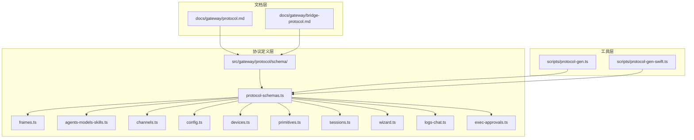

**图表来源**
- [protocol.md:1-268](file://docs/gateway/protocol.md#L1-L268)
- [protocol-schemas.ts:1-318](file://src/gateway/protocol/schema/protocol-schemas.ts#L1-L318)

**章节来源**
- [protocol.md:1-268](file://docs/gateway/protocol.md#L1-L268)
- [protocol-schemas.ts:1-318](file://src/gateway/protocol/schema/protocol-schemas.ts#L1-L318)

## 核心组件

### 协议版本管理

协议采用版本化设计，当前版本为 3，通过 `PROTOCOL_VERSION` 常量进行管理：

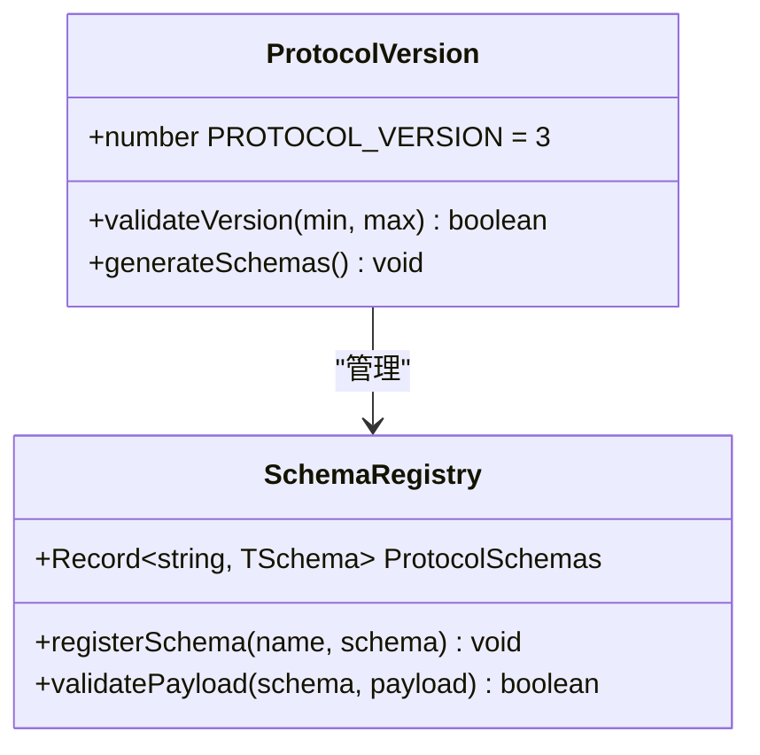

**图表来源**
- [protocol-schemas.ts:317-318](file://src/gateway/protocol/schema/protocol-schemas.ts#L317-L318)

### 连接握手机制

连接握手包含挑战-响应认证流程，确保设备身份的真实性和安全性：

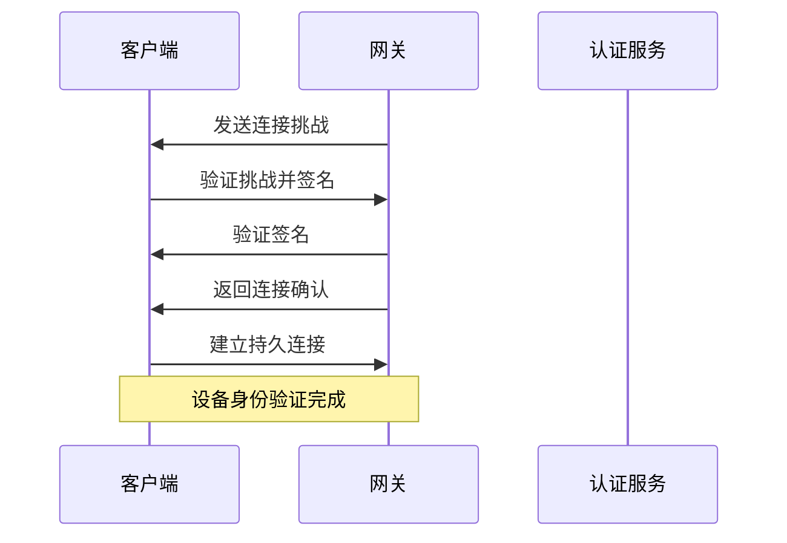

**图表来源**
- [protocol.md:22-90](file://docs/gateway/protocol.md#L22-L90)

### 框架类型系统

协议使用 TypeBox 定义严格的数据结构，确保类型安全和序列化一致性：

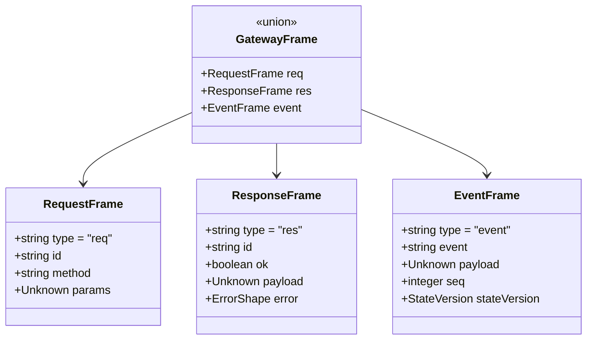

**图表来源**
- [frames.ts:160-164](file://src/gateway/protocol/schema/frames.ts#L160-L164)

**章节来源**
- [protocol.md:191-268](file://docs/gateway/protocol.md#L191-L268)
- [frames.ts:1-164](file://src/gateway/protocol/schema/frames.ts#L1-L164)

## 架构概览

网关协议采用分层架构设计，从底层传输到高层业务逻辑形成清晰的抽象层次：

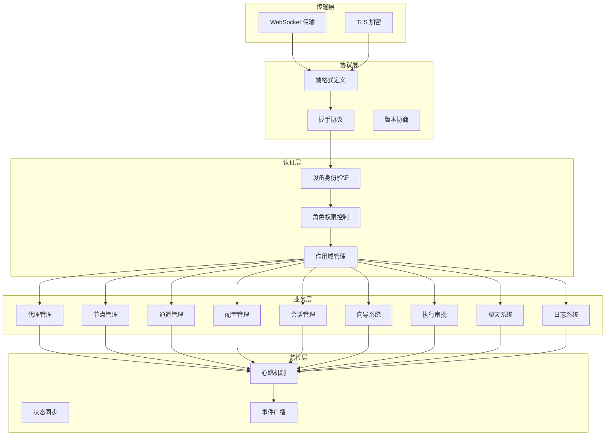

**图表来源**
- [protocol.md:10-268](file://docs/gateway/protocol.md#L10-L268)

## 详细组件分析

### 设备身份与配对系统

设备身份系统是协议安全性的核心，通过公钥签名和挑战-响应机制确保设备真实性：

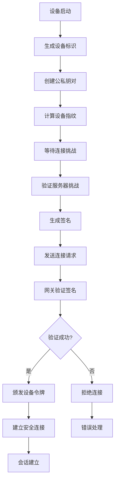

**图表来源**
- [protocol.md:216-256](file://docs/gateway/protocol.md#L216-L256)

### 角色与权限模型

协议定义了两种主要角色及其权限范围：

| 角色 | 权限范围 | 主要功能 | 作用域示例 |
|------|----------|----------|------------|
| operator | 控制平面 | CLI/UI/自动化 | operator.read, operator.write, operator.admin |
| node | 能力主机 | 摄像头/屏幕/画布 | camera, screen, canvas, location, voice |

**章节来源**
- [protocol.md:135-189](file://docs/gateway/protocol.md#L135-L189)

### 节点管理协议

节点管理协议提供了完整的节点生命周期管理能力：

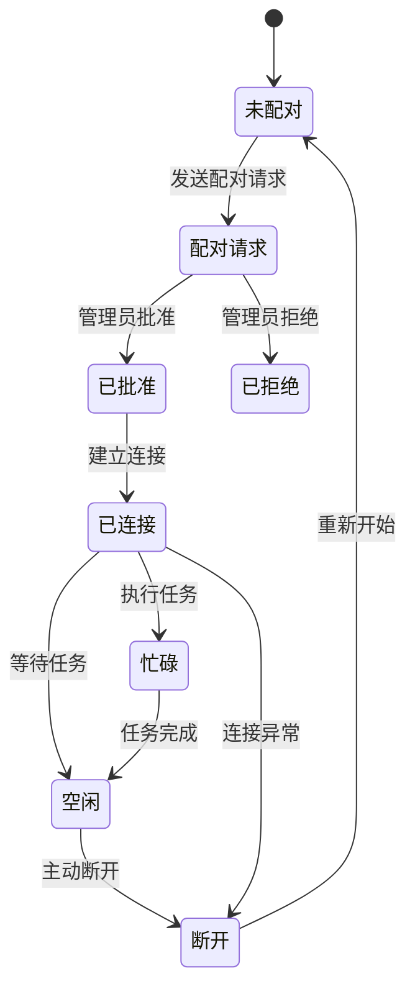

**图表来源**
- [nodes.ts:12-45](file://src/gateway/protocol/schema/nodes.ts#L12-L45)

**章节来源**
- [nodes.ts:1-167](file://src/gateway/protocol/schema/nodes.ts#L1-L167)

### 代理通信协议

代理通信协议支持复杂的消息传递和状态管理：

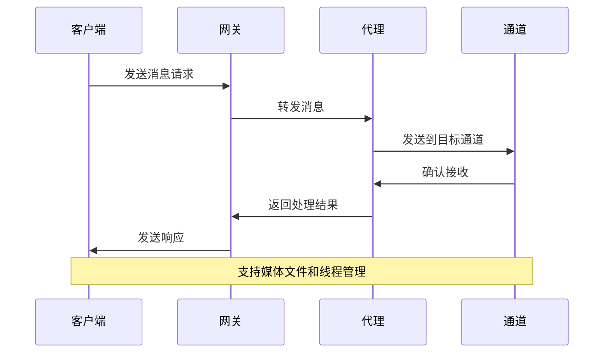

**图表来源**
- [agent.ts:33-117](file://src/gateway/protocol/schema/agent.ts#L33-L117)

**章节来源**
- [agent.ts:1-152](file://src/gateway/protocol/schema/agent.ts#L1-L152)

## 新增功能详解

### 配置管理系统增强

配置管理系统现在提供更强大的配置管理和版本控制能力：

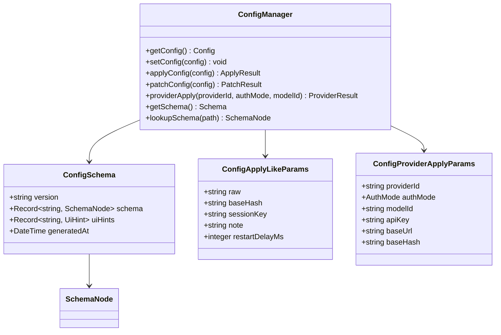

**图表来源**
- [config.ts:32-44](file://src/gateway/protocol/schema/config.ts#L32-L44)
- [config.ts:20-30](file://src/gateway/protocol/schema/config.ts#L20-L30)

**章节来源**
- [config.ts:1-113](file://src/gateway/protocol/schema/config.ts#L1-L113)

### 设备配对和令牌管理

设备配对系统现在支持更精细的令牌管理和安全控制：

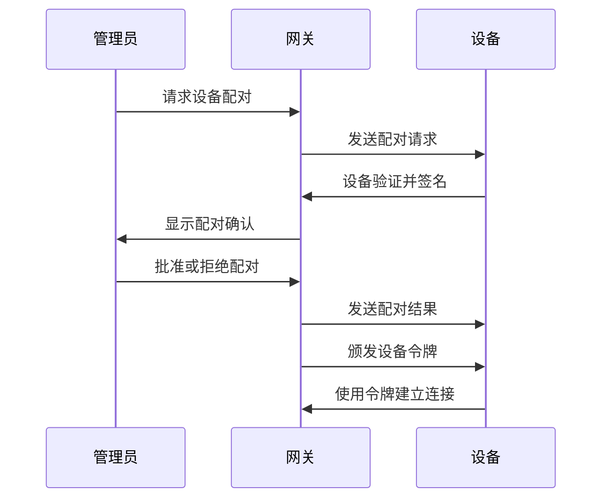

**图表来源**
- [devices.ts:38-67](file://src/gateway/protocol/schema/devices.ts#L38-L67)

**章节来源**
- [devices.ts:1-68](file://src/gateway/protocol/schema/devices.ts#L1-L68)

### 会话管理增强

会话管理系统现在支持更丰富的标签、策略和使用情况分析：

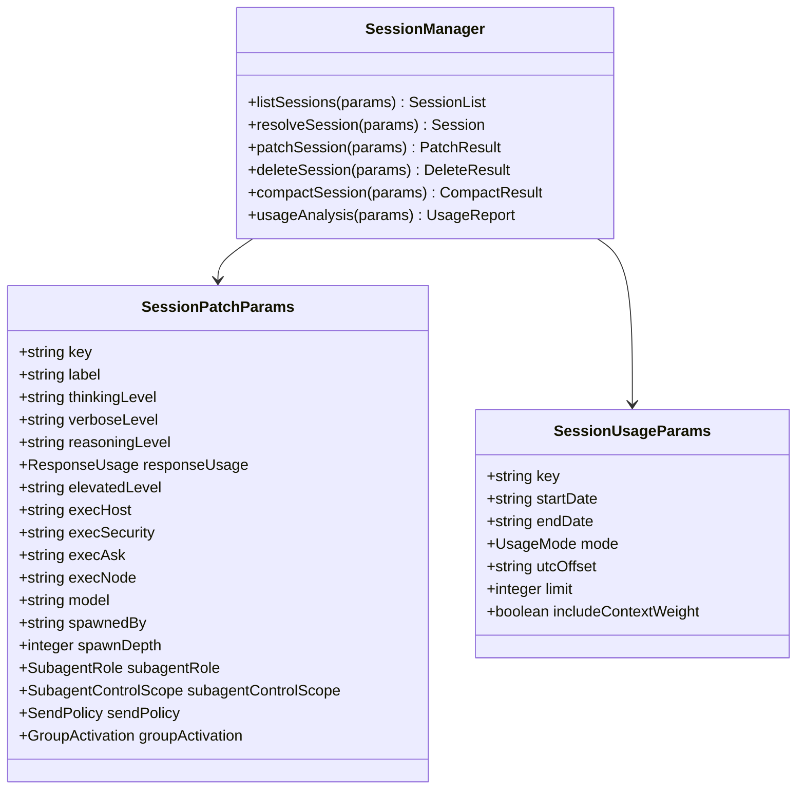

**图表来源**
- [sessions.ts:50-89](file://src/gateway/protocol/schema/sessions.ts#L50-L89)
- [sessions.ts:117-137](file://src/gateway/protocol/schema/sessions.ts#L117-L137)

**章节来源**
- [sessions.ts:1-138](file://src/gateway/protocol/schema/sessions.ts#L1-L138)

### 向导系统协议

向导系统提供了一种结构化的用户引导体验：

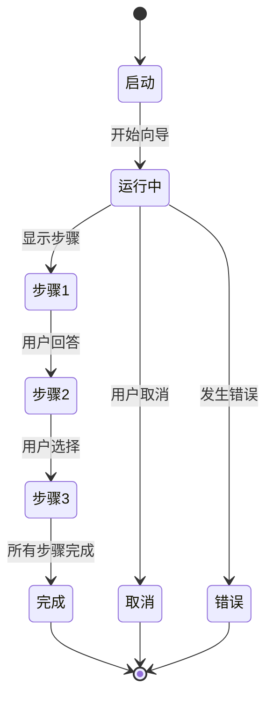

**图表来源**
- [wizard.ts:4-9](file://src/gateway/protocol/schema/wizard.ts#L4-L9)

**章节来源**
- [wizard.ts:1-104](file://src/gateway/protocol/schema/wizard.ts#L1-L104)

### 执行审批系统

执行审批系统提供了细粒度的命令执行控制：

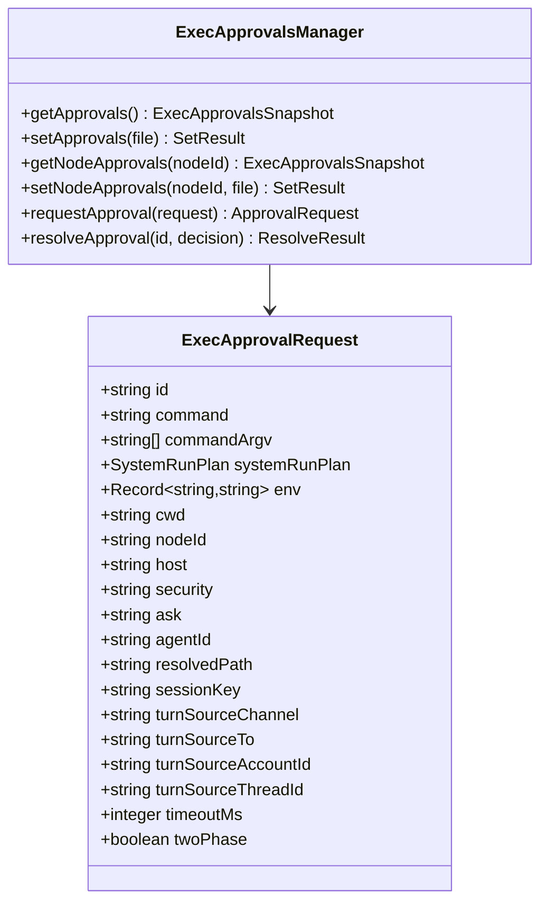

**图表来源**
- [exec-approvals.ts:88-136](file://src/gateway/protocol/schema/exec-approvals.ts#L88-L136)

**章节来源**
- [exec-approvals.ts:1-145](file://src/gateway/protocol/schema/exec-approvals.ts#L1-L145)

### 聊天和日志系统

聊天和日志系统提供了完整的消息传递和日志管理功能：

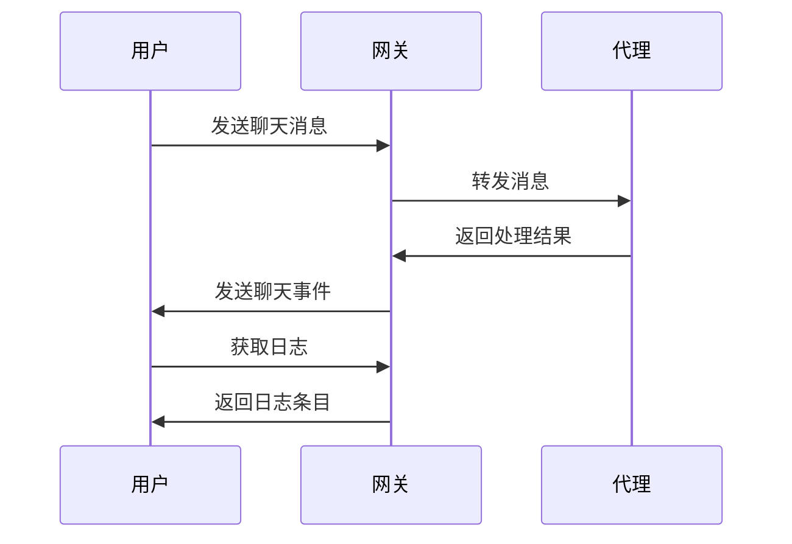

**图表来源**
- [logs-chat.ts:26-97](file://src/gateway/protocol/schema/logs-chat.ts#L26-L97)

**章节来源**
- [logs-chat.ts:1-98](file://src/gateway/protocol/schema/logs-chat.ts#L1-L98)

## 依赖关系分析

协议的依赖关系体现了模块化设计和松耦合原则：

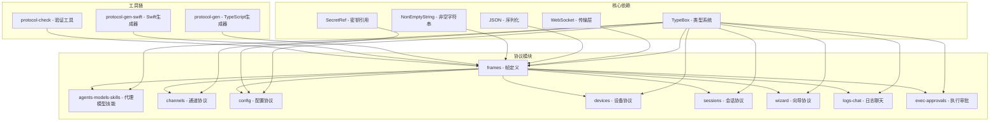

**图表来源**
- [protocol-schemas.ts:1-67](file://src/gateway/protocol/schema/protocol-schemas.ts#L1-L67)

**章节来源**
- [protocol-schemas.ts:1-318](file://src/gateway/protocol/schema/protocol-schemas.ts#L1-L318)

## 性能考虑

协议在设计时充分考虑了性能优化和资源管理：

### 连接池管理
- 最大并发连接数限制
- 连接超时和重连策略
- 内存使用优化

### 数据传输优化
- 帧大小限制和缓冲区管理
- 压缩和编码优化
- 流量控制和背压处理

### 缓存策略
- 状态快照缓存
- 配置变更通知
- 事件去重和合并

### 新增功能的性能考虑
- 配置管理的缓存机制
- 设备配对的异步处理
- 会话管理的索引优化
- 向导系统的状态持久化

## 故障排除指南

### 常见连接问题

| 问题类型 | 错误代码 | 可能原因 | 解决方案 |
|----------|----------|----------|----------|
| 设备认证失败 | DEVICE_AUTH_* | 设备签名验证失败 | 检查设备证书和签名算法 |
| 协议版本不匹配 | PROTOCOL_VERSION_MISMATCH | 客户端版本过旧 | 更新客户端到最新版本 |
| 权限不足 | INSUFFICIENT_PERMISSIONS | 作用域权限不足 | 申请相应的作用域权限 |
| 连接超时 | CONNECTION_TIMEOUT | 网络延迟过高 | 检查网络连接和防火墙设置 |
| 配置应用失败 | CONFIG_APPLY_ERROR | 配置格式错误 | 验证配置格式和语法 |
| 设备配对超时 | DEVICE_PAIR_TIMEOUT | 设备响应慢 | 检查设备网络连接 |

### 调试工具和方法

1. **协议日志分析**
   - 启用详细日志记录
   - 分析帧序列和时间戳
   - 监控连接状态变化

2. **性能监控**
   - 连接建立时间测量
   - 帧传输延迟统计
   - 内存使用情况监控

3. **故障诊断流程**
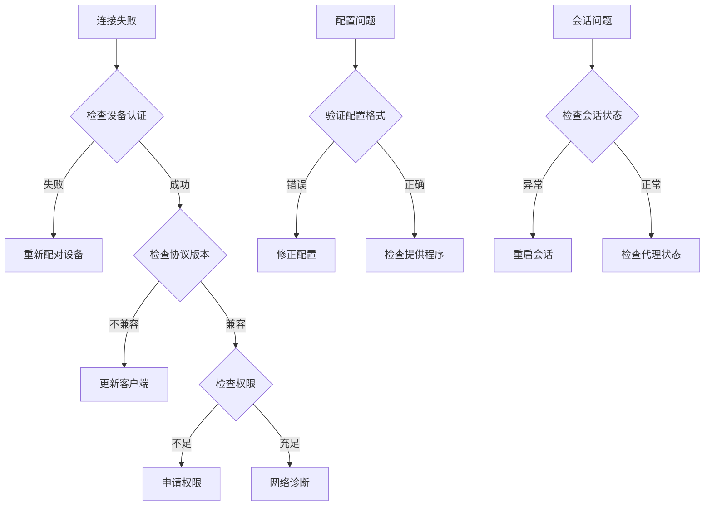

**章节来源**
- [protocol.md:231-256](file://docs/gateway/protocol.md#L231-L256)

## 结论

OpenClaw 网关协议通过其精心设计的架构和严格的类型系统，为分布式代理系统提供了强大而灵活的通信基础。最新的增强功能进一步提升了协议的功能性和可用性：

1. **安全性**：基于设备身份验证和角色权限控制的安全模型
2. **可扩展性**：模块化的协议设计支持新功能的增量添加
3. **可靠性**：完善的错误处理和恢复机制
4. **性能**：优化的数据传输和资源管理策略
5. **易用性**：增强的配置管理、设备配对和会话管理功能
6. **完整性**：全面的向导系统和执行审批机制

协议的持续演进将继续关注安全性、性能、易用性和完整性的平衡，为 OpenClaw 生态系统的各种应用场景提供可靠的技术支撑。