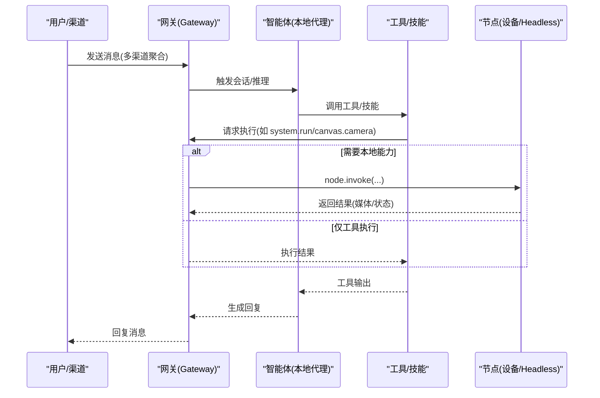
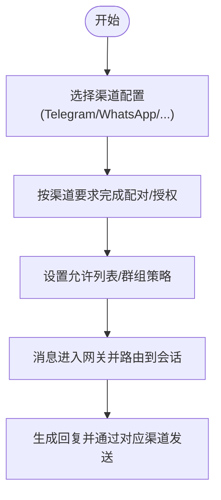
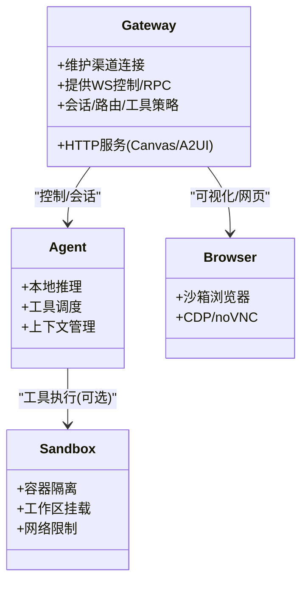
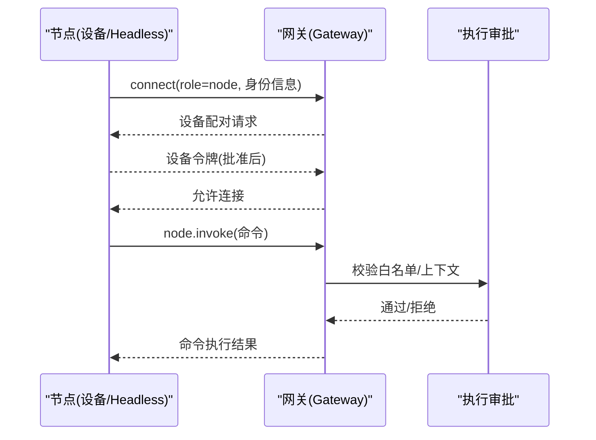
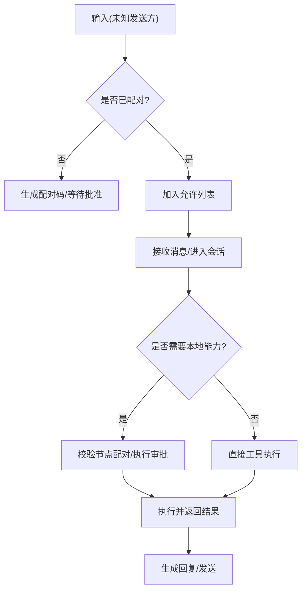
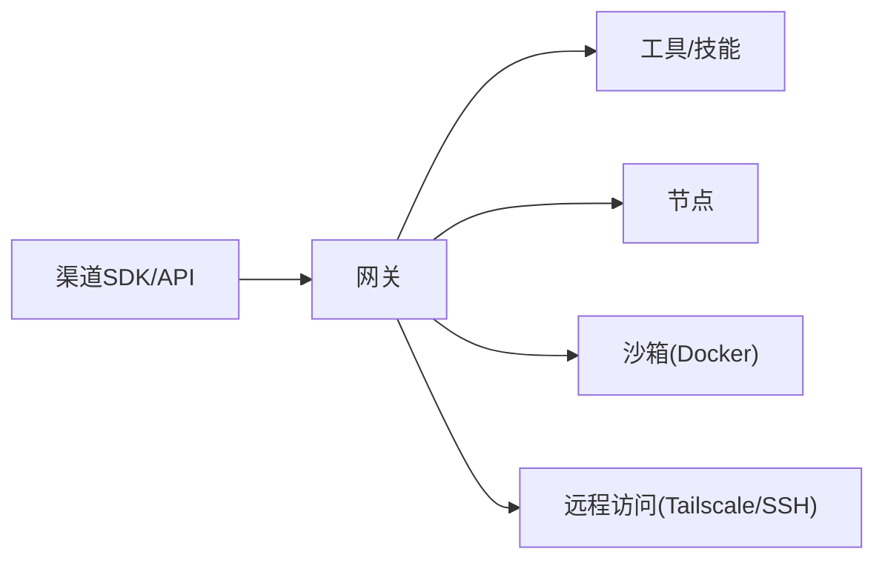

# 核心价值与功能特性

<cite>
**本文引用的文件**
- [README.md](file://README.md)
- [VISION.md](file://VISION.md)
- [docs/concepts/architecture.md](file://docs/concepts/architecture.md)
- [docs/gateway/index.md](file://docs/gateway/index.md)
- [docs/channels/index.md](file://docs/channels/index.md)
- [docs/nodes/index.md](file://docs/nodes/index.md)
- [docs/start/getting-started.md](file://docs/start/getting-started.md)
- [docs/tools/skills.md](file://docs/tools/skills.md)
- [docs/gateway/sandboxing.md](file://docs/gateway/sandboxing.md)
- [docs/gateway/security/index.md](file://docs/gateway/security/index.md)
</cite>

## 目录

1. [引言](#引言)
2. [项目结构](#项目结构)
3. [核心组件](#核心组件)
4. [架构总览](#架构总览)
5. [详细组件分析](#详细组件分析)
6. [依赖关系分析](#依赖关系分析)
7. [性能考量](#性能考量)
8. [故障排查指南](#故障排查指南)
9. [结论](#结论)
10. [附录](#附录)

## 引言

OpenClaw 是一个“个人 AI 助手”，强调在你的设备上运行、在你已使用的聊天渠道中工作，并由你制定规则。它通过单一网关（Gateway）作为控制平面，统一管理会话、通道、工具与事件；同时支持多平台节点（macOS/iOS/Android/Headless）进行本地执行与能力扩展。其核心价值在于：

- 安全与隐私优先：默认强安全策略、可选沙箱、端到端信任链与设备配对机制
- 本地化运行：模型与工具执行尽可能在本地完成，减少云端暴露面
- 多渠道聚合：覆盖 40+ 消息平台，统一入口与路由
- 跨平台节点控制：通过 WebSocket 连接的节点实现本地能力（相机、屏幕录制、系统命令、通知等）的受控调用

这些特性共同构成 OpenClaw 的差异化优势：在不牺牲易用性与能力的前提下，最大化地尊重用户的安全与隐私边界。

## 项目结构

从整体上看，OpenClaw 采用“网关控制平面 + 多客户端/节点”的架构。网关负责：

- 维持各消息渠道连接
- 提供 WebSocket 控制/RPC 与 HTTP 接口
- 管理会话、路由、工具策略与安全策略
- 托管 Canvas/A2UI 与远程访问（Tailscale/SSH）

客户端与节点通过同一网关端口连接，但角色不同：

- 客户端（mac 应用/CLI/Web）：操作与控制
- 节点（设备/Headless）：本地能力与资源的受控执行

```mermaid
graph TB
subgraph "本地主机"
GW["网关(Gateway)<br/>WebSocket/HTTP"]
UI["控制界面(Web/UI)"]
CLI["命令行(openclaw ...)"]
MAC["macOS 应用(菜单栏/节点模式)"]
NODES["节点(设备/Headless)<br/>Canvas/相机/屏幕录制/系统命令"]
end
subgraph "外部消息渠道"
WA["WhatsApp"]
TG["Telegram"]
SL["Slack"]
DC["Discord"]
GC["Google Chat"]
SI["Signal"]
IM["iMessage/BlueBubbles"]
IR["IRC"]
MT["Microsoft Teams"]
MX["Matrix"]
FE["Feishu"]
LI["LINE"]
MM["Mattermost"]
NT["Nextcloud Talk"]
NS["Nostr"]
SC["Synology Chat"]
TL["Tlon"]
TW["Twitch"]
ZA["Zalo/Zalo Personal"]
WC["WebChat"]
end
UI --> GW
CLI --> GW
MAC --> GW
NODES --> GW
GW <- --> WA
GW <- --> TG
GW <- --> SL
GW <- --> DC
GW <- --> GC
GW <- --> SI
GW <- --> IM
GW <- --> IR
GW <- --> MT
GW <- --> MX
GW <- --> FE
GW <- --> LI
GW <- --> MM
GW <- --> NT
GW <- --> NS
GW <- --> SC
GW <- --> TL
GW <- --> TW
GW <- --> ZA
GW <- --> WC
```

图示来源

- [docs/concepts/architecture.md:12-26](file://docs/concepts/architecture.md#L12-L26)
- [docs/gateway/index.md:68-77](file://docs/gateway/index.md#L68-L77)
- [docs/channels/index.md:14-38](file://docs/channels/index.md#L14-L38)

章节来源

- [docs/concepts/architecture.md:8-140](file://docs/concepts/architecture.md#L8-L140)
- [docs/gateway/index.md:27-262](file://docs/gateway/index.md#L27-L262)
- [docs/channels/index.md:9-48](file://docs/channels/index.md#L9-L48)

## 核心组件

- 网关（Gateway）
  - 单一长连接的控制平面，承载消息渠道、会话、工具与事件
  - 提供 WebSocket 控制/RPC 与 HTTP 接口，默认绑定回环地址
  - 支持热重载、健康检查、远程访问（Tailscale/SSH）
- 客户端
  - macOS 应用、CLI、Web 控制台，均通过 WebSocket 连接网关
- 节点（Nodes）
  - 设备或 Headless 主机，以 role=node 连接网关，暴露命令集（Canvas、相机、屏幕录制、位置、系统命令等）
  - 通过设备配对与执行审批（Exec Approvals）确保本地能力受控

章节来源

- [docs/concepts/architecture.md:27-140](file://docs/concepts/architecture.md#L27-L140)
- [docs/gateway/index.md:68-262](file://docs/gateway/index.md#L68-L262)
- [docs/nodes/index.md:10-385](file://docs/nodes/index.md#L10-L385)

## 架构总览

下图展示了从消息进入网关到工具执行的关键路径，以及节点能力如何被受控调用：



图示来源

- [docs/concepts/architecture.md:59-78](file://docs/concepts/architecture.md#L59-L78)
- [docs/nodes/index.md:159-328](file://docs/nodes/index.md#L159-L328)

章节来源

- [docs/concepts/architecture.md:59-78](file://docs/concepts/architecture.md#L59-L78)
- [docs/nodes/index.md:159-328](file://docs/nodes/index.md#L159-L328)

## 详细组件分析

### 多渠道消息聚合（WhatsApp、Telegram、Slack、Discord 等 40+ 平台）

- 聚合方式：所有渠道消息经由网关统一接入，避免分散登录与状态管理
- 安全策略：默认 DM 配对与允许列表，未知发送方需经批准后方可交互
- 可靠性：每个渠道独立维护连接与路由，支持同时启用多个渠道
- 快速上手：推荐 Telegram（简单 Bot Token），WhatsApp 需要二维码配对



图示来源

- [docs/channels/index.md:14-48](file://docs/channels/index.md#L14-L48)
- [docs/start/getting-started.md:28-102](file://docs/start/getting-started.md#L28-L102)

章节来源

- [docs/channels/index.md:14-48](file://docs/channels/index.md#L14-L48)
- [docs/start/getting-started.md:28-102](file://docs/start/getting-started.md#L28-L102)

### 本地化 AI 代理运行

- 本地执行：网关作为控制平面，工具执行可在宿主或容器沙箱内进行
- 沙箱模式：可按会话/代理/共享作用域隔离，限制文件系统与网络访问
- 浏览器与可视化：支持沙箱浏览器与 Canvas/A2UI，便于网页交互与可视化工作区



图示来源

- [docs/gateway/index.md:68-77](file://docs/gateway/index.md#L68-L77)
- [docs/gateway/sandboxing.md:8-260](file://docs/gateway/sandboxing.md#L8-L260)

章节来源

- [docs/gateway/index.md:68-77](file://docs/gateway/index.md#L68-L77)
- [docs/gateway/sandboxing.md:8-260](file://docs/gateway/sandboxing.md#L8-L260)

### 跨平台设备节点控制

- 节点角色：以 role=node 连接网关，暴露命令集（Canvas、相机、屏幕录制、位置、系统命令等）
- 设备配对：首次连接需要设备配对与批准，后续使用设备令牌自动连接
- 执行审批：在节点主机侧维护执行白名单，防止未授权命令执行
- 远程节点：可通过 SSH 隧道或 Tailscale 将节点连接到远端网关



图示来源

- [docs/nodes/index.md:24-158](file://docs/nodes/index.md#L24-L158)
- [docs/gateway/security/index.md:98-109](file://docs/gateway/security/index.md#L98-L109)

章节来源

- [docs/nodes/index.md:24-158](file://docs/nodes/index.md#L24-L158)
- [docs/gateway/security/index.md:98-109](file://docs/gateway/security/index.md#L98-L109)

### 安全与隐私：默认强安全、可选沙箱、端到端信任

- 默认策略：DM 配对与允许列表、非本地连接仍需显式批准
- 网关与节点信任概念：网关是策略面，节点是执行面；二者组成统一的信任域
- 沙箱与工具策略：工具执行前先过工具策略，再决定是否进入沙箱
- 远程访问：建议使用 Tailscale 或 SSH 隧道，结合认证与可选 TLS



图示来源

- [docs/gateway/security/index.md:98-109](file://docs/gateway/security/index.md#L98-L109)
- [docs/nodes/index.md:24-158](file://docs/nodes/index.md#L24-L158)

章节来源

- [docs/gateway/security/index.md:98-109](file://docs/gateway/security/index.md#L98-L109)
- [docs/nodes/index.md:24-158](file://docs/nodes/index.md#L24-L158)

### 技能与工具生态：可插拔、可治理

- 技能加载顺序：工作区 > 本地管理 > 内置（可叠加插件技能）
- 安全注入：仅在会话运行时注入环境变量，结束后恢复
- 令牌影响：技能列表会注入到系统提示词，带来确定性字符/令牌开销
- ClawHub：公共技能注册表，支持安装、更新与备份

章节来源

- [docs/tools/skills.md:13-303](file://docs/tools/skills.md#L13-L303)

## 依赖关系分析

- 组件耦合
  - 网关与渠道：强耦合（统一接入与路由）
  - 网关与节点：弱耦合（通过 WS 协议与配对机制）
  - 网关与工具/技能：策略解耦（工具策略 > 沙箱 > 执行）
- 外部依赖
  - 渠道 SDK/API（各平台 Bot/REST/WebSocket）
  - Docker（可选沙箱）
  - Tailscale/SSH（可选远程访问）
- 循环依赖
  - 无直接循环；工具策略与沙箱配置相互约束，但不形成循环



图示来源

- [docs/gateway/index.md:68-77](file://docs/gateway/index.md#L68-L77)
- [docs/gateway/sandboxing.md:8-260](file://docs/gateway/sandboxing.md#L8-L260)

章节来源

- [docs/gateway/index.md:68-77](file://docs/gateway/index.md#L68-L77)
- [docs/gateway/sandboxing.md:8-260](file://docs/gateway/sandboxing.md#L8-L260)

## 性能考量

- 并行与负载感知：测试框架具备基于 CPU 负载的自适应工作线程数，避免极端主机压力下的性能退化
- 沙箱启动成本：容器启动与网络初始化存在开销，建议按需启用与合理作用域（会话/代理/共享）
- 工具调用与令牌：技能列表注入会增加提示词长度，应关注模型分词器差异带来的令牌估算
- 事件流与重连：事件不重放，断线后需刷新状态快照，避免重复处理

章节来源

- [docs/gateway/sandboxing.md:199-232](file://docs/gateway/sandboxing.md#L199-L232)
- [docs/tools/skills.md:269-286](file://docs/tools/skills.md#L269-L286)

## 故障排查指南

- 网关健康与就绪
  - 使用 `openclaw gateway status` 与 `openclaw channels status --probe` 检查
  - 事件不重放，出现序列缺口需刷新状态
- 认证与绑定
  - 非回环绑定需配置认证；SSH 隧道仍需发送认证信息
- 远程访问
  - Tailscale/VPN 优先；SSH 隧道示例与注意事项见运行手册
- 节点配对与执行审批
  - 首次连接需设备配对；执行审批白名单缺失会导致命令被拒
- 安全与信任
  - Gateway 与 Node 属于同一信任域；会话密钥用于路由/上下文选择，非用户认证

章节来源

- [docs/gateway/index.md:216-244](file://docs/gateway/index.md#L216-L244)
- [docs/nodes/index.md:24-158](file://docs/nodes/index.md#L24-L158)
- [docs/gateway/security/index.md:98-109](file://docs/gateway/security/index.md#L98-L109)

## 结论

OpenClaw 的核心价值在于“在你的设备上运行、在你已用的渠道中工作、由你制定规则”。通过单一网关控制平面，OpenClaw 实现了多渠道消息聚合、本地化 AI 代理运行与跨平台节点控制的深度融合。其安全与隐私设计（默认强策略、可选沙箱、设备配对与执行审批）使其在复杂场景中依然保持可控与可靠。对于希望获得强大本地能力、严格隐私保护与一致体验的用户而言，OpenClaw 提供了清晰且可演进的路径。

## 附录

- 快速开始
  - 安装与向导：参考“Getting Started”
  - 网关启动与健康检查：参考“Gateway Runbook”
  - 渠道接入：参考“Chat Channels”
  - 节点配对与命令：参考“Nodes”
  - 安全与沙箱：参考“Sandboxing”与“Security”

章节来源

- [docs/start/getting-started.md:28-136](file://docs/start/getting-started.md#L28-L136)
- [docs/gateway/index.md:27-262](file://docs/gateway/index.md#L27-L262)
- [docs/channels/index.md:9-48](file://docs/channels/index.md#L9-L48)
- [docs/nodes/index.md:10-385](file://docs/nodes/index.md#L10-L385)
- [docs/gateway/sandboxing.md:8-260](file://docs/gateway/sandboxing.md#L8-L260)
- [docs/gateway/security/index.md:98-109](file://docs/gateway/security/index.md#L98-L109)
