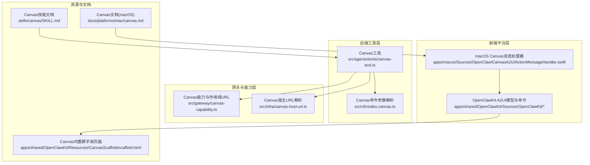
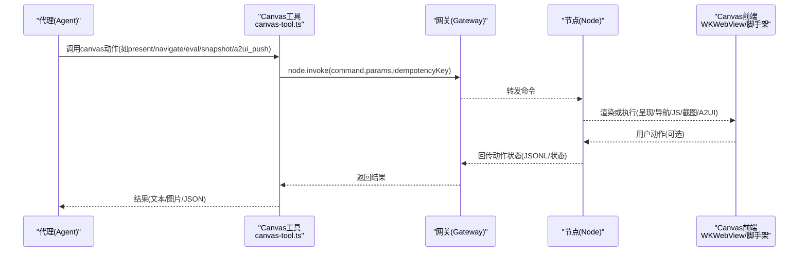
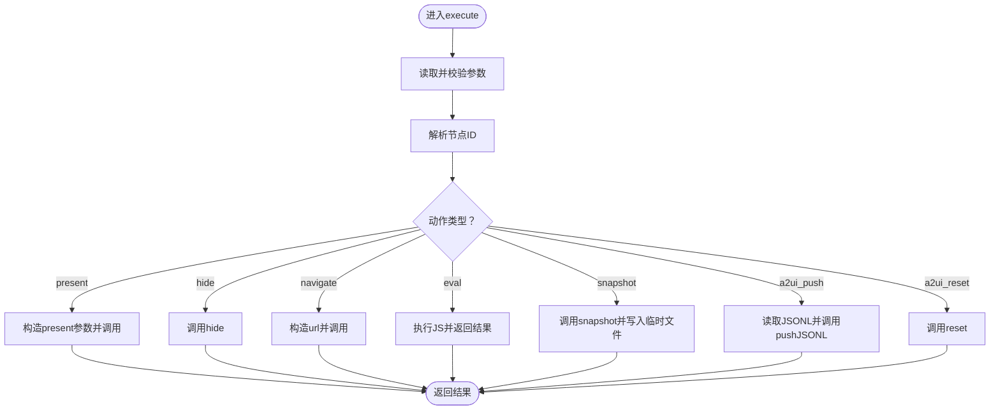
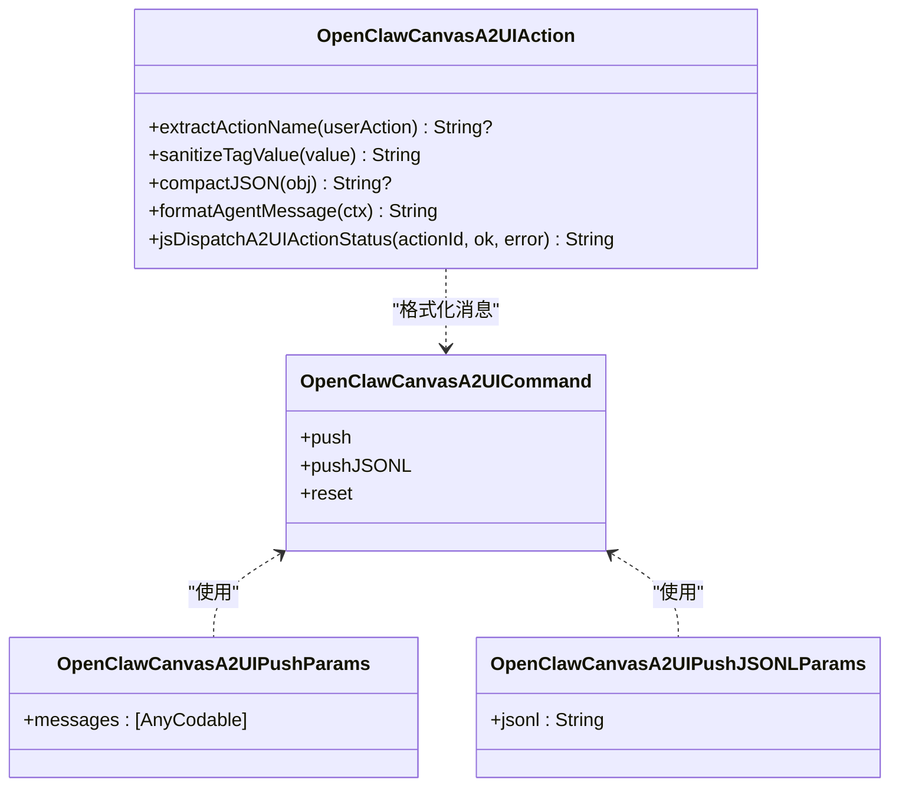
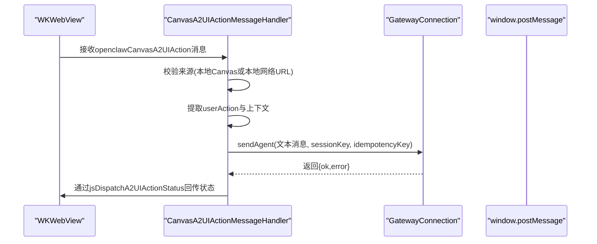
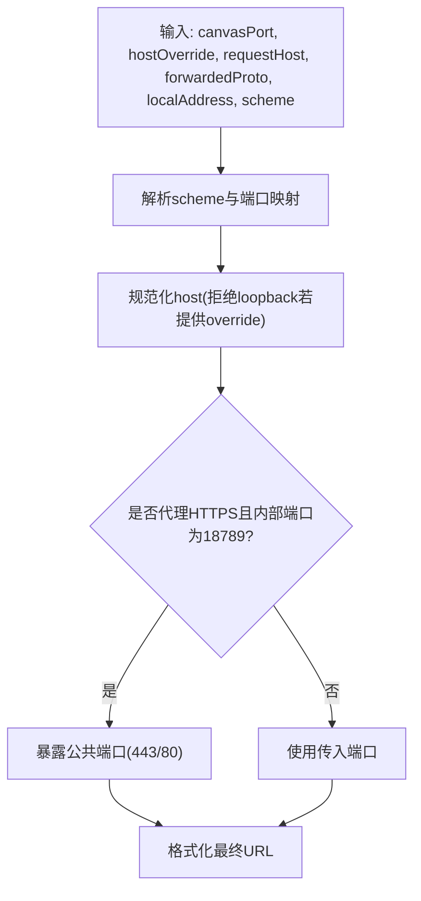
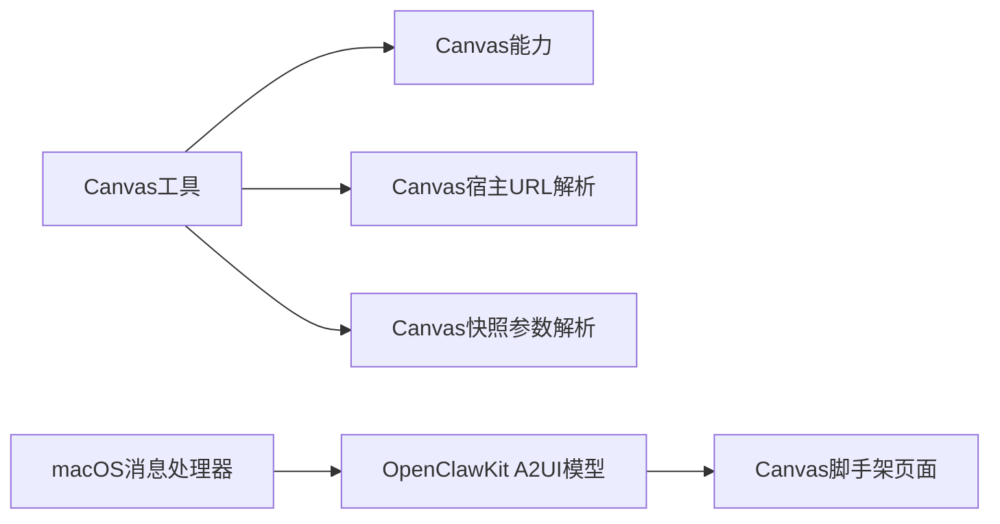

# Canvas绘图工具

<cite>
**本文档引用的文件**
- [canvas-tool.ts](file://src/agents/tools/canvas-tool.ts)
- [nodes-canvas.ts](file://src/cli/nodes-canvas.ts)
- [canvas-capability.ts](file://src/gateway/canvas-capability.ts)
- [canvas-host-url.ts](file://src/infra/canvas-host-url.ts)
- [CanvasA2UIAction.swift](file://apps/shared/OpenClawKit/Sources/OpenClawKit/CanvasA2UIAction.swift)
- [CanvasA2UICommands.swift](file://apps/shared/OpenClawKit/Sources/OpenClawKit/CanvasA2UICommands.swift)
- [CanvasA2UIJSONL.swift](file://apps/shared/OpenClawKit/Sources/OpenClawKit/CanvasA2UIJSONL.swift)
- [CanvasA2UIActionMessageHandler.swift](file://apps/macos/Sources/OpenClaw/CanvasA2UIActionMessageHandler.swift)
- [CanvasCommandParams.swift](file://apps/shared/OpenClawKit/Sources/OpenClawKit/CanvasCommandParams.swift)
- [CanvasCommands.swift](file://apps/shared/OpenClawKit/Sources/OpenClawKit/CanvasCommands.swift)
- [canvas.md](file://docs/platforms/mac/canvas.md)
- [SKILL.md](file://skills/canvas/SKILL.md)
- [scaffold.html](file://apps/shared/OpenClawKit/Sources/OpenClawKit/Resources/CanvasScaffold/scaffold.html)
- [canvas-a2ui-copy.ts](file://scripts/canvas-a2ui-copy.ts)
</cite>

## 目录

1. [简介](#简介)
2. [项目结构](#项目结构)
3. [核心组件](#核心组件)
4. [架构总览](#架构总览)
5. [详细组件分析](#详细组件分析)
6. [依赖关系分析](#依赖关系分析)
7. [性能考虑](#性能考虑)
8. [故障排查指南](#故障排查指南)
9. [结论](#结论)
10. [附录](#附录)

## 简介

本文件面向OpenClaw的Canvas绘图工具，系统性阐述Canvas A2UI（Agent-to-UI）系统、图形渲染、图像处理与多媒体操作能力。文档覆盖Canvas宿主服务工作原理、A2UI接口设计、前端UI系统集成机制，并提供Canvas工具的API接口定义、参数配置说明与性能优化策略。同时给出可直接定位到源码路径的示例，帮助开发者快速上手创建图表、处理图像、实现多媒体交互等典型场景。

## 项目结构

Canvas相关功能横跨后端工具层、网关能力层、平台前端层与资源模板层，形成“工具调用—网关转发—节点渲染—前端交互”的完整链路。

**图表来源**

- [canvas-tool.ts:1-216](file://src/agents/tools/canvas-tool.ts#L1-216)
- [nodes-canvas.ts:1-25](file://src/cli/nodes-canvas.ts#L1-L25)
- [canvas-capability.ts:1-88](file://src/gateway/canvas-capability.ts#L1-L88)
- [canvas-host-url.ts:1-94](file://src/infra/canvas-host-url.ts#L1-L94)
- [CanvasA2UIActionMessageHandler.swift:1-117](file://apps/macos/Sources/OpenClaw/CanvasA2UIActionMessageHandler.swift#L1-L117)
- [CanvasA2UIAction.swift:1-105](file://apps/shared/OpenClawKit/Sources/OpenClawKit/CanvasA2UIAction.swift#L1-L105)
- [CanvasA2UICommands.swift:1-27](file://apps/shared/OpenClawKit/Sources/OpenClawKit/CanvasA2UICommands.swift#L1-L27)
- [CanvasA2UIJSONL.swift:1-82](file://apps/shared/OpenClawKit/Sources/OpenClawKit/CanvasA2UIJSONL.swift#L1-L82)
- [canvas.md:1-126](file://docs/platforms/mac/canvas.md#L1-L126)
- [SKILL.md:1-199](file://skills/canvas/SKILL.md#L1-L199)
- [scaffold.html:1-692](file://apps/shared/OpenClawKit/Sources/OpenClawKit/Resources/CanvasScaffold/scaffold.html#L1-L692)

**章节来源**

- [canvas-tool.ts:1-216](file://src/agents/tools/canvas-tool.ts#L1-L216)
- [canvas-capability.ts:1-88](file://src/gateway/canvas-capability.ts#L1-L88)
- [canvas-host-url.ts:1-94](file://src/infra/canvas-host-url.ts#L1-L94)
- [CanvasA2UIActionMessageHandler.swift:1-117](file://apps/macos/Sources/OpenClaw/CanvasA2UIActionMessageHandler.swift#L1-L117)
- [CanvasA2UIAction.swift:1-105](file://apps/shared/OpenClawKit/Sources/OpenClawKit/CanvasA2UIAction.swift#L1-L105)
- [CanvasA2UICommands.swift:1-27](file://apps/shared/OpenClawKit/Sources/OpenClawKit/CanvasA2UICommands.swift#L1-L27)
- [CanvasA2UIJSONL.swift:1-82](file://apps/shared/OpenClawKit/Sources/OpenClawKit/CanvasA2UIJSONL.swift#L1-L82)
- [canvas.md:1-126](file://docs/platforms/mac/canvas.md#L1-L126)
- [SKILL.md:1-199](file://skills/canvas/SKILL.md#L1-L199)
- [scaffold.html:1-692](file://apps/shared/OpenClawKit/Sources/OpenClawKit/Resources/CanvasScaffold/scaffold.html#L1-L692)

## 核心组件

- Canvas工具（后端）
  - 提供统一的Canvas动作封装：呈现、隐藏、导航、执行JS、截图、推送A2UI JSONL、重置A2UI。
  - 参数校验与安全策略：路径白名单、格式限制、超时控制、节点解析。
  - 截图流程：调用节点命令获取base64，写入临时文件并返回图片结果。
- A2UI系统（跨平台）
  - 命令与参数：push/pushJSONL/reset等命令；JSONL消息解码与校验；上下文格式化。
  - 消息处理器（macOS）：拦截本地Canvas内容发来的用户动作，转为代理消息并回传状态。
- 宿主与能力（网关/基础设施）
  - Canvas能力令牌与作用域URL：生成能力令牌、构建作用域路径、规范化URL。
  - Canvas宿主URL解析：根据请求头、协议、端口映射规则生成对外访问地址。
- 资源与文档
  - macOS Canvas文档：命令行示例、A2UI v0.8支持范围、安全注意事项。
  - Canvas技能文档：架构、Tailscale集成、工作流、调试要点。
  - 内置脚手架页面：默认Canvas面板骨架页，含调试状态显示与代理卡片渲染。

**章节来源**

- [canvas-tool.ts:18-216](file://src/agents/tools/canvas-tool.ts#L18-L216)
- [CanvasA2UIAction.swift:1-105](file://apps/shared/OpenClawKit/Sources/OpenClawKit/CanvasA2UIAction.swift#L1-L105)
- [CanvasA2UICommands.swift:1-27](file://apps/shared/OpenClawKit/Sources/OpenClawKit/CanvasA2UICommands.swift#L1-L27)
- [CanvasA2UIJSONL.swift:1-82](file://apps/shared/OpenClawKit/Sources/OpenClawKit/CanvasA2UIJSONL.swift#L1-L82)
- [CanvasA2UIActionMessageHandler.swift:1-117](file://apps/macos/Sources/OpenClaw/CanvasA2UIActionMessageHandler.swift#L1-L117)
- [canvas-capability.ts:1-88](file://src/gateway/canvas-capability.ts#L1-L88)
- [canvas-host-url.ts:1-94](file://src/infra/canvas-host-url.ts#L1-L94)
- [canvas.md:44-126](file://docs/platforms/mac/canvas.md#L44-L126)
- [SKILL.md:13-199](file://skills/canvas/SKILL.md#L13-L199)
- [scaffold.html:1-692](file://apps/shared/OpenClawKit/Sources/OpenClawKit/Resources/CanvasScaffold/scaffold.html#L1-L692)

## 架构总览

Canvas系统以“工具—网关—节点—前端”分层协作：

**图表来源**

- [canvas-tool.ts:88-216](file://src/agents/tools/canvas-tool.ts#L88-L216)
- [CanvasA2UIActionMessageHandler.swift:18-109](file://apps/macos/Sources/OpenClaw/CanvasA2UIActionMessageHandler.swift#L18-L109)
- [canvas.md:67-106](file://docs/platforms/mac/canvas.md#L67-L106)

## 详细组件分析

### 组件A：Canvas工具（后端）

- 功能职责
  - 将高层动作抽象为标准化命令，统一通过网关调用节点Canvas能力。
  - 支持present/hide/navigate/eval/snapshot/a2ui_push/a2ui_reset。
  - 截图输出为图片结果，便于后续图像处理与安全策略应用。
- 关键流程
  - 参数解析与校验：类型检查、必填项、枚举值、路径白名单。
  - 节点解析：从网关选项与参数中解析目标节点ID。
  - 命令调用：构造invoke参数，发送node.invoke。
  - 截图处理：解析payload、写入临时文件、返回图片结果。
- 错误处理
  - 非法动作、路径越权、空JSONL、无效快照负载等均抛出明确错误。

**图表来源**

- [canvas-tool.ts:88-216](file://src/agents/tools/canvas-tool.ts#L88-L216)

**章节来源**

- [canvas-tool.ts:18-216](file://src/agents/tools/canvas-tool.ts#L18-L216)
- [nodes-canvas.ts:1-25](file://src/cli/nodes-canvas.ts#L1-L25)

### 组件B：A2UI系统（跨平台）

- 命令与参数
  - 命令：canvas.a2ui.push、canvas.a2ui.pushJSONL、canvas.a2ui.reset。
  - 参数：messages数组（AnyCodable）或jsonl字符串。
- JSONL解析与校验
  - 解析每行JSON对象，校验仅包含允许字段（beginRendering/surfaceUpdate/dataModelUpdate/deleteSurface），拒绝v0.9的createSurface。
- 上下文格式化与状态回传
  - 将用户动作格式化为代理消息文本，携带会话、组件、主机、实例等信息。
  - 在前端通过自定义事件回传动作状态（ok/error）。

**图表来源**

- [CanvasA2UICommands.swift:1-27](file://apps/shared/OpenClawKit/Sources/OpenClawKit/CanvasA2UICommands.swift#L1-L27)
- [CanvasA2UIAction.swift:1-105](file://apps/shared/OpenClawKit/Sources/OpenClawKit/CanvasA2UIAction.swift#L1-L105)

**章节来源**

- [CanvasA2UICommands.swift:1-27](file://apps/shared/OpenClawKit/Sources/OpenClawKit/CanvasA2UICommands.swift#L1-L27)
- [CanvasA2UIAction.swift:1-105](file://apps/shared/OpenClawKit/Sources/OpenClawKit/CanvasA2UIAction.swift#L1-L105)
- [CanvasA2UIJSONL.swift:1-82](file://apps/shared/OpenClawKit/Sources/OpenClawKit/CanvasA2UIJSONL.swift#L1-L82)

### 组件C：macOS前端消息处理器

- 安全过滤
  - 仅接受来自本地Canvas Scheme或本地网络URL的消息，防止任意网页注入。
- 动作提取与上下文组装
  - 提取动作名、会话、组件、实例ID，压缩上下文JSON。
- 代理消息发送与状态回传
  - 发送Agent消息，等待结果并在主线程通过JS事件回传状态。

**图表来源**

- [CanvasA2UIActionMessageHandler.swift:18-109](file://apps/macos/Sources/OpenClaw/CanvasA2UIActionMessageHandler.swift#L18-L109)
- [CanvasA2UIAction.swift:83-103](file://apps/shared/OpenClawKit/Sources/OpenClawKit/CanvasA2UIAction.swift#L83-L103)

**章节来源**

- [CanvasA2UIActionMessageHandler.swift:1-117](file://apps/macos/Sources/OpenClaw/CanvasA2UIActionMessageHandler.swift#L1-L117)
- [CanvasA2UIAction.swift:69-103](file://apps/shared/OpenClawKit/Sources/OpenClawKit/CanvasA2UIAction.swift#L69-L103)

### 组件D：Canvas宿主与能力

- 能力令牌与作用域URL
  - 生成base64url能力令牌，构建/规范化作用域路径，支持查询参数回写。
- 宿主URL解析
  - 根据hostOverride/requestHost/forwardedProto/localAddress与canvasPort计算对外URL，处理代理HTTPS场景的端口映射。

**图表来源**

- [canvas-host-url.ts:57-94](file://src/infra/canvas-host-url.ts#L57-L94)
- [canvas-capability.ts:24-87](file://src/gateway/canvas-capability.ts#L24-L87)

**章节来源**

- [canvas-capability.ts:1-88](file://src/gateway/canvas-capability.ts#L1-L88)
- [canvas-host-url.ts:1-94](file://src/infra/canvas-host-url.ts#L1-L94)

### 组件E：资源与文档

- macOS Canvas文档
  - 命令行示例、A2UI v0.8支持范围、默认A2UI宿主URL、安全注意事项。
- Canvas技能文档
  - 架构、Tailscale绑定模式、工作流、调试步骤、URL路径结构。
- 内置脚手架页面
  - 默认Canvas骨架页，含调试状态显示、代理卡片渲染、画布尺寸适配。

**章节来源**

- [canvas.md:1-126](file://docs/platforms/mac/canvas.md#L1-L126)
- [SKILL.md:1-199](file://skills/canvas/SKILL.md#L1-L199)
- [scaffold.html:1-692](file://apps/shared/OpenClawKit/Sources/OpenClawKit/Resources/CanvasScaffold/scaffold.html#L1-L692)

## 依赖关系分析

- 后端工具依赖网关能力与节点命令，通过统一invoke接口与节点交互。
- 平台前端依赖OpenClawKit的A2UI模型与命令，macOS通过消息处理器桥接Web内容与代理。
- 资源层提供默认Canvas骨架页，便于快速验证与演示。

**图表来源**

- [canvas-tool.ts:88-216](file://src/agents/tools/canvas-tool.ts#L88-L216)
- [canvas-capability.ts:1-88](file://src/gateway/canvas-capability.ts#L1-L88)
- [canvas-host-url.ts:1-94](file://src/infra/canvas-host-url.ts#L1-L94)
- [nodes-canvas.ts:1-25](file://src/cli/nodes-canvas.ts#L1-L25)
- [CanvasA2UIActionMessageHandler.swift:1-117](file://apps/macos/Sources/OpenClaw/CanvasA2UIActionMessageHandler.swift#L1-L117)
- [CanvasA2UIAction.swift:1-105](file://apps/shared/OpenClawKit/Sources/OpenClawKit/CanvasA2UIAction.swift#L1-L105)
- [scaffold.html:1-692](file://apps/shared/OpenClawKit/Sources/OpenClawKit/Resources/CanvasScaffold/scaffold.html#L1-L692)

**章节来源**

- [canvas-tool.ts:1-216](file://src/agents/tools/canvas-tool.ts#L1-L216)
- [CanvasA2UIActionMessageHandler.swift:1-117](file://apps/macos/Sources/OpenClaw/CanvasA2UIActionMessageHandler.swift#L1-L117)
- [scaffold.html:1-692](file://apps/shared/OpenClawKit/Sources/OpenClawKit/Resources/CanvasScaffold/scaffold.html#L1-L692)

## 性能考虑

- 截图优化
  - 控制最大宽度与质量参数，避免过大图片导致内存压力与传输开销。
  - 使用临时文件写入与安全策略限制，减少重复I/O与越权风险。
- A2UI JSONL
  - 严格校验消息类型，避免冗余字段与不必要渲染。
  - 批量消息合并编码，减少往返次数。
- 宿主URL解析
  - 正确识别代理HTTPS场景的端口映射，避免额外握手失败与重试。
- 前端渲染
  - 利用骨架页与调试状态，降低首次加载与切换成本。
  - 合理设置画布尺寸与像素比，平衡清晰度与性能。

[本节为通用指导，无需特定文件引用]

## 故障排查指南

- 白屏/内容未加载
  - 检查网关绑定模式与实际端口，确保使用与绑定一致的主机名而非localhost。
  - 使用curl测试宿主URL可达性。
- “node required”或“node not connected”
  - 确保在调用中指定有效节点ID，并确认节点在线。
- Live reload不生效
  - 检查配置中的liveReload开关、文件位于根目录、监控器无错误日志。
- A2UI JSONL报错
  - 确认使用v0.8消息类型，避免v0.9的createSurface。
  - 检查每行JSON对象仅包含允许字段。

**章节来源**

- [SKILL.md:151-199](file://skills/canvas/SKILL.md#L151-L199)
- [canvas.md:151-199](file://docs/platforms/mac/canvas.md#L151-L199)
- [CanvasA2UIJSONL.swift:29-64](file://apps/shared/OpenClawKit/Sources/OpenClawKit/CanvasA2UIJSONL.swift#L29-L64)

## 结论

Canvas绘图工具通过统一的工具层接口与严谨的安全策略，实现了跨平台的Canvas控制与A2UI渲染。结合网关能力与前端消息处理器，系统在保证安全性的同时提供了灵活的可视化与交互能力。建议在生产环境中合理配置宿主URL、控制截图参数、严格校验A2UI消息，并利用内置脚手架页面进行快速验证与调试。

[本节为总结，无需特定文件引用]

## 附录

### API接口与参数配置

- Canvas工具动作
  - present：可选target/url与placement(x,y,width,height)。
  - hide：隐藏Canvas。
  - navigate：导航到url（支持本地路径、http(s)、file）。
  - eval：执行JavaScript并返回结果。
  - snapshot：输出格式(png/jpg/jpeg)，可选maxWidth、quality。
  - a2ui_push：传入jsonl或jsonlPath。
  - a2ui_reset：重置A2UI渲染状态。
- A2UI命令
  - canvas.a2ui.push / canvas.a2ui.pushJSONL：推送消息数组或JSONL。
  - canvas.a2ui.reset：重置渲染状态。
- 参数模型
  - OpenClawCanvasPresentParams/OpenClawCanvasNavigateParams/OpenClawCanvasEvalParams/OpenClawCanvasSnapshotParams。
  - OpenClawCanvasA2UIPushParams/OpenClawCanvasA2UIPushJSONLParams。

**章节来源**

- [canvas-tool.ts:54-78](file://src/agents/tools/canvas-tool.ts#L54-L78)
- [CanvasCommandParams.swift:1-77](file://apps/shared/OpenClawKit/Sources/OpenClawKit/CanvasCommandParams.swift#L1-L77)
- [CanvasCommands.swift:1-10](file://apps/shared/OpenClawKit/Sources/OpenClawKit/CanvasCommands.swift#L1-L10)
- [CanvasA2UICommands.swift:1-27](file://apps/shared/OpenClawKit/Sources/OpenClawKit/CanvasA2UICommands.swift#L1-L27)

### 实际使用示例（路径指引）

- 创建图表/可视化
  - 在Canvas根目录放置HTML/CSS/JS文件，使用present/navigate展示。
  - 参考：[Canvas技能文档工作流:86-149](file://skills/canvas/SKILL.md#L86-L149)
- 处理图像
  - 使用snapshot捕获Canvas画面，返回图片结果用于后续处理。
  - 参考：[Canvas工具快照逻辑:162-193](file://src/agents/tools/canvas-tool.ts#L162-L193)
- 实现多媒体交互
  - 通过eval执行JS控制媒体播放/暂停/切换。
  - 参考：[Canvas工具eval分支:146-161](file://src/agents/tools/canvas-tool.ts#L146-L161)
- A2UI推送
  - 准备A2UI v0.8 JSONL，使用a2ui_push推送。
  - 参考：[A2UI JSONL解析与校验:14-70](file://apps/shared/OpenClawKit/Sources/OpenClawKit/CanvasA2UIJSONL.swift#L14-L70)

**章节来源**

- [SKILL.md:86-149](file://skills/canvas/SKILL.md#L86-L149)
- [canvas-tool.ts:146-193](file://src/agents/tools/canvas-tool.ts#L146-L193)
- [CanvasA2UIJSONL.swift:14-70](file://apps/shared/OpenClawKit/Sources/OpenClawKit/CanvasA2UIJSONL.swift#L14-L70)

### A2UI资源打包与复制

- A2UI资源复制脚本
  - 校验bundle存在，复制至dist目录，支持跳过缺失与环境变量定制。
- 构建配置
  - 从ui工作区或仓库根解析依赖，输出到canvas-host/a2ui。

**章节来源**

- [canvas-a2ui-copy.ts:1-40](file://scripts/canvas-a2ui-copy.ts#L1-L40)
