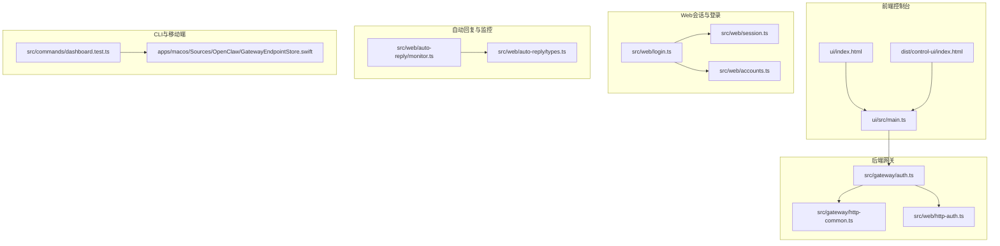
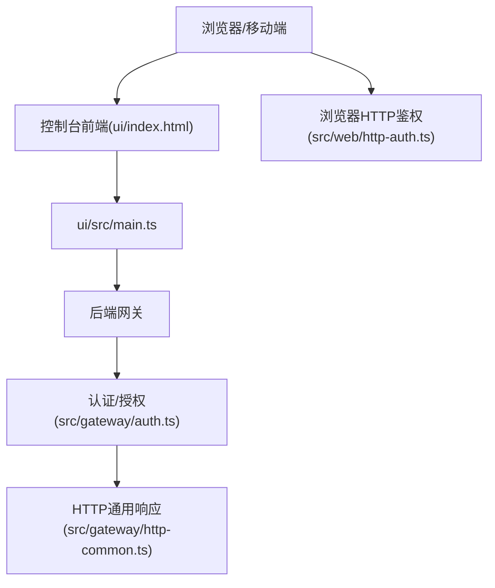
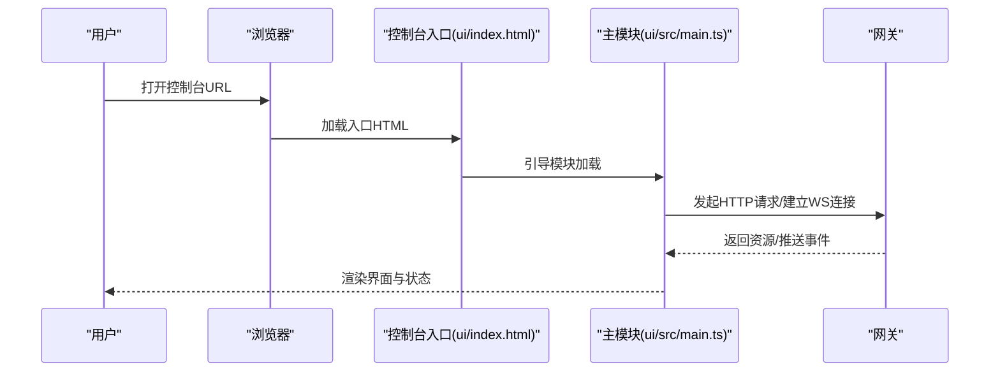
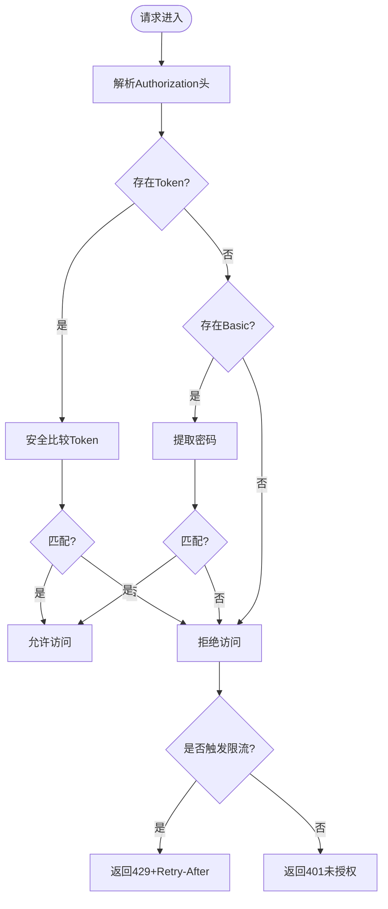
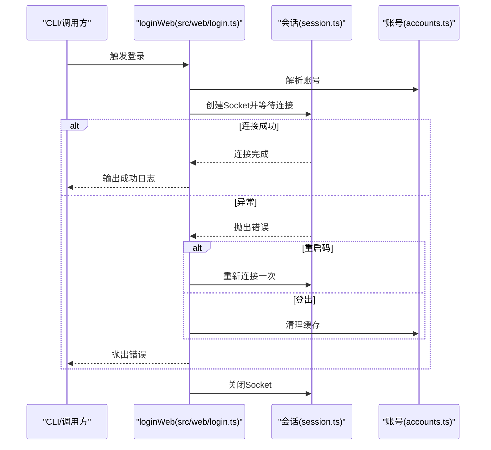
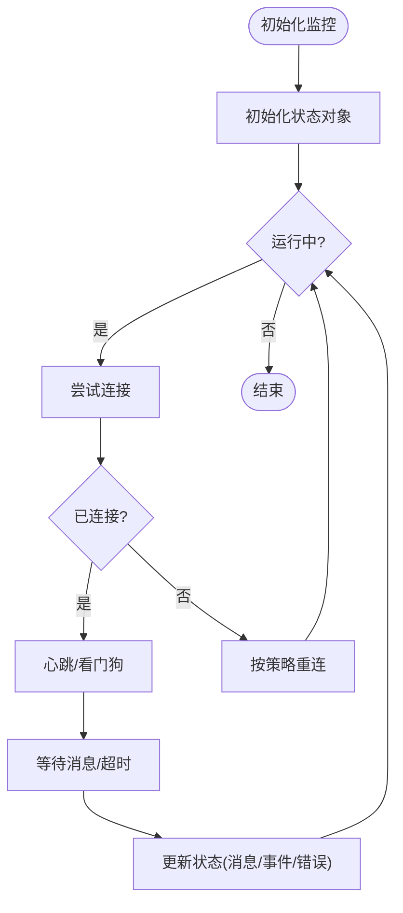
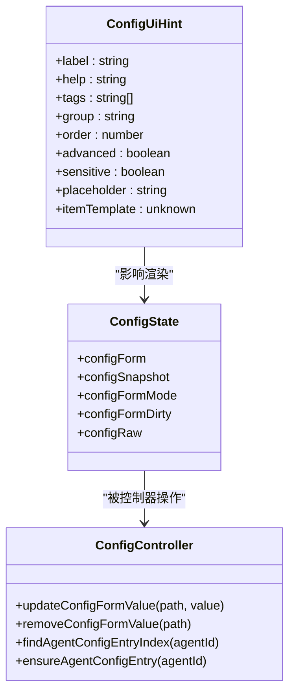
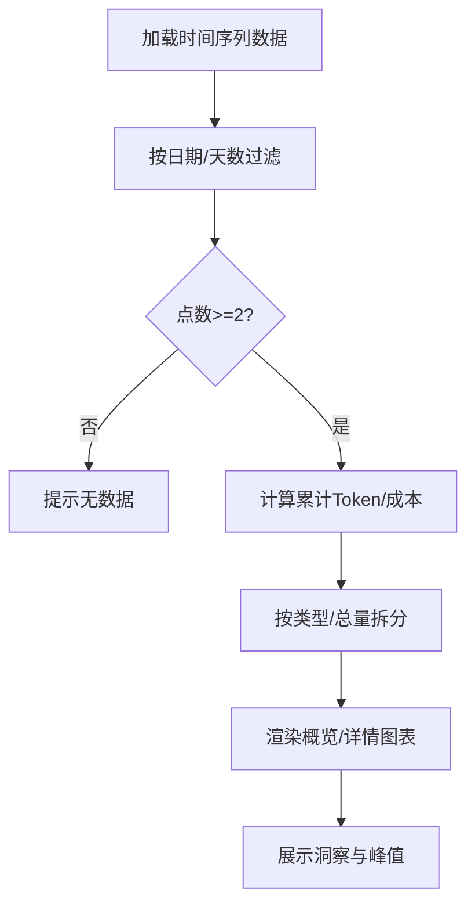
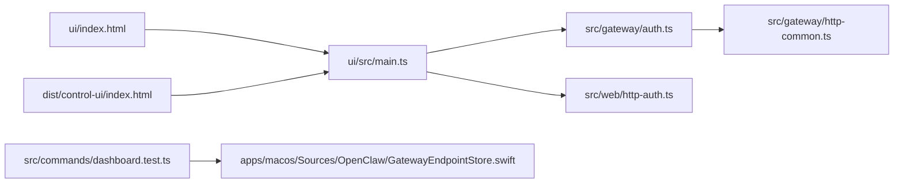

# Web界面工具

<cite>
**本文引用的文件**
- [ui/index.html](file://ui/index.html)
- [dist/control-ui/index.html](file://dist/control-ui/index.html)
- [ui/src/main.ts](file://ui/src/main.ts)
- [src/web/login.ts](file://src/web/login.ts)
- [src/web/session.ts](file://src/web/session.ts)
- [src/web/accounts.ts](file://src/web/accounts.ts)
- [src/web/auto-reply/monitor.ts](file://src/web/auto-reply/monitor.ts)
- [src/web/auto-reply/types.ts](file://src/web/auto-reply/types.ts)
- [src/web/http-auth.ts](file://src/web/http-auth.ts)
- [src/gateway/auth.ts](file://src/gateway/auth.ts)
- [src/gateway/http-common.ts](file://src/gateway/http-common.ts)
- [src/commands/dashboard.test.ts](file://src/commands/dashboard.test.ts)
- [apps/macos/Sources/OpenClaw/GatewayEndpointStore.swift](file://apps/macos/Sources/OpenClaw/GatewayEndpointStore.swift)
- [apps/macos/Sources/OpenClaw/ConfigSchemaSupport.swift](file://apps/macos/Sources/OpenClaw/ConfigSchemaSupport.swift)
- [src/shared/config-ui-hints-types.ts](file://src/shared/config-ui-hints-types.ts)
- [src/config/schema.tags.ts](file://src/config/schema.tags.ts)
- [ui/src/ui/navigation.browser.test.ts](file://ui/src/ui/navigation.browser.test.ts)
- [ui/src/ui/views/usage-render-overview.ts](file://ui/src/ui/views/usage-render-overview.ts)
- [ui/src/ui/views/usage-render-details.ts](file://ui/src/ui/views/usage-render-details.ts)
- [ui/src/ui/views/config.ts](file://ui/src/ui/views/config.ts)
- [ui/src/ui/controllers/config.ts](file://ui/src/ui/controllers/config.ts)
</cite>

## 目录

1. [简介](#简介)
2. [项目结构](#项目结构)
3. [核心组件](#核心组件)
4. [架构总览](#架构总览)
5. [详细组件分析](#详细组件分析)
6. [依赖关系分析](#依赖关系分析)
7. [性能考虑](#性能考虑)
8. [故障排查指南](#故障排查指南)
9. [结论](#结论)
10. [附录](#附录)

## 简介

本文件面向OpenClaw的Web界面工具，系统性阐述Web控制台、TUI界面、用户交互与实时监控等能力的设计与实现。内容覆盖Web服务架构、界面组件、用户认证、数据可视化、配置参数、界面定制与性能优化策略，并通过“代码片段路径”指引在仓库中定位具体实现，便于日常运维中的系统管理、状态监控与调试。

## 项目结构

OpenClaw的Web界面由前端控制台与后端网关协同构成：前端以独立HTML入口加载，后端提供HTTP/WebSocket接口与认证控制，CLI命令负责生成链接与打开界面。移动端应用提供本地基座以解析控制台URL与基座路径。

**图表来源**

- [ui/index.html:1-17](file://ui/index.html#L1-L17)
- [dist/control-ui/index.html:1-18](file://dist/control-ui/index.html#L1-L18)
- [ui/src/main.ts:1-3](file://ui/src/main.ts#L1-L3)
- [src/gateway/auth.ts:483-503](file://src/gateway/auth.ts#L483-L503)
- [src/gateway/http-common.ts:36-71](file://src/gateway/http-common.ts#L36-L71)
- [src/web/http-auth.ts:1-48](file://src/web/http-auth.ts#L1-L48)
- [src/web/login.ts:1-79](file://src/web/login.ts#L1-L79)
- [src/web/session.ts](file://src/web/session.ts)
- [src/web/accounts.ts](file://src/web/accounts.ts)
- [src/web/auto-reply/monitor.ts:40-69](file://src/web/auto-reply/monitor.ts#L40-L69)
- [src/web/auto-reply/types.ts:1-37](file://src/web/auto-reply/types.ts#L1-L37)
- [src/commands/dashboard.test.ts:64-116](file://src/commands/dashboard.test.ts#L64-L116)
- [apps/macos/Sources/OpenClaw/GatewayEndpointStore.swift:649-684](file://apps/macos/Sources/OpenClaw/GatewayEndpointStore.swift#L649-L684)

**章节来源**

- [ui/index.html:1-17](file://ui/index.html#L1-L17)
- [dist/control-ui/index.html:1-18](file://dist/control-ui/index.html#L1-L18)
- [ui/src/main.ts:1-3](file://ui/src/main.ts#L1-L3)
- [src/commands/dashboard.test.ts:64-116](file://src/commands/dashboard.test.ts#L64-L116)

## 核心组件

- 控制台入口与路由
  - 前端入口HTML定义主题与图标，挂载自定义元素并加载模块脚本；支持运行时基座路径推断与显式覆盖。
  - 路由行为在测试中验证，包括从URL到tab的水合、对/ui前缀的尊重以及嵌套基座路径的推断。
- 认证与授权
  - 后端提供通用HTTP错误响应与速率限制处理；针对不同接入面（HTTP、WS控制台）分别授权。
  - 浏览器侧请求可基于Bearer Token或Basic密码进行授权判定。
- 会话与登录
  - Web登录流程封装了账号解析、Socket建立、连接等待与异常处理（如重启、登出）。
- 自动回复与监控
  - 监控通道状态、重连策略、心跳与消息超时等参数化配置，输出状态回调供UI消费。
- 配置与界面提示
  - 配置项支持标签、分组、顺序、敏感度等UI提示；移动端提供基座路径归一化与URL转换逻辑。

**章节来源**

- [ui/index.html:1-17](file://ui/index.html#L1-L17)
- [ui/src/ui/navigation.browser.test.ts:17-47](file://ui/src/ui/navigation.browser.test.ts#L17-L47)
- [src/gateway/http-common.ts:36-71](file://src/gateway/http-common.ts#L36-L71)
- [src/gateway/auth.ts:483-503](file://src/gateway/auth.ts#L483-L503)
- [src/web/http-auth.ts:1-48](file://src/web/http-auth.ts#L1-L48)
- [src/web/login.ts:1-79](file://src/web/login.ts#L1-L79)
- [src/web/auto-reply/monitor.ts:40-69](file://src/web/auto-reply/monitor.ts#L40-L69)
- [src/web/auto-reply/types.ts:1-37](file://src/web/auto-reply/types.ts#L1-L37)
- [apps/macos/Sources/OpenClaw/GatewayEndpointStore.swift:649-684](file://apps/macos/Sources/OpenClaw/GatewayEndpointStore.swift#L649-L684)
- [src/shared/config-ui-hints-types.ts:1-13](file://src/shared/config-ui-hints-types.ts#L1-L13)
- [src/config/schema.tags.ts:1-53](file://src/config/schema.tags.ts#L1-L53)

## 架构总览

下图展示了Web控制台与后端网关的交互关系：前端通过HTTP获取控制台资源，通过WebSocket与网关建立实时通信；后端根据配置执行认证与授权，必要时返回速率限制或未授权响应；CLI与移动端参与链接生成与基座路径解析。

**图表来源**

- [ui/index.html:1-17](file://ui/index.html#L1-L17)
- [ui/src/main.ts:1-3](file://ui/src/main.ts#L1-L3)
- [src/gateway/auth.ts:483-503](file://src/gateway/auth.ts#L483-L503)
- [src/gateway/http-common.ts:36-71](file://src/gateway/http-common.ts#L36-L71)
- [src/web/http-auth.ts:1-48](file://src/web/http-auth.ts#L1-L48)

## 详细组件分析

### 组件A：Web控制台入口与路由

- 入口HTML负责设置颜色模式、图标与根组件挂载；运行时可注入基座路径以适配反向代理或子路径部署。
- 路由行为在单元测试中被验证：从URL路径水合到tab、尊重显式基座路径、推断嵌套基座路径。
- 与移动端集成：本地基座路径归一化与HTTP/HTTPS协议转换，确保Dashboard URL可用。

**图表来源**

- [ui/index.html:1-17](file://ui/index.html#L1-L17)
- [ui/src/main.ts:1-3](file://ui/src/main.ts#L1-L3)
- [ui/src/ui/navigation.browser.test.ts:17-47](file://ui/src/ui/navigation.browser.test.ts#L17-L47)
- [apps/macos/Sources/OpenClaw/GatewayEndpointStore.swift:649-684](file://apps/macos/Sources/OpenClaw/GatewayEndpointStore.swift#L649-L684)

**章节来源**

- [ui/index.html:1-17](file://ui/index.html#L1-L17)
- [ui/src/ui/navigation.browser.test.ts:17-47](file://ui/src/ui/navigation.browser.test.ts#L17-L47)
- [apps/macos/Sources/OpenClaw/GatewayEndpointStore.swift:649-684](file://apps/macos/Sources/OpenClaw/GatewayEndpointStore.swift#L649-L684)

### 组件B：用户认证与授权

- HTTP通用响应：统一处理方法不允许、未授权、速率限制与无效请求等错误。
- 授权面区分：HTTP接入与WS控制台接入分别调用授权函数，支持速率限制回传。
- 浏览器请求授权：支持Bearer Token与Basic密码校验，采用安全比较避免时序攻击。

**图表来源**

- [src/gateway/http-common.ts:36-71](file://src/gateway/http-common.ts#L36-L71)
- [src/gateway/auth.ts:483-503](file://src/gateway/auth.ts#L483-L503)
- [src/web/http-auth.ts:1-48](file://src/web/http-auth.ts#L1-L48)

**章节来源**

- [src/gateway/http-common.ts:36-71](file://src/gateway/http-common.ts#L36-L71)
- [src/gateway/auth.ts:483-503](file://src/gateway/auth.ts#L483-L503)
- [src/web/http-auth.ts:1-48](file://src/web/http-auth.ts#L1-L48)

### 组件C：Web登录与会话管理

- 登录流程：解析账号、创建Socket、等待连接、处理重启与登出现象、记录成功并关闭Socket。
- 会话与账号：登录过程依赖账号解析与会话工具，异常时输出格式化错误并清理缓存。

**图表来源**

- [src/web/login.ts:10-79](file://src/web/login.ts#L10-L79)
- [src/web/session.ts](file://src/web/session.ts)
- [src/web/accounts.ts](file://src/web/accounts.ts)

**章节来源**

- [src/web/login.ts:10-79](file://src/web/login.ts#L10-L79)

### 组件D：自动回复与监控

- 监控状态：维护运行、连接、重连次数、最近连接/断开时间、最后消息/事件时间与错误信息。
- 参数化配置：心跳周期、消息超时、看门狗检查、去抖窗口、账号ID等，支持回调输出状态。
- 重连策略：根据状态码判断不可重试场景（如会话冲突），并按策略重试。

**图表来源**

- [src/web/auto-reply/monitor.ts:40-69](file://src/web/auto-reply/monitor.ts#L40-L69)
- [src/web/auto-reply/types.ts:10-37](file://src/web/auto-reply/types.ts#L10-L37)

**章节来源**

- [src/web/auto-reply/monitor.ts:40-69](file://src/web/auto-reply/monitor.ts#L40-L69)
- [src/web/auto-reply/types.ts:1-37](file://src/web/auto-reply/types.ts#L1-L37)

### 组件E：配置与界面定制

- 配置UI提示：支持标签、分组、顺序、高级选项、敏感字段与占位符，用于界面渲染与排序。
- 配置标签体系：内置多类标签（安全、网络、可观测等），并对特定键进行优先级与覆盖映射。
- 配置表单控制器：提供增删改值、查找/确保Agent条目、序列化/反序列化等操作。
- 配置视图：支持子导航与分组显示，结合UI提示进行友好展示。

**图表来源**

- [src/shared/config-ui-hints-types.ts:1-13](file://src/shared/config-ui-hints-types.ts#L1-L13)
- [src/config/schema.tags.ts:1-53](file://src/config/schema.tags.ts#L1-L53)
- [ui/src/ui/controllers/config.ts:211-257](file://ui/src/ui/controllers/config.ts#L211-L257)
- [ui/src/ui/views/config.ts:736-758](file://ui/src/ui/views/config.ts#L736-L758)

**章节来源**

- [src/shared/config-ui-hints-types.ts:1-13](file://src/shared/config-ui-hints-types.ts#L1-L13)
- [src/config/schema.tags.ts:1-53](file://src/config/schema.tags.ts#L1-L53)
- [ui/src/ui/controllers/config.ts:211-257](file://ui/src/ui/controllers/config.ts#L211-L257)
- [ui/src/ui/views/config.ts:736-758](file://ui/src/ui/views/config.ts#L736-L758)

### 组件F：数据可视化（用量概览与详情）

- 概览视图：支持按天聚合的柱状图、按类型拆分的用量、洞察列表（模型/提供商/工具/代理/渠道）与峰值错误分析。
- 详情视图：时间序列累计/分段统计、筛选范围内的点集、按类型/总量切换、鼠标交叉选择等。

**图表来源**

- [ui/src/ui/views/usage-render-overview.ts:158-543](file://ui/src/ui/views/usage-render-overview.ts#L158-L543)
- [ui/src/ui/views/usage-render-details.ts:354-516](file://ui/src/ui/views/usage-render-details.ts#L354-L516)

**章节来源**

- [ui/src/ui/views/usage-render-overview.ts:158-543](file://ui/src/ui/views/usage-render-overview.ts#L158-L543)
- [ui/src/ui/views/usage-render-details.ts:354-516](file://ui/src/ui/views/usage-render-details.ts#L354-L516)

## 依赖关系分析

- 前端入口与模块加载：ui/index.html与dist/control-ui/index.html分别作为开发与构建产物入口，均指向同一自定义元素与模块入口。
- CLI与移动端：CLI测试覆盖了不同绑定模式下的控制台链接生成；移动端提供基座路径归一化与HTTP/HTTPS转换。
- 认证链路：HTTP通用响应与授权函数形成统一的鉴权与限流出口；浏览器HTTP鉴权提供Token/Bearer与Basic密码两种方式。

**图表来源**

- [ui/index.html:1-17](file://ui/index.html#L1-L17)
- [dist/control-ui/index.html:1-18](file://dist/control-ui/index.html#L1-L18)
- [ui/src/main.ts:1-3](file://ui/src/main.ts#L1-L3)
- [src/gateway/auth.ts:483-503](file://src/gateway/auth.ts#L483-L503)
- [src/gateway/http-common.ts:36-71](file://src/gateway/http-common.ts#L36-L71)
- [src/web/http-auth.ts:1-48](file://src/web/http-auth.ts#L1-L48)
- [src/commands/dashboard.test.ts:64-116](file://src/commands/dashboard.test.ts#L64-L116)
- [apps/macos/Sources/OpenClaw/GatewayEndpointStore.swift:649-684](file://apps/macos/Sources/OpenClaw/GatewayEndpointStore.swift#L649-L684)

**章节来源**

- [src/commands/dashboard.test.ts:64-116](file://src/commands/dashboard.test.ts#L64-L116)
- [apps/macos/Sources/OpenClaw/GatewayEndpointStore.swift:649-684](file://apps/macos/Sources/OpenClaw/GatewayEndpointStore.swift#L649-L684)

## 性能考虑

- 图表渲染
  - 概览与详情视图在渲染前进行数据过滤与累计计算，建议在大数据量场景下启用日期范围筛选与按类型拆分，减少DOM节点与重绘开销。
  - 使用固定画布尺寸与内边距，避免频繁布局计算。
- 监控与重连
  - 合理设置心跳周期与消息超时，避免过密导致CPU占用；对不可重试状态（如会话冲突）应快速失败并提示人工干预。
- 认证与限流
  - 对高频失败场景启用限流并返回Retry-After，降低后端压力；浏览器端使用安全比较避免时序泄漏。
- 前端加载
  - 开发与生产入口分别对应源码模块与打包产物，生产环境建议启用缓存与CDN，减少首屏加载时间。

[本节为通用指导，无需列出具体文件来源]

## 故障排查指南

- 未授权/速率限制
  - 若收到401或429，请检查Token/Bearer与Basic密码是否正确；确认是否触发限流并等待Retry-After指示。
  - 参考：[src/gateway/http-common.ts:36-71](file://src/gateway/http-common.ts#L36-L71)
- 登录异常
  - 重启码：系统提示重启后可自动重试一次；登出码：清理缓存后需重新扫码登录。
  - 参考：[src/web/login.ts:24-67](file://src/web/login.ts#L24-L67)
- 控制台链接与基座路径
  - CLI支持多种绑定模式，若无法访问请核对本地/自定义/隧道绑定；移动端会将ws/wss自动转为http/https并归一化基座路径。
  - 参考：[src/commands/dashboard.test.ts:75-116](file://src/commands/dashboard.test.ts#L75-L116)、[apps/macos/Sources/OpenClaw/GatewayEndpointStore.swift:649-684](file://apps/macos/Sources/OpenClaw/GatewayEndpointStore.swift#L649-L684)
- 监控断线与重连
  - 检查重连策略与看门狗配置；遇到440冲突码需人工解除冲突会话后再试。
  - 参考：[src/web/auto-reply/monitor.ts:34-38](file://src/web/auto-reply/monitor.ts#L34-L38)

**章节来源**

- [src/gateway/http-common.ts:36-71](file://src/gateway/http-common.ts#L36-L71)
- [src/web/login.ts:24-67](file://src/web/login.ts#L24-L67)
- [src/commands/dashboard.test.ts:75-116](file://src/commands/dashboard.test.ts#L75-L116)
- [apps/macos/Sources/OpenClaw/GatewayEndpointStore.swift:649-684](file://apps/macos/Sources/OpenClaw/GatewayEndpointStore.swift#L649-L684)
- [src/web/auto-reply/monitor.ts:34-38](file://src/web/auto-reply/monitor.ts#L34-L38)

## 结论

OpenClaw的Web界面工具以清晰的前后端分工实现：前端控制台负责交互与可视化，后端网关提供认证、授权与实时通信；CLI与移动端辅助链接生成与基座路径处理。通过参数化的监控与配置UI提示，系统在易用性与可观测性之间取得平衡。建议在生产环境中结合限流、合理的心跳与超时配置，以及前端缓存与CDN策略，持续优化用户体验与系统稳定性。

[本节为总结，无需列出具体文件来源]

## 附录

- 实际运维场景示例（以“代码片段路径”指引定位）
  - 打开控制台并打印URL（不自动打开浏览器）：[src/commands/dashboard.test.ts:20-23](file://src/commands/dashboard.test.ts#L20-L23)
  - 生成控制台链接（含绑定模式与基座路径）：[src/commands/dashboard.test.ts:75-116](file://src/commands/dashboard.test.ts#L75-L116)
  - 将WS/WSS转换为HTTP/HTTPS并归一化基座路径：[apps/macos/Sources/OpenClaw/GatewayEndpointStore.swift:649-684](file://apps/macos/Sources/OpenClaw/GatewayEndpointStore.swift#L649-L684)
  - 配置项UI提示与标签体系：[src/shared/config-ui-hints-types.ts:1-13](file://src/shared/config-ui-hints-types.ts#L1-L13)、[src/config/schema.tags.ts:1-53](file://src/config/schema.tags.ts#L1-L53)
  - 配置表单控制器（增删改值、Agent条目管理）：[ui/src/ui/controllers/config.ts:211-257](file://ui/src/ui/controllers/config.ts#L211-L257)
  - 配置视图（子导航与分组显示）：[ui/src/ui/views/config.ts:736-758](file://ui/src/ui/views/config.ts#L736-L758)
  - 用量概览与详情渲染（时间序列与洞察）：[ui/src/ui/views/usage-render-overview.ts:158-543](file://ui/src/ui/views/usage-render-overview.ts#L158-L543)、[ui/src/ui/views/usage-render-details.ts:354-516](file://ui/src/ui/views/usage-render-details.ts#L354-L516)

[本节为补充说明，无需列出具体文件来源]
