# 一流工具系统

<cite>
**本文引用的文件**
- [openclaw-tools.ts](file://src/agents/openclaw-tools.ts)
- [common.ts](file://src/agents/tools/common.ts)
- [browser-tool.ts](file://src/agents/tools/browser-tool.ts)
- [canvas-tool.ts](file://src/agents/tools/canvas-tool.ts)
- [nodes-tool.ts](file://src/agents/tools/nodes-tool.ts)
- [cron-tool.ts](file://src/agents/tools/cron-tool.ts)
- [sessions-send-tool.ts](file://src/agents/tools/sessions-send-tool.ts)
- [gateway-tool.ts](file://src/agents/tools/gateway-tool.ts)
- [image-tool.ts](file://src/agents/tools/image-tool.ts)
- [tool-policy.ts](file://src/agents/sandbox/tool-policy.ts)
- [sandbox.ts](file://src/agents/sandbox.ts)
- [validate-sandbox-security.ts](file://src/agents/sandbox/validate-sandbox-security.ts)
- [docker.ts](file://src/agents/sandbox/docker.ts)
- [nodes.handlers.invoke-result.ts](file://src/gateway/server-methods/nodes.handlers.invoke-result.ts)
- [plugin-sdk/index.ts](file://src/plugin-sdk/index.ts)
- [tool-factory-test-harness.ts](file://extensions/feishu/src/tool-factory-test-harness.ts)
- [pi-tools-agent-config.test.ts](file://src/agents/pi-tools-agent-config.test.ts)
- [audit.test.ts](file://src/security/audit.test.ts)
</cite>

## 目录

1. [简介](#简介)
2. [项目结构](#项目结构)
3. [核心组件](#核心组件)
4. [架构总览](#架构总览)
5. [详细组件分析](#详细组件分析)
6. [依赖关系分析](#依赖关系分析)
7. [性能考量](#性能考量)
8. [故障排查指南](#故障排查指南)
9. [结论](#结论)
10. [附录](#附录)

## 简介

本文件系统性阐述 OpenClaw 的“一流工具系统”，覆盖浏览器控制、Canvas 操作、节点管理、定时任务、会话工具等核心能力，深入解析安全沙箱机制、权限控制策略与工具间协作方式，并提供使用示例、配置选项与扩展开发指南。目标是帮助开发者在理解现有实现的基础上，快速上手、稳定集成并安全扩展工具生态。

## 项目结构

OpenClaw 将工具体系组织为“工具工厂 + 运行时 + 安全沙箱”的分层架构：

- 工具工厂：集中创建各类工具实例，统一注入上下文（如会话键、通道、工作区、沙箱桥接等）。
- 运行时：封装网关调用、参数校验、结果包装、错误处理与权限门控。
- 安全沙箱：通过容器镜像、网络隔离、文件系统绑定策略与工具策略，限制工具可访问范围与能力。

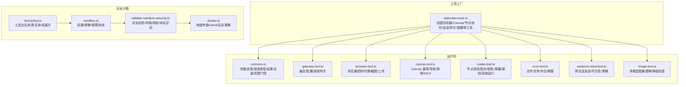

图表来源

- [openclaw-tools.ts:29-232](file://src/agents/openclaw-tools.ts#L29-L232)
- [common.ts:1-341](file://src/agents/tools/common.ts#L1-L341)
- [gateway-tool.ts:70-228](file://src/agents/tools/gateway-tool.ts#L70-L228)
- [browser-tool.ts:281-659](file://src/agents/tools/browser-tool.ts#L281-L659)
- [canvas-tool.ts:80-215](file://src/agents/tools/canvas-tool.ts#L80-L215)
- [nodes-tool.ts:164-800](file://src/agents/tools/nodes-tool.ts#L164-L800)
- [cron-tool.ts:210-526](file://src/agents/tools/cron-tool.ts#L210-L526)
- [sessions-send-tool.ts:35-361](file://src/agents/tools/sessions-send-tool.ts#L35-L361)
- [image-tool.ts:270-511](file://src/agents/tools/image-tool.ts#L270-L511)
- [tool-policy.ts:35-109](file://src/agents/sandbox/tool-policy.ts#L35-L109)
- [sandbox.ts:1-44](file://src/agents/sandbox.ts#L1-L44)
- [validate-sandbox-security.ts:272-306](file://src/agents/sandbox/validate-sandbox-security.ts#L272-L306)
- [docker.ts:317-344](file://src/agents/sandbox/docker.ts#L317-L344)

章节来源

- [openclaw-tools.ts:29-232](file://src/agents/openclaw-tools.ts#L29-L232)
- [sandbox.ts:1-44](file://src/agents/sandbox.ts#L1-L44)

## 核心组件

- 浏览器工具：支持本地/沙箱/节点代理三种目标，提供状态、启动/停止、标签页、截图、PDF、上传、对话框、动作执行等能力；自动路由到节点浏览器代理。
- Canvas 工具：在节点 Canvas 上进行呈现、隐藏、导航、脚本执行、快照与 A2UI 推送。
- 节点工具：节点发现/描述/待配对审批、系统通知、相机拍照/视频、相册最新照片、屏幕录制、位置获取、设备信息/权限/健康、系统运行（含审批流程）、通用命令调用。
- 定时工具：管理网关 Cron 作业（状态/列表/增删改/立即运行/历史），支持唤醒事件与提醒上下文注入。
- 会话工具：跨会话发送消息，内置可见性策略、A2A 策略与沙箱限制。
- 网关工具：重启网关（带延迟与原因）、查看/应用/补丁配置、执行网关更新（SIGUSR1）。
- 图像工具：多模型图像理解（含 MiniMax/VLM 降级回退），支持本地/数据/远程 URL，沙箱模式下路径校验与桥接读取。
- 通用运行时：参数读取、字符串/数组/数字解析、反应式参数、结果包装、图片结果生成、权限门控（仅限所有者）。

章节来源

- [browser-tool.ts:281-659](file://src/agents/tools/browser-tool.ts#L281-L659)
- [canvas-tool.ts:80-215](file://src/agents/tools/canvas-tool.ts#L80-L215)
- [nodes-tool.ts:164-800](file://src/agents/tools/nodes-tool.ts#L164-L800)
- [cron-tool.ts:210-526](file://src/agents/tools/cron-tool.ts#L210-L526)
- [sessions-send-tool.ts:35-361](file://src/agents/tools/sessions-send-tool.ts#L35-L361)
- [gateway-tool.ts:70-228](file://src/agents/tools/gateway-tool.ts#L70-L228)
- [image-tool.ts:270-511](file://src/agents/tools/image-tool.ts#L270-L511)
- [common.ts:1-341](file://src/agents/tools/common.ts#L1-L341)

## 架构总览

工具系统通过“工厂 + 运行时 + 沙箱”三层协同：

- 工厂层负责按需装配工具，注入会话、通道、工作区、沙箱桥接与策略。
- 运行时层统一处理参数、调用网关、封装结果、执行权限门控与可见性检查。
- 沙箱层通过容器与策略限制工具能力，防止越权与资源滥用。

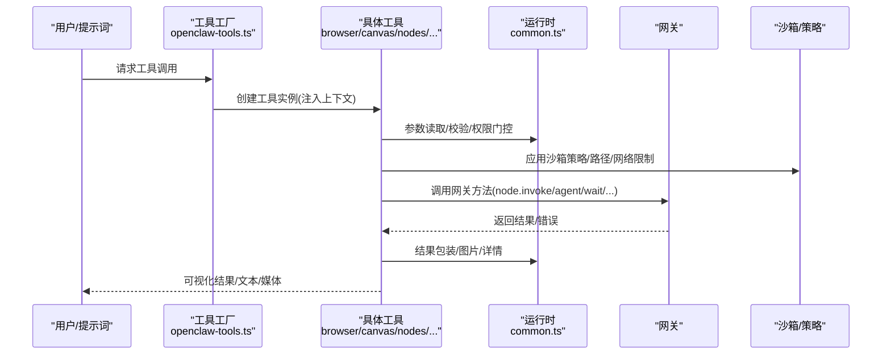

图表来源

- [openclaw-tools.ts:29-232](file://src/agents/openclaw-tools.ts#L29-L232)
- [common.ts:242-255](file://src/agents/tools/common.ts#L242-L255)
- [nodes.handlers.invoke-result.ts:25-71](file://src/gateway/server-methods/nodes.handlers.invoke-result.ts#L25-L71)

## 详细组件分析

### 浏览器工具（browser）

- 功能要点
  - 目标选择：支持本地主机、沙箱容器、节点代理三类目标；当存在节点且策略允许时自动路由至节点浏览器代理。
  - 基础操作：状态查询、启动/停止、标签页管理、焦点切换、关闭标签、导航、控制台、PDF 保存、上传与对话框钩子。
  - 高级能力：快照与截图、动作执行（点击/输入/滚动/等待等），支持 Playwright 风格的 ref 引用与稳定交互。
  - 文件代理：通过网关节点代理持久化上传文件与返回文件，避免直接暴露宿主文件系统。
- 安全与策略
  - 当启用沙箱且未提供桥接 URL 时，优先使用节点代理；否则根据策略决定是否允许主机控制。
  - Chrome 扩展接管场景强制使用主机 Chrome，避免跨环境混淆。
- 典型调用序列

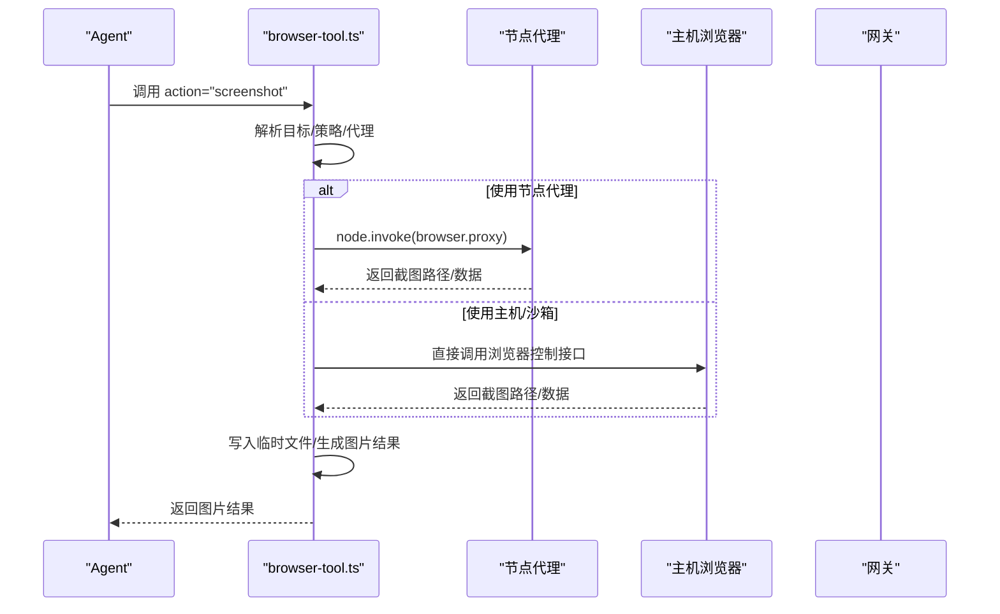

图表来源

- [browser-tool.ts:321-358](file://src/agents/tools/browser-tool.ts#L321-L358)
- [browser-tool.ts:490-522](file://src/agents/tools/browser-tool.ts#L490-L522)

章节来源

- [browser-tool.ts:281-659](file://src/agents/tools/browser-tool.ts#L281-L659)

### Canvas 工具（canvas）

- 功能要点
  - 在节点 Canvas 上呈现/隐藏页面、导航到指定 URL、执行 JavaScript、抓取快照并转为图片、推送 A2UI JSONL。
  - 支持输出格式（PNG/JPG）、最大宽度、质量与延迟参数。
- 安全与策略
  - 严格限制 JSONL 输入路径必须位于允许的本地根目录内，防止越权读取。
  - 快照结果写入临时文件并通过图片结果封装返回。
- 典型调用序列

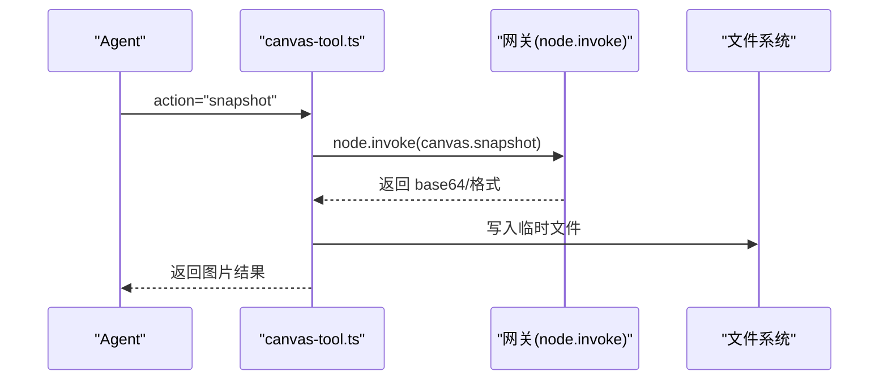

图表来源

- [canvas-tool.ts:162-193](file://src/agents/tools/canvas-tool.ts#L162-L193)

章节来源

- [canvas-tool.ts:80-215](file://src/agents/tools/canvas-tool.ts#L80-L215)

### 节点工具（nodes）

- 功能要点
  - 节点生命周期：状态查询、描述、待配对请求列表、批准/拒绝。
  - 系统通知：标题/正文/音效/优先级/投递方式。
  - 媒体采集：相机拍照（单/多方向）、相册最新照片、屏幕录制（含音频/帧率/索引）。
  - 设备信息：状态、信息、权限、健康度。
  - 系统运行：准备执行计划、发起执行、审批流程（超时/拒绝/允许一次/总是）。
  - 通用命令：invoke，支持媒体命令的显式动作映射以避免大体积 base64 上下文。
- 安全与策略
  - invoke 媒体命令默认受阻，建议使用专用动作以减少上下文膨胀。
  - 系统运行需要节点支持 system.run 并可能触发审批流程。
- 典型调用序列

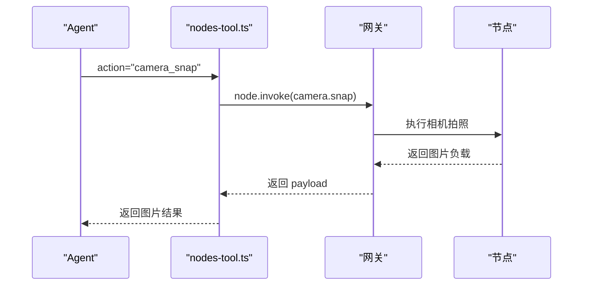

图表来源

- [nodes-tool.ts:239-331](file://src/agents/tools/nodes-tool.ts#L239-L331)

章节来源

- [nodes-tool.ts:164-800](file://src/agents/tools/nodes-tool.ts#L164-L800)

### 定时工具（cron）

- 功能要点
  - 管理 Cron 作业：状态、列表、新增、更新、删除、立即运行、历史查询。
  - 唤醒事件：支持“立即唤醒/下一心跳”两种模式。
  - 提醒上下文：可选注入最近对话片段作为系统事件文本的一部分。
  - 交付推断：根据会话键自动推断频道/接收方，支持 webhook 回调。
- 权限与约束
  - 仅限所有者调用；对 main 会话与 isolated 会话有不同约束。
- 典型调用序列

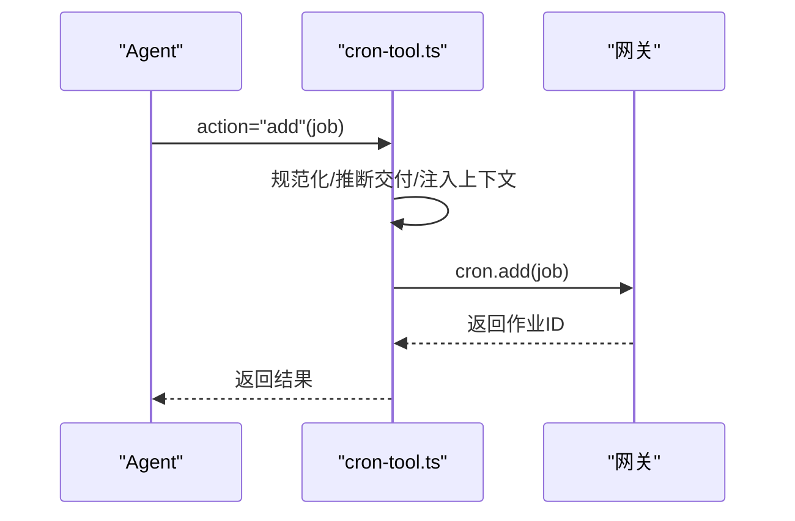

图表来源

- [cron-tool.ts:293-434](file://src/agents/tools/cron-tool.ts#L293-L434)

章节来源

- [cron-tool.ts:210-526](file://src/agents/tools/cron-tool.ts#L210-L526)

### 会话工具（sessions_send）

- 功能要点
  - 通过 sessionKey 或 label 定位目标会话，支持跨代理发送（A2A）。
  - 可见性策略与沙箱限制：限制仅能向可见/受信任会话发送；沙箱模式下仅允许同源派生会话。
  - 发送后可等待结果并提取最后一条助手回复作为简要反馈。
- 典型调用序列

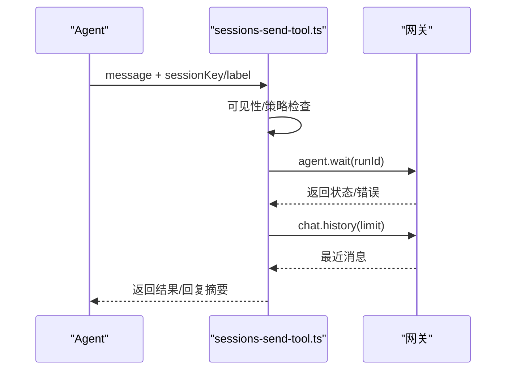

图表来源

- [sessions-send-tool.ts:197-358](file://src/agents/tools/sessions-send-tool.ts#L197-L358)

章节来源

- [sessions-send-tool.ts:35-361](file://src/agents/tools/sessions-send-tool.ts#L35-L361)

### 网关工具（gateway）

- 功能要点
  - 重启网关（支持延迟与原因），写入重启哨兵以便重启后向用户反馈。
  - 查看/应用/补丁配置，均在写入后触发重启；补丁模式支持基于快照哈希的安全合并。
  - 执行网关更新（SIGUSR1），支持超时与重启延时。
- 权限与约束
  - 仅限所有者调用；需开启重启命令开关。
- 典型调用序列

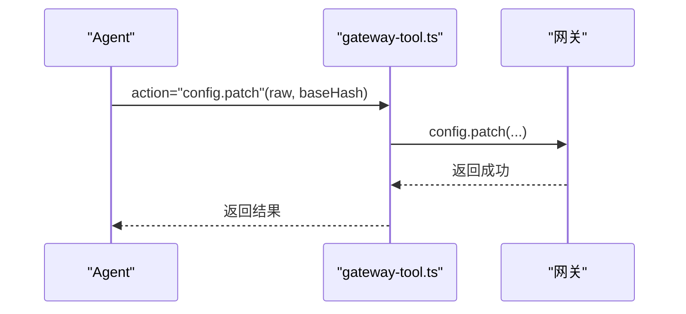

图表来源

- [gateway-tool.ts:197-207](file://src/agents/tools/gateway-tool.ts#L197-L207)

章节来源

- [gateway-tool.ts:70-228](file://src/agents/tools/gateway-tool.ts#L70-L228)

### 图像工具（image）

- 功能要点
  - 多模型图像理解，支持 OpenAI/Anthropic/MiniMax/VLM 等，具备降级回退能力。
  - 输入支持单图或多图（最多 20 张），支持本地路径、file://、data:、http(s) URL。
  - 沙箱模式下禁止远程 URL，路径通过桥接读取并进行安全校验。
- 典型调用序列

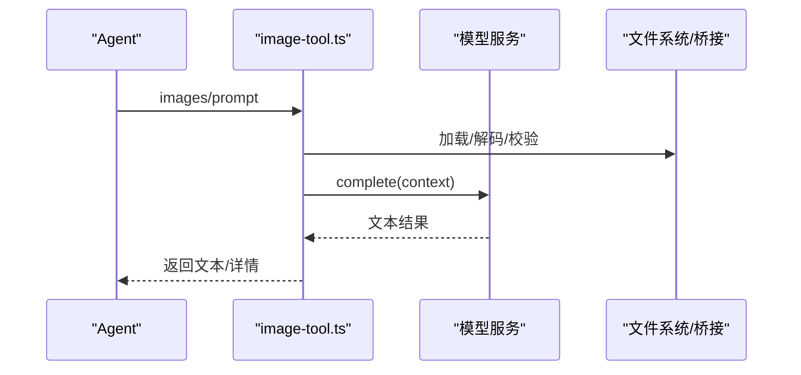

图表来源

- [image-tool.ts:484-508](file://src/agents/tools/image-tool.ts#L484-L508)

章节来源

- [image-tool.ts:270-511](file://src/agents/tools/image-tool.ts#L270-L511)

### 通用运行时（common）

- 功能要点
  - 参数读取：字符串/数组/数字/反应式参数，支持 snake_case 键兼容。
  - 结果包装：统一 JSON 文本与 details 明细；图片结果封装与尺寸/类型检测。
  - 权限门控：ownerOnly 标记与包装函数，限制仅限所有者调用。
- 典型调用序列

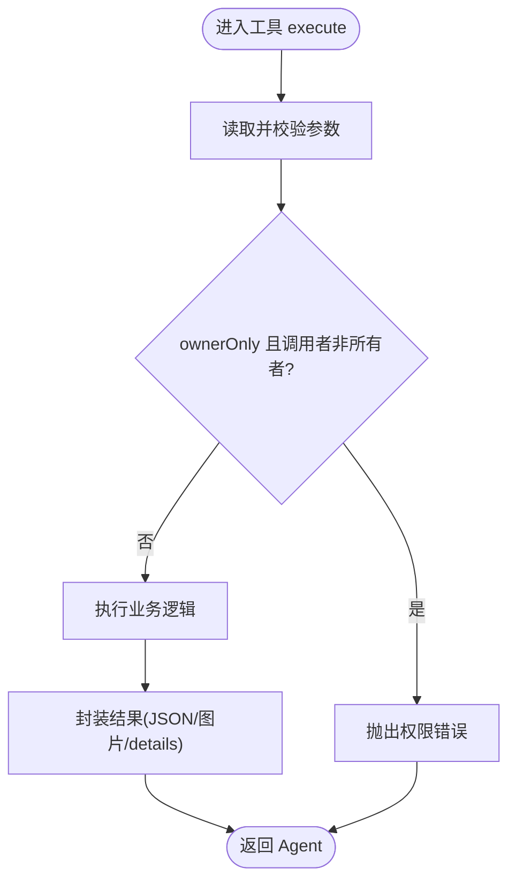

图表来源

- [common.ts:242-255](file://src/agents/tools/common.ts#L242-L255)
- [common.ts:230-240](file://src/agents/tools/common.ts#L230-L240)

章节来源

- [common.ts:1-341](file://src/agents/tools/common.ts#L1-L341)

## 依赖关系分析

- 工具工厂与运行时
  - 工具工厂统一创建各工具，注入上下文（会话键、通道、工作区、沙箱桥接、策略）；运行时提供参数解析、错误类型、结果包装与权限门控。
- 沙箱与策略
  - 工具策略通过 allow/deny 列表与组展开决定可用工具集；沙箱层通过容器镜像、网络模式、绑定挂载与 ulimit 等参数实施安全限制。
- 网关交互
  - 各工具最终通过网关方法（如 node.invoke、agent、cron._、config._）与后端通信；节点工具的 invoke 结果由网关回调处理。

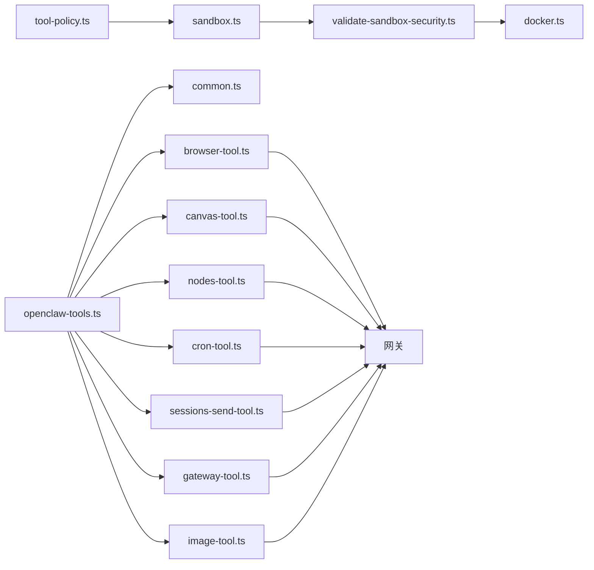

图表来源

- [openclaw-tools.ts:29-232](file://src/agents/openclaw-tools.ts#L29-L232)
- [tool-policy.ts:35-109](file://src/agents/sandbox/tool-policy.ts#L35-L109)
- [sandbox.ts:1-44](file://src/agents/sandbox.ts#L1-L44)
- [validate-sandbox-security.ts:272-306](file://src/agents/sandbox/validate-sandbox-security.ts#L272-L306)
- [docker.ts:317-344](file://src/agents/sandbox/docker.ts#L317-L344)

章节来源

- [openclaw-tools.ts:29-232](file://src/agents/openclaw-tools.ts#L29-L232)
- [tool-policy.ts:35-109](file://src/agents/sandbox/tool-policy.ts#L35-L109)
- [validate-sandbox-security.ts:272-306](file://src/agents/sandbox/validate-sandbox-security.ts#L272-L306)
- [docker.ts:317-344](file://src/agents/sandbox/docker.ts#L317-L344)

## 性能考量

- 结果封装与上下文大小
  - 节点工具的 invoke 默认阻止媒体命令，建议使用专用动作（如 camera_snap）以避免大体积 base64 上下文导致成本上升。
- 超时与重试
  - 各工具支持超时参数（如 cron、nodes、sessions_send），合理设置可避免长时间阻塞。
- 沙箱 I/O
  - 沙箱模式下的文件读取通过桥接完成，注意避免频繁小文件读写；批量处理与缓存可降低开销。
- 网络与代理
  - 浏览器工具在节点代理与主机之间切换时，应关注网络延迟与代理稳定性。

[本节为通用指导，不直接分析具体文件]

## 故障排查指南

- 节点 invoke 返回“配对所需”
  - 现象：报错包含“pairing required/not_paired”，并带有 requestId。
  - 处理：在网关 UI 中批准待配对请求，或使用 nodes.pending/approve/reject 管理。
- 节点 invoke 返回“媒体命令被阻止”
  - 现象：invokeCommand 返回媒体负载但被拦截。
  - 处理：改用专用动作（如 camera_snap/camera_clip/photos_latest/screen_record）。
- 沙箱模式下无法使用远程 URL
  - 现象：图像工具抛出“沙箱不允许远程 URL”。
  - 处理：改用本地路径或 data: URL；或在沙箱外运行该工具。
- 网关重启失败或被禁用
  - 现象：gateway.restart 抛出“命令未启用”。
  - 处理：检查配置中是否允许重启命令；确认调用者为所有者。
- 定时任务 webhook URL 不合法
  - 现象：配置 delivery.mode="webhook" 时 URL 无效。
  - 处理：确保 delivery.to 为有效的 http(s) URL。

章节来源

- [nodes-tool.ts:782-800](file://src/agents/tools/nodes-tool.ts#L782-L800)
- [image-tool.ts:424-426](file://src/agents/tools/image-tool.ts#L424-L426)
- [gateway-tool.ts:84-87](file://src/agents/tools/gateway-tool.ts#L84-L87)
- [cron-tool.ts:380-390](file://src/agents/tools/cron-tool.ts#L380-L390)

## 结论

OpenClaw 的工具系统以“工厂 + 运行时 + 沙箱”为核心，既保证了功能的丰富性与易用性，又通过严格的策略与安全校验实现了可控的权限边界。浏览器/Canvas/节点/定时/会话/网关/图像等工具覆盖了主流自动化与人机交互场景；通过统一的参数解析、结果封装与权限门控，开发者可以安全、稳定地扩展与集成新工具。

[本节为总结性内容，不直接分析具体文件]

## 附录

### 使用示例与配置选项

- 浏览器工具
  - 目标选择：target="sandbox/host/node"；profile="chrome/openclaw"。
  - 截图：action="screenshot"，支持 fullPage/ref/element/type。
  - 上传：action="upload"，传入 paths 数组与可选 ref/inputRef。
- Canvas 工具
  - 快照：action="snapshot"，支持 outputFormat/maxWidth/quality。
  - A2UI：action="a2ui_push"，传入 jsonl 或 jsonlPath。
- 节点工具
  - 相机：action="camera_snap/camera_clip"，支持 facing/quality/maxWidth/delayMs。
  - 屏幕录制：action="screen_record"，支持 fps/screenIndex/includeAudio。
  - 系统运行：action="run"，传入 command/cwd/env/超时参数。
- 定时工具
  - 新增：action="add"，传入 job 对象（name/schedule/payload/delivery/sessionTarget）。
  - 唤醒：action="wake"，传入 text 与 mode（now/next-heartbeat）。
- 会话工具
  - 发送：action="sessions_send"，传入 message 与 sessionKey/label。
- 网关工具
  - 配置补丁：action="config.patch"，传入 raw/baseHash/sessionKey/note/restartDelayMs。
- 图像工具
  - 分析：action="image"，传入 prompt/images/image 与 maxBytesMb/maxImages/model。

章节来源

- [browser-tool.ts:281-659](file://src/agents/tools/browser-tool.ts#L281-L659)
- [canvas-tool.ts:80-215](file://src/agents/tools/canvas-tool.ts#L80-L215)
- [nodes-tool.ts:164-800](file://src/agents/tools/nodes-tool.ts#L164-L800)
- [cron-tool.ts:210-526](file://src/agents/tools/cron-tool.ts#L210-L526)
- [sessions-send-tool.ts:35-361](file://src/agents/tools/sessions-send-tool.ts#L35-L361)
- [gateway-tool.ts:70-228](file://src/agents/tools/gateway-tool.ts#L70-L228)
- [image-tool.ts:270-511](file://src/agents/tools/image-tool.ts#L270-L511)

### 扩展开发指南

- 插件 SDK
  - 通过 OpenClawPluginApi.registerTool 注册工具；使用 OpenClawPluginApi.config 与 OpenClawPluginApi.logger 获取配置与日志。
  - 参考测试夹具工具工厂以验证工具解析与调用。
- 工具注册与解析
  - 工具工厂会去重已有工具名，支持 allowlist 控制插件工具加载。
- 安全与策略
  - 优先遵循工具策略（allow/deny）与沙箱限制；必要时在工具内部补充参数校验与路径白名单。
- 结果处理
  - 使用 jsonResult 包装结构化数据；使用 imageResult/imageResultFromFile 返回图片；在多模态场景下注意上下文大小控制。

章节来源

- [plugin-sdk/index.ts:1-826](file://src/plugin-sdk/index.ts#L1-L826)
- [tool-factory-test-harness.ts:37-76](file://extensions/feishu/src/tool-factory-test-harness.ts#L37-L76)
- [openclaw-tools.ts:210-229](file://src/agents/openclaw-tools.ts#L210-L229)

### 安全与审计

- 沙箱安全校验
  - 禁止 host 网络模式、容器命名空间加入、危险绑定挂载、不受信的 seccomp/apparmor 策略。
- 策略生效顺序
  - 以“最严格者优先”原则：工具策略与沙箱策略叠加，最终以更严格的为准。
- 审计报告
  - 配置审计会标记危险项（如危险绑定/网络/安全策略），建议修复后重新部署。

章节来源

- [validate-sandbox-security.ts:283-306](file://src/agents/sandbox/validate-sandbox-security.ts#L283-L306)
- [docker.ts:331-344](file://src/agents/sandbox/docker.ts#L331-L344)
- [pi-tools-agent-config.test.ts:570-608](file://src/agents/pi-tools-agent-config.test.ts#L570-L608)
- [audit.test.ts:1027-1088](file://src/security/audit.test.ts#L1027-L1088)
