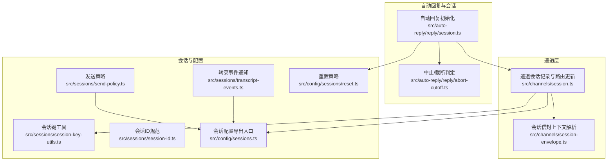
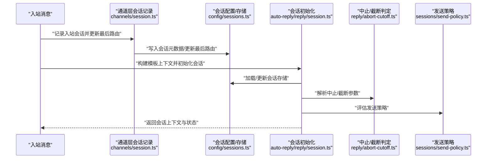
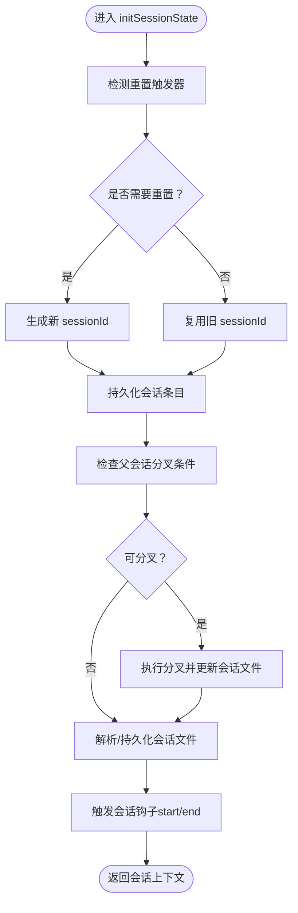
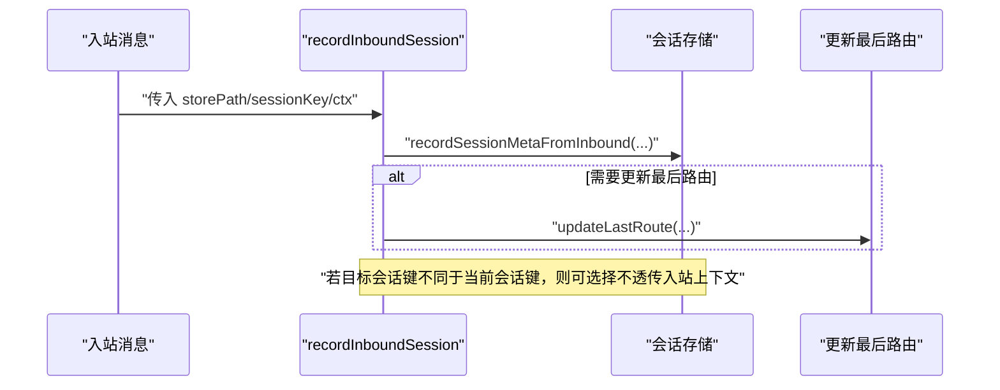
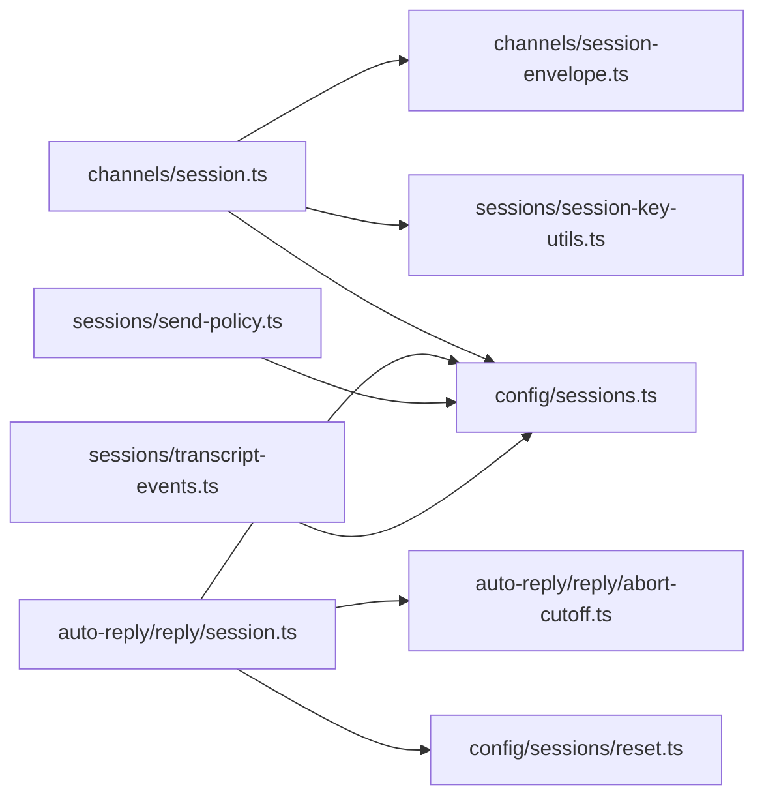

# 会话工具

<cite>
**本文引用的文件**
- [session.ts](file://src/auto-reply/reply/session.ts)
- [session.ts（通道层）](file://src/channels/session.ts)
- [session-envelope.ts](file://src/channels/session-envelope.ts)
- [abort-cutoff.ts](file://src/auto-reply/reply/abort-cutoff.ts)
- [session-key-utils.ts](file://src/sessions/session-key-utils.ts)
- [session-id.ts](file://src/sessions/session-id.ts)
- [transcript-events.ts](file://src/sessions/transcript-events.ts)
- [send-policy.ts](file://src/sessions/send-policy.ts)
- [sessions.ts（导出入口）](file://src/config/sessions.ts)
- [reset.ts（会话重置策略）](file://src/config/sessions/reset.ts)
- [session.test.ts](file://src/channels/session.test.ts)
- [session-management-compaction.md](file://docs/reference/session-management-compaction.md)
</cite>

## 目录

1. [引言](#引言)
2. [项目结构](#项目结构)
3. [核心组件](#核心组件)
4. [架构总览](#架构总览)
5. [详细组件分析](#详细组件分析)
6. [依赖关系分析](#依赖关系分析)
7. [性能考量](#性能考量)
8. [故障排查指南](#故障排查指南)
9. [结论](#结论)
10. [附录：配置与扩展指南](#附录配置与扩展指南)

## 引言

本文件系统性阐述 OpenClaw 的“会话工具”能力，聚焦于会话管理、消息路由、自动回复、上下文维护与会话生命周期控制。文档从架构到实现细节逐层展开，并结合流程图与类图帮助读者快速理解各模块职责、数据流与交互方式；同时提供配置要点、性能优化建议与扩展开发指引，便于在多渠道、多用户场景下稳定落地。

## 项目结构

围绕会话工具的关键目录与文件如下：

- 自动回复与会话初始化：src/auto-reply/reply/session.ts
- 通道层会话记录与路由更新：src/channels/session.ts
- 会话信封上下文解析：src/channels/session-envelope.ts
- 中止/截断判定（用于自动回复流程控制）：src/auto-reply/reply/abort-cutoff.ts
- 会话键与线程/子代理识别：src/sessions/session-key-utils.ts
- 会话 ID 规范与校验：src/sessions/session-id.ts
- 会话转录事件通知：src/sessions/transcript-events.ts
- 发送策略决策：src/sessions/send-policy.ts
- 会话配置与重置策略：src/config/sessions.ts、src/config/sessions/reset.ts
- 单元测试与行为验证：src/channels/session.test.ts
- 参考文档：docs/reference/session-management-compaction.md

图表来源

- [session.ts:1-642](file://src/auto-reply/reply/session.ts#L1-L642)
- [session.ts（通道层）:1-82](file://src/channels/session.ts#L1-L82)
- [session-envelope.ts:1-21](file://src/channels/session-envelope.ts#L1-L21)
- [abort-cutoff.ts:1-40](file://src/auto-reply/reply/abort-cutoff.ts#L1-L40)
- [session-key-utils.ts:1-133](file://src/sessions/session-key-utils.ts#L1-L133)
- [session-id.ts:1-6](file://src/sessions/session-id.ts#L1-L6)
- [transcript-events.ts:1-30](file://src/sessions/transcript-events.ts#L1-L30)
- [send-policy.ts:1-124](file://src/sessions/send-policy.ts#L1-L124)
- [sessions.ts（导出入口）:1-14](file://src/config/sessions.ts#L1-L14)
- [reset.ts（会话重置策略）:84-176](file://src/config/sessions/reset.ts#L84-L176)

章节来源

- [session.ts:1-642](file://src/auto-reply/reply/session.ts#L1-L642)
- [session.ts（通道层）:1-82](file://src/channels/session.ts#L1-L82)
- [session-envelope.ts:1-21](file://src/channels/session-envelope.ts#L1-L21)
- [abort-cutoff.ts:1-40](file://src/auto-reply/reply/abort-cutoff.ts#L1-L40)
- [session-key-utils.ts:1-133](file://src/sessions/session-key-utils.ts#L1-L133)
- [session-id.ts:1-6](file://src/sessions/session-id.ts#L1-L6)
- [transcript-events.ts:1-30](file://src/sessions/transcript-events.ts#L1-L30)
- [send-policy.ts:1-124](file://src/sessions/send-policy.ts#L1-L124)
- [sessions.ts（导出入口）:1-14](file://src/config/sessions.ts#L1-L14)
- [reset.ts（会话重置策略）:84-176](file://src/config/sessions/reset.ts#L84-L176)

## 核心组件

- 会话初始化与状态机：负责解析消息上下文、计算会话键、决定是否重置、生成/复用 sessionId、维护发送策略与交付上下文、触发会话钩子等。
- 通道层会话记录：在入站消息到达时，写入会话元数据并可选更新“最后路由”，支持主 DM 路由保护等逻辑。
- 会话信封上下文：基于配置解析会话存储路径与前次时间戳，用于判断会话新鲜度与重置时机。
- 中止/截断判定：从消息上下文提取消息标识与时间戳，用于自动回复流程中的中断/截断控制。
- 会话键工具：解析会话键、推断聊天类型、识别线程/子代理/ACp 等标识，辅助路由与策略决策。
- 发送策略：根据会话键、渠道、聊天类型与规则集，决定允许或拒绝发送。
- 会话转录事件：提供会话转录文件变更的发布订阅接口，供外部监听。

章节来源

- [session.ts:190-641](file://src/auto-reply/reply/session.ts#L190-L641)
- [session.ts（通道层）:41-81](file://src/channels/session.ts#L41-L81)
- [session-envelope.ts:5-20](file://src/channels/session-envelope.ts#L5-L20)
- [abort-cutoff.ts:12-39](file://src/auto-reply/reply/abort-cutoff.ts#L12-L39)
- [session-key-utils.ts:12-132](file://src/sessions/session-key-utils.ts#L12-L132)
- [send-policy.ts:53-123](file://src/sessions/send-policy.ts#L53-L123)
- [transcript-events.ts:9-29](file://src/sessions/transcript-events.ts#L9-L29)

## 架构总览

下图展示了从消息入站到会话初始化、路由更新与自动回复的端到端流程：

图表来源

- [session.ts（通道层）:41-81](file://src/channels/session.ts#L41-L81)
- [sessions.ts（导出入口）:1-14](file://src/config/sessions.ts#L1-L14)
- [session.ts:190-641](file://src/auto-reply/reply/session.ts#L190-L641)
- [abort-cutoff.ts:12-39](file://src/auto-reply/reply/abort-cutoff.ts#L12-L39)
- [send-policy.ts:53-123](file://src/sessions/send-policy.ts#L53-L123)

## 详细组件分析

### 组件A：会话初始化与状态管理

- 职责
  - 解析消息上下文，决定是否触发重置（如 /new、/reset），并生成新的 sessionId 或复用旧会话。
  - 维护发送策略、交付上下文（渠道/收件人/账号/线程）、聊天类型、显示名等元信息。
  - 支持父会话分叉（线程/话题）并进行上下文大小检查，避免过载。
  - 在会话切换时触发 session_start/session_end 钩子，支持插件扩展。
- 关键流程
  - 重置触发检测：区分命令授权、群聊去提及、默认触发器集合。
  - 新会话生成：随机 UUID，保留用户设置的行为覆盖项。
  - 会话文件解析与持久化：确保会话转录文件路径正确并落盘。
  - 旧会话归档：防止磁盘占用增长。
- 复杂度与性能
  - 加载/更新会话存储采用“跳过缓存”策略以避免跨进程/平台时间戳粒度导致的错误，保证 sessionId 一致性。
  - 分叉/归档操作为 O(1) 写入，主要开销在 I/O 与磁盘预算检查。

图表来源

- [session.ts:190-641](file://src/auto-reply/reply/session.ts#L190-L641)

章节来源

- [session.ts:190-641](file://src/auto-reply/reply/session.ts#L190-L641)

### 组件B：通道层会话记录与路由更新

- 职责
  - 入站消息到达时，写入会话元数据（如首次触达时间、聊天类型等）。
  - 可选更新“最后路由”（渠道/收件人/账号/线程），支持主 DM 路由保护（避免将入站来源泄漏到其他会话）。
- 关键点
  - 支持按需创建会话条目。
  - 对不同会话键进行规范化，避免重复或不一致。
  - 当目标会话键与当前会话键不一致时，可选择不传递入站上下文，防止污染目标会话。

图表来源

- [session.ts（通道层）:41-81](file://src/channels/session.ts#L41-L81)

章节来源

- [session.ts（通道层）:41-81](file://src/channels/session.ts#L41-L81)

### 组件C：会话信封上下文解析

- 职责
  - 基于配置解析会话存储路径与前次更新时间戳，用于判断会话新鲜度与重置时机。
- 关键点
  - 存储路径按 agentId 作用域隔离。
  - 通过上次更新时间戳参与“每日/空闲”重置策略评估。

章节来源

- [session-envelope.ts:5-20](file://src/channels/session-envelope.ts#L5-L20)

### 组件D：中止/截断判定

- 职责
  - 从消息上下文提取消息 SID 与时间戳，作为自动回复流程中的中止/截断依据。
- 关键点
  - 若上下文中未提供有效标识，则判定为不启用中止/截断。

章节来源

- [abort-cutoff.ts:12-39](file://src/auto-reply/reply/abort-cutoff.ts#L12-L39)

### 组件E：会话键工具与线程/子代理识别

- 职责
  - 解析 agent 作用域会话键，推断聊天类型（直接/群组/频道/未知）。
  - 识别 Cron、子代理、ACp、线程等特殊键格式，支持父会话键解析与深度计算。
- 关键点
  - 所有解析均大小写不敏感并标准化，保证比较与路由稳定性。
  - 提供线程标记解析，支持话题/主题型会话的父子关系。

章节来源

- [session-key-utils.ts:12-132](file://src/sessions/session-key-utils.ts#L12-L132)

### 组件F：发送策略

- 职责
  - 根据会话条目、会话键、渠道、聊天类型与规则集，决定允许或拒绝发送。
- 关键点
  - 支持显式覆盖、键前缀匹配、原始键前缀匹配、默认策略等。
  - 优先级：条目级覆盖 > 配置规则 > 默认策略。

章节来源

- [send-policy.ts:53-123](file://src/sessions/send-policy.ts#L53-L123)

### 组件G：会话转录事件

- 职责
  - 提供会话转录文件更新的发布/订阅机制，监听器在收到更新后可执行相应动作（如清理、备份、通知）。
- 关键点
  - 监听器异常被吞掉，不影响主流程。

章节来源

- [transcript-events.ts:9-29](file://src/sessions/transcript-events.ts#L9-L29)

## 依赖关系分析

- 模块耦合
  - 通道层依赖会话配置与存储（写入元数据/更新路由）。
  - 自动回复初始化依赖会话配置、重置策略、分叉与转录路径解析。
  - 会话键工具与发送策略共同服务于路由与策略决策。
- 外部依赖
  - 文件系统：会话存储、转录文件持久化。
  - 插件钩子：会话开始/结束事件。
- 循环依赖
  - 未见循环依赖迹象；各模块职责清晰，通过配置与工具函数解耦。

图表来源

- [session.ts（通道层）:1-82](file://src/channels/session.ts#L1-L82)
- [session.ts:1-642](file://src/auto-reply/reply/session.ts#L1-L642)
- [session-envelope.ts:1-21](file://src/channels/session-envelope.ts#L1-L21)
- [abort-cutoff.ts:1-40](file://src/auto-reply/reply/abort-cutoff.ts#L1-L40)
- [session-key-utils.ts:1-133](file://src/sessions/session-key-utils.ts#L1-L133)
- [send-policy.ts:1-124](file://src/sessions/send-policy.ts#L1-L124)
- [transcript-events.ts:1-30](file://src/sessions/transcript-events.ts#L1-L30)
- [sessions.ts（导出入口）:1-14](file://src/config/sessions.ts#L1-L14)
- [reset.ts（会话重置策略）:84-176](file://src/config/sessions/reset.ts#L84-L176)

章节来源

- [session.ts（通道层）:1-82](file://src/channels/session.ts#L1-L82)
- [session.ts:1-642](file://src/auto-reply/reply/session.ts#L1-L642)
- [session-envelope.ts:1-21](file://src/channels/session-envelope.ts#L1-L21)
- [abort-cutoff.ts:1-40](file://src/auto-reply/reply/abort-cutoff.ts#L1-L40)
- [session-key-utils.ts:1-133](file://src/sessions/session-key-utils.ts#L1-L133)
- [send-policy.ts:1-124](file://src/sessions/send-policy.ts#L1-L124)
- [transcript-events.ts:1-30](file://src/sessions/transcript-events.ts#L1-L30)
- [sessions.ts（导出入口）:1-14](file://src/config/sessions.ts#L1-L14)
- [reset.ts（会话重置策略）:84-176](file://src/config/sessions/reset.ts#L84-L176)

## 性能考量

- I/O 与缓存
  - 会话存储加载强制“跳过缓存”，避免跨进程/平台时间戳粒度问题引发的 sessionId 错误，确保一致性但增加 I/O 成本。
- 重置与归档
  - 每次重置或每日重置都会触发旧会话转录归档，注意磁盘空间与压缩策略。
- 分叉与上下文窗口
  - 父会话过大时跳过分叉，避免线程会话立即溢出；合理设置父会话分叉最大 token 数阈值。
- 发送策略
  - 规则匹配为线性扫描，建议精简规则数量与前缀长度，减少不必要的匹配成本。

## 故障排查指南

- 重置未生效
  - 检查重置触发器是否被授权，以及是否命中默认触发器集合；确认群聊场景已去除提及后再匹配。
- 会话 ID 不一致
  - 确认是否启用了“跳过缓存”的加载策略；避免多进程并发写入导致的 mtime 粒度问题。
- 最后路由错误
  - 确认目标会话键与当前会话键是否一致；当不一致时，通道层可能不会透传入站上下文。
- 发送被拒绝
  - 检查发送策略规则与默认策略；核对会话键前缀、原始键前缀、渠道与聊天类型匹配条件。
- 单元测试参考
  - 可参考通道层会话记录测试，验证不同会话键下的行为差异与最后路由更新逻辑。

章节来源

- [session.test.ts:12-38](file://src/channels/session.test.ts#L12-L38)
- [session.ts:257-316](file://src/auto-reply/reply/session.ts#L257-L316)
- [send-policy.ts:84-123](file://src/sessions/send-policy.ts#L84-L123)

## 结论

OpenClaw 的会话工具通过“通道层记录 + 自动回复初始化 + 策略与配置”的组合，实现了稳定、可扩展的多渠道会话管理。其核心优势在于：

- 明确的会话生命周期与重置策略（每日/空闲/命令触发）
- 可靠的会话键解析与线程/子代理识别
- 灵活的发送策略与路由更新
- 完整的转录事件通知与归档机制

在实际部署中，建议结合业务场景优化规则集、磁盘预算与分叉阈值，并通过单元测试与日志监控保障稳定性。

## 附录：配置与扩展指南

- 会话重置策略与规则
  - 支持按类型（直接/群组/频道）、按渠道、每日重置时间与空闲分钟数等维度配置。
  - 参考：[session-management-compaction.md:126-139](file://docs/reference/session-management-compaction.md#L126-L139)
- 会话键与线程/子代理识别
  - 使用会话键工具进行解析与分类，便于路由与策略决策。
  - 参考：[session-key-utils.ts:12-132](file://src/sessions/session-key-utils.ts#L12-L132)
- 发送策略
  - 建议按渠道/聊天类型/键前缀分层设计规则，避免过度匹配。
  - 参考：[send-policy.ts:53-123](file://src/sessions/send-policy.ts#L53-L123)
- 会话初始化与钩子
  - 在会话开始/结束时触发插件钩子，便于扩展审计、告警与统计。
  - 参考：[session.ts:594-621](file://src/auto-reply/reply/session.ts#L594-L621)
- 通道层记录与路由
  - 入站消息到达时写入元数据并可选更新最后路由，支持主 DM 路由保护。
  - 参考：[session.ts（通道层）:41-81](file://src/channels/session.ts#L41-L81)
